## 库、文件与搜索

上一篇《界面与设置全导览》把界面的每个区域和设置页都认了一遍，这一篇往下挖一层，回答三个新手最容易纠结的问题：库到底是什么、要不要分成多个库、笔记该用什么方式组织。回答完这三个问题，再把全局搜索、快速切换和书签这三件“找东西”的工具配齐。

读完这一篇，你会对自己这座库的底层结构完全有数：每个文件在哪、为什么在那里、想找的时候怎么一步找到。

《认识与装好》定下的零成本记账继续记：本篇只用官方内置能力，花费 0 元。

### 3.1 库=文件夹讲透

《认识与装好》建库时给过一个结论：一座库就是你硬盘上的一个普通文件夹。当时只是点到为止，这一节把它讲透——课程后面的同步、备份、搬家，直到让 AI 帮你整理笔记库，全都建立在这个事实上，值得花十分钟彻底弄明白。

**两边对照看一遍**——先做个小实验。一边打开 Obsidian 的文件列表，另一边在资源管理器里打开库文件夹。忘了库建在哪的话，可以在文件列表的任意文件上单击右键，菜单里通常有“在系统资源管理器中显示”一类入口（名称以实机为准）。两边逐一对照：你在 Obsidian 里看到的每篇笔记，都是文件夹里的一个 .md 文件；你建的每个子文件夹，两边也一一对应。反过来同样成立：在资源管理器里直接放进一个 .md 文件，回到 Obsidian，文件列表里它已经出现了——官方帮助对这个行为有明确说法：Obsidian 会自动刷新库，跟上外部改动。也就是说，Obsidian 对这个文件夹没有任何“独占权”，它只是替你管理，你随时可以绕过它直接操作文件。

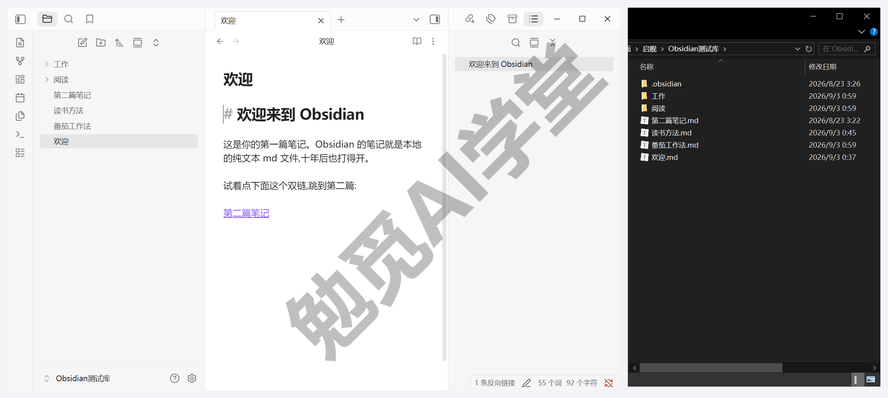

**.obsidian：这座库的设置箱**——仔细看资源管理器那边，除了你写的笔记，还有一个名为 .obsidian 的文件夹。《认识与装好》里提过它一次，现在正式介绍：这里面装的不是笔记，而是这座库的全部专属配置——界面与编辑设置、快捷键、主题、核心插件的开关状态、以后要装的第三方插件，连同你摆好的窗口布局，都记录在里面。如果在资源管理器里看不到它，是系统默认隐藏了以英文句点开头的文件夹，打开资源管理器的“显示隐藏的项目”就能看到（以实际系统设置为准）。

关于 .obsidian，记住三件事就够用了：

- 日常完全不用动它，里面的内容由 Obsidian 自己维护，你正常改设置、装插件，它就自动更新；
- 真把它删了，笔记一篇都不会少，但这座库的个性化设置会回到默认状态（下次打开时会重建，以实际表现为准），所以备份时把它一起备走，设置也能原样回来；
- 它还能整体搬家：官方帮助的推荐做法是把 .obsidian 整个复制到另一座库的根目录，那座库就得到一套一模一样的设置，通常重启一次生效。

至于多台设备同步时 .obsidian 要不要跟着一起同步——那里面有冲突的坑，《同步与备份全解》会专门讲，现在不用管它。

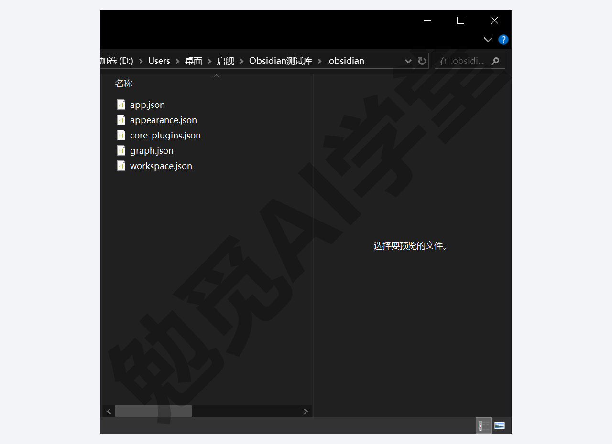

**每座库各自独立**——一座库配一个 .obsidian，直接推出一个结论：库和库之间的设置、主题、插件互不影响。《认识与装好》提过一句“每座库的设置和插件是各自独立的”，原理就在这里。这种独立性带来一个很实用的做法：专门建一座“试验库”，想试的主题、拿不准的插件先在里面折腾，满意了再回主库配置，主库永远干干净净。切换库的入口在左侧边栏底部——显示当前库名的那一项，点开就能切换或打开其他库。顺带说明：Obsidian 的官方中文常把库译作“仓库”，界面上看到“仓库”二字，和课程说的“库”是同一个东西。

**附件也是库内文件**——往笔记里粘贴的图片、拖进来的 PDF，同样会作为文件存进库文件夹，默认放在库的根目录。存放位置可以改：设置 → 文件与链接里有“附件默认存放路径”一项，可选仓库的根目录、当前文件所在的文件夹、当前文件所在文件夹下指定的子文件夹、指定的文件夹四种方案。归置的规矩本身三句话就说全——怎么进来：图片不用手动导入，复制后在笔记里直接 Ctrl+V 粘贴，文件自动存进库并在光标处插入；放哪：建议在上面那项设置里给附件指一个专门的文件夹（比如“附件”），不让图片和笔记挤在一起；怎么不弄丢：附件在库文件夹里，跟着库一起备份、一起搬家，只要别去引用库外的图片路径（换台电脑就断），就丢不了。重要的图顺手把自动生成的文件名改成能看懂的名字，将来搜得到。

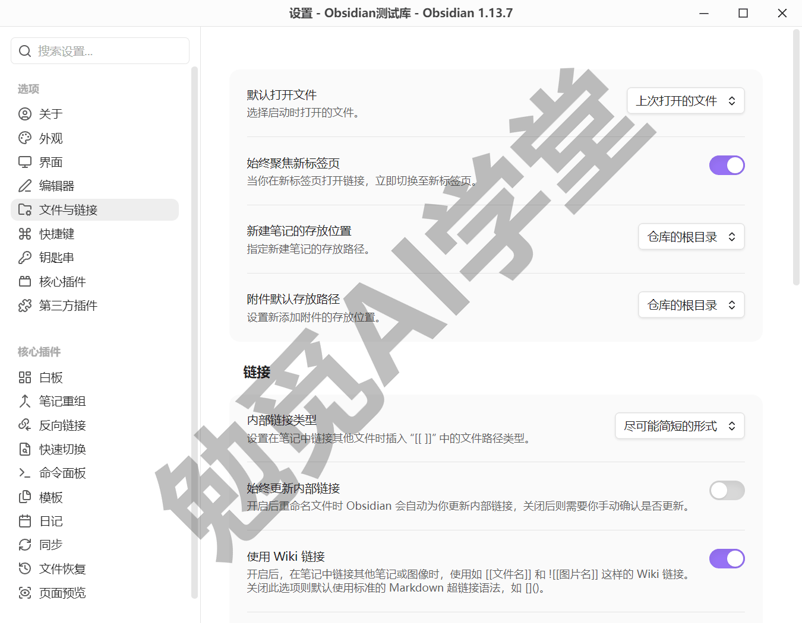

这一节的结论浓缩成一句：库=文件夹不是比喻，是字面事实。《认识与装好》说的“数据完全自有”——数据在你硬盘上、想备份就复制、想走随时带走——落到实处，就落在这个普通文件夹上。

### 3.2 要不要分多个库

装好没几天，很多人就会冒出这个念头：工作建一个库、生活建一个库、学习再建一个库，条理多清楚。这是新手问得最多的问题之一，《认识与装好》建库时给过简短结论：先不分，单库起步。这一节把理由讲全，也讲清什么情况下才真的值得分。

**先算清多库的三笔代价。**

第一笔：链接和搜索跨不了库。双链、反向链接、图谱、全局搜索，作用范围都是“当前打开的这一座库”。拆成两座，两边的内容彼此完全不可见——工作库里记的方法论，生活库里链不到它，也搜不到它。而知识偏偏最容易跨界：工作里学的沟通技巧、生活里读的心理学，本来可以连成一张网，分库等于亲手把网剪断。

第二笔：设置和插件要成倍维护。上一节刚讲过库级独立——每座库一套 .obsidian。独立在“试验库”场景里是优点，在“多库并用”场景里就变成成本：每装一个插件、每调一处设置、每换一个主题，都要在每座库里重做一遍。

第三笔：每次记笔记多一道选择题。动笔之前先想“这条该进哪个库”，看似小事，积累起来足以磨掉记录的意愿——尤其是那些工作生活说不清的内容，比如通勤路上想到的点子，放哪边都别扭。

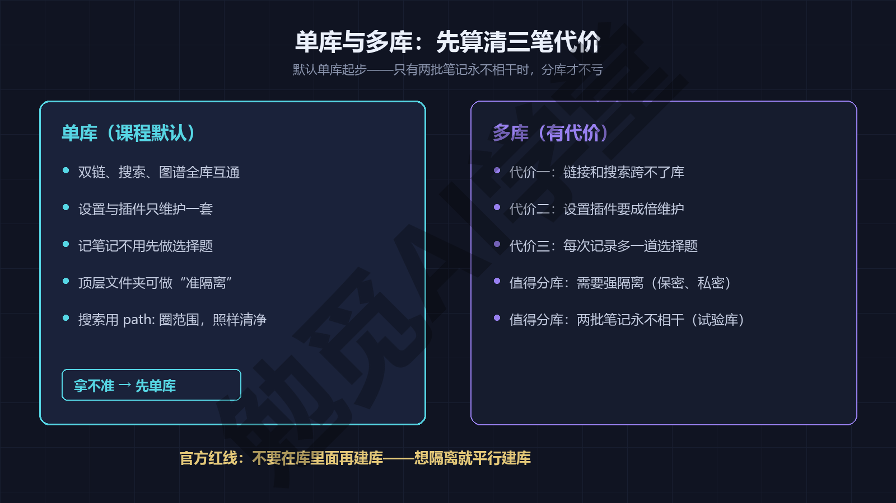

**什么时候才值得分库。** 代价这么明显，分库仍有正当场景，判断标准也不复杂：

- 需要强隔离的时候。比如公司有保密要求，工作笔记不能和私人内容放在同一处；或者某类笔记的私密程度特别高（比如日记），你希望它物理上单独存放、单独备份。
- 两批笔记确定永不相干的时候。一个可以直接套用的判断句：只有当两批笔记之间永远不需要互相链接、互相搜索时，分库才不亏。上一节说的“试验库”就是典型——它装的是测试数据，和你的知识毫无关系，分出去只有好处。

拿不准的，先单库。单库起步不会把你锁死：将来真要分，把某个文件夹整个搬出去，再用库管理画面的“打开本地仓库”（《认识与装好》首次启动时认过的入口）把它变成新库就行，只是原先指向外部的链接会断，要花点功夫处理；反过来把两座库合回一座，要处理重名笔记和链接冲突，麻烦得多。从单库走向多库随时可行，回头路却不好走——这是“默认单库”更深一层的理由。

还有一个折中方案，能拿到多库的大半好处而不付那三笔代价：在单库内部用顶层文件夹做“准隔离”。工作、生活各设一个顶层文件夹，平时各写各的，互不打扰；要找工作内容时，用 3.5 会讲的 path: 操作符把搜索范围圈进“工作”文件夹，清净程度和分库相差无几。而当某条生活里的灵感确实和工作有关时，一条双链就能把两边连起来——这正是真分库做不到的事。

最后一条官方红线：不要在库里面再建库。官方帮助明确不建议嵌套——内部链接的作用范围以单座库为界，嵌套之后链接可能无法正确更新。想隔离就平行建库，不要一座套一座。

### 3.3 文件夹、标签与双链怎么选

从传统笔记工具或者办公文件夹过来的人，第一反应往往是：先设计一套完美的文件夹分类，再开始记笔记。然后某一天，一篇《卡片笔记写作法》的读书笔记让你卡住了——放“阅读”文件夹，还是放“写作方法”文件夹？它明明两边都沾。这种“分类焦虑”的根源很简单：一篇笔记天然有好几个维度，而一个文件只能待在一个文件夹里。

Obsidian 给了三种组织方式，各管一个维度，互不重叠。

**文件夹——唯一归属。** 一篇笔记只能待在一个文件夹里，这个限制反而是它的长处：适合做粗颗粒、稳定不变的分类，比如按大领域或大项目分出几个顶层文件夹。它最直观，和资源管理器里看到的一模一样，还能配合下一节的 path: 搜索圈定范围。它的边界也清楚：一旦你想让一篇笔记“同时属于两类”，文件夹就做不到了——这时候要靠别的工具。

**标签——多维状态。** 一篇笔记可以同时打好几个标签，#书/在读、#写作、#方法论，互不冲突。会变的、会叠加的维度——读没读完、属于什么主题、处于什么状态——交给标签最合适。标签体系怎么规划、怎么和属性配合，《标签与属性》整篇专讲，这里先记住它的定位。

**双链——网状关联。**《认识与装好》三连任务里你已经链出过第二篇笔记：笔记之间互相指认，回答的是“这篇和谁有关”。它不需要预先设计任何体系，写到哪、想到谁、就链谁，知识网络就这样一点点连起来。双链家族的完整玩法在《双链与图谱》。

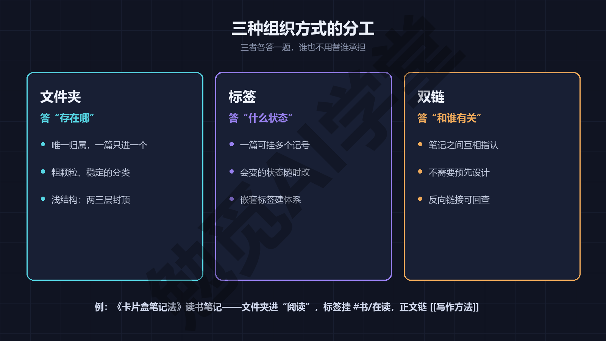

**本课的组织路线在这里一次定调**，后面各篇都按这个分工展开，不再重复论证：文件夹保持浅结构，两三层封顶，只做粗归属；会变的状态维度交给标签与属性；知识之间的关联交给双链。三者各答一题——文件夹答“存在哪”，标签答“什么状态”，双链答“和谁有关”。

拿开头那篇卡住的笔记走一遍，你就知道焦虑是怎么消失的。《卡片笔记写作法》读书笔记：文件夹进“阅读”，因为它的稳定身份是一篇读书笔记；打上 #书/在读，这是会变的状态，读完改成 #书/读完；正文里链上 [[写作方法]]，这是它和其他知识的关联。三个维度各就各位，“放阅读还是放写作方法”这个问题本身就消失了——归属给了阅读，关联给了写作方法，两边都没丢。

三种方式也各有典型的误用，提前打个预防针。文件夹的误用是建出五六层的深树，试图给每篇笔记规划一个精确到毫米的位置，结果是自己都记不住路径；标签的误用是把它当文件夹使，一口气造出上百个标签，每个只用一两次，检索价值趋近于零；双链的误用是为链而链，把毫不相干的笔记也连上，网看着织得密，实际一条有用的路径都提供不了。记住各自的定位——归属、状态、关联——就不容易走偏。

一句话总结这一节：分类焦虑的解法，不是设计更精巧的文件夹树，而是别让文件夹独自承担三个维度的任务。

### 3.4 Wikilink 与 Markdown 链接怎么选

《认识与装好》里你用两个方括号链出过第二篇笔记，那种 [[笔记名]] 写法叫 Wikilink（官方中文帮助写作“Wiki 链接”），是 Obsidian 的默认链接格式。其实链接还有第二种写法，两者之间藏着一个影响深远的选择题，这一节把它摆上台面。

**先把两种写法摆在一起看。** 下面两行写法等价——编辑器里显示效果相同，点开都是同一篇笔记：

```
[[卡片盒笔记法]]
[卡片盒笔记法](卡片盒笔记法.md)
```

第一行是 Wikilink；第二行是标准 Markdown 链接，方括号里是显示文字，圆括号里是目标文件。Wikilink 改显示文字、链到小节这些写法细节，《双链与图谱》讲双链时给全；标准链接的对应写法在姊妹篇《Markdown 通用语法手册》的《基本语法》篇。反向链接、嵌入这些玩法同样在《双链与图谱》——这一节只解决“选哪种格式”这一个问题。

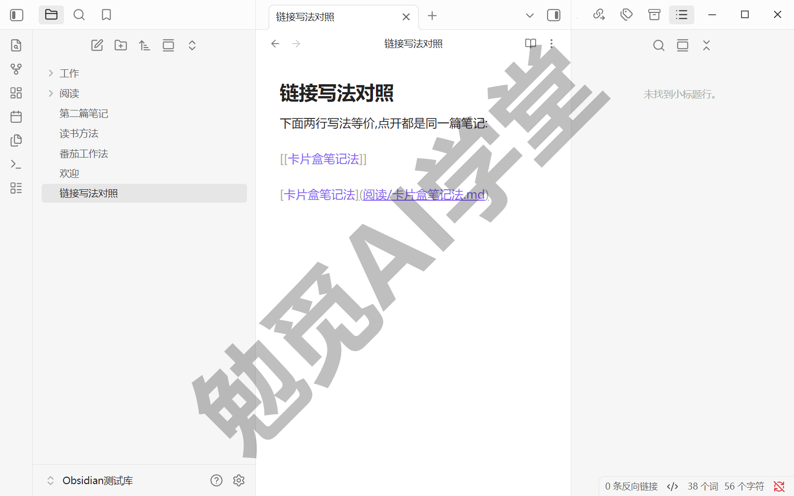

**差别到底在哪。** 日常手感上，Wikilink 短、顺手，笔记名里有空格也直接写；Markdown 链接则要求对目标做 URL 编码——名字里的空格得写成 %20，手写体验差一截。但真正的分水岭在“把笔记拿出去”这件事上：

- Wikilink 不属于 Markdown 通用标准。把 .md 文件拿到不认识它的编辑器或发布系统里，[[卡片盒笔记法]] 就是一串普通文字，链接“死”了；
- Markdown 链接是通用标准，几乎所有支持 Markdown 的工具都认识它，链接在外面照样能跳。

《认识与装好》讲“十年后还打得开”，说的是文字本身——纯文本保证内容永远可读。链接格式决定的是另一层：你的链接网络在别的工具里还能不能用。

**相关的三个设置项**，都在设置 → 文件与链接这一组里（三项名称均为实机文案）：

- **使用 Wiki 链接**——总开关，默认开启。关掉后，Obsidian 生成的新链接一律用 Markdown 格式。官方帮助明确了一个让人安心的细节：关掉之后，输入 [[ 的自动补全照常可用，选中文件后落进笔记的自动是 Markdown 链接——改变的只是产物格式，不是输入手感；
- **始终更新内部链接**——改名保险，建议保持开启。开着时重命名一篇笔记，全库指向它的链接自动跟着更新；关掉则每次改名弹窗询问要不要更新；
- **内部链接类型**——决定生成链接时路径写多长，选项有“尽可能简短的形式”“基于当前笔记的相对路径”“基于仓库根目录的绝对路径”三个。默认的“尽可能简短的形式”在库内最省事；打定主意要和外部工具互通的，一般选相对路径更稳妥。

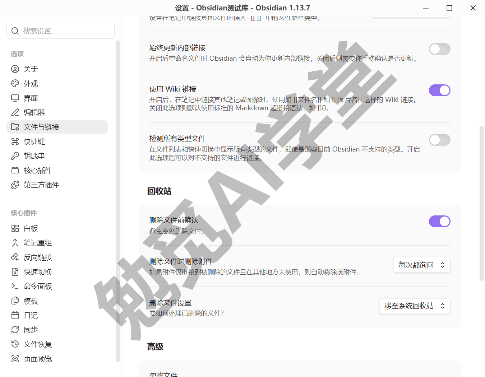

**怎么选，给你一个判断办法。** 打算留在 Obsidian 生态里用——保持默认 Wikilink，什么都不用动，这是绝大多数读者的答案。已经确定这批笔记要长期与外部工具共用、或者奔着对外发布去——关掉“使用 Wiki 链接”改用 Markdown 格式，而且宜早不宜迟：这个开关只影响之后新生成的链接，已经写进笔记的存量链接不会被它改写（以实际表现为准），切换得越晚，存量 Wikilink 越多，将来要处理的也越多。暂时拿不准——按默认走，后面《导入、导出与发布》会讲搬家与导出的完整做法，《毕业：数字花园上线》建站时也会处理链接兼容，到时候再定不迟。

顺带一条起名注意：给笔记起名时避开 `#`、`|`、`^`、`:`、`%%` 这几种字符，官方说明含这些字符的名字可能无法正常作为链接使用。

### 3.5 全局搜索操作符全解

笔记过百之后，靠翻文件夹找东西就不划算了；过千之后，连“大概记得在哪”都不可靠。全局搜索是库内找内容的主力工具，但多数人只会往搜索框里敲个词——这一节把它的操作符一次讲全，让“找东西”从碰运气变成有章法。

**入口与结果面板读法。** 搜索入口在左侧边栏（《界面与设置全导览》介绍过它的位置），官方标注的默认快捷键是 `Ctrl+Shift+F`（以实机为准）。输入一个词，结果按笔记聚合，命中处高亮，每条结果可以展开收起。搜索框下方有几个值得认识的小件：左边是结果计数（复制搜索结果的入口以实机为准）；右边的下拉是排序，文件名、编辑时间、创建时间各有正反两个方向，共六种；搜索框右侧还有一个“搜索设置”按钮，展开三个开关——说明搜索含义、折叠搜索结果、显示更多上下文。另外两个小习惯：搜索框留空时会列出最近搜索词，点一下就能重跑；默认不区分大小写，搜索栏内有“区分大小写”开关可以切换。

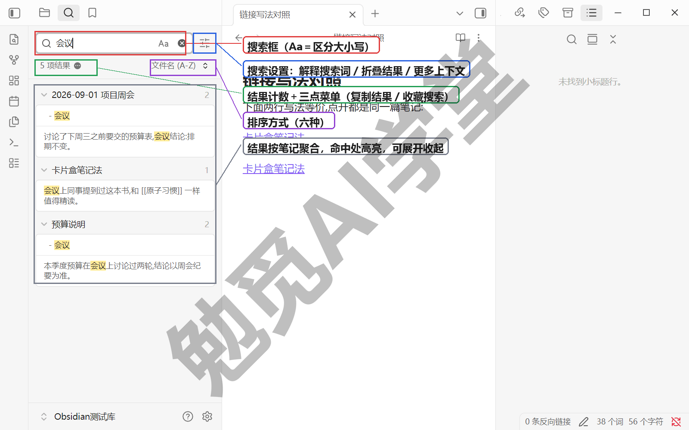

搜索范围先交个底（官方说法）：全局搜索搜的是笔记和白板（Canvas）的文本内容；图片、PDF 这类附件的内部内容不在范围内；设置里被“忽略文件”排除的内容也不会出现在结果里。这三条在 3.9 排查“搜不到”时都用得上。

**组合语法先学会，所有操作符都靠它放大威力。** 先看五条基本式：

```
会议 项目
会议 OR 例会
会议 -周报
"下周三之前"
会议 (预算 OR 排期) -取消
```

- 第一条，空格表示“同时含有”：既含“会议”又含“项目”的笔记才命中——这是默认关系，也是日常用得最多的写法，词加得越多，范围圈得越窄；
- 第二条，OR 表示“任一含有”：出现“会议”或“例会”其中一个就算命中，同一件事在笔记里有几种叫法时，用它把同义词一次搜全；
- 第三条，减号表示排除：返回含“会议”但不含“周报”的笔记，结果里反复冒出来的干扰项，在词前加个减号就能排除掉；
- 第四条，引号锁定精确短语：整句“下周三之前”原样出现才算命中，不加引号的话这几个字会被拆开各自匹配，结果会宽出一大截；
- 第五条，圆括号管分组：最后这条组合起来读作“含‘会议’，含‘预算’或‘排期’之一，且不含‘取消’”——前四条学会之后，就能像这样自由拼装。

**六个高频操作符，逐个上手。** 每个都给一条能直接照抄的示例，建议边读边在自己库里跑一遍。

**file:——只搜文件名。** 记得笔记名的一部分、但全文搜出来一堆杂音时用它。输入 `file:读书`，只返回文件名含“读书”的文件；`file:.png` 能列出库里所有 PNG 图片。跑一下就会看到结果条数骤减——因为它根本不看正文。

**path:——把范围圈进某个文件夹。** 输入 `path:"阅读" 卡片`，意思是“只在路径含‘阅读’的文件里搜‘卡片’”，跑出来的结果会全部落在那个文件夹里。3.3 定下的浅文件夹结构在这里兑现价值：顶层文件夹就是现成的搜索范围。注意路径从库的根目录起算、分隔用正斜杠，Windows 上也一样。

**tag:——按标签筛。** 输入 `tag:#书/在读`，只返回打了这个标签的笔记。官方帮助还给了个实用提示：tag: 会跳过代码块等非正文内容，所以它通常比直接全文搜 #书/在读 更快也更准。标签要写全路径——搜 `tag:#work` 不会命中 #myjob/work 这种挂在别的层级下的标签。标签体系怎么建，《标签与属性》专讲。

**line:——两个词必须在同一行。** 输入 `line:(番茄 休息)`，只有这两个词出现在同一行里的笔记才命中。“整篇都含这两个词”的情况太常见，你真正想找的往往是“当时写在同一句话里”的那条记录，line: 就是干这个的。

**section:——两个词在同一小节里。** 输入 `section:(预算 结论)`，两个词出现在同一个标题下的段落区间才命中。精确度介于“同一行”和“整篇”之间，找“某一节里同时讨论过这两件事”的笔记正合适。

**正则 /.../——按模式找，不按具体词找。** 输入 `/\d{4}-\d{2}-\d{2}/`，能命中库里所有 2026-01-15 这种格式的日期，不管具体是哪一天。它还能和操作符组合：`path:/\d{4}-\d{2}-\d{2}/` 找路径里带日期的文件。正则属于进阶工具，Obsidian 用的是 JavaScript 风味，现阶段知道有这扇门、用到再学即可。

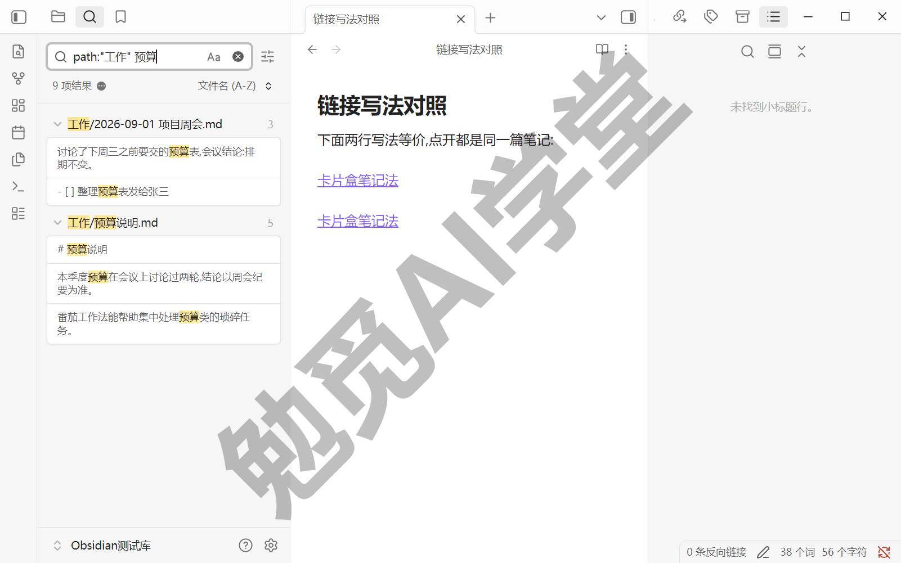

**其余操作符与属性搜索，一张表速查**（操作符全集以当前版本为准，需实机验证逐个核对）：

| 写法 | 干什么 | 示例 |
| --- | --- | --- |
| `content:` | 只匹配文件内容，不碰文件名 | `content:"快乐的猫"` |
| `match-case:` | 这一段区分大小写 | `match-case:OKR` |
| `ignore-case:` | 这一段忽略大小写 | `ignore-case:ikea` |
| `block:` | 两个词在同一块里，解析较慢 | `block:(狗 猫)` |
| `task:` | 在任务条目里找 | `task:(打电话 OR 发邮件)` |
| `task-todo:` | 只在未完成任务里找 | `task-todo:打电话` |
| `task-done:` | 只在已完成任务里找 | `task-done:打电话` |
| `[属性名]` | 含这个属性的笔记 | `[aliases]` |
| `[属性名:值]` | 属性等于某个值的笔记 | `[status:在读]` |
| `[属性名:<数值]` | 对属性做数值比较 | `[duration:<5]` |

表里几条补充说明：content: 平时用不上，直接敲词本来就搜内容，只有和 file:、path: 混用、想显式限定“这一段只匹配内容”时才需要它。task 系的三个操作符对任务清单特别有用，任务清单的写法本身（短横线加方括号）见姊妹篇的《扩展语法》篇。属性搜索现在看着陌生没关系，等《标签与属性》建好属性体系，它会成为你最常用的精确检索手段之一。

**保存搜索：把常用检索式固定下来。** 调试出一条好用的组合式，别每次重敲。在命令面板执行“书签: 收藏当前搜索”（搜索面板内若有收藏入口，效果相同，以实机为准），起个名字，它就进了书签面板，以后一键重跑——书签正是下一节的主角。顺带提一个进阶玩法：在笔记里嵌入 query 代码块，可以让一篇笔记常驻显示某条搜索的实时结果，现阶段知道有这回事即可。

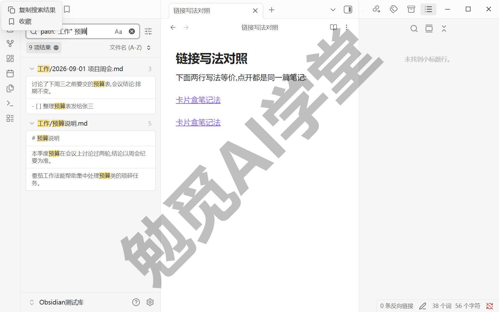

### 3.6 快速切换与书签

搜索解决“不知道在哪”的问题。这一节的两件工具解决另外两个场景：知道名字，和天天要去。

**快速切换：报名字，直接开门。** 它是一个按名字直达笔记的弹框——搜索给你一列结果让你挑，快速切换则是你报出名字它直接开门，全程不用碰鼠标。默认快捷键是 `Ctrl+O`，也可以点功能区的“打开快速切换”按钮进入。输入名字的任意片段，列表实时过滤，方向键选中，Enter 打开。

它还有四个官方记载的加分动作（具体交互以实机为准）：

- 输入的名字没匹配到任何笔记时，直接按 Enter 就以这个名字新建一篇——所以它同时是最快的新建笔记入口；
- 已有相似笔记、但你就是要用这个确切名字新建时，按 `Shift+Enter` 强制新建；
- 按 `Ctrl+Enter` 在新标签页打开选中的笔记，不挤掉当前正读的这篇；
- 什么都不输时，列表显示最近打开的笔记；按一下向下方向键再回车，就在最近两篇之间来回切换。

再埋一个下一篇的伏笔：快速切换按“名称或别名”匹配。别名是给笔记起的第二个名字——《双链与图谱》会讲怎么设置，设好之后，输入别名也能直达。

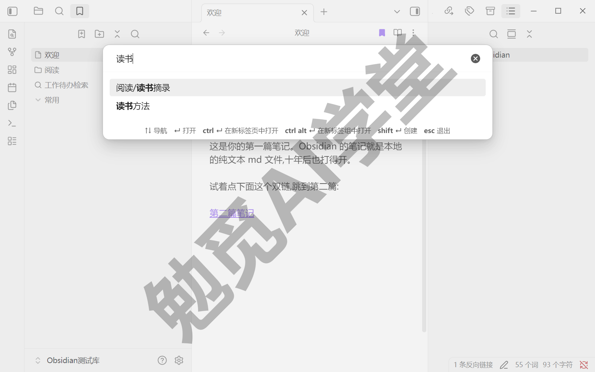

**书签：高频位置钉在手边。** 书签是库内收藏夹，能收藏的东西比你想的多，官方全表有七类：文件、文件夹、图谱、搜索结果、小标题、块、链接。本篇用前四类就够了——小标题和块，等《双链与图谱》讲完引用你自然会用上。

打开书签面板：左侧边栏的书签图标，或在命令面板里运行“书签：显示书签列表”。面板顶部就是常用按钮：“收藏当前标签页”“新书签组”，旁边还有全部折叠与筛选。常用的收藏动作有三个：

- 收藏当前笔记——书签面板顶部的“收藏当前标签页”按钮；
- 收藏文件或文件夹——在文件列表里右键目标，选“收藏”；
- 收藏搜索——上一节讲过的结果计数旁三点菜单。

收藏时会弹出一个小对话框，可以顺手改个标题、指定所属书签组；对已收藏的项目再执行一次收藏，对话框会变成“编辑书签”，随时能改标题、换分组（官方说法，交互以实机为准）。标题不妨用心起：书签标题和笔记名是两回事，改标题不影响笔记本身——尤其是收藏的搜索，把一长串检索式命名成“工作待办”这样一眼能懂的词，面板里才认得快。

分组用面板顶部的“新书签组”创建，把书签拖进组里、拖动排序都行。右键书签可以移除；移除整个书签组会连组里的书签一起移除（官方说法），清组之前先把要留的拖出去。放心的一点：书签只是快捷方式，移除书签不会动笔记本身。

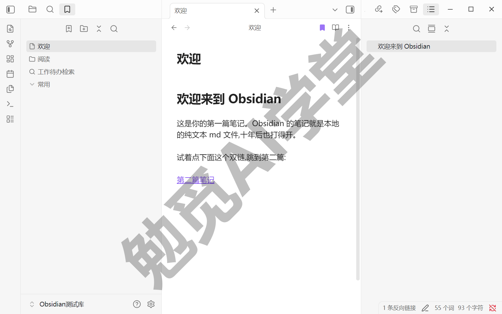

**“找东西”的完整打法，到这里配齐了。** 遇到要找的东西，先问自己一个问题：知道名字吗？知道——快速切换报名字；不知道——全局搜索，用操作符圈范围；天天都要去的位置——书签钉住，一键直达。三件工具各管一段，都练熟之后，“找不到”就不再是这座库会出现的问题。

### 3.7 三个练习任务

三个任务分别对应本篇的三块内容，建议当天做完。

**任务一：摸清你的库**

在资源管理器里找到你的库文件夹，亲眼确认三样东西：你的 .md 笔记文件、.obsidian 设置文件夹（看不到就打开“显示隐藏的项目”）、附件实际存放的位置。然后用两三句话向自己解释清楚：库文件夹和 .obsidian 各装什么，删掉它们分别会发生什么。

完成标准：能不打磕绊地说出“库就是文件夹，笔记是里面的 .md 文件，.obsidian 只是设置”。

**任务二：搜索五连**

在全局搜索里依次跑通下面五条检索式，把其中的词换成你库里真实存在的内容：

- `file:` 加你某篇笔记名的片段——确认它只按文件名命中；
- `path:"某个文件夹名" 关键词`——确认范围被圈进了那个文件夹；
- `tag:#某个标签`——确认只返回打了这个标签的笔记；
- `line:(词甲 词乙)`——确认两个词同行才命中；
- `path:"某个文件夹名" tag:#某个标签`——体验两个操作符组合使用。

完成标准：五条都拿到符合预期的结果，并能说出每条比“直接敲词”精确在哪里。

**任务三：钉好书签**

给三个高频位置各建一个书签：一篇天天要打开的笔记、一个常用文件夹，再把任务二里最有用的那条检索式收藏成保存搜索；然后建一个书签组，把三者归进去。

完成标准：从书签面板点击任意一条，都能一键直达对应位置。

### 3.8 本篇小结与自检

这一篇讲透了“库就是文件夹”，回答了要不要分库、三种组织方式怎么选，并把全局搜索、快速切换和书签配成了一套“找东西”组合拳。最需要记住的是：**默认单库、文件夹浅结构起步，组织靠标签和双链补充；找东西先想“知道名字吗”——知道用快速切换，不知道用搜索。**

可以对照下面的清单检查学习结果：

- [ ] 能指出自己库文件夹和 .obsidian 目录的位置与作用
- [ ] 对“要不要分库”有了自己的答案和理由
- [ ] 能说出文件夹、标签、双链三种组织方式各自适合什么
- [ ] 知道 Wikilink 与 Markdown 链接的取舍点
- [ ] 用操作符组合完成过五条搜索，建好了常用书签

完成这些内容后，库的底层逻辑你已经吃透。下一篇《双链与图谱》进入 Obsidian 的招牌能力：把孤立的笔记连成网。

### 3.9 新手常见问题

**Q1：把库文件夹整个删了，笔记还在吗？**

不在了。库就是那个文件夹，删掉文件夹就是删掉全部笔记——这是“库=文件夹”的另一面。要分清两个动作：在库管理画面把某座库从列表中移除（菜单项名称以实机为准），只是让 Obsidian 不再管理它，文件夹和笔记原封不动；在资源管理器里删除文件夹，笔记才真的进了回收站。另外，在 Obsidian 里删除单篇笔记时，文件去向由设置里“删除文件设置”一项决定，选项有“移至系统回收站”“移至 Obsidian 回收站（.trash 文件夹）”“永久删除”三个。误删了第一时间去系统回收站找；更完整的备份纪律，《同步与备份全解》专门讲。

**Q2：一个库放几千篇笔记会卡吗？**

一般不会。笔记是纯文本，几千篇加起来的体积往往不如一段手机视频大，写作、搜索都在本地完成，日常操作通常无感。真遇到变慢，压力多半来自三处：体积巨大的附件、个别较重的第三方插件（怎么排查，《社区插件系统》会讲）、以及图谱同屏渲染大量节点时的卡顿——最后这个只是显示层面的压力，不影响笔记数据本身。以实际表现为准，真变慢了先从附件和插件查起。

**Q3：文件夹层级建多深合适？**

建议两三层封顶。层级一深，“这篇当年放哪了”就得靠记忆，文件拖动也麻烦。想往深处细分的冲动，交给 3.3 定下的分工去消化：文件夹只管粗归属，细维度让标签和双链承担。给你一个自查信号：如果经常想不起某篇笔记在哪个文件夹，多半不是记性问题，是层级超载了。

**Q4：搜索明明有的内容，为什么搜不到？**

按顺序查四件事：

- 搜索框里是否残留着上次的 path:、tag: 等操作符，把范围圈小了——清空重搜；
- 检索词有没有错别字，或者全角半角差异（比如全角数字对不上半角数字）；
- 内容是不是在附件里——全局搜索只搜笔记和白板的文本，PDF 和图片内部的文字不在范围；
- 是否被设置里的“忽略文件”排除了——被排除的内容不会出现在搜索结果里。

四条都排除后还搜不到，还有一个官方兜底：设置 → 文件与链接最底部有“重建仓库缓存”一项（按钮就叫“重建”），当索引缓存和文件不一致时重建一次，通常能解决。
