## 双链与图谱

这一篇讲 Obsidian 最出名的能力：让笔记互相链接，再顺着链接把整座库连成一张网。我们会把双链一家的用法全部过一遍——链接、反向链接、未链接提及、别名、标题引用、块引用和嵌入，然后给图谱安排三个真实用途，最后动手建立你的第一个 MOC 导航页。

这一篇的操作都在你已有的库里进行，笔记越多效果越明显；库里还没几篇笔记也不要紧，跟着做的过程本身就在给它添内容。

### 4.1 双链基础

**从上一次点击说起**。在《认识与装好》的三连任务里，你已经用过一次双链：在第一篇笔记里输入 `[[`，接一个不存在的标题，点击后 Obsidian 自动创建了第二篇。当时只求体验，这一节把这个动作背后的完整用法讲清楚。

**链接一篇已有的笔记**——在正文任意位置输入两个左方括号 `[[`，Obsidian 会立刻弹出补全列表，把库里的笔记列出来供你选；继续输入几个字可以过滤列表，选中回车，一条链接就写好了。还有一个方便的变体：先选中正文里的一段文字，再输入 `[[`，这段文字会直接变成链接（选中转换的交互需实机验证）。写法上认识这个双方括号形态就够用了：改显示文字的竖线写法 4.2 会讲；链到子文件夹里的笔记不用写路径，照常输入名字从补全列表里选即可，库里有重名笔记时，列表会在名字旁标出所在文件夹路径帮你区分。

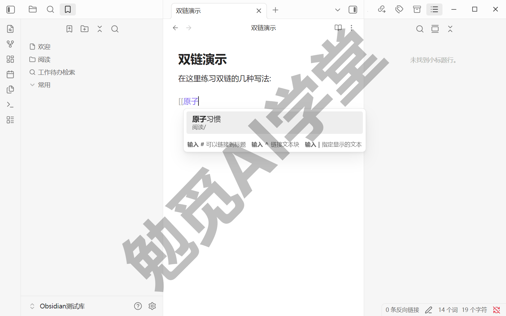

**链接一篇还不存在的笔记**——`[[ ]]` 里的标题不必真的存在。输入一个库里没有的标题，链接照样成立，只是显示成暗一些的颜色，提醒你“这篇还没写”；点击它，Obsidian 会当场创建这篇笔记并打开。这个特性值得养成一个习惯：写着写着想到相关主题，先把链接放出去，内容以后再补——课程把这个习惯叫“先链后写”。它的好处是不打断当下的写作，同时把“这两个主题有关系”这条信息留在了笔记里。


**链接的悬停预览**——把鼠标悬停在一条链接上（编辑视图下默认要按住 Ctrl 再悬停，插件选项里可调），旁边会浮出那篇笔记的内容预览，不用跳转就能看一眼再决定去不去。这个能力由“页面预览”核心插件提供，通常默认开启（以实机界面为准）。

**改名不用怕断链**——链接一多，新的顾虑就来了：改了笔记标题，那些链接会不会全断？不会。“文件与链接”分组里的“始终更新内部链接”开着时，重命名一篇笔记，库里所有指向它的链接自动更新成新名字；关掉这个开关，改名时会让你手动确认要不要更新（该项的出厂默认状态需实机验证）。真正要留意的是起名本身：给笔记起标题时避开 `#`、`|`、`^` 这几个符号，它们在链接语法里有专门含义，混进标题可能让链接失效。


**双链真正改变的是什么**——用文件夹整理笔记，每篇都被迫回答“该放进哪个文件夹”，而一篇笔记常常同时属于几个主题，放哪都不合适。链接把要回答的问题换掉了：不再问“放哪”，改问“它和谁有关”——有关就链一条，几条都行，笔记本身待在原地不动。《库、文件与搜索》定下的三种组织方式分工，本篇落实的是最后一路：文件夹管唯一归属，标签管分类与状态，双链管知识之间的关联。链接格式也不用纠结，那一篇的结论在这里照用：留在 Obsidian 生态里，用默认的 Wikilink 就好。

单独看，一条链接不过省一次搜索；攒起来看，它们是反向链接、图谱和 MOC 的共同原料。《认识与装好》建议你从第一天就开始链，原因就在这里：从下一节起，这些积累开始兑现回报。

### 4.2 反向链接、未链接提及与别名

链接是有方向的：你在 A 笔记里写了 `[[B]]`，从 A 一跳就到 B。反过来，站在 B 的立场，“谁链接了我”这条信息同样有价值——它就是反向链接，也是“双链”这个说法里“双”字的由来。

**反向链接面板**——打开一篇笔记，点右侧边栏的“反向链接”页签（《界面与设置全导览》带你认过右侧的几块面板；找不到页签时，按 Ctrl+P 呼出命令面板，执行“反向链接: 显示反向链接列表”即可调出）。面板分上下两个分区：

- **链接提及**：哪些笔记里有指向当前笔记的正式链接。每条带着所在段落的上下文，点击可以跳过去看全文。
- **未链接提及**：哪些笔记的正文里出现了当前笔记的名字，却没有加链接。它是下面“转正”动作（把提及变成正式链接）的工作对象。

分区上方还有几个小控件，可以折叠结果、显示更长的上下文、更改排序、再按条件筛一遍（控件名称以实机界面为准）。反向链接最常见的用法是写作时顺藤摸瓜：比如你正写“番茄工作法”这篇笔记，反链面板列出三篇旧笔记提到过它，点过去把当时的想法找回来，新笔记就不必从零开始。

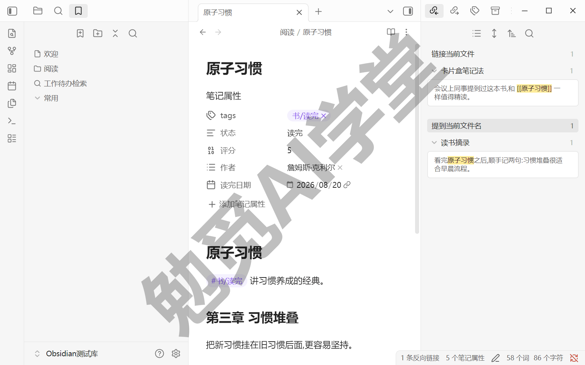

**未链接提及与转正**——旧笔记里往往藏着不少“提到了但没链上”的名字：写它们的时候，被提到的那篇笔记还不存在，或者当时没想起来加链接。未链接提及分区替你把这些地方一处处找出来。把鼠标悬停到某一条上，条目旁会出现“转为链接”按钮，点击后，那篇笔记里的这处名字就地变成正式链接——把提及变成链接的这个动作，本篇下文简称“转正”。转正一条，你会看到它从未链接提及分区消失，出现在上面的链接提及分区里。

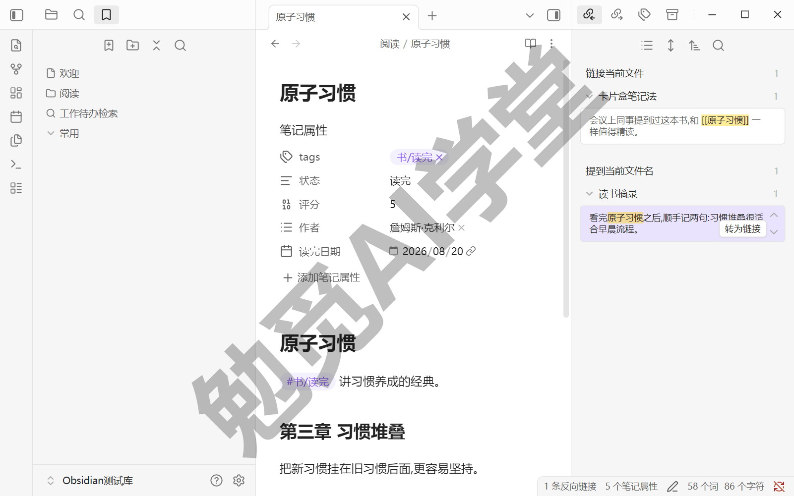

**别名：一个概念的几种叫法**——同一个概念，笔记里未必总用同一个名字：“番茄工作法”有时被写成“番茄钟”，“人工智能”更多时候写成“AI”。别名的作用，是给一篇笔记登记几个“也叫这个名字”。它写在笔记的属性里——属性是笔记开头的一小块结构化信息区，下一篇《标签与属性》专门讲透，这里先照着用起来：用命令面板执行“增加笔记属性”，属性名填 aliases，值里逐条填别名；或者切到源码视图，在笔记最顶部照下面的样子写：

```
---
aliases:
  - 番茄钟
  - Pomodoro
---
```

别名生效后，它带来的便利会在三个地方同时生效：

- 写链接时，输入 `[[番茄钟` 也能命中“番茄工作法”这篇。补全列表会给别名条目一个弯箭头标记，选中后生成的链接显示“番茄钟”，实际指向“番茄工作法”。
- 《库、文件与搜索》讲过快速切换按名字直达笔记，加了别名之后，输入别名同样能直达。
- 未链接提及也认别名：旧笔记里出现“番茄钟”的地方，一样会被列出来等你转正。

如果只是想让某一处链接显示别的文字，不必动用别名：`[[番茄工作法|今天的安排]]` 这种竖线写法，改的只是这一处的显示文字——竖线前是目标笔记名，竖线后是要显示的文字，只对写它的这一处生效。两者的分工一句话说清：一次性的显示调整用竖线，长期反复用的第二叫法登记成别名。


### 4.3 标题引用、块引用与笔记嵌入

整篇链接有时太粗。你想指的可能只是长笔记里的一节，甚至具体一段话；有时你甚至不想“指过去”，而是想把那段内容直接“拿过来”摆在眼前。这一节把两件事都解决：往细指，用标题引用和块引用；拿过来，用嵌入。

**链接到一节：标题引用**——在链接的笔记名后面加 `#`，再接标题文字，链接就指向了那一节：

```
[[原子习惯#第三章 习惯堆叠]]
```

标题不用手打：输入 `[[原子习惯#` 时，Obsidian 会把那篇笔记的所有标题列出来供你选。标题下还有小标题时，可以连着再加 `#` 一层层指下去。顺带一个进阶搜法：输入 `[[##` 加关键词，可以跨全库搜索标题，比如 `[[##习惯` 会列出全库所有含“习惯”的标题，不确定内容在哪篇笔记里时特别好用。

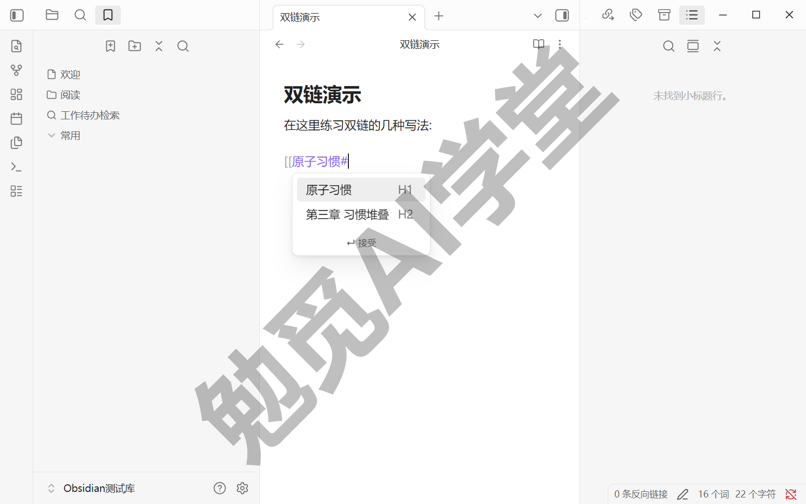

标题引用有一个要留意的坑：它认的是标题文字本身。改标题时用“重命名当前小标题”命令（光标放在标题行，命令面板可搜到），引用这一节的链接会自动一并更新；直接在正文里手改标题文字则不走这条更新。保险起见，改一个可能被引用的标题之前，先到反向链接面板看一眼有谁链着这篇笔记，再动手不迟。

**链接到一段：块引用**——比标题更细的单位叫“块”：一个段落、一条列表项、一段引文，都算一个块。写法是在笔记名后面加 `#^`：

```
[[2026-06-01#^37066d]]
```

末尾那串 `^37066d` 是块标识符，同样不用手打：输入 `[[2026-06-01#^` 之后，Obsidian 会列出那篇笔记里的块供你选，选中一个，它会自动在目标段落末尾补上一个随机的短标识符。嫌随机串不好记，也可以自己起名：在目标段落末尾空一格，写上 `^dushu-jielun` 这样的自定义标识（只能用英文字母、数字和连字符）。跨全库搜索块用 `[[^^` 加关键词（该搜法需实机验证），块的数量远多于标题，列表会长得多。

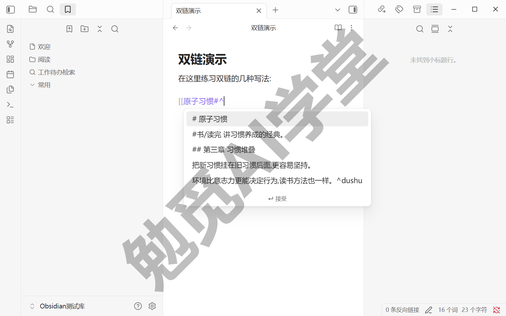

两条官方明确的规矩，照做能省不少排查时间：

- 给列表、引文、表格这类结构化内容加块标识时，标识符要单独占一行，前后各留一个空行；
- 引文、表格以及标注块（callout，一种带样式的提示框，《美化与工作区》会讲）只能整块引用，不支持链接到它们内部的某一行、某一格。

还有一条边界要交代：块引用是 Obsidian 特有的写法，不属于通用 Markdown。把笔记拿到别的工具里，`^37066d` 只是一小截普通文字，指向它的链接也不再生效——内容一个字不丢，但这层引用关系带不出去。这和《认识与装好》讲的“数据完全自有”并不矛盾，内容仍是纯文本，随时可以完整带走；只是提醒你：这类特性用得越深，换工具时要放弃的便利就越多，用之前了解这一点即可。

**嵌入：引用，而不是复制**——在链接前面加一个感叹号，被链的内容就会直接展开显示在当前笔记里：

```
![[原子习惯#第三章 习惯堆叠]]
```

三种粒度都可用：`![[笔记名]]` 嵌整篇，`![[笔记名#标题]]` 嵌一节，`![[笔记名#^块标识]]` 嵌一段。最要紧的一点是：**嵌入是引用，不是复制**。被嵌入的内容始终只有源头一份，源头改了，所有嵌入它的地方跟着更新；同一段话嵌进十个页面，要维护的仍然只有一处。反过来，复制粘贴出去的十份，从粘贴那一刻起就各改各的、彼此失联了——这就是嵌入与复制的区别。图片、PDF 这类附件也用同样的感叹号写法嵌入——其实你已经用过它：往笔记里粘贴图片时，Obsidian 自动生成的正是这种感叹号加双方括号的写法，文件名默认是“Pasted image 加时间戳”。

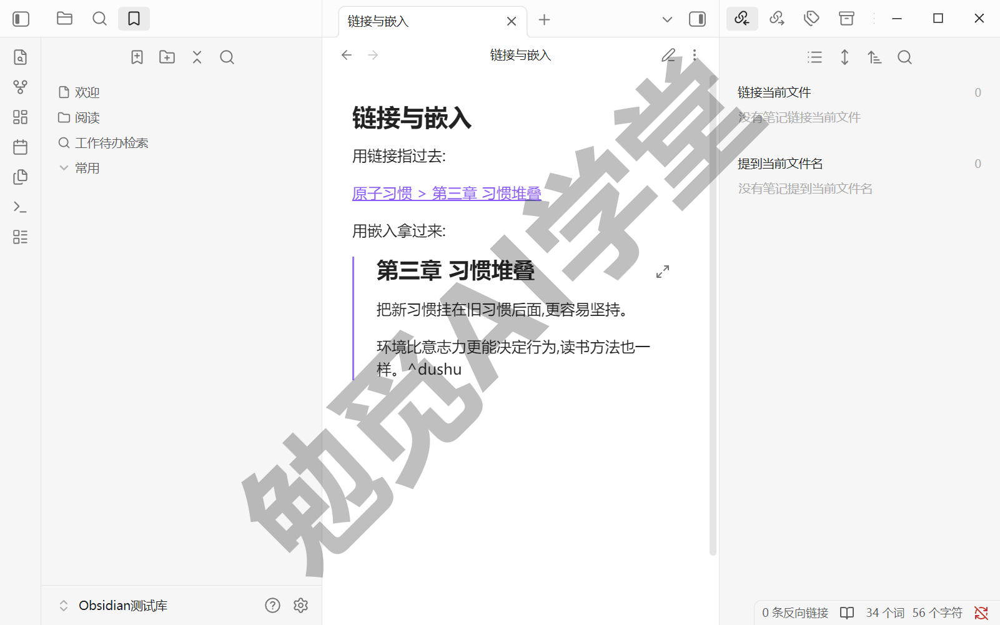

什么时候用链接、什么时候用嵌入？看读者需不需要当场读到那段内容：

- **链接**：指过去，页面上只占一行，感兴趣才点开——适合“相关阅读”式的松散关联；
- **嵌入**：拿过来，内容当场展开——适合汇总页、对照阅读这类要把内容摆在一起的场合。

《日记、模板与每日工作流》会给嵌入安排一场实战：每周回顾时，用七条嵌入把一周的日记聚到同一页里通读。嵌入同样是 Obsidian 特有的渲染，在别的工具里会退化成 `![[ ]]` 原样的一行文字，对外分享笔记前记得这一点。

### 4.4 图谱与局部关系图的真实用法

**先把定位摆正**——图谱大概是 Obsidian 截图里出镜率最高的画面：满屏星星点点，看着像一张星空图。也正因为好看，它常常被截一张图分享出去，然后再也没被打开过。这一节的目标是把它变成日常工具：图谱是检查工具和导航工具，下面给它安排三个真实任务。

打开方式在《认识与装好》里见过一次：点功能区的“查看关系图谱”按钮，或者用命令面板。图上每个圆点是一篇笔记，每条线是一条链接；被链接得越多的笔记，圆点越大。鼠标悬停在点上会高亮它的连线，单击打开那篇笔记，右键有更多操作，滚轮缩放、拖拽平移。

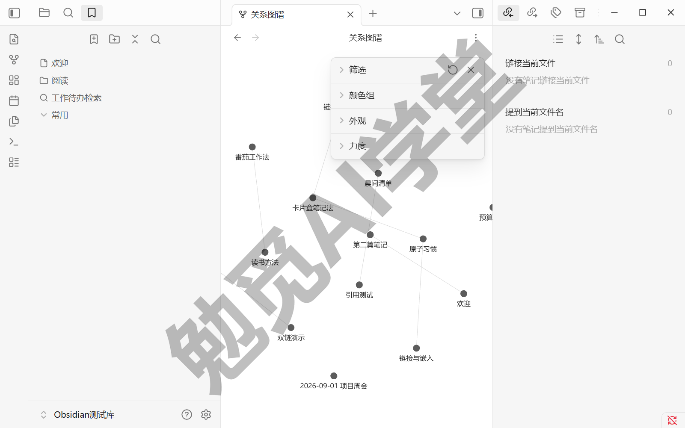

**用法一：过滤，把图缩小到一个问题**

点图谱右上角的齿轮图标（“打开图谱设置”）打开设置，第一组是“筛选”。最上面的搜索框支持全局搜索的语法，《库、文件与搜索》练过的操作符在这里原样能用：输入 `path:读书` 就只看“读书”文件夹这一片，输入 `tag:#项目` 就只看打了项目标签的笔记。搜索框下面还有几个开关，控制要不要把标签、附件也显示成节点。满屏的全貌适合感受整体规模，要回答具体问题——“这一片链得够不够密”“有没有该链没链的”——得先圈出一小片来看。

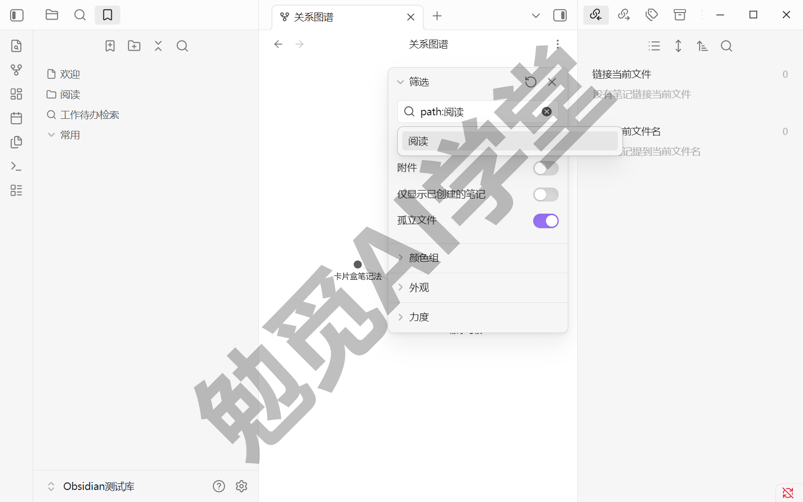

**用法二：分组着色，看主题分布**

设置里的分组区可以新建分组：填一条搜索条件（比如 `path:工作`），再点旁边的色点选一种颜色，命中的笔记就整体换色。给几个主要主题各配一种颜色之后，图谱变成一张分布图：哪个主题攒的笔记最多、哪两片各自成团几乎不相连，一眼可见。各自成团的地方往往就是值得动手的地方：要么补几条跨主题的链接，要么等下一节用一页 MOC 把它们串起来。

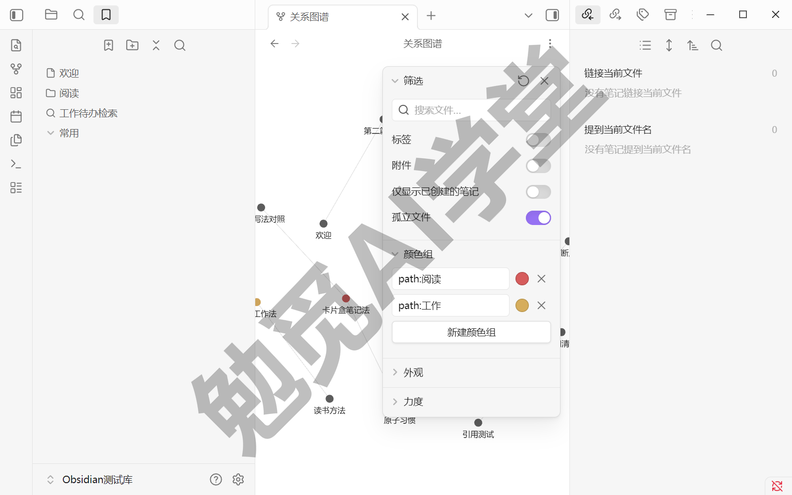

**用法三：找孤岛**

过滤器里有一个“孤立文件”开关，控制图上要不要显示没有任何链接的笔记。打开它，那些不带一条线的散点就是孤岛：没有笔记链它，它也不链任何笔记，除了搜索没有任何路径能自然走到它。建议每周扫一眼：有的孤岛该补链，有的该挂进对应主题的 MOC，也有的确认过就保持原样——比如一次性的临时记录。

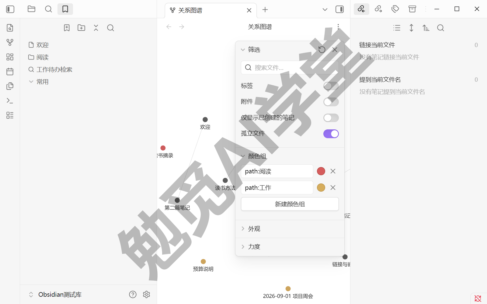

设置里剩下两组参数管观感：“外观”管显示（节点大小、连线粗细、文字何时淡出），“力度”管布局松紧（节点之间几种作用力的强弱）。点多到挤成一团时，把控制排斥的那项调大，图会摊开一些；具体滑杆名称以实际界面为准，调乱了点设置面板顶部的“恢复默认设置”按钮。显示设置里还有一个时间轴动画，会按创建时间把笔记一颗颗放回图上，相当于回放这座库的生长过程，有兴趣可以看一次。

**局部关系图：只看当前笔记的邻居**

全局图谱看全貌，写作时更常用的是局部关系图。在命令面板执行“打开局部关系图”命令，会打开一张只包含当前笔记及其关联笔记的小图。它比全局图多一个关键控件：过滤器面板顶部有一根“深度”滑杆，控制显示几层邻居——调到 1 只看直接相连的笔记，加一格多显示一层“邻居的邻居”。把这张小图拖进侧边栏常驻（面板怎么拖，《界面与设置全导览》讲过），你写哪篇它就跟着换哪篇，顺着邻居一路点过去，是最自然的浏览方式。

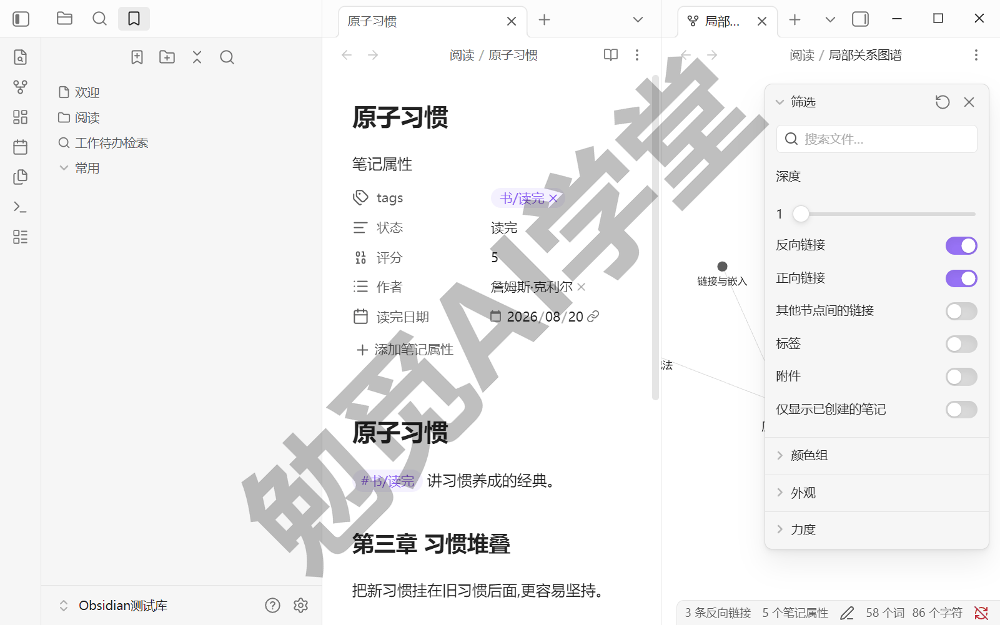

### 4.5 MOC 导航法入门

链接和图谱解决了“笔记之间怎么连”，还剩一个问题没解决：一个主题攒到十几篇之后，每次从哪进？搜索和快速切换要求你记得名字，图谱要求你认得出形状，都不适合当一个主题的固定入口。这一节就给主题建一个固定入口：MOC。

**MOC 是什么**——MOC 是 Map of Content 的缩写，直译“内容地图”。它是一篇普普通通的笔记，正文主要由指向其他笔记的链接组成，按你自己的逻辑分组排列，每条链接配一句注释。它像一本书的目录页，但比目录自由得多：分组方式完全由你定，而且一篇笔记可以同时出现在好几张地图里。这个做法来自 Obsidian 社区（最早把它推广开的是社区作者 Nick Milo），不是软件功能——不需要安装或开启任何东西，新建一篇笔记就能开工。英文缩写不必记，记住“给主题建一页带注释的链接目录”这件事就行。

**它和文件夹各管什么**——《库、文件与搜索》讲三种组织方式时定过分工，MOC 把导航这一侧补完整了：

- **文件夹**：给每篇笔记一个唯一的存放位置，回答“文件在哪”。一篇笔记只能待在一个文件夹里。
- **MOC**：给每个主题一个人工梳理的阅读入口，回答“这个主题从哪看起”。一篇笔记可以被任意多张地图链接。

存放和导航从此是两件事：文件夹层级尽管保持浅结构，主题的组织交给地图页。

**手把手建第一个**——挑一个你笔记最多的主题，五到十篇就足够，跟着四步走。

**第 1 步：建地图页**

新建一篇笔记，起名“主题名 + MOC”，比如“读书 MOC”；不喜欢英文缩写就叫“读书地图”。名字里带一个固定后缀的好处，是以后在快速切换里输入这个后缀，所有地图页一次列齐。

**第 2 步：把笔记链进来**

在这页里用 `[[` 把该主题的笔记逐篇链进来。想不全没关系：用全局搜索按关键词翻一遍，或者到图谱里按上一节的办法把这个主题过滤出来，圈里的点就是这页地图的素材。

**第 3 步：分组，给每条链接一句注释**

链接攒齐后，用加粗小标题把它们分成几组（比如“方法论”“实践记录”“还没读”），再给每条链接补上半句话：这篇讲什么、什么情况下该翻它。这半句注释正是地图页和“链接堆”的区别所在：它把你对这批笔记的理解一并存了下来，三个月后回来还能看懂当时的思路。

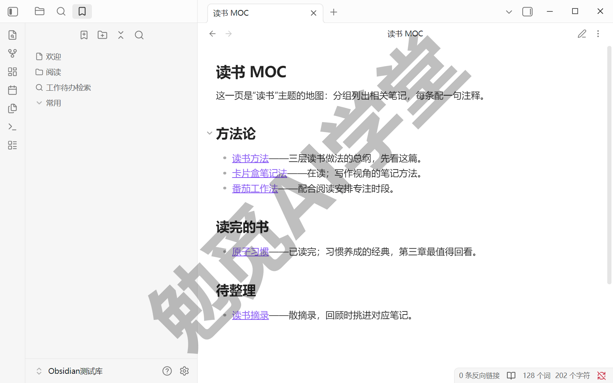

**第 4 步：让地图自己也能被找到**

把这页 MOC 链进该主题最常打开的几篇笔记，再给它加一个书签（书签面板《库、文件与搜索》讲过）。以后进这个主题，先开地图，两跳之内到达任何一篇。

建完到图谱里看一眼：MOC 那个点被十几条线簇拥，明显大过周围——上一节看到的松散一片，现在有了中心。

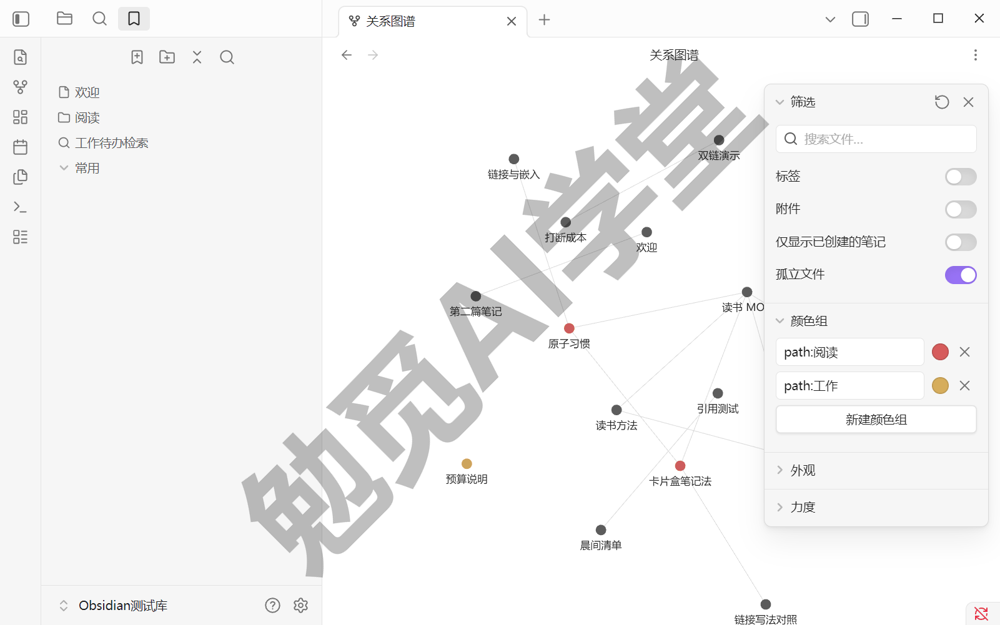

**维护与分寸**——MOC 靠手工维护，这既是成本也是价值所在：往地图里挂一篇新笔记，就是重新想一遍它属于哪一组。习惯上，该主题新写的笔记随手挂进地图页，隔一阵子整理一次分组即可。数量上别贪多：主题笔记攒够了再建，一座库里维持几页到十几页地图就很够用，为建而建只会变成新负担。等库再长大，《个人知识库从零搭建》会把 MOC 升级成整座库的首页仪表盘，到那时，你今天建的这一页就是现成的起点。

### 4.6 三个练习任务

三个任务连着做，正好把本篇的三件事各练一遍：加链接、用反向链接与图谱做检查、建 MOC 导航页。

**任务一：连网**

从库里挑三到五篇内容相关的笔记（不够就先花几分钟补两篇短的），凡是彼此真有关系的，用 `[[ ]]` 互相链上；过程中至少做一次“链到还不存在的笔记”，并点击创建它。

完成标准：打开图谱，这几篇笔记之间有线相连，不再是各自漂着的孤点。

**任务二：提及转正**

打开几篇旧笔记，逐个查看右侧反向链接面板的未链接提及分区，累计把至少三处提及转成正式链接。

完成标准：转正过的条目出现在链接提及分区里，数量比动手前多出三条以上。

**任务三：建 MOC**

按 4.5 的四步，给你最熟悉的主题建第一页 MOC：链入五篇以上笔记，分好组，每条链接配一句注释，最后加上书签。

完成标准：从这页 MOC 出发，两跳之内能到达该主题的任意一篇笔记。

### 4.7 本篇小结与自检

这一篇学会了双链家族的全部用法——链接、反向链接、未链接提及、别名、标题与块引用、嵌入，并让图谱从摆设变成检查工具，最后用 MOC 给主题建了总入口。最需要记住的是：**双链的价值在“先链后写”和反向链接：写的时候大胆链，读的时候反着看谁链了它。**

可以对照下面的清单检查学习结果：

- [ ] 会用 `[[ ]]` 链接已有笔记和尚未创建的笔记
- [ ] 会看反向链接面板，用未链接提及转正过链接
- [ ] 会标题引用、块引用和嵌入，说得出嵌入与复制的区别
- [ ] 在图谱里用过滤找到过孤岛笔记
- [ ] 建成了第一个 MOC 导航页

完成这些内容后，你的笔记已经开始成网。下一篇《标签与属性》给笔记装上另一套坐标：分类与状态元数据，也是后面数据库用法的地基。

### 4.8 新手常见问题

**Q1：双链加太多，会不会越链越乱？**

不太会，但有一个前提。链接嵌在正文的上下文里，本身不需要像文件夹那样归置；真正制造混乱的是无意义的链接：见到名字就链、什么都互链。动手前默问一句“我以后会顺着这条链接走回来吗”，答案是否定的就不链。已经链多了也有工具兜底：图谱过滤看局部，MOC 给主题建入口。

**Q2：有了双链，文件夹是不是可以不要了？**

要留着。《库、文件与搜索》定下的分工在本篇依然成立：文件夹管文件的唯一归属和大的分区，双链管知识之间的关联，两者不竞争。实践中常见的形态是文件夹保持浅浅几层，其余组织工作交给链接、标签和 MOC——这也正是本课程的路线。

**Q3：图谱点太多，糊成一团怎么办？**

按 4.4 的顺序处理：先用过滤器的搜索框把范围圈小（`path:` 或 `tag:` 都行），再关掉标签、附件这些暂时用不上的节点类型，还嫌挤就把布局参数里控制排斥的那项调大（滑杆名称以实际界面为准）。多数时候你真正需要的是局部关系图——只看当前笔记周围一两层邻居，天然清爽。

**Q4：块引用自动生成的 ^ 记号是什么？能删吗？**

那是块标识符，一小截存在正文里的普通文本，是块引用和块嵌入的锚点。删掉它，指向这个块的链接就找不到目标了，所以只要还有地方引用着它就别删。嫌随机串碍眼，可以按 4.3 的写法换成自己起的可读标识；它跟着纯文本走，在别的编辑器里也只是无害的一小截字符。
