## 标签与属性

上一篇《双链与图谱》把孤立的笔记连成了网——双链回答的是“这篇和谁有关”。这一篇解决另一个维度的问题：这篇笔记属于哪一类、处在什么状态、各项指标是多少。承担这些的是两样工具：标签和属性。

这一篇会讲清标签的写法和嵌套标签体系、属性面板与现行 7 类属性类型、这两样东西在文件里的纯文本本质，以及它们之间怎么分工；最后用“标签＋属性＋搜索”跑通一条完整的检索链。这些内容也是《Bases 数据库》和《Dataview 专讲》的直接地基——那两篇会把散在笔记里的属性自动汇成表格，你现在打的每一分属性，到时候都是现成的列。

### 5.1 标签基础与嵌套标签体系

先从一个很快就会遇到的场景说起。库里的笔记攒到几十篇，你想把“正在读的书”一次找出来，或者想看看自己在“心理学”这个话题下都记过什么。靠文件夹做不到：《库、文件与搜索》定过三种组织方式的分工，文件夹给的是唯一归属，一篇笔记只能待在一个文件夹里；“在读”这种会变的状态、“心理学”这种可能和其他类别同时成立的维度，文件夹装不下。补这个缺口的就是标签。

**标签是什么**——以 `#` 开头的关键词，相当于打在笔记上的可检索记号，比如 `#读书`、`#会议`。一篇笔记可以打任意多个标签，同一个标签也可以出现在任意多篇笔记里。这两点正好补上文件夹的短板：归属只能有一个，记号可以随便挂。

**怎么打标签**：在正文里输入 `#`，Obsidian 通常会弹出补全列表，把库里已有的标签列出来供你选（列表形态以实际界面为准）；不选已有的，继续输入文字就是在新建标签。输入空格或回车，这个标签就结束了。做完会看到：这个词变成高亮的可点击样式，点击它会打开搜索，列出打了同一标签的全部笔记。

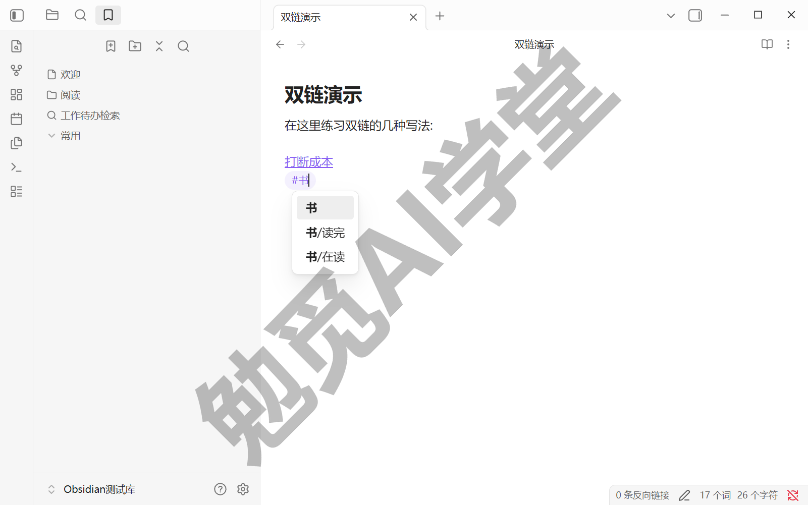

除了正文，标签还有一个正式的存放处：笔记头部的 `tags` 属性。下一节讲属性时会见到它——两处打的标签地位相同，搜索和标签面板都认。

**标签的格式规则**（按官方帮助）：

- 可用字符包括字母、数字、下划线、连字符和斜杠，中文同样可以——官方中文帮助里的示例本身就是 `#会议` 这样的中文标签；
- 必须至少包含一个非数字字符：像 `#1984` 这样的纯数字不是有效标签，加个字母写成 `#y1984` 就可以了；
- 不能包含空格，两个以上的英文词可以连写、用下划线或连字符相接，中文标签天然没有这个问题；
- 不区分大小写：`#tag` 和 `#Tag` 会被当作同一个标签，标签面板里按先创建的那个写法显示。

**标签面板：看全库的标签**。想知道整座库都有哪些标签、各挂了几篇笔记，用右侧边栏的标签面板——《界面与设置全导览》带你认过右侧的各个面板，这一个就是为本篇准备的。它由核心插件提供，界面上的实际名称是“标签列表”（官方中文帮助的页名叫“标签视图”）；本课程按界面部位统一叫它标签面板。面板会列出全库标签和每个标签的笔记数，点击任何一个标签就发起一次搜索；按官方帮助，按住 Ctrl 点击还能把这个标签在当前搜索条件里叠加或移除（以实机表现为准）。面板顶部另有几个按钮：排序、显示嵌套情况、全部展开（或折叠）、筛选。

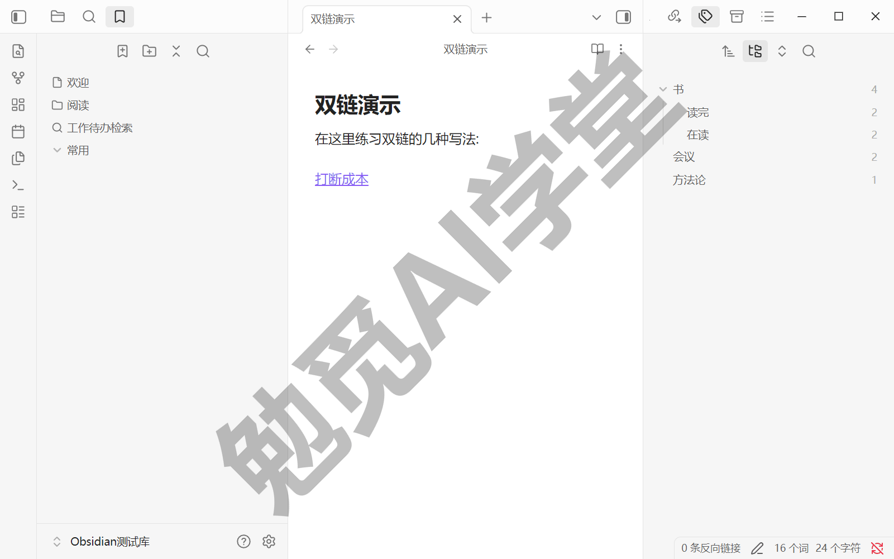

**嵌套标签：给标签建层级**。标签一多，平铺着就乱了。在标签名里加斜杠，就得到嵌套标签：`#书/在读`、`#书/读完` 都属于 `#书` 这个父标签。它带来两个实际好处：

- 标签面板里，子标签会挂在父标签下面树形收纳，几十个标签也能一眼看清体系全貌；
- 搜索时父标签连子标签一起命中：搜 `tag:#书` 能同时找到打了 `#书/在读` 和 `#书/读完` 的笔记（官方说法）。想精确到某个子标签，把它写全即可，如 `tag:#书/在读`。

本篇 5.5 的联动实战和后面《Bases 数据库》的书单表，用的都是这套 `#书/…` 体系，你可以从现在起照这个样子搭自己的。

**命名纪律：先想好体系再铺开**。标签体系最大的敌人是同义标签——`#读书`、`#阅读`、`#book` 各挂了几篇笔记，检索哪个都只拿到一部分。两条建议：

- 动手铺标签之前，先在一篇草稿笔记里把整套体系列出来，每个维度定一个用词，定了就不再造近义词；
- 层级以两层为宜：`#书/在读` 够用了，`#书/纸质/在读/上半年` 这种深层级看着精细，维护起来很快就会失控。

**改名与合并的现实做法**。命名纪律之所以值得提前做，还有一个硬原因：Obsidian 没有原生的标签改名或合并功能。标签面板顶部只有排序、显示嵌套情况、全部展开、筛选这几个按钮，官方帮助的两处标签页面也都没有改名或合并的记载（标签右键菜单的选项需实机验证）。真要把 `#阅读` 改成 `#读书`，现实做法是全库搜索替换：先用《库、文件与搜索》讲过的 `tag:` 操作符搜 `tag:#阅读`，把打了它的笔记全部圈出来，再逐篇把旧标签改成新写法。笔记很多的话，也可以在 Obsidian 之外做——《认识与装好》定下的底子在这里派上用场：库就是硬盘上的文件夹，每篇笔记都是普通文本文件，用任何支持批量替换的文本工具都能一次改完（动手前先复制一份库文件夹当备份）。

### 5.2 属性面板与属性类型

标签解决了“这篇属于哪类、什么状态”，但它回答不了带值的问题：这本书我打几分？哪天读完的？作者是谁？把值硬塞进标签写成 `#评分9` 也不是办法——既不能按大小排序，也没法筛选“8 分以上”。这类结构化数据，Obsidian 用属性来装。

**属性是什么**——挂在笔记头部的结构化字段，每条属性由名称和值两部分组成，比如名称是“评分”、值是 9。有属性的笔记，顶部会显示一块逐行排列、可以直接点击编辑的区域，本课程把它叫作属性面板。

**怎么添加属性**。官方给了几种方式，最常用的是这两种：

- 快捷键：官方帮助给出的是 `Ctrl+;`（以实机为准），光标在哪篇笔记里，属性就加给哪篇；
- 命令面板：呼出命令面板搜“属性”，执行添加属性的命令——官方中文帮助里命令名作“增加笔记属性”，界面上的命令名以实机为准。

另外两种方式了解即可：标签页右键或右上角的更多选项菜单里有同名入口；在文件最开头输入一行 `---` 也会进入属性编辑——这个写法背后的含义，5.3 马上讲。

做完会看到：笔记顶部出现一行，左右两个输入位，左边填属性名称、右边填值。名称可以随意起，输入时 Obsidian 会给出建议列表，其中 `tags`、`aliases`、`cssclasses` 三个是自带的默认属性，本节末尾单独讲。

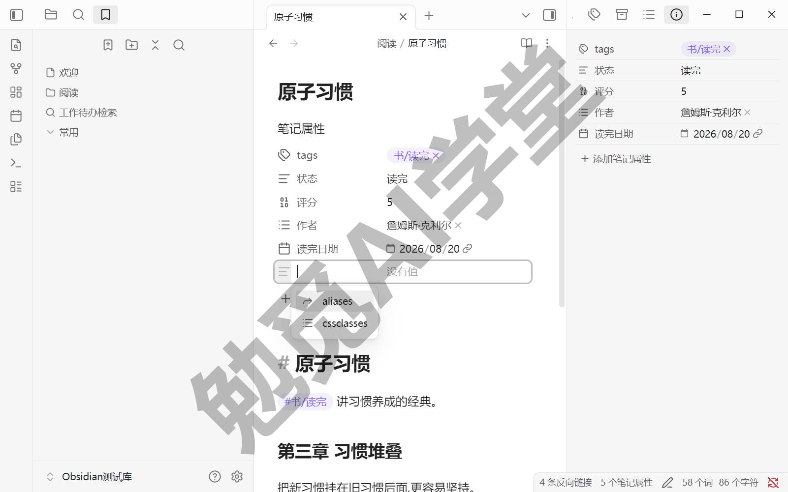

**编辑与删除**。点击值就能改；名称同样点击可改，改的只是当前笔记里的这一条（全库统一改名是本节末尾“属性列表”插件的事）。要删除一条属性，右键它所在的行选择删除（菜单项名称以实机为准）。属性区整体的显示方式在设置里调：官方中文帮助的路径为“设置 → 编辑器 → 笔记属性”（实际分组位置以实机为准），可选“显示”“隐藏”“源码”三种——平时保持默认的“显示”即可，“源码”留到 5.3 有大用。

**类型：属性的第三个要素**。除了名称和值，每条属性还有类型。类型决定这条属性能装什么样的值、Obsidian 怎么对待它——评分能按大小筛选、日期能弹出日期选择器，靠的都是类型。点属性名称旁边的类型图标，菜单里的“属性类型”一栏可以查看和更改这条属性的类型（菜单里依次是自动、复选框、日期、日期 & 时间、列表、数字、文本；“自动”会按值猜类型，tags 专属的“标签”型不在普通属性的菜单里）。课程按用途讲其中常用的 5 类，逐个过一遍。

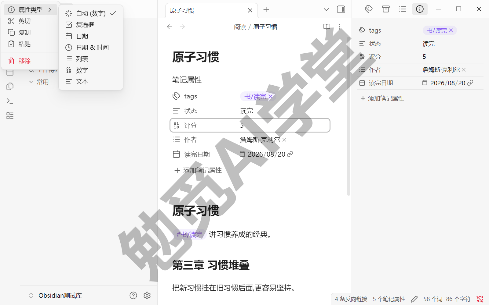

**文本**——装一行自由文字。出版社、一句话点评这类内容用它；新属性在没有其他线索时一般也按文本处理（以实际界面为准）。两点边界：文本属性里的 Markdown 写法不会被渲染，井号也不会变成标签（官方说法）；它可以装网址，也可以用 `"[[笔记名]]"` 的写法装内部链接——链接要包一层引号，在面板里手动输入时 Obsidian 会自动补上。

**列表**——装多个值，每个值单独占一行。一本书有两位作者、一个概念有三种叫法，就该用它：硬塞进文本属性写成“作者甲、作者乙”，以后就没法按单个值检索了。会看到：面板里每个值是一个小条目，回车继续加下一个。

**数字**——只装数字，整数小数都行。评分、页数这类要比大小的数据一定存成数字型：是数字，搜索时才能按大于小于过滤（5.5 就用它），到《Bases 数据库》里才能按它排序汇总；存成文本的“9”，比较时按字符处理，结果不可靠。会看到：输入位只接受数字。

**复选框**——只有勾选与不勾选两个状态，适合非黑即白的判断：是否读完、是否借出。会看到：面板上是一个可以直接点击的勾选框。

**日期**——装一个日期，读完日期、出版日期用它。会看到：点击值会弹出日期选择器；存储格式固定为“年-月-日”，显示格式跟随操作系统的区域设置。它还有一个官方联动：开启日记核心插件后，日期属性会同时作为指向那一天日记的链接——《日记、模板与每日工作流》讲日记插件时你会再遇到它。

剩下两类一句话交代。“日期 & 时间”是日期的变体，在日期之外多存一个具体时刻，会议开始时间这类信息用它，其余表现与日期一致。“标签”则是 `tags` 属性专属的特殊类型，不能分配给其他属性（官方说法）——它的存在就是让 5.1 的标签能以属性的形式挂在笔记头部。

**一条要紧的全库规则：类型跟着属性名走**。一旦“评分”这个名称被定为数字型，全库所有叫“评分”的属性都按数字型处理（官方说法）。好处是同名属性行为一致，将来汇总成表时一列里不会混着数字和文字；代价是同一个名称不能这篇当数字、那篇当文本。所以给属性起名时顺手把类型定对——这是一次性的事，能省掉后面所有的纠缠。

**三个默认属性**，添加属性时的建议列表里总会见到它们：

- `tags`：装标签，类型正是上面说的专属“标签”型（填写形式与列表相同，逐行一个）。与正文里打的标签地位相同，两处都会被搜索和标签面板收录；
- `aliases`（列表型）：装别名。《双链与图谱》讲过别名的用处——让一个概念的多种叫法都能命中链接补全和快速切换，那些别名就存在这条属性里；
- `cssclasses`（列表型）：给单篇笔记挂样式类，配合 CSS 代码片段改变某一篇的外观，属于外观定制的进阶玩法，深讲在《美化与工作区》，现在认识名字即可。

**全库属性总览：属性列表插件**。属性散在各篇笔记的头部，想看整座库一共用了哪些属性、各是什么类型，用“属性列表”核心插件。它提供两个侧边栏视图：一个显示当前笔记的属性（页签名“笔记属性”），另一个显示全库所有属性及其类型；分别用命令面板的“属性列表: 显示当前笔记的属性列表”“属性列表: 显示所有笔记属性”调出（面板形态以实机为准）。在全库视图里可以做三件事：

- 按名称或使用次数排序，一眼看出哪些属性用得最多、有没有重复起名的属性；
- 点击某个属性，会打开搜索视图并自动预填这个属性的检索语法——属性怎么搜，5.5 专门讲；
- 右键某个属性，可以在全库范围内重命名它：比如把早期随手起的“Rating”统一改成“评分”，散在几十篇笔记里的这个属性名一次全改。

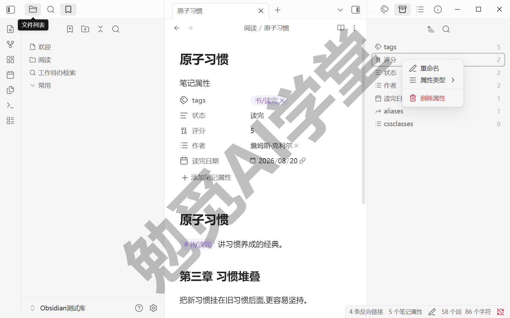

**能力边界也要交代清楚**：全库重命名改的只是属性的名称；属性的值没有原生的批量编辑——官方明确说明，属性列表之外的深度批量编辑建议使用 VSCode、脚本和社区插件这类外部工具。所以本课的做法是：名称层面的问题，用右键全库重命名解决；值要成批修改（比如把几十篇笔记的“状态”从“在读”改成“读完”），原生路线就是手工逐篇改。属性毕竟是纯文本（5.3 马上看到），真到几百篇的规模，外部文本工具的批量替换永远是兜底。

### 5.3 YAML 本质

属性面板用顺了，还差最后一层：这些属性到底存在文件的什么地方？弄清这一层，上一节文首输入 `---` 会变出属性的谜就解开了，你还会顺手拿到排查问题和使用模板的钥匙。

**切到源码视图看一眼**。把一篇带属性的笔记切换到源码模式——切法《界面与设置全导览》讲过：在命令面板搜“源码”，执行“切换实时阅览/源码模式”（三种视图的分工也在那一篇——实时预览边写边成型、源码满屏符号、阅读只读）。你会看到文件最顶端有一段被上下两行 `---` 夹住的文字，样子大致是：

```yaml
---
tags:
  - 书/读完
作者: 王小明
评分: 9
读完日期: 2026-08-20
---
```

这段区域的通行叫法是 frontmatter（可以理解为“文件头”，这个英文词不必记），里面的写法遵循一种叫 YAML 的纯文本格式。属性面板上的每一条，对应这里的一行文本；面板只是这段文本的图形化显示，两边完全等价——在面板上加一条属性，这里就多一行；在这里手写一行，切回去面板上也会多一条。你可以当场验证：在源码里把 9 改成 8，切回实时预览，面板上的评分已经跟着变了。另有一个细节：frontmatter 里的标签不带 `#` 前缀——源码里就是这么存的，正文和搜索里用它时才带 `#`。

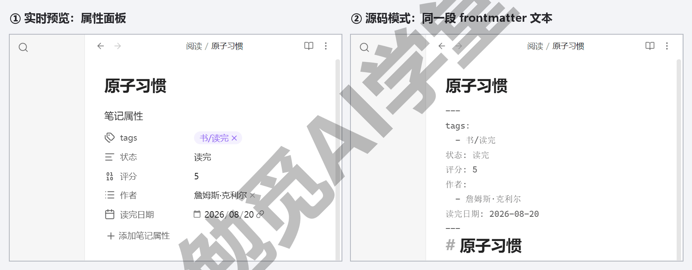

**手写 frontmatter 的几条规则**。平时用面板就够了，但模板、排错都会碰到手写，规则一共没几条：

- 名称和值之间用英文冒号加一个空格分隔，写成 `评分: 9`——冒号后漏掉空格是最常见的手写错误，这条属性会解析不出来；
- 列表型的值每个单独一行，行首一个短横线加一个空格，上面例子里 `tags` 下面的两行就是这个写法；
- 值里放内部链接时要用引号包住，写成 `"[[笔记名]]"`；在面板里输入时引号会自动补上，手写时要自己记得加；
- 同一篇笔记里属性名不能重复，比如不能同时出现两个 `tags`；各条属性的先后顺序倒是随意，不影响解析。

顺带划一条边界：`---` 夹住的这段走 YAML 规则，它不是 Markdown 正文语法——正文里加粗、链接那套写法的完整讲解在姊妹篇《Markdown 通用语法手册》的《基本语法》篇，两套规则各管各的地盘，不要互相套用。

**为什么值得懂这一层**。三个回报：

- 数据完全自有在属性上兑现。《认识与装好》定下的理念——笔记是你硬盘上的纯文本文件——对属性同样成立：评分、日期这些结构化数据就写在 .md 文件的头几行里，记事本都能打开看、打开改，将来换工具全部带得走；
- 模板可以预填属性。属性既然只是文件头的几行文本，把这几行写进模板文件，新建笔记时属性就自动带出来——《日记、模板与每日工作流》会用这一招，让每篇新笔记一建出来就带着 `tags` 和该填的字段；
- 排查问题有了着手处。面板显示不对劲时，切到源码视图直接看这几行文本，缺空格、缩进歪了都一眼可见——比对着面板干着急有效得多。

**一个来自旧资料的坑**。网上老教程里常见 `tag`、`alias`、`cssclass` 这样的单数写法——它们是被废弃的旧属性名：官方从 1.4 版本起弃用、1.9 起不再作为默认属性支持，现行写法是复数的 `tags`、`aliases`、`cssclasses`。照着老资料手写 frontmatter 时留意这一处；如果搬进来的旧笔记里有成批旧写法，官方的“Markdown 格式转换器”核心插件可以批量转换（插件名为官方中文帮助的叫法，使用细节以实机为准）。

### 5.4 标签和属性怎么分工

两样工具都会用了，真正的问题才出现：一条信息到底该贴标签还是进属性？“在读”看着像标签，“评分 9 分”看着像属性，那“2026 年读完”呢？这一节给你一个用得住的判断标准。

**先看两者的特点**：

- **标签**：轻、快、不带值。一个记号打上就走，状态变了就是改个记号，适合把笔记圈成一类——它回答的是“这篇属于哪个筐”；
- **属性**：结构化、带值、带类型。要起名、要填值、要定类型，适合记录一个量——它回答的是“这篇的某项指标具体是多少”。

**判断标准就一句：这条信息将来要不要排序、筛选、计算？** 要，就进属性——评分要筛“8 分以上”、读完日期要按先后排、页数要求总和，这些只有带类型的值才办得到。不要，只是想把笔记归进某个类别或状态，就贴标签——`#书/在读` 一个记号就够，状态变了把标签一改就完事。

拿开头的三条试一遍：“在读”是状态，圈类用的——贴标签，`#书/在读`；“评分 9 分”将来要排序筛选——进属性，数字型；“2026 年读完”要按时间先后排——进属性，日期型。以后每条拿不准的信息都问一遍这个标准，多数当场有答案。

还有一个常见的追问：属性也能装“类别”，为什么不干脆全部进属性？因为两者的使用成本不同。标签在正文任何位置输入一个 `#` 就打完了，看得见、点击即搜；属性则要打开面板、起名称、填值、定类型。像“在读”这种经常要改的高频状态，用标签最省事；真到需要按状态排表做统计的那天，再把它升级成属性也不迟——两边都是纯文本，将来要搬也搬得动。

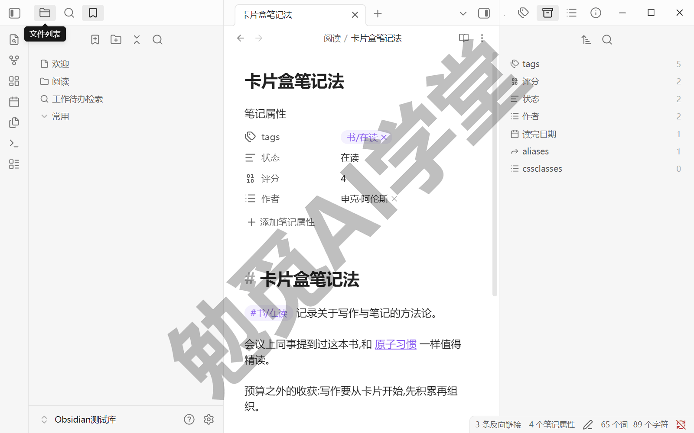

**放进全库的组织版图里看**。《库、文件与搜索》定过三种组织方式的分工——文件夹管唯一归属、标签管多维分类、双链管知识关联。《双链与图谱》把双链讲透了，这一篇补上标签，又加了属性这个更细的量化层。四样工具各管一段，拼起来才是完整的组织版图：

- **文件夹**：管这篇笔记存在哪。归属唯一，《库、文件与搜索》建议的浅结构继续保持，不要用它表达会变的状态；
- **双链**：管这篇和谁有关。网状关联，《双链与图谱》教过的“先链后写”在任何组织方式下都继续有效；
- **标签**：管这篇属于哪类、处在什么状态。多维分类，一篇可以多挂，状态变化时改起来零成本；
- **属性**：管这篇的各项指标是多少。带类型的结构化数据，排序、筛选、计算都靠它，它也是下游表格的数据源。

**给后面两篇铺个底**。属性这层现在多打一分，后面的回报是加倍的：《Bases 数据库》和《Dataview 专讲》做的事情，本质都是把散在各篇笔记里的属性自动汇成表格和清单——表里的每一列就是一个属性。你今天给读书笔记打上的“评分”“读完日期”，到那两篇里就是书单表里现成的两列，一分额外的工作都不用补。

### 5.5 标签＋属性＋搜索联动检索实战

分工定了，这一节把标签、属性、搜索三样工具串成一条能天天用的检索链，从头到尾完整走一遍。目标场景：读书笔记越攒越多，你想要一个随时点开就能看的“高分书单”，而且不想手工维护它。

**准备素材**。按前两节的做法准备几篇读书笔记：每篇打上 `#书/在读` 或 `#书/读完` 标签区分状态，属性给足“评分”（数字型）和“读完日期”（日期型）——拿 5.6 的任务二当底子正合适。篇数不用多，五六篇就能把整条链走通。

**第 1 步：用标签圈出范围**。打开全局搜索。《库、文件与搜索》讲过的 `tag:` 操作符在这里派上用场——它按标签精确匹配，官方说明它会跳过代码块等无关内容，比全文搜关键词更快也更准。输入：

```
tag:#书
```

会看到：打了 `#书` 及其子标签的笔记全部列出——5.1 说的“父标签连子标签一起命中”在这里兑现，`#书/在读` 和 `#书/读完` 都在结果里。想只看读完的书，把搜索词写全成 `tag:#书/读完`，范围立刻收窄。

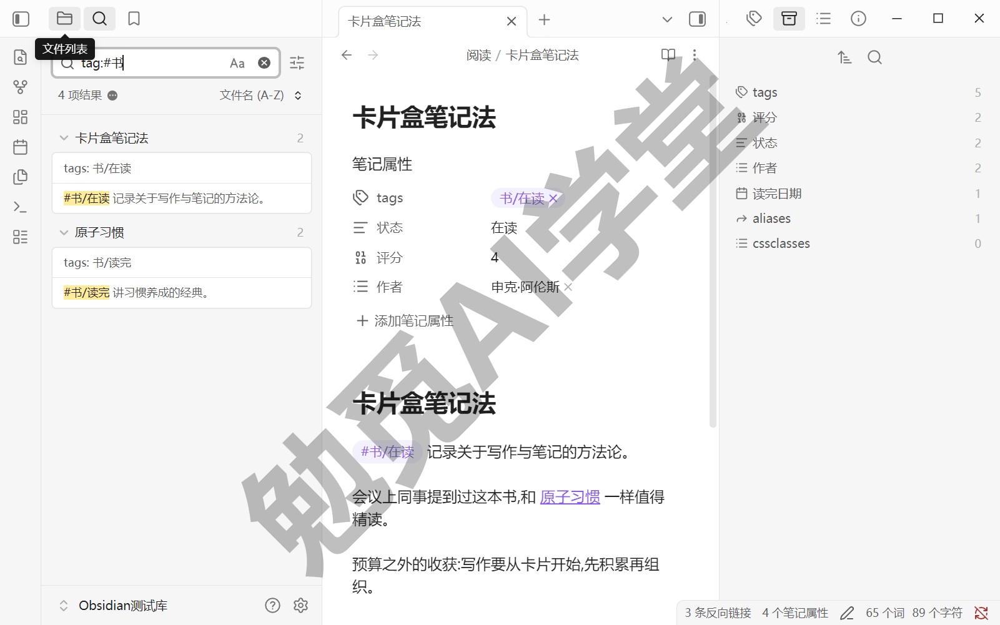

**第 2 步：用属性过滤出高分**。属性有自己的检索写法：方括号包住属性名。在搜索框里把条件追加上去：

```
tag:#书/读完 [评分:>8]
```

会看到：结果只剩下读完并且评分高于 8 的笔记。方括号检索的三种常用写法一并记下：

- `[评分]`——只要这篇笔记有“评分”这个属性就命中，不管值是多少，适合盘点“哪些笔记打过分”；
- `[评分:9]`——属性等于某个值才命中，文本属性同理，比如 `[作者:王小明]` 找出某位作者的全部书；
- `[评分:>8]`——数字型属性可以比大小，大于小于都支持（官方说法），这正是 5.2 坚持让评分存成数字型的原因。

再送一条查漏用法：`tag:#书/读完 [评分:null]` 找出“读完了却忘打分”的笔记——`null` 匹配属性存在但值为空的情况。定期跑一遍这条，就能把漏打的分补齐。

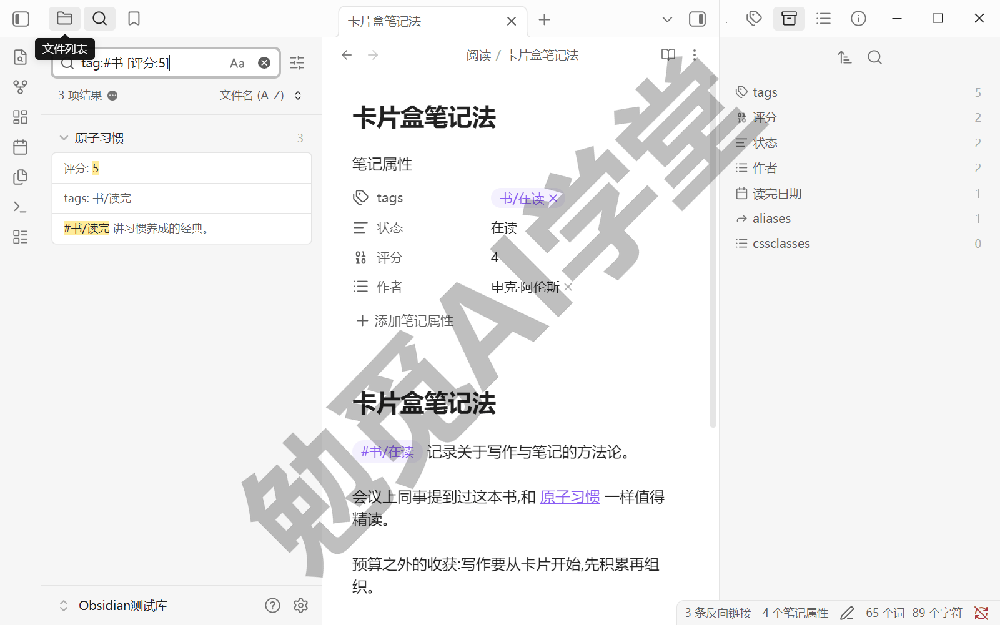

**第 3 步：把这条搜索保存下来**。组合条件以后要反复用，不该每次手敲。按官方帮助，搜索结果数量旁边的三点菜单里可以把当前搜索收藏为书签（入口与菜单项叫法以实机为准）——《库、文件与搜索》讲过书签面板能收藏笔记、文件夹和搜索，这里收的就是一条搜索。收藏时给它起名“高分书单”。

会看到：书签面板里多出“高分书单”一条。以后任何时候点击它，这条组合检索立刻原样重跑——新读完一本书、打上分，下次点开书单它自动就在；不再满足条件的，自动消失。清单从此不用手工维护。

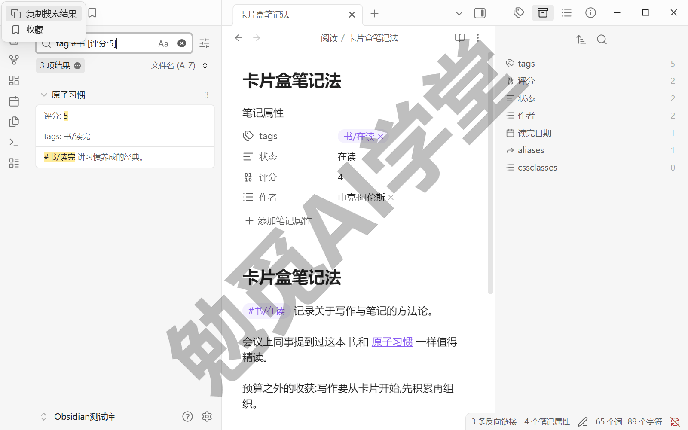

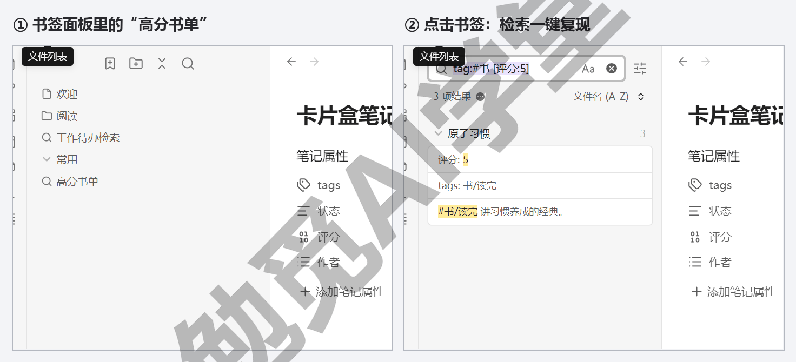

**回头看这条链**：标签负责圈范围——哪一类、什么状态；属性负责精确过滤——带类型的值可以比较；搜索把两者组合起来；书签把成果固定住。每一段都是你已经会的操作，串起来就成了一份自动更新的清单。

**留一个预告**。这条链眼下的产出还是一份搜索结果列表——能看，不能改。到《Bases 数据库》那一篇，同样这批笔记和属性会变成一张真正可编辑的表格：行是笔记，列是属性，在表里改一个格子，笔记头部的属性跟着变。你现在打好的每一条属性，到时候都是现成的列——这也是本篇开头说它是“地基”的原因。

### 5.6 三个练习任务

轮到你动手。三个任务从铺标签到跑通检索链，正好把这一篇的三层能力各练一遍。

**任务一：铺标签**

给你库里已有的笔记补一套两层嵌套标签，叶子标签控制在 10 个以内。动手前先在一篇草稿笔记里列出整套体系（比如 `#书/在读`、`#书/读完`、`#领域/心理学`），确认没有同义重复再动手铺。

完成标准：标签面板里能看到清晰的树形结构，且没有两个意思相同的标签。

**任务二：建属性**

写一篇读书笔记，把五个常用属性类型各用一次：出版社（文本）、作者（列表）、评分（数字）、是否做完笔记（复选框）、读完日期（日期）。打完切到源码视图，对照 5.3 的规则把自己的 frontmatter 读一遍。

完成标准：属性面板与源码 frontmatter 能一一对上——面板有几条，文件头就有几行。

**任务三：跑通链**

在自己的库里完整走一遍“标签圈定 → 属性过滤 → 保存搜索”：先用 `tag:` 圈出一类笔记，再加一个方括号属性条件收窄，最后把这条搜索收藏成书签。

完成标准：点击书签能一键复现同样的检索结果。

### 5.7 本篇小结与自检

这一篇给笔记装上了元数据：嵌套标签管分类，属性管结构化数据（类型现行 7 类，以实机类型菜单为准），YAML 是它们的纯文本本质，最后用“标签＋属性＋搜索”跑通了一条完整检索链。最需要记住的是：**轻量分类用标签，要排序筛选的数据进属性——属性是后面 Bases 和 Dataview 的地基，现在多打一分属性，后面表格自动多一列。**

可以对照下面的清单检查学习结果：

- [ ] 建立了自己的嵌套标签体系且无同义标签
- [ ] 文本、列表、数字、复选框、日期五个常用属性类型各自用过一次，知道在哪里改
- [ ] 能在源码视图里看懂并手写简单的 frontmatter
- [ ] 能说出标签与属性的分工规则
- [ ] 跑通过“标签→属性过滤→保存搜索”完整一条链

完成这些内容后，你的笔记既成网又有了坐标。下一篇《日记、模板与每日工作流》把这些能力串成每天真的会跑的一条龙流程。

### 5.8 新手常见问题

**Q1：标签和文件夹功能重复了怎么办？**

不重复，分工不同。《库、文件与搜索》定下的规则是：文件夹给唯一归属——一篇笔记只能归进一个文件夹；标签给多维分类——一篇笔记可以同时挂多个标签，改状态也只是改个记号。实际用法是文件夹保持浅结构、只管粗归属，分类和状态交给标签。如果你发现自己在建“在读”“读完”这样的文件夹，那就是该换标签的信号——笔记状态一变就得挪文件，太折腾。

**Q2：属性会不会破坏 md 文件的纯文本性？**

不会。属性本身就是纯文本——5.3 看过，它们只是文件开头被 `---` 夹住的几行普通文字，用记事本打开这个 .md 文件，看到的就是这几行。其他软件即使不认识 frontmatter，也只是把它当普通文字显示，正文原样保留。“十年后还打得开”的承诺对属性同样成立。

**Q3：标签写在正文里和写在属性里有区别吗？**

地位相同：两处的标签都会被 `tag:` 搜索和标签面板找到。差别在含义——正文标签打在具体段落旁，天然标记“这一处提到了什么”；`tags` 属性描述的是整篇笔记的归类。习惯上，给整篇定性的标签放属性区，行文中即兴标记用正文标签。另有一个容易踩的坑：文本类型的属性里写井号不会生成标签（官方说法），想在属性区放标签，只能放进 `tags` 这个专属属性。

**Q4：YAML 写错了会发生什么？**

最常见的错误是冒号后面没加空格、或列表缩进不对。写错后这条属性可能解析不出来，属性面板可能显示异常或给出格式提示（具体提示形态以实际界面为准）——笔记正文不受任何影响。处理办法：切到源码视图直接看 frontmatter，对照 5.3 的几条手写规则逐行检查，多数问题一眼可见；实在改不明白，把这段属性删掉、用面板重新加一遍也很快。
