## 日记、模板与每日工作流

前面几篇学到的都是单项能力：双链把笔记连成网，标签和属性给笔记装上坐标。这一篇把它们串成一条每天真的会跑的流程：早上打开日记、白天随手速记、周末做一次回顾。主角是三个核心插件——日记、模板、时间戳笔记生成器，用到的模板全文给出，可以照抄。

读完并做完练习，你的库会多出一条不依赖任何社区插件的每日工作流，从明天早上就能开始跑。

### 6.1 日记核心插件

**为什么从日记开始**。很多人装好笔记软件后慢慢就不写了，原因常常是件很小的事：每天打开软件，不知道往哪写——新建笔记要想标题、想放哪个文件夹，这点犹豫每天重复一次，热情就消磨掉了。日记插件把这个决定省掉了：每天固定有一张以当天日期命名的笔记，今天的事、临时的想法，先落在这里再说。你可以把它理解成每天自动铺开的一张工作台面：它只是当天工作的起点，不要求你坚持写作，更不要求写成日记文学。

**开启插件**。《界面与设置全导览》给核心插件画过总览地图：核心插件是官方内置的功能件，开关集中在设置的“核心插件”页。现在打开设置，进入“核心插件”，确认“日记”处于开启状态（它是否默认开启，需实机验证）。

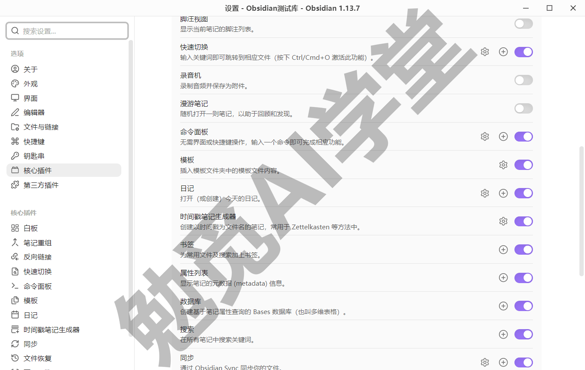

**打开今天的日记**。开启后，官方给了三种方式做同一件事：

- 点功能区（最左侧竖条）的日历图标，官方中文帮助里这个动作叫“打开/创建今天的日记”，也是最常用的方式；
- 在命令面板里执行同名命令——《界面与设置全导览》定下的兜底习惯在这里照常适用：记不住入口，就打开命令面板搜它；
- 给这条命令配一个自定义快捷键，让它一按就开——配法就在下面，一分钟配好。

无论用哪种方式，做完都会看到：Obsidian 打开（不存在就先创建再打开）一篇以今天日期命名的笔记，名字形如 2026-08-24。日记只在你打开它的那天才创建，不打开就不会凭空生成，所以不用担心哪天没写就攒出一堆空文件。

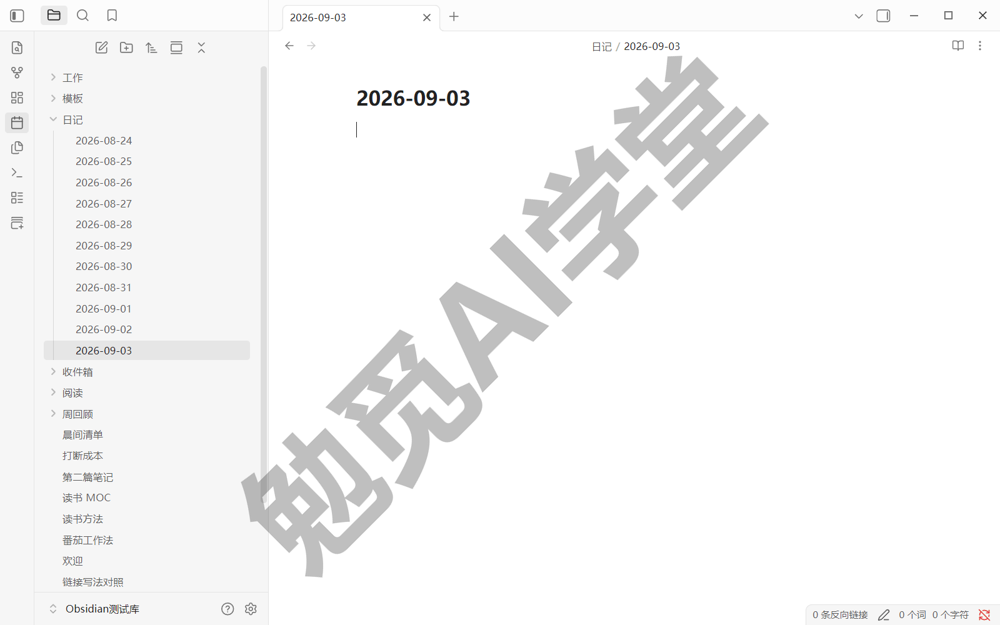

**给命令配快捷键**。像“打开今天的日记”这种每天都要用的命令，每次呼出命令面板再搜一遍还是嫌慢——绑一个快捷键，一按就开。打开设置，进入“快捷键”页，在页内搜索框输入“日记”，找到“日记: 打开/创建今天的日记”这条命令，点它右侧的加号按钮（悬停提示“自定义快捷键”），然后直接按下你想用的组合键（比如 `Ctrl+Alt+D`），绑定立即生效。做完会看到：命令右侧显示出你按的组合键，点组合键旁的叉号可删除重绑；此后在库里任何时候按下它，今天的日记应声打开。两点顺带交代：组合键若已被别的命令占用，设置页会在对应组合键上给出冲突警示，顶部还有“冲突”过滤器可以把全部冲突项筛出来看，换一个组合即可；这套绑定方法对任何命令都适用——《界面与设置全导览》设置总览里那格“快捷键”，说的就是这里，6.3 还会用它给闪念入口配键。

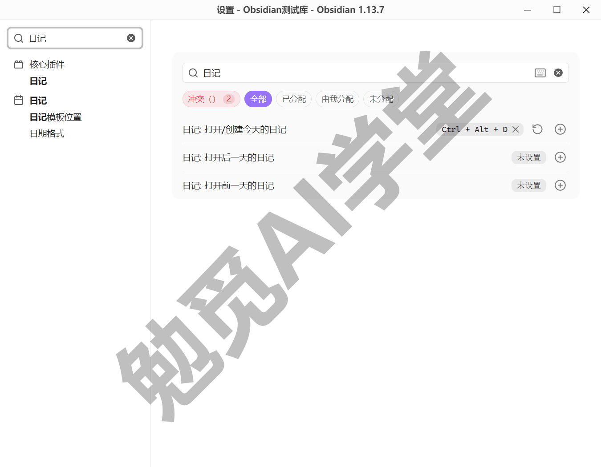

**三项设置**。回到设置，进入日记插件自己的选项页，有三项值得现在认识清楚：

- **日期格式**——决定日记的文件名长什么样，默认 YYYY-MM-DD（年-月-日，如 2026-08-24）。建议保持默认：这个格式按名称排序就是按时间排序，别的笔记里的日期属性也默认按它书写，两边天然对得上。
- **新笔记的存放位置**——不填的话，日记会直接落在库的根目录。建议专门建一个“日记”文件夹填在这里，让日积月累的日记不和其他笔记挤在一起；具体怎么填，6.4 搭工作流时一并配齐。
- **日记模板位置**——把一个模板文件挂给日记插件，每天的新日记就自动带上固定结构。现在先留空，等 6.4 做好晨间日记模板后再回来填它。

想每次启动 Obsidian 都直接落在今天的日记上，这一项不在日记插件的选项页里：打开设置的“文件与链接”页，把“默认打开文件”从“上次打开的文件”改成“日记”即可，习惯以日记开工的人可以改。

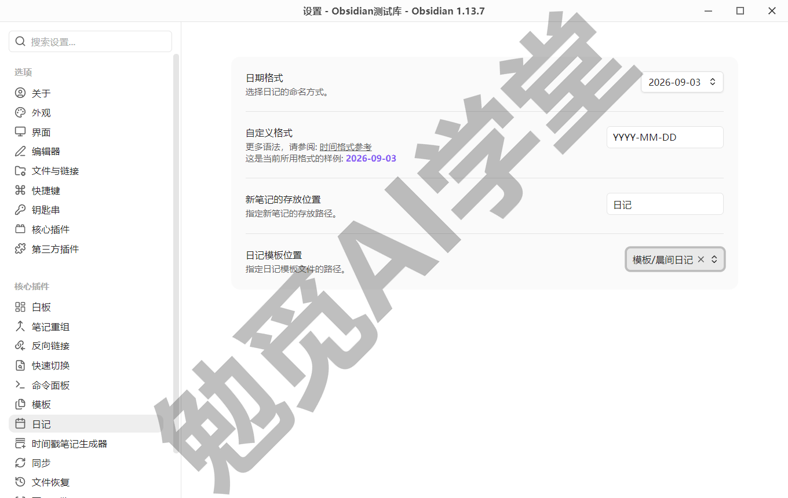

**存放规划的推荐做法**。日记要不要按年、按月分文件夹？起步阶段建议平铺：全部放在“日记”一个文件夹里，文件名就是日期，排序天然按时间走，一年三百多篇也不难翻。等将来真觉得多了，官方预留了办法：把日期格式写成带斜杠的形式（如 `YYYY/MM/YYYY-MM-DD`），新日记就会自动按年、月落进对应的子文件夹（该行为需实机验证）——官方帮助的示例正是这种用法。这个决定不用现在做，平铺起步不会错。

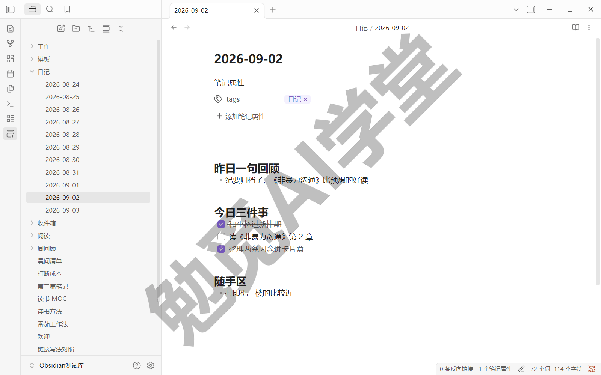

**在日期之间跳转**。命令面板里还有“日记：打开前一天的日记”“日记：打开后一天的日记”两条跳转命令，回看昨天写了什么，不用去文件列表里翻。另外说一个顺带的联动：开启日记插件后，别的笔记里的日期属性——《标签与属性》里你已经用过这种属性类型——在实时预览下会变成可点击的链接，点一下直达那一天的日记（具体表现需实机验证）。日期属性和日记，就这样打通了。

一句话总结：日记插件解决“每天从哪开始写”。它现在还是一张空台面，接下来两节配上模板和闪念入口，这张台面才算真正布置好。

### 6.2 模板核心插件与模板变量

**为什么需要模板**。有些笔记天生长得一样：每篇读书笔记都要“一句话评价、核心观点”，每天的日记都要“回顾、待办、随手记”。没有模板，这套骨架每次都要手打，或者从旧笔记里复制再删改，既麻烦，还容易越抄越走样。模板核心插件做的事很直接：把预先写好的内容一键插进当前笔记，固定结构从此只写一次。

配置分四步，几分钟走完。

**第 1 步：建一个“模板”文件夹**

在文件列表里新建文件夹，命名为“模板”。模板本身也是普通的 .md 笔记，集中放进一个文件夹，插件才知道去哪找它们。做完会看到：文件列表里多了一个空的“模板”文件夹。

**第 2 步：告诉插件模板放在哪**

打开设置，确认核心插件“模板”已开启，进入它的选项页，在“模板文件夹位置”一栏填上刚建的“模板”。做完会看到：输入路径时 Obsidian 会弹出补全建议，选中即可。

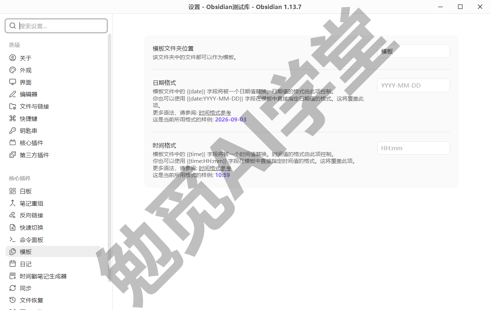

**第 3 步：写第一个模板**

在“模板”文件夹里新建一篇笔记，命名为“读书笔记”，切到源码视图，写入下面的内容（先照抄，变量马上讲）：

```
---
tags:
  - 读书
date: "{{date}}"
---

# {{title}}

## 一句话评价
- 

## 核心观点
- 

## 想到的联系
- [[]]
```

这里有一个官方明确提醒过的坑：模板文件建议在源码视图下编辑。原因是在实时预览下，笔记属性面板可能会把属性区里没加引号的模板变量（比如裸写的 `{{date}}`）当成普通属性值改写掉。官方给了两个办法：

- 模板文件一律用源码视图编辑；
- 在设置的“编辑器”页把“笔记属性”一项设为“源码”。

上面的模板给 date 的值加了引号，这正是官方示例的写法——按官方说法，加了引号的变量不会被属性面板覆写。三种视图怎么切换，《界面与设置全导览》讲过：在命令面板执行“切换实时阅览/源码模式”就能来回切。这里只用到一点：编辑模板文件时，切到源码视图最稳，所有格式符号和属性原文都摆在明处。

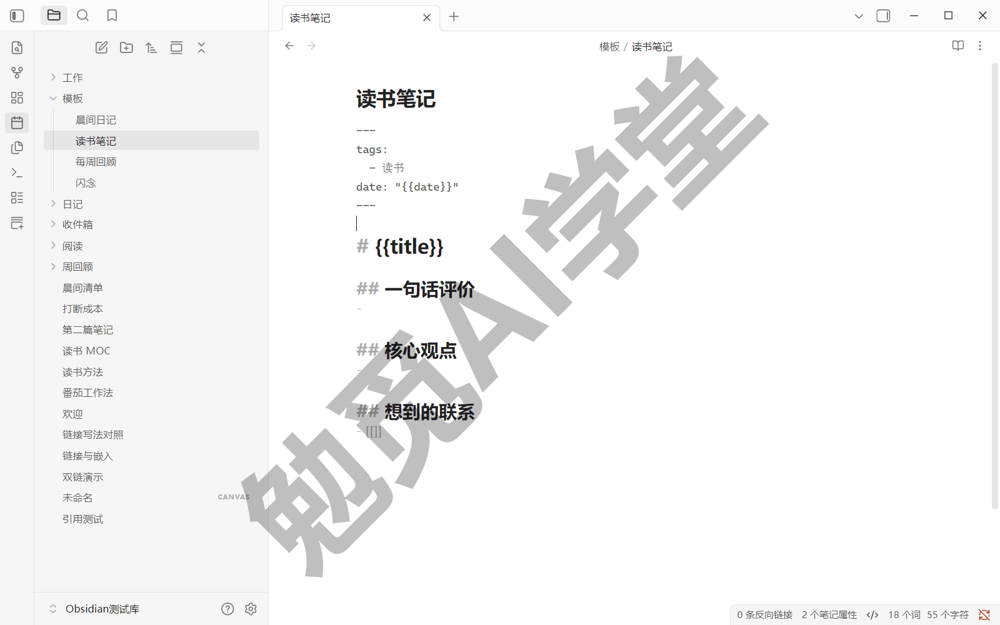

**第 4 步：插入模板**

新建一篇笔记，起名“非暴力沟通”，把光标点进正文，打开命令面板执行“模板：插入模板”，在弹出的列表里选“读书笔记”。功能区通常也有一个“插入模板”按钮，效果相同；还有一条更顺手的路——斜杠命令，插完这一次马上讲。做完会看到：模板内容出现在光标位置，`{{title}}` 变成了“非暴力沟通”，`{{date}}` 变成了今天的日期——变量在插入的那一刻完成替换。官方还说明了一个细节：如果光标不在正文里，内容会插到上一次光标所在的位置（该行为需实机验证）。

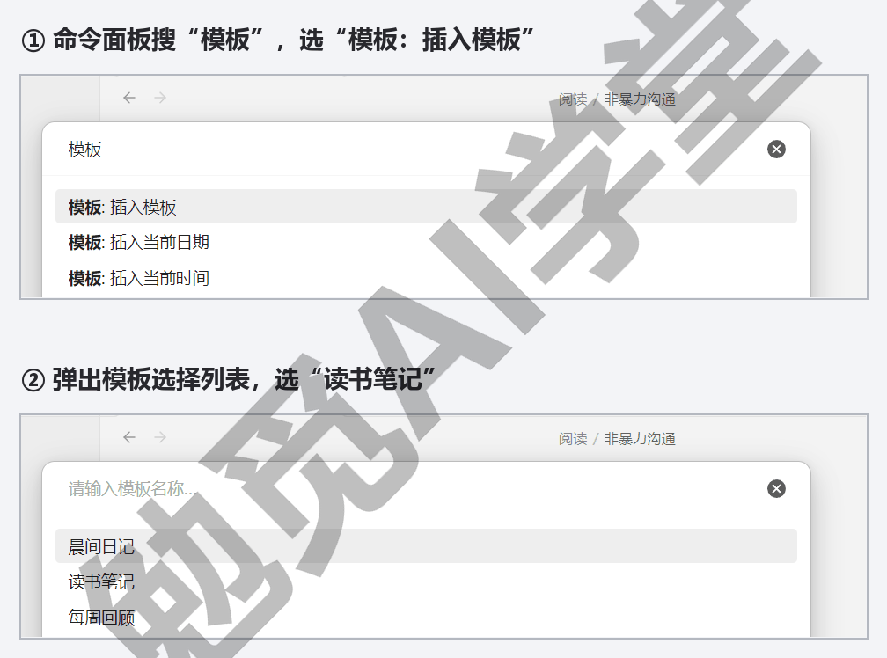

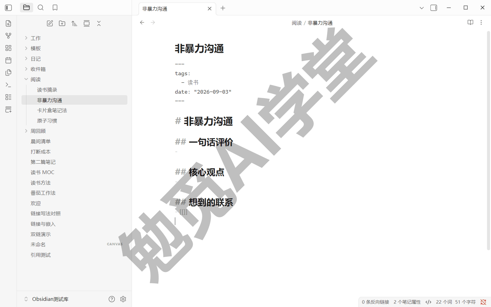

**斜杠命令：不离键盘调命令**。“斜杠命令”是一个核心插件：开启后在正文里输入 `/`，光标旁会弹出命令列表，继续打字过滤，回车执行。它省的是“手离开正文”这个动作——不用去点功能区，也不用先按组合键呼出命令面板，写着写着直接一个 `/`，思路不断。它默认处于关闭状态，先去设置的“核心插件”页把“斜杠命令”打开，回到刚才那篇笔记，在正文空行处输入 `/`，接着输入“模板”过滤，选中“模板: 插入模板”回车——弹出的模板选择列表和在命令面板里执行时完全一样。做完会看到：命令列表随 `/` 浮现在光标旁，执行后列表连同斜杠一起消失。它和命令面板的分工一句话说清：命令面板任何时候都能呼出，全库的功能都能执行；斜杠命令只在正文编辑时可用，适合写作中途顺手调一条命令。

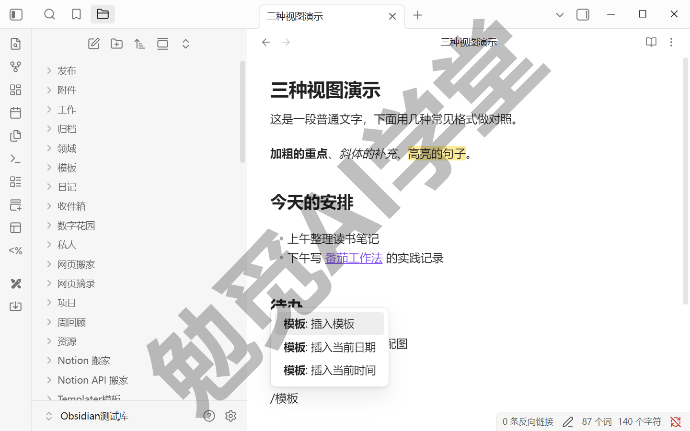

**三个模板变量**。核心插件的变量一共三个（以当前版本官方帮助为准）：

- **`{{title}}`**——替换成当前笔记的标题，取的是插入那一刻的标题。适合像上面那样当一级标题或开头用，让笔记内容和文件名保持一致。
- **`{{date}}`**——替换成今天的日期，默认格式 YYYY-MM-DD。在读书笔记里它是“哪天读的”，在日记模板里它就是“这篇日记属于哪天”的自动署名。
- **`{{time}}`**——替换成插入那一刻的时间，默认格式 HH:mm（24 小时制）。想记录“这条是什么时候写下的”，靠它最省事。

想换格式，在变量名后加一个半角冒号，再接格式代码，比如 `{{date:MM-DD}}` 只保留月和日。`{{date}}` 和 `{{time}}` 用的是同一套格式代码，官方帮助明确允许 `{{time:YYYY-MM-DD}}` 这种混搭。常用格式代码如下（完整代码表见官方帮助链接的 Moment.js 文档）：

| 代码 | 含义 | 示例输出 |
| --- | --- | --- |
| `YYYY` | 四位年份 | 2026 |
| `MM` | 两位月份 | 08 |
| `DD` | 两位日期 | 24 |
| `HH` | 小时（24 小时制） | 09 |
| `mm` | 分钟 | 45 |

默认格式也能改：模板插件的选项页里有“日期格式”和“时间格式”两项，改完之后，所有不带格式串的 `{{date}}` `{{time}}` 都按新默认输出。顺带认识两条轻量命令：“模板：插入当前日期”和“模板：插入当前时间”——不用建任何模板文件，随手把当前日期或时间打进正文，用的正是这两个默认格式。

**模板里预填属性**。回头看模板开头那段属性区，这是模板真正省心的地方。《标签与属性》讲过：属性是笔记头部的结构化字段，标签写在 tags 属性里、不带井号。把它们写进模板，每篇新笔记一建出来就带元数据——读书笔记自动带上“读书”标签和当天日期，不用靠自觉，也不会漏掉。《标签与属性》结尾说过的那句话从这里开始兑现：现在在模板里多预填一个属性，后面《Bases 数据库》的表格里就自动多一列现成的数据。

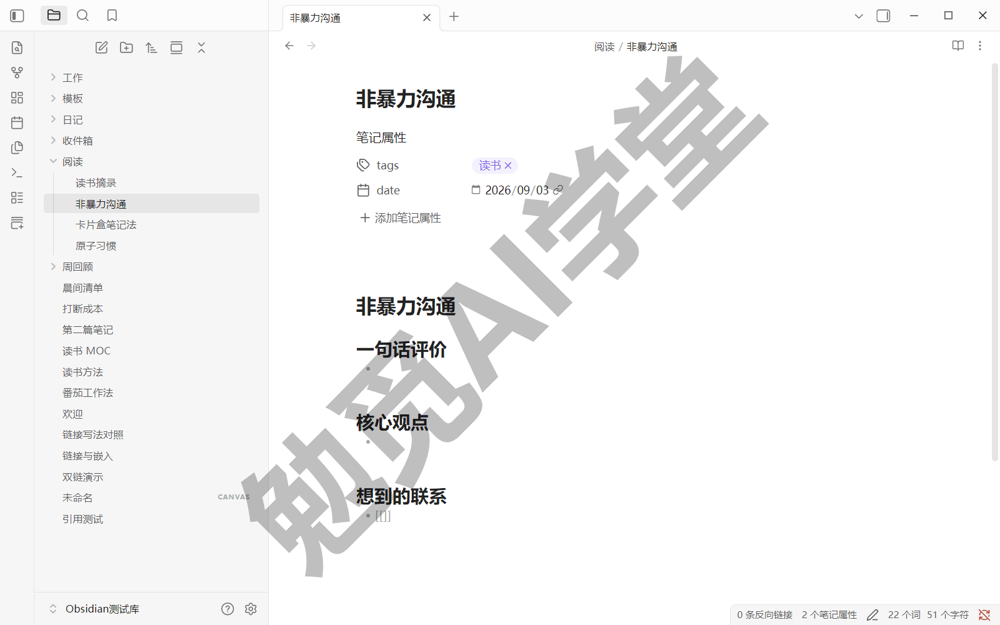

一句话总结：模板文件夹配好、三个变量会写、属性预填上，重复的骨架就再也不用手打了。

### 6.3 唯一笔记：闪念速记入口

**先看一个场景**。你正在改一份表格，忽然想到一个不错的选题。切到 Obsidian，新建笔记——光标停在标题栏：叫什么名？放哪个文件夹？两个小决定花掉十几秒，再切回表格，刚才改到哪也忘了。更常见的结局是反过来：嫌麻烦，干脆不记，过半小时想法彻底没了。

**这一节的主角**，在官方中文帮助和界面里都叫“时间戳笔记生成器”（英文名 Unique note creator）。它解决的正是上面那两个小决定：一键新建一篇笔记，名字自动用创建时刻的时间戳，位置固定，你一个字都不用想。课程用一个更直白的说法，把它产出的笔记叫“唯一笔记”——时间戳永不重复，笔记永不重名。

**命名规则** 很好认：年、月、日、时、分连排成 12 位数字。官方帮助的例子：2024 年 1 月 1 日 09:45 创建的笔记，名字是 202401010945。如果同一分钟里连建两篇，新笔记会自动顺延用下一个可用的时间戳，不会撞名，也不会弹窗打断你。名字即创建时间，还有一个附带的好处：闪念笔记按名称排序，就是按先后顺序排列。

**开启与设置**。打开设置，在“核心插件”页开启“时间戳笔记生成器”，再进入它的选项页，一共三项：“新建笔记的存放位置”建议指向一个专门的文件夹——课程约定叫它“收件箱”，意思是先收进来、以后再处理，6.4 会正式建这个文件夹；“模板文件位置”可以挂一个模板，让每条闪念一生成就带属性；“时间戳格式”保持默认即可。

给闪念挂的模板可以极简，比如只预填一个标签：

```
---
tags:
  - 闪念
---

```

这样以后不管这些笔记被移去哪里，一条标签搜索都能把它们全找回来——《标签与属性》定下的分工（轻量分类用标签）在闪念上的应用。不挂模板、让闪念保持完全空白也可以，越省事越好。

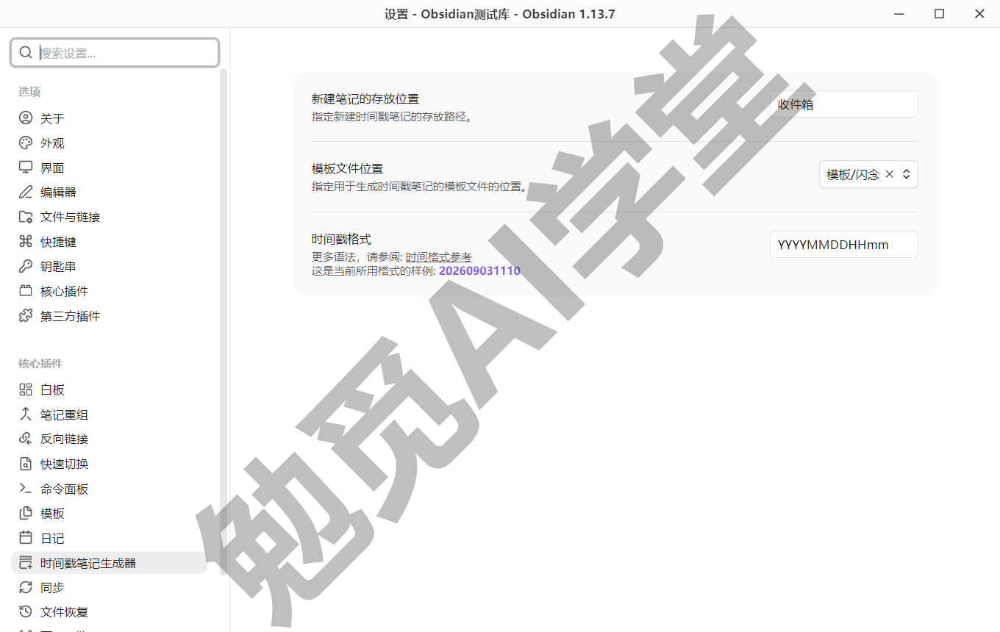

**怎么用**。两种方式：点功能区的“创建时间戳笔记”按钮，或在命令面板执行同名命令。做完会看到：一篇以时间戳命名的新笔记立即打开，直接打字就是记录。想把动作压到最少，给这条命令配一个自定义快捷键——照 6.1 给日记命令绑键的做法，在设置的“快捷键”页搜“时间戳”，给“创建时间戳笔记”绑一个组合键；配好之后，从灵感出现到记完关窗，十秒是够用的。

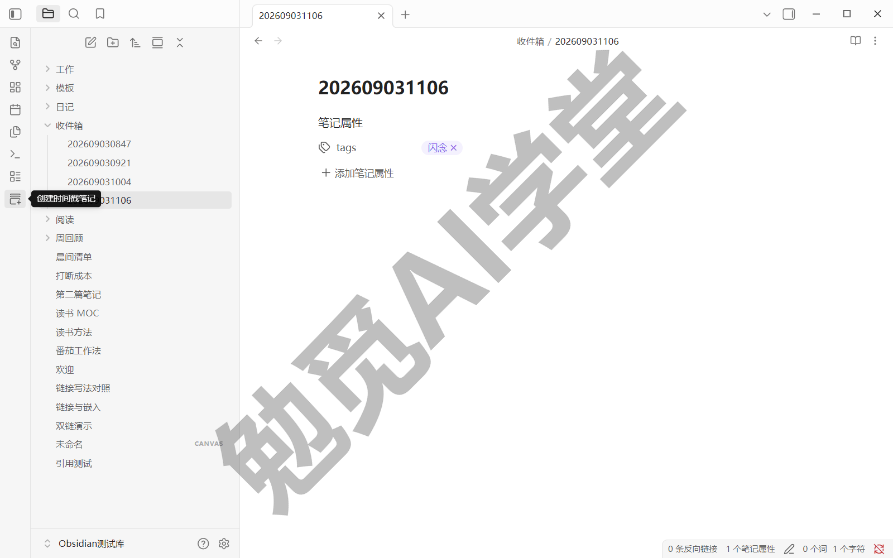

**闪念只有一条原则**：先记下来再说。闪念入口的全部价值在“不打断当下”——记的时候不起标题、不选分类、不纠结措辞，写完立刻回去干手头的事。归类和加工统一留给每周回顾；灵感出现的那一刻，只负责记下。固定进收件箱，是为了让“以后再整理”有一个确定的去处，而不是散落全库找不回来。

一句话总结：十秒记下一条闪念，靠的是提前把决定做完——名字由时间戳自动生成，位置固定在收件箱，格式由模板预填。

### 6.4 一条龙：晨间日记、闪念速记与每周回顾

三个插件各自到位，现在把它们排进你的一天和一周。这条流程在课程里叫一条龙，意思是三个动作首尾相接：早上打开日记铺好台面，白天闪念随手进收件箱，周末回顾时清空收件箱、再给下周开好头。缺哪一段，前一段攒下的东西就没了去处。两个模板在这一节全文给出，先照抄用起来，再按自己的习惯改。

**第 1 步：把库准备好**

在库里建四个文件夹：“日记”“收件箱”“模板”“周回顾”（前两节已经建过的不用重复建）。然后回到日记插件的选项页，把“新笔记的存放位置”填成“日记”；“日记模板位置”一栏先不动，做完下一步回来填。做完会看到：文件列表里四个文件夹就位。

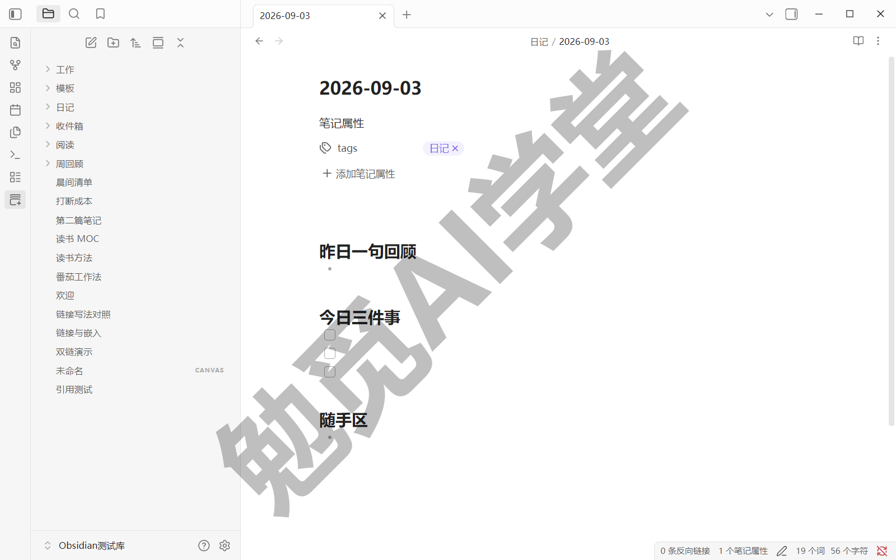

**第 2 步：晨间日记模板，全文如下**

在“模板”文件夹里新建“晨间日记”，切到源码视图，写入：

```
---
tags:
  - 日记
---

## 昨日一句回顾
- 

## 今日三件事
- [ ] 
- [ ] 
- [ ] 

## 随手区
- 
```

写完回到日记插件选项页，把“日记模板位置”填成这篇“晨间日记”。从明天起，每天的新日记都会自动带上这个结构。

这个模板每一段都有明确的用意，逐段说一遍。

**属性区** 预填了“日记”标签，依据还是《标签与属性》那条分工——轻量分类用标签。以后想圈出全部日记，一条标签搜索就够，不依赖文件夹结构；哪怕某天你调整了文件夹，这层标记也不会丢。

**昨日一句回顾** 只留一行，是刻意的。它要的是“接上昨天”，不是复盘报告：昨天推进了什么、卡在哪，一句话就足够唤起上下文。真有一件事一句话装不下，说明它值得单独开一篇笔记，写完链接过去即可。

**今日三件事** 只给三个勾选框，同样是刻意的。一天里真正推动局面的事很少超过三件；写上五件八件，注意力被平摊，清单就退化成愿望清单。三个框逼你做一次排序。任务列表的写法（短横线加空方括号），姊妹篇《Markdown 通用语法手册》的《扩展语法》篇讲过；在实时预览里，方括号渲染成一个个复选框，鼠标点一下即打勾，勾选状态直接写回笔记原文。这里直接拿来用。

**随手区** 是白天回到日记时的落点，收纳跟“今天”强相关的零碎：一个电话号码、一句要转告的话、临时改期的会议。它和闪念的分工看独立性：过了今天就没用的，进随手区；值得将来发展成一篇笔记的，走唯一笔记进收件箱。

**第 3 步：早上的动作**

到了工位，打开今天的日记（“默认打开文件”设成“日记”的话，这一步是自动的），模板已经套好。花一两分钟：昨日回顾填一句，三件事写上，开工。做完会看到：今天的日记已经在“日记”文件夹里，三个框待勾。

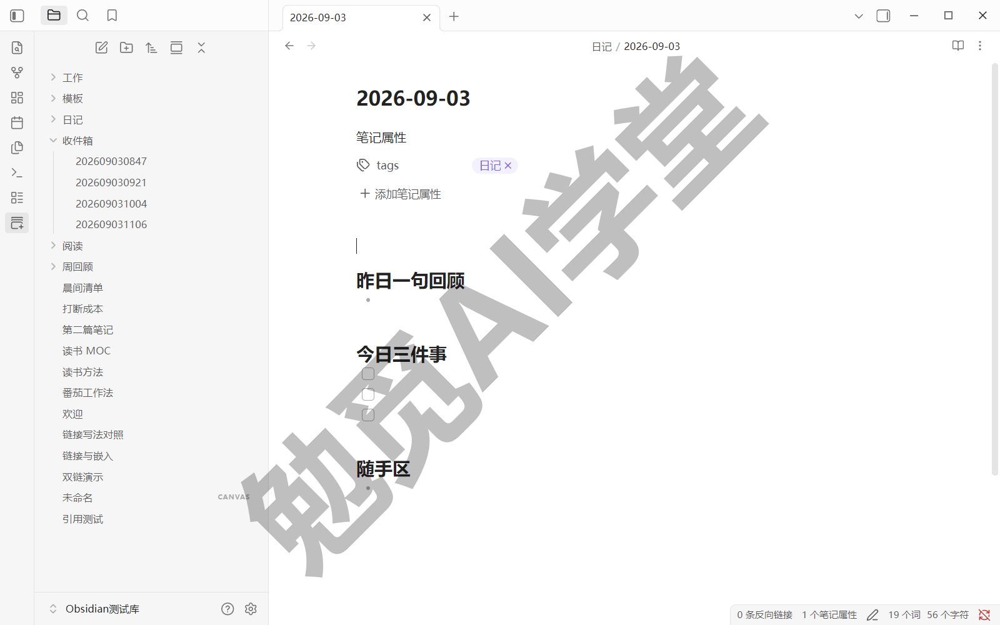

**第 4 步：白天的动作**

灵感、待查的资料、突然想到的风险点——按 6.3 的方法一键唯一笔记，写完就走，全部落进收件箱。当天的待办有进展，就回日记把对应的框勾掉。人在外面、手边只有手机的时候，同样有闪念入口可用，《移动端与网页剪藏》专篇会讲手机端的做法。

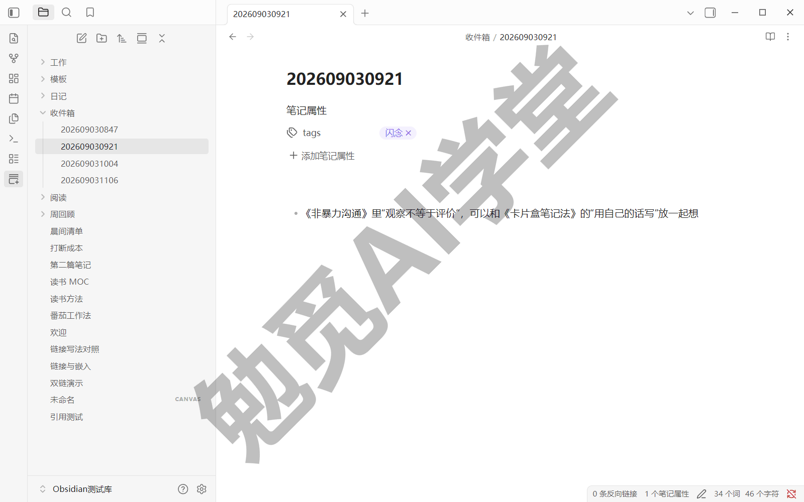

**第 5 步：每周回顾模板，全文如下**

在“模板”文件夹再建一篇“每周回顾”，源码视图下写入：

```
---
tags:
  - 周回顾
---

## 本周日记串读
![[]]
![[]]
![[]]
![[]]
![[]]
![[]]
![[]]

## 收件箱清空
- 

## 未完成任务盘点
- 

## 下周三件事
- [ ] 
- [ ] 
- [ ] 
```

同样逐段讲用意。

**本周日记串读** 给了七个空嵌入位，做回顾时在每对方括号里填入本周七天日记的文件名（输入日期开头的几个字符，一般会弹出补全列表帮你选中；若没弹出，删掉这行重新输入 `![[` 也一样快）。《双链与图谱》讲过嵌入的性质，这里正好用上：嵌入是引用不是复制，七天的日记被聚到这一页连着读，源头改了这里跟着更新，内容也不会存成两份。七个名字要手填，这是核心模板的能力边界，6.5 马上讲它。

**收件箱清空** 是回顾的主体动作：把这一周攒的闪念逐条过一遍——值得留的，给它改一个正式标题、移出收件箱、补上和相关笔记的链接；过期的、看不懂自己当时想什么的，删掉也不可惜。目标是清零。真清不动的那几条，往往是还没想清楚，原样留到下周也行，但要少。

**未完成任务盘点**：串读时顺带查看每篇日记的“今日三件事”，没勾掉的框逐个处置——还要做的，挪进“下周三件事”；不做了的，删掉并补一句原因。别让任务无声无息地消失：消失多了，你会慢慢不信任这份清单，流程就散了。

**下周三件事** 是给下周一早上的自己留的：周一打开新日记，不用从零想这周干什么，答案上周日就写好了。

**第 6 步：周末的动作**

在“周回顾”文件夹新建一篇笔记，命名建议带上日期，比如“2026-08-24 周回顾”，插入“每周回顾”模板，自上而下走完四段。做完会看到：收件箱清空，下周三件事就位，一周闭环。

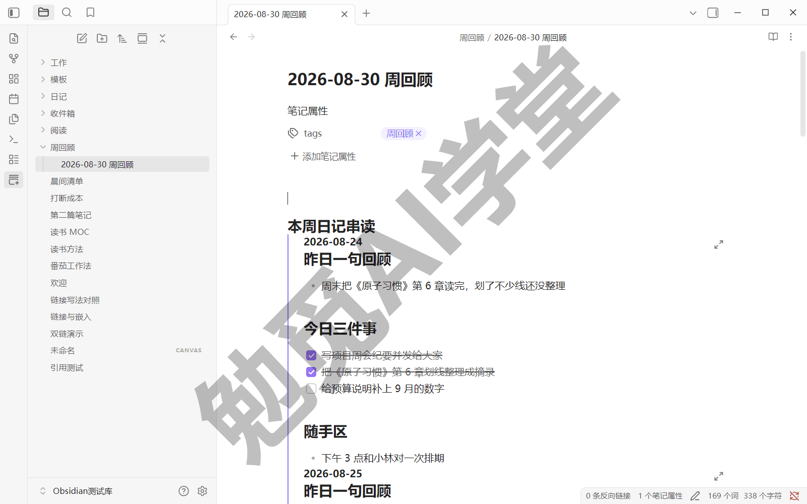

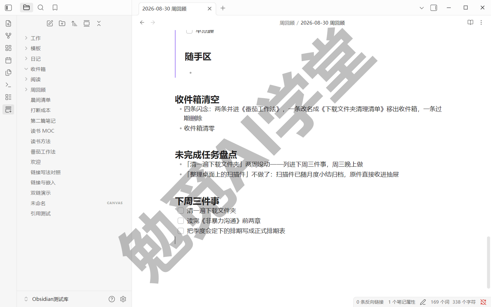

到这里，一条龙全部通了：早上开台面、白天快速记、周末清收件箱。它不要求你改变工作内容，只是给原本散落的动作各安排了一个固定落点。

### 6.5 核心模板的边界与 Templater

跑通上面的流程，你已经把核心模板用到了九成。剩下一成，是它确实做不到的部分——把边界说清楚，你才不会在错误的方向上白费功夫。

**核心模板只会替换，不会运算**。变量一共三个：`{{title}}` `{{date}}` `{{time}}`，插入时各自换成标题、今天的日期、现在的时间，除此之外没有别的能力。具体到这条一条龙，你其实已经撞到过它的边界：

- 周回顾的七个嵌入位需要手填，因为模板算不出“本周一到周日”分别是几号——`{{date}}` 只认“今天”；
- 晨间日记的“昨日一句回顾”没法自动链到昨天的日记，原因相同：核心变量写不出“今天减一天”；
- 想让工作日和周末的日记长得不一样也做不到——模板不会做条件判断，插入什么完全取决于你写了什么。

**先说结论：够用是常态**。手填七个文件名，一周只发生一次，有补全帮忙，不到一分钟；“昨天写了什么”离你只有一次跳转（6.1 提过的相邻日记跳转命令）。为省这一分钟提前引入一套新语法，不划算。边界的另一面正是核心模板的省心：零安装、零学习成本、官方维护，跟着版本走不会坏。课程把话说定：本课的全部工作流，只用核心插件就能跑通。

**Templater 是什么，先有个概念**。它是一个社区插件，做的是“动态模板”：能做日期运算、能按条件生成内容，能力差异示意如下（仅示意，语法本课不教）：

```
核心模板：{{date}} 永远替换成“今天”，如 2026-08-24
Templater：能算出“昨天”“下周一”这类日期，能按条件生成不同内容
```

“动态”是有代价的。Templater 有自己的一套模板写法，变量和命令都比核心模板多一个量级，写错了还要自己排查；对刚把流程跑起来的人来说，这份学习成本花得不是时候。课程把它放到后面，也是同一个考虑：它适合出现在流程已经稳定、需求已经明确之后。

**什么时候才需要它**。一个朴素的判断标准：当你发现自己每周都在重复同一段有规律的手工填充，而且这份重复已经成了明显的负担时，再去了解它。比如哪天你发现，自己真的很想让回顾页自动列出七天日记、让每天的日记自动带上指向昨天的链接——这类愿望攒到两三个，就是该去了解 Templater 的信号。到那一步，你现有的积累一点不浪费——文件夹结构、日记设置、这两个模板文件都原样保留，要换的只是模板文件里的写法。Templater 的安装和最小演示放在《社区插件系统》，深度用法超出入门课的范围，本课不展开。在那之前，放心把这条只用核心插件的一条龙跑熟；等流程跑顺了，你自然会知道自己到底缺不缺它。

一句话总结：核心模板的边界是“只替换、不运算”；撞到边界不必绕路，先用手工补上那一分钟，等重复真的成了负担再升级。

### 6.6 三个练习任务

轮到你自己动手。三个任务对应一条龙的三段，做完，这一篇才算真正落进你的库。

**任务一：装好日记流**

按 6.1 和 6.4 的做法配好日记插件与晨间模板，连写两天日记。

完成标准：两天的日记都自动套用了晨间模板生成，三件事每天至少勾掉一项。

**任务二：记三条闪念**

建好唯一笔记入口（含收件箱位置与快捷键），一天里记下三条闪念。

完成标准：三条闪念都在十秒左右记完，并且全部落在收件箱里。

**任务三：做一次周回顾**

用每周回顾模板完整做一次回顾，四段都走到。

完成标准：收件箱清零，未完成任务全部有去处——要么进了下周三件事，要么明确放弃。

### 6.7 本篇小结与自检

这一篇用日记、模板、唯一笔记三个核心插件搭起了“晨间日记—闪念速记—每周回顾”一条龙，模板全部给出可照抄。最需要记住的是：**工作流的关键不是工具而是闭环——早上开台面、白天快速记、周末清收件箱，三步缺一不可。**

可以对照下面的清单检查学习结果：

- [ ] 日记插件已配好模板并连写了两天
- [ ] 模板变量 `{{date}}` 等在你的库里实际生效
- [ ] 闪念速记入口十秒内可用，收件箱约定已建立
- [ ] 完整做过一次每周回顾，收件箱清零
- [ ] 知道 Templater 是什么、什么时候才需要它

完成这些内容后，Obsidian 已经进入你的日常。下一篇《Canvas 画布》换一种思考界面：把卡片和笔记摆上无限白板。

### 6.8 新手常见问题

**Q1：日记会不会越积越乱？**

不会自己变乱。日记只在你打开那天才创建，不会攒出空文件；文件名就是日期，按名称排序即按时间排序。找内容用《库、文件与搜索》定下的规则：记得哪天写的，用快速切换直达；只记得内容不记得日期，就全局搜索。真到几百篇想归拢时，再把日期格式改成带斜杠的形式，让新日记自动按年月分文件夹（见 6.1），不必为还没发生的规模提前焦虑。

**Q2：改了模板，已生成的旧日记会跟着变吗？**

不会。模板在插入的那一刻把内容复制进笔记，之后两者就没有关联了——改模板只影响以后新生成的笔记，旧笔记原样不动。这一点和嵌入正好相反：嵌入是引用、源头改了处处更新，模板是复制、落地即定格。想统一调整旧日记只能逐篇动手；《Obsidian×Codex：让 AI 管理你的笔记库》那一篇会给一条批量处理的路，属于可选内容。

**Q3：闪念笔记要不要马上整理？**

不要。闪念入口的价值就在不打断当下，记完立刻回去做手头的事；归类、扩写、删除都是每周回顾的工作。唯一的例外：某条闪念当场就确定要发展成正式笔记，那就直接改名、移出收件箱，不必硬等周末——收件箱只是默认去处，遇到明确的例外直接处理就好。

**Q4：模板里的 {{date}} 为什么没生效？**

按下面的顺序排查，基本都能对上号：

- 看位置：模板文件本身永远显示 `{{date}}` 原文——变量只在“插入模板”或日记套用模板的那一刻替换，在模板文件里看到原文不是故障；
- 看写法：双大括号要成对，带格式串时冒号必须用半角，格式代码区分大小写（HH 是 24 小时制、hh 是 12 小时制）；
- 看插入方式：把模板内容手工复制粘贴进笔记不会触发替换，要走“模板：插入模板”命令，或让日记插件自动套用；
- 看属性区：变量写在属性区又没加引号的，可能被属性面板改了样——按 6.2 的办法加引号，或改用源码视图编辑模板。
