## Canvas 画布

这一篇讲 Obsidian 的另一种记录界面：画布。前面几篇写的笔记都是从上往下一行行排的，画布则给你一块无限大的平面，把卡片、笔记、图片、网页摆上去，再连线、分组、上色，让“想清楚一件事”变成看得见的动作。

全篇分三步走：先认识画布，把四类内容摆上去；再学会连线与分组这两个核心动作；最后用三个真实案例——文章结构梳理、项目作战图、读书地图——把画布用到实际的事情上，并解决“怎么分享给别人”的问题。

### 7.1 Canvas 是什么

先说一个常见的时刻：你要写一篇有点分量的东西——一份年度总结、一篇长文、一个方案——打开笔记敲了两行就停住了。卡住你的往往是结构：素材散在好几篇笔记里，先讲哪个、后讲哪个、哪些该合并，脑子里转不过来。在一份从上往下的线性文档里想这些事并不顺手，因为“调整顺序”在文档里是剪切粘贴，试错的成本不低。

画布就是为这种时刻准备的。它是 Obsidian 内置的一个核心插件，给你一块可以无限延展的二维平面：内容以卡片的形式摆在上面，位置随便放，想法之间用线连起来，相关的圈成一组。一个名称上的说明先交代清楚：这个功能的英文名是 Canvas，本课程沿用大纲的叫法称它“画布”；官方中文帮助和界面菜单都把它叫作“白板”（本篇涉及的键盘快捷键按官方帮助书写，具体键位可能略有出入，需实机验证）。名字不重要，认准“无限平面上摆卡片”这个形态即可。

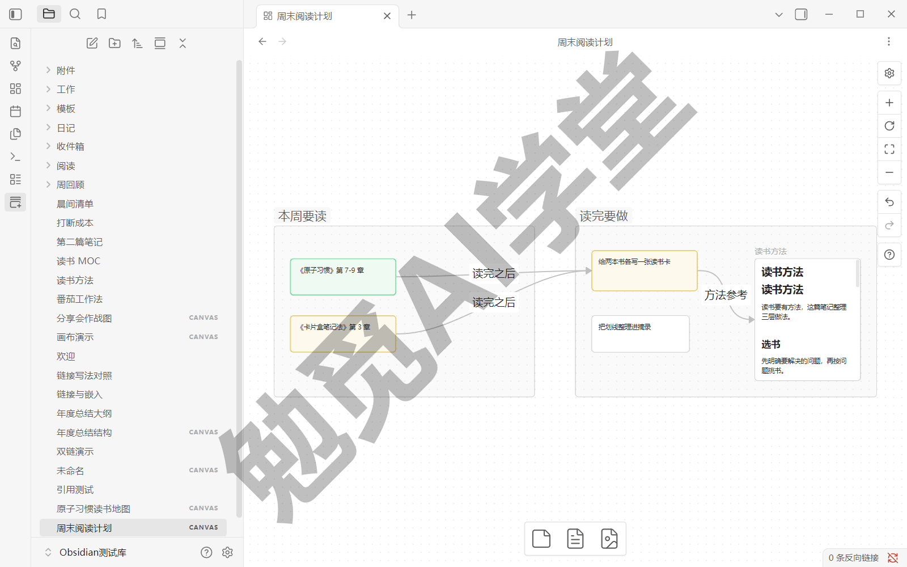

它和你已经会的笔记是什么关系？一句话：**画布不替代笔记，它是笔记的桌面。** 笔记负责把内容一篇篇写下来，画布负责把这些内容摊开来看，就像把几本书、几张便签摊在书桌上对照着看——看完收起来，书还是书。后面你会看到，画布上的笔记卡片就是笔记本身，两边随时互通。

什么时候该打开画布？这一篇会用三个案例回答，这里先给个判断标准。写一篇文章之前结构理不顺，把每个要点做成卡片摆一摆，顺序和层次会比在文档里清楚得多；一个项目里的任务谁先谁后、互相牵制，摆成卡片连上线，全局一眼可见；读完一本书想消化，把核心概念摊开连成网，比从头到尾再翻一遍有效。

这三件事有个共同点：都发生在动笔之前、想清楚之中。结构没想清楚时先别闷头写，把材料摊开、把关系连上，让结构自己浮出来再动笔——这套先整理材料、再动笔的做法，后面几篇还会反复用到。

技术层面还有一件事值得知道：每块画布就是库里的一个文件，扩展名是 .canvas。《认识与装好》讲过“数据完全自有”——笔记是你硬盘上的文件，想备份就复制文件夹；画布同样如此，.canvas 文件就存在你的库文件夹里，备份、搬家、多设备同步都随库一起走（同步方案在《同步与备份全解》里讲）。它内部是一种开放的结构化文本格式（叫 JSON Canvas），用记事本打开能看到里面的文字内容，这里知道有这回事即可，不必深究。

动手之前做一个确认：画布是核心插件，用之前确认它处于开启状态。打开设置，进入核心插件页，找到“白板”，确认它的开关是打开的；如果是关闭状态，点开即可。它是否默认开启，以你实机看到的为准。

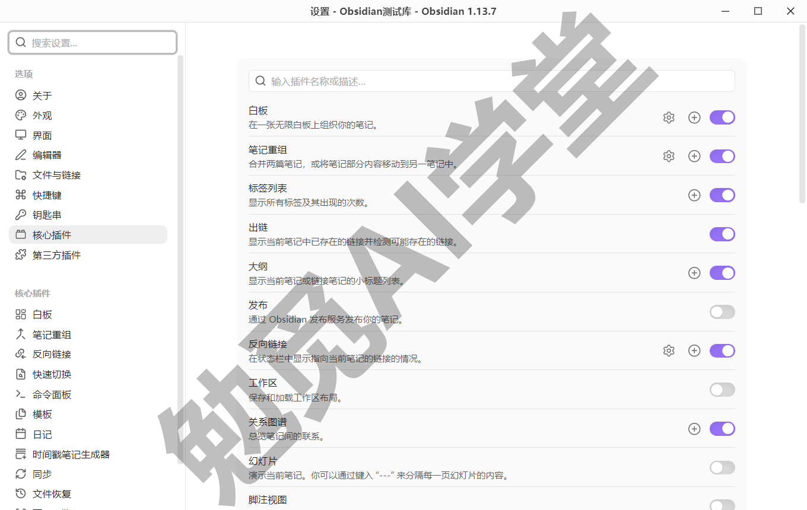

### 7.2 基础操作：把四类东西摆上画布

这一节把画布的地基打好：新建一块画布，把空白卡片、已有笔记、图片文件、网页四类内容摆上去，再学会在这块无限平面上移动和缩放。

**新建一块画布**

新建入口有三处，用哪个都一样：

- 在左侧文件列表里，右键点击你想存放画布的文件夹，选择**新建白板**——和新建笔记一个逻辑，画布文件就出现在这个文件夹里；
- 打开命令面板（按 `Ctrl+P` 呼出；《界面与设置全导览》介绍过的万能入口，任何功能都能搜到），输入“白板”，执行**白板：新建白板**，画布会建在当前文件所在的文件夹；
- 左侧功能区如果有**新建白板** 按钮，点一下也能直接建（功能区按钮可增减，有没有这个按钮以实机为准）。

建好后给它起个名字，你会看到编辑区变成一块浅色网格的空白平面，底部有一排添加内容的图标，右上角有一组缩放按钮——这就是你的第一块画布。它会以 .canvas 文件的身份出现在文件列表里，和笔记排在一起。

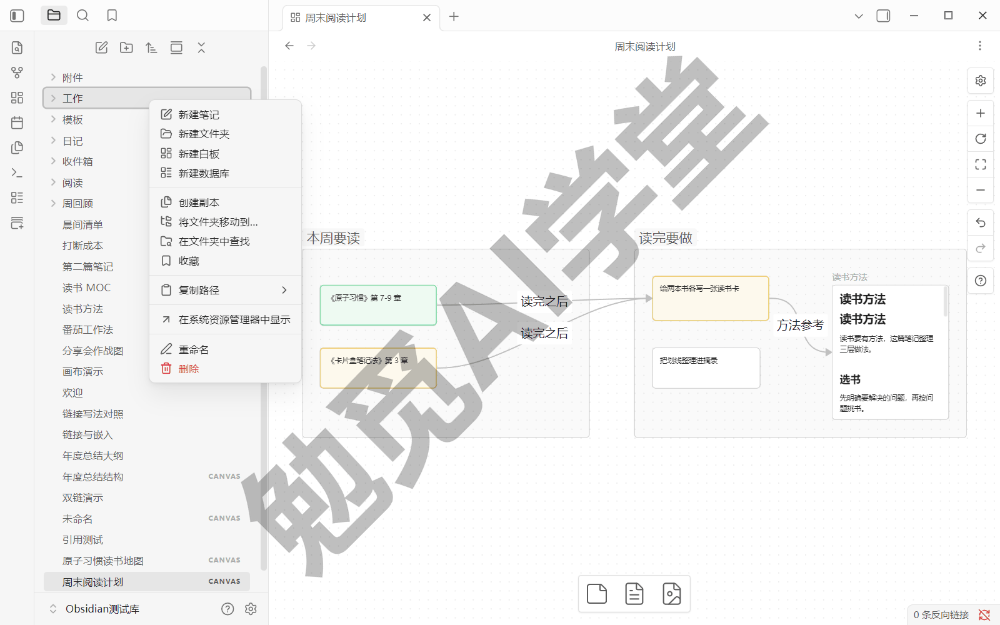

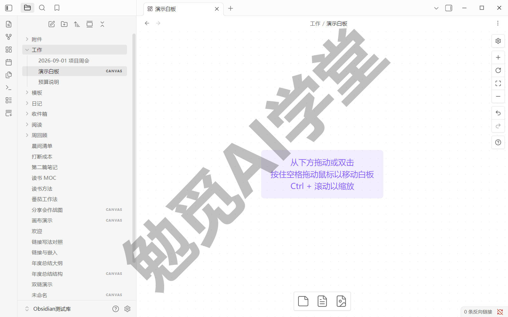

**空白卡片：双击即建**

四类内容里最常用的是空白卡片。在画布空白处**双击**，就会出现一张文本卡片，直接打字就能写；写完点击卡片外任意位置（或按 `Escape`）退出编辑。底部那排图标里的便签图标也能建卡：点住拖到哪里，卡片就出现在哪里。卡片里的文字支持和笔记一样的写法——加粗、列表、代码块这些语法在姊妹篇《Markdown 通用语法手册》里讲全，双链就是《双链与图谱》里那套双方括号写法，这里直接打字就够用。

空白卡片有一个和笔记不同的地方要知道：它的内容不生成 .md 文件，而是直接存在这块画布的 .canvas 文件里。好处是随手、零负担——闪过一个念头双击就写，不会在库里留下一堆碎片文件；代价是它不参与全库的链接网络，反向链接面板看不见它。如果一张卡片越写越有价值，想让它变成正式笔记，右键这张卡片选择**转换为笔记**，起个名字保存，它就成了库里的一篇真笔记，卡片位置不变。判断标准很简单：临时的想法用文本卡随手写，值得长期保留、需要被其他笔记链接的内容就转成笔记。

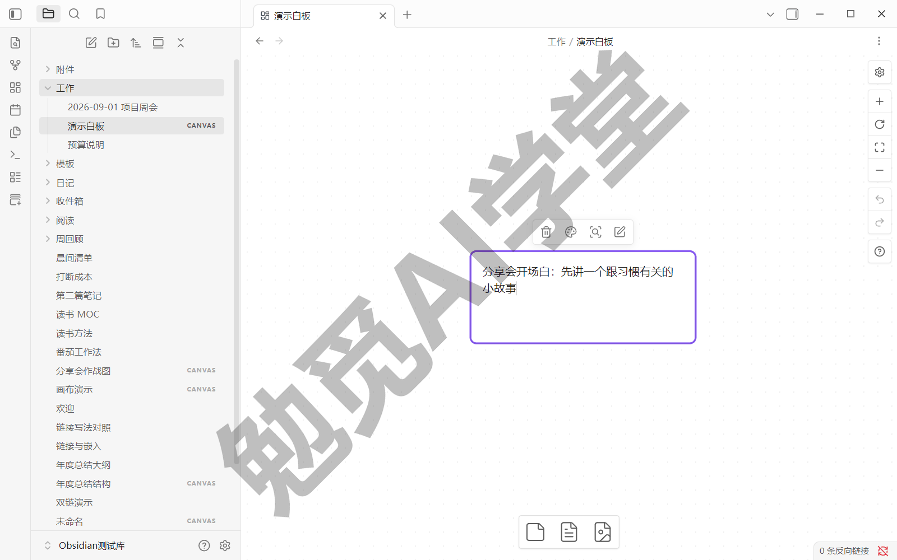

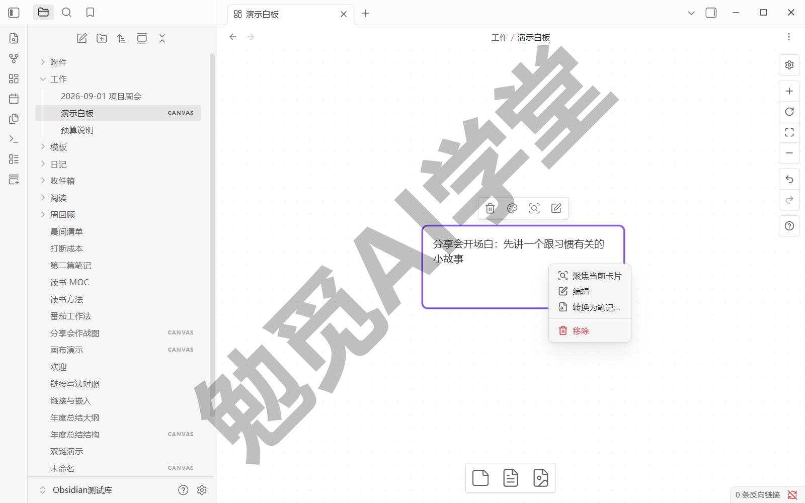

**笔记卡片：库里的笔记直接拖进来**

把已有笔记摆上画布，最直接的方法是从左侧文件列表把它拖进来，松手就变成一张笔记卡片。也可以右键画布空白处选择**添加笔记**（同一菜单里还有添加文本、添加媒体文件、添加网页、创建分组），或点底部工具条的文档图标，从列表里挑一篇（底部图标形态以实机为准）。

关键认知一句话：**画布上的笔记卡就是那篇笔记本身，不是复印件。** 双击卡片直接编辑，改的就是原笔记；反过来在别处改了这篇笔记，画布上的卡片同步变化。改哪边都同步，这让画布可以放心当作“工作台”用——你在台面上对材料做的修改，都是真实生效的。相应地，把一张笔记卡从画布上移除，删掉的只是“摆放”这个动作，笔记文件本身还在库里，不用担心误删。

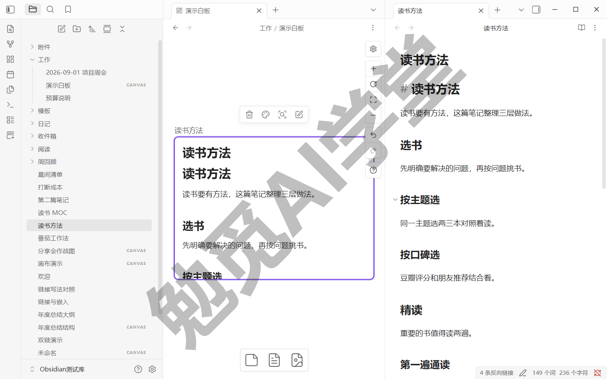

**图片与文件：素材也能摆上画布**

图片的做法一样：从文件列表把库里的图片拖上画布，或者右键选择**添加媒体文件**、点底部的图片图标挑选。不止图片——PDF、音频，甚至 Obsidian 不认识的文件类型，都可以拖上来占一个位置。从资源管理器等其他程序直接把文件拖进画布也可以。还有一个批量技巧：从文件列表把整个文件夹拖上画布，文件夹里的所有文件会一起变成卡片摆出来；这个动作对大文件夹要慎用，几十上百张卡片一次涌上来，收拾起来反而费劲。

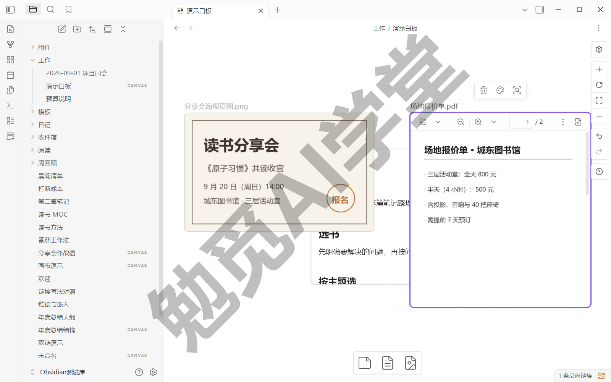

**网页卡片：把网页嵌进画布**

第四类是网页。右键画布空白处选择**添加网页**，粘贴网址后保存；或者更顺手的做法——从浏览器地址栏选中网址，直接拖进画布。保存后网页会以嵌入卡片的形式出现，多数网页能在卡内直接显示页面内容、滚动浏览；能不能在卡内点击交互、登录状态如何处理，以实际表现为准。要回到浏览器看这个网页，按住 `Ctrl` 点击卡片标题，或右键卡片选择**在浏览器中打开**。

两个边界提前交代：

- 网页内容在线上，断网或网络不稳时网页卡加载不出来属正常，画布其余部分不受影响（以实际表现为准）；
- 部分网站不允许自己被第三方应用嵌入，这类网页卡可能显示空白或提示加载失败（具体呈现与失败形态需实机验证）。遇到这种情况不用排查设置，改用文本卡记下网址和一句说明即可，不影响你排结构。

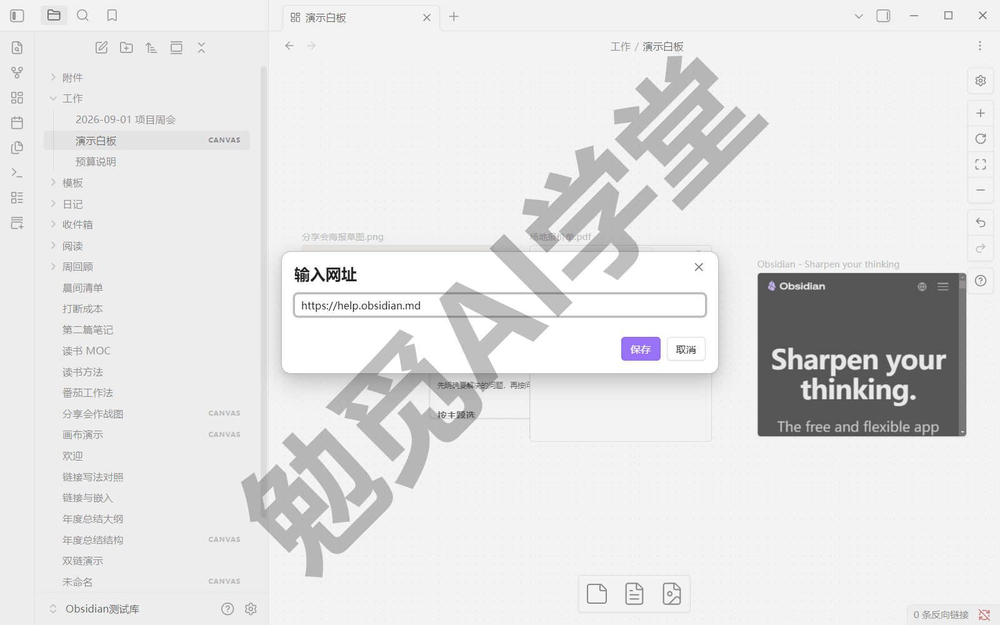

**摆放与导航：移动、缩放与吸附**

卡片摆上来了，最后把移动和缩放这些基本动作练熟。移动很直接：点选一张卡片拖到想去的位置；框选一片区域可以选中多张，按住 `Shift` 逐张加选或取消，`Ctrl+A` 全选，选中多张后一起拖动。拖动时卡片会自动吸附对齐到邻近卡片的边线，让版面保持整齐；需要精确摆放、不想被吸附时，可以按住 `Space` 临时禁用（英文帮助的说法；中文帮助写作 `Alt`，两处记载不一致，确切按键需实机验证）。

还有两个常用动作。按住 `Alt` 拖动所选卡片，可以原地复制出一份（英文帮助的说法；中文帮助写作 `Ctrl`，同样需实机验证）；拖动卡片边缘可以调整大小，按住 `Shift` 拖动则保持长宽比例不变。

画布比屏幕大得多，所以还要会移动视野。平移画布有三种方法：

- 按住 `Space` 后按住鼠标左键，拖动整块画布；
- 按住鼠标中键拖动，效果相同；
- 直接滚动滚轮上下移动，按住 `Shift` 滚动则左右移动。

缩放用按住 `Ctrl` 滚动滚轮，或右上角的放大、缩小按钮。两个快捷键值得记住：`Shift+1` 一键缩放到能看见画布上的全部内容（官方中文帮助叫“总览全局”），卡片摆多了看不过来时按它；`Shift+2` 聚焦到当前选中的卡片。缩放比例乱了，右上角还有重置缩放可以回到默认视距。画布空白处与卡片上各有一套右键菜单，本课程用到的项都会在用到时点名，完整菜单以实际界面为准。

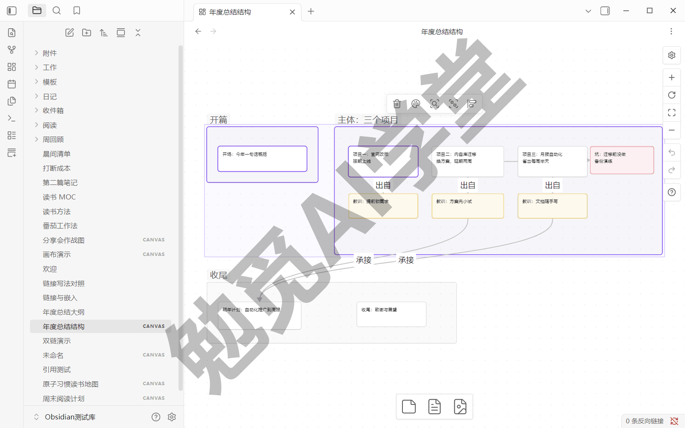

### 7.3 连线与分组

卡片摆上来只是把材料铺开，画布真正的价值在下一步：把关系画出来。这一节学三个动作——连线、分组、上色。

**拉一条连线**

把鼠标悬停在一张卡片的边缘，边上会浮出一个圆点；按住这个圆点，拖到另一张卡片的边缘松手，两张卡片之间就连上了一条带箭头的线。箭头有方向，从你起手的卡片指向目标卡片，所以“谁指向谁”在拉线时就定了；拉反了也不用重来，后面讲怎么调。

这个动作还有一个顺手的变体：从卡片边缘拖出线后，不落在任何卡片上、在空白处直接松手，画布会就地建一张新卡片接住这条线。这个小设计很适合发散：写下一个想法后顺着往外拉线，边拉边生卡，思路断不了。

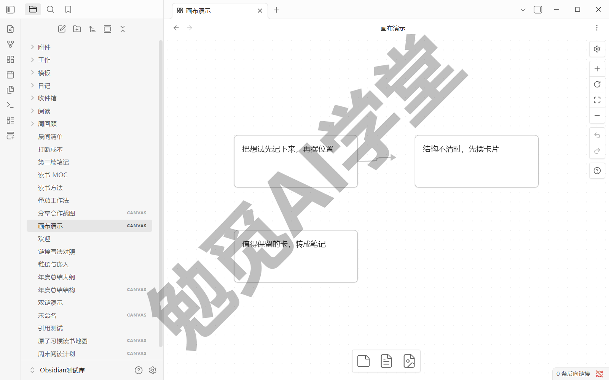

**调整、删除与跳转**

连线本身也是可以编辑的对象。把鼠标悬停在一条线上，线的两端会显出端点：拖动一个端点到别的卡片，就把这条线改接到了新对象；把端点拖到空白处松开，连接断开。删除一条线还有两个做法：右键这条线选择**移除**，或点选中后按 `Backspace`。如果两张相连的卡片离得很远，右键连接线，菜单里的“跟随连接”可以跳到另一端（这份右键菜单一共三项：编辑文字、跟随连接、移除）。

**给连线加文字：动词最好用**

双击一条连线，可以输入一段说明文字，按 `Escape` 或点击画布其他位置保存。建议你养成给线加动词的习惯：“导致”“支撑”“先于”“依赖”“反驳”。两张卡片之间光有一条线，三个月后回看只知道它们有关系，具体什么关系早忘了；线上写着动词，每条线为什么存在就一直有答案。这个习惯几乎不花时间，回报却很实在：隔一阵再看这张图，靠这些动词才能想起当时的思路。

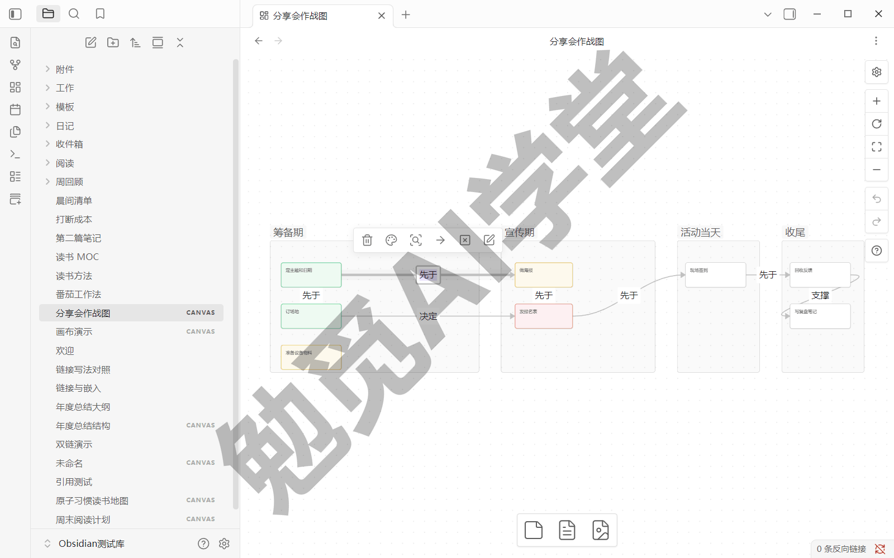

**框选成组**

卡片和线多起来之后，需要分区管理。框选中几张相关的卡片，右键任意一张选中的卡片，选择**创建分组**，它们就被圈进了一个带名字的方框；双击分组名称可以重命名，按 `Enter` 保存。分组是实体，不只是视觉装饰：拖动分组的边框，整组卡片一起移动，摆版面时特别省事。也可以先右键画布空白处创建一个空分组，再把卡片陆续拖进框里归组（拖入拖出的交互细节以实际界面为准）。给分组起名建议用阶段或主题词——“筹备期”“核心概念”——让人扫一眼就知道每个区域装的是什么。

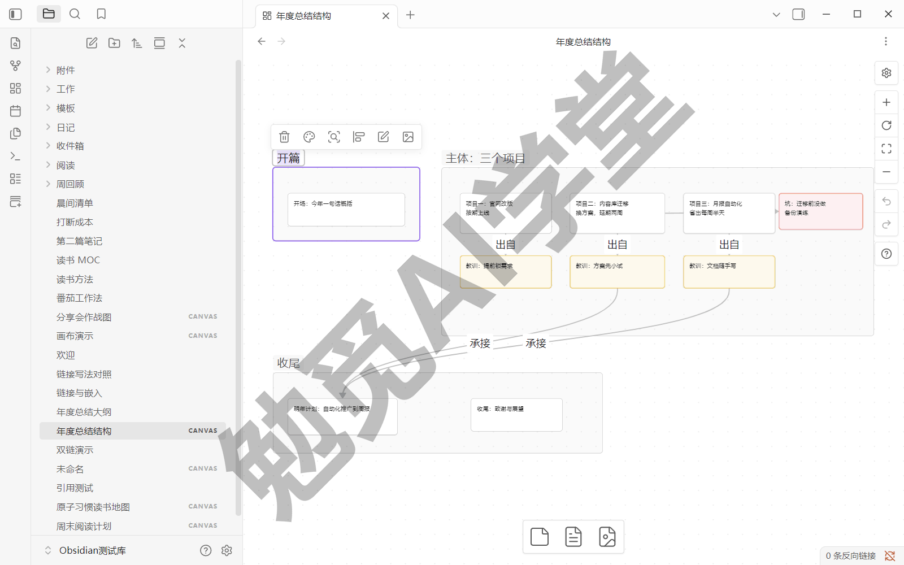

**颜色标注**

最后一个动作是上色。选中一张或多张卡片（连线也可以），在浮出的工具栏里点**设置颜色**，从色板里挑一种，卡片边框和底色就变了（可选颜色的数量与样式以实际界面为准）。颜色的正确用法是当“第二套坐标”：分组管的是位置归属，颜色管的是横跨分组的状态或类别——比如绿色代表已完成、黄色代表进行中、红色代表卡住了，三个分组里各有什么进度，一眼扫过去就清楚。一般的经验是一块画布上不超过三四种颜色、每种颜色只代表一个含义，种类一多，含义就记不住了。

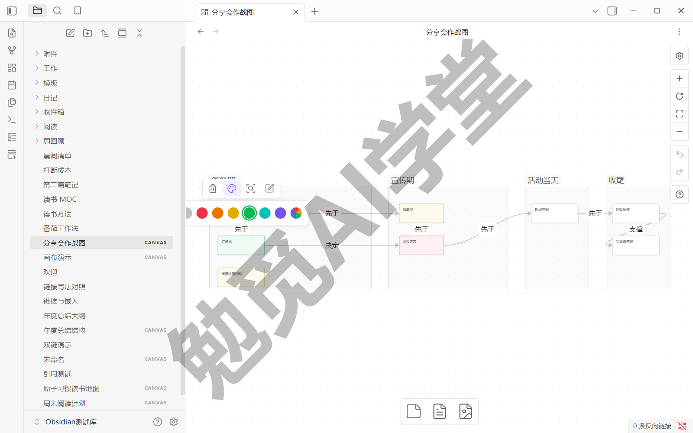

到这里，画布的基本功就齐了：摆卡片、拉连线、框分组、上颜色。单看每个动作都简单，价值在组合——下一节用三个真实案例，把这些动作串成完整的用法。

### 7.4 三个真实用途

基本动作讲完了，这一节看它能解决哪些实际问题。三个案例由浅入深，第一个特意做成同题对比——同一件事先用老办法做一遍，再用画布做一遍，差距在哪让你亲眼看见。三个案例都建议跟着做，素材就用你自己手头的。

**案例一：文章结构梳理（同题对比）**

任务：给一篇“年度工作总结”定结构。素材大家都有——这一年做了七八件事，有大有小，有成有败，怎么组织成一篇有主线的总结，而不是流水账。

先用老办法：新建一篇笔记，从上往下列大纲。“项目一的成果”“项目二的波折”“学到的三件事”“明年的计划”……列到十来行时问题来了：你想把“学到的三件事”拆开，分别放到对应项目后面去讲，这在线性文档里就是三轮“剪切—找位置—粘贴—从头通读一遍确认没断”；通读时又觉得两个项目的顺序也该换，再来一轮。每动一次结构，都要重新确认全文的连贯性，动到第三次，多数人就不再动了——不是结构已经理好了，是改结构太麻烦，只好放弃。

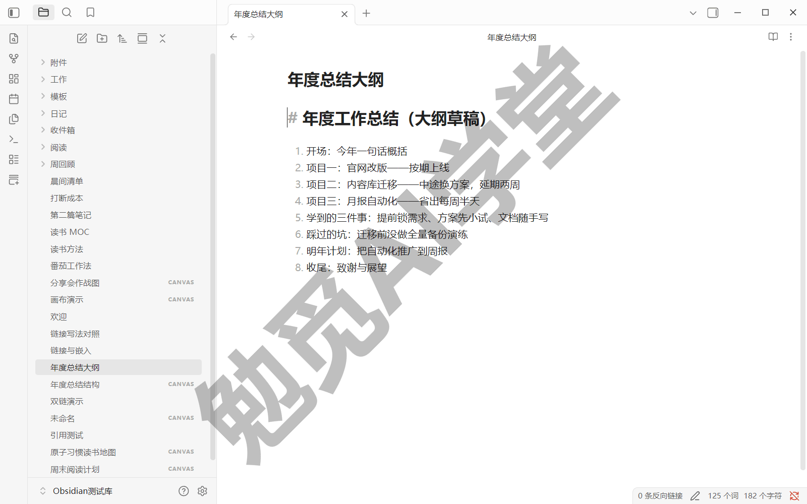

再用画布做同一件事：新建一块画布，把刚才大纲里的每个要点双击建成一张文本卡片，一卡一个要点，十来张卡随意铺开。然后开始整理：把三张“教训”卡分别拖到对应的项目卡旁边，拉线写上“出自”；把两个项目卡的位置对调；发现“明年的计划”其实每条都对应今年的某个教训，再拉三条线写“承接”。最后框选出“开篇”“主体”“收尾”三个分组，结构就定了。同样做三处结构调整，线性版每一处都是“剪切—粘贴—通读确认”三个动作，画布版每一处只有“拖动”一个动作，差距来自返工确认的次数——卡片没有先后顺序，挪动它不需要“确认上下文没断”，因为根本没有上下文要断。

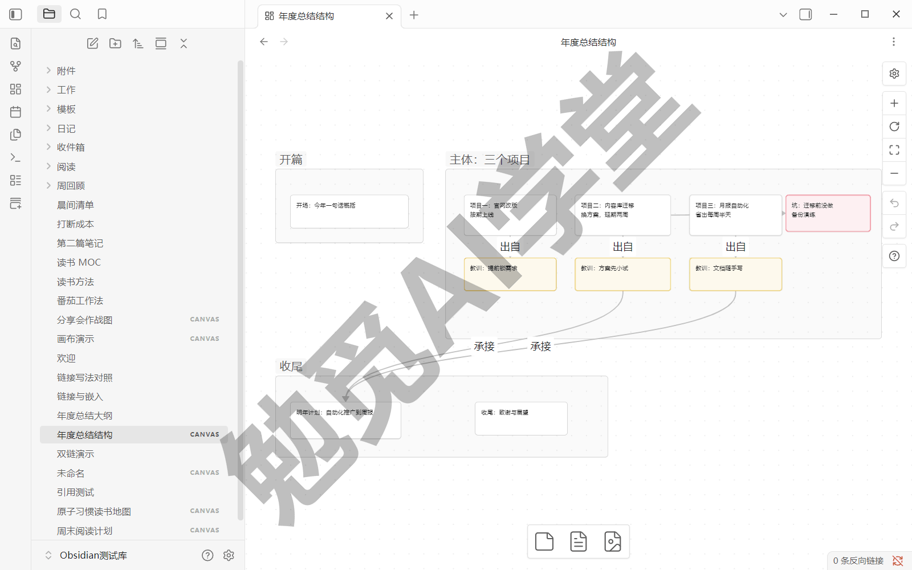

整理完之后回到笔记，照着画布上的分组和连线把大纲誊下来，这篇总结的骨架就有了。到这里，7.1 说的先整理材料、再动笔就完整走了一遍：结构在画布上想清楚，正文回到笔记里去写。

**案例二：项目作战图**

第二个案例升一级，从“理清一篇文章”到“看清一个项目”。任务：筹备一场 30 人左右的线下分享会。

第 1 步建卡。新建画布，把想到的任务全部双击建卡，一卡一件事：定主题和日期、订场地、做海报、发报名表、准备设备物料、安排现场签到、会后回收反馈、写复盘笔记。八张卡先随意铺着。

第 2 步画依赖。哪些事卡着哪些事，用带动词的连线画出来：“定主题和日期”先于“做海报”（主题没定海报没法做），“订场地”决定“发报名表”（时间地点没定，报名表发不出去），“回收反馈”支撑“写复盘笔记”。画完这一步，这张图就有了一个纯清单给不了的东西：**关键路径。** 顺着箭头看，“定主题—订场地—发报名表”这条链一步卡一步，是必须尽早启动的主线；做海报、备物料则可以并行穿插。

第 3 步分阶段、标状态。框选出“筹备期”“宣传期”“活动当天”“收尾”四个分组，把任务卡归位；再用颜色标进度——已完成的绿色、进行中的黄色、卡住的红色。之后每天打开这块画布，哪个阶段堆着几张红卡、主线推进到哪一步，十秒钟看完。任务多了看不过来时，按 `Shift+1` 总览全局，看完聚焦回手头那一张。

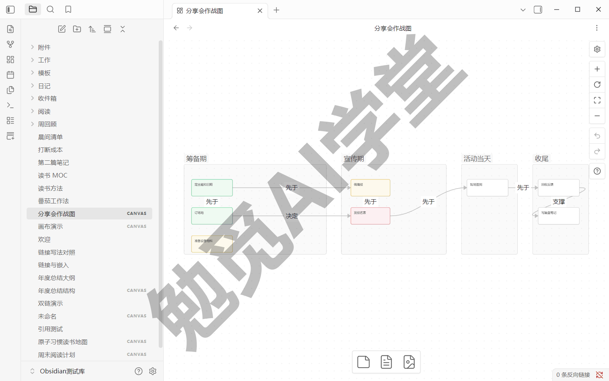

这张作战图是个可复用的骨架，任何小项目——搬家、办活动、做一期视频——都能套。到《工作项目管理库》那一篇，它会和会议纪要模板、任务清单组合成一座完整的项目管理库，画布在里面专门负责“看全局”这一层。

**案例三：读书地图**

第三个案例换个方向：不是安排要做的事，而是消化读过的东西。任务：把一本刚读完的书做成一张概念地图。这里拿《原子习惯》举例，你换成自己最近读的任何一本书，做法完全一样。

把书里的核心概念一一建成文本卡：习惯循环（提示—渴望—反应—奖赏）、身份认同、环境设计、习惯堆叠、两分钟规则、四条行为定律各一张。然后凭你自己的理解连线：“身份认同”统领“习惯循环”，“习惯堆叠”和“环境设计”都指向“让提示显而易见”，“两分钟规则”落实“让行动简便易行”。连不出来的地方，恰好暴露了你没读懂的部分——回去翻书，把那条线补上，这一下比重读一章还有效。最后框成“理念”和“方法”两组，一张读书地图就成了。卡片里还可以写上双链（比如链到你的读书笔记 `[[原子习惯]]`），点击直接跳回笔记原文，地图和笔记从此两边打通。

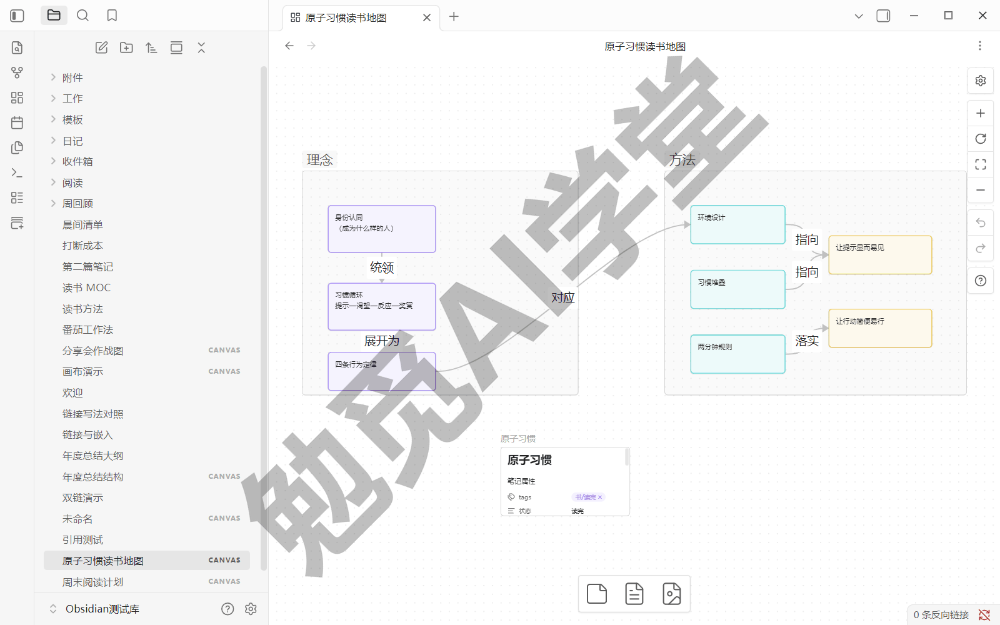

有读者会想起《双链与图谱》里的 MOC——那一篇讲过，MOC 是一篇给主题当总入口的“链接目录”笔记，用一条条链接把相关笔记列成清单。读书地图和它分工不同：MOC 用链接列目录，重在“找得到”；读书地图把概念本身摆进空间，用位置和连线表达理解，重在“想得通”。两个都值得有，不冲突。

### 7.5 导出与分享

地图摆好了，自然想给别人看——发给书友、贴进工作群、放进复盘报告。这一节把“分享”这件事讲清楚，包括它的边界。

**分享的边界：.canvas 只有 Obsidian 认**

画布的 .canvas 是 Obsidian 特有的文件格式，别的笔记软件、聊天工具都打不开它。把 .canvas 文件直接发给没装 Obsidian 的朋友，对方看到的只是一段结构化文本，不是你摆的那幅画面。就算对方也装了 Obsidian，单发一个 .canvas 文件同样不够：画布上的笔记卡、图片卡存的是对你库内文件的引用，不是内容副本，对方的库里没有那些笔记，这些卡片就显示不出来（纯文本卡除外，它的内容就在画布文件里）。所以对外分享可行的做法只有一种：**导出成图片再发。** 这一点和笔记不一样——.md 笔记是通用格式，拿到哪都能读；画布的通用性要打个折扣。公平地说，.canvas 内部是开放的文本格式（7.1 提过的 JSON Canvas），数据本身不会被锁死，只是目前能把它渲染成画面的软件很少，这个现状短期内改不了，接受它、用导出图片解决就好。

**导出为图片**

导出入口在画布窗格右上角的“更多选项”菜单里，菜单项叫“导出图片”——注意画布空白处的右键菜单里没有这一项，别在那里找。点开后弹出“导出图片”设置窗，四个设置逐个看：“导出范围”选导出整个白板还是当前可视部分；“缩放”控制成图大小，窗里会实时预告预计图像尺寸；“显示水印”开着时，导出图片的左下角会带一个 Obsidian 标志；“隐私模式”开启后会隐藏白板上的任何文本，适合只想展示结构、不想暴露内容的场合。点“保存”、选好存放位置，就得到一张完整的画布 PNG，微信、邮件、文档里随便用；发出去之前自己先打开看一眼，确认缩放合适、文字读得清。

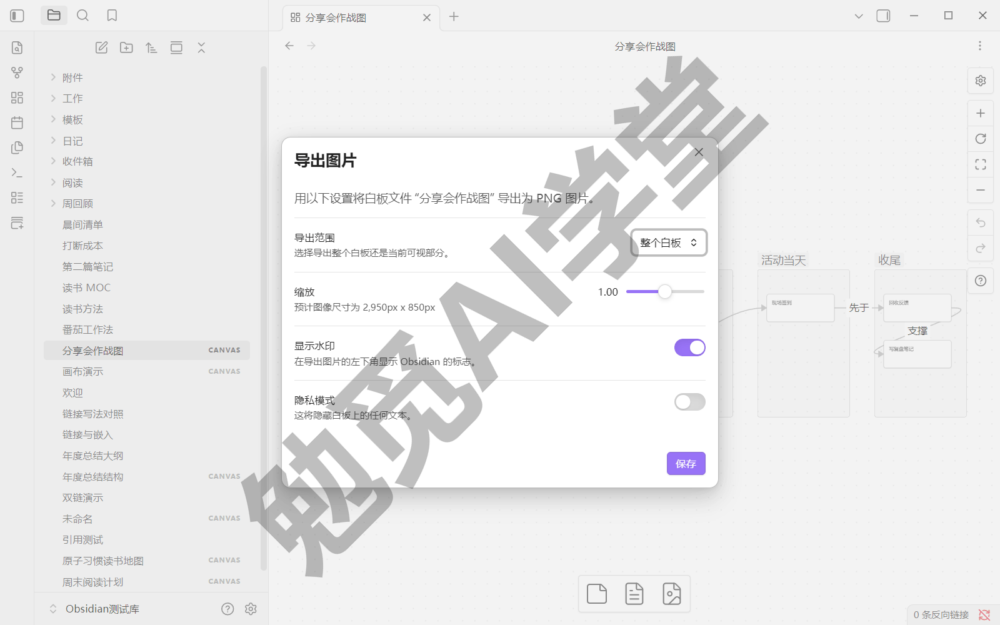

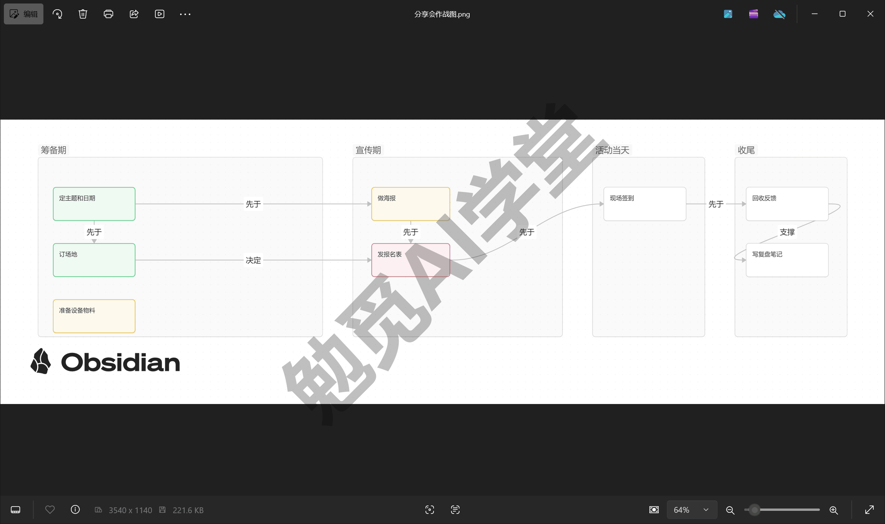

**库内的分享与复用：嵌入**

对外靠图片，对内则有更好的办法。《双链与图谱》讲过嵌入——用 `![[ ]]` 把一篇笔记的内容原地显示在另一篇里，源头一改处处更新。画布同样可以被嵌入：在任意笔记里写 `![[画布名.canvas]]`，这块画布就以可视形式出现在笔记正文里——画布名带图标显示，卡片布局原样缩进正文一块区域里。典型用法是把项目作战图嵌进项目主页笔记：打开主页，文字资料和全局图在同一屏，不用来回切换。

最后补一句兜底的话：.canvas 文件在你的库文件夹里，和笔记一起被备份、被同步——你在《认识与装好》里学到的“复制文件夹就是一次完整备份”，对画布照样成立；多设备同步的方案到《同步与备份全解》一并解决。画布数据和笔记受同一套备份保护，不用担心丢失。

### 7.6 三个练习任务

三个任务对应本篇三个案例，直接用你自己的真实素材做。

**任务一：排结构**

把你正在写或一直想写的一篇文章（总结、长文、方案都行），在画布上排出结构：每个要点一张文本卡，拖动排序，框选分组。

完成标准：至少 8 张卡片、两层分组（大结构一层、组内小主题一层），并且至少挪动过三张卡的位置——最后的结构和你最初列的顺序不完全一样，才说明这一步整理起了作用。

**任务二：作战图**

给手头一个真实的小项目画一张作战图：任务建卡，依赖关系连线并写上动词，按阶段分组，用颜色标出当前状态。

完成标准：图上有任务卡、至少三条带动词标签的依赖连线和阶段分组；能指着图说出“哪条链是关键路径、现在卡在哪张卡”。

**任务三：读书地图**

把你最近读完的一本书做成读书地图：核心概念建卡、按理解连线、分组，最后导出成一张图片（导出入口若与本篇描述不符，先用系统截图代替，不影响完成）。

完成标准：导出的图片发给一位没读过这本书的朋友，对方能大致看懂这本书在讲什么——图能独立传达信息，这张读书地图才算合格。

### 7.7 本篇小结与自检

这一篇打开了第二种思考界面：无限白板上摆卡片、连关系、分组推演，三个案例分别对应文章结构、项目作战图和读书地图。最需要记住的是：**画布用在动笔之前——结构没想清楚时先别闷头写，把卡片摊开、连上线，结构自己会浮出来。**

可以对照下面的清单检查学习结果：

- [ ] 会往画布上放卡片、笔记、图片、网页四类元素
- [ ] 会连线加标签、框选分组和整组移动
- [ ] 用画布完整梳理过一篇文章的结构
- [ ] 画过一张带依赖关系的项目作战图
- [ ] 知道 .canvas 是本地文件，对外分享用导出图片

完成这些内容后，画布与笔记两种思考方式你都有了。下一篇《Bases 数据库》把散在笔记里的属性自动汇成一张表——书单、任务这类清单会自己保持最新。

### 7.8 新手常见问题

**Q1：画布和专门的思维导图软件比怎么样？**

各有主场。思维导图是从中心向外发散的树状结构，软件自动帮你排版，快速罗列要点很顺手；画布没有强制结构，卡片随便摆、线随便连，还能把库里真实的笔记、图片、网页摆上来。要画一棵规整的知识树，专门的导图软件更省事；要把已有材料摊开推演关系、在动笔前把结构理清楚，画布是主场。两者不冲突，很多人都是并用的。

**Q2：卡片摆多了会卡吗？**

日常量级不用担心，几十上百张卡片一般都流畅（以实际表现为准）。真摆到成百上千张，与其担心性能，不如先反思用法：一块画布只该装一件事，主题变了就另开一块——画布文件不占什么空间，多建几块没有任何负担。

**Q3：在画布里改了笔记内容，原笔记会变吗？**

会，而且这是设计本意：笔记卡就是那篇笔记本身，双击编辑改的就是原文件，两边永远一致。需要区分的是文本卡片——它的内容存在画布文件里，不对应任何笔记；删掉文本卡，内容就没了，删掉笔记卡则只是从画布上移走，笔记还在库里。拿不准一张卡值不值得保住，就右键把它转换为笔记，从此它就和笔记一样受保护。

**Q4：画布能打印或导出 PDF 吗？**

官方帮助目前没有画布直接导出 PDF 或打印的记载。常规做法是先导出为图片（见 7.5），再把图片插进文档转 PDF 或打印。画布是无限平面，内容特别多时导出的图会很宽，打印前注意排版效果。
