## Bases 数据库

这一篇讲官方内置的 Bases：把散在一篇篇笔记里的属性，自动汇成一张会自己更新的表。

你会从零建出书单、影单、项目清单三个能直接用的实例库，学会筛选、排序、分组汇总和公式列，最后把做好的视图嵌进你每天都看的页面。全程只用官方内置能力，模板全文给出，可以照抄。

成本照例交代一句：Bases 是官方内置功能，本篇不需要安装第三方插件，也没有任何付费环节（以官方当前的收费策略为准）。

### 8.1 Bases 是什么与 .base 的本质

先看一个你大概正在经历的场景。读书笔记攒到几十篇之后，你想要一张书单：哪些在读、哪些读完、各自打了几分。常见做法是单开一篇“书单”笔记，手工维护一个列表，每读完一本改一行。用不了多久问题就来了：新写的读书笔记忘了往书单里加，书单越来越不全；状态改了这头忘了那头，同一本书在书单里还是“在读”、笔记里已经“读完”；想按评分排个序，只能手工挪行。清单越长，维护它越像一件正经工作。影单、项目清单、稍后你想做的任何清单，都会掉进同一个坑。

坑的根源其实很简单：同一份信息存了两处——笔记里一份、清单里一份，两处全靠人工保持一致。

Bases 解决的正是这件事。它是官方内置的核心插件（《界面与设置全导览》的核心插件总览地图里给它留过位置），能把一批笔记的属性自动汇成一张数据库式的表格：**表里每一行是一篇笔记，每一列是一个属性**。《标签与属性》定下的分工规则在这里兑现——当时说“要排序筛选的数据进属性”，你给读书笔记打的“状态”“评分”属性，现在每个都是表格里现成的一列。笔记里改了属性，表格立即跟着变；在表格里改单元格，改的就是那篇笔记的属性。信息只存一份，表格只是它的一种展示方式——从这里开始，清单不再需要手工维护。

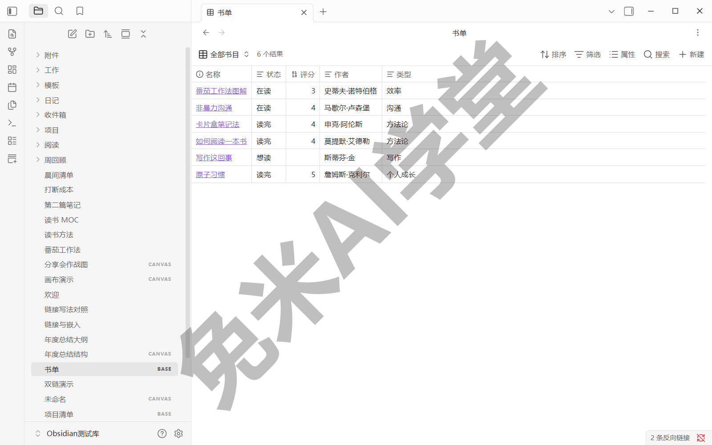

你可以把它类比成 Excel 表格或 Notion 的数据库，但有一个本质区别要先记住：Excel 的一行只是一行数据，Bases 的一行是你库里一篇真实存在的本地笔记，点击行里的文件名就能跳进那篇笔记。表格删了，笔记一篇都不会少；笔记删了，表格里那一行才会真正消失。数据始终存在你硬盘上的 md 文件里，这正是《认识与装好》讲的“数据完全自有”在数据库场景下的延续。

因为是官方内置的核心插件，它不需要安装任何第三方插件，也不需要动“受限模式”开关——那个开关管的是下一篇《社区插件系统》要讲的第三方插件的安全门槛，与官方内置能力无关。换句话说，这一篇学的所有东西，装好 Obsidian 就能用（核心插件的默认开关状态以实机为准，若未开启，到设置的核心插件页把它打开即可）。

**先把两个叫法说清。** 这个功能整体叫 Bases，你建出来的每一个具体文件叫一个 Base，文件后缀是 .base。官方中文帮助把 Bases 译作“数据库”，相关命令也叫“数据库：新建数据库”这类；1.13.7 的界面与这套译名一致——命令面板里就是“数据库：”打头的命令，文件列表里的 .base 文件带一个 BASE 徽标。课程章节沿用“Bases 数据库”这个叫法，正文里说“建一个 Base”，指的就是建一个这样的数据库文件。

.base 文件的本质值得单独看一眼：它是库里一个纯文本文件，内容是一段 YAML 配置，描述这个数据库筛哪些笔记、有哪些视图。YAML 这个词你在《标签与属性》看属性源码时见过——frontmatter 用的就是这种键值写法，这里是同一套语法的另一处应用。纯文本意味着 .base 随库备份、随库同步，拿记事本也能打开。更要紧的一点是：.base 里存的只是“怎么展示”的配置，数据本身仍在一篇篇笔记的属性里——删掉 .base 文件，笔记毫发无损。

Base 有两种存在形态，现场对照见下图：

- **独立 .base 文件**：像普通笔记一样出现在文件列表里（带 BASE 徽标），点开就是表格，适合当成一个常驻的清单页来用；
- **嵌在笔记里的代码块**：在某篇笔记正文里以 base 代码块的形式存在，表格直接显示在笔记里，工具栏处标着“内嵌视图”，适合让清单成为某篇笔记的一部分。

本篇主线用独立文件形态，代码块形态到 8.5 讲嵌入时再接上。

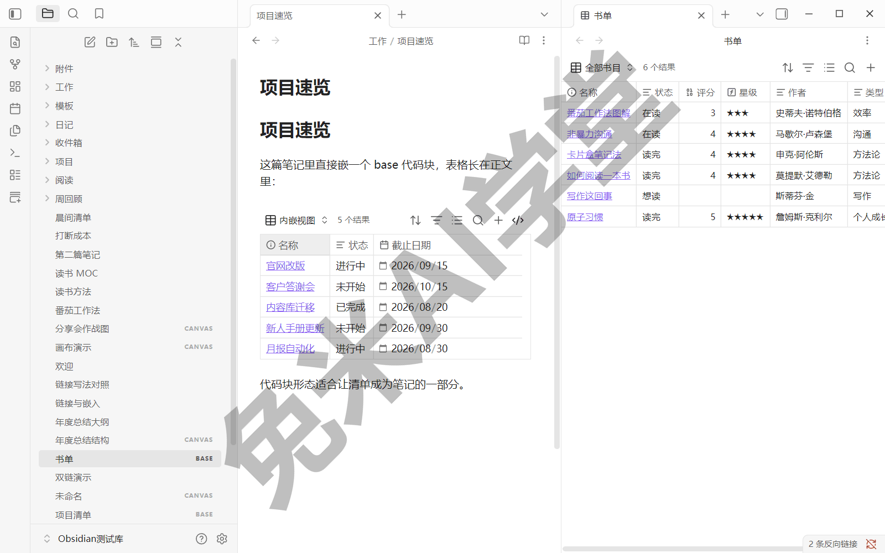

最后一句指路：资深用户常拿 Bases 和社区插件 Dataview 比较，两者都能把笔记汇成清单。Bases 胜在可视化编辑、零代码上手，新手的清单场景用它就够；什么时候需要 Dataview、两者怎么分工，《Dataview 专讲》专门回答，这里不展开。

### 8.2 创建第一个 Base：从属性到表格

动手之前先备料。这一篇全程用《标签与属性》练习里写过的读书笔记当素材——当时的练习让你写了带“状态”“评分”属性的读书笔记。如果这类笔记不足十篇，先花几分钟按下面的模板补几篇，书名随意、属性值填真实的，表格里才有东西可看：

```
---
tags:
  - 书/在读
状态: 在读
评分: 4
作者: 某位作者
类型: 科普
---
读书笔记正文随意写几句。
```

模板里的 `tags` 用了《标签与属性》建过的嵌套标签“书/在读”（读完的书用“书/读完”）；“状态”是文本属性，值在“在读”“读完”里选一个；“评分”是数字属性，1 到 5；“作者”“类型”是普通文本属性。属性类型对不对，直接决定后面排序和公式好不好用，拿不准就回《标签与属性》查属性面板的用法。

**建 Base 的入口有三处**，用哪个都行：

- **命令面板**：运行“数据库：新建数据库”，会在当前文件所在文件夹新建一个 .base 文件；另一条“数据库：新建数据库并插入”则是新建的同时以代码块形态嵌进当前笔记；
- **文件列表右键**：在左侧文件列表里右键某个文件夹，选“新建数据库”，Base 会建在这个文件夹下；
- **功能区**：最左侧功能区有“新建数据库”按钮，点一下同样新建（《界面与设置全导览》的功能区实拍里就有它）。

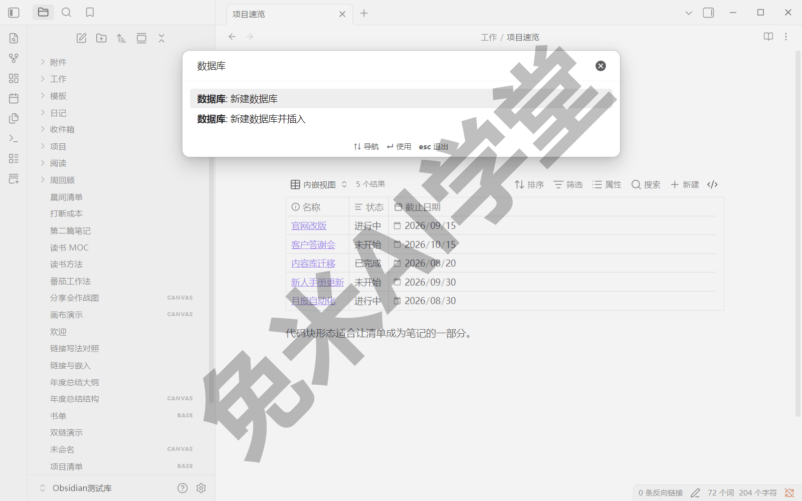

**第 1 步：新建并命名。** 用命令面板方式建一个，命名为“书单”。做完你会看到编辑区打开一张表，文件列表里多了“书单.base”。此刻表里列出的可能是全库文件——没有筛选条件的 Base 默认包含库里全部文件，这是官方设定，不是故障，下一步就把范围圈小。

**第 2 步：圈定数据来源。** 点表格上方工具栏的“筛选”按钮，添加一个条件：属性选“文件”，运算符选 has tag，值填标签“书”——1.13.7 的中文界面里运算符显示为英文（has tag、links to 这类），含义就是“带有标签”，照选即可。嵌套标签“书/在读”“书/读完”都算“书”的下级，一并圈进来。做完表里只剩书笔记，一行一本。如果你的读书笔记集中放在某个文件夹里，改用“文件在某文件夹内”一类的条件圈范围也可以，效果相同。

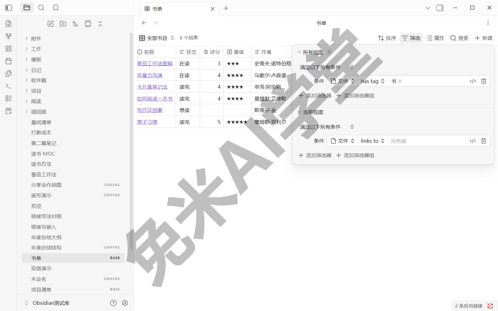

**第 3 步：选列与调列序。** 点工具栏的“属性”按钮（就在“筛选”右边），勾选要显示的属性：状态、评分、作者、类型。列可以拖动调整顺序，把常看的放前面。做完一张像样的书单已经成形：每行一本书，状态评分一目了然，第一个实例库到手。

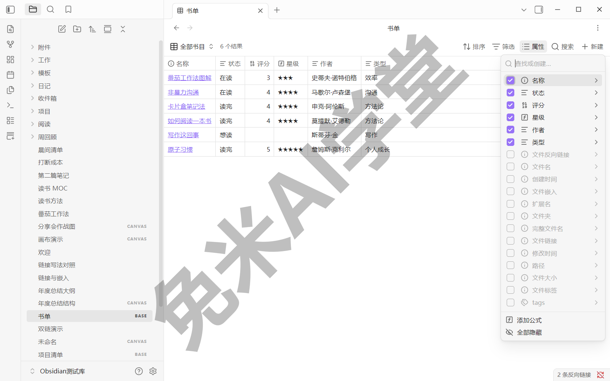

**第 4 步：当场验证双向同步。** 在表格里把某本书的“状态”从“在读”改成“读完”，再点这一行的文件名跳进笔记看属性面板——它已经是“读完”。反过来在笔记里改回“在读”，回到表格，它也跟着变了。这就是 8.1 说的“信息只存一份”：你编辑的从来都是笔记属性，表格只是把它们摆到了一起。

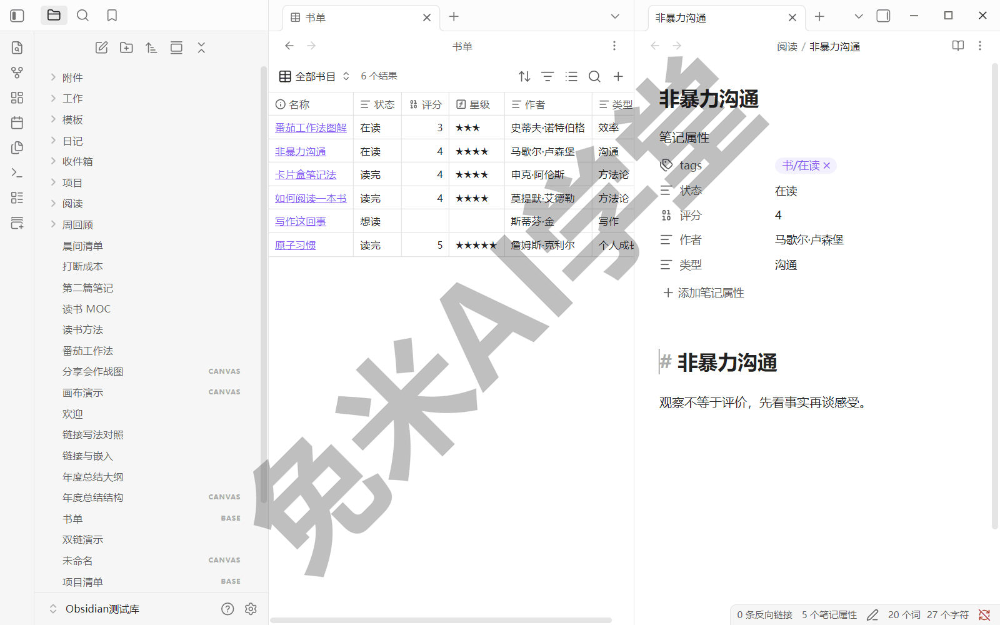

上面四步点出来的结果，等价于下面这份 .base 配置全文。两种方式殊途同归，照抄路线适合想跳过逐项点选的读者——.base 是纯文本文件，在资源管理器里用记事本打开“书单.base”、粘贴保存即可（在 Obsidian 应用内查看和编辑 .base 源码的入口，需实机验证）。现在看不懂每一行没关系，8.3 讲筛选语法、8.5 讲视图配置时回头看，会全部对上：

```
filters:
  and:
    - file.hasTag("书")
views:
  - type: table
    name: 全部书目
    order:
      - file.name
      - 状态
      - 评分
      - 作者
      - 类型
```

几个字段一句话认一遍：`filters` 是筛选条件，`file.hasTag("书")` 表示“文件带有标签 书”（含嵌套下级）；`views` 是视图列表，`type: table` 表示表格布局；`order` 是列的显示顺序，`file.name` 是文件名列，其余直接写属性名。这份配置的字段结构按官方帮助书写；中文属性名可以直接书写——本篇书单和《读书笔记系统》的书架库用的都是这套写法。

### 8.3 筛选、排序与分组汇总

表建起来了，这一节把“圈数据”的三件工具用熟：筛选决定哪些行进入表格，排序决定这些行按什么顺序排列，分组汇总则把同类的行归到一起、再对每组算个数。

**筛选的完整形态。** 8.2 只加了一个条件，筛选菜单里其实分两个区，分区名就叫“所有视图”和“当前视图”：前者的条件对这个 Base 的全部视图生效，后者的条件只对正在看的视图生效（视图是什么，8.5 马上展开，现在记住“一个 Base 可以装多个视图”即可）。8.2 加的标签条件属于前者——不管以后建多少视图，数据源都先被它圈定。

每个条件由三个部分组成：属性（拿谁比）、运算符（怎么比）、值（和什么比），下图那一行“文件 / has tag / 书”正是这三段。运算符列表随属性类型而变：文本属性能选等于、包含这类，日期属性能选早于、晚于这类，数字属性能选大小比较（前面说过，这一栏在中文界面里显示英文；各属性类型的完整清单以实机下拉为准）。值一栏除了手填，还能写函数和算式，8.4 会见到例子。

多个条件之间的关系用连接方式指定，就是菜单里那行“满足以下所有条件”下拉，共三档：

- **全部满足**（默认档，界面写作“满足以下所有条件”）：所有条件同时满足的行才进表，相当于“并且”，比如“带 书 标签，并且评分大于 3”；
- **任一满足**：满足任何一个条件就进表，相当于“或者”，比如“状态是 在读，或者状态是 读完”；
- **全都不满足**：满足任何一个条件的行都被排除，相当于“除去”，比如“除去还没写评分的书”（后两档的界面措辞以实机下拉为准）。

需要更复杂的逻辑时，条件可以打包成组：点“添加筛选器组”，组和组再按上面的连接方式组合，比如“（在读 或 读完）并且 评分大于 3”。筛选菜单里还有一个进阶入口：每个条件行右侧有一个代码图标，点了这一行就切换成语句输入，直接显示这条筛选的原始语法，写好还能换回点选式——《读书笔记系统》给年度书单写日期条件用的就是这个入口；点选界面拼不出来的复杂条件可以在这里手写，8.2 模板里 `filters` 段用的就是这套语法。

拿书单当场练一遍：加一个“状态 等于 在读”的条件，表里只剩在读的书；把值改成“读完”看效果；练完点条件行末尾的垃圾桶图标删掉这个条件，恢复完整书单。

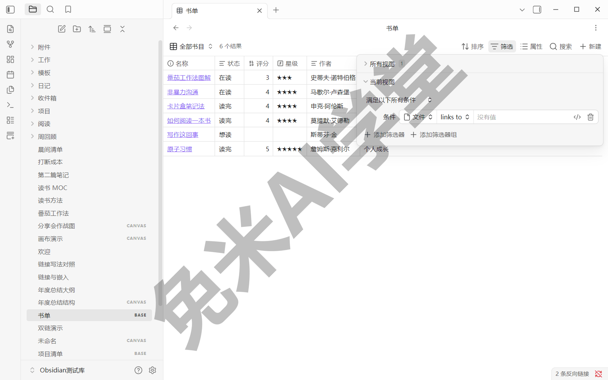

**排序。** 打开工具栏的“排序”菜单（在“筛选”左边），选一个属性就是一层排序；可以叠加多层，拖动手柄调整优先级——比如先按“状态”排，同状态内再按“评分”从高到低（多层叠加的菜单形态以实机为准）。方向的说法随类型而变：文本是字母正序或倒序，数字是从小到大或从大到小，日期是从旧到新或从新到旧。下一节的公式列也能参与排序。

**分组。** 分组入口也在排序菜单里：选择按某个属性分组，同值的行会归成视觉上独立的段落，段首显示这一组的属性值——下图项目清单的三段就是这么分出来的。注意官方明示目前只支持按一个属性分组，想按两个维度归类，用“分组一个、排序另一个”的组合近似实现。

分组正好由第二个实例库当主角。项目清单天然按状态分段：未开始的一段、进行中的一段、已完成的一段。先按模板补几篇项目笔记，集中放进一个叫“项目”的文件夹：

```
---
状态: 进行中
优先级: 2
截止日期: 2026-09-15
---
项目要点随意记几句。
```

“状态”值在“未开始”“进行中”“已完成”里选；“优先级”是数字属性；“截止日期”是日期属性——类型别选错，8.4 的公式要靠它。然后新建“项目清单.base”，筛选条件圈定“项目”文件夹，再到排序菜单里按“状态”分组。做完一张项目总览成形：三段各归各位，扫一眼就知道手头积压着几件事。

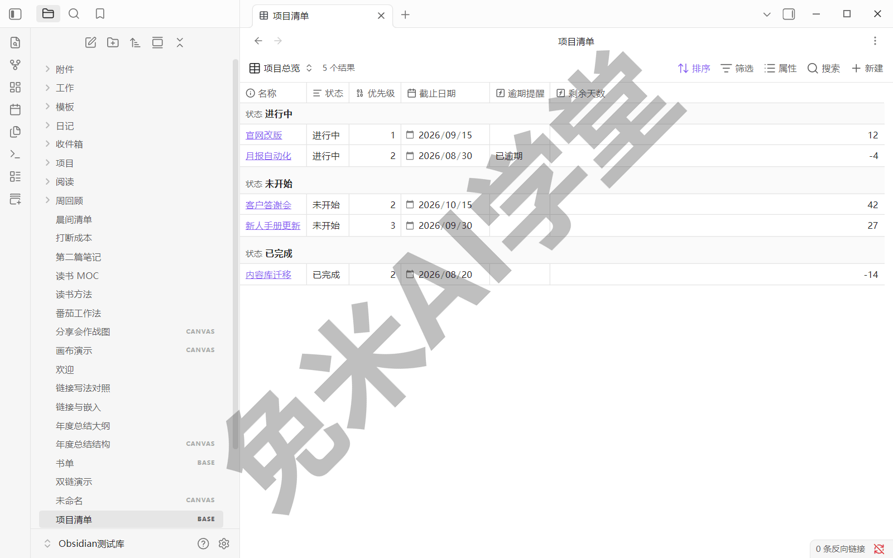

**汇总。** 分了组，常见的下一问是“每组有几条、平均多少”。汇总行负责算这类数：给某一列挂一个汇总函数，结果显示在表的底部——下图表底那一行就是（挂函数的操作入口以实机界面为准）。写作时官方帮助列出的内置汇总函数共 15 个（数量随版本可能增减，以当前版本为准），按输入类型分四类：

- 数字类七个：平均值、最小值、最大值、求和、极差、中位数、标准差——评分列求平均、金额列求和都靠它们；
- 日期类三个：最早、最晚、跨度——比如整组项目里最晚的截止日期离现在多远；
- 勾选类两个：已勾数、未勾数——统计复选框属性，勾了几个没勾几个；
- 通用类三个：空值数、非空数、去重数——任何列都能用，“还有几本书没填评分”一眼可见。

以上函数名为官方帮助的直译；1.13.7 表底显示的是英文函数名——非空计数显示 Filled、平均值显示 Average（下图可见），对照上表认得出即可。拿书单练一遍：给“评分”列挂平均值、给文件名列挂非空计数——读了几本、平均打几分，表底一行全有。

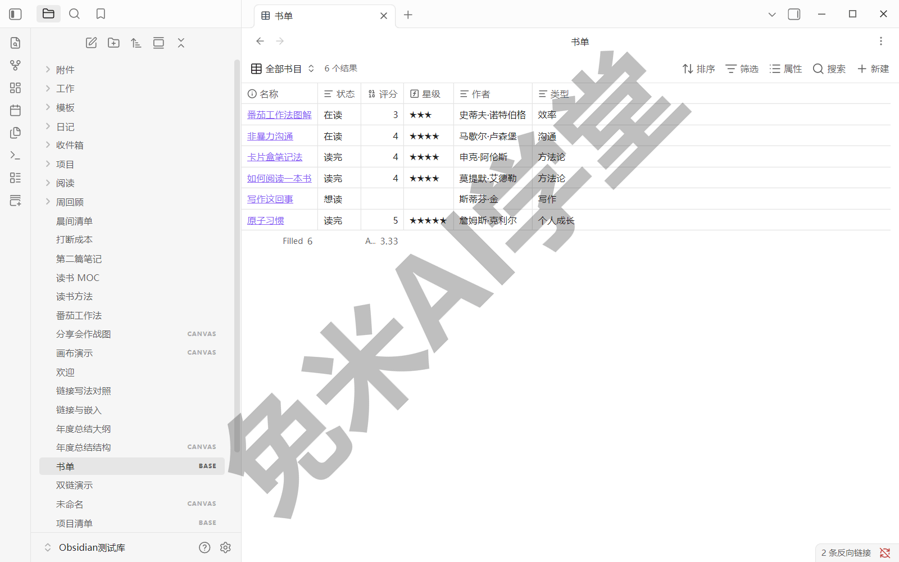

### 8.4 公式列照抄即用

到目前为止，表格的每一列都来自你手填的属性。但有些信息你并不想手填——“这个项目逾期了没有”，由截止日期和今天的日期就能算出来；手填一遍不仅多余，过两天它还会过期。公式列解决的就是这件事：**由已有属性现算出来的列**。数据一变，它跟着重新计算，不需要你手工维护。

**创建动线**：点工具栏的“属性”按钮，菜单底部选“添加公式”，给公式列起名，然后在公式输入框里写表达式。编辑器会边写边自动补全函数名和属性名，语法合法时出现一个绿色对勾——看到绿勾再关掉对话框。建好的公式列和普通列一样用：能显示、能排序、能进筛选条件。

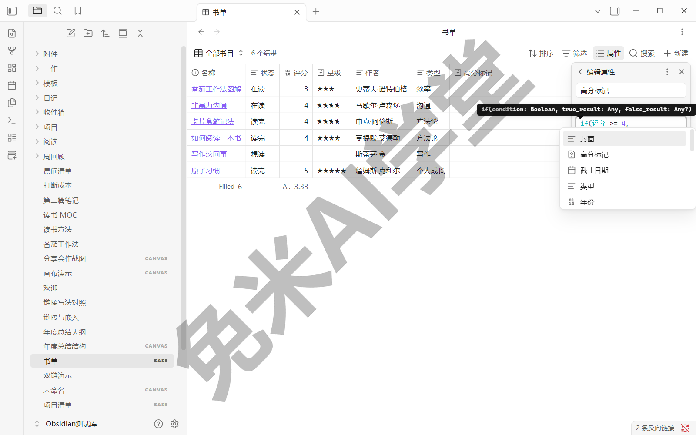

下面三条示例覆盖最常用的三类计算，全部可以照抄。

**第一条：逾期提醒。** 给项目清单加一列，逾期的项目自动亮出“已逾期”：

```
if(截止日期 < now() && 状态 != "完成", "已逾期", "")
```

读作：如果截止日期早于现在、并且状态不是“完成”，就显示“已逾期”，否则显示空。这条改写自官方帮助的示例（官方原文用英文属性名 `due_date` 和 `status`），`if`、`now` 都是官方函数；中文属性名在公式里直接写名字即可——这条公式就是下文项目清单里“逾期提醒”列的来源。属性名带特殊字符时，官方另有 `note["截止日期"]` 带引号的等价写法。

**第二条：评分变星标。** 给书单加一列“星级”，把数字评分显示成星星：

```
"★".repeat(评分)
```

`repeat` 是官方字符串函数，把一段文字重复指定次数——评分是 4，这一列就显示四颗星。书单表格里那列星星就是它算出来的。

**第三条：距截止还有几天。** 给项目清单加一列“剩余天数”：

```
((截止日期 - today()) / 86400000).round()
```

官方的说法是两个日期相减得到毫秒差，那么除以一天的毫秒数 86400000、再用 `round` 取整，就是天数；结果为负表示已经超期几天——项目清单“剩余天数”列里那个 -4，就是一条已超期四天的项目。想要更口语的显示，官方还有现成的 `relative` 函数：写 `截止日期.relative()`，输出“3 天后”“2 天前”这类相对说法（中文环境的实际输出格式，需实机验证）。

公式列有两条要紧规则，第一次用就要记住：

- **公式列是展示层，不写回笔记。** 公式定义存在 .base 文件里（官方明示），算出来的值不会写进任何一篇笔记的 frontmatter——删掉公式列，笔记原样。这也回答了“会不会弄脏我的笔记”：不会；
- **公式单元格不能直接编辑。** 它是算出来的，不是填出来的（只读交互的具体表现，需实机验证）。想改它显示的结果，去改参与计算的那些属性——改了截止日期，“剩余天数”自己就变。

写公式最常见的错误是属性类型不对：比如“评分”被建成了文本属性，`repeat` 和大小比较都会失灵。算不出来时先回属性面板查类型——数字就该是数字型，日期就该是日期型（无效公式在编辑器里的具体报错形态，需实机验证）。另一个官方明示的禁区是循环引用：公式不能直接或间接引用自己，A 引用 B、B 再引用 A 也不行。

项目清单的 .base 配置全文如下（含分组与两条公式），照抄可复现：

```
filters:
  and:
    - file.inFolder("项目")
formulas:
  逾期提醒: 'if(截止日期 < now() && 状态 != "完成", "已逾期", "")'
  剩余天数: '((截止日期 - today()) / 86400000).round()'
views:
  - type: table
    name: 项目总览
    groupBy:
      property: note.状态
      direction: ASC
    order:
      - file.name
      - 状态
      - 优先级
      - 截止日期
      - formula.逾期提醒
      - formula.剩余天数
```

新出现的字段认一遍：`formulas` 段定义公式列，公式内容用引号包起来；`groupBy` 指定分组属性与方向（`ASC` 是正序）；`order` 里用 `formula.` 前缀引用公式列。字段结构按官方帮助书写；这份配置就是上面项目清单截图的实配，中文属性名与分组照抄即可生效。

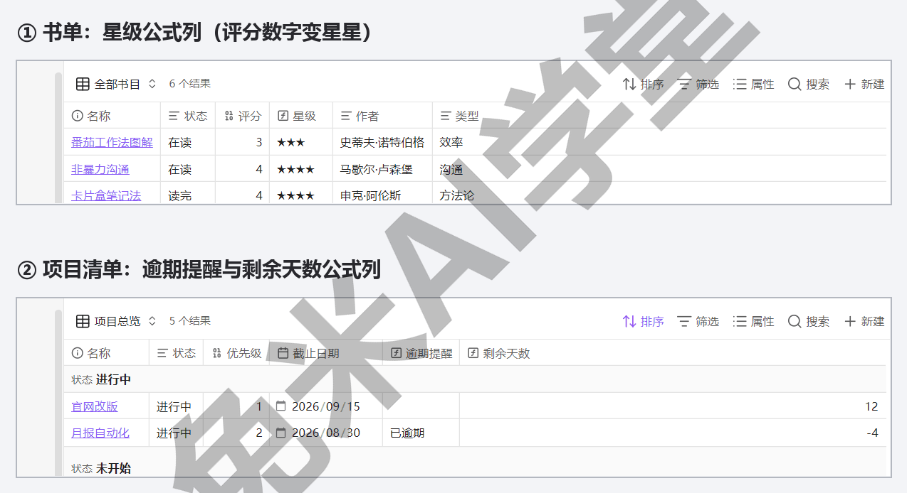

### 8.5 视图体系：多视图、卡片与嵌入

同一批数据，常常需要几种看法：全部书目一张全表，在读的单独一张，读完的按评分从高到低。不必建三个 Base——**一个 Base 可以装多个视图**，每个视图有自己的筛选、排序和列配置，数据源共用一套。

官方把“视图”和“布局”分成两层说，术语先对齐：视图是一套保存下来的配置组合（叫什么名、筛哪些行、显示哪些列、怎么排序），布局是这套配置用什么形式呈现。布局现有表格、卡片、列表、地图四种——列表与地图是后来版本加入的，地图还要求官方的 Maps 插件，个别新布局可能要求抢先体验版，以你实机的可选项为准。前面建的都是表格布局，这一节解锁卡片布局。

**视图操作全套。** 视图菜单是表格上方工具栏的第一项。添加视图有两种方式：点左上角的视图名，在弹出列表里选“添加视图”；或者用命令面板运行“数据库：添加视图”。

每个视图可以单独配置：点视图名，弹出列表里每个视图旁带一个右箭头，点它进入视图设置——下图就能看到这个箭头；官方还给了更快的一路：直接右键工具栏上的视图名（右键一路以实机为准）。视图列表里排第一的是默认视图，拖动视图图标可以调顺序；视图重命名的具体菜单项，以实机为准。

拿书单练一遍：添加一个视图取名“在读”，在筛选菜单的“当前视图”一侧加“状态 等于 在读”的条件——8.3 讲过的两个分区在这里派上用场，加在“当前视图”才不会影响“全部书目”那张全表。做完点视图名，就能在两个视图之间来回切换。

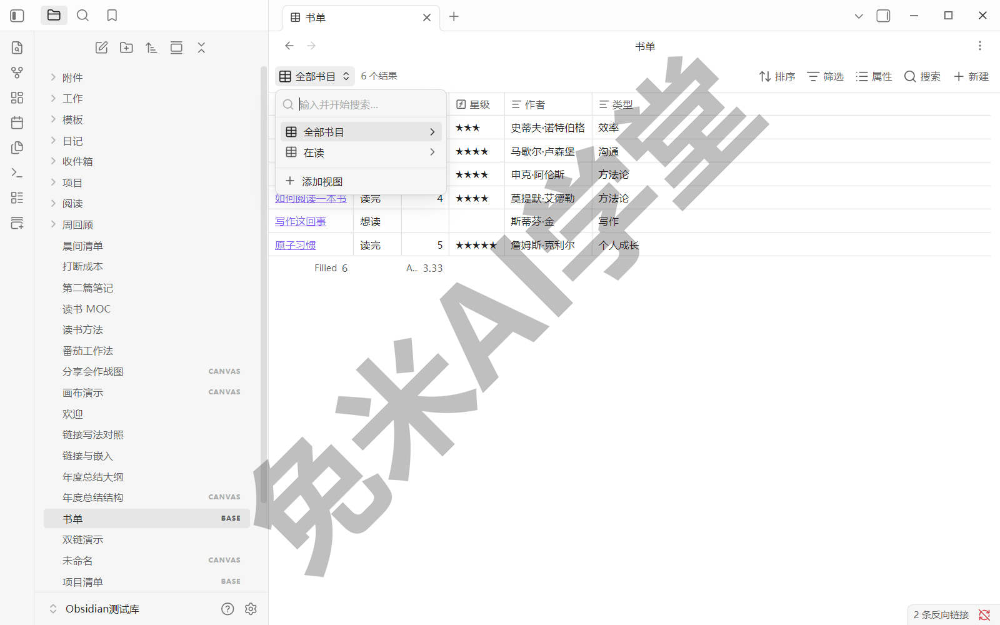

**第三个实例库：影单卡片。** 卡片布局把每一行显示成一张带封面图的卡片，排成画廊式的网格，天然适合影单。先按模板补几篇电影笔记：

```
---
tags:
  - 影/想看
状态: 想看
评分: 5
封面: https://图片地址/海报.jpg
年份: 2026
---
观影随想随意记几句。
```

“封面”属性填一张海报图的地址。官方认三种值：

- 外部图片网址；
- 库内附件的链接，写成 `"[[附件名.jpg]]"`——影单走的就是这一路，下图卡片封面全是库内图片；
- 一个十六进制颜色值（纯色封面，写法以官方帮助为准）。

然后新建“影单.base”，筛选圈定“影”标签，添加一个卡片布局的视图（布局在“添加视图”时选择），进视图设置配四项——海报墙就是照这四项配出来的，单项的界面叫法以实机为准：

- **图片属性**：选“封面”，卡片顶部就会显示这张图，不配则卡片只有文字；
- **图片填充**：两个选项——填满是图片撑满卡片、超出部分裁掉，包含是图片完整缩放进卡片、不裁剪；海报类图选包含更稳妥；
- **图片宽高比**：默认 1:1 正方形，电影海报偏竖长，调整这一项让封面更接近海报比例——下图的竖长卡片就是调过之后的样子（可选值以实机为准）；
- **卡片大小**：控制每张卡片的宽度，拖到自己看着舒服为止。

配好后按“评分”从高到低排序，一整面海报墙就出来了——第三个实例库到手。

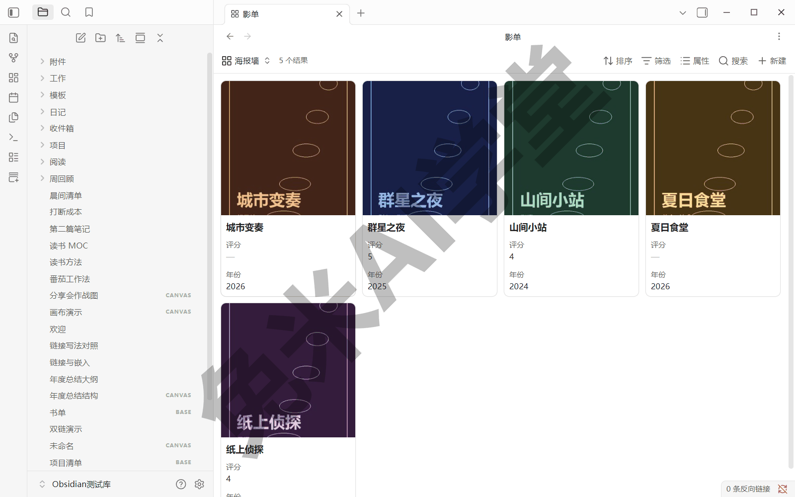

影单的 .base 配置全文（照抄后在视图设置里配上面四项即可；卡片的封面等设置项官方未在配置语法文档中列出对应字段，故模板不含，以视图设置面板里的配置为准）：

```
filters:
  and:
    - file.hasTag("影")
views:
  - type: cards
    name: 海报墙
    order:
      - file.name
      - 评分
      - 年份
```

**工具栏剩下的三件小工具**，认识一下就会用（结果计数、“搜索”、“新建”在工具栏一字排开，前面的截图里都露过面）：

- **结果按钮**：显示当前视图有多少行，点开能限制显示条数，还能把视图复制到剪贴板或导出成 CSV 文件——CSV 是一种通用的表格数据交换格式，Excel 等表格软件都能直接打开；复制出来的内容适合当场粘进表格软件，导出 CSV 则适合把数据交给别人；
- **搜索按钮**：在当前视图里按显示出来的属性快速搜行，清单长了不用肉眼扫；
- **新建按钮**：直接在当前视图里新建一篇笔记，省去先建笔记再补属性的来回（新建的笔记是否自动带上筛选条件对应的标签或属性，需实机验证）。

**把清单挂到常用页面上。** 清单建好了，还可以不用专门打开它。《双链与图谱》讲过嵌入语法：感叹号加双方括号，能把别的内容原样嵌进当前笔记。Base 一样能嵌，在任何笔记里写：

```
![[书单.base]]
![[书单.base#在读]]
```

第一行嵌入后显示默认视图（视图列表排第一的那个）；第二行用井号指定视图名，只显示“在读”视图——下图 MOC 里嵌的正是这两行。把这样一行写进你的首页 MOC 或日常笔记，清单就常驻在你每天都开的页面上——《双链与图谱》建 MOC 时说它是主题的总入口，现在这个入口里还能放会自己更新的活清单。

8.1 提过的代码块形态在这里也接上了：“数据库：新建数据库并插入”那条命令生成的就是嵌在笔记里的 base 代码块，效果与嵌入 .base 文件相近，区别是配置直接写在这篇笔记的代码块里、不生成独立文件——8.1 的对照图里两种形态都露过面。取舍很简单：清单要在多处复用，建独立文件再嵌；只属于某一篇笔记的清单，用代码块。

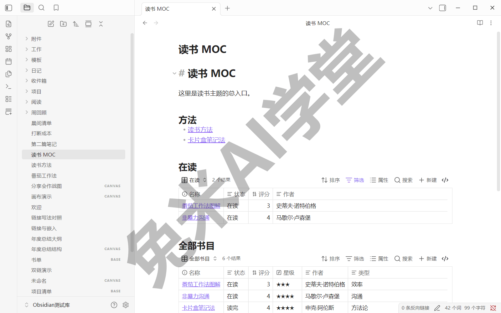

到这里三个实例库全部到手：书单是基础表格加筛选排序，项目清单是分组汇总加公式列，影单是卡片布局加封面。模板全文都在正文里——书单在 8.2，项目清单在 8.3（笔记模板）与 8.4（配置全文），影单在 8.5，照抄可复现。它们在实战部分还会升级：《读书笔记系统》把书单扩成完整的书架看板，《工作项目管理库》把项目清单接进每周汇报的工作流。

### 8.6 三个练习任务

三个任务对应三个实例库，做完这一篇的能力就全部亲手练过一遍。

**任务一：书单**

把你自己的读书笔记建成书单 Base：圈定数据来源、选好列，加一个“在读/读完”筛选，再按评分排序。

完成标准：在表格里改一个单元格，跳进对应笔记能看到属性同步变化；把筛选条件在“在读”“读完”之间切换过一次。

**任务二：影单**

按 8.5 的模板补三五篇电影笔记并配上封面地址，建影单 Base，添加卡片布局的视图，配好图片属性与宽高比。

完成标准：卡片视图按评分排序展示，每张卡片都显示封面图。

**任务三：项目清单**

按 8.4 的模板给手头的真实项目建项目清单 Base：按状态分组，加上“逾期提醒”“剩余天数”两条公式列。

完成标准：公式列显示正确，并且能说出为什么公式单元格点不动（它是算出来的展示层，不写回笔记属性）。

### 8.7 本篇小结与自检

这一篇用官方 Bases 把笔记属性汇成了会自己更新的表：圈来源、选列、筛选排序、分组汇总、公式列，再用多视图和嵌入把清单放进常用页面，书单、影单、项目清单三个库全部到手。最需要记住的是：**表里每一行都是一篇真实的本地笔记——表格只是视图，数据永远在你的 md 文件和属性里。**

可以对照下面的清单检查学习结果：

- [ ] 能说出 Bases 与 Excel 的本质区别（行＝笔记）
- [ ] 建成书单 Base，验证过单元格与笔记属性双向同步
- [ ] 会用筛选、排序、分组和汇总行
- [ ] 照抄跑通过至少一条公式列
- [ ] 影单卡片视图配了封面，并把一个视图嵌进了常用笔记

完成这些内容后，清单管理已经自动化。下一篇《社区插件系统》打开更大的世界：安全地关闭受限模式，装上第一批社区插件。

### 8.8 新手常见问题

**Q1：Bases 和 Excel 该用哪个？**

看数据的最小单位是什么。最小单位是“一篇笔记”（一本书、一部电影、一个项目，各自有内容可写）就用 Bases，行与笔记一一对应；最小单位是“一格数字”、要做复杂函数运算和报表，仍是 Excel 的主场。两者也能接力：Bases 视图支持复制到剪贴板和导出 CSV，需要深度计算时导出去接着算。

**Q2：旧笔记没打属性，怎么进表？**

只要被筛选条件圈中，没属性的笔记也会进表，只是对应列是空的。补属性不必推倒重来：篇数少就逐篇打开在属性面板补，或者直接在表格里点开空单元格填——8.2 第 4 步已经验证过表格内编辑会写回笔记，空单元格补填走的是同一个机制。篇数太多时，《标签与属性》讲过官方原生不支持属性值的批量编辑，课程的建议是先把列名统一、再逐篇补值；将来《Obsidian×Codex：让 AI 管理你的笔记库》会给出用 AI 批量补属性的可选路线。

**Q3：.base 文件删了，笔记会丢吗？**

不会。.base 里只有“怎么展示”的配置——筛选、视图、公式，没有任何笔记数据；数据始终在每篇笔记自己的属性里。删掉 .base，所有笔记原样还在库里，随时可以再建一个新表。反过来，在表格里删行才是真正的删除——那等于删掉一篇笔记，务必想清楚再删（删行操作的界面形态，需实机验证）。

**Q4：Bases 和 Dataview 先学哪个？**

先 Bases。它官方内置、可视化编辑、零代码，书单影单项目表这类清单需求全覆盖，本篇学完就能日常使用。Dataview 是社区插件，要写查询代码，强项在跨笔记任务汇总、复杂查询这类点选界面拼不出来的场景。等《Dataview 专讲》见到它时，你已经带着“属性变表格”的地基，上手会快很多；两者不冲突，很多人并用。
