## 社区插件系统

到这一篇为止，你用到的都是官方内置的能力——核心插件，加上同样官方出品的 Bases。这一篇打开社区插件的大门：先把风险讲清楚，再学会浏览、安装、更新、卸载的全流程，装上第一批值得装的插件，最后学会插件相互冲突时怎么排查。

顺序是有意安排的：先懂风险，再学操作，最后才是装什么。读完这一篇，扩展这座库的主动权和把关能力就都在你手里了。

### 9.1 受限模式为什么默认拦着

先把两个词分清。《界面与设置全导览》给过一张核心插件总览地图——那三十来项（随版本增减）是官方内置、随软件自带的能力；**社区插件** 则是第三方开发者写的扩展程序，要自己从商店安装。Obsidian 真正“千人千面”的深度来自后者：从看板、手绘白板到自动汇总，几乎每种需求都有人写过插件——本篇后半要装的几件候选，以及下一篇《Dataview 专讲》的主角，全部来自社区。

不过，第一次去找社区插件的入口，你会发现门是关着的：打开设置 → 第三方插件（实机 1.13.7 的分组名就叫“第三方插件”），页面提示**受限模式**（Restricted mode）正处于开启状态——它默认开启，拦住一切第三方插件。顺带说明：这个开关的两种叫法“受限模式”和“安全模式”在实机里同框并存——关闭后设置页的分区标题写“安全模式”，描述和按钮却写“开启受限模式”，官方中文帮助两种也都用过；课程统一叫“受限模式”，认准按钮上的字即可。

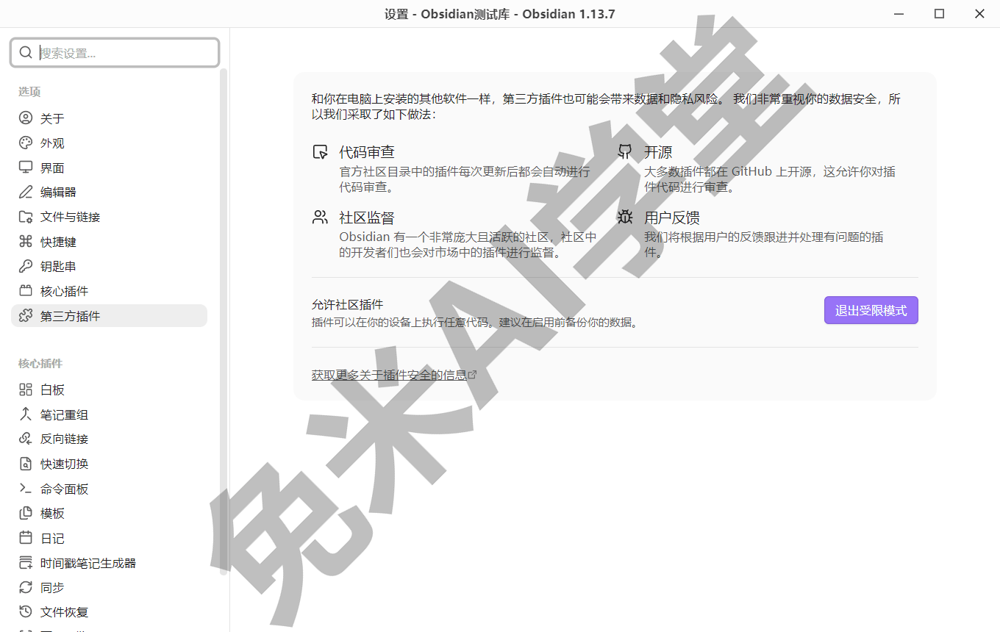

为什么要默认拦着？因为社区插件不是“皮肤”或“小挂件”，而是运行在 Obsidian 里的第三方程序。官方帮助明确列过它们能做到的事：

- 可以访问你电脑上的文件——注意不只是库里的笔记，而是这台电脑上的文件；
- 可以连接互联网——把数据发出去或从外面拉回来，技术上都做得到；
- 可以安装额外的程序——它本身就是一段在你机器上运行的代码。

而且官方说明了技术上的限制：Obsidian 没办法对插件做按项的权限限制，插件一旦启用，继承的就是 Obsidian 本身的访问能力。官方不为第三方代码担保，所以默认把门关上，由你自己决定给谁开门。

换个角度想，这个信任模型你其实早就熟悉：浏览器装扩展、手机装应用，同样是把别人写的代码放进自己的环境里运行。差别在于 Obsidian 的插件离你的笔记更近——它们就运行在装着你全部笔记的应用里，所以官方把默认状态设为拦住，把选择权完整交给你。本篇学的把关思路，回头用在浏览器扩展这些场景上同样成立。

这正是《认识与装好》讲过的“数据完全自有”的另一面：笔记是你硬盘上的文件、控制权完全在你手里，相应地，把关的责任也在你手里——装谁、信谁，都由你决定。

还有一层边界值得知道：受限模式挡的是“运行”，不挡“存在”。已安装的插件文件就存放在库的配置文件夹里（《认识与装好》建库时见过 `.obsidian` 文件夹——这座库的设置和插件都记录在里面），受限模式开启时它们只是不会被运行的普通文件。这也是后面排查一节能把受限模式当“安全模式”用的原因。受限模式不是障碍，是一道默认关着的门；下一节先学会判断谁可信，再亲手开门。

### 9.2 信任判断与关闭受限模式

开门之前，先看看官方替你做了哪一层把关，再学你自己的那一层。

**官方的底线**。所有社区插件必须遵守官方的开发者政策；每个插件的每个版本上架前，官方都会自动扫描一遍——查安全漏洞、代码质量问题和恶意代码。扫描结果公开在官方插件目录（community.obsidian.md）每个插件的**评分卡**（Scorecard）页签里，热门、精选和被举报的插件还会另有人工复审——目录网站是英文界面，评分卡见下图，Health、Review、Disclosures 三个词对照下文认读即可。评分卡有两个总评：**健康度**（Health）看的是这个插件“活不活”——最近有没有提交和发版、issue 有没有人回、用的人多不多；**审查**（Review）看的是最近一次自动扫描的结果——通过了哪些检查，以及“披露事项”：插件做了哪些值得你知道的事，比如访问剪贴板、向外部域名发请求。官方自己的解读很直接：披露少就低风险，披露多就装前仔细看。

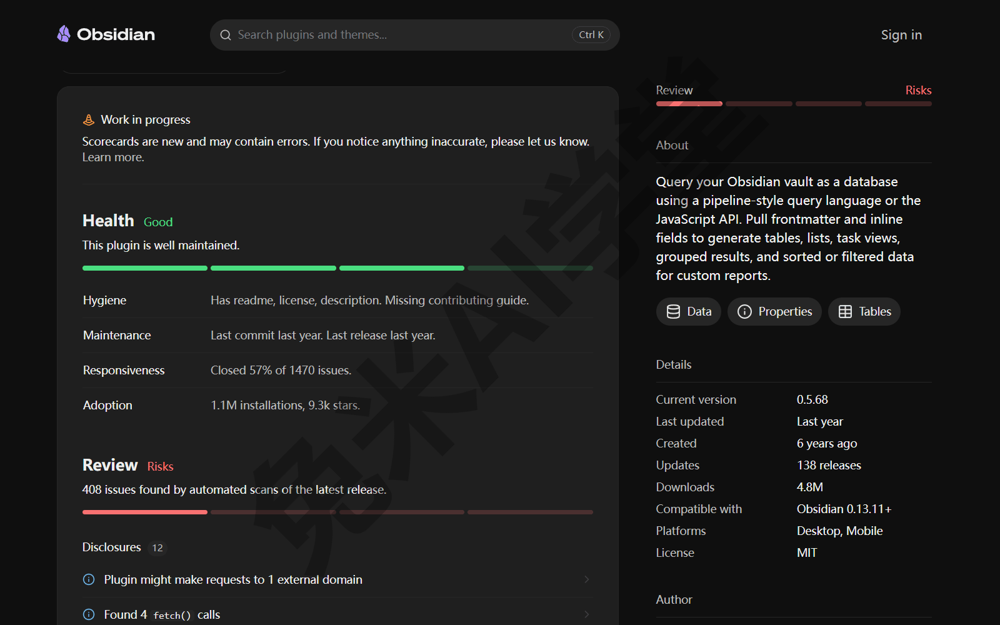

**你的四个信号**。官方扫的是底线，装不装还要你自己判断。装前把四个信号一起看：

- **开源仓库**：代码公开吗？仓库最近还有提交吗？issue 有人回复吗？一个作者已经消失的仓库，问题出了没人修。
- **下载量**：百万级下载的插件，坑早被前人踩过一轮；下载量在浏览列表和详情页都直接可见。
- **更新频率**：详情页的“最近更新”离现在多久？长期不更新不等于一定坏，但新版本 Obsidian 可能出现不兼容，要多看一眼评分卡和目录页有没有挂提示横幅。
- **社区口碑**：论坛讨论多不多、教程反复点名、目录页的相关推荐——被大量真实用户长期使用，本身就是最硬的信号。

**节制观**。四个信号之外还有一条总原则：**不要一上来装一堆**。每装一个插件，就是多一份要信任的第三方代码，外加一份心智负担——设置要学、更新要跟、出了问题要排查。装前先问一句“核心功能真的做不到吗”，答案是做不到、且需求真实存在，再装。用到再装即可。

**动手开门**。判断标准有了，现在关闭受限模式：

- 第 1 步：打开设置 → 第三方插件，受限模式开启时页面顶部是一段插件安全说明（官方的代码审查、开源、社区监督三层做法），下方“允许社区插件”一条写着风险提示：插件可以在你的设备上执行任意代码，建议启用前备份数据；
- 第 2 步：点“允许社区插件”右侧的“退出受限模式”按钮——点击立即生效、不弹确认窗，应用会自动重载一次；旁边还有个“重新启用已安装插件”开关，管的是重载后要不要自动恢复之前启用的插件，默认开着（第一次开门时库里还没有插件，这个开关暂时用不上，它在排查场景的用法见 9.6）；
- 第 3 步：重载完成后回到这一页，会看到页面多出**浏览** 按钮和已安装插件区——插件商店的大门开了。


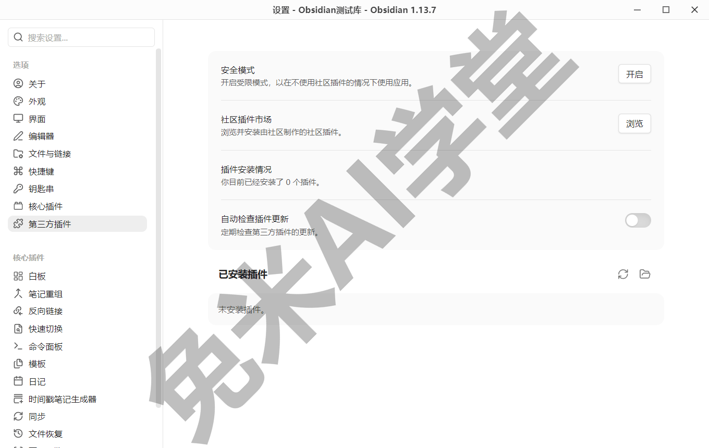

一句给敏感库的提醒：如果某座库里放着工作机密或大量隐私，官方的建议是装前对插件做独立的安全审查；普通学习库按四个信号把关即可，不必过度紧张。

### 9.3 浏览、安装、更新、卸载全流程

门开了，这一节把全流程走完：找到、安装、管理、卸载。

**浏览与搜索**。点开浏览，就是插件市场：搜索框按名称、作者和描述过滤，找准目标点进详情。你也可以在浏览器里逛官方目录网站（community.obsidian.md），看到的是同一批插件，页面信息更全，详情页上的 Add to Obsidian 按钮能直接拉起应用进入安装（按钮名与拉起行为需实机验证）。

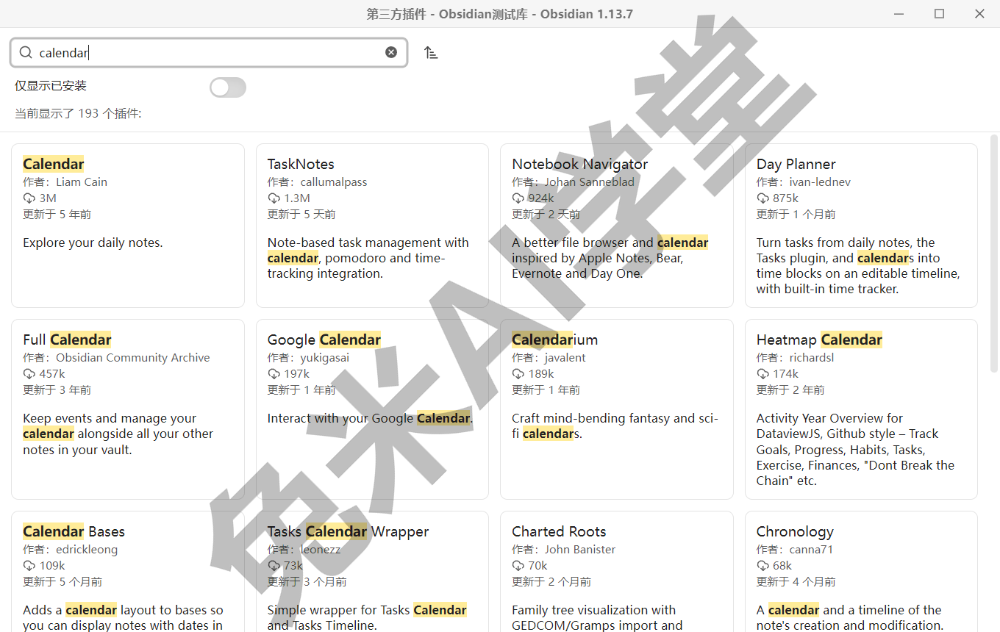

**详情页怎么看**。一个插件的详情页值得花三十秒。应用内的详情页（下图）：简介与截图看它是干什么的，抬头一排看下载量、版本、作者、Github 仓库地址和上次更新时间，旁边就是安装按钮。目录网站的详情页信息更全：Details 区多出创建时间、发版次数、兼容版本、支持平台和许可证，评分卡看健康度与审查结果，更新历史看发版节奏（网站为英文界面，9.2 的评分卡图就出自这里）。付费规则官方分三档——免费、可选付费（依赖第三方付费服务或高级功能收费，基础功能免费可用）、付费，详情页的付费说明区会写明（以目录页为准）。把上一节的四个信号对着详情页找一遍，就是一次完整的装前体检。

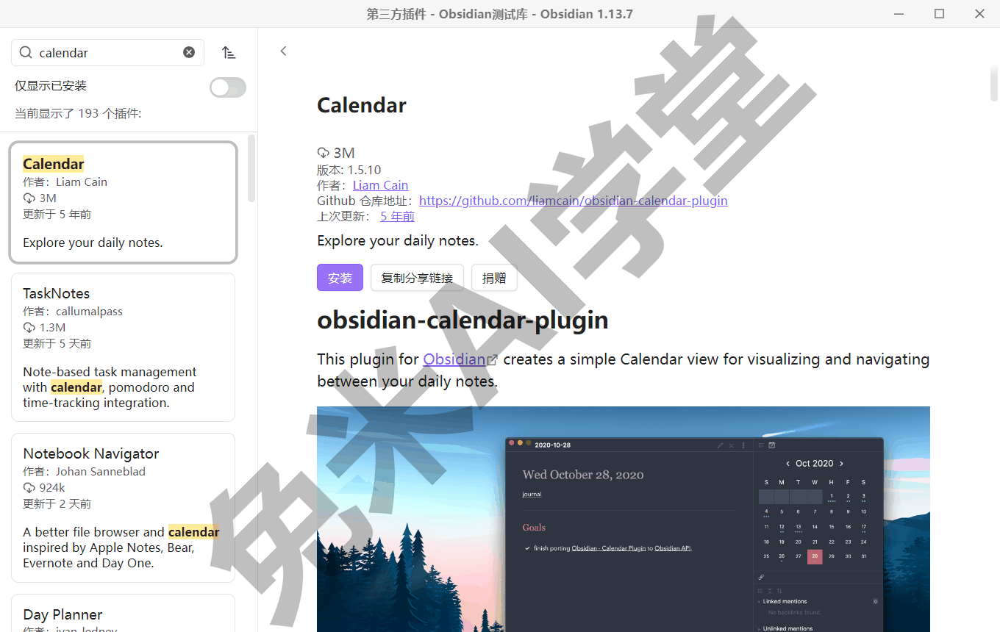

**安装 → 启用，两步走**。这是全篇最高频的新手坑：点“安装”只是把插件下载进库，**必须再点“启用”** 它才真正生效——按钮就是这两个词，装完“安装”原位变成“启用”和“卸载”，标题旁挂上“已安装”徽标（下图）。“我装了怎么没反应”十有八九是只装没启用。启用有两处入口：

- 安装完成的界面上直接点启用，一步到位；
- 或者回到设置 → 第三方插件 → 已安装插件列表，打开对应开关。

做完会看到：插件出现在已安装列表里、开关点亮；多数插件会随之多出自己的设置页、命令或面板。

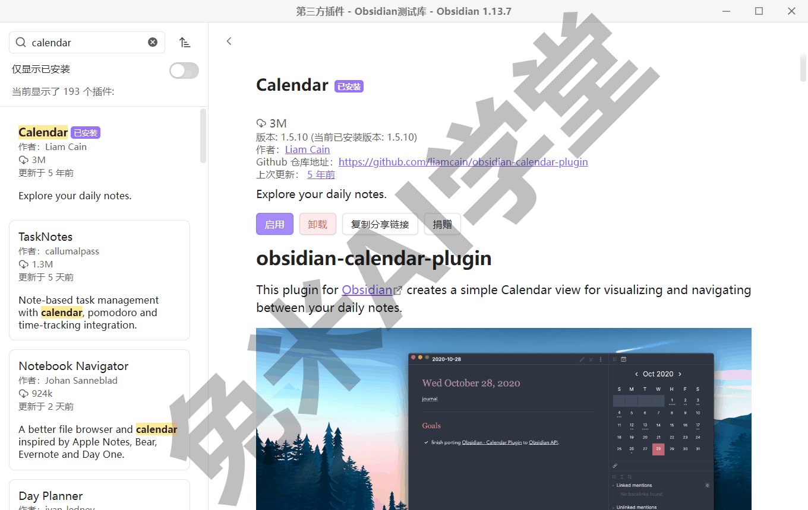

**管理已安装插件**。1.13.7 的已安装列表一行一件：右侧是启用/禁用开关和一个 ⋮ 菜单，官方帮助说的设置、快捷键、资助作者、卸载这些管理动作从 ⋮ 菜单进（菜单内的具体选项以实机为准）。列表区上方还有刷新重载、打开插件文件夹两个图标和一条“搜索已安装的插件”搜索框（找插件多了很有用），页面顶部另有一个“自动检查插件更新”开关。

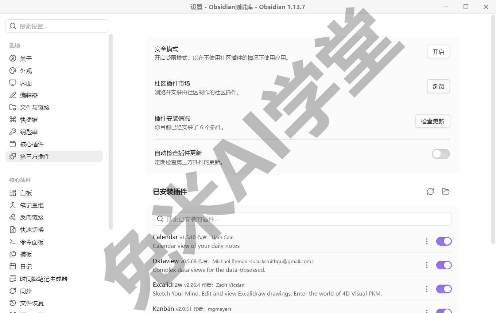

**更新**。出于安全考虑，社区插件不会自动安装更新（官方说法）——每一版都要经你的手。在“插件安装情况”一栏点“检查更新”按钮（上一段提到的“自动检查插件更新”开关也只是代你检查，装不装仍由你点），可以全部更新，也可以只更新某一个。两个建议：更新前扫一眼该插件目录页的更新说明，知道这一版改了什么；赶工期间别顺手全部更新，功能突变会打断你的工作流。

**卸载与残留**。详情页里“启用”旁边就有“卸载”按钮（上图可见），点它确认即卸。要知道的边界：卸载移除的是插件本体；插件在库里生成过的内容文件（比如它建的看板文件、画板文件）不会被带走——那些是你的数据；个别插件的配置残留怎么清，按插件自己的说明处理（以实机表现为准）。另外一条官方说明这里先记下：**重新打开受限模式并不会删除已装插件**，它们保留在库里、只是全部被忽略——这个特性在 9.6 排查时非常好用。

### 9.4 必装第一件：Style Settings

全流程学完了，装第一件正式的必装插件，顺便把流程练熟。

**为什么必装**：《美化与工作区》要靠它对主题做系统的可视化微调——强调色、标题样式、界面密度这类调整，那一篇是它的主场。本篇先装好备用，也把它当成第一次完整的装前体检练手。

**它是什么**：一个把主题、插件、CSS 片段声明的样式选项集中到一个设置面板里的插件。改颜色、字号、圆角这类事，在面板里点选、拖滑杆就行，不用写一行代码。工作机制一句话：主题或片段的作者按约定声明“我这里有哪些可调项”，Style Settings 负责扫描并把它们摆成面板——谁声明了什么，面板里就出现什么。

**先做一次装前体检**。拿它练四个信号正合适：开源仓库公开在案；下载量百万级；社区口碑扎实——大量主题把“支持 Style Settings”当卖点写在简介里；唯独更新频率这一项要说清楚——它的维护已移交社区归档组织（官方目录作者栏显示 Obsidian Community Archive，原作者标注为 Former），新版本已停滞较久，不过官方评分卡当前给的是健康度良好、审查合格，仍在官方目录在列可装（以上状态以当前目录页为准；本课已从市场把它装上，见下）。四个信号三强一弱、官方审查合格、需求真实存在（《美化与工作区》必用），所以装——这个判断过程本身就是示范：**信号不是一票否决，而是合起来称重**。

**装上**：浏览搜索 Style Settings → 安装 → 启用。做完会看到：设置窗口左侧多出 Style Settings 的选项页。

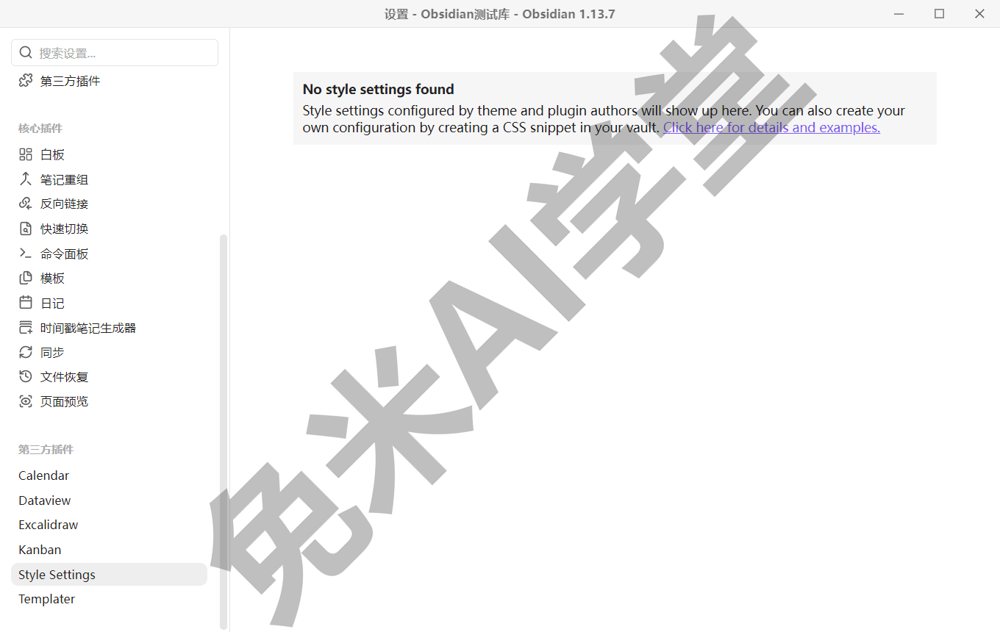

**认识一个不算坑的坑**：如果你还在用默认主题，点开它的面板几乎是空的——不是装坏了。默认主题下这个面板只有一行英文提示“No style settings found”（上图），因为它列出的是主题和片段声明的可调项，默认主题几乎不声明；装了支持它的主题后，可调项会成排出现——《美化与工作区》装主题后的面板就是成排的样子，改一处强调色立即变色的演示也在那一篇。现在面板空着不影响任何使用。

**和直接写 CSS 的分工**：《美化与工作区》还会给出照抄即用的 CSS 片段——那是更底层的手段，主题没暴露的角落用它补。Style Settings 的价值在于把常用调整变成开关和滑杆，不会 CSS 也能用；两层可以叠加，先面板后片段。

顺带一提，它的面板支持多语言：主题作者提供了中文翻译时，可调项的标题和说明会显示成中文（官方文档记载的机制，是否有中文以各主题的支持情况和实机为准）——对中文用户是实打实的友好度加分。

### 9.5 必装候选四件逐个最小演示

课程的“必装五件”，Style Settings 已定，其余四件为**候选**：Templater、Calendar、Kanban、Excalidraw——四件已逐件装上、各自跑出最小产出（见下），维护状态不一的风险在各件里如实标注，本节按候选把四件讲全。每件统一走三步：是什么一句话、装上、跑出一个最小可见产出，深用各归各篇。

**Templater：核心模板的进阶门**

《日记、模板与每日工作流》讲过核心模板的边界——变量有限、没有逻辑判断，够用是常态。真不够用时，Templater 就是那扇进阶门：变量更多、能对日期做运算、能按条件生成内容。装上：搜索 Templater → 安装 → 启用，在它的设置里指定一个模板文件夹（建议与核心模板的文件夹分开，避免两套模板混放）。最小产出：建一个模板文件，内容写一行——

```
今天是 <% tp.date.now("YYYY-MM-DD") %>
```

用 Templater 的插入模板命令把它插进任意笔记，这一行会自动变成当天日期——下图右侧就是插入后的结果（命令的确切名称以插件当前版本为准）。深度用法课程第二季预留；本课的日常工作流只用核心插件就能完整跑通，这一点《日记、模板与每日工作流》定过规则，不变。

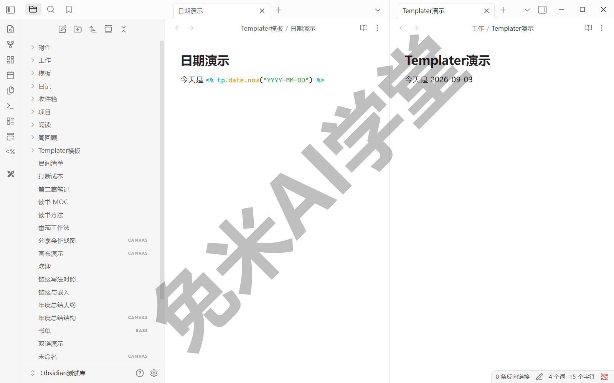

**Calendar：给日记加一本翻得动的月历**

它在右侧边栏加一个月历面板，点任意日期直达（或创建）那一天的日记，和日记核心插件联动——回顾旧日记、补写昨天，从此有了日历入口。装上后的最小产出：右侧出现本月月历，点今天，今天的日记被打开——下图就是 1.13.7 里的这一幕。如实交代：该插件已多年未发新版本，用户量依然很大；本课演示的基本用法在 1.13.7 上一切正常，长期停更的风险仍要心里有数。


**Kanban：把任务排成看板**

它把一篇笔记变成看板：待办、进行、完成排成几列，卡片在列间拖动，项目推进一眼可见——《工作项目管理库》的任务看板就要用到这类能力。装上后的最小产出：命令面板运行“创建新看板”（《工作项目管理库》的任务看板用的也是这条命令），建三列，把一张卡从“待办”拖进“进行”。看板数据同样存成库内一篇 md 文件。

它的维护状态必须明说，这是四件候选里风险最大的一件：维护已移交社区归档组织，官方目录页挂着征集新维护者的横幅，插件已长时间没有新版本，官方评分卡的审查一栏当前给的是风险提示——仍在官方目录在列、可正常安装（以上状态以当前目录页为准；本课装的 2.0.51 正常可用，下图看板就是它搭的）。按本课“十年后还打得开”的长期主义标准，这层风险摆在明面：如果它最终落选，看板需求会由官方 Bases 的看板视图承接——该视图在官方路线图上开发中，是否已进公开版以当前版本为准，《工作项目管理库》已按双路预案设计。

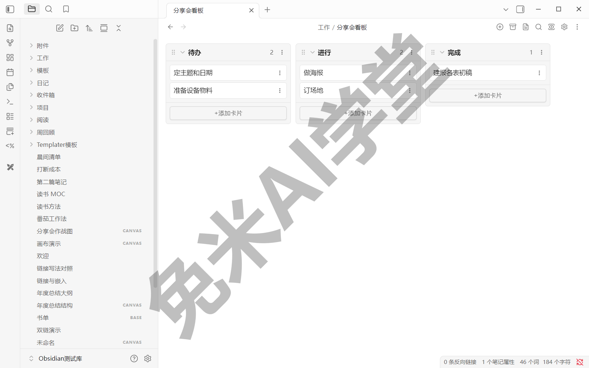

**Excalidraw：手绘风白板画图**

它是画图插件：流程图、示意图、随手草图，画出来是手绘风格的矢量图，可以反复编辑。和《Canvas 画布》的边界一句话讲清：白板（Canvas）摆的是卡片和笔记，管的是内容的空间排布；Excalidraw 画的是图形本身，管的是手绘线条与形状——要摆已有笔记用白板，要画一张图用 Excalidraw，互补不互替。装上后的最小产出：新建一张 Excalidraw 画板，随手画一个流程草图并保存——下图的分享会流程草图就是拿它画的，存成库内一个 .excalidraw 文件；之后可以嵌进任意笔记（新建入口与嵌入写法以插件文档为准）。它更新活跃，维护状态健康。

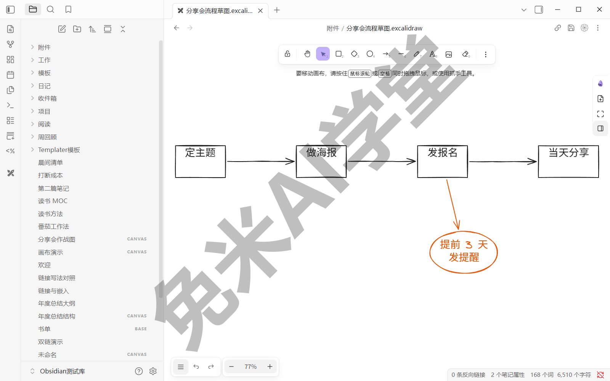

四件都走完“搜索 → 安装 → 启用 → 最小产出”，这套流程你应该已经很熟悉了，之后再装任何新插件，照这四步走就行。

### 9.6 插件互踩排查法

插件装到两位数之后，迟早会遇到一次：某个功能突然失灵、界面突然错乱，或者启动明显变慢。先别急着重装软件——往往是两件插件相互冲突（课程把这种情况称作“互踩”），而且能系统地把元凶找出来。

**症状识别**。三类典型：

- 功能失灵：以前一直能用的操作突然没反应了，或者开始弹出报错提示；
- 界面错乱：样式跑偏、面板空白、按钮错位，换个主题也不见好；
- 性能异常：启动明显变慢、输入卡顿，库没变大却越用越沉。

它们的共同特征是往往发生在“装了新插件、更新了插件或主题”之后——所以排查第一问永远是：**最近动过什么？**

**第一招：先查最近动过的**。最近装的、最近更新的，先单独禁用它试试——在已安装插件列表里关掉开关即可，不用卸载。一个小注意：禁用通常立即生效，但个别插件要重启一次应用才完全停用（以实机表现为准），拿不准时重启后再下结论，判断更可靠。症状消失就命中了，直接跳到处置。

**第二招：二分禁用法**。插件已经不少、又没头绪时，用二分：

- 第 1 轮：把已启用的插件关掉一半，看症状还在不在——消失，说明元凶在被关的那一半里；还在，元凶在开着的那一半；
- 第 2 轮：对有嫌疑的那一半，再关一半，重复同样的判断；
- 第 3 轮起：每轮排除一半，十几个插件三四轮就能锁定到某一个。

有个现象值得知道：互踩常常是两件插件的组合才出问题，各自单开都正常——这也是“互踩”得名的原因。锁定后把这对组合各自单开验证一次，就能确认是谁和谁。

**第三招：受限模式当安全模式用**。只想先回答“到底是不是插件搞的”，不想逐个关：直接打开受限模式——所有第三方插件一键全部停用，已装插件保留在库里、只是被忽略（官方说法）。症状随之消失，就是插件问题，再关闭受限模式做二分；症状还在，那就去查主题、CSS 片段或软件本身。另外，退出受限模式的页面上有个“重新启用已安装插件”开关，默认开着——退出后会把之前启用的插件原样恢复；排查时把它关掉再退出，就得到“全部停用”的干净起点（1.13 版本起提供这一能力，官方更新日志说明这正是为排查准备的）——正好配合排查：全关之后逐个打开，开到谁出事，谁就是元凶。

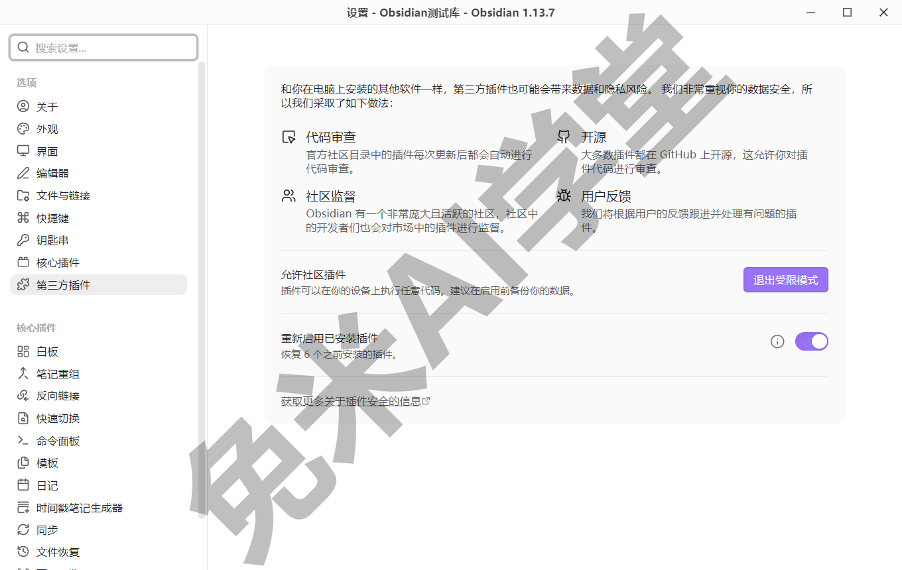

**定位之后怎么处置**。三个选择：

- 互踩组合二选一：留常用的、关另一件，多数冲突就此了结；
- 找替代：目录详情页的相关推荐里通常就有同类插件，换一件不冲突的；
- 报告问题：去插件的开源仓库报一个 issue，附上复现步骤——开源项目欢迎这样的反馈；若怀疑插件有恶意行为，官方目录页可以直接举报，也可以联系官方支持（官方说法）。

真遇到互踩时不用慌：方法就是上面三招，按顺序用。

### 9.7 三个练习任务

三个任务对应本篇的三样核心能力：开门装件、候选试用、排查演练。

**任务一：装上 Style Settings**

关闭受限模式，完成 Style Settings 的“搜索 → 安装 → 启用”全流程；装前对着详情页把四个信号过一遍。

完成标准：设置页左侧出现 Style Settings 选项页。

**任务二：候选四件挑一件**

从 Templater、Calendar、Kanban、Excalidraw 里挑一件装上，并跑出它的最小产出（比如 Calendar 的月历面板显示本月）。

完成标准：能用一句话说出它解决什么问题。

**任务三：演练一次二分排查**

临时禁用一半插件，确认软件正常后再逐步恢复，完整演练一遍二分禁用的节奏（没有真故障也要走一遍流程）。

完成标准：能说出排查三步——关一半、再关一半、锁定元凶。

### 9.8 本篇小结与自检

这一篇打开了社区插件的大门：受限模式挡住的是“未经你允许的第三方代码”，关闭它之前先学会判断插件可不可信。最需要记住的是：**插件按需安装、用到再装；装完必须启用；出问题用二分禁用法定位。**

可以对照下面的清单检查学习结果：

- [ ] 能说出核心插件与社区插件的区别
- [ ] 知道受限模式挡住什么、关闭前要看哪些信任信号
- [ ] 独立完成过一次“搜索 → 安装 → 启用 → 最小产出”全流程
- [ ] 装好 Style Settings 和至少一件候选插件，并各跑出一个最小产出
- [ ] 会用二分禁用法排查插件互踩

完成这些内容后，库的能力边界由你自己扩展。下一篇《Dataview 专讲》装上社区生态最重要的一个插件，让笔记自动汇总成清单和表格。

### 9.9 新手常见问题

**Q1：社区插件收费吗？**

绝大多数免费。官方目录把付费规则分三档：免费；可选付费——插件本身免费可用，但依赖第三方付费服务或把部分高级功能设为付费；付费——必须付费才能使用。每个插件详情页的付费说明区写得很清楚（以目录页为准）。本篇的必装件与四件候选全部免费（以当前目录页为准）。

**Q2：受限模式关了，库还安全吗？**

分层看：官方有底线——开发者政策、每个版本的自动扫描、公开的评分卡，加上热门插件的人工复审；你有四个信号——开源仓库、下载量、更新频率、社区口碑，装前合起来称重。做到“用到再装、装前体检”，风险是可控的。真正敏感的内容另说：《库、文件与搜索》讲过分库的判断标准，密级不同是少数值得分库的理由——机密内容可以放在一座保持受限模式、不装任何插件的库里。

**Q3：插件装多了会拖慢启动吗？**

会有影响：每个启用的插件都要在启动时加载，数量多了启动和内存都会变重。根本办法还是节制安装；感觉明显变慢时，用二分禁用法找出最重的那几件。另外设置“关于”页的高级一栏有“应用启动缓慢时运行通知”开关，打开后启动过慢会给出诊断信息，供排查参考。

**Q4：插件更新后功能变样了怎么办？**

先去目录页的更新历史页签看那一版的更新说明，确认是改版还是故障；不适应可以先禁用观望，或者去仓库 issue 区看有没有同类反馈。社区插件不会自动更新，什么时候更新由你掌握——所以养成两个习惯：更新前看一眼说明，赶工期间不做全部更新。
