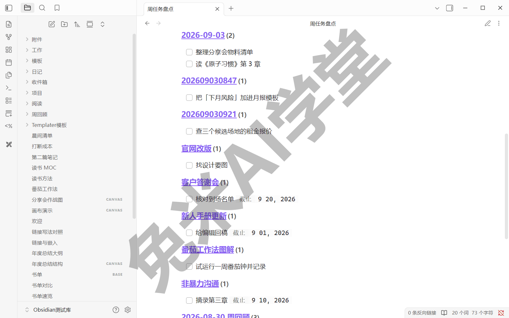
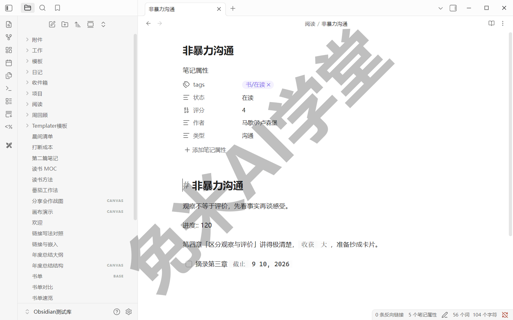
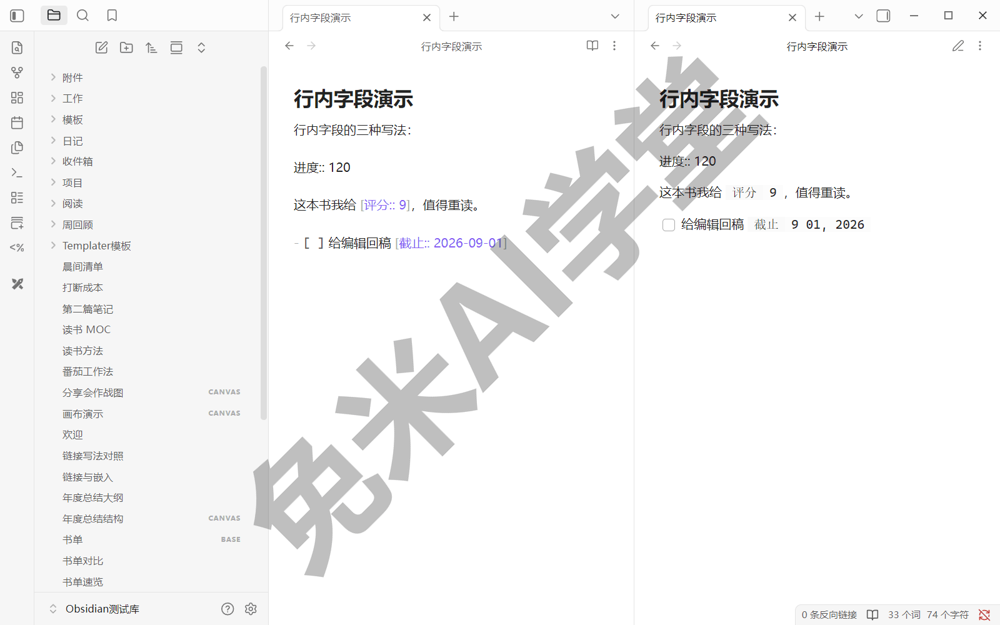
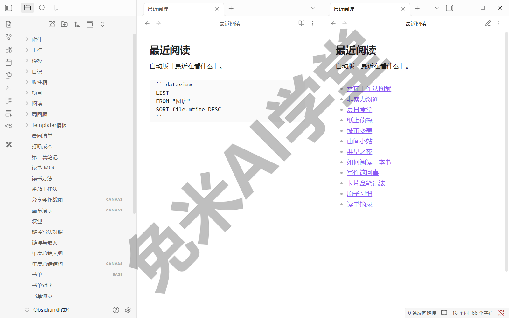
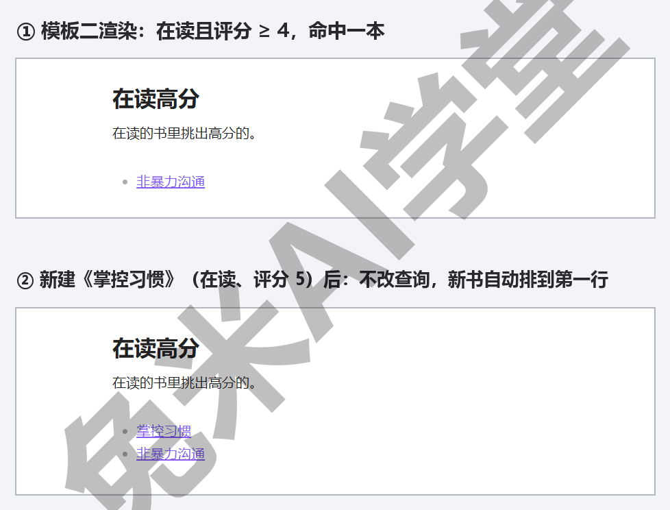
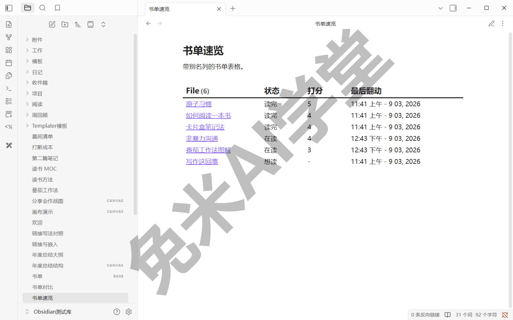
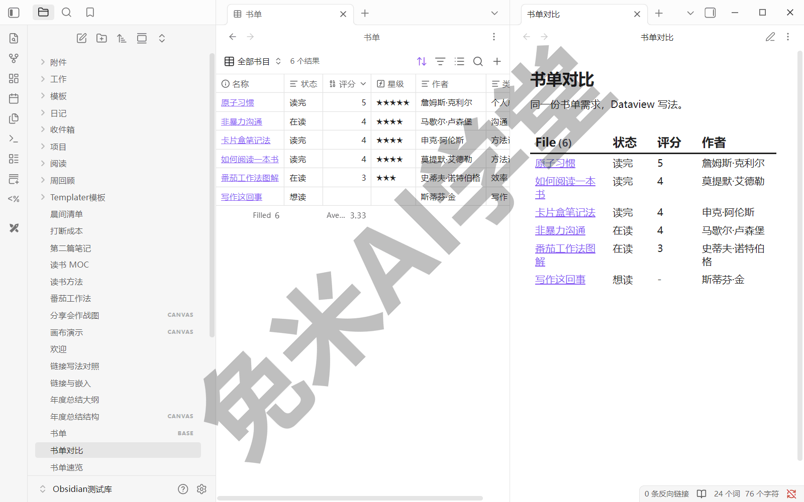
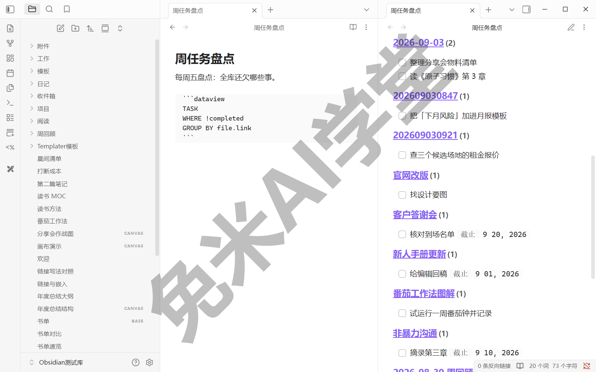
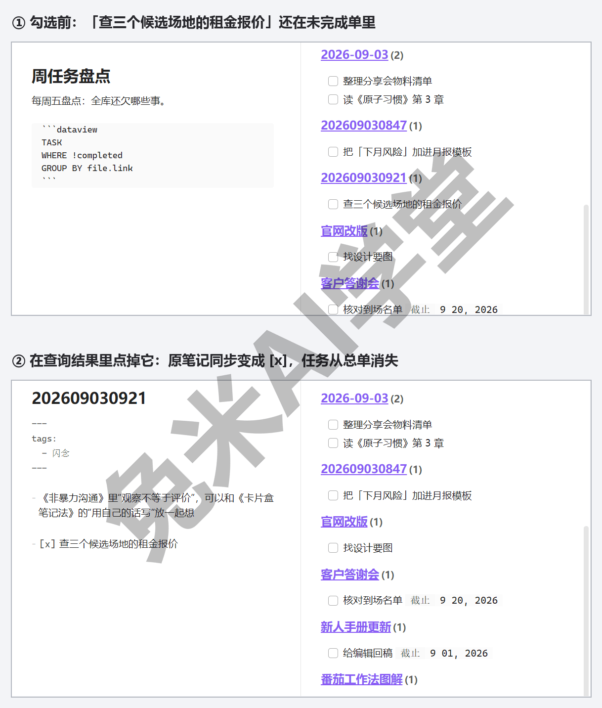

## Dataview 专讲

《Bases 数据库》给了你官方内置、零插件的表格；这一篇装上社区生态里最重要的一个插件 Dataview，学会三类照抄即用的查询——LIST 列清单、TABLE 出表格、TASK 汇总任务，最后把“它和 Bases 怎么分工”这个问题彻底讲清。

《认识与装好》定下的零成本记账继续记：Dataview 是免费的社区插件，本篇花费 0 元。

### 10.1 Dataview 是什么：有了 Bases 为什么还需要它

先看一个上一篇解决不了的场景。用了一段时间之后，你的任务散落在库的各个角落：《日记、模板与每日工作流》的收件箱里积着几条闪念任务，各篇项目笔记里随手记了“- [ ] 找设计要图”“- [ ] 给编辑回稿”，读书笔记里还有两条“- [ ] 摘录第三章”。到了周五想盘点一下手头还欠哪些事，你得把这些笔记一篇篇翻开看——笔记越多，这件事越没法靠手工完成。

拿刚学的 Bases 试试？不行。Bases 表格的最小单位是笔记：一行是一篇笔记，一列是一个属性。而任务是笔记正文里的一行字，藏在行与行之间，Bases 触及不到它们。全局搜索的 task-todo: 操作符（《库、文件与搜索》讲过）能找到这些任务，就算用那一篇提过的嵌入查询把结果常驻在页面上，得到的也只是命中片段——做不到按笔记归组，更不能在结果里点一下就把任务勾掉。

Dataview 解决的就是这类问题。它是一个社区插件，核心能力一句话：**用查询语言把全库笔记自动汇总起来**——属性由你维护，汇总由它完成。你在笔记里写下一段三五行的“查询”，它就原地渲染出一份清单、一张表格或一张任务单，而且是活的：库里的数据一变，结果跟着变。



已经有了 Bases，为什么还值得再学一个干类似事情的插件？三个理由，也是两者分工的雏形：

- **任务级的跨笔记汇总**。Bases 的行是笔记，而 Dataview 的 TASK 查询能把散在各篇笔记里的任务一条条捞出来，汇成一张可以直接勾选的总单——开头那个周五盘点的场景，它三行就解决，10.5 见。
- **复杂条件与灵活组合**。Bases 靠点选菜单拼条件，拼不出来的逻辑就是拼不出来；Dataview 是写出来的，条件、计算、分组可以随意组合，上限高得多。
- **多年积累的现成资源**。Dataview 比 Bases 年头久，网上攒了大量现成查询和用法示例，遇到需求先搜一搜，大多已有人写好、可以照抄——对新手这是切实的便利。

要说明的是，两个工具在“表格”这件事上确实有重叠，但谁也不取代谁——重叠区怎么划分，10.4 的同题对比和分工决策表给出正式答案。这两样东西在课程后面的实战里都会用到：《读书笔记系统》的年度书单要靠它自动生成，《工作项目管理库》的周报汇总更是直接建在 TASK 查询上。这一篇把地基打好，后面拿来就用。

安装不用多讲：上一篇《社区插件系统》学过的全流程在这里走一遍就行——关闭受限模式后进插件市场，搜索 Dataview，安装并启用（装完记得启用，那一篇提醒过的坑；本课实机装的是 0.5.68 版）。装好后设置页会多出 Dataview 的选项页，本篇全程用默认设置即可，不需要进去调任何东西。

### 10.2 字段从哪来：属性、行内字段与隐式字段

查询汇总的对象是“字段”。在动手写第一条查询之前，先弄清一个根本问题：Dataview 能查到哪些数据？答案是三个来源，其中两个你已经会了。

**第一来源：属性（frontmatter）。**《标签与属性》定过的规则在这里再次兑现——当时说“要排序筛选的数据进属性”，你给读书笔记打的“状态”“评分”“作者”，在 Bases 里是现成的列，在 Dataview 里就是现成的可查字段。官方说明得很明确：笔记头部的全部 YAML 属性，自动全部可查，一个不落。这也是三来源里最主要的一个：属性维护得越好，查询能做的事越多。

**第二来源：行内字段。** 有些数据不适合放笔记头部，而是想写在正文中途——Dataview 为此提供了“行内字段”写法：键与值之间用**双冒号** 连接。注意是两个冒号，这和属性区里的单冒号不同，写错一个冒号字段就不存在。它有三种形态，三种的源码与渲染对照见下图：

- 独占一行时直接写，如 `进度:: 120`——这一行整个是字段，双冒号后面直到行尾都算值；
- 嵌在句子中间时用方括号包起来，如 `这本书我给 [评分:: 9]，值得重读。`——数据嵌在句子里，读起来仍是一句话；
- 写在任务或列表项上时必须用方括号形态，如 `- [ ] 给编辑回稿 [截止:: 2026-09-01]`——因为这一行里字段不是唯一内容。

第三种形态先多看一眼：给单条任务挂上自己的字段，是任务能被精细筛选的关键——10.5 的“逾期任务单”就靠它。这是属性做不到的事：属性属于整篇笔记，行内字段可以精确到某一行。





**第三来源：隐式字段。** 就算一个字段都不写，Dataview 也自动为每篇笔记备好了一批现成数据，全部挂在 `file` 名下。先认五个最常用的，官方文档有完整全表，用到再查：

- `file.name`——文件名，也就是笔记标题；想按名字筛一批笔记、又不想动 FROM 的范围时，就拿它写进筛选条件；
- `file.folder`——所在文件夹的路径；配合筛选条件，能做出“只要某两三个文件夹”这类比 FROM 更细的圈定方式；
- `file.link`——指向这篇笔记的链接；查询结果里每一行都能点击跳回原笔记，背后用的就是这个字段，分组标题也用它；
- `file.mtime`——最后修改时间；“最近动过的排前面”这类排序，原料就是它（对应的创建时间叫 `file.ctime`）；
- `file.tags`——笔记里的全部标签，嵌套标签会逐级拆开记录，#书/在读 会同时记作 #书 与 #书/在读，所以按父级标签也能筛到它。

最后交代两个细节：

- 官方明确支持非拉丁字符的字段名，所以课程沿用《标签与属性》以来的中文属性名，查询里直接写“状态”“评分”即可——本篇全部查询和《工作项目管理库》的整套周报用的都是中文字段；英文键名要留意一点——名字里带空格或大写时，查询要用官方规范化后的小写连字符形式，拿不准就别在键名里用空格。
- 值长什么样决定字段类型：`2026-09-01` 这种写法会被认作日期，纯数字是数字，其余是文本——类型对不对，直接决定比较和排序灵不灵，这一点《标签与属性》讲属性类型时定下的规矩同样适用。

### 10.3 LIST 查询照抄即用

三类查询从最简单的 LIST 开始。它输出一份笔记清单，每条是一个可点击的链接。

**查询写在哪。** 在任意笔记里插入一个语言标记为 dataview 的代码块（代码块本身的写法——上下各三个反引号围栏，姊妹篇《Markdown 通用语法手册》的《扩展语法》篇讲过，一句带过），查询语句写在块内。光标离开代码块，它原地渲染成结果；想改查询，把光标点回去就恢复成代码——本篇所有查询都是这么边写边看着渲染出来的。

最小的合法查询只有一个词：

```
LIST
```

它列出全库所有文件——能跑，但没什么用，而且库大时又慢又长（官方文档也提醒这类全库查询开销大）。真正实用的查询要加限定，三行骨架分别管三件事：

- **FROM——圈范围**：`FROM "阅读"` 限定在“阅读”文件夹（文件夹名带英文引号，路径从库根目录起算），`FROM #书` 限定带某标签的笔记；两类来源还能组合，`FROM #书 AND "阅读"` 表示同时满足——《工作项目管理库》的周报查询就用到这种组合（拿它排除模板文件夹）。范围越小，查询越快、结果越干净——把它当成每条查询的标配；
- **WHERE——筛条件**：`WHERE 状态 = "在读"` 只留属性满足条件的笔记，文本值要加引号；数字直接比较，比如 `WHERE 评分 >= 4`；多个条件用 AND、OR 连接；
- **SORT——排顺序**：`SORT file.mtime DESC` 按最后修改时间从新到旧（DESC 降序、ASC 升序）。

骨架搭好，两条可照抄的模板直接用。模板一，“某文件夹的全部笔记，最近动过的排前面”——它就是一份自动版的“最近在看什么”：

```
LIST
FROM "阅读"
SORT file.mtime DESC
```

模板二，“带某标签、且属性满足条件的清单”——在读的书里挑出高分的：

```
LIST
FROM #书
WHERE 状态 = "在读" AND 评分 >= 4
SORT 评分 DESC
```

做完会看到：代码块变成一列笔记链接，条数和顺序符合你的条件，点击任何一条直接跳进那篇笔记——下图左源码右效果。现在验证它是“活”的：往“阅读”文件夹里新建一篇笔记，回来看模板一的清单——不用动查询，新笔记已经排在第一行；把它挪出这个文件夹，清单里那一行又消失了。这就是 10.1 说的：属性由你维护，汇总由它完成。





再补一个小能力：LIST 后面可以跟一条附加信息，随清单一起显示。比如 `LIST 评分` 会在每个链接后面缀上评分值——只能跟一条，想显示多列就该换下一节的 TABLE 了。

查询写完没结果也别急着重写，10.8 的第一问给了完整的排查顺序，多数是引号、冒号、范围这类小问题。

### 10.4 TABLE 查询与 Bases 同题对比

清单只能缀一条附加信息，想同时看状态、评分、作者，就把 LIST 换成 TABLE——从模板二一步改造过来：

```
TABLE 状态, 评分, 作者
FROM #书
SORT 评分 DESC
```

TABLE 后面跟要显示的列，逗号分隔，想放几列放几列；第一列固定是文件名链接，列头还带结果计数——下图表头的 File (6) 就是。列名可以起别名，用 AS 接上，含空格的别名要加引号：

```
TABLE 状态, 评分 AS "打分", file.mtime AS "最后翻动"
FROM #书
SORT 评分 DESC
```

隐式字段也能当列用——上面第三列就把每本书的最后修改时间摆进了表里。顺带一提：不想要第一列文件名时，官方还有 TABLE WITHOUT ID 变体，用到再查即可。



**同题对比：同一个书单，两种做法各来一遍。** 需求固定：库里所有带“书”标签的笔记，列出状态、评分、作者，按评分从高到低。

- **Bases 做法**（《Bases 数据库》建书单时完整走过）：新建 Base，筛选菜单圈定“标签包含 书”，属性菜单勾选状态、评分、作者三列，排序菜单设评分降序——四步点选，全程不写一个字；
- **Dataview 做法**：上面那段三行查询，粘进任意笔记的 dataview 代码块——一次书写，全程不碰鼠标。

两张“表”摆在一起看，差别立刻具体起来（对照效果见下图）：

- **改动方式**：Bases 改列、改条件走菜单点选；Dataview 改一行字。点选直观，文本利落，各有人偏爱；
- **数据编辑**：Bases 的单元格可以直接改、双向同步回笔记属性（《Bases 数据库》当场验证过）；Dataview 的表格是纯展示，想改数据得回笔记里改——它只负责“看”，不负责“改”（唯一的例外是任务勾选，10.5 讲）；
- **存在形态**：Bases 是 .base 文件或 base 代码块，配置存在文件里；Dataview 查询就是笔记里的一段文本，复制粘贴就能搬走、分享、改造；
- **上手门槛**：Bases 零代码，装好 Obsidian 就有；Dataview 要装插件、要记语法，换来的是上限。



**分工决策表（详讲版）。**《Bases 数据库》结尾埋过一句“怎么分工，《Dataview 专讲》专门回答”，现在正式回答。判断标准不是哪个更强，而是需求属于哪一类：

| 你的需求 | 用哪个 | 一句理由 |
| --- | --- | --- |
| 书单、影单、项目清单类可视化清单 | Bases | 零代码、能直接改数据 |
| 把散在全库的任务汇成一张单 | Dataview | TASK 查询是它的独门能力 |
| 点选菜单拼不出来的复杂条件与计算 | Dataview | 查询语言上限更高 |
| 想抄网上现成的汇总方案 | Dataview | 多年生态，现成模板多 |
| 结果要导出 CSV 或复制给别人 | Bases | 自带复制与导出 |

同题对比的结论并不是二选一，而是让你看清同一件事的两种成本：搭一张表的功夫，Bases 更少；改造和复用的余地，Dataview 更大。学习顺序则维持《Bases 数据库》答疑时定下的结论：先 Bases 后 Dataview，两者不冲突、读的是同一批属性，很多人并用——清单交给 Bases 可视化维护，汇总交给 Dataview 自动生成，本课的实战部分就是这么分工的。

### 10.5 TASK 查询与性能边界

回到 10.1 开头那个场景：任务散在全库，周五想盘点。现在你已经看得懂解法了：

```
TASK
WHERE !completed
GROUP BY file.link
```

三行的意思：TASK 声明这次要的不是笔记清单，而是任务清单——查询深入到每篇笔记内部，把一条条任务捞出来；`!completed` 是“未完成”（感叹号表示“非”），只留还没勾掉的；GROUP BY file.link 按来源笔记归组，每组的组名就是那篇笔记的链接，点一下直接跳回原文——下图每个分组标题都是可点的笔记链接，右上还标着组内任务数。

做完会看到：一张按笔记归组的全库未完成任务总单——收件箱的闪念、项目笔记里的待办、读书笔记里的摘录计划，全部到齐，再也不用一篇篇翻。



**它还能直接勾。** 这张总单不只是看的：在查询结果里点击任务前的复选框，原笔记里的那一条会被同步勾掉——下图对照：总单里点掉“查三个候选场地的租金报价”，原笔记里它当场变成 [x]，任务同时从总单消失。这里要记一条重要规则，官方文档写得很明确：Dataview 只负责展示和计算，从不改动你的笔记——唯一的例外就是在查询里勾选任务。也就是说，删掉任何一段查询代码块，你的笔记和数据毫发无损；这张任务总单上的勾选动作，效果等同于你打开原笔记亲手勾掉。

配合 10.2 学过的任务行内字段，还能升级出一张“逾期任务单”。前提是任务按当时教的写法挂了截止字段（如 `- [ ] 给编辑回稿 [截止:: 2026-09-01]`）：

```
TASK
WHERE !completed AND 截止 AND 截止 <= date(today)
```

`截止 AND` 这一段先确认任务挂了这个字段，再比较日期是否已到——两段连写是官方文档的标准写法，防止没挂字段的任务混进来（`date(today)` 是官方日期字面量，同族的 `date(sow)` 就用在《工作项目管理库》的周报查询里）。

这张总单的去处也安排好了：把它放进《日记、模板与每日工作流》搭的每周回顾模板里，周报的“未完成任务盘点”环节从此自动化——《工作项目管理库》会把这个雏形扩成完整的周报流水线，模板全文到那一篇给。

顺带补全家族名单：除了 LIST、TABLE、TASK，官方还有第四种查询 CALENDAR，把笔记按日期铺在月历上打点显示。课程用不到它，知道有即可。

**性能与能力边界**，四条规则一次讲清：

- **首次索引慢属正常**。装上插件后第一次打开大库，Dataview 要在后台把全库数据建立索引，等一会儿是正常现象（具体时长与表现以实机为准）；索引建好后，官方称引擎可以支撑数十万篇量级的库，日常规模远够用；
- **全库大查询会慢**。不加 FROM 的查询要扫全库，库大时明显变慢，官方文档专门提醒过——所以 10.3 把 FROM 定为标配，每条查询都圈范围；
- **查询只读，平时不耗资源**。查询在打开所在页面时才运行，平时不占用什么；单页堆太多查询、或者每条都扫全库，打开那一页才会卡（以实际表现为准）；
- **DataviewJS 不用学**。查询语言之外，官方还提供用 JavaScript 写查询的进阶通道 DataviewJS，能力更强、复杂度也高一个量级，零基础课程不展开。真遇到查询语言写不出的需求，后面《Obsidian×Codex：让 AI 管理你的笔记库》会给一条更省力的路——让 AI 代写查询，逐条跑通再用。



### 10.6 三个练习任务

三个任务对应三类查询，全部用你库里的真实数据。

**任务一：装上并跑通第一个 LIST**

安装并启用 Dataview，在任意笔记里照抄模板一（把“阅读”换成你自己的文件夹名）：

```
LIST
FROM "阅读"
SORT file.mtime DESC
```

然后往那个文件夹新建一篇笔记，回来看清单。

完成标准：不改查询，新建的笔记自动出现在清单第一行。

**任务二：TABLE 与 Bases 同题各做一遍**

照抄 10.4 的 TABLE 模板做一张带两列属性的表（列名换成你实际用的属性），再按《Bases 数据库》的做法用 Bases 做同一张表。

完成标准：两张表内容一致，并且能说出两者的一处差别（改动方式、能否直接编辑、存在形态任选其一）。

**任务三：全库任务总单**

照抄 10.5 的 TASK 查询汇总全库未完成任务，然后在查询结果里勾掉一条确实已完成的任务。

完成标准：被勾掉的任务从结果里消失，打开它的原笔记，那一条确实已被勾选。

### 10.7 本篇小结与自检

这一篇装上了 Dataview，三类查询——LIST 列清单、TABLE 出表格、TASK 汇总任务——都可以照抄即用。最需要记住的是：**属性是字段最主要的来源，维护得好查询才有数据可查；新手清单用 Bases，跨笔记汇总和复杂条件再上 Dataview。**

可以对照下面的清单检查学习结果：

- [ ] 装好 Dataview 并跑通第一个 LIST 查询
- [ ] 能说出字段的三个来源
- [ ] 照抄并改出过一个 TABLE 查询，加了自己的筛选条件
- [ ] 用 TASK 查询汇总过全库未完成任务
- [ ] 拿到一个需求，能说出该用 Bases 还是 Dataview

完成这些内容后，你的笔记已经会自动汇总自己。下一篇《同步与备份全解》解决数据安全：同步三条路怎么选，翻车了怎么救。

### 10.8 新手常见问题

**Q1：查询没结果，从哪查起？**

按顺序过五关，多数问题出在前三关：

- 一查 FROM：文件夹名是否带了英文引号、路径是否从库根目录写起、标签是否带 #；
- 二查冒号：行内字段是不是写成了单冒号——必须是双冒号 `::`，单冒号不构成字段；
- 三查值与类型：文本值要加引号（`WHERE 状态 = 在读` 不行，要写 `"在读"`）；日期要写成 `2026-01-15` 这种格式才被认作日期，类型不对，比较就不成立；
- 四查字段是否真的存在：正文里的普通句子不是字段，官方的说法是只有被索引的数据才查得到——回到 10.2 对一遍三个来源；
- 五做减法：把 WHERE、SORT 逐行删掉再逐行加回，哪一行加上后结果消失，问题就在哪一行。

**Q2：Dataview 和 Bases 只学一个行不行？**

行，而且顺序早定过：《Bases 数据库》答疑时说的“先 Bases 后 Dataview”维持不变。只做书单、影单这类可视化清单，Bases 一个就够；要任务汇总、复杂条件，再加学 Dataview。好消息是两者读的是同一批属性——《标签与属性》的地基打一次，两边都受益，学第二个时只是换一种取用方式。

**Q3：查询多了会拖慢库吗？**

平时不会：查询只在打开它所在的页面时运行，没被打开的页面里的查询几乎不消耗资源。会慢的场景有三种——刚装上插件、首次索引还没建完；查询不加 FROM、每条都扫全库；单页堆了大量查询，打开那一页时集中计算。养成 10.3 的习惯，每条查询都圈范围，一般感觉不到负担（以实际表现为准）。

**Q4：DataviewJS 需要学吗？**

零基础不需要。本篇教的查询语言已经覆盖绝大多数汇总需求，课程后面的实战也全部只用它。DataviewJS 是面向会 JavaScript 的用户的进阶通道，属于“需要时自然会去学”的东西。真撞上查询语言写不出的需求，先想想是不是该换工具（很多“复杂需求”其实是 Bases 或标签属性没用对），实在需要，《Obsidian×Codex：让 AI 管理你的笔记库》里“让 AI 代写查询”是更省力的路。
