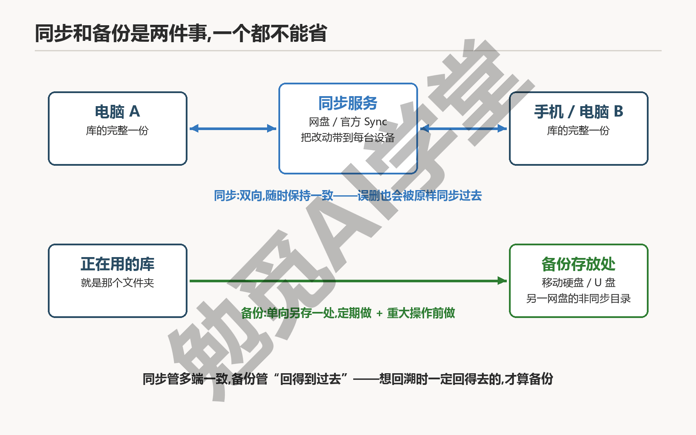
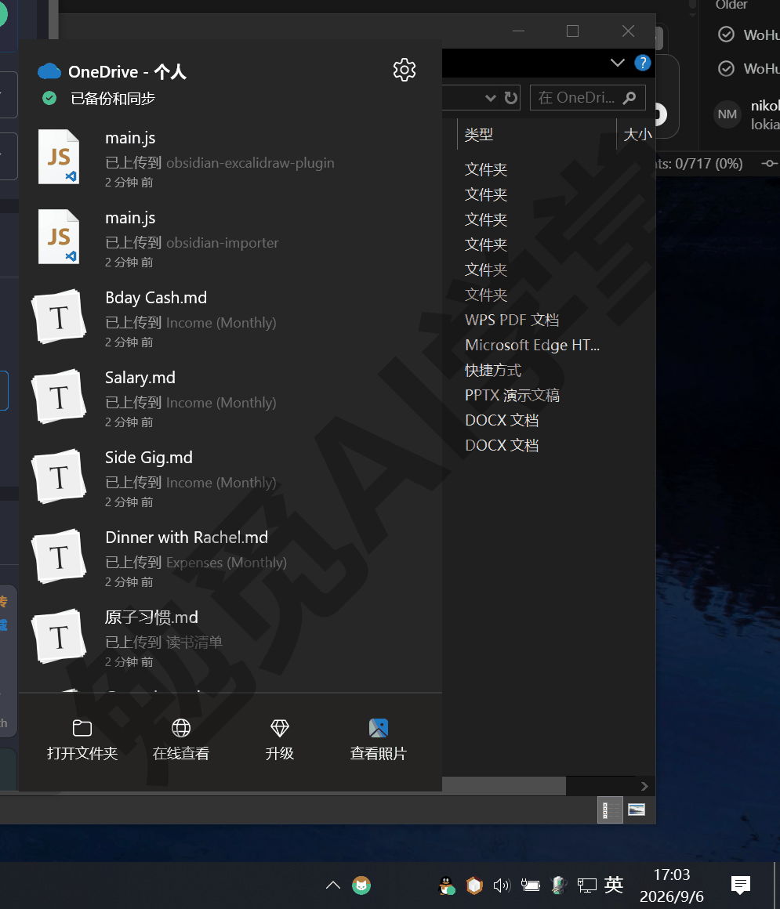
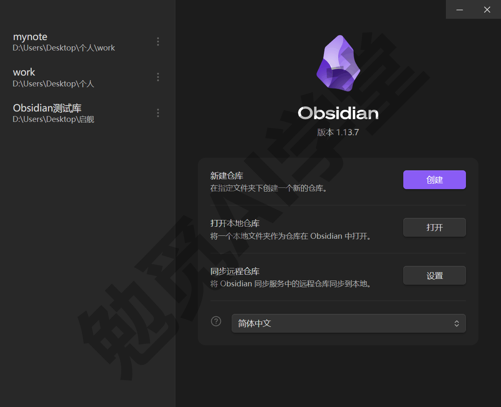
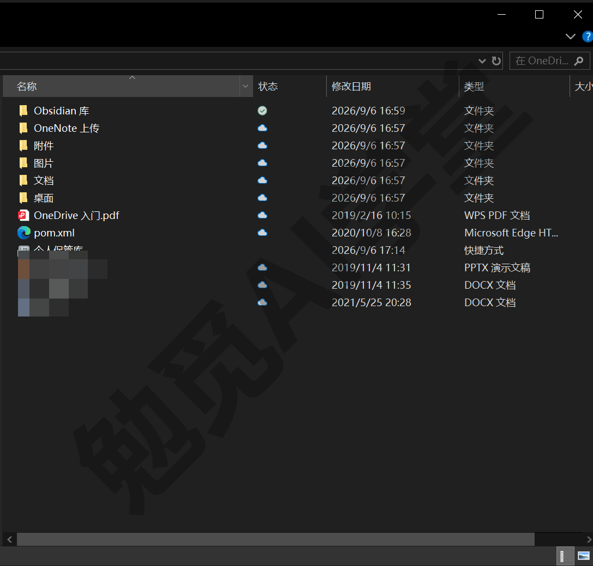
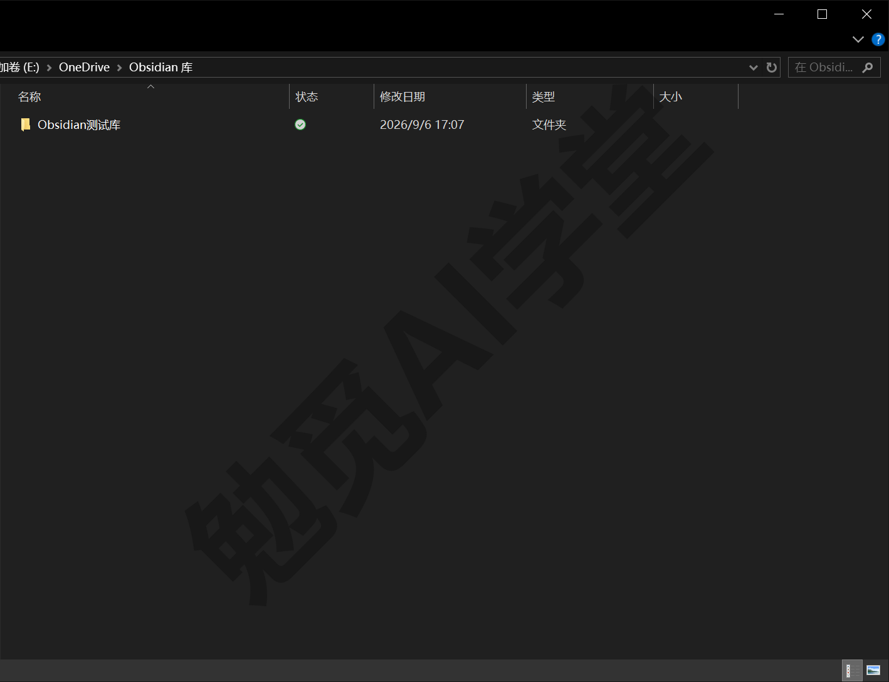
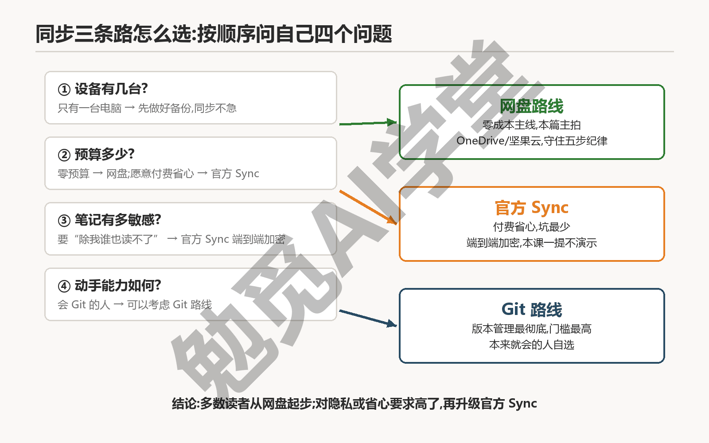
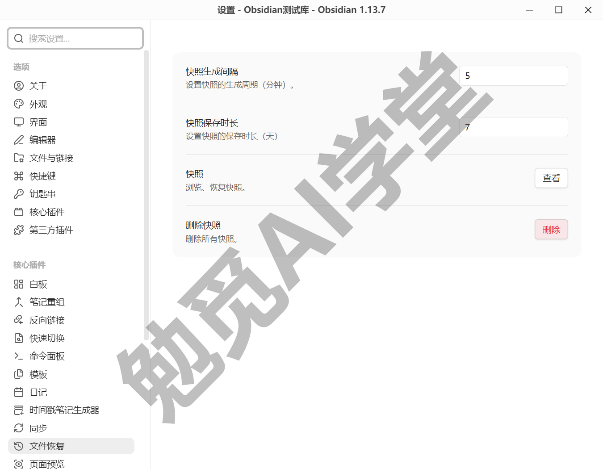
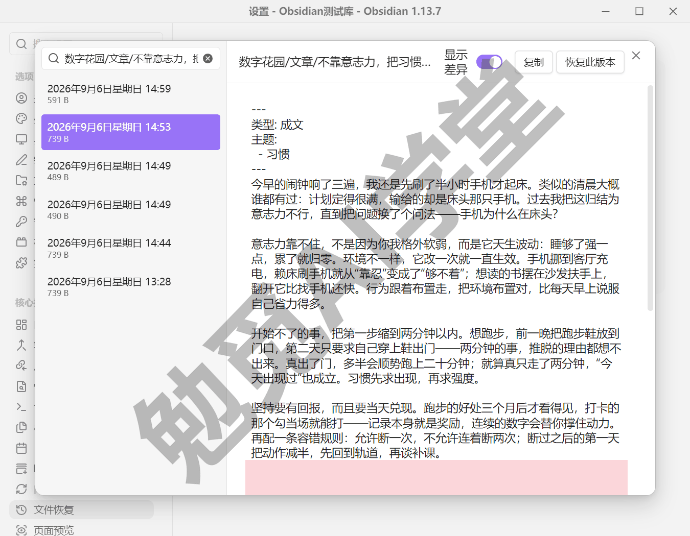
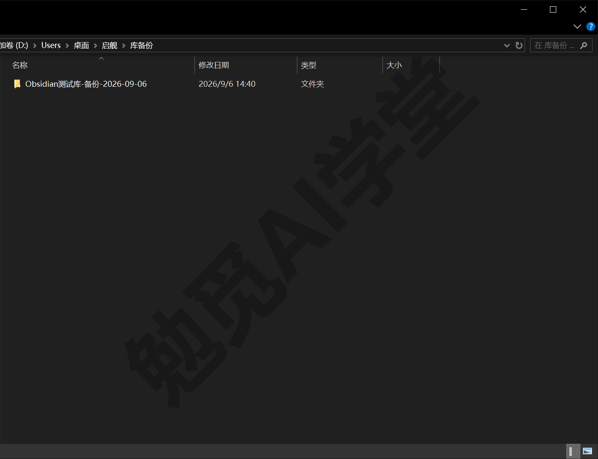

## 同步与备份全解

写笔记的人迟早要面对三类事故：手机上改的内容，电脑上没有；误删一篇，隔几天才发现；改坏一个段落，想回到昨天的版本。这一篇就是来提前解决这三类事故的：同步在三条路里选定一条，给备份订一套自己的规矩，再学会处理同步过程中最常见的事故——冲突。

《认识与装好》讲三大理念时交代过，Obsidian 不是全托管服务，官方不替你保管笔记，备份和同步要自己安排——这一篇就是当时许诺的安排方案。

### 11.1 同步不等于备份

**先分清两个词**——很多人把“同步”当成“备份”，出了事才发现是两码事。官方帮助里专门有一节就叫“同步不是备份”，两者的分工可以一句话说清：

- **同步**：让你的库在所有设备上保持一致。任何一端的改动都会传到其他端，双向、持续进行，设备之间没有主次之分。
- **备份**：把库单向复制一份，存到另一个地方。它不追求实时，追求的是出事之后能回得去。

对号入座一下开头的三类事故：手机上改的电脑上没有，缺同步；误删几天后才发现，缺备份；改坏一段想回到昨天，缺的是更细的备份——按时间点留存的版本，11.6 的快照管的就是这件事。三类事故没有一类能靠“下次小心”避免，只能靠机制。

**同步会原样同步你的误删**——这是两者最关键的差别，值得单独讲透。你在手机上误删一篇笔记，同步服务会照常把“删除”这个动作传到电脑，几秒钟后两端都没了这篇。改坏了也一样：坏版本会覆盖所有设备上的好版本。同步服务通常带一点补救能力——网盘有回收站，官方 Sync 有版本历史——能救回一部分，但保留时间和覆盖范围都有限，它们不是为备份设计的。官方的建议很明确：同步归同步，备份单独做。

**回收站和版本历史为什么不算备份**——有读者会想：网盘有回收站，官方 Sync 有版本历史，删错了不是能找回来吗？能找回一部分，但它们只是一层有限的缓冲：保留时间有限，过了窗口期就真没了；覆盖范围有限，未必包住所有文件类型和所有操作；规则也不由你定，服务商随时可能调整。以回收站为例：多数网盘只保留最近一段时间的删除记录，而且常常救不回“被覆盖的旧版本”——你需要的偏偏可能是三周前的那一版。判断标准其实很简单：单向复制到另一个地方、想回溯时一定回得去的，才算备份——这两条，回收站和版本历史都满足不了。

**责任为什么在你**——《认识与装好》讲“数据完全自有”时说过另一面：控制权归你，备份这类责任也随之归你。在线笔记的厂商替用户兜底，代价是数据在它手里；Obsidian 把数据完整交给你，也就没有谁替你留后手。好消息是，这份责任安排起来并不重：同步配一次能用很久，备份定好纪律后每周只花几分钟。

只有同步没有备份，等于没有后悔药；只有备份没有同步，多台设备就会各写各的。两个都要，分头解决：11.2 到 11.4 把同步三条路讲清、帮你选一条，11.5 处理同步过程中最常见的冲突，11.6 教你订一套备份规矩。只有一台电脑的读者也别跳过这一篇：同步可以等有第二台设备再配，备份等不得，11.6 单独就能用。

### 11.2 官方 Sync：最省心的付费路

**它是什么**——Obsidian Sync 是官方的增值同步服务。《认识与装好》讲费用时提过，官方只收 Sync 与 Publish 两项增值服务的钱，其中 Sync 管的就是多端一致。机制上，订阅后你会创建一个“远程库”——存放在官方服务器上的加密副本，你的每台设备都和它同步：本端的改动上传给它，其他端从它下载。要紧的是，每台设备本地始终保留完整的一份，断网照常读写，联网后自动补传——本地优先的底子没有变。

**要点**——默认端到端加密，数据离开你的设备前就已加密，官方团队也读不了——代价是**加密密码只存在你手里，忘了官方无法找回**，订阅当天就把它存进密码管理器；套餐档位的差别体现在远程库存储空间、单个文件大小上限、版本历史保留时长三个维度，具体数值以官网当前页面为准；它还附带按文件类型的选择性同步和笔记版本历史——后者够救急，但按 11.1 的分工，仍替代不了备份。

**适合谁、本课怎么处理**——预算充足、多端重度使用、不想维护网盘纪律的读者，它是配置最少、坑最少的一条路。将来想开通时照这个顺序走即可：

1. 打开设置，在核心插件区找到“同步”（Sync）页——现在就可以去看一眼，登录与订阅入口都在这一页，不订阅也不碍任何事；
2. 订阅后创建远程库，加密方式保持默认的端到端，当场把加密密码存进密码管理器；
3. 第二台设备登录同一账号、连接同一个远程库，输入加密密码，等首次拉取完成。

本课零成本主线不订阅它，也就不做逐屏演示（各步界面以官方帮助为准）；下一节的网盘路线才是本课主讲的路线。哪天你的需求升级了，随时可以从网盘路换过来——怎么换、要注意什么，11.4 一并交代。

### 11.3 网盘同步：零成本主路线

**先把欠的解释补上**——《认识与装好》建库时提醒过：先别把库放进网盘正在实时同步的目录，因为两套软件同时读写同一批文件可能出冲突。当时说原因这一篇讲，现在补上：网盘不是不能用，而是要按一套规矩来用。库就是一个普通文件夹，把它放进网盘的同步目录，网盘就会把它带到你的每台电脑——这条路不花钱，正是本课程零成本主线选的路。

下面以 OneDrive 为例走一遍（Windows 自带、不用另装）；坚果云等其他网盘原则完全相同，只是界面各异：文件要常驻本地、等同步完再打开、尽量一次只在一端改。

**第 1 步：确认 OneDrive 可用**

Windows 一般预装了 OneDrive，用微软账号登录即可（部分精简系统可能删掉了它，去官网重新下载安装就行）。任务栏的云朵图标是它的状态窗口，后面几步都要看它——云朵有时收在任务栏的隐藏图标区里，点那个“^”箭头就能找到；点开云朵，能看到“已备份和同步”这类总状态和每个文件的上传记录。

**第 2 步：把库放进同步目录**

在 OneDrive 目录下新建一个文件夹（比如“Obsidian 库”），把整座库文件夹挪进去，然后回到 Obsidian 的库管理画面，用“打开本地仓库”重新打开新位置的库。新库直接建在这里也行——《认识与装好》当时让你避开这个位置，是因为同步的规矩还没讲；现在规矩你已经懂了，照着用就稳妥了。

**第 3 步：关掉“按需下载”，让文件常驻本地**

网盘为了省硬盘空间，默认可能只在云端存文件、本地放一个占位标记，内容等用到时才现下载。Obsidian 需要随时读写整个库，碰到这种只有占位标记的文件会读不出内容，表现得就像文件丢了——官方帮助专门提醒过这个坑。判断标准就看资源管理器的“状态”列：库文件夹必须是绿勾（本地可用），不能是蓝色云朵（仅联机占位）。让库常驻本地的做法：老一些的客户端右键库文件夹有“始终保留在此设备上”一项，勾上最省心；课程实测的新版客户端右键菜单里没有这一项，改在 OneDrive 设置的“按需文件”处控制（选项名与位置以你的客户端实机为准）。不管哪种客户端，都不要对库文件夹使用“释放空间”类功能。

**第 4 步：确认同步完成**

这一步只需看一眼：库文件夹上的状态标记变成同步完成（绿色对勾类图标，样式以客户端为准），任务栏云朵不再转圈，这一端才算就绪。

**第 5 步：第二台电脑接库**

第二台电脑登录同一账号，等 OneDrive 把库文件夹完整下载下来（同样确认状态标记走完），再用“打开本地仓库”打开它。从此两台电脑的改动互通。

**先等同步完再打开**——网盘路线最重要的一条纪律。换一台电脑之前先看两头：上一台的改动已经传完，这一台已经收完，再打开 Obsidian 动笔。最容易出事的场景是“上一台还没传完就合上电脑离开，下一台立刻开始写”——两端各有半份新改动，冲突就来了（怎么救见 11.5）。习惯上尽量一次只在一端写作，网盘路线就会非常稳当。

**.obsidian 要不要一起同步**——《库、文件与搜索》讲过，.obsidian 是库的配置文件夹，设置、插件、主题都在里面。让它跟着库一起同步，好处是几台电脑配置一致、不用配两遍；代价是它文件多、变动勤，偶发的同步冲突大多出在这里。课程建议新手整库同步（包含 .obsidian），省心优先；真被配置类冲突烦到，再考虑让各设备各用各的配置——Obsidian 支持给设备指定不同名字的配置文件夹（设置“文件与链接”页高级一栏的“切换设置文件夹”一项，文件夹名要以句点开头），属于进阶做法，知道有这个办法就行。

**两个额外的坑**——

- iCloud 盘在 Windows 上同步库，官方明确说可能造成文件重复甚至损坏，Windows 读者不要选它当同步方案；
- 一个库只交给一套同步方案。库已经在 OneDrive 里，就不要再给它开官方 Sync（反过来也一样）——两套服务同时管一个文件夹会互相冲突，这是官方点名要避免的做法。

### 11.4 Git 路线与三条路怎么选

**Git 路线，一句话了解**——Git 是程序员圈的版本管理工具，也能用来同步库：每次改动打包成一次提交，推送到远端仓库，其他设备再拉取下来。仓库里保存着每一次提交的完整历史，任何文件都能回到任何一次提交时的样子——版本这件事它做得最彻底，托管服务也有免费额度。但同步不自动：每次要手动提交、推送、拉取，出了问题还得会排查，学习成本在三条路里最高。它适合本来就会 Git 的人；社区也有插件（比如 Obsidian Git）能把提交自动化，官方备份指南提到过它，装法走《社区插件系统》讲的流程即可。本课程不为同步去教 Git：确实想走这条路的，《导入、导出与发布》的发布准备环节会把 Git 装好，进阶用法留给课程附录与后续内容。

**三条路怎么选**——用四个问题对照自己，按顺序过，多数人问到第二个就有答案了：

- **设备有几台？** 只有一台电脑，同步暂时不是刚需，先把 11.6 的备份做扎实即可；一台电脑加一部手机，三条路都能走，其中手机端接官方 Sync 最省事，网盘各有配套做法，细节都在《移动端与网页剪藏》。
- **预算多少？** 零预算走网盘，免费空间对纯文本库通常很宽裕；愿意为省心付费的，官方 Sync 配置最少、坑最少。
- **笔记有多敏感？** 网盘路线下，笔记以普通文件存在网盘服务器上，网盘自身怎么加密不由你掌控；想做到“除了我谁也读不了”，选官方 Sync 并用默认的端到端加密——日记、工作机密这类内容要认真过这一问。
- **动手能力如何？** 嫌配置麻烦选官方 Sync；愿意按 11.3 的五步纪律操作，网盘足够可靠；本来就会 Git 的人可以考虑 Git 路线。拿不准的就先按省事的选——方案随时能换，迟迟不配同步才是真损失。

一句结论：多数读者从网盘路线起步，零成本、够用；对隐私或省心有更高要求时，再升级官方 Sync。这个选择也不终身制——三条路底下都是同一个文件夹，想换路，把库从一个方案里解绑、接进另一个就行，唯一要记得的是先退干净旧方案，避免两套服务同时在管。

还有一个常见疑问：三条路能不能混着用？同一个库的“同步”只能交给一套方案，这条红线不能碰；但“同步”和“备份”可以分家——比如同步走 OneDrive，备份定期复制到坚果云或移动硬盘。两边一个管实时一致、一个管定期留档，互不干扰，反而正是 11.6 提倡的形态。

这篇文章的实操内容不需要花钱：主线只用免费能力；选官方 Sync 属于自选付费项，本篇只讲机制不讲价格。

### 11.5 同步冲突的现场与恢复

**冲突怎么产生**——两台设备在彼此同步之前，改了同一篇笔记，同步服务就没法简单决定以谁为准，这就是冲突。离线用得越多、两次同步隔得越久，越容易撞上。高发场景就藏在日常里：断网写作攒了一堆改动、两台电脑都开着 Obsidian 挂在后台、手机上改完随手锁屏没等同步跑完。预防的办法 11.3 已经定过规矩——先等同步完再打开、尽量一次只在一端写，做到这两条，冲突就会很少出现。但它终究不是故障，而是多端写作的正常代价——提前见过、会处理，就不可怕。

**各方案怎么应对**——

- **官方 Sync**：对 md 笔记默认自动合并（默认策略需实机验证），把两端的改动并进同一份、尽量都保留。多数时候结果是对的，偶尔会出现重复的句子或错位的格式，需要你通读顺一遍。不放心自动合并的，Sync 设置里可以改成发现冲突就生成副本文件、交给你人工处理（选项名称需实机验证；这项设置每台设备要各配一次）。副本按官方文档给出的模式命名，形如 `笔记名 (Conflicted copy 设备名 时间戳).md`（具体格式需实机验证）。
- **网盘**：一般不替你合并，而是把两版都留下——一版占着原文件名，另一版被改名成带设备名或“冲突”字样的副本，具体命名各家网盘不同，以实际生成的文件为准。

**现场演示一次**——冲突值得亲手制造一次，免得真遇上时手忙脚乱：

1. 挑一篇测试笔记，让两台设备都先断网（或暂停同步）；
2. 电脑上在开头加一句话，另一台设备在结尾加一句话；
3. 恢复联网，等同步跑完再看结果。官方 Sync 默认设置下，两句话通常都进了同一篇；网盘路线下，文件列表里会多出一个冲突副本。

**手工合并三步**——见到冲突副本，照着做：

- **对比两版**：把原文件和副本左右分屏对照（分屏操作《界面与设置全导览》讲过），找出各自独有的改动在哪几处；
- **并成一版**：以内容更全的一版为基准，把另一版独有的段落搬进来，通读一遍，确认没丢句、没重复；
- **删除副本**：确认合并版无误后，删掉冲突副本。副本留着不删，以后搜索和链接补全都会冒出两个同名选项，早晚引起误会。

还有一个官方文档专门提到的特例值得知道：刚创建的笔记，如果几分钟内从另一端同步来了同名的一篇，Sync 会直接保留远端那份、不做合并。最容易出现这种情况的，是自动生成笔记的工作流——比如《日记、模板与每日工作流》配好的日记，两台设备先后启动、各自生成了今天这篇。真遇到本地那份被覆盖，也不用慌：11.6 的文件恢复快照里能找回来。

整个过程不用紧张：只要 11.6 的快照和备份在，就算合并合坏了，也随时回得去。

### 11.6 备份纪律与快照恢复

**文件恢复插件：自动快照**——Obsidian 内置了一份保险：文件恢复核心插件（《界面与设置全导览》的核心插件总览地图里给它留过位置），开启后按固定间隔给改动过的笔记存快照，误删、改坏了都能回到之前的版本。设置左栏找到“文件恢复”页，两个数值都在这里调：“快照生成间隔”按分钟设（默认 5 分钟），“快照保存时长”按天设（默认 7 天）。

**从快照里找回内容**——恢复入口也在这一页：“快照”一栏点“查看”，弹出“文件恢复”窗口，在搜索框输入文件名、从建议列表里选中目标文件，左侧列出各时间点的快照（带大小），右侧预览选中版本的全文，“显示差异”开关可以对照两版改动；想整篇恢复就点“恢复此版本”，只想取回一段就用“复制”把内容拷出来、自己贴回笔记。

**快照的四条边界**——文件恢复很好用，但官方把话说得很清楚，它不是完整的备份方案。用之前记牢它的边界：

- 只保护 .md 笔记和 .canvas 画布，图片、PDF 这类附件不在保护范围里；
- 快照存在库外的程序全局数据里，并且按库的完整路径记录——把库挪了位置，旧快照可能就对不上号了；
- 快照不随任何同步方案走，每台设备各存各的——换了新电脑，旧电脑上的快照不会跟过来；
- 保留有天数上限，过期的快照会被自动清掉，别指望它替你留住上个月的版本。

顺带认识设置页里的另一个按钮：“删除快照”一栏的“删除”，说明文字就一句“删除所有快照。”——它会把这座库的全部快照一次性删光、不可恢复，一般只在快照占用空间异常时才用得上，点之前想清楚。快照和 11.2 提过的 Sync 版本历史也互不冲突：一个存在本机、一个存在远程库，订阅了 Sync 的读者两道保险可以叠着用。

**整库备份：最朴素也最可靠**——《认识与装好》说过，库就是一个普通文件夹，整个复制出去就是一次完整备份。这一节把它升格成纪律，两个时点必做：

- **定期做**：给自己定个节奏（比如每周一次），把库文件夹复制到另一个位置——外置硬盘、U 盘，或另一个网盘的非同步目录都行。关键在“另一个地方”：备份必须和正在同步的那份分开存放，否则一损俱损；
- **重大操作前做**：批量改名、批量打标签、大迁移，以及以后让 AI 整库操作之前，先复制一份。真做坏了，就用备份把整个库换回来，损失的只是这一小段时间的改动。

再补一条容易被省略的动作：备份做完抽查一次，随手打开备份文件夹里的一两篇笔记，确认内容完好——坏掉的备份比没有备份更误事：它会让你误以为数据有保障，其实没有。

备份份数不必贪多，能持续执行才是好方案。到这里三层保护已经齐了：快照管日常的小失误，整库备份管大事故，同步管多端一致——各管一段，你的库就很难真正丢东西。

### 11.7 三个练习任务

**任务一：选路并配好同步**

按 11.4 的四个问题选定你的方案并完成配置：走网盘的，按 11.3 的五步走完；订阅官方 Sync 的，创建远程库并让两端连接。

完成标准：在第二台设备（或手机，接库细节见《移动端与网页剪藏》）能看到你在第一台上刚改的那篇笔记。

**任务二：制造并处理一次冲突**

按 11.5 的三步现场演示，两端离线各改同一篇笔记，联网让冲突发生，然后完成对比、合并、清理。

完成标准：合并后的笔记里两处改动都在，文件列表里没有残留的冲突副本。

**任务三：备份并演练恢复**

先做一次整库备份（复制到另一个位置）；再故意删掉某篇笔记里的一段文字，从文件恢复插件的快照里把它找回来。

完成标准：备份文件夹已存放在另一个位置，并抽查打开过其中一篇笔记；删掉的那段文字已从快照恢复回原笔记。

### 11.8 本篇小结与自检

这一篇把数据安全的两件事都安排好了：同步保证多端一致，备份保证出事后回得去，两个都要。最需要记住的是：**同步方案按设备数、预算和敏感度来选；重大操作前先整库备份；冲突并不可怕，可怕的是只有同步、没有备份。**

可以对照下面的清单检查学习结果：

- [ ] 能说出同步和备份分别解决什么问题
- [ ] 已配置好自己的同步方案，并在两端验证过
- [ ] 处理过一次同步冲突（真实的或演练的）
- [ ] 文件恢复插件已开启，知道快照间隔在哪调
- [ ] 养成了重大操作前先备份的习惯

完成这些内容后，你的库已经多端可用、坏了能救。下一篇《移动端与网页剪藏》把 Obsidian 装进手机，再学会把网页剪成笔记。

### 11.9 新手常见问题

**Q1：零成本方案真的够用吗？**

够用。纯文本笔记体积很小，网盘的免费空间通常绰绰有余，附件攒多了才需要留意容量；备份这一侧，文件恢复插件加定期整库复制就能补齐。官方 Sync 买到的主要是省心和端到端加密，不是必需能力——按 11.4 的四个问题对照，真出现更高要求时再升级不迟。

**Q2：端到端加密的密码忘了怎么办？**

找不回来，官方也不行——这正是端到端加密的含义：密钥只在你手里。后果是远程库作废，但每台设备本地的数据都还完整。补救步骤：先给本地库做一次备份，然后在每台设备上断开旧远程库，新建一个远程库、重新逐台连接。教训只有一条：订阅当天就把加密密码存进密码管理器。

**Q3：手机上怎么同步？**

先在本篇把方案选定：官方 Sync 在手机上登录同一账号、连接同一个远程库即可；网盘路线在手机上另有配套做法和几个坑。具体操作统一放在《移动端与网页剪藏》，那一篇会接着你今天的选择往下配。

**Q4：同步很慢或一直转圈怎么办？**

先分清“慢”和“卡住”。初次同步、附件多的时候慢属正常，看状态图标确认它还在动，就多等一会儿。真卡住的，按顺序查：网络是否正常；网盘是不是又开启了按需下载——11.3 第 3 步关掉的那项设置，有时会被客户端更新悄悄改回去；是不是给同一个库同时开了两套同步服务——必须退掉一套；官方 Sync 用户点开同步日志，看卡在哪个文件上。多数“一直转圈”出在大附件或两套服务冲突。
