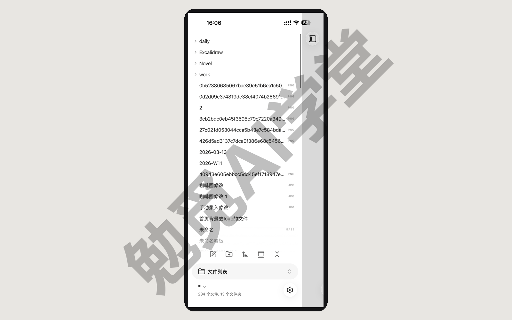
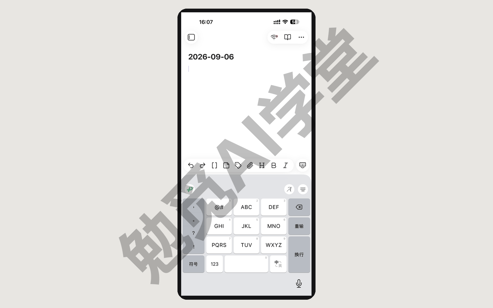
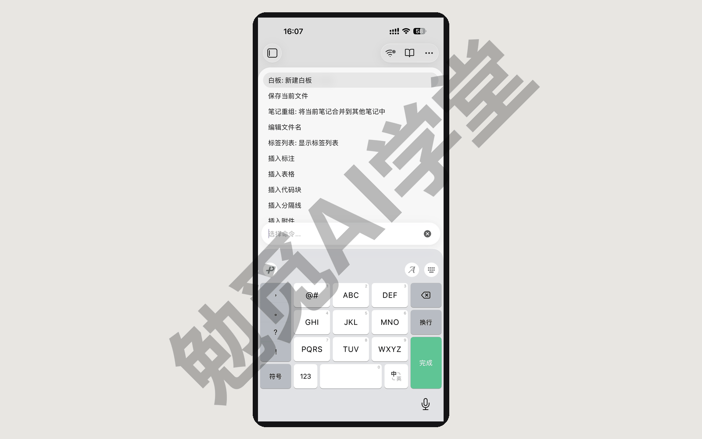
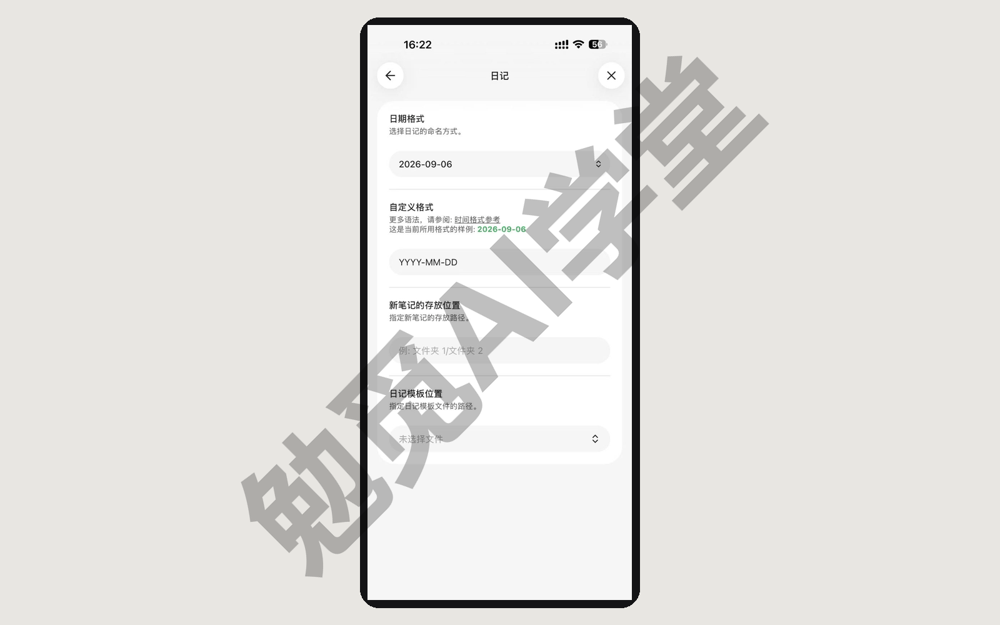
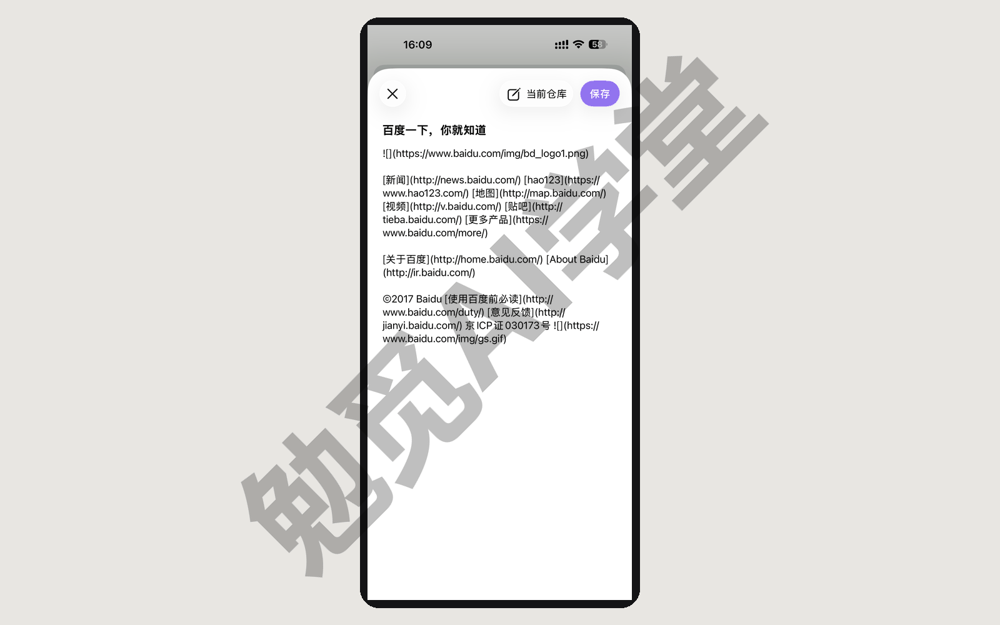
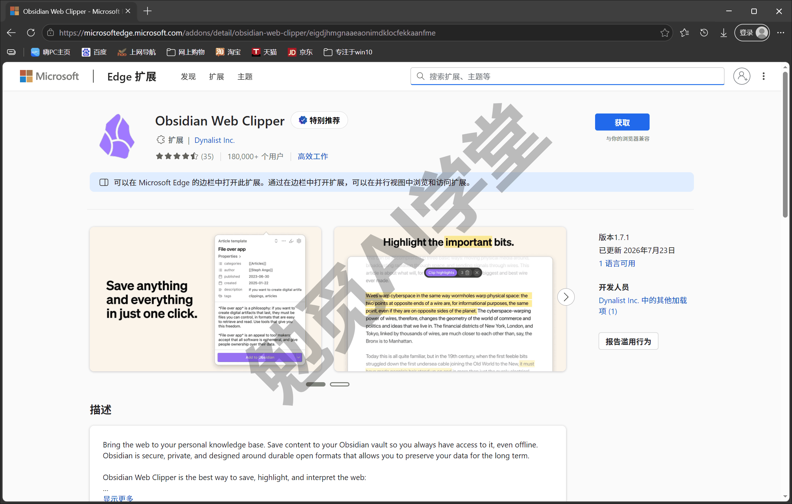
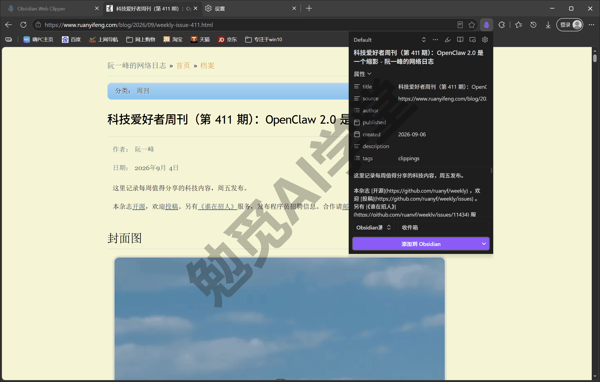
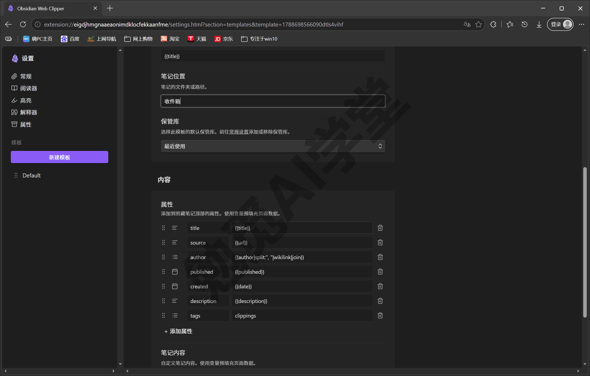
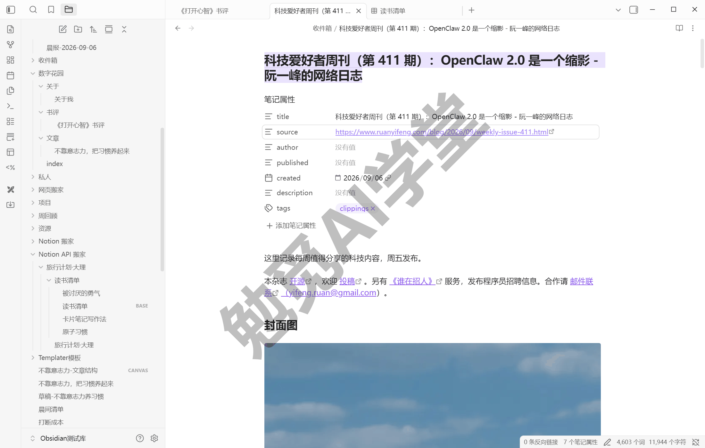
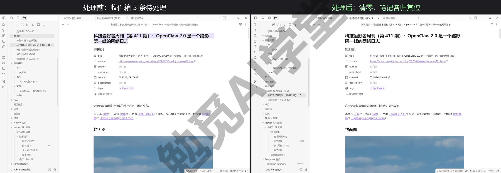

## 移动端与网页剪藏

到上一篇为止，你的库已经能写、能连、会自己汇总，坏了也能救。这一篇把它带出书房：先接通手机，认识移动端的界面差异，练熟“随手一记”的最短路径；再装上官方的 Web Clipper 扩展，学会“剪藏”——把浏览器里正在看的网页剪存下来，变成一篇 md 笔记收进库。读完这一篇，你的记录就不再受设备限制——手机上闪过的念头、浏览器里读到的好文章，都能顺手进库。

### 12.1 移动端安装与库接通

先把前提说清楚：手机端好不好用，很大程度取决于同步。《同步与备份全解》已经把同步三条路——官方 Sync、网盘、Git——讲清楚，并让你选定了自己的方案；这一篇不再重复怎么选，直接在你选定的方案上把手机接进来。还没配同步的读者，先回那一篇把方案定了再来。

**装应用**。Obsidian 移动端在 iPhone、iPad 和安卓手机上都有官方应用：苹果设备从 App Store 安装，安卓设备从 Google Play 或官网提供的 APK 安装包安装（官方说明支持 Android 5.1 及以上）。应用本体免费，与桌面端一致。

**安卓：先做对存储位置这一步**。安卓版首次启动会让你选库数据存在哪，这一步直接决定网盘方案能不能配套，按官方帮助把两个选项说清（选项名称以实机为准）：

- **设备存储**（官方推荐）：库存放在设备的共享存储区，其他应用和第三方同步工具都能访问它，卸载 Obsidian 也不会删掉笔记。代价是要向系统申请“所有文件”访问权限——官方解释这是文件管理类应用的正常要求，权限只用于访问你自己的数据；
- **应用内存储**：库锁在 Obsidian 的私有沙盒（应用自己的隔离存储区）里，隔离性更好，但共享存储类的同步工具就访问不到它了，而且官方明确警告：用这个选项时卸载应用会连库一起删掉。

走网盘同步路线的安卓用户选设备存储，授予权限；这样第三方同步工具才能把电脑上的库文件夹同步进手机。这个选择画面只在安卓首次启动时出现一次，两个选项的名称与描述以你安装时的实机界面为准。

**三种方案各自怎么接库**：

- **官方 Sync 用户**：手机上装好应用后登录你的 Obsidian 账号，进入同步设置，连接你在《同步与备份全解》里建好的远程库，选一个本地存放位置，等它把内容拉取完（入口与流程细节以实机界面为准）。这是三条路里手机端最省事的一条；
- **网盘用户（安卓）**：网盘方案在手机上需要一个配套动作——把网盘里的库文件夹双向同步到手机本地。官方帮助在 OneDrive 一节明确提到它在安卓上的直接支持有限，建议借助 FolderSync 这类文件夹同步工具（能否顺畅同步因网盘而异，以你所用网盘的安卓端能力为准）。同步下来之后，在 Obsidian 的库管理里用“打开文件夹作为仓库”一类入口指向那个文件夹（手机端按钮名以实机为准；桌面端同款动作就是《同步与备份全解》用过的“打开本地仓库”）；
- **iPhone 用户**：官方给 iOS 推荐的同步只有两条——官方 Sync 和 iCloud。用 iCloud 的话要留意官方特别强调的文件夹位置：库必须放在“iCloud 云盘 → Obsidian”这个带应用图标的文件夹里（在系统“文件”应用里能核对），放错位置会出同步问题。OneDrive、Google Drive 这类网盘官方明说不支持 iOS 端的库同步；同时官方也提示 iCloud 云盘在 Windows 电脑上有文件重复或损坏的风险。所以电脑在 Windows 上走网盘方案、手机又是 iPhone 的读者，最稳的组合是改用官方 Sync；社区里另有插件方案，但不在官方推荐之列，本课不展开。

**首次打开与互通验证**。库第一次在手机上打开时，应用要为全部笔记建立索引，笔记多的话会等一小会儿（进度提示以实际界面为准）。接下来做一次两端互通验证：在电脑上新建一篇笔记、写一句话，等同步完成后在手机上找到它；再反向改一个字传回来。两个方向都通了，手机端才算真正接好。

最后一条纪律从《同步与备份全解》带过来：同步还没完成之前，不要在两端同时改同一篇笔记——那正是同步冲突最常见的起因。

### 12.2 手机端界面差异与高频操作

手机版和桌面版是同一套软件，库、双链、标签、属性这些东西完全一致；不一样的是交互——屏幕小了，鼠标没了，几个桌面端按钮换了位置。这一节把差异一次认全，之后你在手机上就不会迷路。

**底部的移动端工具栏**。编辑笔记时，键盘上方会出现一排图标，这是移动端独有的工具栏：加粗、插入链接、打标签这类高频编辑动作都排在上面，图标多的时候左右滑动能看到更多（默认有哪些以实机为准）。它可以自定义：按官方帮助，设置里的移动端分组下有“管理工具栏选项”，可以增删和调整顺序，还能把任意全局命令（比如切换深浅色）加进工具栏（分组与选项名称以实机界面为准）。

**导航栏与“功能区去哪了”**。不在编辑状态时，屏幕底部是导航栏：前进后退、新建或查找笔记、页签数量、打开菜单几个入口一字排开（入口构成以实机为准）。桌面端最左侧那条功能区竖条在手机上没有，原先功能区里的按钮收进了导航栏最右的菜单里——找不到某个桌面端按钮时，先去那里翻。左右侧边栏也还在，从屏幕边缘滑动或用菜单呼出（手势细节以实机为准）。编辑中想从工具栏回到导航栏，官方给工具栏配了收起键盘的选项，点一下键盘落下、导航栏回来。

**命令面板怎么呼出**。桌面端“记不住入口就搜命令面板”的习惯，手机上照样成立，而且官方给了一个专属手势：从应用顶部往下拉——类似社交应用的下拉刷新——默认动作就是打开命令面板。这个下拉动作在官方帮助里叫 Quick Action（中文界面的叫法以实机为准），可以在设置里换成你想要的任何命令，12.3 会用到这个可定制的特性。命令面板打开后的用法与桌面端一致，搜名字、回车执行。

**编辑操作的差异**。手机上没有悬停和右键，对应的操作一般换成了长按：长按笔记名出菜单，长按链接看预览（具体交互以实机为准）。打字本身没有新东西，Markdown 写法、双链补全和桌面端一模一样。

**插件在移动端**。手机端同样支持社区插件，安装路径与桌面一致：设置里关闭受限模式、浏览安装启用——《社区插件系统》定下的规矩原样适用：按需安装、装完启用、出问题二分排查。两点移动端特有的注意：

- 不是所有插件都支持手机：插件市场的每个插件页都标注了支持桌面端还是桌面加移动端，装之前看一眼（以插件页与实机为准）；
- 手机的性能和电量比电脑更有限，插件装得越多、越重，启动越慢也越耗电。移动端只装真正会在手机上用到的几款，用不到的关掉——库若同步了配置文件夹，电脑端装的插件会跟着过来，手机上可以只保留必要的（配置同步的取舍《同步与备份全解》讲过：设备间差异大的，配置可以不同步）。

### 12.3 快速捕捉：手机闪念的最短路径

手机端的定位想清楚了，用起来才顺：屏幕小、时间碎，手机不适合大段写作和整理，最适合干一件事——捕捉。念头闪过的那几秒钟里，打开、记下、放下，动作越短越好。这一节要做的，就是把“从想到记”中间的每一步都变得更短。

**第一段：打开就是可写的页面**。《日记、模板与每日工作流》配好的日记流在手机上原样生效。先交代一个和老教程不一样的实况：当前版本手机端“日记”插件的设置页里只有日期格式、自定义格式、新笔记的存放位置、日记模板位置四项，**没有单独的“启动时打开今天的日记”开关**——这项能力和桌面端一样收进了核心设置：把“默认打开文件”选为“日记”（桌面端在设置的“文件与链接”分组，《日记、模板与每日工作流》订正过同一处；手机端该项的位置以实机界面为准），每次打开应用就直接落在今天的日记上，晨间模板照常套用——那一篇把日记定位成每天自动铺开的“工作台面”，这个定位从此在手机上也成立。闪念不想进日记的话，还有上一节认识的快速操作：把下拉手势设成“新建笔记”，从打开应用到开始打字只隔一个下拉。

**第二段：不打开应用也能记**。系统层面还有更短的办法。iPhone 和安卓都支持 Obsidian 小组件：按官方帮助，iOS 可以在锁屏、主屏和控制中心放置“新建笔记”“打开今日日记”“搜索”等小组件（需 iOS 18 及以上）；安卓有同类的桌面小组件，还能在下拉快速设置里加 Obsidian 磁贴、长按应用图标调出快捷方式（各自的配置入口以实机为准）。把“新建笔记”或“今日日记”放到锁屏或桌面上，捕捉就从解锁那一刻开始。iPhone 用户另有一件利器：官方提供的快捷指令动作里有“追加到今日日记”，可以不打开 Obsidian、在后台把一段文字写进日记，还能通过 Siri 用语音触发（快捷指令清单以实机为准）。

**第三段：从别的应用直接分享进库**。看到一篇好文章、一条有用的帖子，不必复制粘贴。iOS 上这件事在 1.13 版本有了正式方案——Share Sheet 分享入库（需 iOS 或 iPadOS 18 及以上、Obsidian 1.13 及以上）：在任意应用里点系统分享按钮，选 Obsidian，挑一个“位置”，预览一眼抓到的内容，保存。官方帮助里“位置”（Location）可以配置五种去处：新建笔记、追加进今日日记、追加进某篇书签笔记、写入指定笔记、把链接存成书签；每个位置还能挂模板、选择抓取全文还是只存网址——分享一篇网页文章时，标题、作者、来源、日期都能靠模板占位符自动填好（主流程：抓到的网页会转成 Markdown，顶部选仓库后一键保存；“位置”五种去处与挂模板的配置细节以官方帮助与实机为准）。安卓这边：官方帮助与更新日志目前没有对应 Share Sheet 能力的记载，大概率仍是系统分享菜单的基础捕捉，具体形态需实机验证；安卓读者退一步：先复制内容，再用小组件新建笔记粘贴进去，同样够快。

**闪念也可以有格式**。快速不等于潦草：新建笔记的路径可以配模板（《日记、模板与每日工作流》讲过模板插件的用法），iOS 的分享位置也能挂模板，闪念进来时自动带上日期、来源这些骨架。不过别在手机上追求完美格式——记下来是第一位的，整理是电脑端的事，这个分工在 12.5 展开。

### 12.4 Web Clipper 网页剪藏

再解决另一半输入：网页。你大概也有一个越攒越没把握读完的收藏夹——收藏这个动作太容易，容易到代替了阅读本身，等真要用的时候，不是找不到，就是原页面已经删了、改了、加了付费墙。官方 Web Clipper 扩展解决的就是这个问题：把网页内容当场剪成 md 笔记存进你的库，从“存了个链接”变成“存下了内容本身”。剪下来的笔记和你手写的没有任何区别——纯文本、可搜索、可打标签属性，原网页哪天消失都不影响你手里这份。

**装上它**。Web Clipper 是免费的浏览器扩展，官方在 Chrome 应用店、Firefox 附加组件、Safari 扩展、Edge 加载项四个官方商店都有上架，Chrome 内核的浏览器（Edge、Brave 等）都能用（商店名目以官方页面为准）。有一个小坑提前说：装好后图标不一定直接出现在工具栏上——Edge 里装完工具栏就没动静，要点右上角的拼图形“扩展”按钮打开浮窗，在 Obsidian Web Clipper 那一行点图钉，紫色宝石图标才会固定到工具栏。第一次使用前，进扩展的设置把你的库名添加进去（界面里库叫“保管库”），剪藏时才能选到要送进的库。隐私上可以放心：官方说明剪藏内容只保存到你本地的库，不收集数据，扩展代码开源可查。

**剪一篇试试**。打开任意一篇文章页，点工具栏的 Obsidian 图标，会弹出剪藏面板。官方给这个动作配了默认快捷键 `Ctrl+Shift+O`，但在 Edge 里它和浏览器自带的收藏夹快捷键冲突，按下去弹的是收藏夹——遇到这种冲突就直接点图标，或者到浏览器的扩展快捷键设置页换一组键。面板分四块：顶部是模板选择器和一排小按钮（高亮、阅读视图、设置等）；属性区，显示从页面提取出来、将要存为笔记属性的元数据；正文区，预览将要保存的内容；底部选保管库、选文件夹，以及最重要的“添加到 Obsidian”按钮。看一眼预览没问题，点添加，浏览器会唤起 Obsidian 在目标库里生成这篇笔记。首次剪藏浏览器会弹一个授权框——Edge 的原话是“此站点正在尝试打开 Obsidian。”，点“打开”放行即可，勾上“始终允许”下次就不再问。

**剪什么进来，你说了算**。默认情况下 Web Clipper 会智能提取页面的正文主体，自动排除导航、广告、评论这些杂项——多数文章页用默认就够。官方机制里还有几种取法，按需换用：

- **只剪一段**：先在页面上选中想要的文字再打开剪藏，面板会以你的选区为准——官方还提示可以 `Ctrl+A` 全选整页，让选区覆盖全部内容；
- **只剪重点**：顶部的高亮按钮（默认快捷键 `Alt+Shift+H`）打开后，在页面上划出一段段重点，保存时就只收这些高亮；
- **整页原样**：模板变量里有整页未处理 HTML 的选项，留给确有需要的场景，认识即可；
- **先读干净再剪**：阅读视图按钮把当前页切成无干扰的简化阅读版式，读完顺手再剪。注意这个功能默认没有绑快捷键（扩展快捷键页里“切换阅读视图”一栏是空的），要用键盘触发得自己配一组。

高亮和阅读视图这两个按钮都在剪藏面板顶部那排小图标里；整页 HTML 是模板变量层面的选项。

**属性映射：剪藏笔记自动带上元数据**。剪藏面板的属性区不是摆设——《标签与属性》定过的规则是“要排序筛选的数据进属性”，Web Clipper 把这件事自动化了：按官方帮助，模板变量可以用在笔记名、存放路径、属性和正文里，页面的标题（`{{title}}`）、网址（`{{url}}`）、剪藏日期（`{{date}}`）、作者（`{{author}}`）、发布日期（`{{published}}`）、站点域名（`{{domain}}`）这些数据都有现成变量，配在模板的属性里就会自动填进每篇剪藏笔记。默认模板已带常用属性映射，打开模板设置就能看到：title、source、author、published、created、description、tags 七行整整齐齐，右边配着 `{{title}}`、`{{url}}`、`{{date}}` 这些变量；想调整就在这里改——还能设定剪藏行为是新建笔记、追加到某篇已有笔记，还是直接进今日日记（需日记插件开启）。属性一到位，回报立刻兑现：给剪藏笔记统一打上 `#剪藏` 标签，配合“来源网址”“剪藏日期”这些属性，《标签与属性》教的组合检索、《Bases 数据库》的表格视图全都直接可用。

**三个常见坑，提前说清**：

- **动态页剪不全**：评论区无限加载、内容靠脚本渲染的页面，智能提取可能只拿到一部分。兜底办法是先把想要的内容选中再剪（选区优先于自动提取），或者开阅读视图看提取效果再动手；
- **付费墙剪不到**：剪藏只能拿到你浏览器里实际能看到的内容，登录墙、付费墙后面的部分它拿不到——这不是故障，是边界；
- **图片会失效**：官方机制是剪藏不自动下载图片，笔记里的图片链接指向原网站——省了库空间，代价是离线看不到，原站删图就变裂图。在意图片的笔记，剪进来后在 Obsidian 里对它执行一次下载附件的命令（官方命令名为“Download attachments for current file”，中文命令名以实机为准），把图片落到本地才算真正归你。

最后从文件本身再补一句：剪下来的就是一个 .md 纯文本文件，《认识与装好》那句“十年后还打得开”对剪藏笔记同样成立。笔记里个别符号看不懂的，翻姊妹篇《Markdown 通用语法手册》的《速查表》篇，查一下就知道。

### 12.5 快速捕捉工作流一条龙

零件都到齐了：手机会捕捉，网页能进库，同步负责在两端之间传递。这一节把它们串成一条真的能天天跑的流水线，并把分工固定下来——手机管捕捉，电脑管整理。

**先定收件箱约定**。《日记、模板与每日工作流》定过的规矩在这里适用范围扩大：闪念不当场纠结归类，一律先进“收件箱”文件夹。现在给收件箱增加两个入口——手机上的快速捕捉（新建笔记的默认存放位置指向收件箱，iOS 分享位置同样指到这里）和 Web Clipper（剪藏的保存文件夹设为收件箱）。这样无论内容从哪个设备进来，都汇到同一个地方等待处理，不会散落全库。

**完整走一遍**。以一天为例：早上通勤看到一篇行业文章，手机分享进库，落进收件箱；上午想起一个选题灵感，锁屏小组件新建笔记记两行；晚上在电脑浏览器里读到一篇深度长文，Web Clipper 剪藏，属性自动填好。到这里手机的任务就结束了——不整理、不分类、不修格式。晚上或第二天坐到电脑前，先等同步完成，然后打开收件箱逐条处置：选题灵感扩写成正式笔记、挪进对应文件夹、补上标签；行业文章读完划几句重点、打上 `#剪藏` 和主题标签；没价值的当场删掉。每处理完一条就把它移出收件箱，处理到清零为止。

**多久整理一次：两条约定**。这条流水线能不能长期转，关键在节奏。给自己定两条就够：当天的闪念当天记进收件箱，不放过夜——过夜的念头基本就找不回来了；收件箱每周清空一次，正好挂在《日记、模板与每日工作流》定好的每周回顾里一起做——那一篇的回顾模板本来就有“收件箱清空”这一节，现在手机和剪藏进来的内容也归它管。做不到每天整理没关系，守住每周清零这条底线，收件箱就不会变成第二个收藏夹。

剪藏类条目多说一句。文章剪起来只要三秒，读完消化却要半小时，收件箱里最容易堆积的就是它们。处理原则从简：每周回顾时读得完的读完、划出重点打好标签，读不动的问自己一句“下周真会读吗”，犹豫就删——剪藏的成本极低，删错了重剪一次即可。等你学到可选进阶篇《Obsidian×Codex：让 AI 管理你的笔记库》，堆积的剪藏还可以交给 AI 批量整理归档，本篇先不展开。

**为什么坚持这个分工**。手机屏幕小、场景碎，在手机上整理笔记事倍功半；电脑端有全键盘、大屏幕、完整的面板和插件，整理效率是手机的好几倍。反过来，灵感不挑时间地点，电脑却不总在手边。让两端各干各的强项，这条链才既快又稳——快在捕捉的三五秒，稳在归档的每周一次。中间那段交给同步，你唯一要记住的是 12.1 那条纪律：同步还没完成，就别在两端同时改同一篇笔记。

### 12.6 三个练习任务

轮到你动手。三个任务按“接通、剪藏、跑通全流程”递进，做完这一篇的能力就都落在你自己的设备上了。

**任务一：接通手机**

在手机上装好 Obsidian，按你在《同步与备份全解》选定的方案接通自己的库，完成一次两端互通验证。

完成标准：电脑上刚建的笔记能在手机上看到，手机上的修改也能回到电脑。

**任务二：剪一篇文章**

给浏览器装上 Web Clipper 并连接你的库，找一篇内容完整的文章页剪进库里；剪之前用阅读视图确认正文提取得干净。

完成标准：剪进来的笔记里，标题、网址、剪藏日期三个属性自动填好。

**任务三：跑通一条龙**

一天之内用手机记下三条闪念（至少一条用小组件或系统分享），当天或次日在电脑端把收件箱全部归档处理。

完成标准：收件箱清零，三条闪念各有去处（成为正式笔记、并入已有笔记或删除）。

### 12.7 本篇小结与自检

这一篇把库装进了手机，并打通了网页进库的通道。最需要记住的是：**移动端的前提是同步；手机管捕捉、电脑管整理；剪藏进来的是纯文本 md，同样完全归你所有。**

可以对照下面的清单检查学习结果：

- [ ] 手机接通了库，两端改动互通
- [ ] 熟悉移动端工具栏和命令面板的呼出
- [ ] 用 Web Clipper 剪过一篇网页，并检查过属性映射
- [ ] 跑通过一次“手机闪念 → 电脑归档”
- [ ] 知道哪些插件在移动端用不了

完成这些内容后，记录不再受设备限制。下一篇《美化与工作区》把 Obsidian 调成你喜欢的样子，再把调好的布局固化成一键切换的工作区。

### 12.8 新手常见问题

**Q1：手机上怎么装插件？**

路径和电脑端一样：设置里关闭受限模式，进入社区插件市场浏览安装——《社区插件系统》定下的规矩照用：按需安装、装完记得启用。两点提醒：部分插件只支持桌面端，插件页有平台标注，装前看一眼；如果你的同步方案连配置文件夹一起同步，电脑端装的插件会跟着同步到手机，是否都要在手机上启用，按“手机上真的用得到吗”来取舍。

**Q2：剪藏进来的图片会失效吗？**

有这个可能。官方机制是剪藏不下载图片，只保留指向原网站的链接：原站图片还在就能正常显示，原站删图或你离线时就看不到。在意图片的笔记有兜底：剪进来后在 Obsidian 里对这篇笔记执行下载附件的命令（官方命令名为“Download attachments for current file”，中文命令名以实机为准），图片就会下载进库、彻底归你。

**Q3：iPad 上的体验一样吗？**

同一套应用，核心功能完全一致。iPad 屏幕大，配上侧边栏和分屏后体验更接近桌面端（界面形态以实机为准）；小组件和 Share Sheet 在 iPadOS 18 及以上同样可用，Safari 版的 Web Clipper 扩展 iPad 也能安装（以官方商店页面为准）。可以把 iPad 当作介于“捕捉端”和“整理端”之间的设备，轻度整理没问题。

**Q4：没网的时候手机能用吗？**

能。本地优先在手机上同样成立：笔记就存在设备本地，离线时照看照改，全文搜索也不受影响；你做的改动会在联网后由同步方案补传。要注意的还是那条老纪律——离线期间别在两端改同一篇笔记，否则联网后可能产生冲突副本，处理办法《同步与备份全解》讲过：对比两版手工合并，删掉冲突副本。唯一离不开网络的是 Web Clipper——它剪的对象本身就在网上，离线自然无从剪起。
