## 美化与工作区

装了插件、面板变多之后，是时候把 Obsidian 调成你的样子了。这一篇自外向里走四层：换主题定基调，Style Settings 做可视化微调，CSS 片段处理主题没覆盖的角落，再把字体与排版调舒服；最后把调好的布局保存成工作区，一键切换。

美化不是碰运气的事，这一篇的每一步都可以随时撤销，放心动手。

### 13.1 主题：一键换装

**主题是什么**。主题是社区作者做好的一整套界面样式：配色、字形、间距、圆角，装上就整体换装。它只改外观，不改数据——你的笔记还是那些 md 文件，一个字都不会动；主题随时可以换、可以卸，卸掉就回到默认样子。所以挑主题这件事没有任何风险，大胆试。

**浏览与安装**。打开设置，进入“外观”，在“主题”一项点“管理”按钮，就能看到全部社区主题的列表，带预览图——本课打开时列表显示 512 款，还有“仅限有浅色配色的主题”这类过滤开关。看中哪款，点进去选择“下载并使用”（按钮字样以实机为准），Obsidian 会安装并立即应用——本课装 Minimal 当场换装，不用重启。想回到默认主题，选择“禁用该主题”即可。

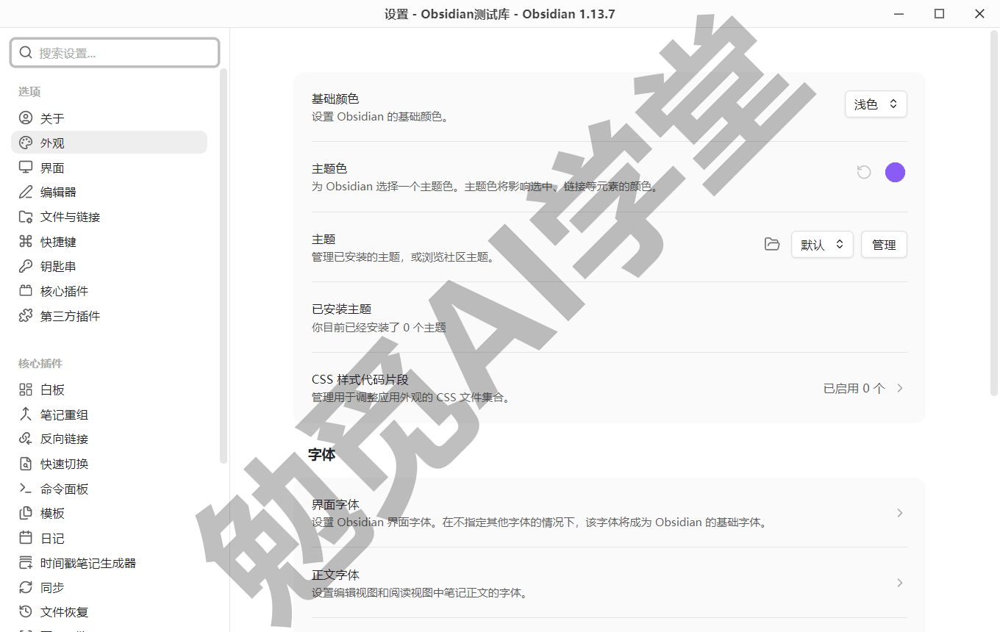

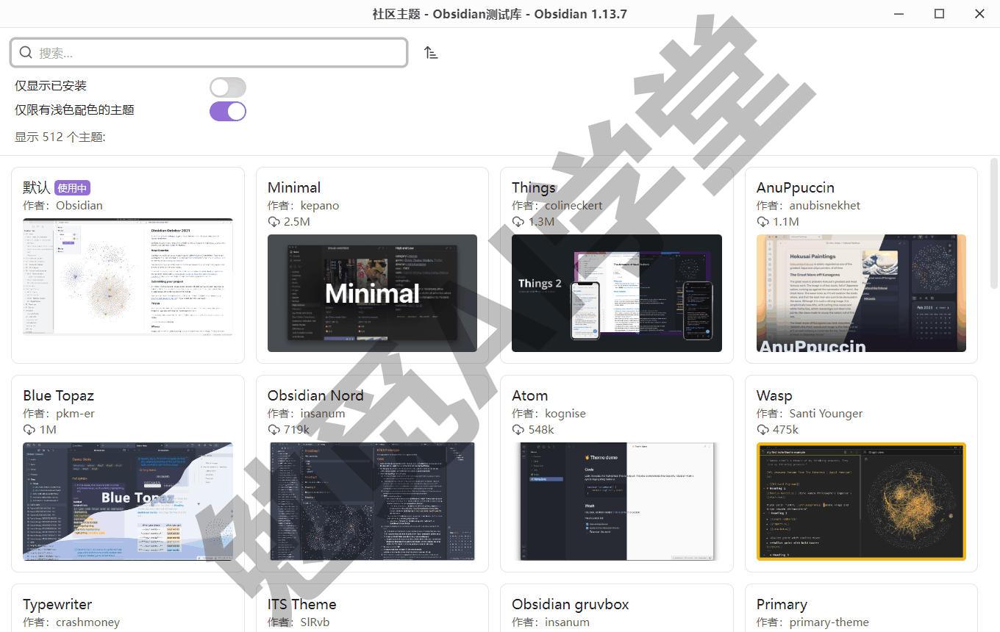

做完会看到：界面配色和字形立即变成新主题的样子，笔记内容原样不动。

**主题从哪来，怎么判断值不值得装**。主题和社区插件一样由社区作者制作、提交进官方目录，水平和维护节奏各不相同。《社区插件系统》定过的信任判断在这里同样适用——看下载量、看最近更新时间：下载量就印在列表卡片上，更新时间点进主题详情看（以实机为准）。主题只是样式、不执行代码，风险比插件小得多，但常年不更新的主题可能跟不上新版本的界面变化，挑的时候顺手看一眼。

**推荐从哪几款试起**。社区主题几百款，新手不必逐个试。两个稳妥的起点（两款都在上图的市场列表里，Minimal 下载量百万级，本课装用的正是它）：

- **Minimal**——作者是 Obsidian 官方团队成员，干净克制、维护活跃，配套的可调项也多；
- **Things**——仿 Things 待办应用的清爽风格，观感明亮舒服。

挑选时有一个通用判断：预览图看着顺眼只是第一步，装上后用自己的笔记看一天，长文、列表、代码块都过一眼再定。

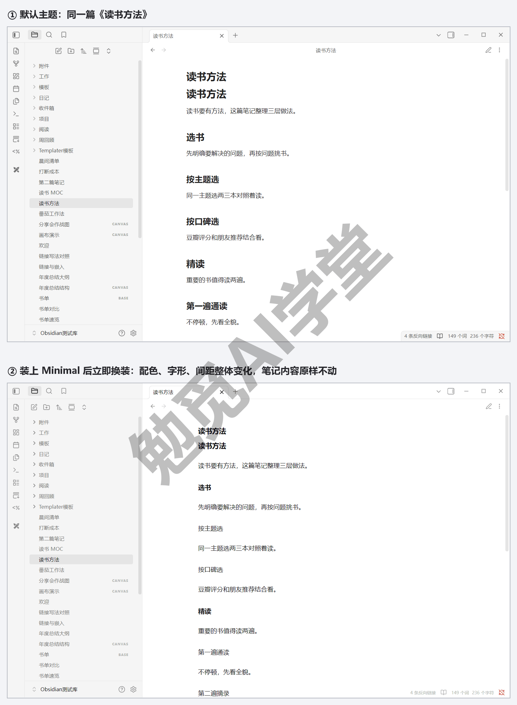

**深浅色与主题色**。主题之外，外观页还有两个更轻的开关。“基础颜色”决定深色还是浅色模式，可选“跟随系统”——白天浅色、晚上深色，跟着操作系统走；“主题色”是界面的强调色，点开颜色选择器随意换（这两项就叫“基础颜色”“主题色”，在外观页最上面两行）。它们和主题独立起效：同一款主题，深浅两个模式下往往是两种样子，都看一眼再决定留不留。偏好上没有标准答案：白天写作多的人常用浅色，夜里长时间阅读偏深色，拿不准就选跟随系统，让它跟着作息走。

**更新的规则**。主题不会自动更新。官方给的入口是外观页的“已安装主题”一栏处检查更新（检查按钮装了主题才出现，字样以实机为准），有更新时可以全部更新，也可以在管理页对单款主题单独更新。主题更新频率不高，想起来看一眼即可，不必挂心。

一句话总结：主题是零风险的整体换装，装上立即生效、随时可退；先挑一款顺眼的用起来，细节交给下一节微调。

### 13.2 Style Settings 可视化微调

**为什么需要微调**。主题是作者的审美，九成合意、一成想改是常态：强调色想换个更沉的，标题想再大一号，侧栏想更紧凑。这“一成”过去要写 CSS 才能改，Style Settings 把它变成了设置面板里的滑块和色块——不写一行代码，改完立即生效。

**它从哪来**。Style Settings 是一个社区插件，《社区插件系统》里它作为必装第一件已经装好，并做过最小演示：改一处主题样式，界面立即变化。这一节把它用起来做系统微调。还没装的读者，回那一篇按“搜索 → 安装 → 启用”三步补上再继续。顺带说明它的维护现状：这个插件的代码仓库已移交社区存档组织，版本更新停滞已久，但官方目录里它的健康度与审查评级仍然良好、用户量很大，课程维持必装的结论不变（维护状态以当前目录页为准；本篇全部微调就是用它完成的）。

**打开它的面板**。进入设置，在侧栏底部第三方插件区找到 Style Settings 的选项页。面板顶部带一条搜索框和 Import、Export 两个按钮，下面按分组折叠列出当前主题声明的全部可调项——装上 Minimal 后一长列分组当场出现（Interface colors、Accent color、Bases 等，分组名是否中文取决于主题作者有没有提供翻译，Minimal 是英文）。具体有哪些可调项，完全取决于主题作者开放了多少，Minimal 这类主题开放得就很细。

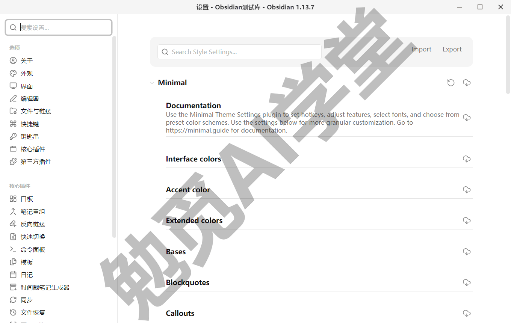

**动手改三处**。逐分组点开，找这三类试手：

- **强调色**——把主题的强调色换成自己顺眼的颜色，点色块弹出选择器，选完界面上所有用到强调色的地方一起变；
- **标题样式**——常见可调项有标题字号、粗细或颜色，改一档，正文里每级标题立即跟着变，长文的层次感马上不同；
- **侧栏密度**——行距、缩进这类紧凑度选项，屏幕小的电脑调紧一档，同屏能多看几行文件列表。

每改一处都盯一眼界面：改动是即时生效的，看到变化才算改对了地方（各项的确切名称随主题而不同，以实机为准）。

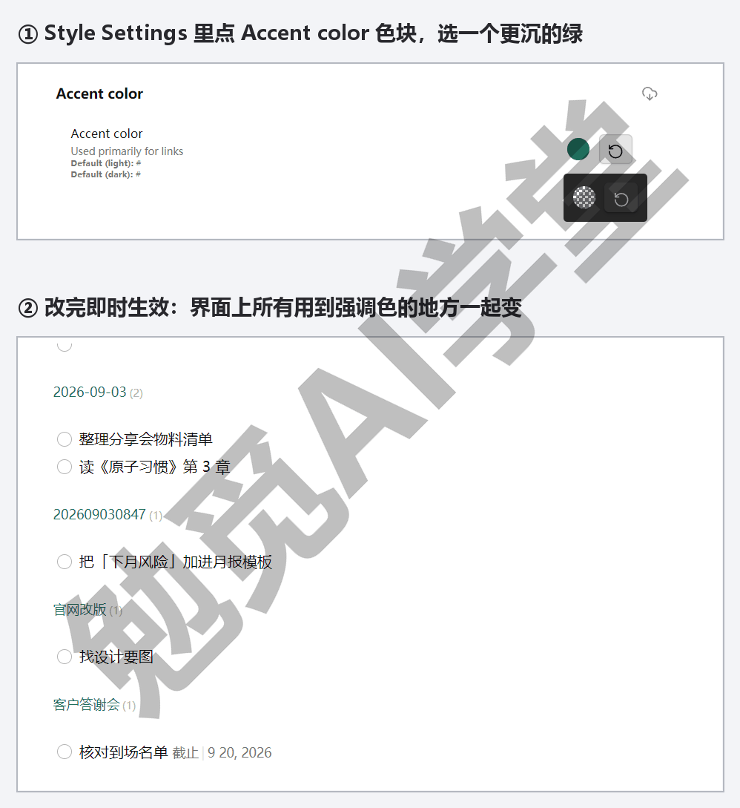

**面板是空的怎么办**。打开 Style Settings 却发现没什么可调项，往往不是插件坏了，而是当前主题没有声明可调项——面板里列什么完全由主题作者决定，默认主题就几乎不开放。遇到这种情况有两个办法：换一款开放度高的主题（Minimal 这类），或者跳过微调、直接用下一节的 CSS 片段自己动手。

**改坏了不慌**。Style Settings 的每个可调项旁边都有恢复默认的按钮，单项点一下就回到主题原样；整个分组也可以一键重置——两处都是一个回旋箭头图标，位置见下图标注。也就是说，这一节的所有改动都能撤销——大胆改，改坏了按重置，主题本身不会被你弄坏。改之前还有个省心的小习惯：先截一张当前界面的图，改多了忘记原样时有个对照。

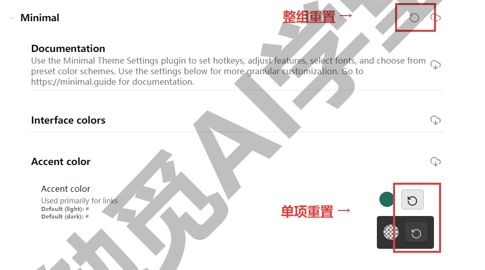

一句话总结：Style Settings 把“想改主题的那一成”变成滑块和色块，改动即时生效、单项整组都能一键重置；它能调的范围由主题决定；主题没开放的部分，下一节用 CSS 片段来补。

### 13.3 CSS 片段入门：照抄即用三段

**主题和微调都覆盖不到的地方**，就轮到 CSS 片段。CSS 是控制界面外观的样式语言——不用紧张，这一节不教你写 CSS，只给三段写好的片段照抄，你要学的动作只有两个：改数字、换颜色。

**片段放在哪、怎么启用**。桌面端流程五步：

**第 1 步：打开代码片段文件夹**

进入设置的“外观”页，滚动到“CSS 样式代码片段”一栏，点文件夹图标。做完会看到：资源管理器打开一个空文件夹——它在库的配置文件夹里，路径形如 `.obsidian\snippets`。

**第 2 步：把片段存成 .css 文件**

在这个文件夹里新建文本文件，把下面三段各存成一个文件：行距与段距.css、标题配色.css、图片圆角.css。用记事本就能建（保存时确认扩展名是 .css，不是 .css.txt）。

**第 3 步：回到 Obsidian 重新加载**

回到“CSS 样式代码片段”一栏，点刷新图标重新加载。做完会看到：三个片段出现在列表里，每个带一个独立开关（下图）。

**第 4 步：逐个打开开关**

开关打开的瞬间，界面立即套用该片段；关掉立即还原。这个独立开关就是 CSS 片段的保险丝——任何一段看着不对，关掉它即可。

**第 5 步：验证生效**

打开一篇有标题、有图片的笔记，对照下面各段说明检查效果。

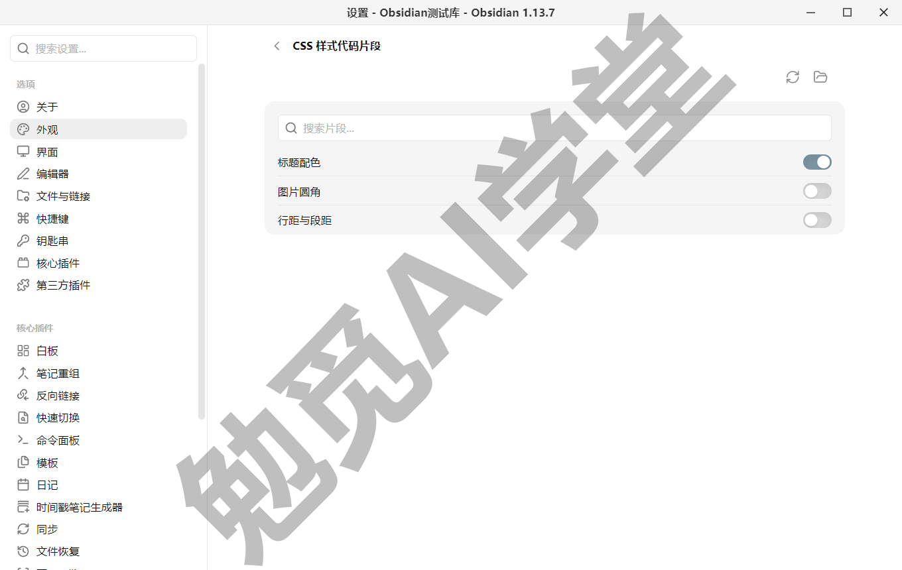

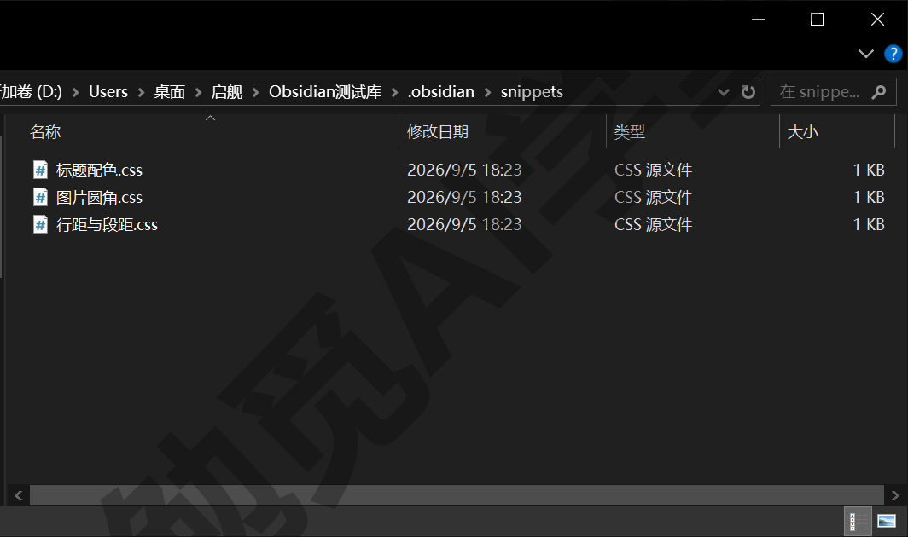

**三段片段，全文照抄**（前两段用的是官方提供的样式变量，第三段是通用写法；标题配色一段的开启效果图在本节末尾）：

第一段，行距与段距——嫌默认排版太挤或太松就调它：

```
/* 行距与段距：数字可改 */
body {
  --line-height-normal: 1.8;
  --p-spacing: 1.2em;
}
```

1.8 是行距倍数，改成 1.6 更紧凑、2.0 更疏朗；1.2em 是段落间距，数字越大段与段离得越远。改完保存文件，Obsidian 会自动应用，不用重启——开关片段时界面即改即变。

第二段，标题配色——给各级标题上色，长文层次一眼可辨。官方帮助的示例正是用这组变量给六级标题换色，这里取前三级：

```
/* 标题配色：颜色可换 */
body {
  --h1-color: #d04255;
  --h2-color: #2e80f2;
  --h3-color: #3a9a50;
}
```

井号后六位是十六进制颜色值，不用懂原理：网上搜“颜色代码”，挑中意的色值整段替换即可。只想给一级标题上色，删掉后两行就是。

第三段，图片圆角——笔记里的截图四角圆润一点，观感立即柔和：

```
/* 图片圆角：数字越大越圆 */
img {
  border-radius: 8px;
}
```

8px 是圆角半径，改 12px 更圆，改 0 就还原直角。

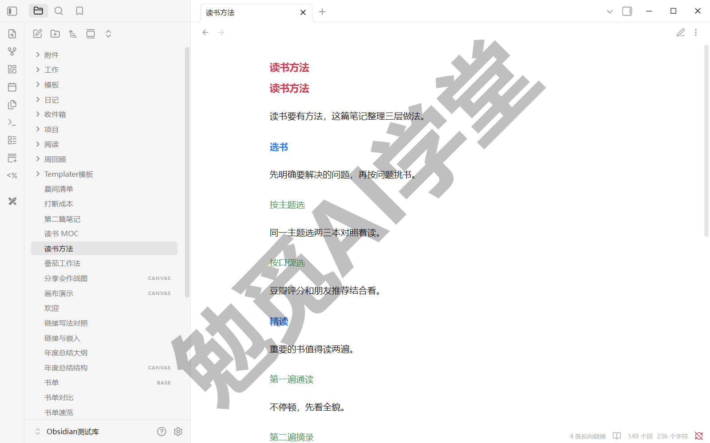

**片段与主题的叠加关系**。三层的生效顺序要记住：主题最先应用，Style Settings 在主题开放的范围里调整，CSS 片段最后应用——同一处样式三层都改到时，一般以片段为准（实际叠加效果以实机显示为准）。所以换了主题，片段大概率照常生效；若某段在新主题下效果不好，用它的独立开关关掉即可，不用删文件。

一句话总结：片段就是“存进 snippets 文件夹的样式补丁”，每段一个开关、随开随关；照抄三段起步，会改数字和颜色就够用。

### 13.4 字体、行宽与排版设置

CSS 片段之外，设置页里还有一批原生的排版选项。《界面与设置全导览》分级过设置时，把外观类选项一句话点到、说好深讲在这里——现在就来兑现。先交代一句：设置分组在近期版本调整过，下面各项的确切位置以实机界面为准，找不到就用设置搜索直接搜名字，那一篇教过的兜底习惯这里照常用。

**三个字体设置**。外观页的字体一栏有三项（下图）：

- **界面字体**——菜单、侧栏、设置页这些应用界面用的字体；不确定就别动它，界面字体乱设容易显得杂乱；
- **正文字体**——编辑和阅读视图里笔记正文的字体，最值得换的一项：挑一款自己读着舒服的中文字体，写作体验立刻不同；
- **等宽字体**——第三项就叫这个名字，管代码块和元数据（frontmatter）源码等文本的字体。等宽指每个字符占同样宽度，代码和缩进才对得齐，选列表里名字带 Mono 的一般就是。

每项都通过“管理”选择系统里已装的字体，或直接输入字体名。中文用户最常动的是正文字体：系统自带的微软雅黑、等线都可以直接选，另装的字体装好后在这里输入名字即可启用（字体列表与生效方式以实机为准）。做完会看到：选定后正文当场换字体，不合适就再换，零成本试错。

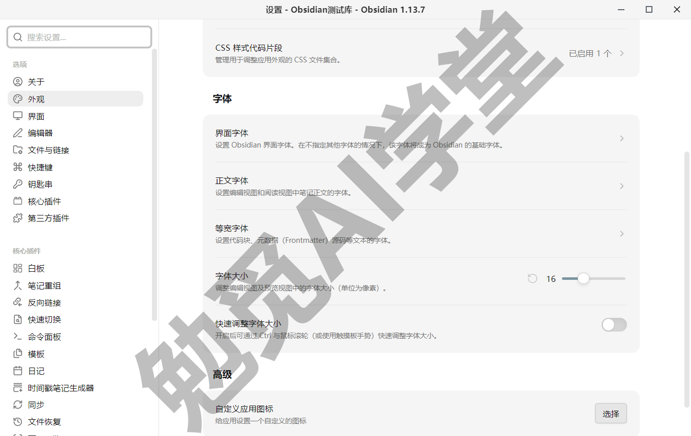

**字体大小与缩放**。同在外观页：“字体大小”滑块调的是笔记正文的字号（默认 16，单位是像素）；“缩放比例”在外观页的高级一栏，整个应用界面一起放大缩小，高分屏上嫌字小就调它（该项位置以实机为准）。两者的分工是：只嫌正文小，调字体大小；连菜单、侧栏都小，调缩放比例。还有一个顺手的快捷操作：按住 Ctrl 滚动鼠标滚轮，正文字号即时缩放——注意它背后有个开关：字体大小滑块下方那项“快速调整字体大小”默认是关的，打开它 Ctrl+滚轮才起作用。投屏演示时临时放大给别人看，比进设置翻选项快得多。

最后一条纪律：外观选项一次只动一项，用上一天觉得对再动下一项。一口气全改，出了不顺眼的地方分不清是哪项造成的，反而要花更多时间倒回去。

**限制行宽**。屏幕很宽时，一行文字从最左拉到最右，读长段落眼睛要横扫整个屏幕，很累。官方在编辑器设置里给了“限制行宽”开关：开启后每行字数被限制在一个阅读舒适的宽度，两侧留白——开与关的排版对照见下图（设置项的确切名称与位置以实机为准）。建议保持开启；确实想满屏铺开（比如对照大表格）再临时关。行宽还要和字号联动着看：字号调大后，同一行宽里每行的字数会变少，两项各微调一两档，找到眼睛最省力的组合。

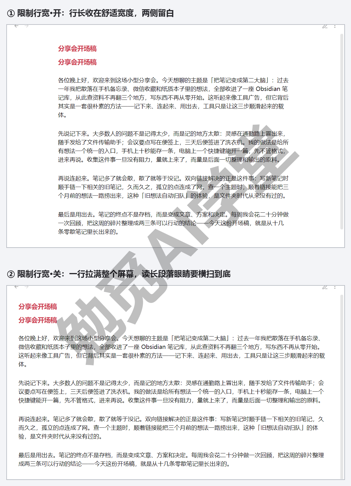

**标注块：给重点段落一个醒目盒子**。界面排版之外，笔记内容里也有一个自带样式的排版元素值得认识——标注块（callout）。它是引用块的一个变体：在引用块第一行写上 `[!note]` 这样的类型标记，整块就渲染成带图标、带底色的提示框；重点提醒、注意事项在长文里一眼可辨，不用写一行 CSS。写法照抄：

```
> [!note] 起个标题
> 这里是提示框的内容，支持正常的 Markdown 写法。
```

在实时预览下就能看到效果：一个带图标的彩色盒子，标题加粗，内容装在框内。方括号里的类型词决定图标和配色，`note`（笔记）之外常用的还有 `tip`（提示）、`warning`（警告）、`info`（信息），一共十来种，类型词用英文小写，完整清单见官方帮助（各类型的具体配色随主题而变，以实机为准）。两个小细节：类型标记同一行的文字是标题，不写就显示类型名本身；在类型标记后紧跟一个减号（`[!note]-`），整个盒子默认收起，点标题展开、再点收回。

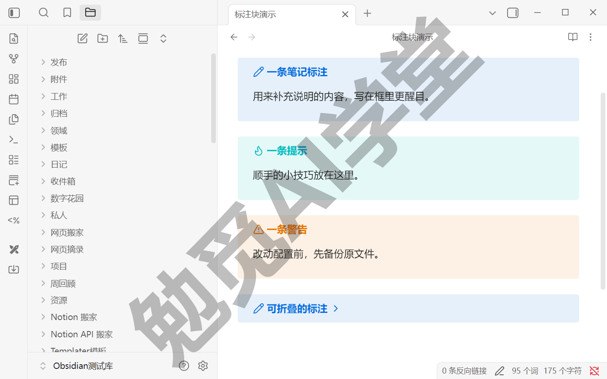

两条边界顺带交代：《双链与图谱》讲块引用时提过，标注块只能整块被引用，链接不到它内部的某一行；发布成网页时它的样式可能与库内不完全一致，到《毕业：数字花园上线》的渲染差异排查会讲处理思路。日常拿它标注“注意”“小结”这类需要醒目的段落就好，整篇处处是框，反而失去强调效果。

一句话总结：正文字体、字号、行宽是影响每天阅读体验的三个原生开关，各调一次找到自己的舒服档；标注块给重点段落一个自带样式的盒子，写一个类型标记就能用。

### 13.5 布局方案与工作区一键切换

界面调顺眼了，最后一层是把面板布局也管起来。拖拽标签页分屏的基础操作《界面与设置全导览》讲过——拖动标签页可以左右、上下分屏，右键标签页也有分屏选项——这一节不重复操作本身，讲怎么把分屏搭成“成套的布局”，再用工作区插件把布局固化成一键切换。

**三套典型布局**。布局跟着任务走，三个高频场景各配一套：

**写作布局**：中间一篇笔记全宽编辑，右侧边栏切到大纲面板——《界面与设置全导览》演示过，大纲按标题层级导航长文，写到哪跳到哪；左侧文件列表折叠收起，屏幕留给正文。适合沉下心写长文。

**研究布局**：左右分屏两篇笔记，左边读资料、右边记笔记；右侧边栏开局部关系图——《双链与图谱》讲过，它只显示当前笔记的邻居，顺着链接摸相关笔记正合适。适合查资料、做主题梳理。

**回顾布局**：左边开今天的日记（《日记、模板与每日工作流》里那张每天的工作台面），右边开一篇装着任务汇总查询的笔记——《Dataview 专讲》讲过 TASK 查询，全库没勾掉的任务一网打尽。适合每天收尾和每周回顾。

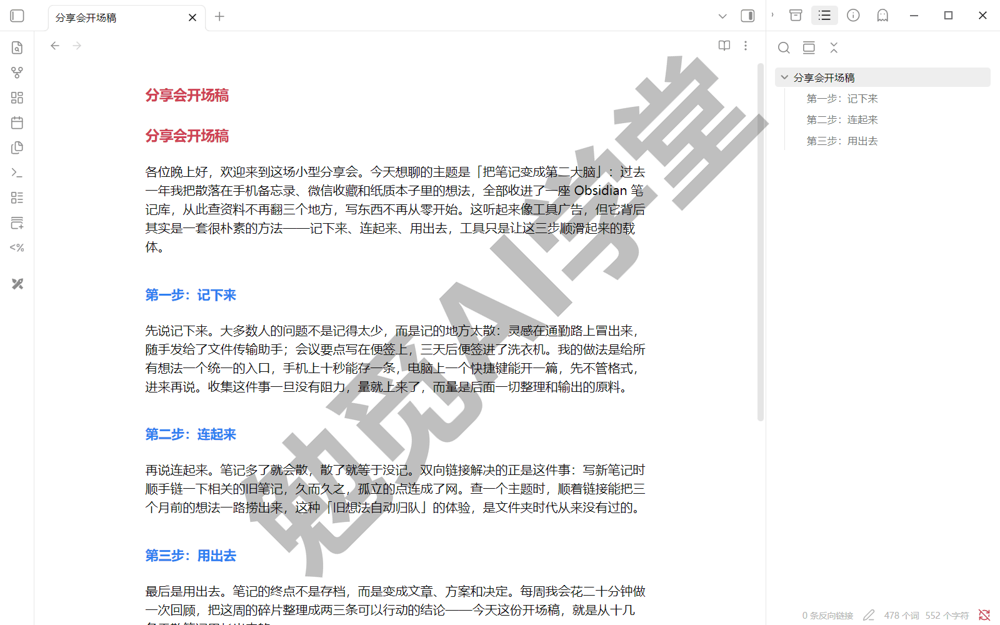

**没有工作区的日子**。这三套布局手工都搭得出来，问题在于重复：每次切换任务，都要重新开笔记、拖分屏、调侧栏，几个动作下来节奏就断了；明天再来一遍，后天再来一遍。搭一次不难，天天重搭才是负担——这正是工作区插件解决的事：搭好一次，存下来，以后一键回来。

**开启工作区插件**。工作区是核心插件，在设置的“核心插件”页确认它已开启（是否默认开启，以实机为准）。按官方帮助，它保存的内容包括：打开的文件和标签页、侧边栏的折叠情况与宽度——一句话，就是“这一刻界面的布局”。

**第 1 步：搭好并保存第一套布局**

先把写作布局搭出来。然后打开“管理工作区布局”面板（下图；功能区有同名按钮，命令面板里搜同名命令也能到），输入名称“写作”，点“保存”。做完会看到：面板列表里出现“写作”一项。

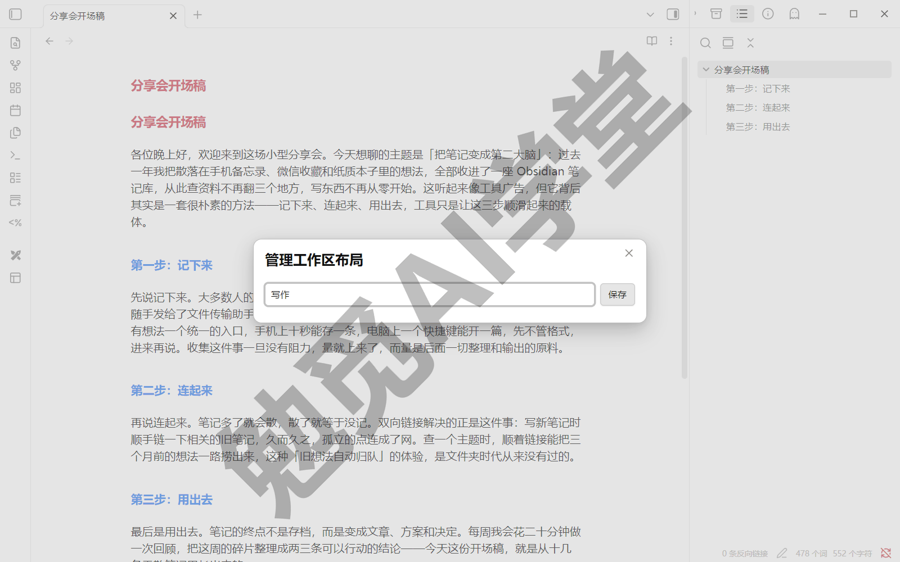

**第 2 步：再存两套**

把研究布局、回顾布局也各搭一遍，分别存成“研究”“回顾”。三套都保存后，面板列表里就有了整齐的三行。

**第 3 步：一键切换**

打开“管理工作区布局”，点目标布局旁的“加载”——界面瞬间换成那套布局。刚才要好几步的手工动作，现在一次加载完成。做完会看到：打开的笔记、分屏结构、侧边栏状态全部按存档恢复。

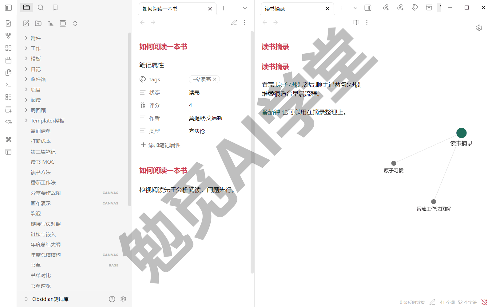

**第 4 步：更新已存的布局**

布局不满意想调整？官方的更新方式是“同名再存一次”：把布局调成新样子，再存成同一个名字，旧存档就被覆盖。

**两个必须知道的坑**。

- **工作区存的是布局，不是笔记内容**。它记录“哪些文件开着、面板怎么排布”，不含笔记本身；笔记内容永远在 md 文件里，加载工作区不会动它。反过来说，你在某套布局里写的内容，切走布局也一个字不丢。
- **布局改动不会自动存回**。加载“写作”后你临时调整了布局，这个调整只存在于当前窗口；没有同名再存一次，切去“研究”再切回来，看到的还是老存档（具体表现以实机为准）。记住一条就够：调完想保留，就同名再存一次。

一句话总结：布局跟着任务走，写作、研究、回顾各存一套；一键加载省下每天重新搭的功夫，记得“调完同名再存”。

### 13.6 三个练习任务

轮到你自己动手。三个任务分别对应主题、片段、工作区三层。

**任务一：换主题加微调**

从主题管理里换一款主题，再用 Style Settings 改一处样式（强调色、标题、密度任选）。

完成标准：能用一键重置把改动恢复回主题默认。

**任务二：启用一段 CSS 片段**

把 13.3 的三段片段存进 snippets 文件夹，启用其中一段，改一个数值（行距、色值或圆角半径）看效果。

完成标准：关掉片段开关，界面立即还原。

**任务三：搭一套写作布局存成工作区**

按 13.5 搭出自己的写作布局，存成工作区并命名。

完成标准：重启 Obsidian 后，一键加载即可恢复该布局。

### 13.7 本篇小结与自检

这一篇把 Obsidian 调成了你的样子：主题定基调，Style Settings 微调细节，CSS 片段处理主题没覆盖的角落，工作区把调好的布局一键固化。最需要记住的是：**美化的每一层都可以随时撤销——主题可换回、微调可重置、片段有开关；工作区存的是布局，不是笔记内容。**

可以对照下面的清单检查学习结果：

- [ ] 装过并切换过至少两款主题
- [ ] 用 Style Settings 完成过一处微调，并会重置
- [ ] 启用过一段 CSS 片段，并改过其中的参数
- [ ] 调过字体或行宽，知道入口在哪
- [ ] 保存了至少一套工作区，并验证过一键切换

完成这些内容后，你的 Obsidian 已经既顺手又顺眼。下一篇《导入、导出与发布》解决进出问题：旧笔记搬进来，成果发出去。

### 13.8 新手常见问题

**Q1：主题会拖慢速度吗？**

主题本质上是一套样式文件，一般不会明显影响速度。个别视觉效果很重的主题，在配置较低的电脑上可能让滚动和切换变卡——感觉卡了就先换回默认主题对照一下，卡顿消失就是主题的问题，换一款轻量的即可。主题随时可禁用，试错没有成本。

**Q2：换主题后 Style Settings 的设置还在吗？**

Style Settings 面板里列的可调项是各主题自己声明的，换主题后面板显示的就是新主题的选项，旧主题那套自然不再套用；一般换回旧主题时，之前的微调还会在（具体表现以实机为准）。无论怎么换，这些都只是外观层的事，笔记内容不受任何影响。

**Q3：CSS 片段和主题冲突了怎么办？**

症状通常是：换了主题后，某段片段让界面显示异样。处理分两步：先把可疑片段的开关关掉，界面立即还原——独立开关就是为这一刻准备的；然后逐段排查，确定是哪一段和新主题不合。《社区插件系统》教过的二分禁用法在这里同样适用：关一半、再关一半，很快定位。定位后可以改片段里的数值适配新主题，或干脆停用那一段。

**Q4：工作区能跨设备同步吗？**

工作区布局存在库的 `.obsidian` 配置文件夹里（具体文件以实机为准），能不能跨设备带走，取决于你的同步方案有没有同步配置文件夹——《同步与备份全解》讲过这个取舍：配置同步省心，但两台设备屏幕差异大时，同一套布局未必都合适。建议布局这类强设备相关的东西各设备各管各的，真要带走再开配置同步。
