## 导入、导出与发布

到上一篇为止，库内的能力已经配齐，这一篇解决库与外界的通道：把散落在 Notion、印象笔记、Word 里的旧笔记搬进来，把写好的成品导出成 PDF 交出去，再在“把笔记发布成网站”的三条路里选定自己那条。

建站的实际动手留给毕业项目，这一篇先把认知、决策和准备工作做足——读完你会完成一次真实的搬家、一次真实的导出，并为将来的发布把地基打好。

### 14.1 搬家进来：官方 Importer

决定用 Obsidian 只要一分钟，真正拦住人的往往是那句“我在旧工具里还存着好几年的笔记”。这一节解决的就是历史包袱：用官方的导入插件，把 Notion、印象笔记的存量笔记成批搬进库，Word 文档也给出可行路线。

**迁移助手是什么，先把它装上**

官方为搬家专门做了一个插件，英文名 Importer，官方中文帮助译作“迁移助手”——插件市场里的条目名就是 Importer（本篇正文统一叫迁移助手）。它由 Obsidian 官方团队维护，但不算核心插件，走社区插件商店分发——所以装它用的正是《社区插件系统》学过的那套流程：打开设置进入社区插件页，关闭受限模式后点开浏览，搜索“Importer”，安装并启用（设置分组的确切名称以实机界面为准）。

它的支持面相当广：Notion、印象笔记（Evernote）、微软 OneNote、Apple 备忘录、Google Keep、Bear、Craft、Roam Research 等主流笔记应用，以及 HTML、CSV、Markdown、Textbundle 等通用格式，都在官方支持源之列（完整清单以插件当前版本为准）。导入的产物统一是纯文本 md 文件——搬进来的那一刻，旧笔记就和新写的笔记完全一样了。

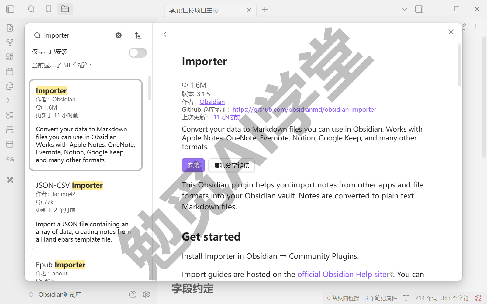

动手之前先定一条通用纪律，本节每条路线都适用：**搬完先核对；核对无误之前，不要删除旧平台里的原数据。**《同步与备份全解》定下过“重大操作前先整库备份”的习惯，搬家正是典型的重大操作——目标库先备份一次，导入完成后按后面给的清单核对，确认无误之前，旧平台的数据原样留着。搬家搬坏了不可怕，原数据还在，随时能重来。

**Notion 搬家：先选路线**

迁移助手给 Notion 准备了两条路线：打开它选中 Notion 来源后，“选择导入方式”页会让你二选一，先选对路再动手：

- **文件导入**——在 Notion 里导出一个压缩包（.zip），再交给迁移助手。不需要令牌、全程可离线，操作最简单；代价是不保留数据库：数据库里的内容会以普通页面的形式进来，表格结构不再是“活”的。
- **Notion 账户（推荐）**——迁移助手用你的集成令牌直接连接 Notion 工作区拉取数据，数据库和公式能保留下来，转换成《Bases 数据库》里学过的那种 .base 文件（那一篇讲过：Bases 的表格，每一行都是库里一篇真实的笔记，列来自属性）。代价是要在 Notion 里创建一个访问令牌，导入全程联网，而且受接口速率限制，大工作区会比较慢。

怎么选，一句话：Notion 里数据库用得少，或者只想尽快搬完，走 zip；数据库是你的主力资产（书单、任务表、CRM 客户管理表这类），走 API，把数据库“活着”带过来。

**zip 路线·第一步：从 Notion 导出**

**第 1 步：找到导出入口。** 打开 Notion 的设置（桌面端可直接按 Ctrl+, 呼出），进入“工作空间”分组的“通用”页，滚动到“导出”一栏，点“工作空间内容”旁边的“导出”（导出全部工作区内容需要管理员权限）。

**第 2 步：按官方推荐的格式设置导出。** “导出格式”一定选 **HTML**——官方明确建议不要用 Notion 的 Markdown 导出，因为它会遗漏重要数据，这是本节最容易踩的坑；“页面内容”保持“所有内容”，并打开“为子页面创建文件夹”保留页面层级。点“导出”后等它打包，完成时收件箱会收到“导出已准备就绪”的通知，点“下载”拿到一个 .zip 压缩包（邮箱也会收到一份下载链接），不用解压。

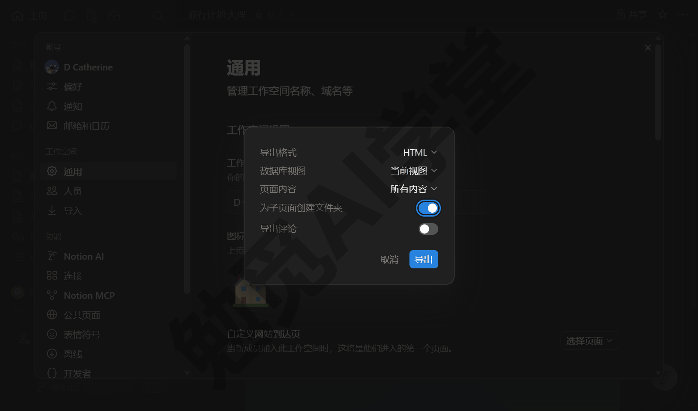

**zip 路线·第二步：导入 Obsidian**

**第 3 步：打开迁移助手选路线。** 命令面板执行“Importer: 导入笔记”（功能区也有它的图标），在来源列表里选 **Notion**，导入方式选“文件导入”——插件界面目前已是中文。

**第 4 步：选文件、定去处。** 点“选择文件”选中刚下载的 .zip，界面会列出“要导入的文件夹”让你勾选——官方建议一次性导入全部 Notion 数据，内部链接才能正确对接上。点“继续”后在“输出文件夹”填一个专门的文件夹名（比如“Notion 搬家”，注意清掉输入框里预填的字），搬进来的东西都嵌套在里面，不与现有笔记混杂；再打开“将父页面保存在子文件夹中”，保留 Notion 的页面层级结构。

**第 5 步：点“开始导入”，等它跑完。** 最后一屏可以预览导入效果，确认后开始导入；完成页会报出已导入篇数与附件数，左侧文件列表里会出现整批新笔记。两个官方故障排除办法顺手记下：导入过程中卡住不动，先禁用其他社区插件再试；数 GB 的大工作区可能报 “Import failed ...Part-1.zip” 类错误，这时先把外层 zip 解压，再把里面嵌套的 Export-...-Part-N.zip 逐个导入（两条均出自官方帮助，具体表现需实机验证）。

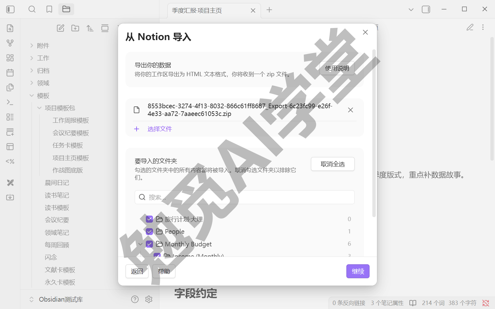

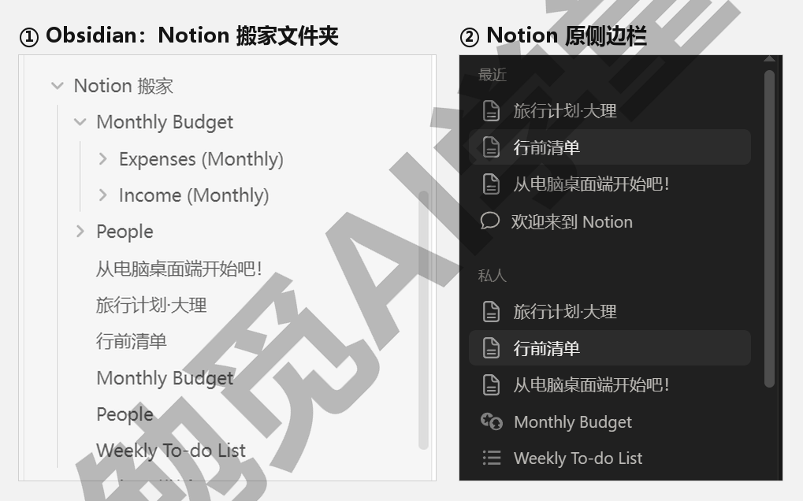

**API 路线概要**

选了直连路线的读者，流程分三段：

**第 1 步：在 Notion 里创建访问令牌。** 打开 Notion 的开发者面板（app.notion.com/developers/connections，桌面端应用内就能打开），点“新连接”，起个名字（如 obsidian-import），“验证方式”选“访问令牌”，创建后在“配置”页的“集成令牌”一栏找到“访问令牌”，点显示图标后复制——这串以 ntn_ 开头的字符就是令牌，存进密码管理器这类安全的地方。

**第 2 步：授权内容范围。** 没授权的内容，用令牌也访问不到。最顺手的做法在 Notion 页面这头：打开要导入的顶层页面，右上角“操作”（•••）菜单里选“集成”，勾上刚建的连接，在确认弹窗点“添加到页面”——它和它的全部子页面就都授权了；也可以回连接的“内容访问权限”页统一添加。

**第 3 步：回 Obsidian 导入。** 迁移助手里来源选 Notion、导入方式选“Notion 账户（推荐）”，在“Notion API 令牌”一栏点“链接…”保存令牌（ID 起名如 notion，“密钥值”粘贴令牌），下方列表会自动加载出可导入的内容，勾选后按提示走到“开始导入”。官方交代的限制也要提前知道：每个数据库只导入主视图；“链接数据源”类数据库导不了；大工作区受速率限制要多等。

导入后你会看到数据库的落地形态：每个数据库变成一个同名文件夹，里面是一个同名的 .base 文件加上每行对应的一篇篇笔记——双击打开 .base 就是《Bases 数据库》里那种表格视图，列与属性都在，筛选排序照常能用。

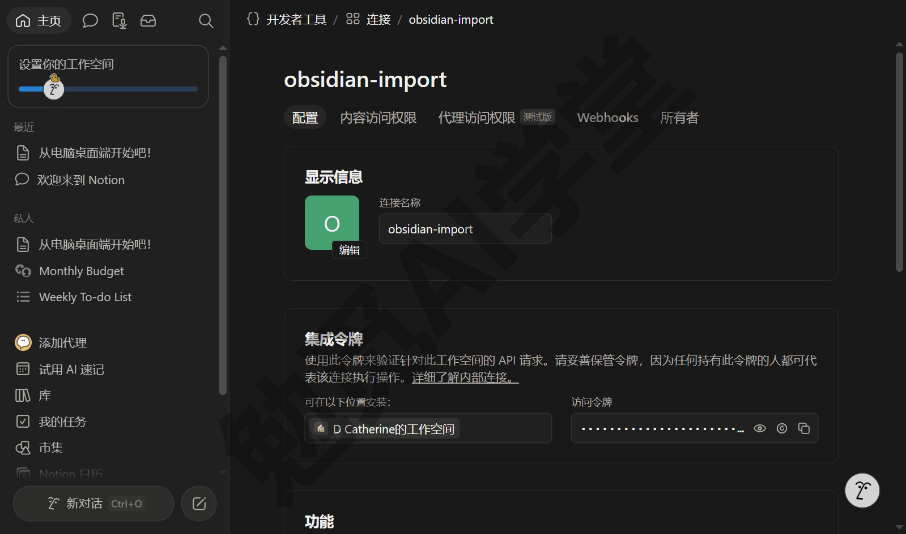

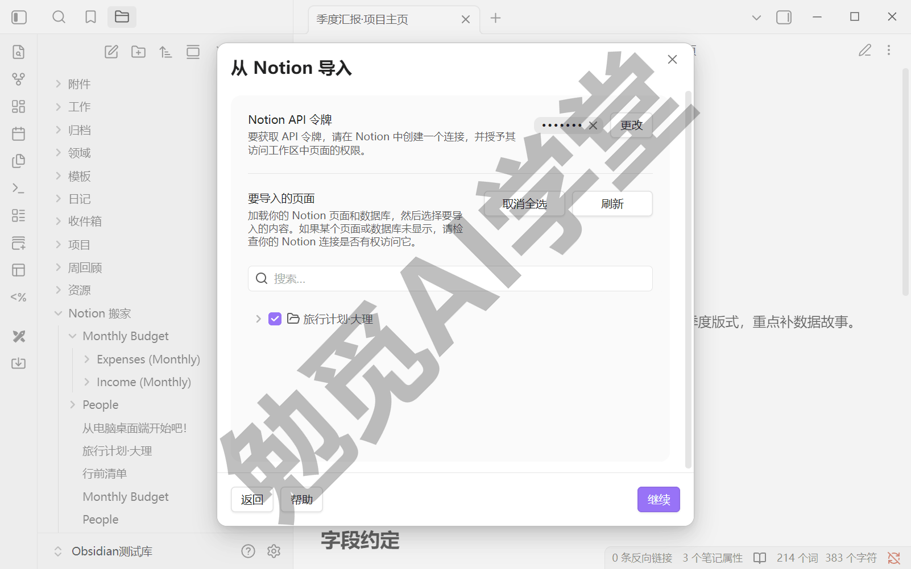

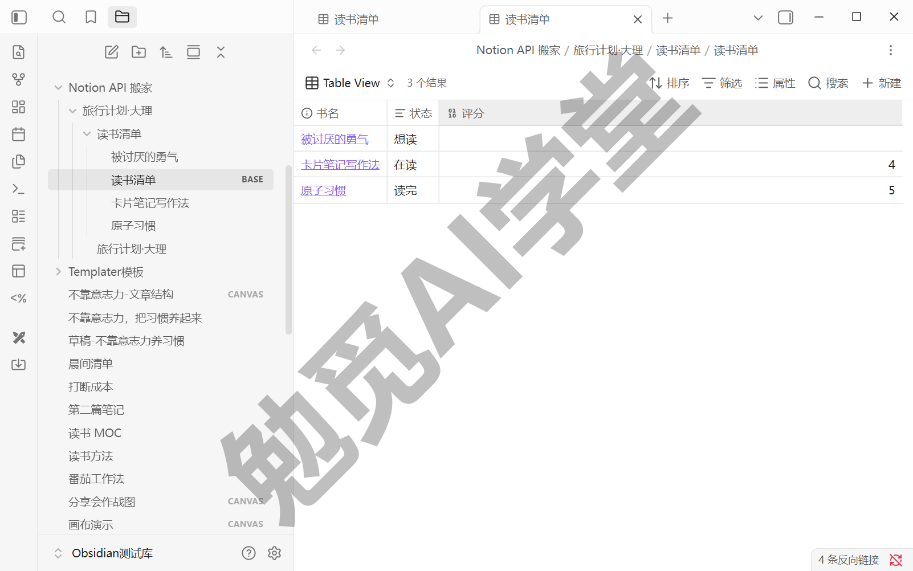

**搬完核对三件事**

无论走哪条路线，导入完成不等于搬家完成，按下面三件事核对（这也是练习任务一的内容）：

- **数据库变成了什么**——zip 路线：确认数据库内容以何种形式进来了，重要表格考虑用《标签与属性》和《Bases 数据库》的办法重建；API 路线：逐个打开 .base 看行数对不对、列全不全。
- **附件在哪**——抽查几篇带图片、带 PDF 的笔记，确认图片正常显示、附件能打开；附件的存放位置以导入结果为准，核对时顺便记住它，将来好管理。
- **链接还通吗**——挑几对原来互相链接的页面，点一点跳转是否正常；一次性全部导入就是为了这一步的成功率。

三件事都过了，这批笔记才算真正搬完；源数据也别急着删，在旧平台放一段时间，等你确信不再需要回头查，再做处理。

**印象笔记：enex 进库，先看你是哪个版本**

印象笔记的搬家以“笔记本”为单位，迁移助手对应的来源是 **Evernote (.enex)**——认的是 Evernote 的标准导出格式 .enex。这条路能不能走通，取决于你手里是国际版还是中国版：

- **国际版 Evernote**：在桌面客户端的笔记本列表里，点某个笔记本的更多操作（•••），选导出笔记本，格式选 **ENEX**，得到一个 .enex 文件；然后在迁移助手里选 Evernote (.enex)，选中文件导入即可，多个笔记本就逐个导（国际版客户端的界面与导出入口，需实机验证）。
- **中国版印象笔记**：实测这条路不通。以 7.4.26 版为例：在笔记本列表里对着笔记本点右键选“导出笔记”，对话框里只有一种格式——“导出为 NOTES 格式文件（.notes）”，没有 ENEX；这个 .notes 打开看确实是 XML，但笔记内容是加密存储的，把后缀改成 .enex 强行交给迁移助手导入，结果是全部失败（0 已导入、2 失败）。所以中国版用户不用在这条路上耗时间：笔记不多，逐篇复制粘贴反而最快（下面 Word 一段的粘贴办法同样适用）；确有大批量需求，再考虑第三方转换工具，或者等以后版本恢复标准 ENEX 出口。

给能拿到 .enex 的读者，两个已知的坑提前交代：

- **标签层级**——enex 格式不保留标签的父子关系，官方给的办法是导出前在印象笔记里把子标签改名成“父标签/子标签”的写法，导入后正好接上《标签与属性》讲过的嵌套标签体系（#书/在读 式层级）；
- **笔记本组**——导出文件里没有“组”的信息，官方提供了一个文件名约定：把 .enex 文件改名成“组名@@@笔记本名”再导入，可以重建“组名/笔记本名”的文件夹层级（进阶用法，实际效果以实机为准）。

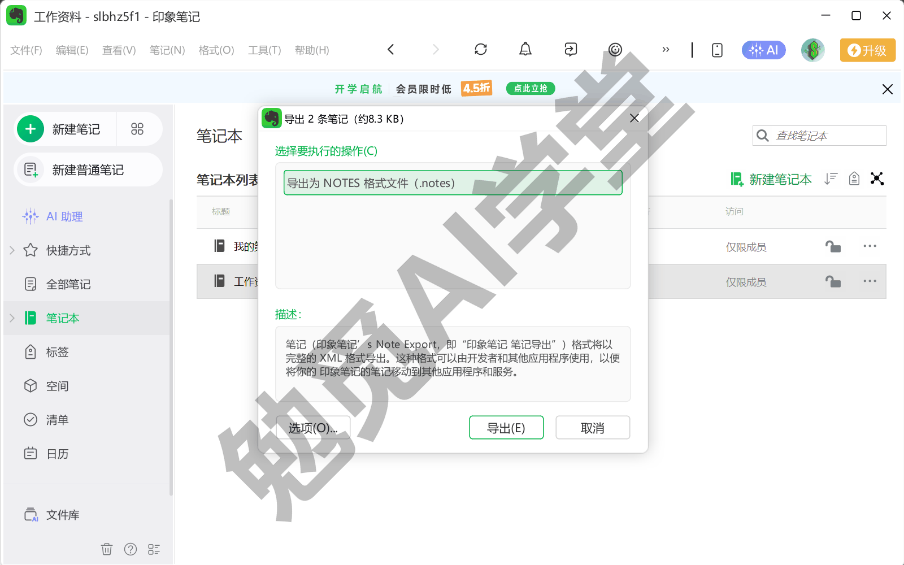

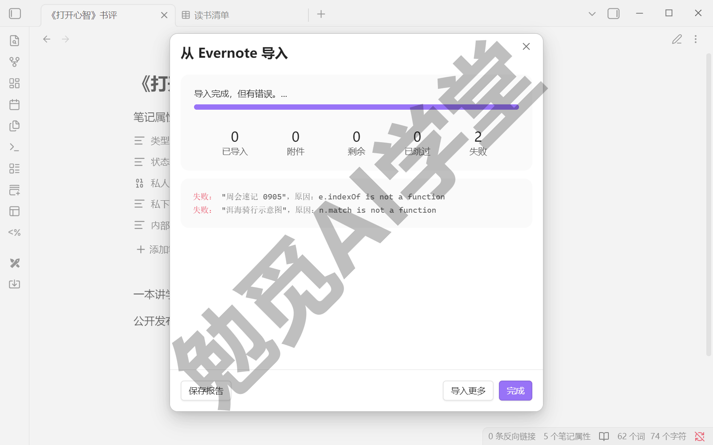

**Word 文档：官方不支持直接导入，走中转**

先把事实说清：迁移助手的官方支持列表里没有 Word/.docx——官方帮助与插件仓库的说明一致，且官方明示现阶段不主动扩充新导入格式（以当前版本的支持列表为准）。所以 Word 笔记进库要走一步中转，两条做法按量选：

- **批量走 HTML 中转**——用文字处理软件把文档另存为网页格式，再用迁移助手转成 md。以 WPS 文字为例（用 Word 的读者操作同理，格式名叫“网页(*.htm;*.html)”）：打开文档按 F12 另存为，“文件类型”选“网页文件(*.html *.htm)”，保存后得到一个网页文件和一个装图片的同名 .files 文件夹（WPS 默认给的后缀是 .htm，迁移助手一样认）。回到 Obsidian 打开迁移助手，来源选 **HTML (.html, .zip)**，点“选择文件列表”挑出刚存的网页文件，后面的输出文件夹、开始导入，与 Notion 的 zip 路线做法相同。实测一篇带标题、列表的会议纪要转出来相当干净：大小标题、无序列表、编号列表都原样接上，正文没有丢字。
- **少量直接粘贴**——十来篇以内，最快的办法往往是打开文档全选复制，直接粘贴进新建的 Obsidian 笔记：粘贴时格式会尽量转换成 Markdown（标题、加粗、列表的转换效果以实际表现为准），图片再单独拖进来补上。

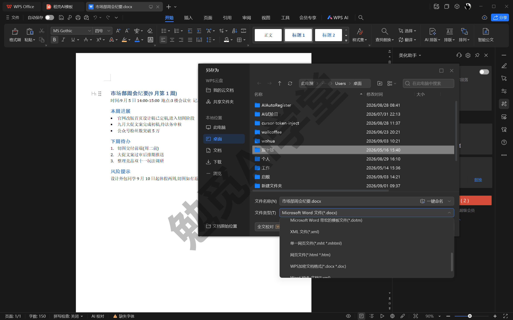

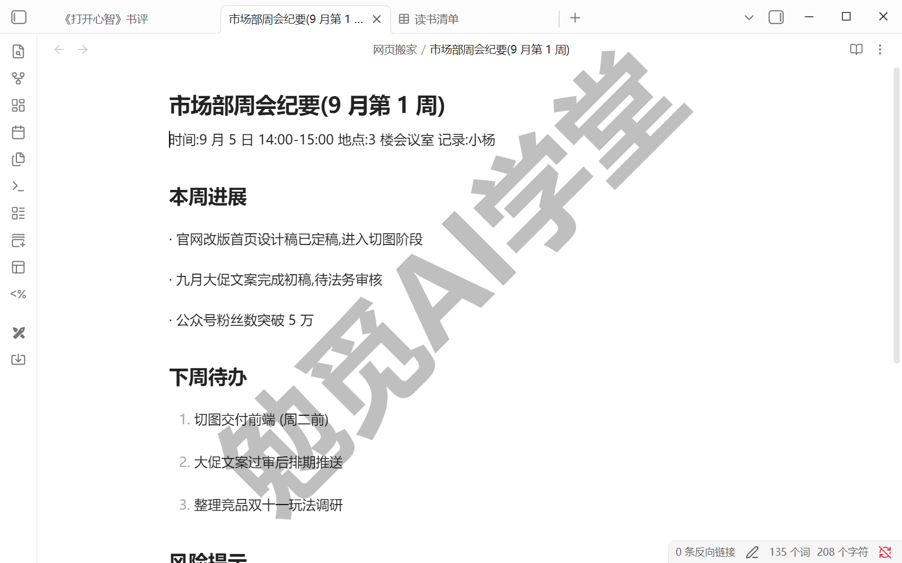

### 14.2 导出：单篇 PDF 与整库可携带

搬进来解决了“进”，这一节解决“出”。出有两种：把一篇成品交出去给别人看，以及把整座库完整带走。

**导出为 PDF：交付定稿的标准动作**

写好的方案、总结、报告要发给不用 Obsidian 的人，md 文件对方打开是一堆符号，PDF 才是通用的交付格式。Obsidian 自带单篇导出 PDF 的能力：打开要导出的笔记，呼出命令面板搜“PDF”，执行“导出为 PDF”——1.13.7 里右上角的更多选项菜单没有这一项，要从命令面板执行。

点开后会出现导出选项对话框，选项一共五组：“将笔记名作为标题”、“页面尺寸”（A3／A4／A5／Legal／Letter／Tabloid）、“横向打印”、“页边距”（默认／小／无）和“缩放百分比”。一般保持默认、页面尺寸选 A4 即可；内容偏宽（大表格、宽图）时试试横向打印或调小缩放。确认后选择保存位置，得到一份 PDF——发出去之前自己先打开翻一遍，重点看图片是否完整显示、分页处有没有把表格或代码块拦腰截断（以实际导出效果为准）。

还有一个多篇合一的思路：建一篇汇总笔记，用嵌入把几篇内容聚进来——《双链与图谱》讲过嵌入，`![[ ]]` 会把目标笔记的内容原地显示出来——再对这篇汇总笔记执行导出，嵌入的内容会随页面一起进 PDF（合成效果以实际导出为准）。交付一组文档时这个办法很省事。

PDF 的适用边界也交代清楚：它是内容在某一刻的快照，适合定稿交付；如果内容还会持续更新、你希望读者总能看到最新版，那就不属于导出，属于发布——正是下一节的主题。

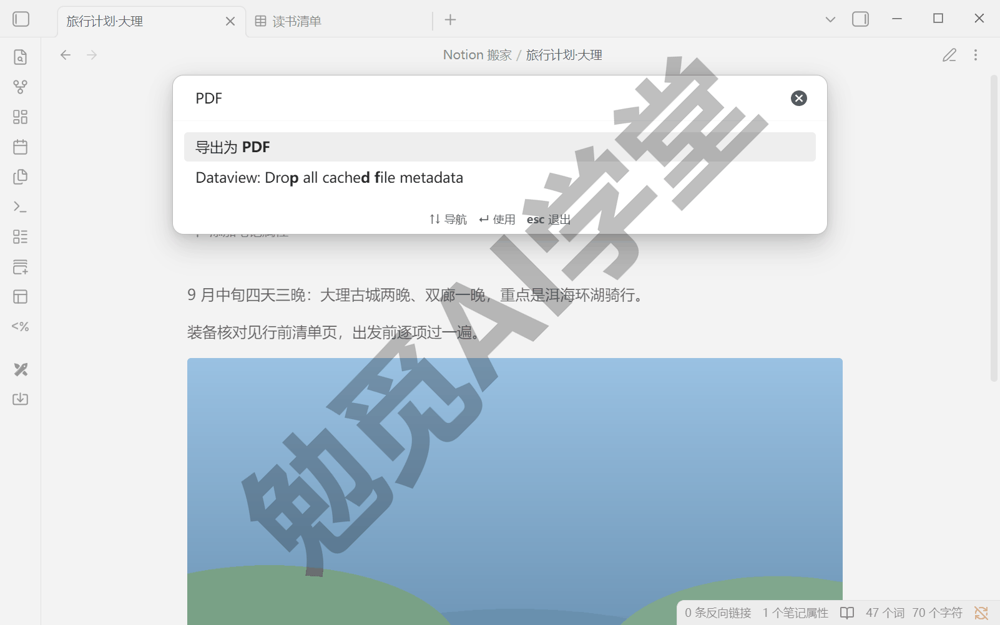

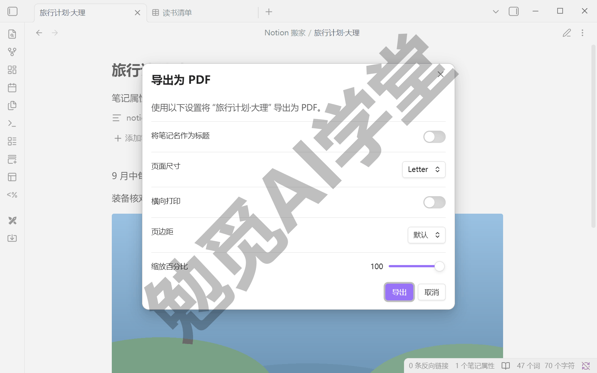

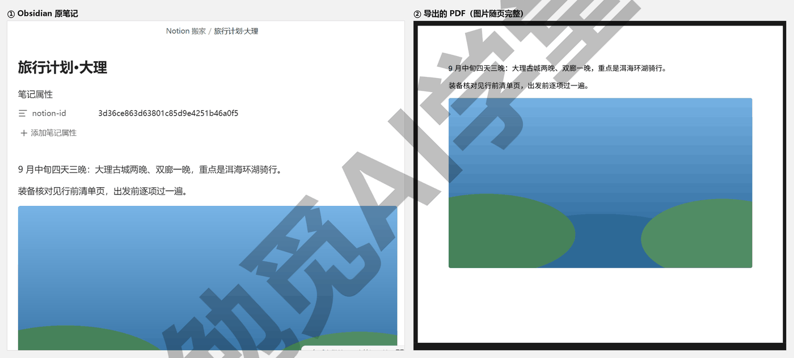

**整库可携带：复制文件夹就是全部**

单篇之外，还有一个大得多的“出”：整座库。这件事其实在《认识与装好》就讲过底层逻辑——“十年后还打得开的笔记”，靠的是笔记全部以通用纯文本存在你自己的硬盘上，软件没了文件还在。落到操作上就一句话：**复制库文件夹，等于带走一切。** 几千篇 .md 笔记、《Canvas 画布》的 .canvas 白板、《Bases 数据库》的 .base 表格、全部附件和配置，都在那一个文件夹里。

所以“换电脑”“给同事一份完整资料库”“留一份年度归档”这类需求，不需要任何导出向导：资源管理器里复制粘贴，或打包成压缩包发过去，对方用 Obsidian 打开这个文件夹（《认识与装好》用过的“打开本地仓库”入口）就得到一座一模一样的库。md 这种格式本身的来龙去脉，姊妹篇《Markdown 通用语法手册》的《入门》篇有完整交代，这里不重复。

两种“出”的分工记住一句话就够：PDF 适合把定稿交付给别人看，库文件夹本身则是你随时可以整体带走的全部资产。

### 14.3 发布三条路：认知与三选一决策

导出面向的是某一位具体的读者，发布面向的则是所有人：把精选的笔记变成一个可以持续访问的网站——这类站点在笔记圈常被叫作“数字花园”，意思是公开地、持续地打理自己的知识。这一节不动手建站，只做两件事：认清三条路，做出你的三选一决策。

**官方 Publish：付费托管，最省心**

Obsidian 官方的发布服务，订阅制付费（价格与功能以官网当前页面为准）。机制是：你在库里勾选哪些笔记要发布，官方负责把它们变成一个托管好的网站，服务器、域名解析、页面生成全不用你操心，站点通常还带搜索、图谱这类 Obsidian 特色能力（以官方当前说明为准）。它和 Sync 一样，是《认识与装好》讲过的两项官方增值服务之一——核心功能免费，付费买的是“官方替你打理”。适合预算允许、只想写作、不想自己维护网站的人。

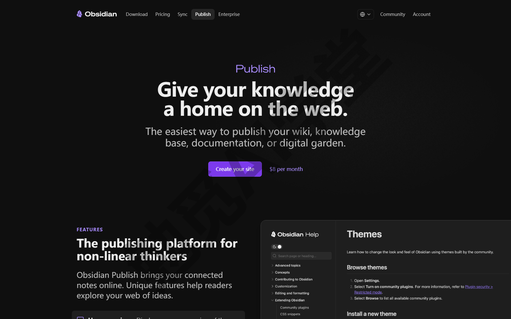

**Quartz 免费建站：零成本，自己动手(https://quartz.jzhao.xyz/)**

Quartz 是一个开源建站工具，专门把 Obsidian 库里的笔记变成静态网站——静态网站指页面预先生成好、不需要服务器实时运算的网站，托管门槛最低——配合 GitHub Pages 目前可以全程零成本上线。它对 Obsidian 特性的支持相当完整：双链、图谱、全文搜索这些你已经习惯的东西，网站上都有对应呈现（以 Quartz 当前版本的官方文档为准）。代价是要自己动手：跑几条命令、改一份配置、走一遍部署流程——都在照抄能完成的范围内，完整实操在毕业项目《毕业：数字花园上线》里手把手带你走，本课的零成本主线选的就是这条路。适合零预算、愿意跟着教程动手的人。

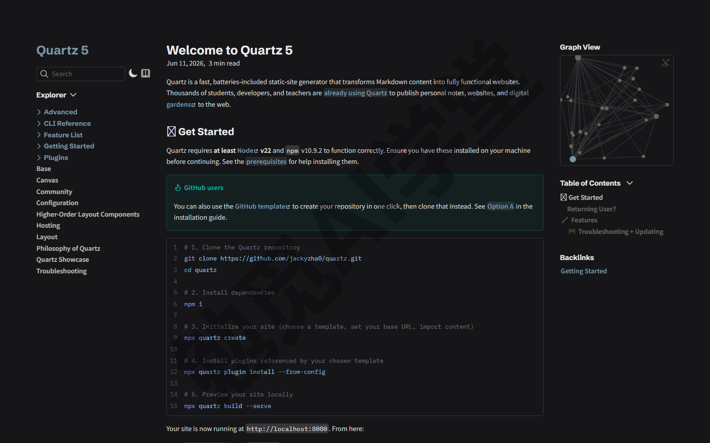

**直接分享 md：不建站的轻方案**

第三条路最朴素：不建站，单篇分享。md 文件本身发给会用的人，或按上一节的办法导出 PDF 发给所有人。零搭建、零维护，代价是没有“站”——没有目录、没有链接跳转、没有持续更新的入口。适合偶尔分享单篇、暂时没有公开写作计划的人。

**三选一决策**

三个问题按顺序问自己，答案基本就出来了：

- **预算**——愿意为省心付一份订阅吗？愿意，Publish 是体验最顺的一条；不愿意，往下看。
- **技术意愿**——愿意跑几条命令、跟一次部署教程吗？愿意，Quartz 零成本能拿到一个像样的站；完全不想碰命令行，那就在 Publish 和“先不建站”之间选。
- **更新频率**——真的会持续公开写吗？会，前两条路都值得；只是偶尔想给人看一篇，直接分享 md 或 PDF 就够了，别为低频需求维护一个站。

这个决策随时可以改。三条路的底座都是你库里那批 md 文件——今天选了直接分享，明年想建站，笔记原样可用；Publish 和 Quartz 之间迁移，内容也不用重写。先选一条开始走，比选“最完美的那条”重要。

### 14.4 发布前准备（为毕业项目省时间）

这一节只针对上一节选了 Quartz 的读者（以及还没定、想给自己留条后路的读者）：把两样免费的东西提前备好——GitHub 账号和 Git 工具——毕业项目那天就能直接开工，不用中途停下来装环境。

先交代这两样是什么、为什么需要。GitHub 是全球最大的代码与文件托管平台，Quartz 路线里你的网站内容就放在它上面，配套的 GitHub Pages 负责把内容变成可访问的网页，目前免费（以平台当前政策为准）；Git 是把本地内容送上 GitHub 的传输工具。《同步与备份全解》提过 Git——那一篇的结论是“用 Git 做笔记同步只适合会版本管理的人，本课不走这条路”；这里装它是另一回事：不用学任何概念，装到能用就行，毕业篇里用到的命令全是照抄级别。

**第 1 步：注册 GitHub 账号。** 浏览器打开 github.com，点注册入口（Sign up），按页面提示填邮箱、设密码、起用户名，完成邮箱验证即可——注册页是 GitHub 的标准引导流程，一步一问跟着走就行，页面文案以当日官网为准（注意：国内网络环境下注册页偶尔会弹“我不是机器人”类人机验证，多试几次或换个网络出口即可）。用户名要认真起：它会出现在你将来网站的默认网址里（username.github.io 的形式），起一个体面、好拼写的。做完你会看到自己的 GitHub 主页。

**第 2 步：安装 Git。** 打开 git-scm.com，下载 Windows 版安装包，双击运行。安装器的选项页很多，全部保持默认、一路下一步即可——每一页的选项都不需要理解，默认值就是为普通用户准备的（安装画面与选项需实机验证，以当日版本为准）。

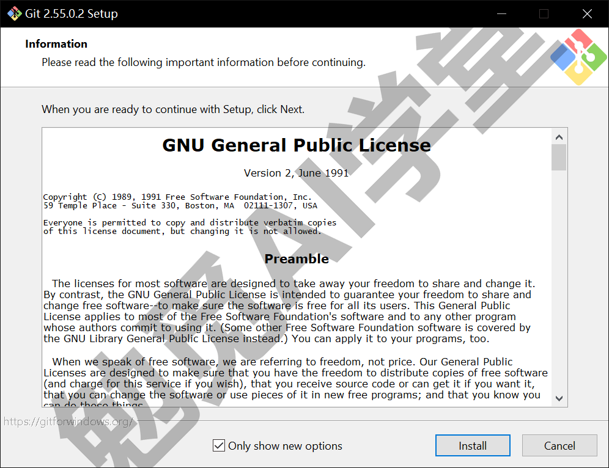

**第 3 步：确认装好了。** 这是确认步，只需要看一眼：从开始菜单打开 PowerShell（或命令提示符），输入下面这行后回车：

```
git --version
```

看到以 git version 开头的一行版本号，就说明装好了。这可能是你在本课第一次用命令行——不用紧张，只是输入一行、看一行输出。如果提示“无法将术语识别为命令”或类似报错，通常是安装后终端没重开，关掉窗口重开一次再试；仍不行就重装一遍（依旧全默认）。另一个装好的信号是开始菜单里多出 Git Bash 等新条目，看到它们也说明安装成功。

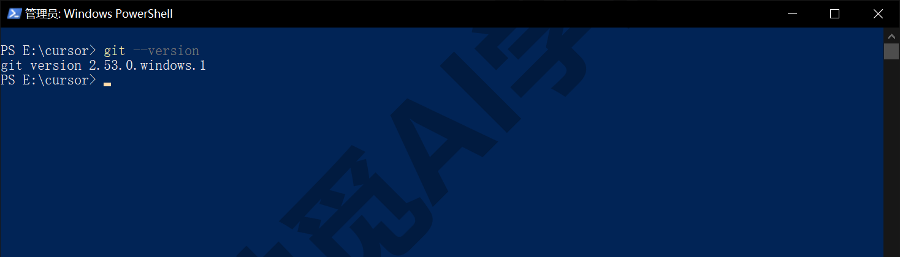

两句补充：

- **网络**——GitHub 的注册页面和 Git 的下载在部分网络环境下可能打开缓慢或不稳定，遇到就换个时段或网络环境再试，不是你操作的问题（以实际网络状况为准）；
- **范围**——不需要顺手再装 GitHub Desktop 或其他图形工具，毕业篇用不到它们。这一节要准备的就两样：GitHub 账号和 Git 本体；装多了反而增加干扰。

到此为止，不建仓库、不学概念、不碰配置——剩下的全部留给《毕业：数字花园上线》，到时候这两样东西直接派上用场。

### 14.5 数据所有权与隐私检查

发布是把笔记放上公网，和库里自用是两种性质的事。所以在真正上线之前，这一节定一个固定动作：出库前把关。检查分三步，将来每次发布前都过一遍。

**第一步，查属性——正文外面还藏着信息。**《标签与属性》讲过，属性是笔记头部的结构化字段——检查时最容易只看正文、漏掉头部。属性里常见的敏感项：私人评分和随手点评（“这书不行”写在自用库里没事，公开出去就是另一回事）、真实姓名、联系方式、工作里的内部代号。发布工具可能会把属性一并展示在页面上（以所选平台的实际行为为准），所以头部要和正文一起过。

**第二步，查内链与嵌入——别把私密笔记带出去。** 双链的方便，在发布场景会变成风险入口：一篇公开笔记里的 `[[链接]]` 指向你的私密笔记，读者顺着链接就能打开它；嵌入更直接——`![[ ]]` 把目标内容原地显示，公开页里嵌了一段日记，等于那段日记也公开了。检查办法有两个：

- 逐篇看右侧的出链面板（《双链与图谱》介绍过——这篇链出去的所有目标都列在那里），确认每个目标都是可公开的；
- 批量一点，用全局搜索加 path: 操作符把要发布的文件夹圈出来（《库、文件与搜索》练过的组合检索），搜真实姓名、项目代号这类敏感词，扫一遍有没有漏网的。

**第三步，定发布范围——用白名单思维。** 不发全库，只发明确挑出来的部分：Publish 是逐篇勾选要发布的笔记，Quartz 是圈定一个内容目录（两者的具体机制以各自当前文档为准）。拿不准的笔记一律先不发——发布随时可以补，公开出去的内容想收回就难了。给发布内容单独建一个文件夹是个省心做法：进这个文件夹的才发布，检查范围也从全库缩小到一处。

已经发出去的内容发现问题也有补救动作：Publish 里取消勾选那篇笔记即可下架，Quartz 里把文件移出内容目录、重新部署一次（下架方式与生效时间以各平台当前文档为准）。但要清楚补救的边界——搜索引擎的缓存、读者存下的副本，不会跟着你的下架消失，这正是把检查放在发布之前做的原因。

这三步不是一次性动作，每次要上新内容之前都值得重新过一遍。一个不容易遗漏的做法：在发布文件夹里放一篇“发布前检查”笔记，把三步写成 `- [ ]` 任务清单（这种可勾选的清单你在每篇的小结自检里都用过），每次发布前打开逐项勾掉，漏项的可能就小多了。

最后把这一篇的三个环节合起来看：搬家进来，你的旧笔记变成了自己硬盘上的纯文本；导出与复制文件夹，成品和全部资产随时可以带走；发布与否、发布多少，决定权和检查权都在你手里。旧笔记进得来、成品出得去、想公开时发得出——《认识与装好》承诺的“数据完全自有”，到这一篇才算展示了完整的样子。

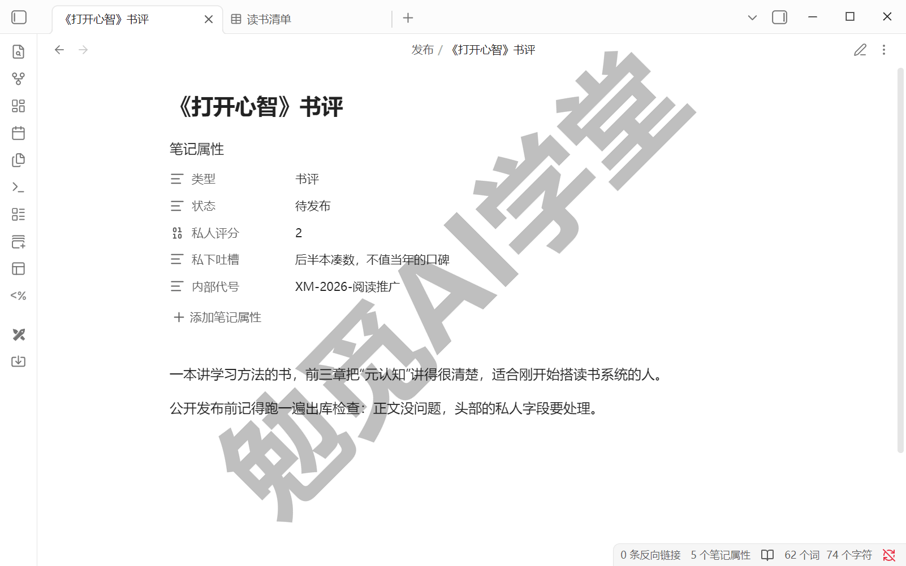

### 14.6 三个练习任务

三个任务对应本篇三个环节，用你自己的真实数据做。

**任务一：搬一次家**

用迁移助手把一批旧笔记搬进库：有 Notion 或印象笔记就搬真实的（建议先拿一个小笔记本练手），都没有就找几个 HTML 或 md 文件走一遍导入流程；搬完按 14.1 的三件事核对。

完成标准：抽查三篇搬进来的笔记，内容、图片、链接都无丢失。

**任务二：交付一篇 PDF**

挑一篇带图片的成品笔记，导出为 PDF。

完成标准：打开导出的 PDF，图片完整显示、版式可读、没有内容被截断。

**任务三：做出你的发布决策**

按 14.3 的三个问题做出发布三选一决策；选 Quartz 路线的，完成 GitHub 注册和 Git 安装验证。

完成标准：能说出自己的选择理由——和另外两条路比，你选的这条赢在哪；选 Quartz 的，`git --version` 能正常显示版本号。

### 14.7 本篇小结与自检

这一篇打通了进出通道：旧笔记用 Importer 搬进来，成品导出 PDF，发布在三条路里按预算和意愿选一条。最需要记住的是：**搬家后先核对、确认无误再删除原数据；发布前先查敏感信息；数据所有权始终在你手里——进出与发布的每一步都由你决定。**

可以对照下面的清单检查学习结果：

- [ ] 用 Importer 完成过一次搬家，并核对过结果
- [ ] 导出过一篇 PDF
- [ ] 能说出发布三条路各适合谁
- [ ] 完成了自己的三选一决策（选 Quartz 的已备好 GitHub 和 Git）
- [ ] 知道发布前要检查什么

完成这些内容后，基础功能部分只剩最后一篇。下一篇《Obsidian×Codex：让 AI 管理你的笔记库》是可选进阶：看完 Codex 课的同学，可以让 AI 接管库里的重复性工作。

### 14.8 新手常见问题

**Q1：Notion 的数据库搬过来会变成什么？**

看你走哪条路线。账户直连（API）路线会把每个数据库转成一个同名文件夹加一个 .base 文件，打开就是《Bases 数据库》里那种可筛选排序的表格，但只保留主视图；文件导入（zip）路线不保留数据库，内容会以普通页面形式进来（具体形态以导入结果为准）。数据库多的用户建议走 API 路线。

**Q2：搬家时附件会丢吗？**

正常情况下图片等附件会随导入一起进库（存放位置以导入结果为准），但这正是“搬完核对”要盯的重点：抽查带图笔记确认显示正常。另外注意，附件只搬包里有的——旧平台里引用外部网络图片的笔记，图片本体不在导出包里，能否显示取决于原链接是否有效。核对无误前源数据不删，就算真丢了也补得回来。

**Q3：不发布、只自己用，这篇要学吗？**

搬家和导出对所有人都有用——旧笔记进库是一次性的大收益，PDF 交付则是日常需求。发布部分只需要做到“知道有三条路”即可，14.4 的准备工作可以整节跳过，毕业项目里的建站内容也可以只大致浏览；将来哪天想公开写作了，回来照着走就行。

**Q4：发布出去的内容能被搜索引擎搜到吗？**

公开网站默认是可能被搜索引擎收录的——这正是发布的意义，也是 14.5 坚持发布前检查的原因。各平台一般提供收录控制的选项（是否允许、站点级还是页面级，以 Publish 与 Quartz 的当前文档为准）。稳妥的原则不变：拿不准能不能公开的内容，先不发。
