## Obsidian×Codex：让 AI 管理你的笔记库

《库、文件与搜索》讲透了一件事：库就是你硬盘上的一个普通文件夹。顺着这一条往下推——能读写本地文件的 AI，自然也能替你打理这个文件夹。这一篇就做这件事：把批量补属性、打标签、按模板建卡、生成 MOC、定时晨报这些重复劳动交给 Codex，同时定好纪律，守住数据自有的底线。

先说清定位：**本篇是全课唯一的可选付费篇**，需要 ChatGPT 订阅（费用以官方页面为准）；零成本主线不依赖本篇，跳过它，后面每一篇照样能完整学完。本篇默认你已经会用 Codex——装好了、会发任务、懂权限档位；还没接触过的读者，可以先从 Codex 课《认识与装好》入门，也可以先跳过本篇、需要时再回来。

### 15.1 联动原理与动库三纪律

为什么这两个工具天生能联动？把两边的本质各理一遍就清楚了。Obsidian 这边，《认识与装好》讲过的三大理念里，“纯文本 md”一条说的就是：你的每篇笔记都是硬盘上的 md 文件，属性是文件头部的 YAML 键值，模板、日记、MOC 也全是普通文本文件。Codex 那边，Codex 课《文件能力一集讲全》专门讲过它读写本地文件的能力：批量重命名、按内容归类、格式转换，都是它的基本功。一边是“一切皆文件”，一边是“会动文件的 AI”——把库文件夹设为 Codex 的项目，联动就通了，不需要任何插件，也不需要中转软件。具体操作就是 Codex 课教过的建项目：输入框下方点项目选择器，“新建项目”，把库文件夹加为源文件夹。建好后发第一个任务试试水——只读不改，让它列一遍目录结构：

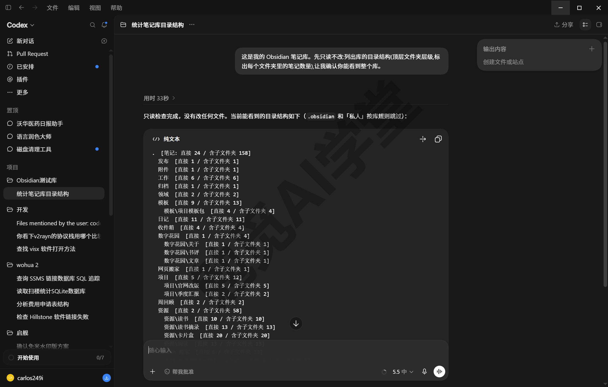

图：首次对话它就自带规矩——回复开头声明“.obsidian 和‘私人’按库规则跳过”，这是 15.3 要写的 AGENTS.md 在起作用；此时库根已放好那份文件。

联动是通了，但不等于可以放开手脚。你的库存着几年的积累，AI 批量操作一旦出错，波及的是几十上百个文件。所以动手之前，先定好三条纪律——这三条会贯穿本篇每个案例，也写进篇末的练习任务。

**纪律一：动库前先备份。**《同步与备份全解》定过的习惯在这里升级成硬要求：重大操作前先整库备份，而让 AI 批量改文件，每一次都算重大操作。库就是文件夹，复制一份即完成备份，几十秒的事；放桌面、移动硬盘、另一个盘符都行，关键是改坏的那一刻手边有一份完好的。同步不能替代备份——同步会原样把错误改动传到每一端。会用 Git 的读者还有一条顺路的做法：Codex 课《自动化、Git 与远程操控》讲过它带 Git 版本管理能力，用它给库做版本快照，改坏了能精确回滚（本课不展开，走整库复制路线即可）。

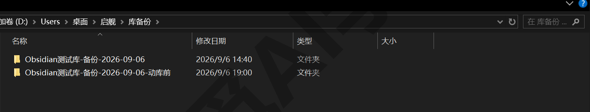

**纪律二：权限不给满。** Codex 课《权限、沙盒与模型》定过的原则在这里照用：批量操作恰恰是最需要“改之前看一眼”的场景。桌面版把批准方式做成了两档，点输入框旁的“帮我批准”就能切换：**请求批准**——编辑项目外文件和使用互联网时始终询问；**帮我批准**——仅对检测到的风险操作请求批准。头几次执行批量任务建议用请求批准，眼见它每一步都符合预期，再换帮我批准提速。另外每次批量改动它都会生成一张改动卡片，改了哪些文件、加删多少行逐条可看，还带“撤销”和“审核”按钮——这层保险 15.2 做完你就会见到。

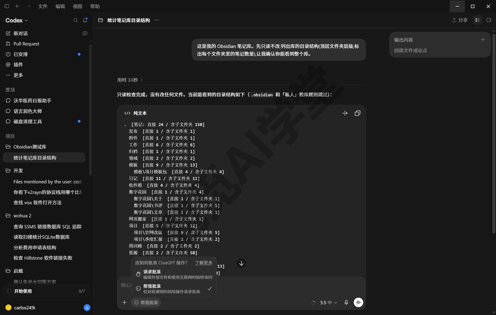

**纪律三：配置是禁区。** 库里的 .obsidian 文件夹存着这座库的全部配置——界面设置、插件、主题、快捷键。它不是笔记，AI 不需要读它，更不能改它：配置文件坏一个，库的表现就会变得古怪、很难排查。这条禁区不能只靠嘴上说，15.3 会把它写进 AGENTS.md，让 AI 每次开工都先看到。同理，“图片和附件”这类附件文件夹也别让它随意改名移动——《双链与图谱》讲过链接指向文件名，附件动了名，正文里的引用就对不上了。

三条纪律都定好了，再交代一次本篇的定位：这是可选进阶篇。不用任何 AI，你的库照样完整运转——前面十四篇搭起来的体系没有一处依赖本篇；用了，它们就是省下大把时间的加速器。

### 15.2 案例一：批量整库

第一组案例解决最常见的痛点：旧笔记攒下的欠账。《标签与属性》之后你养成了打属性的习惯，但更早的几十篇旧笔记属性还是空白；《移动端与网页剪藏》之后收件箱进得快、清得慢。这类“每篇都要做一遍、每遍都一样”的事情，正是 AI 的长项。

**批量补属性。** 先做纪律一的备份，然后把库文件夹设为 Codex 项目，发送下面的提示词（文件夹名按你的库改）：

```
先读一遍「收件箱」文件夹里的全部 md 笔记,只读不改。
然后给每篇笔记的 frontmatter 补上三个属性:
状态(文本,值从 未整理/已整理 里选)、主题(文本,按内容概括成一个词)、
创建日期(日期,格式 YYYY-MM-DD,取文件本身的创建时间)。
已有同名属性的一律不覆盖。改完输出一张「文件名+补了什么」的清单。
```

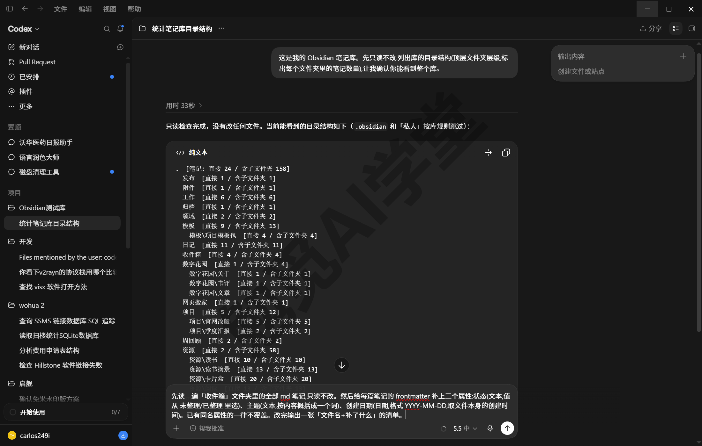

发送后按批准档位逐步确认或审查改动。做完回 Obsidian 抽查几篇：属性面板里“状态”应显示为文本、“创建日期”应显示为日期——Codex 写入的 YAML 能否被属性面板识别成正确类型，是本案例的关键验收点。课程实拍这一次用了 56 秒：四篇各补三项、原有属性一项没动，回 Obsidian 看“创建日期”前是日历小图标——日期类型识别正确。类型不对的，回《标签与属性》讲过的属性面板改类型，或让 Codex 按正确格式重写。

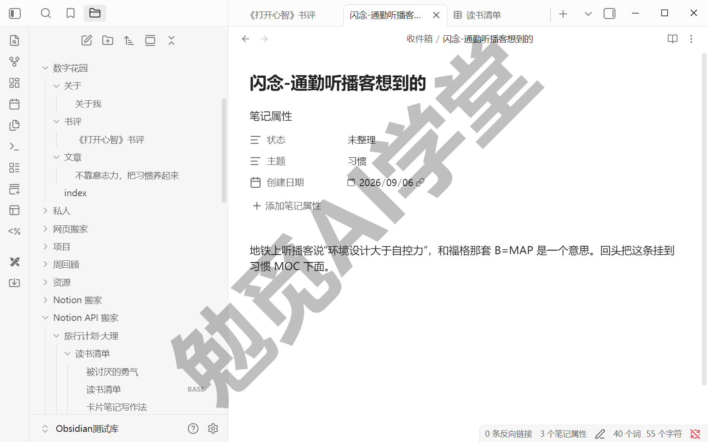

**批量打标签**，做法相同：把要求换成“在每篇的 tags 里追加 书/未分类，已经带有 书 系列标签的跳过”即可，嵌套标签写法沿用《标签与属性》定下的体系。

**按模板批量建卡。**《日记、模板与每日工作流》做过模板，AI 能拿它当图纸批量生产。比如给书单里的每本书生成一张文献卡：

```
读「书单.md」里的书名清单,按「模板/读书模板.md」的格式,
在「读书笔记」文件夹里为每本书各生成一张笔记:
文件名用书名,模板里的 {{title}} 替换成书名,其余属性留空待我补。
```

做完你会看到文件夹里多出一批格式统一的新卡片，属性齐、结构同，省下的是逐张复制模板的机械劳动。

**自动生成 MOC。**《双链与图谱》教你手工建 MOC，几十篇的主题一条条手工加链接会很累，交给 AI：

```
扫描「读书笔记」文件夹,生成一篇「读书笔记 MOC.md」放在库根:
按主题分组列出全部笔记,每条用 [[文件名]] 双链格式,链接后加一句十字以内的介绍。
文件名里的空格和标点保持原样,绝对不要改动文件名。生成后把分组结构报给我。
```

生成后必须核对一遍：在 Obsidian 里打开这篇 MOC，逐条点链接——正常链接是常规颜色，指向不存在文件的链接是浅色的“未创建”样式。有浅色断链的，往往是 AI 写链接时改动了文件名的空格或标点，让它对照实际文件名修正。

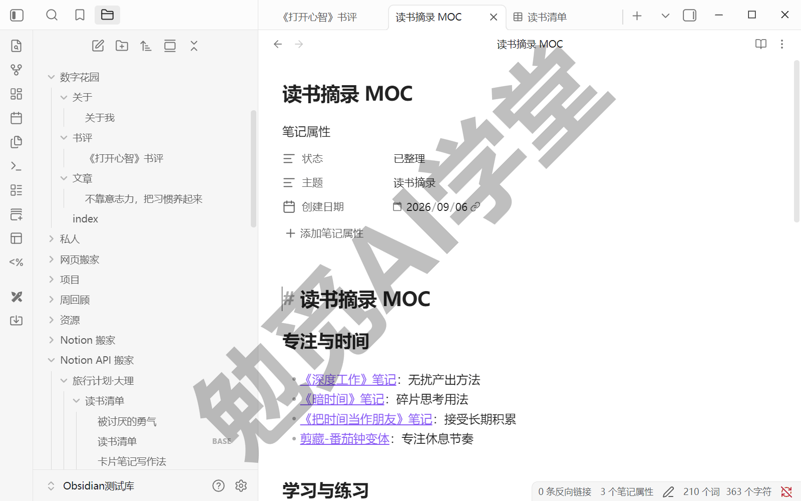

提示词里那句“绝对不要改动文件名”是特意加上的，这就是本案例要当场复现的大坑。

**大坑：外部改名，双链会断。**《双链与图谱》讲过“改名不断链”——重命名笔记，全库链接自动更新。但那条机制只在 Obsidian 应用内改名时触发；让 Codex 在外部把“读书 笔记 3.md”规范成“读书笔记3.md”，库内所有 `[[读书 笔记 3]]` 立即变成浅色断链，点一下还会新建出一篇空笔记。课程当场实测：Obsidian 开着时在外部改掉一篇的文件名，MOC 里那条链接几秒内就地褪成浅色“未创建”样式，和上下正常链接一对比非常扎眼。兜底有两条：

- **改名交给 Obsidian 做**：批量整理时明确告诉 AI 不许改文件名；确要改名，在 Obsidian 里逐个右键重命名，让自动更新机制发挥作用；
- **已经在外面改了名**，让 Codex 拿新旧文件名对照清单全库搜索替换：

```
「读书笔记」文件夹刚才有一批文件改过名,新旧对照清单如下:[粘贴对照清单]。
请全库搜索正文里出现的 [[旧文件名]] 双链,逐一替换成对应的 [[新文件名]],
只改双链文本,不动其他内容,改完报替换数量。
```

（方括号里的内容换成你自己的。）另一条相关的稳妥习惯：AI 批量动库时，别同时在 Obsidian 里编辑同一批笔记——正在编辑的文件被外部改写，两边改动可能互相覆盖，批量任务跑着的那几十秒管住手就好。改动面大的整理（比如重排整个目录结构），还可以先用计划模式对齐方案：Codex 课《计划模式》讲过它先出完整方案、你点头后才动文件，批量场景里这层保险很值。

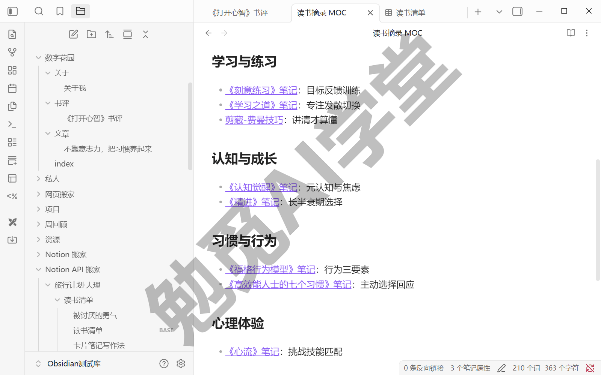

图：外部改名的现场——“剪藏-费曼技巧”那条已褪成浅色“未创建”样式，上下几条正常链接颜色饱满。

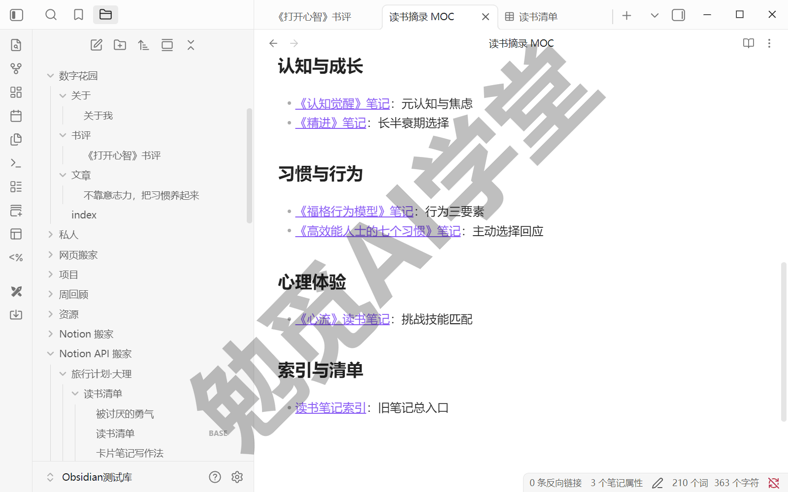

图：对照组——在 Obsidian 内把《心流》笔记改名成《心流》读书笔记，MOC 里这条链接原地跟着改、颜色照旧、点开即达。

### 15.3 案例二：把库变成 AI 能懂的知识库

第二组案例换个方向：不让 AI 改库，而是让它读懂库、回答你。这一组的地基是一份放对位置的说明书。

**AGENTS.md 放库根。** Codex 课《AGENTS.md、Diff 与还原》讲过这份文件的机制：放在项目文件夹里的工作规则，AI 每次在这个项目里工作都会先读它、按它办事。把库设为项目，库根的 AGENTS.md 就成了你这座库的总规矩：目录结构、标签体系、笔记规范、禁区，一次写清，之后每个任务它都记得。下面这份模板按本课前十四篇搭的库结构写成，照抄后按你的实际情况改（文件夹名、标签体系换成你自己的）：

```
# 笔记库工作规则

## 库的结构
- 「日记」:每日一篇,文件名 YYYY-MM-DD.md,由日记插件自动生成。
- 「读书笔记」「项目」「写作」:按主题归档的正文笔记。
- 「收件箱」:待整理的闪念笔记,处理完移出。
- 「模板」:模板文件,只许读取参照,不许修改。
- 「图片和附件」:附件目录,不要改名、移动或删除其中任何文件。

## 笔记规范
- 每篇笔记的 frontmatter 至少含「状态」属性;标签用中文嵌套形式,如 书/在读。
- 新建笔记用简体中文命名,不用特殊符号,不与已有笔记重名。
- 库内引用一律写 [[完整文件名]] 双链,不用相对路径。

## 禁区(触碰前必须停下来询问)
- .obsidian 文件夹绝对不碰:不读、不改、不删。
- 不删除任何笔记;需要清理时,移动到「归档」文件夹代替删除。
- 「私人」文件夹不读取、不引用、不总结。
- 批量改名前必须先列出清单征得同意。
```

写完发个任务验收：

```
读一遍库根的 AGENTS.md,复述你在这座库里的行为边界。
```

复述里应完整出现禁区条款，尤其 .obsidian 那条——15.1 的纪律三从这一刻起不再只靠口头叮嘱。约束效果课程全程可查：本篇开头那次“列目录结构”，它没等提醒就自动声明“.obsidian 和‘私人’按库规则跳过”——AGENTS.md 是每个任务开工前真的会读的。

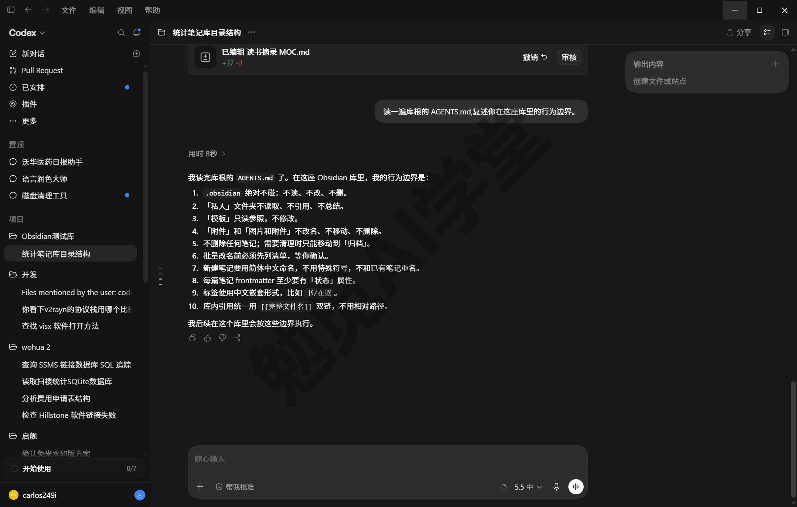

**检索问答：让它翻库答题。** 规矩定好，就能把库当成 AI 的资料室用了：

```
根据「读书笔记」文件夹里的全部笔记,总结我读过的书里关于「习惯养成」的观点:
分点列出,每一点后面用 [[文件名]] 标明出处;只用库里的内容,不要外部补充。
```

它会通读文件夹、汇总出观点清单，每条都带出处双链——这是比全局搜索高一层的检索：《库、文件与搜索》的搜索帮你找到“哪篇提过”，这里直接把散在多篇里的说法归纳成答案，且来源可查、点开就能回到原文核对。“只用库里的内容”这句要保留，否则它可能混入网上的资料，答案就不再是“你的笔记的总结”了。

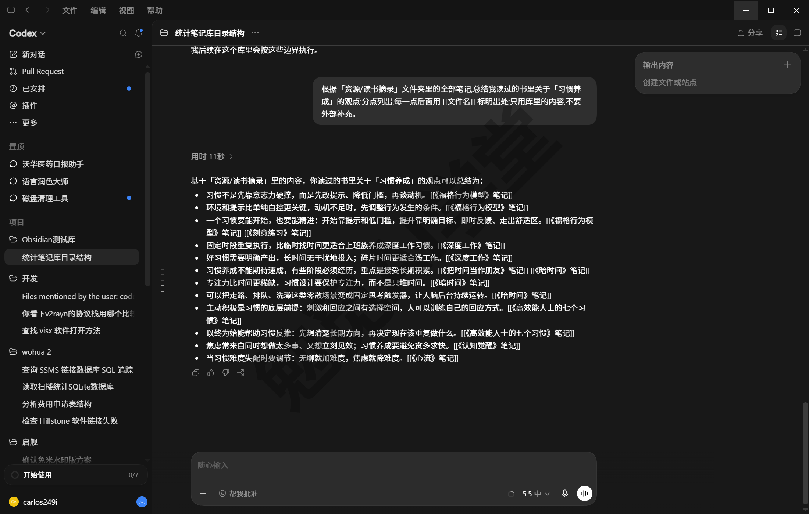

**从卡片攒出草稿。** 再往前一步，读完还能写回来：

```
把「写作」文件夹里带 #写作/习惯 标签的卡片串成一篇 800 字左右的文章草稿,
保存为「草稿-习惯养成.md」放进「写作」文件夹,每段末尾标注用到的卡片双链。
```

这条路线在《卡片盒写作系统》的实战里还会正式用上，这里先知道有这扇门。

**边界：库大了别让它一次读全。** Codex 课《上下文与记忆》讲过：模型一次能装下的内容有限，超出就会漏掉内容。几十篇的文件夹随便读，几百上千篇的库就该先圈范围——按文件夹、按标签、按文件名模式缩小到几十篇以内再问（大库检索的实际表现与耗时，以实机为准）。问不动、答非所问时，第一反应就是把范围切小。

### 15.4 案例三：定时晨报写进日记

第三组案例把“你发任务它执行”升级成“到点自动执行”。目标：每天早上打开 Obsidian，当天的晨报已经在日记文件夹里。

**先在对话里把流程调完美。** Codex 课《自动化、Git 与远程操控》定过自动化的方法论：先在对话里手工跑通、把格式调满意，再固化成定时任务——一上来就直接建定时任务，出了错都不知道错在哪一环。先手工跑：

```
帮我查今天的 AI 行业新闻,挑 3 条,每条一句话说清发生了什么,并给出来源链接。
输出成 md 格式:一级标题为「晨报 2026-08-24」(用当天日期),每条新闻一个列表项。
```

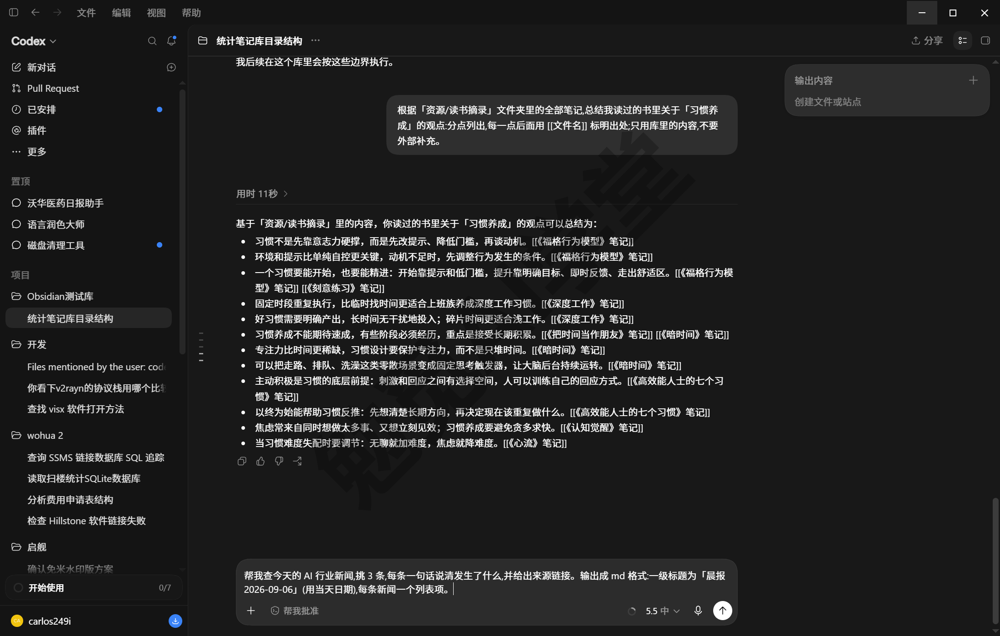

看结果：新闻挑得好不好、格式是不是你要的，来回改到满意为止。主题不必是 AI 新闻——行业动态、天气加日程、你关注的任何信息源都行，调的是同一套流程。

**再固化成定时任务。** 格式满意后，把整套要求交给定时任务：

```
把刚才这套晨报流程固化成定时任务,每天早上 7:30 执行一次:
查当天新闻挑 3 条,按刚才调好的格式写成 md,
保存到「日记」文件夹,文件名「晨报-当天日期.md」;文件已存在就追加,不覆盖。
创建后立即运行一次测试。
```

发出去它就把任务建好了：回复里给出任务名、状态和执行时间，对话里出现一张任务卡片，点“打开”能看到完整配置——运行于哪个项目、用什么模型、重复频率、执行时间、通知方式，都能改；以后要暂停、删除，去侧栏“已安排”里管理。提示词末尾那句“创建后立即运行一次测试”是特意加的：不用等到明早，当场就能验收——课程实拍里测试跑完，日记文件夹里立刻多出“晨报-2026-09-06.md”，标题、条数、来源链接全符合调好的格式；次日起每天 7:30 自动执行。喜欢把晨报并进当天日记的，把提示词里的保存目标改成“追加到当天日记文件的晨报小节”即可。同一套方法照搬就是周报：每周一早上读上一周七篇日记，生成周回顾草稿放进收件箱——《日记、模板与每日工作流》的每周回顾从此有了自动化的初稿。

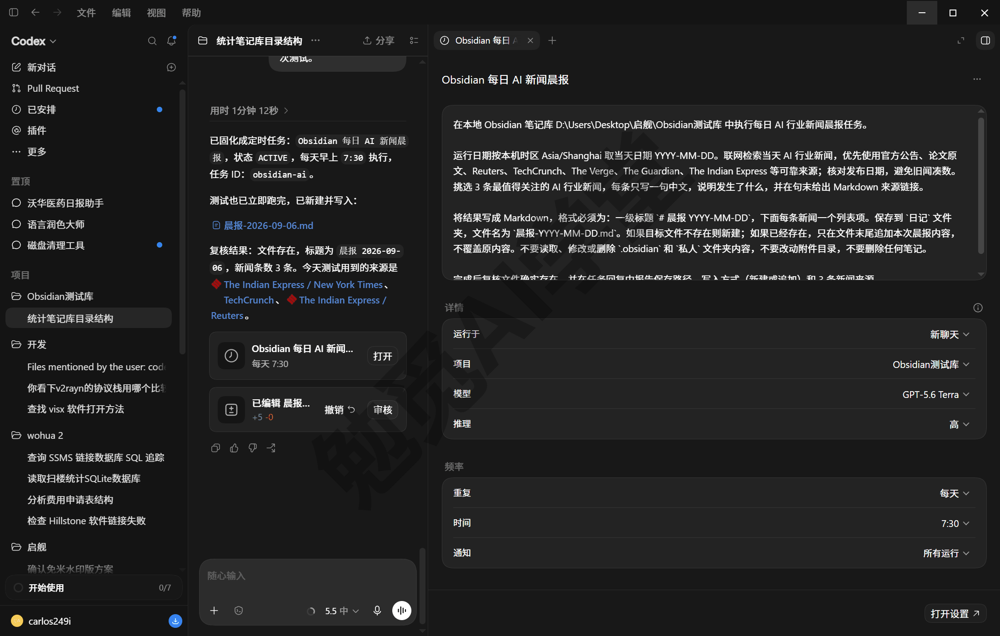

图：任务卡片点“打开”后的配置画面，频率、时间、运行项目都能改；日常管理入口在侧栏“已安排”。

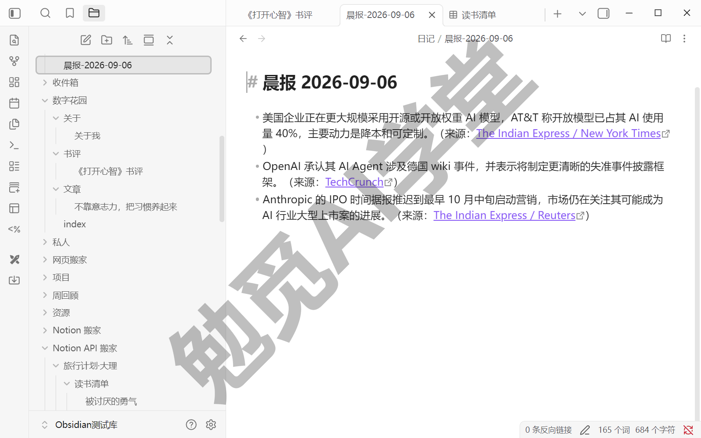

图：创建后立即运行的那次测试——“晨报-2026-09-06”已进日记文件夹，三条新闻各带来源链接；正式节奏是次日起每天 7:30 自动写入。

**顺带两个轻量场景**，都是前面能力的直接复用：

- **剪藏批量清洗**：《移动端与网页剪藏》的 Web Clipper 用熟之后，剪藏往往堆得比整理快。这正是 15.2 批量整库的场景：让 Codex 把剪藏文件夹里的网页笔记按主题补属性、打标签、移进对应文件夹，提示词照 15.2 改文件夹名即可；
- **代写 Dataview 查询**：《Dataview 专讲》的查询语法记不住？说需求让它写：

```
帮我写一段 Dataview 查询:列出「项目」文件夹里「状态」属性不是「已完成」的笔记,
显示文件名、优先级、截止日期三列,按截止日期从近到远排序。只给代码块,不加解释。
```

拿到代码块粘进笔记就能跑——但有一条纪律：**AI 给的每段查询，都要在你的库里实际跑通、结果对得上，才算可用**。跑不通就把报错贴回去让它改，这个来回通常一两轮就能改好。

### 15.5 取舍与边界：用 Codex 还是装 AI 插件

学完三组案例，绕不开一个现实问题：《社区插件系统》打开的插件市场里也有一批 AI 插件，和外部的 Codex 是什么关系、该用哪个？先把生态的现状交代清楚（以下按 2026-08 的生态现状书写；插件生态变化快，名单与形态以你装的时候的实际为准）。

Obsidian 这边的 AI 插件如今分两种形态，加上本篇教的外部路线，一共三种形态摆在你面前：

**形态一：传统形态插件——库内问答与语义检索。** 代表如 Smart Connections 这类：在 Obsidian 侧栏里做“和当前笔记相关的笔记”推荐、库内语义检索、就地问答，不少由本地模型驱动，零配置、不需要另买订阅（各款的模型来源与配置要求逐款核对，以实际插件页面为准）。它适合的场景是“写着写着想找相关内容”的轻量检索，做不了批量改文件、定时任务这类重量级工作。

**形态二：内嵌 agent 形态插件——把 Codex 装进 Obsidian 窗口。** 插件生态的新变化：以 Copilot 为代表的头部插件，已把 Claude Code、Codex 这类智能体原生嵌进 Obsidian 界面，接上 ChatGPT 订阅时，插件里跑的就是同一个 Codex，不用切出窗口（agent 模式暂限桌面端；插件名单与实际能力以插件页面为准）。它和本篇教的外部 Codex 能力高度重叠、花的是同一份订阅，区别在中间多了一层插件：界面更方便，但权限控制与改动审查隔了一层，透明度不如外部直接管理。选这条路的读者，15.1 的三条纪律原样适用。

**形态三：外部 Codex 直接管理——本篇主线。** 批量文件操作、跨库与库外的自动化、定时任务，这些都是它的强项；权限档位、逐步确认、改动审查全在 Codex 自己的界面里，看得最清楚、管得最细。

三种形态怎么选，判据就四条：数据边界（内容去哪了）、订阅成本（要不要多花钱）、可控性（改动看不看得住）、学习成本（要不要再学一套）。拿着这四条对需求：

- 要批量整库、跨库与库外自动化、定时联动——用形态三，权限档位与改动审查最透明；
- 只要写作时的库内检索和相关笔记推荐、不想新增任何花费——用形态一；
- 已有 ChatGPT 订阅、想留在 Obsidian 窗口里直接用 agent——形态二更方便，代价是中间隔了一层插件。

本课主线只教形态三——原理和三条纪律是通用的，主线学会了，哪种插件形态上手都是换个入口的事。正文不锁定任何插件的具体版本与界面，装之前按《社区插件系统》教的信任判断流程自己过一遍。

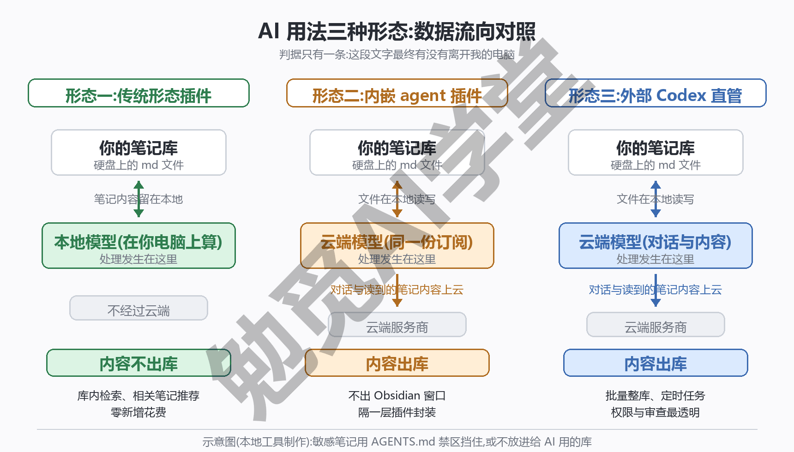

最后把数据边界讲透，判断标准只有一条：**看内容到没到云端**。外部 Codex 在你本地读写文件，但你发给它的对话、它读进去的笔记内容，是送到云端模型处理的——这是 Codex 课《毕业项目：品牌桌宠 + 课程总结》交代过的数据去向：文件在本地处理，对话与模型在云端。所以敏感笔记不交给它：财务、隐私、他人信息这类内容，用 AGENTS.md 的“私人”文件夹禁区挡住，或者干脆不放进给 AI 用的库。插件那边用同一条标准：传统形态里走本地模型的，内容不出库；配自家 API key 的，内容去了对应服务商；内嵌 agent 形态接的是同一批云端订阅，内容照样出库。不管中间隔了几层软件，判断办法都是同一个：问一句“这段文字最终有没有离开我的电脑”，答案清楚了，数据边界也就清楚了。至于各家服务的训练开关在哪、授权怎么撤销，以你所用服务的实际界面为准。

到这里，《认识与装好》定下的“本地优先”终于讲齐了完整的答案：笔记永远是你硬盘上的纯文本，AI 只是可选的帮手——用不用、用哪种形态、给它读哪些内容，决定权从头到尾都在你手里。

### 15.6 三个练习任务

三个任务对应三条纪律和两组案例，做前先完成一次整库备份；提示词里方括号的内容换成你自己的。

**任务一：把动库的规矩写成 AGENTS.md**

照 15.3 的模板给库根写一份 AGENTS.md，禁区按你的库改写，然后让 Codex 复述：

```
读一遍库根的 AGENTS.md,用自己的话复述:哪些文件夹能动、哪些是禁区、
删除和改名分别要走什么流程。
```

完成标准：复述里完整出现禁区条款（.obsidian 不碰、不删笔记、私人文件夹不读）。

**任务二：批量补属性**

整库备份后，让 Codex 给一批旧笔记补属性：

```
给「[你的文件夹名]」里最旧的 10 篇笔记补 frontmatter 属性:
状态(文本)、主题(文本)、创建日期(日期,格式 YYYY-MM-DD)。
已有同名属性的不覆盖,改完列一张清单给我。
```

完成标准：属性面板里类型识别正确，抽查三篇内容无误。

**任务三：生成 MOC**

选一个笔记较多的文件夹，让 Codex 生成 MOC：

```
扫描「[你的文件夹名]」,生成「[文件夹名]MOC.md」放在库根:
按主题分组列出全部笔记,每条用 [[文件名]] 双链并加一句介绍,不许改任何文件名。
```

完成标准：MOC 里每条链接都能点开，没有浅色的“未创建”断链。

### 15.7 本篇小结与自检

这一篇把库里的重复劳动交给了 AI：批量整理、模板建卡、生成 MOC、定时晨报。最需要记住的是：**动库先备份、权限不给满、配置不许动——三条纪律都守住，AI 才是帮手；敏感笔记不给 AI 读，数据始终由你做主。**

可以对照下面的清单检查学习结果：

- [ ] 能说出动库三纪律
- [ ] 库根有一份含禁区的 AGENTS.md
- [ ] 让 Codex 完成过一次批量补属性，并抽查无误
- [ ] 知道外部改名的断链坑和两条兜底办法
- [ ] 拿到一个需求，能说出该用 Codex 还是 AI 插件

完成这些内容后，第一部分基础应用全部学完。下一篇《个人知识库从零搭建》进入深度实战：从零交付一座立刻能日常运转的个人库。

### 15.8 新手常见问题

**Q1：没订阅 ChatGPT，影响学后面的内容吗？**

不影响。本篇是全课唯一的可选付费篇，实战五篇的主路线都不依赖 AI：《个人知识库从零搭建》的旧笔记迁入走官方 Importer 和手动整理，《工作项目管理库》的周报正式方案是 Dataview 查询，AI 联动在那些篇目里只标注为可选加速项。先把主线学完，将来有真实需求再回来看这一篇不迟。

**Q2：Codex 会把我的笔记传到哪里？**

文件的读写发生在你本地，但你发的对话和它读到的笔记内容会送云端模型处理——这是 15.5 算过的账：判断标准只有“内容到没到云端”。所以敏感内容别放进给 AI 用的范围：用 AGENTS.md 划出不读取的禁区文件夹，或者干脆另建一座不接 AI 的库。训练开关与授权管理的入口，以你账号页面的实际界面为准。

**Q3：让它改坏了库怎么办？**

三条纪律就是为这一刻准备的。动手前的整库备份是最后的后悔药，真改坏了就用它把整个库换回去；只坏了几篇的，《同步与备份全解》讲过文件恢复核心插件的快照能单篇找回；Codex 那边还有一层保险——Codex 课《AGENTS.md、Diff 与还原》讲过它的改动审查面板，每个文件改了什么逐条可看、可还原，这也是纪律二不给完全访问的原因：改动要过你的眼睛。

**Q4：Obsidian 的 AI 插件和 Codex 学一个就够吗？**

先学本篇的外部 Codex 路线就够——原理（库是纯文本文件夹）和三条纪律是三种形态通用的底子。之后按需求补：只想要写作时的库内语义检索，装一款传统形态插件即可，不用会 Codex；已经有 ChatGPT 订阅、又想不离开 Obsidian 窗口操作，可以试内嵌 agent 形态的插件，纪律照旧。插件名单和形态变化快，装之前按《社区插件系统》的信任判断流程核一遍现状。
