## 个人知识库从零搭建

从这一篇开始进入深度实战：每篇交付一个完整项目，不再一节讲一个功能。第一个项目，把前面学到的组织方式、双链、属性、模板和导入能力拧成一股绳，从零搭起一座“立刻能日常运转”的个人知识库。

它也是后面四个项目共用的地基：《读书笔记系统》《卡片盒写作系统》《工作项目管理库》都建在这座库上，一路延伸到《毕业：数字花园上线》的公开知识站。

### 16.1 项目定位：一座能运转的库

**先看三种常见的失败情形**

不少人搭了库却用不起来，情形大多是下面三种：

- **只往里放，不往外取**：剪藏、摘录不停进库，却从不回看、从不使用，库成了第二个收藏夹，攒得越多，越不会去翻。
- **目录越分越细**：开工先设计“完美目录”，文件夹一层套一层，规则越定越多；三周之后，连自己都记不清哪篇笔记该放哪、放过哪。
- **模板做了一堆，没有一张常用**：花很多时间研究模板，一口气做了七八张，结果没有一张天天在用；库还没用起来，先攒了一堆工具。

这三种情形的原因是同一个：把“搭一座库”理解成了“把功能都用上”。这一篇的目标只有一个：搭一座能运转的库。判定“能运转”的标准也先交代清楚，16.7 会正式验收：三天不整理也不乱，要找的东西三步之内找到。

**这次要交付什么**

项目做完，你手里会有四样东西：一套简化 PARA 目录骨架，每篇笔记有明确去处；三张天天用得上的核心模板（日记、闪念、领域笔记）；一页首页 MOC，打开库直达当前事项；旧笔记迁入完成，链接和附件完好。四样合起来，就是一座当天能用、以后能扩展的个人库。

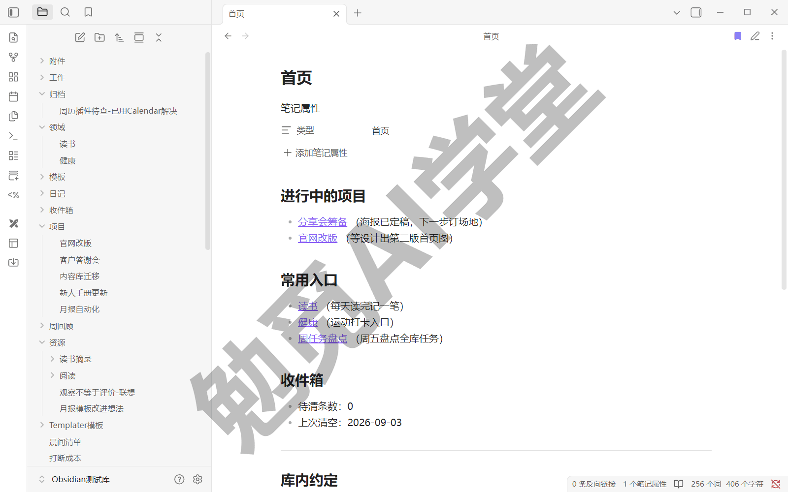

**实战篇怎么学**

本篇几乎不出现新功能。组织方式和搜索是《库、文件与搜索》的，MOC 和双链是《双链与图谱》的，字段设计是《标签与属性》的，三张模板的底子是《日记、模板与每日工作流》的，旧笔记搬家是《导入、导出与发布》的。这一篇看的是它们怎么组合成一座库：什么位置该用哪个能力、能力之间怎么衔接。行文里用到哪个点名哪个，细节记不清，回对应那一篇补课即可，这里不重复展开。

**这一篇怎么跟**

节奏上给两条建议。一条是先通读再动手：项目篇环环相扣，16.2 定的约定决定 16.3 的模板字段，16.4 的首页要等 16.5 的旧笔记挂进来才算真正用起来。先看完全程再开工，知道每一步在整个项目里的位置。

另一条是不必一口气做完。16.2 到 16.4（方案、骨架、首页）一个晚上可以走完；16.5、16.6 的迁入和救场另找一段整块时间；16.7 的演练本来就要跑一天加一周。库就在你硬盘上，今天搭一半，明天接着搭，什么都不会丢。

**动手前提**

两样东西。第一样是你的课程库：从《认识与装好》建起、一路用到现在的那座，《日记、模板与每日工作流》里建的日记、收件箱、模板、周回顾四个文件夹应该都在，本篇直接在它上面动工，不新建库。第二样是旧笔记的导出包（Notion 或印象笔记），16.5 才用，现在不急着导；手头没有旧笔记的读者也不影响跟课，16.5 开头有交代。

### 16.2 组织方案设计：简化 PARA 落地

**不新建库：单库原则先落定**

动工前先回答一个绕不开的问题：“正式的知识库，要不要专门新建一座？”不要。《库、文件与搜索》定过的结论在这里正式启用：默认单库，只有两批笔记之间永远不需要互相链接、互相搜索时，分库才不亏。你的日记、闪念、读书笔记之间恰恰最需要互相链接，所以本项目一库到底，就在现有的库里搭骨架。

**简化 PARA：四个顶层文件夹**

PARA 是一套流传很广的数字信息组织法，名字取四类容器的首字母，按“可行动性”给所有笔记分家。这个词不必记，四类容器要记：

- **项目（Projects）**：有明确目标、有大致期限的短期事务，比如“装修卫生间”“写调研报告”“做完这门 Obsidian 课”。每个项目一个子文件夹，做完就搬去归档。
- **领域（Areas）**：没有截止日、要长期维持标准的责任田，比如健康、财务、本职工作、家庭。领域没有“做完”这一说，衡量它的标准是维持得怎么样。
- **资源（Resources）**：不承担责任、单纯感兴趣的主题积累，比如摄影、菜谱、行业资料。将来某天可能升级成项目或领域，现在先攒着。
- **归档（Archives）**：前三类里不再活跃的东西，比如完结的项目、卸任的领域、失去兴趣的资源。不删除，只挪走，眼不见但找得回。

课程给它加了“简化”两个字，简化在两处。层级上，只取四个顶层文件夹，往下两三层封顶，这是《库、文件与搜索》定调的浅结构，深一层的分类不归文件夹管。分工上，PARA 在这座库里只回答“存在哪”一件事，别的问题交给下一段的分工表。

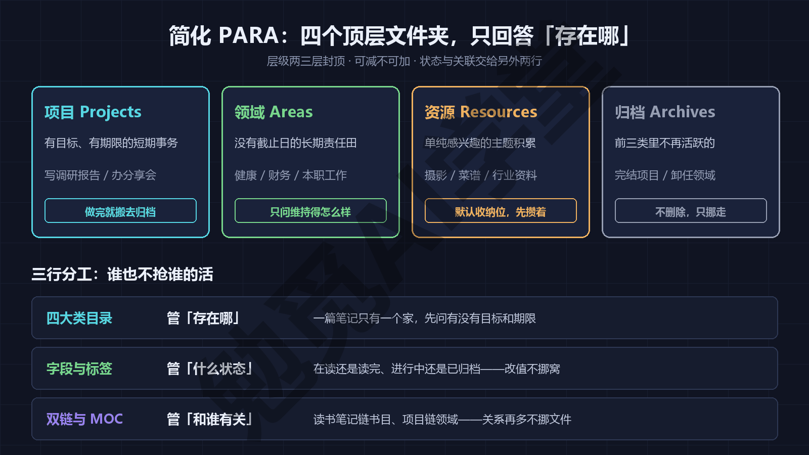

**只许减，不许加**

四大类允许裁剪，方向只有一个：可减，不可加。暂时没有长期责任要维护的读者（比如在校学生），领域可以先并进资源，三类起步；等“要长期维持的一摊事”真出现了，再拆出来。反过来加第五类不行：四类是按“要不要行动、多久行动”划分的，任何一条笔记都落得进去；每加一个顶层类，“放哪”就从四选一变成五选一、六选一，分类成本一路回升，16.1 里“目录越分越细”那种情形就是这么来的。拿不准放哪类的判断办法，篇末常见问题有现成的两问。

**三种组织方式在这座库里各管什么**

《库、文件与搜索》定过全课的组织路线：文件夹保持浅结构只管粗归属，会变的状态交给标签与属性，知识之间的关联交给双链。落到这座库，就是一张三行分工表：四大类目录回答“存在哪”，一篇笔记只有一个家；字段和标签回答“什么状态”，在读还是读完、进行中还是已归档，改值不挪窝；双链和 MOC 回答“和谁有关”，读书笔记链向书目、项目笔记链向领域，关系再多也不用挪文件。三行各司其职，谁也不抢谁的活，是这座库“三天不整理也不乱”的根本原因：新笔记进来，归属、状态、关联三个问题各有各的答案，不需要一个完美位置同时回答三件事。

**把字段与标签的约定写下来**

最后把字段定下来。《标签与属性》给过判断标准：将来要排序、筛选、计算的信息进属性，只是圈个类别的贴标签。这座库接下来要支撑《读书笔记系统》的书架视图和《工作项目管理库》的自动周报，全靠字段有账可查，所以约定如下：项目、领域、资源三类里积累下来的知识笔记（课程叫它“正式笔记”，与日记、闪念这类流水笔记相对），三个字段必填：类型、状态、日期。流水笔记维持《日记、模板与每日工作流》的轻做法，只贴标签，不填字段。

约定全文四条，先照抄存进收件箱，16.4 建首页时贴上去：

```
库内约定
1. 目录：顶层只有项目、领域、资源、归档四类，层级两三层封顶；
   新笔记先问“有没有明确目标和期限”，再决定进哪类。
2. 字段：正式笔记必填类型、状态、日期三个字段；
   同一字段写法要统一，状态本篇只用“进行中／已归档”两个值。
3. 标签：日记、闪念沿用标签圈定，轻量优先，不补字段。
4. 关联：笔记和谁有关，交给双链和 MOC 表达；
   文件夹只管归属，不用来表达关系。
```

“写法要统一”这条现在看着多余，到《读书笔记系统》的翻车实录你会看到它有多重要：状态一会儿写“进行中”一会儿写“做着呢”，表格立刻分组失灵。各系统的字段取值以后各自定（读书系统会定“想读／在读／读完”），定了就写进约定，全库照办。

### 16.3 目录骨架与模板套装

方案定了，这一节把它变成硬盘上的东西：目录先搭起来，三张模板各就各位。

**第 1 步：建目录骨架**

在库的顶层新建四个文件夹：项目、领域、资源、归档。《日记、模板与每日工作流》建过的日记、收件箱、模板、周回顾四个文件夹原地不动，它们管的是每天的流水，不算知识内容，不进四大类。想让四大类固定排在最前的读者，可以给文件夹名加数字前缀（比如“1 项目”），属个人习惯，课程演示不加前缀。

做完会看到：文件列表顶层八个文件夹，四个管知识的归属，四个管每天的流水。

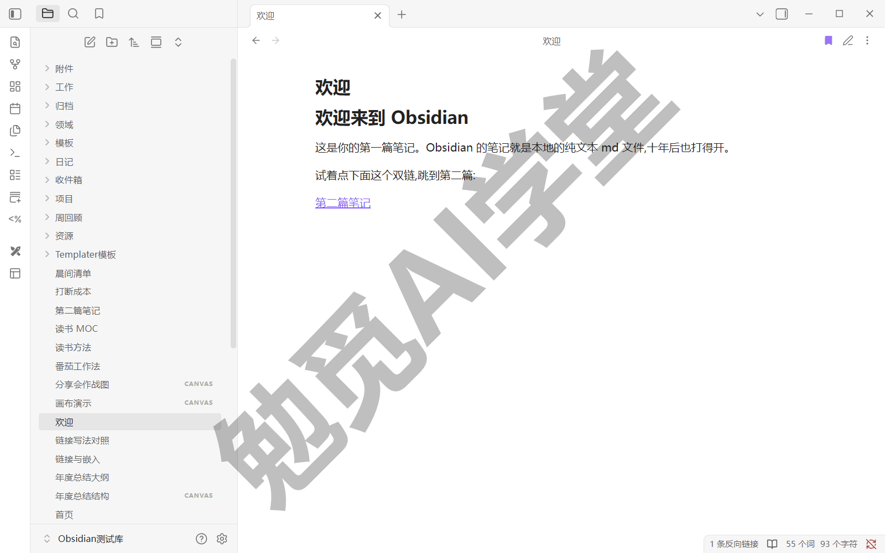

**第 2 步：核对模板插件指向**

打开设置，进入核心插件里的模板插件选项页，确认“模板文件夹位置”指向“模板”文件夹（《日记、模板与每日工作流》配过的读者不用重配，核对一眼即可）。这一步是后面三张模板的开关：指向不对，插入模板时列表就是空的。

做完会看到：模板插件选项页里，模板文件夹位置一栏填着“模板”。

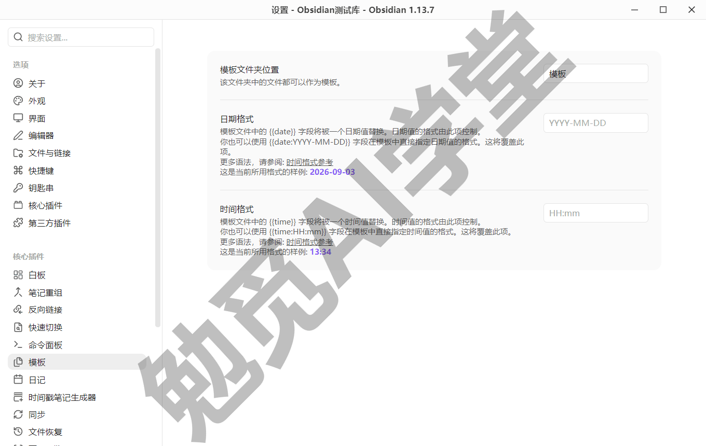

**第 3 步：三张核心模板逐张就位**

三张模板全文在下面给出，全部存进“模板”文件夹，编辑时切到源码视图（原因《日记、模板与每日工作流》讲过：实时预览下属性面板可能改写没加引号的模板变量，源码视图最稳）。前两张就是那一篇给过的原样，已经配好的读者核对即可，这里再给一遍，省得翻回去。三张模板连同本篇后面的首页骨架，都可以整套照抄。

第一张，日记模板，文件名“晨间日记”，日记插件的“日记模板位置”指向它：

```
---
tags:
  - 日记
---

## 昨日一句回顾
- 

## 今日三件事
- [ ] 
- [ ] 
- [ ] 

## 随手区
- 
```

第二张，闪念模板，挂在时间戳笔记生成器的模板位置上，保持极简：

```
---
tags:
  - 闪念
---

```

它只预填一个标签，是刻意的：闪念入口的全部价值在不打断当下，多一个要填的框，就多一分“算了不记了”的可能。哪天这些笔记被挪去任何角落，一条标签搜索都能全部找回。

第三张，领域笔记模板，本篇的新成员，文件名“领域笔记”：

```
---
类型: 领域
状态: 进行中
日期: "{{date}}"
---

# {{title}}

## 这一块要维持的标准
- 

## 进行中
- [[]]

## 常用资料
- [[]]
```

逐段说一下它的设计。属性区三个字段正是 16.2 定下的约定：类型固定填“领域”，状态默认“进行中”（哪天不管这摊事了，改成“已归档”并把笔记挪进归档），日期用 `{{date}}` 自动填创建那天。变量外面的引号沿用官方写法，防止属性面板改写，这些在《日记、模板与每日工作流》都讲过，写法原样搬。正文三段各管一件事：“要维持的标准”一句话写清这摊事做到什么程度算合格；“进行中”链向这个领域下正在推进的项目和笔记；“常用资料”链向高频要翻的资源。一篇领域笔记，就是这个领域的小 MOC。

**用模板建出第一批笔记**

模板建好之后要马上试用一次，确认变量和字段都正常。在领域文件夹里新建两篇笔记，一篇命名“读书”，一篇按你的实际情况命名（比如“健康”），分别插入领域笔记模板（命令面板执行“模板：插入模板”），把“要维持的标准”各写一句。做完会看到：两篇笔记的属性面板里，类型、状态、日期三个字段齐了，日期已经变成今天。那篇“读书”不是随手举例，下一篇《读书笔记系统》整个系统就建在它下面。

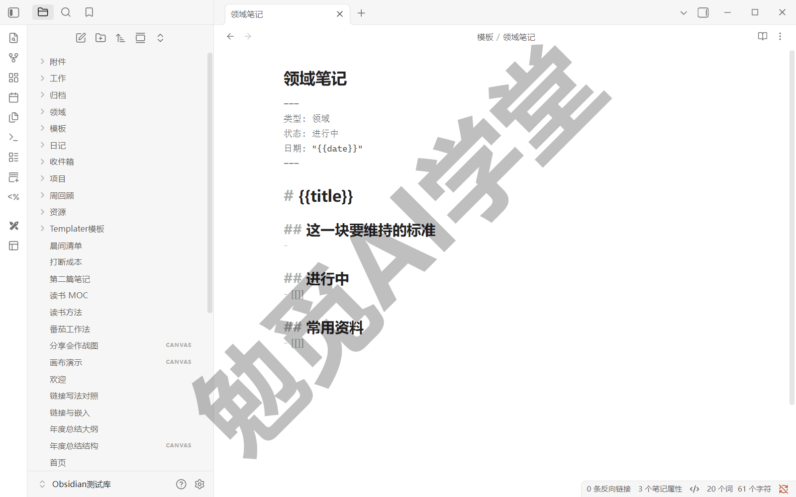

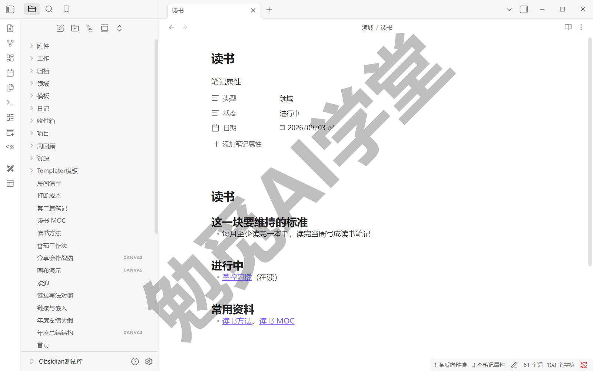

### 16.4 首页 MOC：库的总入口

**首页解决什么**

骨架搭好了，还缺一个“从哪进”的答案。每次打开库都从文件列表一层层点进去，或者全靠搜索碰运气，库就只是在存东西，谈不上每天在用。《双链与图谱》讲过 MOC（一篇只放链接的目录笔记，充当某个主题的总入口），还预告过它会在本篇升级成首页仪表盘，现在就来做：给整座库建一页首页，打开库第一眼看到的，就是此刻该干的事。

**动手：建首页笔记**

在库的顶层（不进四大类：它是整座库的入口，不是要归类的内容）新建一篇笔记，命名“首页”，骨架照抄：

```
---
类型: 首页
---

## 进行中的项目
- [[]] （一句话现状）

## 常用入口
- [[]] （为什么常来）

## 收件箱
- 待清条数：
- 上次清空：
```

三块各管一件事。“进行中的项目”从项目文件夹里链，每条链接后面跟一句话现状，这是《双链与图谱》教 MOC 时定下的纪律：每条链接都配一句话注释，每一条为什么在这，一眼就看得出来。“常用入口”放你一周至少来三次的位置：两篇领域笔记先挂上，正在写的东西、常用的清单以后随手加。“收件箱”两行数字手写，每周回顾时更新；它在首页上的作用是提醒：数字涨得快，说明该清一清了。最后把 16.2 存好的那份库内约定贴到最底下，首页兼作库内约定的张贴处。

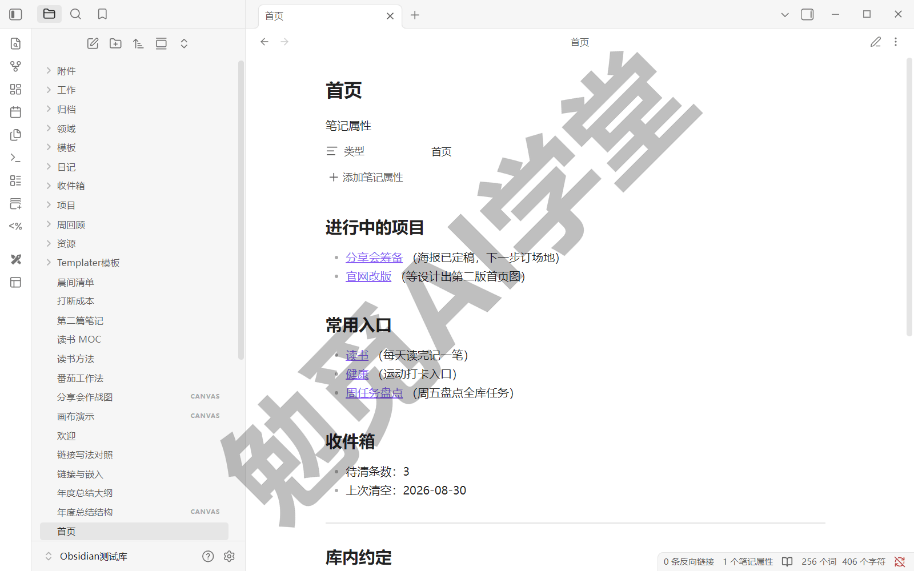

**打开库直达首页，做法一：置顶书签**

首页建好了，还差“一步到达”。课程给两种轻做法，先说零安装的。《库、文件与搜索》配过书签：笔记、文件夹、搜索都能收藏，常用位置一键直达。现在给“首页”笔记加书签（右键笔记，选菜单里的“收藏”），打开书签面板，把它拖到列表最顶；顺手给“收件箱”文件夹也加一个，清空收件箱时少点两下。以后每次开库：点左侧的书签图标，第一条就是首页。配合快速切换更快：呼出后输入“首页”，回车即达。

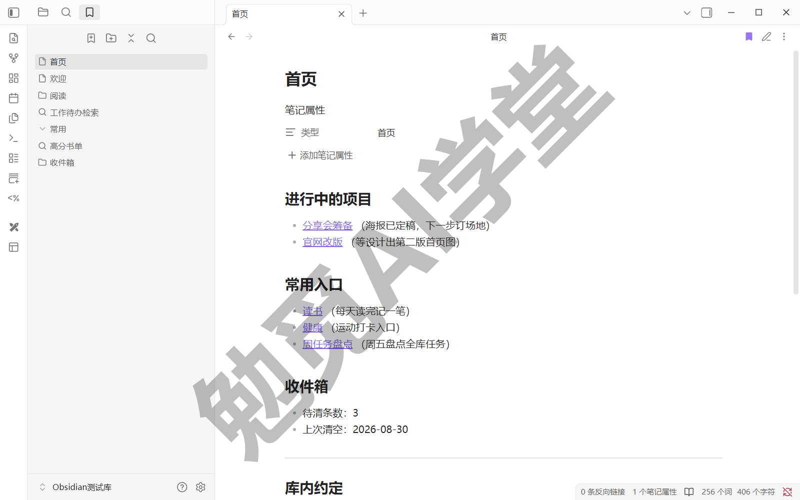

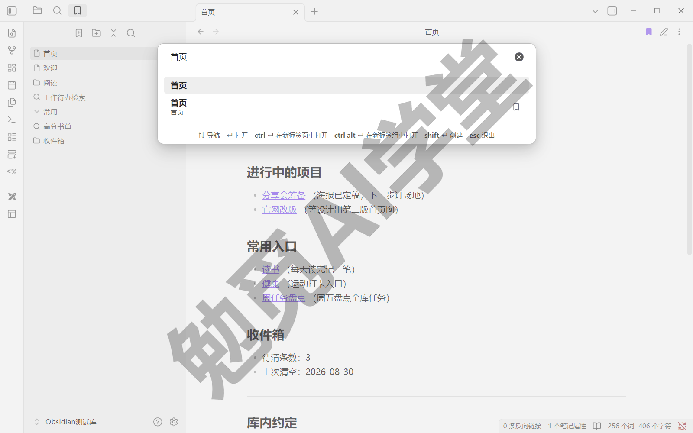

**做法二：启动直达首页——核心设置或 Homepage 插件**

想更进一步，让 Obsidian 打开库时自动落在首页？核心设置就能做到：打开设置的“文件与链接”页，把“默认打开文件”从“上次打开的文件”改成“指定文件”，在“要打开的文件”里选中“首页”，启动第一屏从此就是它（这一项还有“日记”可选，《日记、模板与每日工作流》提过的“以日记开工”设的就是它）。想要更细的控制（比如空标签页也回首页、手机端单独设一页），才轮到社区插件（这类插件就叫 Homepage，设置页目前是英文界面：File 一栏填“首页”，打开 Open on startup 开关，页内会提示它将覆盖内置的“默认打开文件”设置）。走《社区插件系统》定好的流程和判断：关闭受限模式前看开源仓库、下载量、更新频率、社区口碑四个信号，装完记得启用再配置。课程的取舍是：这类插件不进必装清单，书签加核心设置这一项完全够用。那一篇定下的节制原则在这里照用：每装一个插件，就多一段跑在你库里的第三方代码、多一样要操心的事，“开库第一眼”值不值这个代价，你自己定。

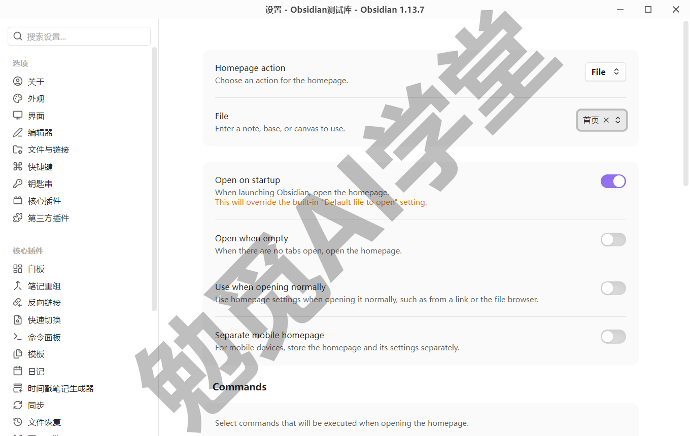

**首页的维护纪律**

首页是要修剪的：不随每周回顾维护，很快就会过时到没法用。动作全部挂进每周回顾，顺手三分钟：进行中的项目上下架（完成的挪去归档、从首页摘下，新开的补上来）；常用入口按最近的真实点击调整，一个月没点过的摘掉；收件箱两行数字更新。首页一旦过时，你就会退回“全靠搜索碰运气”的日子，前面搭首页的功夫也就白费了。

### 16.5 旧笔记迁入与归置

**搬家工具与素材**

骨架和首页都齐了，现在把旧笔记搬进来。工具是《导入、导出与发布》装好的官方 Importer 插件，那一篇走过 Notion 搬家全流程：原工具导出、Importer 导入、逐项核对。素材按你的实际来：Notion 导出 zip 包（附件相关的导出选项以实际界面为准），印象笔记导出 .enex 文件，中国版印象笔记的导出细节按那一篇交代的做法处理；Word 文档也按那一篇定下的路线走：Importer 不支持直接导入，先转成 md 再进库。手头没有旧笔记的读者，本节和下一节看懂流程即可，归置三步拿库里已有的笔记照样能练，验收时以归置达标为准。

**走一遍导入**

打开 Importer，选择来源格式，指定导出包，执行导入（详细步骤和各来源的坑在《导入、导出与发布》，此处不重复展开；Importer 当前的支持源列表里确有 Notion 与 Evernote/.enex，印象笔记走 enex 格式，以其选项页为准）。导入完成先别急着整理，把那一篇定的搬家三查先跑一遍：附件在不在、链接通不通、数据库变成了什么。按官方说明，Notion 的数据库会被转成 Bases 文件，实际转换效果以导入结果为准。三查有任何一项不对，先记下现象，下一节的翻车实录挨个救，别边救边整理。

做完会看到：导入的笔记落在库里一个独立的文件夹中（具体落点以 Importer 实际行为为准），文件列表里多出一大摊待归置的旧笔记。

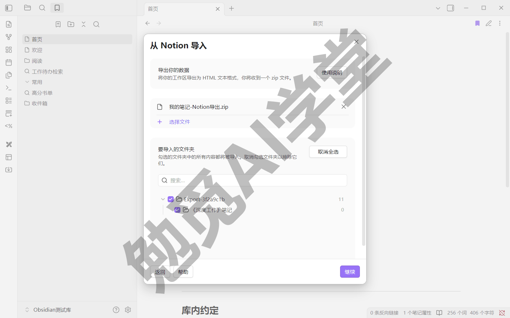

**迁入后三步归置**

这批旧笔记不能一直堆在原地，否则就是 16.1 里第一种情形的开局。归置按固定的三步走：

- **第一步，归类进 PARA**——把导入文件夹里的笔记按“有没有明确目标和期限”分流进四大类。先粗分大堆，不逐篇精修：明显是资料的整批拖进资源，跟某个进行中项目相关的进项目，纯历史存档直接进归档。
- **第二步，补字段**——值得转正的笔记补上类型、状态、日期三个字段。《标签与属性》讲过，属性没有原生的批量改值能力，课内的处理办法是旧笔记逐篇补、新笔记靠模板：逐篇补虽然费些工夫，一篇通常也就半分钟；今后的新笔记走模板，一建就带字段，这笔工夫只付一次。
- **第三步，挂上 MOC**——把归好类的笔记链进对应的领域笔记（“常用资料”或“进行中”段），高频的直接挂首页常用入口。挂完的标准：从首页出发，两跳之内能找到它。

**示范：批量归置一批**

拿十篇读书类旧笔记走一遍全程：整批拖进资源文件夹里新建的“读书摘录”子文件夹，逐篇补三字段（状态统一“已归档”或“进行中”，按还读不读定），再回到“读书”领域笔记，把它们链进“常用资料”段。十篇下来通常十来分钟，节奏就出来了：先粗分成大堆、再逐篇补字段、最后挂上链接，剩下的旧笔记按同样的节奏分几次清完即可，不必赶在一晚上做完。这批归置好的读书旧笔记别浪费，下一篇《读书笔记系统》直接拿它们当素材。

这批重复操作也可以让 AI 代劳：《Obsidian×Codex：让 AI 管理你的笔记库》教过让 Codex 批量补属性、打标签（可选路线，需 ChatGPT 订阅）；不用它，本节的手动流程同样走得通。

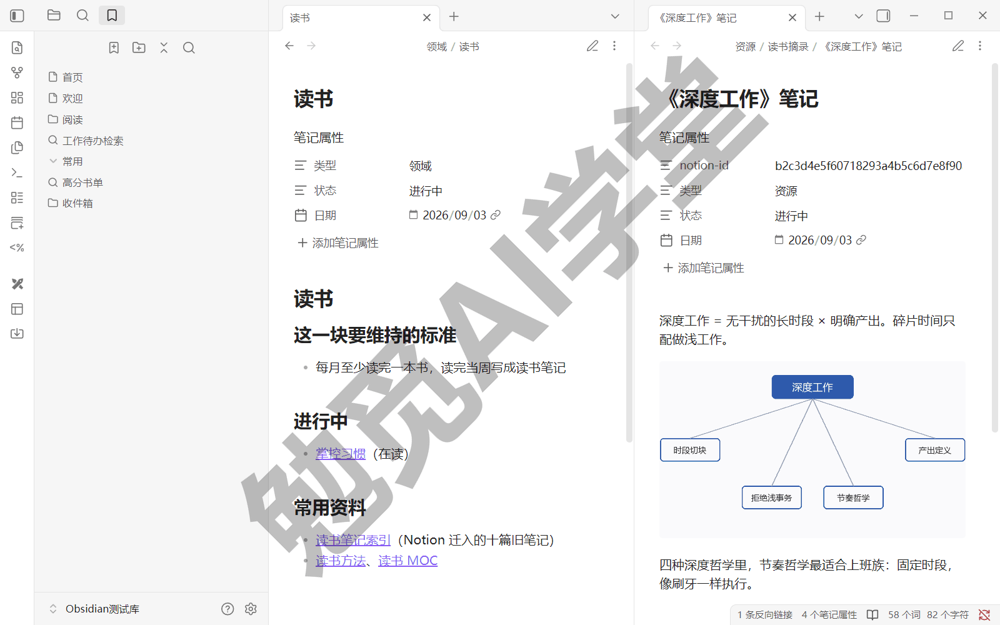

### 16.6 翻车实录：迁入问题现场处置

搬家很少一次顺利。这一节把 16.5 三查里最常见的三种翻车现场摆出来，逐个归因处置；这三处会把救回过程完整演示一遍；救的时候用到的判断，全是 16.2 那套分工，等于把分工再复习一遍。

**现场一：附件丢了**

现象：迁入的笔记里，图片位置只剩一个裂图图标或一行失效的链接。归因按顺序排查：多数是导出包本身没带附件，回原工具检查导出选项是否选了“包含附件”一类（选项名需实机验证）；少数是附件进了库但路径没对上。处置分两种情况：包没带附件的，重新导出一个带附件的包再导一遍，重导前把上一批删干净，防止重复；附件在库里但链接不通的，检查设置“文件与链接”里“附件默认存放路径”一项，把附件文件夹挪到笔记能找到的位置。复验：抽三篇带图的笔记逐一打开，图都显示了才算过。

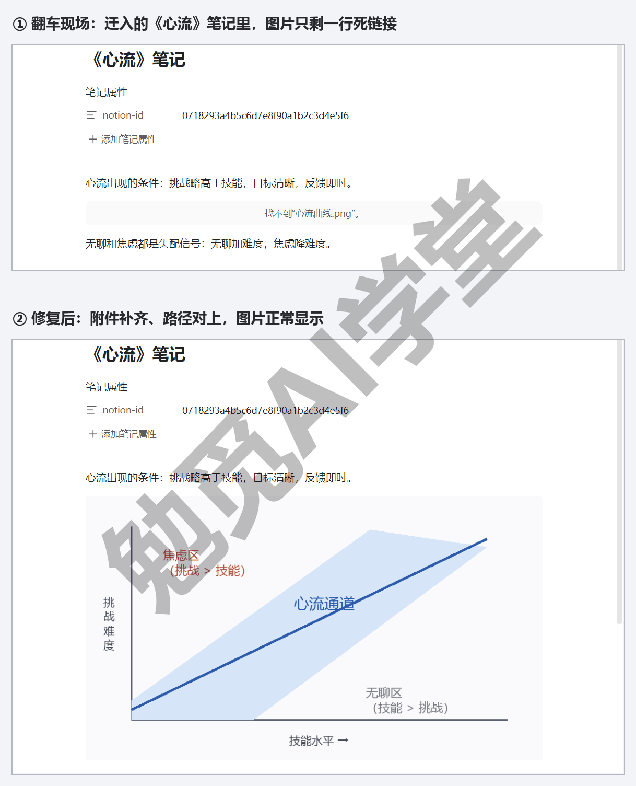

**现场二：链接断了**

现象：原工具里页面之间的跳转，迁入后点不动了：有的变成纯文本，有的指向一个不存在的地址。归因：源工具的内部链接导出时常被写成网页地址或原路径，Obsidian 认不出它们指向库里哪篇笔记。处置看断链规模：三五处的，手动改回双链，输入 `[[` 选中目标笔记即可；成片断的，用《双链与图谱》的未链接提及救：反向链接面板会列出“正文出现了这个名字但没加链接”的位置，一键转成正式链接，比逐篇手改快得多。再定一条防复发的纪律：往后改笔记名一律在 Obsidian 里改，全库链接自动更新；在资源管理器里改名，Obsidian 收不到这个改动，链接一定会断。

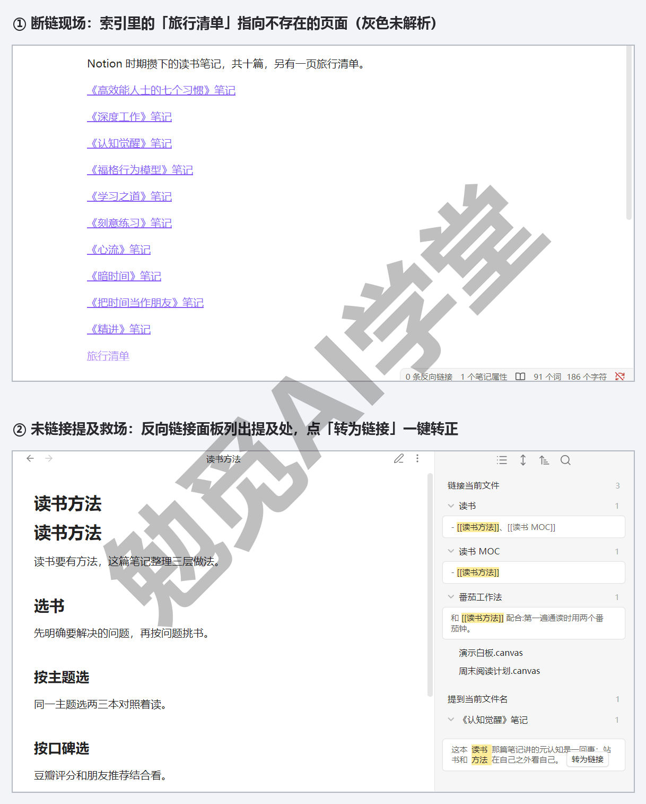

**现场三：格式乱了**

现象：表格挤成一行，高亮变成一串怪符号，代码块散了架。归因：源工具的专有格式没有对应的 md 写法，导出时被降了格。处置先分主次：内容都在、只是排版难看的，信息没丢，不用抢救，碰到一篇修一篇。修法是切到源码视图，看它到底被导成了什么，再按 md 写法改写；表格的写法见姊妹篇《Markdown 通用语法手册》的《扩展语法》篇，高亮则是 Obsidian 支持的扩展写法，两个等号包住文字（`==这样==`）就渲染成荧光笔效果。批量修不划算，优先修常看的那几篇，冷门的等哪天翻到再说。

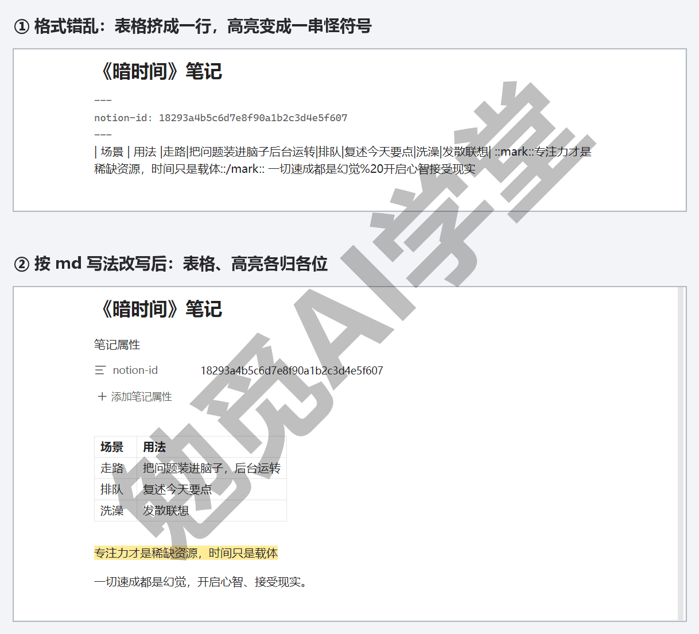

**附带纠正：把挖深的目录拍平**

归置途中常见的冲动：给资源文件夹里越建越深，五六层下去，好像每篇笔记都有了精确的去处，其实又回到了目录越分越细的老问题。纠正的动作是拍平：把深层笔记整批上移，层级压回两三层以内，删掉空壳文件夹；分类感的缺口交给双链和 MOC 补，这正是《库、文件与搜索》定调的浅结构：文件夹只做粗归属，深一层的组织交给链接。拍平后打开图谱复验一眼，用《双链与图谱》教过的分组着色看主题分布：连线围着领域笔记和首页聚团，说明结构已经成形；满屏都是孤立的点，说明第三步挂 MOC 还没做够。

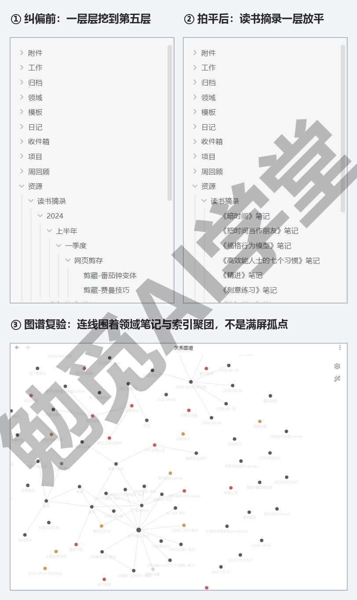

### 16.7 日常运转演练：一天 + 一周

库搭好了、家当归位了，最后一步是让它转起来。这一节不引入任何新东西，就是把《日记、模板与每日工作流》那条一条龙放进新骨架里完整跑一遍：先跑一天，再跑一周。

**一天流：早、中、晚三段**

早上，打开今天的日记（启动直达今天那项设置，那一篇配过），花两三分钟：昨日一句回顾接上昨天，今日三件事排好优先级。首页这时候也顺带看一眼：进行中的项目就列在首页最上面，今天的三件事从那里挑，比凭空想快。

白天只做记录，不做整理。落点按性质分三个去处：过了今天就没用的零碎（电话号码、临时改期）进日记的随手区，这是《日记、模板与每日工作流》定过的分工；值得将来发展成一篇笔记的念头走闪念入口，一键进收件箱，记完回去干活，不归类不纠结；正在推进的实事直接写进对应的项目笔记。三个落点各管一类，写的时候不用再想第四个去处。

晚上加一段本篇的新动作“晚间归档”，睡前两分钟：回日记把做完的框勾掉；当天闪念里去向已经明确的一两条顺手转正，改个正式标题、归进四大类；其余的留在收件箱，不强求清零，清零是周末的事。

做完会看到：一天下来，日记有勾、收件箱攒了几条但不失控、项目笔记有新增，三条流水各归各位。

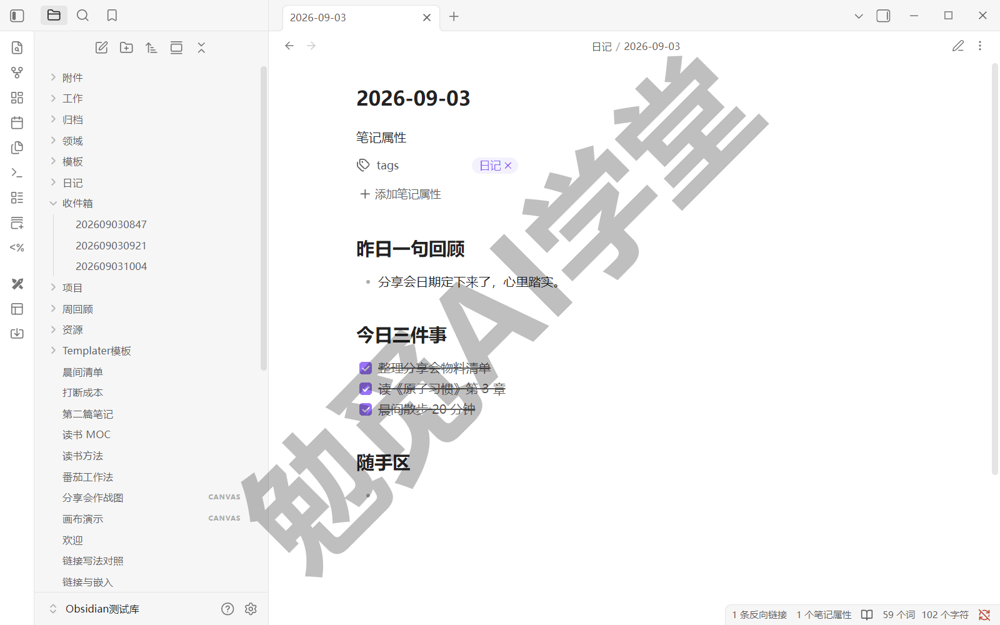

**一周流：回顾加修剪**

周末做每周回顾，模板和四段动作照《日记、模板与每日工作流》的原样：串读七天日记、清空收件箱、盘点未完成任务、写下周三件事。本篇往里加两个动作。一个是修剪首页：项目上下架、常用入口调整、收件箱数字更新，16.4 交代过的三分钟。另一个是归置抽查：随手抽三篇本周新增的正式笔记，看三字段在不在、写法统一不统一。查出问题当场处置：写法飘了（“进行中”写成了“做着呢”）就统一改回约定值；字段漏了就补上，再回想一下这篇是不是绕过模板手建的，漏账多半出在这里。这项抽查要每周做，每次只看三篇，很快就完；攒到一个季度再查，量就大到没人愿意做了。

做完会看到：收件箱清零，首页跟手头的事对得上，下周一早上打开库就知道从哪开始。


**“能运转”的判定标准**

最后正式定下判定标准，两条，也是 16.8 验收的依据。第一条，三天不整理也不乱：连续三天只记录、不做任何专门的整理，库里新东西照样各有去处、不堆积，靠的是模板保字段、闪念有收件箱、晚间两分钟归档。第二条，要找的东西三步之内找到：知道名字的，快速切换一步直达；不记得名字的，从首页进领域笔记，两跳之内能到；再不行全局搜索一搜一点。自测方法很直接：随手想三样最近记过的东西，掐着步数各找一遍，超过三步就算没过。达不到哪条，回哪节修：找不到，多半是首页没建好或 MOC 没挂够，回 16.4、16.5；堆积，多半是闪念入口不顺手或回顾没跑起来，回本节把三段流水重新捋一遍。

### 16.8 验收清单

项目做完了没有，要对着清单逐项验，不能凭感觉判断。基础篇的练习任务是课程出题、你来完成；从这一篇起换你自己当验收方：下面五项对着你自己的库逐项验，每项都给了判定标准，过不了就回对应的节返工。它和“本篇小结与自检”分工不同：那边验你学没学会，这边验库合不合格。验的时候真动手点、真掐着步数数，别在脑子里过一遍就当过了。

- **简化 PARA 目录骨架建成，四大类各放什么能一句话说清**——判定标准：文件列表顶层是项目、领域、资源、归档加流水文件夹，层级两三层封顶；随手指三篇笔记，能立刻说出各归哪类、为什么。说不出理由的，回 16.2 与篇末 Q2 把归类的两问再过一遍。
- **三张核心模板可用，且已用模板实际新建过笔记**——判定标准：模板文件夹里三张模板在位；各用它们建过至少一篇真实笔记，变量替换正常（`{{date}}` 已变成真实日期），领域笔记的类型、状态、日期三字段在属性面板里齐着。缺哪张补哪张，回 16.3。
- **首页 MOC 上线，打开库能直达当前事项**——判定标准：冷启动实测——完全关掉 Obsidian 再打开，三步之内到达首页（书签、“默认打开文件”或插件任一种）；从首页出发，两跳之内能进任何一个进行中的项目；三块结构齐全且链接后面有一句话注释。断在哪一跳，回 16.4。
- **旧笔记迁入完成，链接与附件无断裂，批量归置过一批**——判定标准：抽查至少五篇迁入的笔记，图片附件显示正常、笔记间链接可跳转；至少一批（十篇上下）完整走过归类、补字段、挂 MOC 三步。没有旧笔记的读者，拿库里已有笔记完成三步归置同样算过。抽查翻车的，回 16.6 对号处置。
- **完整走过一天工作流与一次每周回顾**——判定标准：至少一天完整走过“晨间日记—闪念速记—晚间归档”三段；至少做过一次每周回顾，收件箱清零、首页修剪过；再拿 16.7 的两条标准自测——三天不整理不乱、三步之内找到，两条都答得上来才算运转。

五项全过，第一个实战项目交付：这座库从今天起每天在转，后面三个项目都建在它上面。这份清单的思路也值得留着：往后三个项目开工前，验收标准都会像这样先定好再动工。

### 16.9 本篇小结与自检

这一篇完成了课程的第一个完整项目：从零搭起一座能日常运转的个人知识库。最需要记住的是：**库能运转靠的不是完美的目录，而是“简化结构＋固定模板＋每周回顾”的最小闭环——先让库跑起来，之后需要什么再添什么。**

可以对照下面的清单检查学习结果：

- [ ] 按简化 PARA 建好目录骨架，能说出四大类各放什么
- [ ] 三张核心模板已建好，并实际用它们新建过笔记
- [ ] 首页 MOC 已上线，打开库能一眼进入当前事项
- [ ] 旧笔记完成迁入与归置，链接与附件无断裂
- [ ] 完整走过一天工作流和一次每周回顾

完成这些内容后，你已经有了一座立刻能用的个人库。下一篇《读书笔记系统》在这座库上建起第一个专题系统：把读过的书变成可检索、可复用的资产。

### 16.10 新手常见问题

**Q1：已经有一堆旧笔记，先迁入还是先建骨架？**

先建骨架。本篇的章节顺序就是答案：16.2 到 16.4 把目录、模板、首页建好，16.5 才开始搬。骨架趁库里还“空”的时候最好建；先把几百篇旧笔记倒进来再设计结构，每个决定都背着历史包袱，很容易又变成“边搬边分类”。旧笔记也不急这几天：它们在原工具里已经放了很久，多放一周没有损失。

**Q2：PARA 四类拿不准放哪类怎么办？**

按可行动性连问两句：这件事有明确目标和大致期限吗？有，进项目。没有期限、但要长期维持一个标准吗？是，进领域。两问都不是、只是感兴趣，进资源。还拿不准就先放资源，它是四类里的默认收纳位，放“错”的代价也最小：这座库里位置本来就不是唯一坐标，双链、标签和搜索都能把笔记找回来，《库、文件与搜索》定的组织分工说的就是这件事。

**Q3：模板要不要一步到位做全？**

不要。三张够用了。加新模板的时机是：同一段骨架手打到第三遍时，把它存成模板。模板应当来自实际反复出现的需要，不是预先想出来的需要。后面《读书笔记系统》《卡片盒写作系统》《工作项目管理库》每个系统都会带来自己的模板，到那一篇再加不迟。开工先做一堆模板，正是 16.1 第三种情形的起点。

**Q4：要不要按工作/生活分成两个库？**

不用。《库、文件与搜索》定过的结论继续有效：默认单库，只有两批笔记永远不需要互相链接、互相搜索时，分库才不亏。PARA 的顶层文件夹恰好就是那一篇给过的“准隔离”方案：工作和生活在领域下各占一摊，搜索用 `path:` 圈范围，清净程度和分库相差无几；而灵感要跨界相连时，一条双链就够，这是真分库给不了的。
