## 读书笔记系统

上一篇《个人知识库从零搭建》交付了一座能日常运转的库，这一篇在这座库上建起第一个专题系统：读书笔记系统。目标是让“读过的书”有账可查：书架看板一眼看清在读什么、读完了什么，年度书单自动生成，最后还要从摘录里做出一篇真正的成品读书笔记。

这也是属性、Bases、Dataview 三项能力的第一次综合实战。功能本身都在基础篇讲过，本篇不再重复展开，只在用到的地方点名对应篇目；你会看到它们怎么组合成一个天天用得上的系统。

### 17.1 项目定位：读过的书要能找回来

先看三个常见的场景。读书时明明划了不少线、记了不少感想，过两个月想引用某段话，却想不起记在哪里；一本书看完就合上，隔一阵子连主要观点都说不清；到了年底想盘点今年读了什么，翻聊天记录、翻购书订单，拼不出一份完整的书单。这些麻烦的共同点是：读书留下的痕迹散落在各处，没有一个固定的去处。

这一篇交付的系统就是给它们一个固定的去处，做完你会得到三样东西：

- **一块书架看板**：库里所有书按“想读、在读、读完”自动归组，状态一改，行自动挪位；哪本在读、读到什么程度，打开就是答案；
- **一份自动年度书单**：今年读完的书连同评分自动列成清单和表格，年底盘点零工作量，明年自动从新一年重记；
- **一篇成品读书笔记**：从文献卡的摘录里加工出一篇有总评、有收获、有金句的成文。书架管的是账，这一篇管的是收获本身。

串联的能力全部来自基础篇。《标签与属性》定下的规则（要排序、筛选、计算的数据进属性）是整个系统的地基；《Bases 数据库》教过把属性汇成会自己更新的表，书架看板就建在它上面；《Dataview 专讲》的查询负责年度书单；手机上遇到想读的书，靠《移动端与网页剪藏》讲过的剪藏能力先把它收进库。四样能力各就各位，本篇把它们连成完整的流程。

这篇文章的实操内容不需要花钱：Bases 是官方内置能力，Dataview 是免费社区插件（《Dataview 专讲》已装好），剪藏工具也免费。

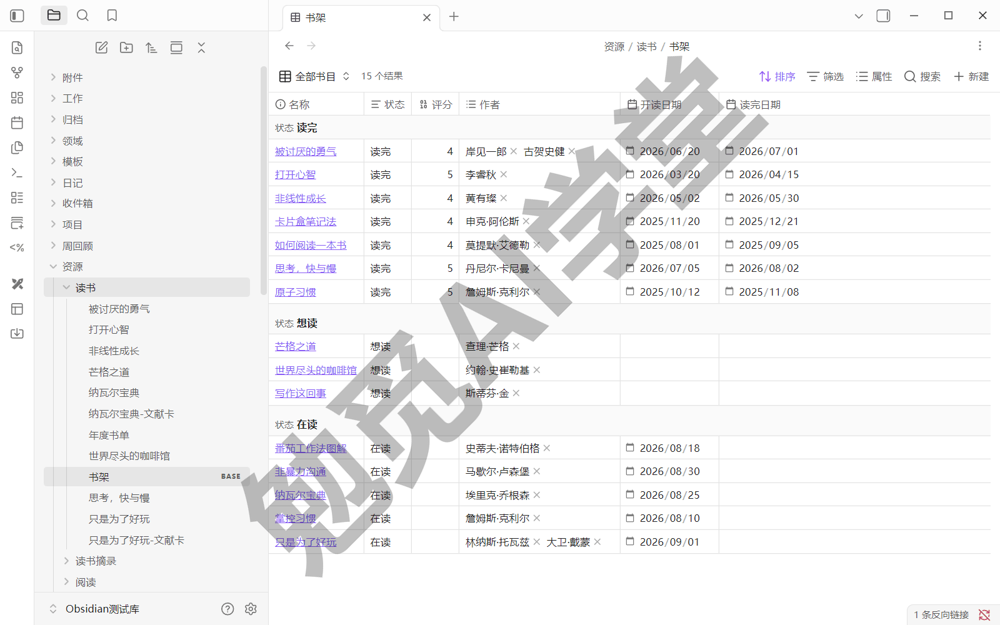

实战篇的读法先说明一下：分节按项目推进的顺序组织，先定字段、再跑流程、然后上视图和查询、最后交付成品；每一步用到的功能只点名它来自哪一篇，不再从头重讲一遍。如果某个操作做起来生疏，回对应篇补那一节就行，不用重看整篇。

这套系统的边界也先划清楚。它管两件事：读书的账（读了什么、读到哪、打几分）和读书的收获（摘录与成文）。它不做全文电子书管理（书的正文不进库，库里只有你的笔记）；也不做学术式的文献引用管理，那是另一类工具的主场。

素材上有一个要求：全程用你真实读过、正在读、想去读的书。真实数据才能暴露真实问题，17.6 的翻车用的就是真实录入时出的错；而且这批卡片做完就是你自己的书账，练习本身就是积累。

动手的场地就用《个人知识库从零搭建》搭好的那座库：简化 PARA 的四大类目录（项目、领域、资源、归档）里，读书系统整体归进“资源”大类。在里面建一个“读书”文件夹，本篇产出的书目卡、文献卡、成品笔记全部放这里，靠文件名区分。没有跟着上一篇搭库的读者也不受影响，在任意库里建一个“读书”文件夹，照做即可。

### 17.2 读书模板与文献卡设计

系统的第一步不是录书，而是定字段。后面的看板要按状态分组、书单要按评分和日期筛选，全都依赖属性；字段定得对不对、录得齐不齐，直接决定它们灵不灵。《标签与属性》定过两条规矩，在这里全程适用：

- 要排序、筛选、计算的数据进属性；
- 类型跟着属性名走：“评分”一旦定为数字型，全库所有叫“评分”的属性统一按数字型处理，所以第一次就要把类型定准。

**五个字段逐个定。** 每个字段说清装什么、选什么类型、为什么：

**状态**——文本型，值只从“想读”“在读”“读完”三个词里选。它是看板分组的依据，也是书单查询的筛选条件。不用复选框，因为书的状态是三档不是两档；也不再用标签记状态——《标签与属性》的练习里你可能打过“书/在读”这类子标签，那是搜索场景的轻量用法，进入系统化管理后，状态只认属性这一处记录。一个会变的值记在两处，迟早对不上；写法不统一要付出什么代价，17.6 的翻车实录会算给你看。

**评分**——数字型，1 到 5 分，与《Bases 数据库》建书单素材时的用法一致。必须存数字：评分榜要按它从高到低排，存成“五星”这样的文字，排序就失效了。几分制不是重点，重点是全库只用一种分制。

**作者**——列表型。一本书可能有两位以上作者，《标签与属性》讲列表型时说过这个理由：把多位作者写进同一个文本属性、拼成“作者甲、作者乙”，以后就没法按单个作者检索。只有一位作者时列表里只放一项，不碍事。

**开读日期、读完日期**——都是日期型，一本书要记两个时间点。年度书单按“读完日期”统计今年的收成；“开读日期”让你看得到一本书在读了多久，拖了半年的书该不该放弃，数据会提醒你。想读阶段这两个字段都空着——空着不是错，恰好证明这本书还没开读。

**标签只打一个。** 每张书目卡打一个 `#书` 标签，作用是向 Bases 声明“这篇是书目卡”，书架就靠它圈定数据来源。分类、状态都不靠标签承担：分类将来真有需要可以加“类型”属性（篇末问答有展开），状态归属性管。

**为什么要拆成两张卡。** 本篇给每本书配两张卡，分工不同：

- **书目卡**：一本书的档案，字段集中在这里，它就是书架表格里的一行；正文只留一句话总评和几个固定入口，保持干净；
- **文献卡**：读书过程中的摘录容器，划到的原文、页码、当时的想法都进这里，想写多长写多长。

不拆行不行？把摘录直接写进书目卡，表格里每行点开都是几千字的摘录，档案就淹没了；反过来，下一篇《卡片盒写作系统》要把文献卡加工成写作素材，加工时也不该拖着评分、日期这些档案字段。书目卡只管数据，文献卡只管内容，两边互不干扰。

**读书模板全文如下**，保存为模板文件夹里的“读书模板”（模板文件夹与模板插件在《日记、模板与每日工作流》配置过：套用模板能把整篇骨架连同预填字段一键展开；《个人知识库从零搭建》建库时已把它指向“模板”文件夹）。模板里的 `{{title}}` 是模板插件的内置变量，套用时自动替换成这篇笔记的标题，也就是书名。本篇的两张模板、一份视图配置、两段查询都会在正文里给出全文，可整套照抄：

```
---
tags:
  - 书
状态: 想读
评分:
作者:
  - 作者姓名
开读日期:
读完日期:
---
一句话总评：读完后补，一两句讲清这本书值不值得读、适合谁。

## 想读的理由

建卡当天写一句，将来回头看当初为什么想读。

## 摘录去处

摘录一律进 [[{{title}}-文献卡]]，不写在本卡。

## 成品笔记

读完加工成文后链接放这里：[[{{title}}-读书笔记]]
```

“作者姓名”建卡后改成真名；“评分”“开读日期”“读完日期”留空占位，字段先到位、值等状态到了再填。

**文献卡初版模板全文如下**，保存为“文献卡模板”。三个字段名（类型、来源、主题）与《卡片盒写作系统》的三类卡完全一致（那一篇会把闪念卡、文献卡、永久卡连成从卡片到成文的写作流水线），衔接现在就做好，到时文献卡可以直接并入卡片盒，结构不用改：

```
---
类型: 文献卡
来源: "[[书名]]"
主题:
  - 这本书主要谈什么，一两个词
---
摘录都按下面的格式记，一条接一条：

> 摘录原文（第 xx 页 / 某章）

- 一句话：这段为什么值得留下。
```

“来源”里的“书名”改成对应书目卡的名字，链接值要包引号的规矩《标签与属性》讲 frontmatter 手写规则时定过。注意文献卡不打 `#书` 标签，打了它就会被当成一行混进书架，书架的行只该是书目卡。摘录用的引用块写法（行首一个大于号），姊妹篇《Markdown 通用语法手册》的《基本语法》篇讲过，这里不再展开。

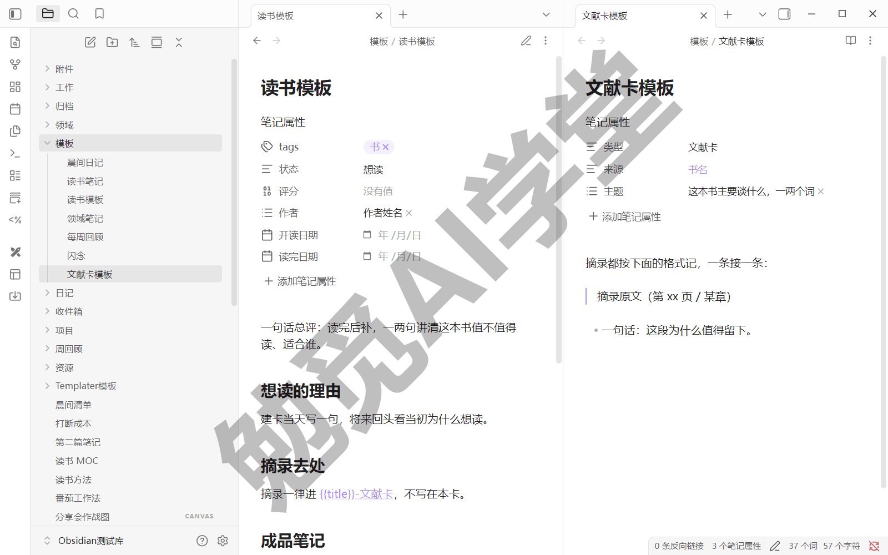

**建第一张卡，把类型定准。** 用读书模板新建一篇（文件名就是书名），然后对着属性面板把五个字段的类型逐个核对一遍：状态是文本、评分是数字、作者是列表、两个日期是日期型，图标不对就点属性名旁的类型图标改过来（这个操作《标签与属性》带你做过）。这个动作全库只需做这一次：类型跟着属性名走，从第二张卡起，模板带出来的字段类型就是对的。

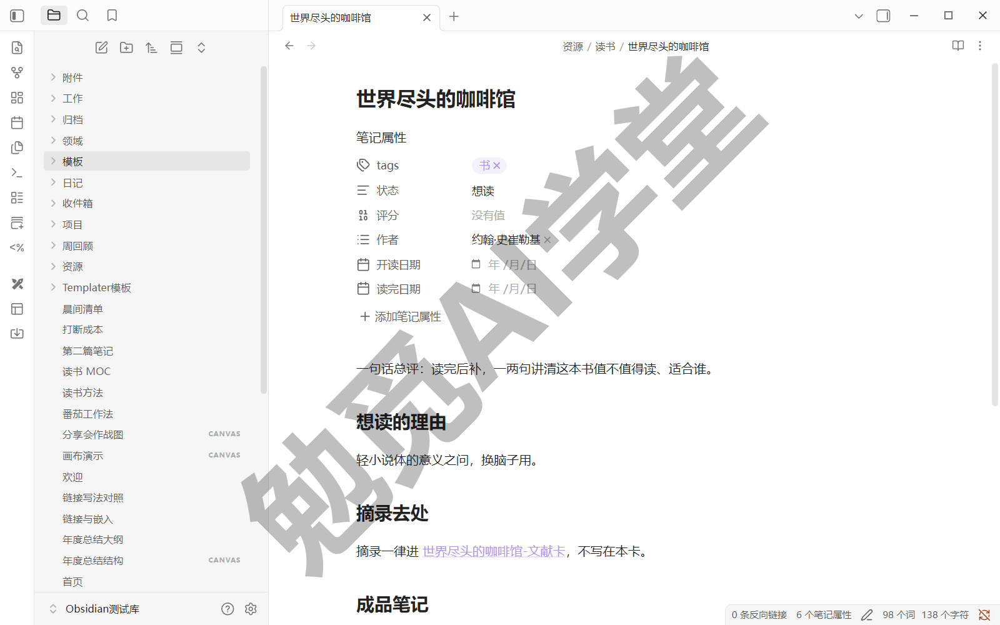

命名约定一并定下：书目卡的文件名就是书名，文献卡叫“书名-文献卡”，成品笔记叫“书名-读书笔记”。三张卡在文件列表里天然排在一起，不用翻找。

### 17.3 录入工作流：一本书的一生

字段和模板就位，这一节把“一本书从想读到读完”的完整流程走一遍。它只有三站，每站的动作都很少；动作少，才容易天天坚持下来。

**想读：先让书进系统。** 看到一篇书评、朋友推荐了一本书，当下只做一件事：新建笔记、文件名写书名、套上读书模板。状态默认就是“想读”，作者顺手填上，“想读的理由”写一句，整个过程半分钟。不方便开电脑的场合更常见，比如通勤路上看到一条书讯，用《移动端与网页剪藏》讲过的做法先留住它：网页能直接剪成 md 进库，手机上的闪念也能先进收件箱。手机只负责“别丢”，建卡这类整理动作回电脑做：把剪藏稿里的书名、作者提出来，套模板落成正式的书目卡，剪藏原文可以链在“想读的理由”下面备查。

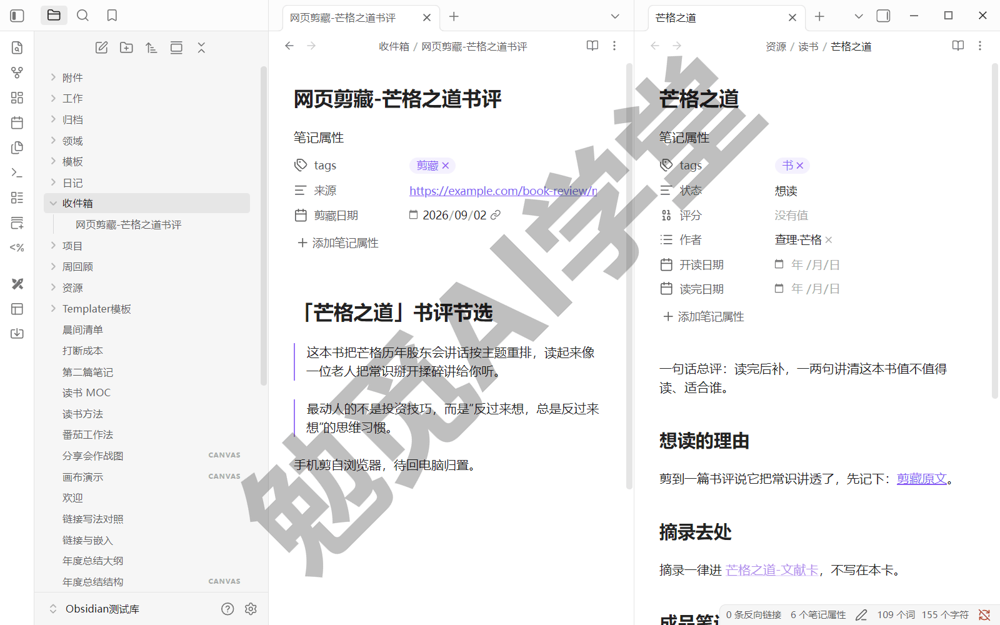

**在读：摘录进文献卡。** 决定开读的那天做三个动作：状态改成“在读”、填上开读日期、按文献卡模板建出配套的“书名-文献卡”。之后整个阅读期就一件事：遇到划线的段落，进文献卡记一条“摘录原文＋一句为什么留下”。纪律只有一条：摘录只进文献卡，不写进书目卡，也不散落在日记里。守住这一条，17.7 加工成文时所有原料都在一个地方。

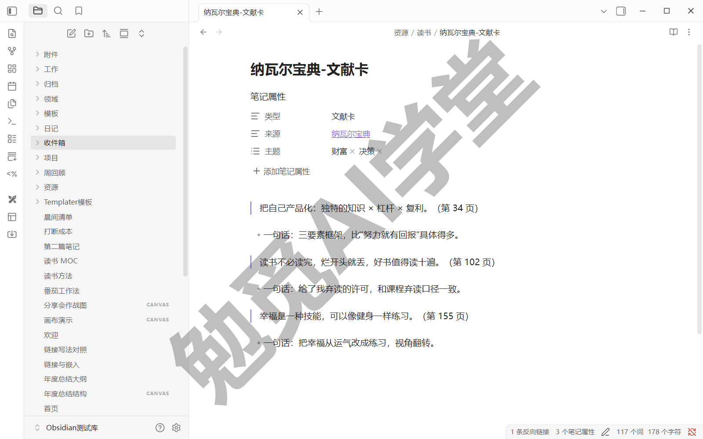

**读完：结账三件事。** 合上书的当天，回到书目卡把账结清：状态改“读完”、填读完日期、打评分。趁记忆还热，顺手把开头那行“一句话总评”补了，这句话是 17.7 成品笔记的第一块料。不需要把笔记挪进什么“已读”文件夹，状态属性一改，这本书在系统里的位置就变了；文件夹保持不动，正是《标签与属性》讲过的分工：文件夹管归属，会变的状态交给元数据。

**两个绕不开的现实问题**，规矩现在就定下，免得各记各的：

- **弃读怎么记**：一本书读了三分之一实在读不下去，别让它永远挂在“在读”里。做法是按“读完”结账：状态改“读完”、填读完日期、评分照实给低分，一句话总评写明在哪里弃读、为什么。账要如实：弃读也是一个明确的结论，比一直挂着“在读”更符合实际。不建议为它加第四个状态，状态每多一个，模板、视图、查询三处都要跟着改，三个状态换来的简洁值得守住；
- **重读怎么记**：不新建第二张书目卡，因为同一本书两张卡，后面的看板和书单都会重复计数。做法是在原卡上把开读日期改成新一轮的日期（书目卡记录“最近一轮”），文献卡里另起一个“第二遍”小节接着摘。评分想改就改，它本来就该反映你当下的判断。

**现场打底：录五六本真实的书。** 下一节的视图要有东西可看，现在就把你手头真实的书录进去，五六本、状态各异最好。比如两本读完的（评分、日期填全）、两本在读的（有开读日期、配了文献卡）、两本想读的（只有作者和理由）。书目全部放进“读书”文件夹，每本都从模板建。这批卡既是练习，也是你系统的第一批真实资产。

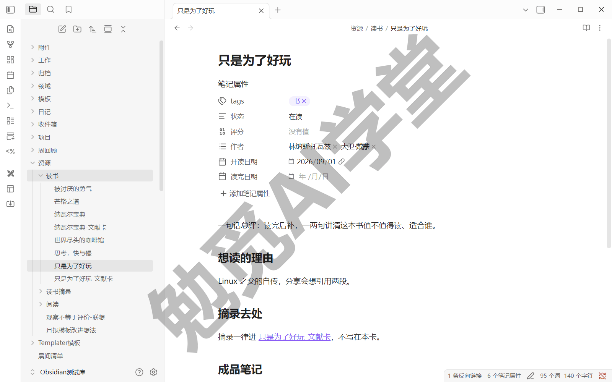

### 17.4 Bases 书架视图

书目有了，现在给它们一块看板。《Bases 数据库》讲过 Bases 的根本逻辑：表里每一行是一篇真实的笔记、每一列是一个属性，笔记里改属性表格立即跟着变，反过来在表里改单元格改的就是笔记本身。当时建过基础版书单，这一节把它升级成完整的书架：一个 Base，三个视图。

**建 Base，圈定数据源。** 在“读书”文件夹里新建一个 Base，命名“书架”（三处新建入口《Bases 数据库》都带你走过：命令面板“数据库: 新建数据库”、文件列表右键、功能区“新建数据库”按钮；命令与按钮名为实机文案，右键菜单项以实机为准）。然后点筛选按钮，在“所有视图”一侧加条件：文件标签包含“书”（两个筛选分区的作用《Bases 数据库》讲过：“所有视图”区的条件圈定整个 Base 的数据源，“当前视图”区只管单个视图）。做完表里只剩书目卡，一行一本；文献卡、成品笔记都没有 `#书` 标签，天然不会混进来。

**视图一：全部书目，按状态分组。** 这张表要当总账，把列给全：点属性按钮勾选状态、评分、作者、开读日期、读完日期。然后打开排序菜单，选择按“状态”分组（分组入口在排序菜单里，官方说明目前只支持按一个属性分组，这两点《Bases 数据库》讲分组时都交代过）。做完表格分成三段，想读、在读、读完各归各段，段首显示状态值。课程说的“书架看板”，指的就是这张按状态分组的表。三段的先后按状态值的排序而来，中文值的实际排序表现以实机为准。

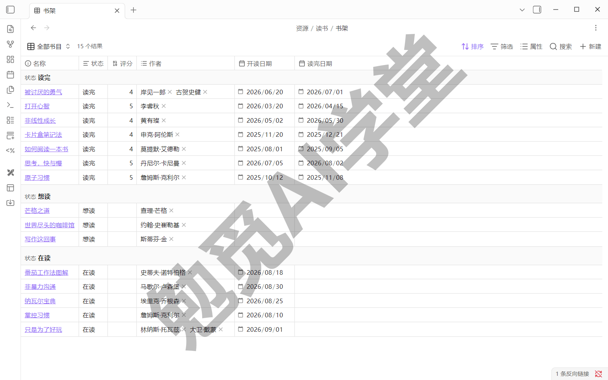

**当场验证看板会自动更新。** 把一本“在读”的书状态改成“读完”（可以在表格里直接改那格，也可以进笔记改属性），回到视图，这一行已经从“在读”段挪进了“读完”段。这就是《Bases 数据库》定下的规则“信息只存一份”在看板上的样子：你改的是笔记属性，看板只是它的实时展示。以后读完一本书，看板不用你维护，那一行会自动挪进对应分组。

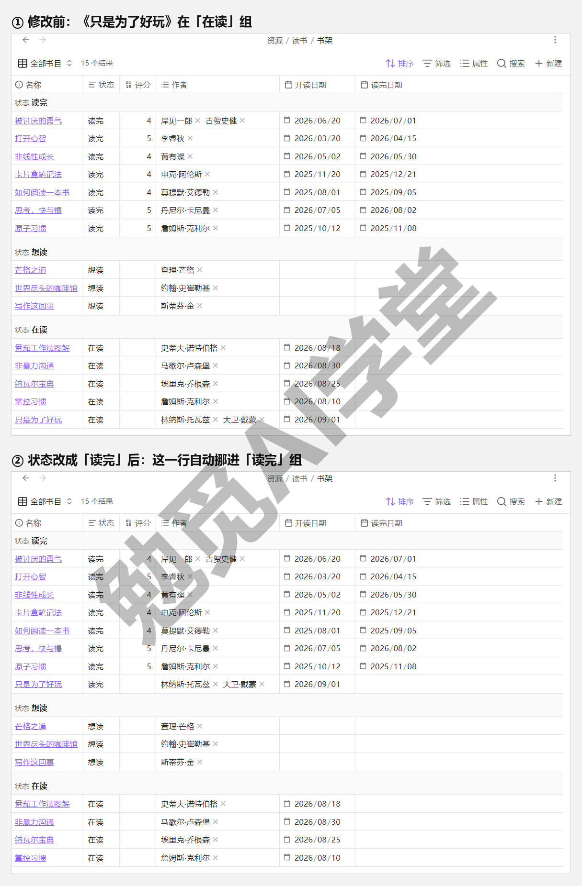

**视图二：在读。** 点视图名添加一个新视图，命名“在读”，在筛选菜单的“当前视图”一侧加条件：状态等于“在读”。列不用多，文件名、作者、开读日期足够。这张视图是日常用得最多的：平时打开书架，多数时候想确认的只是手头正读的几本，这张视图刚好只显示这些。

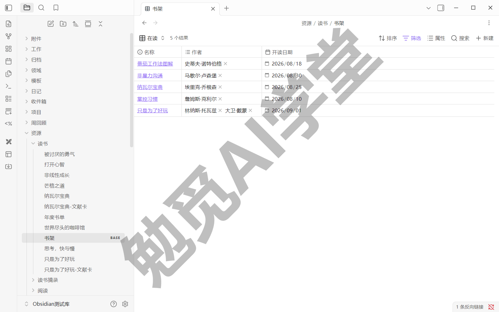

**视图三：评分榜。** 再添加一个视图命名“评分榜”，“当前视图”筛选条件：状态等于“读完”；再到排序菜单给“评分”加排序，方向选从大到小（数字属性的排序方向官方说明有从小到大或从大到小两种，菜单的具体写法需实机验证）。列留文件名、评分、读完日期、作者。做完历年读过的书按分数排开，向朋友荐书时打开这张就行。

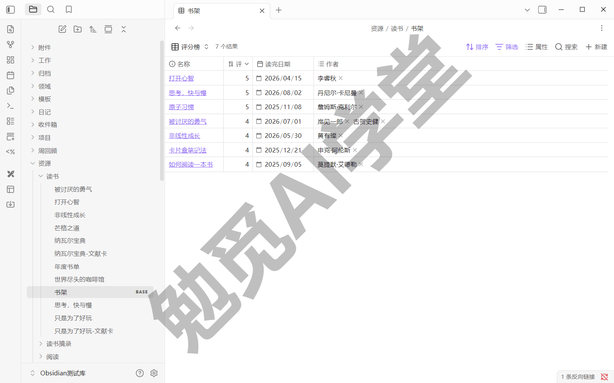

**可选：给评分榜加“只看今年”。** 想让榜单只统计今年，给这个视图再加一个条件：属性选“读完日期”，用日期比较把范围限到今年（日期条件的可选运算符随属性类型而变，《Bases 数据库》讲筛选三组件时交代过）。点选界面拼不出来时，点条件行右侧的“高级筛选”按钮，那一行就变成语句输入，直接写：

```
读完日期.year == today().year
```

`today()` 取今天、`.year` 取年份都是官方给出的函数与字段写法，中文属性名在语句里直接可用；写好的语句还能用旁边的“简单筛选”按钮换回点选式。年度盘点更成体系的做法在 17.5，用 Dataview 出一份可以带走的书单。

**配置全文，照抄可复现。** 上面全部点选操作等价于下面这份“书架.base”的内容。《Bases 数据库》讲过 .base 就是一个纯文本文件，记事本打开粘贴保存即可。字段结构按官方帮助书写，中文属性名与视图内条件照抄即可生效；排序配置官方语法文档未列出对应字段，照抄后到排序菜单里给“评分榜”补上评分降序即可：

```
filters:
  and:
    - file.hasTag("书")
views:
  - type: table
    name: 全部书目
    groupBy:
      property: note.状态
      direction: ASC
    order:
      - file.name
      - 状态
      - 评分
      - 作者
      - 开读日期
      - 读完日期
  - type: table
    name: 在读
    filters:
      and:
        - '状态 == "在读"'
    order:
      - file.name
      - 作者
      - 开读日期
  - type: table
    name: 评分榜
    filters:
      and:
        - '状态 == "读完"'
    order:
      - file.name
      - 评分
      - 读完日期
      - 作者
```

想要海报墙式的封面书架，可以给书目卡加“封面”属性、再添加一个卡片布局的视图，做法与《Bases 数据库》影单一节完全相同（当时用封面属性加卡片布局做出了海报墙），这里不重复展开。

### 17.5 Dataview 年度书单

书架解决“随时看”，年度书单解决“年底盘点、拿得出手”。两者的分工《Dataview 专讲》的决策表定过：清单交给 Bases 可视化维护，汇总交给 Dataview 自动生成。放到本篇就是：库内速览用 Bases，汇总报表用 Dataview。书单是一份要拿出去的报表：发给朋友、贴进年终总结，Dataview 渲染出的清单可以整段复制出去，改写也方便。

**LIST：今年读完清单。**《Dataview 专讲》教过的三行骨架直接用上：FROM 圈范围、WHERE 筛条件、SORT 排顺序；LIST 后面还能缀一条附加信息，这里缀评分：

```
LIST 评分
FROM #书
WHERE 状态 = "读完" AND 读完日期.year = date(today).year
SORT 读完日期 ASC
```

逐行读作：从带“书”标签的笔记里，挑出状态为“读完”、且读完日期落在今年的，按读完时间从早到晚列出，每条后面缀上评分。`date(today)` 取今天再用 `.year` 取年份，两个年份相等就是“今年”。这一句让书单自动跟着年份走，明年一月一日起它自动清零重记，不用改任何东西；想固定盘点某一年，把条件改成 `读完日期.year = 2026` 即可。

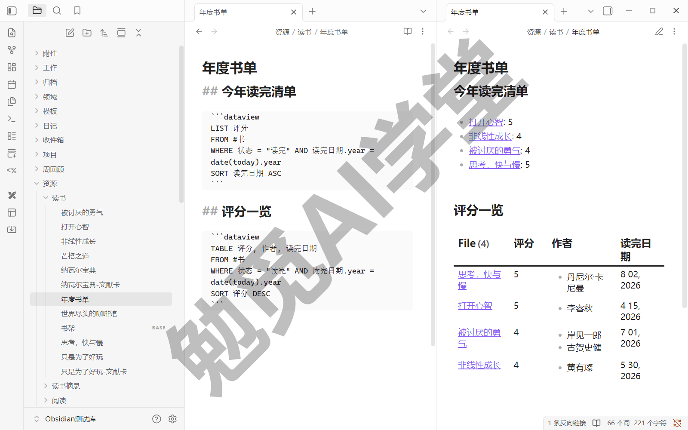

**TABLE：评分一览。** 把 LIST 换成 TABLE，就从清单升级成带列的表。《Dataview 专讲》讲过 TABLE 后面跟要显示的列、逗号分隔：

```
TABLE 评分, 作者, 读完日期
FROM #书
WHERE 状态 = "读完" AND 读完日期.year = date(today).year
SORT 评分 DESC
```

按评分从高到低排，今年读完的书连同评分、作者、读完时间一屏看全。年底把这张表复制出去，一份年度阅读报告的主体就有了。

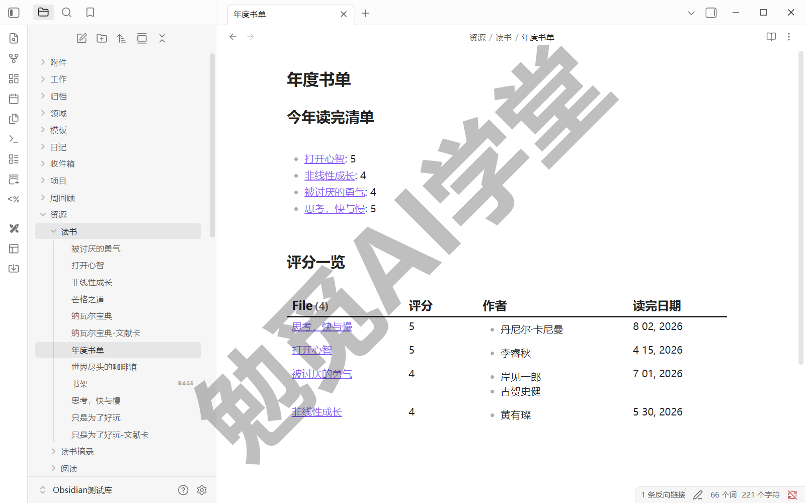

**字段全部来自属性：17.2 定的字段在这里派上用场。** 两段查询没有一处需要你手工维护：状态、评分、读完日期都是录入时随手填的属性，查询只是把它们汇总出来。反过来说，录入一处不规范，这里就查不出：状态写成“已读完”的书进不了 WHERE 条件，评分填成文字的书排不进 SORT。这笔账 17.6 马上算给你看。

**落位：建一页“年度书单”。** 在“读书”文件夹新建一篇“年度书单”，把两段查询放进去，一页顶用一年。更顺手的做法是把入口挂上首页：《个人知识库从零搭建》给库建过首页 MOC 当总入口，把“年度书单”链进常用入口区；书架也一样能挂：《Bases 数据库》讲过嵌入写法，感叹号加双方括号、井号指定视图，在首页写一行 `![[书架.base#在读]]`，每天一开库就能看见手头正读的书。

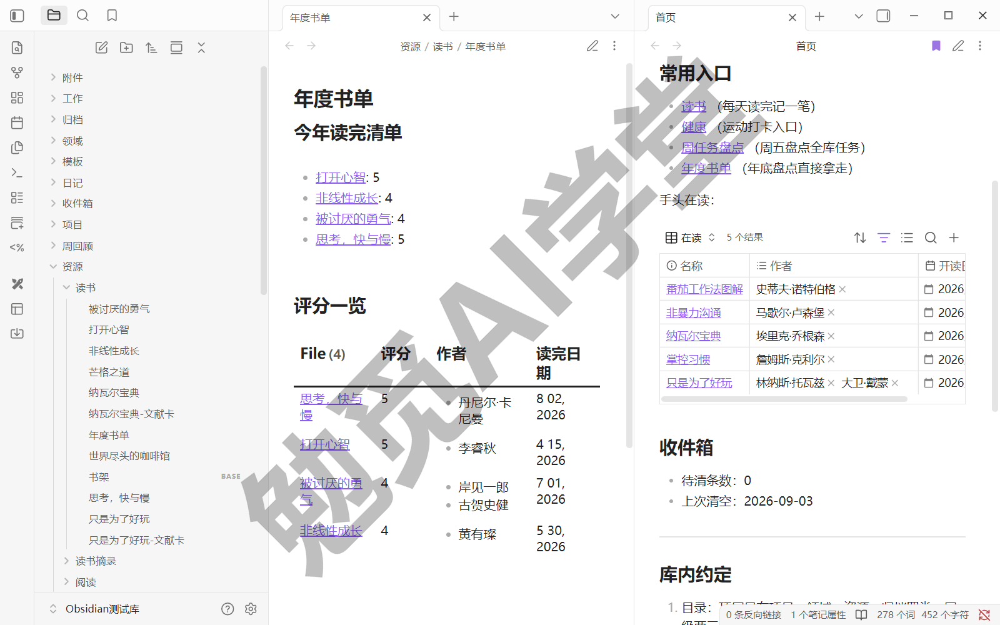

### 17.6 翻车实录：字段不一致的账单

系统跑通了，这一节故意把它弄坏一次。字段不一致是读书系统最常见的失效方式：它不报错、不弹窗，只是悄悄给你一份错账。错误现场照实保留下来：知道它是怎么错的、怎么查出来的，下次才防得住。

**现场：两处毛病同时冒出来。** 录入素材时故意留了两处最常见的手误：一本书的状态写成了“已读完”，另一本的评分填了“五星”两个字。系统的反应如下：

- 书架的全部书目视图里，“已读完”自成一组，因为分组只认字面值，多一个字就是另一组，看板凭空多出第四段，读完组里却少一本；
- 评分榜和年度书单同时漏书：“已读完”不等于“读完”，WHERE 条件不命中，那本书从今年的账上消失了；
- “五星”那本进得了读完组，却在评分排序里表现异常：文字混进数字列，比较不可靠（数字列混入文本值的具体表现，以实际界面为准）。

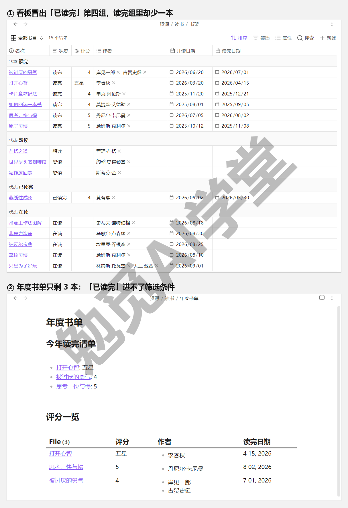

**排查：两个方向对着查。** 这类问题的麻烦在于“少了一本”不显眼，排查要主动：

- **由结果反推**：年度书单显示 3 本、你记得今年明明读完 4 本，差的那本是谁？对着书架总账扫一遍，找到状态或日期没填对的那行；
- **拿全部书目视图当核对表**：这张表本身就是最好的排查工具，状态列从上往下扫，“已读完”这种异类字面值一眼就能挑出来；评分列里混进的文字值同样藏不住。

再配一个查漏的搜索：《标签与属性》讲过方括号属性检索和 null 用法，`[状态:读完] [评分:null]` 一次找出“读完了却忘打分”的书，月底跑一遍，漏掉的评分当场补齐。

还要提防第三种常见手误：日期字段手敲出非标准写法。“2026年8月”这样的值不是合法日期，年度书单按年份筛选时它同样会漏。预防很简单：日期一律通过点击值弹出的日期选择器填（《标签与属性》讲日期类型时交代过这个选择器），不要手敲；已经写错的，点开重选一次就恢复标准格式。

**处置与预防。** 两张写错的书目卡点开改回标准值，看板当场归位、书单补齐。多本同错时先用属性检索把同错的圈出来再逐篇改；《标签与属性》交代过属性值没有原生的批量编辑，篇数太多时的最后办法仍是那一个：库是纯文本文件夹，外部文本工具可以批量替换（动手前先复制一份库做备份）。

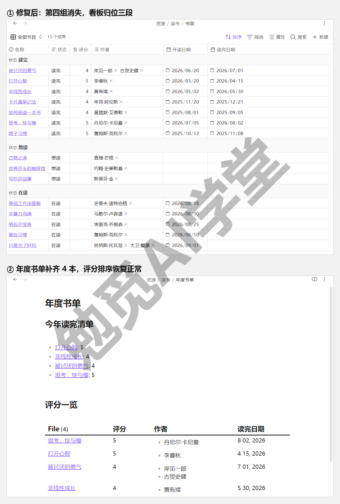

**从源头防住：新书一律走模板建卡。** 复盘一下两处错误的来源：都出在“没走模板、手工建卡”的那几本上。从模板建的卡，状态一建就是标准值“想读”，之后的每次变更只在三个既有值之间改，写错的机会本来就小；评分字段从第一张卡起就是数字型，填“五星”时输入框会拦下文字（拦截的具体表现以实机为准）。所以最有效的办法就是 17.2 定下的那条规矩：新书一律走模板建卡，把手工建卡从流程里去掉。模板给的默认值和字段类型，把大多数写错的机会挡在了录入之前。

### 17.7 成品读书笔记：从摘录到成文

书架和书单管住了“账”，但读书的收获不在账上。摘录再多也还是别人的话，只有用自己的话把它们组织一遍，这本书才真正变成你的。这一节拿一本读完的书，把文献卡里的摘录加工成一篇成品读书笔记。它也是下一篇《卡片盒写作系统》的预演：那一篇会把这条“素材到成文”的路线扩成完整的写作流水线。

**结构定成三块。** 成品笔记不用写长，把这本书讲了什么、你得到了什么说清楚就行。新建“书名-读书笔记”，骨架照抄：

```
## 一句话总评

这本书讲了什么、值不值得读、适合谁——一两句说完。

## 三个收获

1. 收获一：用自己的话写，不抄原文；需要引用时链去文献卡。
2. 收获二：写法同第一条。
3. 收获三：写法同第一条。

## 金句

> 原文（第 xx 页）

一句话：它为什么打动你。
```

三块各有来处：一句话总评直接从书目卡搬来（17.3 结账时写过，这里可以再打磨）；三个收获从文献卡里挑：把摘录从头翻一遍，挑出真正改变你想法的三条，用自己的话重写。三条是最低要求，用意是让你做挑选；真有第四条当然可以写，但写不出三条就该回文献卡再读一遍，说明还没消化到能写的程度。金句留给舍不得改写的原文，带上出处。

**与书目卡互链。** 成文开头链一句“书目卡：[[书名]]”，再回书目卡把“成品笔记”一节的链接补上，两头都能跳。《双链与图谱》讲过反向链接的作用（每篇笔记都能看到“谁链接了我”），所以就算哪天忘了补某一头，反向链接面板里也找得回来。想让成文自带书的档案，用那一篇讲过的嵌入写法，在成文里写一行 `![[书名]]`，书目卡整篇嵌进来（阅读视图下嵌入只渲染正文，属性区不随嵌入显示）。

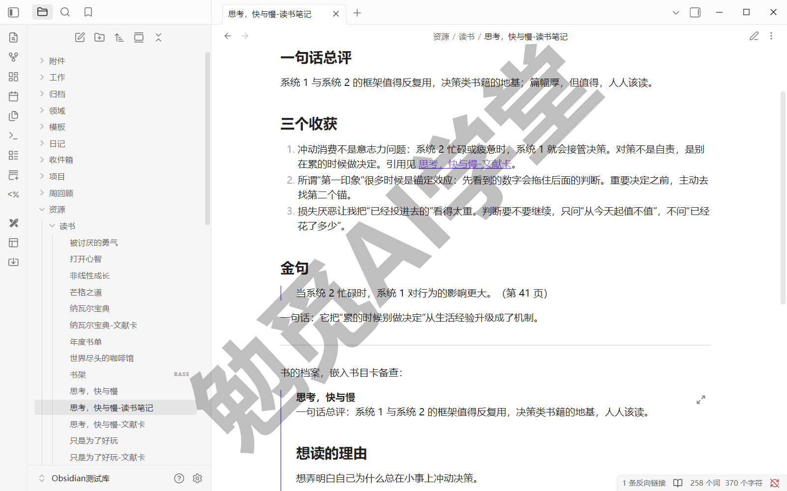

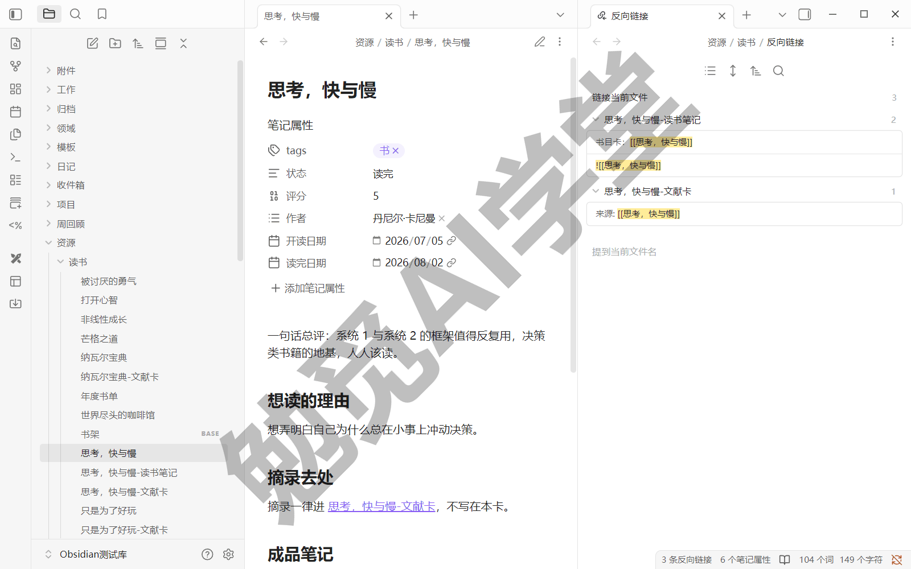

**写作时机与体量预期。** 成文最好安排在读完后的一周内：这时文献卡里每条“为什么留下”还看得懂，总评的印象也还准；拖上两个月，摘录就成了一堆没有上下文的句子，加工起来要费更多力气。体量不用大，五百字上下就是一篇合格的成品笔记；重要的是经过了你的挑选和改写，字数本身不说明什么。

**也不是每本书都配成文。** 评分高的、真正改变了你想法的书才值得走这一步，三五本里挑一本是正常比例。其余的书，书目卡加文献卡已经是完整的交代；书架看板上“读完但没有成品笔记”的书不算没做完的事，那本身就是你对这本书的评价。成文只写值得写的书，这套系统才能长期维持下去。

**这篇成文的去处。** 它不只是练习。《卡片盒写作系统》会把文献卡升级并入卡片盒：补出处、改用自己的话，摘录进一步变成一张张独立的想法卡；而课程最后的《毕业：数字花园上线》要把库里的精选内容发布成公开的个人知识站，这篇成品读书笔记就是第一批候选内容。今天认真写的一篇，后面两篇都会用到它。

### 17.8 验收清单

整篇是一个项目，验收按下面五项逐条判定，全过才算交付。

- **读书模板与文献卡可用**——判定标准：新建笔记套读书模板，一步得到全部五个字段且类型正确（文本、数字、列表、两个日期各就各位）；文献卡模板的类型、来源、主题三字段就位；两张模板都存在模板文件夹里，随时可以再用。
- **书架三个视图配好**——判定标准：全部书目按状态分成三段；任改一本书的状态，那一行当场挪进对应分组；在读、评分榜两个视图切换正常，评分榜按分数从高到低排列。
- **年度书单查询跑通**——判定标准：LIST 与 TABLE 两段查询都渲染出结果，且不需要手工维护——随手改一本书的评分或读完日期，回到书单页结果跟着变。
- **至少五本书完整走过一生**——判定标准：五本书从“想读”建卡起步，经“在读”（有开读日期、文献卡里有摘录），到“读完”（状态、读完日期、评分齐全）。这一项不必当天凑满，读完一本销一本，账在书架上一目了然。
- **一篇成品读书笔记完成**——判定标准：一句话总评、三个收获、金句三块齐全；与书目卡互链，两头点击都能跳到对方；收获部分是自己的话，不是摘录的搬运。

### 17.9 本篇小结与自检

这一篇搭起了读书笔记系统：书架看板、自动书单，和一篇从摘录加工出来的成品笔记。最需要记住的是：**系统能自动汇总的前提是录入守规矩——字段统一靠模板保证，而不是靠事后记性。**

可以对照下面的清单检查学习结果：

- [ ] 读书模板与文献卡建好，新书按模板一键建卡
- [ ] Bases 书架三个视图配好，状态一改看板自动挪位
- [ ] Dataview 年度书单查询跑通，字段全部来自属性
- [ ] 至少五本书完整走过“想读 → 在读 → 读完”的一生
- [ ] 一篇成品读书笔记完成，与书目卡双向互链

完成这些内容后，读过的书从此有账可查。下一篇《卡片盒写作系统》把记下来的东西再往前推一步：从“存起来”到“写出来”。

### 17.10 新手常见问题

**Q1：已经在豆瓣、微信读书记了很多，要不要搬进来？**

先别急着搬历史，别让搬家拖住开工：从今天在读的书开始进系统，历史数据只挑真正高价值的少量补录。微信读书的划线和笔记，社区里有能同步进库的插件，装不装按《社区插件系统》定过的纪律来：先看官方目录里的维护状态和评分卡再决定，以插件市场当前在列情况为准；课程主线不依赖它，手动把最重要的几本补成书目卡完全可行。豆瓣没有官方的笔记导出，常见做法是把“读过”清单里舍不得丢的书手动录进来，评分凭当时的印象补。

**Q2：字段设计到多细才够用？**

判定标准还是《标签与属性》那句：这条信息将来要不要排序、筛选、计算？要，才配一个字段。本篇的五个字段已经支撑起三张视图加两段查询，对多数人就是够用的答案。想加“页数”“出版社”“类型”当然可以，守两条纪律：加之前想清楚哪张视图或哪段查询会用它，用不上的字段只会增加录入负担；决定加了就进模板，新书自动带上、旧书集中补齐，最怕一半书有、一半书没有，那就是 17.6 翻车的变体。

**Q3：Bases 和 Dataview 都能出书单，到底用哪个？**

按《Dataview 专讲》决策表定过的分工：清单要日常翻看、要直接改数据，用 Bases，书架看板就是例子，改状态改评分都在表里点；汇总要拿出去、条件写得复杂，用 Dataview，年度书单就是例子，按年份筛选、复制出去就能用。本篇两个都用，恰好是这个分工的示范：库内速览用 Bases，汇总报表用 Dataview。不必二选一，它们读的是同一批属性，地基是同一块。

**Q4：电子书和网文的摘录怎么进系统？**

来源不同，落点统一：都进那本书的文献卡，格式照旧：摘录原文，加一句为什么留下。具体路径分三类：微信读书、Kindle 这类有笔记导出能力的，把导出的划线文本粘进文献卡，章节页码保留；网页连载和长文，用《移动端与网页剪藏》讲过的剪藏能力，高亮段落能一并剪成 md，剪藏稿里的精华再挑进文献卡；纸质书只能手打或拍照转文字。摘录量以“将来值得再看”为准，不必追求全文搬运。
