## 卡片盒写作系统

这一篇做课程的第三个完整项目。《个人知识库从零搭建》搭起了一座能日常运转的库，《读书笔记系统》让读过的书有账可查，这一篇解决再往前一步的问题：攒了一堆笔记，要写东西时还是从零开始。把卡片盒方法（Zettelkasten）在 Obsidian 里用起来：闪念卡、文献卡、永久卡三类卡流转起来，用图谱和 MOC 连成网，最后从卡片里攒出一篇真正发出去的文章。

先把“卡片”这个词说清楚：它不是什么新的文件类型，每张卡就是库里一篇普通的 md 笔记，只是刻意写得短，一张卡只装一个想法。本篇截图里你在文件列表、画布上看到的每张“卡”，本体都是这样一篇笔记，所以前面学过的链接、属性、搜索，对它们全部适用。

本篇是全课要讲的概念最多的一篇，所以反着讲：先看效果，再讲方法。第一节先看一篇成文是怎么由十几张卡拼出来的，看完你再学每一步，就知道学它们是为了什么。

### 18.1 项目定位：从存起来到写出来

**先说问题**。你大概有过这样的体验：收藏夹越来越厚，笔记越记越多，可真要写点东西（一篇公众号文章、一份观点输出、哪怕一条像样的长评），打开编辑器还是空白一页，脑子里也是空白一片。存了那么多，写的时候一点都使不上劲。

问题不出在材料少，出在材料的状态：读过的东西还是别人的原话，想过的念头散在各处没有下文，它们既没被加工成“你自己的想法”，彼此之间也没有连接。写作要的是加工过、彼此连接好的想法；卡片盒方法要解决的正是这件事。

**成果预览**。这一篇交付两样东西：一条能持续运转的写作流水线（三类卡片、每天十分钟的攒卡流程、从卡片网络里找选题的办法），和一篇由至少八张卡攒成、真正发布出去的文章。文章同时是实物验收：流水线转没转起来，看它就知道。

**先行演示：一篇成文的来路**。概念先不讲，先看成品。演示库里有一篇已经发出去的短文《不靠意志力，把习惯养起来》，全文一千多字、五个段落，现在把它的来路回放一遍：

- 开头描述问题的那一段，来自几周前的一条随手记录：“今早又刷了半小时手机才起床——是不是把手机放远点就能解？”当时顺手记下就没再管，写文章时它成了现成的开场；
- “意志力靠不住”一段，主体来自一张卡片《环境比意志力更能决定行为》，卡上本来就是几句写完整的话，直接搬进来改了改语气就能用；
- “从两分钟开始”一段，来自另一张卡《把开始的动作缩到两分钟以内》，连里面举的例子（把跑步鞋前一晚放到门口）都是卡上原有的；
- 结尾落在身份认同上，又是一张卡：《先决定成为什么人，再谈做什么事》。

段落之间引用的书里说法（习惯循环、环境设计），则来自《原子习惯》这本书的摘录卡，书名页码都在卡上，引用时不用翻书。

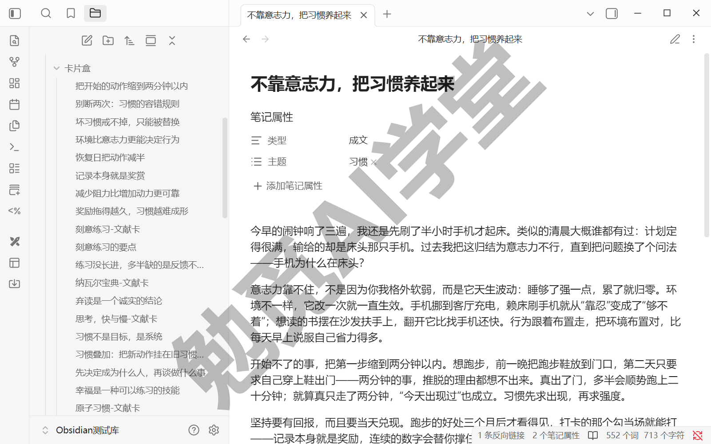

数一数，这篇文章动用了十几张卡。写作那天实际做的事，是把这些卡排了个顺序、补上过渡句、统一了语气，用了半个下午。这些卡没有一张是为这篇文章准备的，都是过去几周里零零散散攒下的。也就是说，文章的大部分内容在动笔之前就已经写好了，写作那天只是把它们拼起来。这就是本篇要交付的能力。它对所有需要持续输出的人都有用：写公众号的、做视频脚本的、定期写报告的，输出频率越高，卡片复用省下的力气就越多。

**这一篇怎么学**。和前两个项目一样，用到的功能基础篇都讲过，本篇只在用到的地方点名，不再展开：《双链与图谱》的链接、未链接提及、嵌入、局部关系图和 MOC，《Canvas 画布》的排结构，《库、文件与搜索》的组织方式分工，《导入、导出与发布》的导出能力，再加上《读书笔记系统》攒下的文献卡。素材也接着用：前两个项目的库和书，就是这一篇的地基。

### 18.2 卡片盒是什么：三类卡与流转规则

**方法的来历**。Zettelkasten 是德语，直译就是“卡片盒”。它因德国社会学家卢曼（Niklas Luhmann）出名：他用木盒子装了几万张相互编号引用的纸质卡片，一生著述极丰（几十本书、数百篇论文），他自己把高产归功于这套卡片系统。方法的核心可以概括成一句话：**与其攒一堆日后要从头消化的长笔记，不如把每个想法当场加工成一张能独立成立的卡片，写作时直接取用。**

你可以把它理解成一座零件仓库：零件都加工好、分类挂在架子上，要组装什么，取件拼装就快。多数人的笔记库正相反，存的都是没加工过的原始材料，每次要用都得先从头消化一遍，存得越多，用起来越慢。

现在通行的“三类卡”框架，出自《卡片盒笔记法》（Sönke Ahrens 著，英文名 How to Take Smart Notes），这本书把卢曼的做法整理成了可学的步骤。三类卡各是什么、各干什么，逐个说：

**闪念卡**——随手抓下来的原始想法。灵感、疑问、一句牢骚都算，它的作用是当原料：价值在于别让想法跑掉，不在于它本身多完整。它只保留很短的时间，几天内要么被加工、要么被删掉。这类卡你其实已经在用了：《日记、模板与每日工作流》配好的唯一笔记入口——一键生成时间戳笔记、落进收件箱——那就是本课的闪念卡通道，本篇原样沿用。

**文献卡**——从读的东西里来的笔记。《读书笔记系统》里你已经给每本书建过文献卡记摘录，这里把它升级并入卡片盒，升级就两处：一是补全出处（书名与页码，或文章链接），保证将来引用时查得回去；二是把纯摘抄改写成自己的话——原文照抄不算消化，这也是在为下一类卡的要求做准备。

**永久卡**——《读书笔记系统》结尾预告过“摘录会进一步变成一张张独立的想法卡”，说的就是它。永久卡是卡片盒的正式成员，也是整套方法的核心资产，三条硬要求：一卡只装一个想法；用自己的话写成完整的句子；写给十年后的自己——那时你早忘了上下文，所以每张卡必须不依赖上下文就能读懂。“永久”指“值得永久保存”，不是“写完不许改”，卡片随时可以修订。

**流转规则** 把三类卡串起来：闪念卡定期加工，值得深想的才升级成永久卡，大多数闪念最后会被删掉，这很正常：闪念的任务只是先把想法接住，不要求每条都升级；文献卡在读完之后提炼，一本书通常只出得了几张永久卡，出不了也正常；每张新永久卡入盒时有一条纪律：必须连上至少一张已有的卡，并写明为什么连，具体做法在 18.4 展开。三类卡按一个方向流动：闪念卡和文献卡是入口，永久卡是正式存放的地方，文章是最终产出。

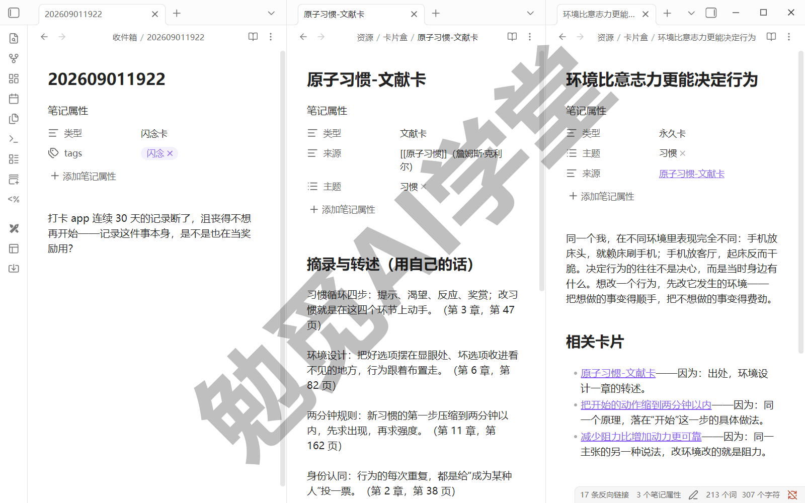

### 18.3 三类卡模板与存放

**先定存放：盒内不分子文件夹**。《库、文件与搜索》定过组织方式的分工：文件夹只管粗归属、保持浅结构，知识之间的关联交给双链。卡片盒把这个决策用到了极端：**盒内不再分任何子文件夹**，所有文献卡、永久卡平放在同一个“卡片盒”文件夹里，几百张也不分。理由是：卡的价值在链接上，找一张卡靠的是链接、搜索或 MOC，很少去翻目录；一旦按主题分了子文件夹，“这张卡该放哪”的分类问题又会回来，而《库、文件与搜索》讲过，这类问题该用链接解决。位置上，在《个人知识库从零搭建》的简化 PARA 骨架里给它安排一个位置即可，建议放“资源”大类下，顶层一个“卡片盒”文件夹就够了。

闪念卡不进盒：它们照旧待在收件箱，升级成永久卡的那一刻才搬进卡片盒文件夹。收件箱只是中转站，卡片盒才是正式归宿，两边别混。《读书笔记系统》攒下的文献卡则一并迁进来：在文件列表里把它们从原来的读书文件夹拖进卡片盒即可，Obsidian 会维护好既有链接，书目卡留在原处不动。

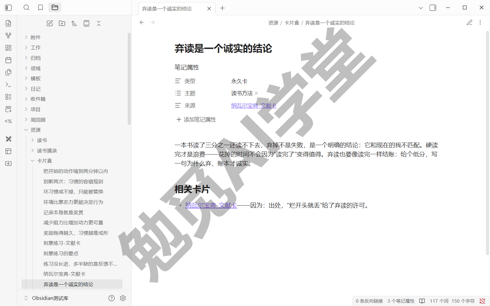

**命名：标题直接写想法**。永久卡的标题就是那句想法本身，比如《环境比意志力更能决定行为》，而不是《关于习惯的思考 3》。卢曼当年给卡片编号（1、1a、1a1 那一套）是纸质时代维系关联的不得已，数字库里链接就是编号，不必模仿。标题即想法还有个实际好处：别的卡里用 `[[` 链它时，链接文字本身就是论点，读上下文时不点开也能懂。

**三张模板**。模板放进你在《个人知识库从零搭建》配好的模板文件夹，套用方式沿《日记、模板与每日工作流》讲过的模板插件，属性字段的含义与写法在《标签与属性》讲过，模板正文里标题、列表这些 Markdown 写法见姊妹篇《Markdown 通用语法手册》的《基本语法》篇。这些都不用回头补课，照抄能直接用。方括号里的内容换成你自己的。

闪念卡模板（就是《日记、模板与每日工作流》给唯一笔记挂的极简模板，多一个类型字段）：

```
---
类型: 闪念卡
tags:
  - 闪念
---

```

文献卡模板：

```
---
类型: 文献卡
来源: "[书名或文章名，附页码或链接]"
主题:
  - "[一两个词]"
---

## 摘录与转述（用自己的话）

## 想到的

```

永久卡模板：

```
---
类型: 永久卡
主题:
  - "[一两个词]"
来源: "[出处或对应文献卡，可留空]"
---

[用自己的话，把这一个想法写成完整的几句话。]

## 相关卡片

- [[另一张卡]]——因为：[一句话说明这条连接为什么成立]
```

字段刻意只留三个：“类型”区分三类卡，后面搜索和检查都靠它；“主题”给 MOC 和检索一个入口；“来源”保住“查得回去”。字段的名字和属性类型都沿用《读书笔记系统》给文献卡定下的约定（类型、来源是文本，主题是列表），文献卡迁进盒里不用动结构，只升级内容；属性类型在整座库里是按名字统一的（《标签与属性》讲过），前后两篇保持同型，属性面板才不会报类型冲突。想加更多字段先忍住：《读书笔记系统》的翻车实录讲过，字段一多、写法一飘，靠字段做的汇总就开始漏账；卡片盒也一样，字段宁可少，但每个字段的写法要统一。三张模板全文可照抄。

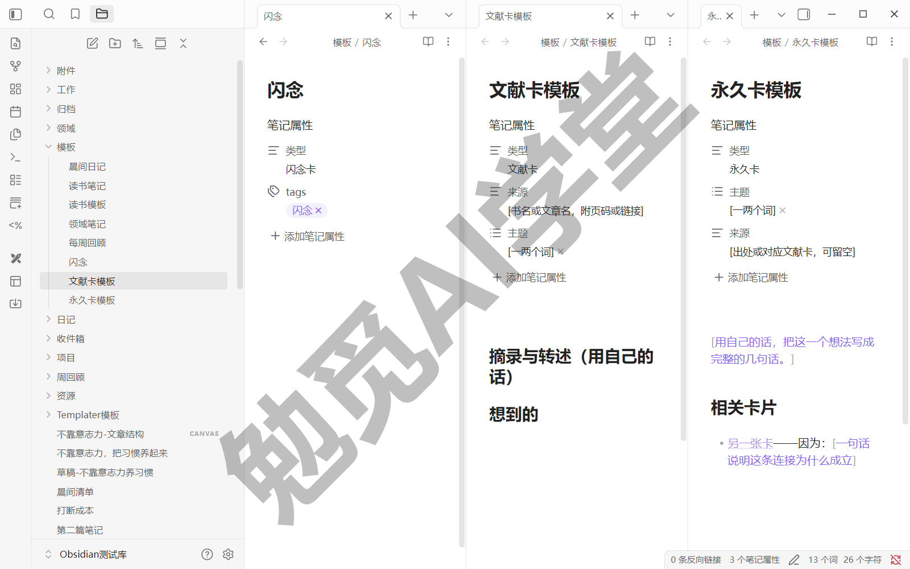

### 18.4 攒卡工作流：每天十分钟

卡片盒要靠每天十分钟的固定流程维持，攒到周末集中整理是做不下去的。流程只有三个动作：白天随手记，固定十分钟加工，读完东西提炼。下面逐个说清。

**白天：闪念照旧进收件箱**。完全沿用《日记、模板与每日工作流》一条龙（晨间日记—闪念速记—每周回顾）里的闪念通道，不另起炉灶：想法冒出来，一键唯一笔记，时间戳自动命名、位置固定进收件箱，十秒记完回去干活。人在外面时，手机端一样有速记入口，做法在《移动端与网页剪藏》。这一步唯一的要求是别筛选：闪念阶段不判断价值，先接住再说。

**每天十分钟：挑着升级**。固定一个时段（晚间或次日早晨都行），打开收件箱，逐条过，每条问两个问题：这个想法一周后还值得看吗？我能用自己的话把它讲完整吗？两问都过的，升级成永久卡：套永久卡模板新建一张，用自己的话写成完整句子（或者直接改写这条闪念本身：补内容、改标题、移进卡片盒文件夹），然后执行下面的写卡纪律。两问有一问不过的，删掉或先留着观察。别贪量：十分钟升一两张是常态，一张不升也正常。大多数闪念本来就到不了升级的标准，出现这种情况说明流程是正常的，不用怀疑自己。

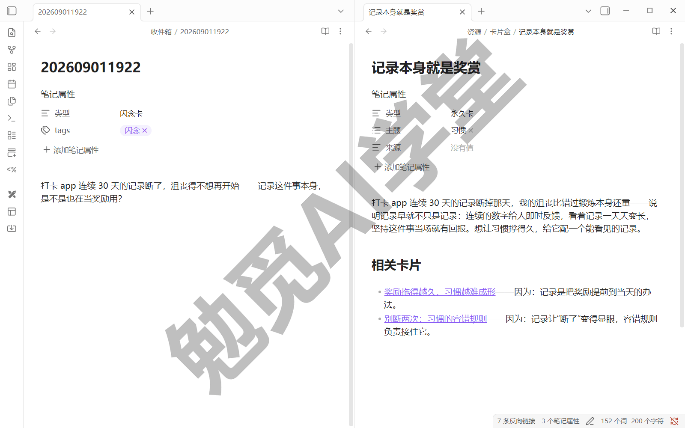

**写卡纪律：必连旧卡，并写为什么**。新永久卡入盒前，必须连上至少一张已有的卡，并在“相关卡片”一节的链接后面写明这条连接为什么成立，比如“因为它是这个想法的前提”“因为两者互相矛盾”“因为是同一个原理在另一个场景的应用”。这条纪律是卡片盒和普通笔记堆的根本区别：将来的文章，就是从这些连接和连接的理由里来的。找不到可连的卡怎么办？分两种情况：盒子还太小（头两周很正常），先连到主题 MOC 上也算数；或者，这个想法你还说不清它和已有认知的关系，这恰恰说明卡还没加工完，把“因为”想出来，加工才算结束。可以记成一条判断标准：**写不出“因为”的连接，不算连接。** 守住这一条，18.7 里的第三种失败就提前防住了。

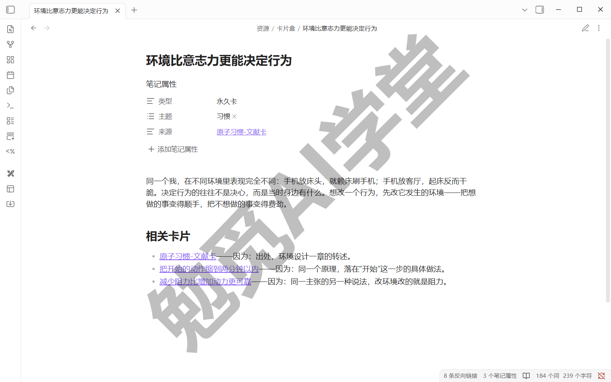

**读完东西：从文献卡里提炼永久卡**。读书照《读书笔记系统》的流程走，边读边把摘录记进文献卡；读完之后多做一步：挑出对你触动最大的两三处，各写成一张永久卡：用自己的话重写、按纪律连上旧卡，“来源”字段填上那张文献卡。文献卡本身留在盒里作为出处，将来文章里要引原文、标出处，回它那里取。

**用“未链接提及”找失散的关联**。卡攒多了会有惊喜：某张新卡讲的事，旧笔记里其实提到过，只是当时没链上。《双链与图谱》讲过反向链接面板的下半区“未链接提及”：它列出正文里出现了当前笔记名字却没加链接的地方，悬停条目点一下就能把提及变成正式链接，那一篇把这个动作叫“转正”。每周给新入盒的永久卡逐张看一眼未链接提及，常能捡回失散的连接；标题即想法的卡尤其受益，旧笔记里出现过这句话的近似说法时，列表里会把它们列出来。再配合别名（《双链与图谱》讲过的 aliases 属性，给一张卡登记几种叫法），能找回的关联更多。

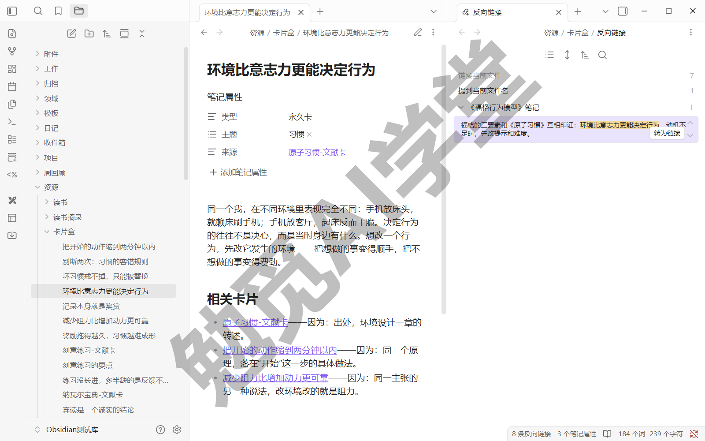

**和每周回顾衔接**。这套流程不新增任何固定环节：《日记、模板与每日工作流》的每周回顾模板里本来就有“收件箱清空”一段，每天十分钟没做完的加工，回顾时一并补上；《个人知识库从零搭建》的一周流照常跑。卡片盒是搭在已有工作流上的，不是另一套系统。

### 18.5 连网：图谱、MOC 与主题涌现

前面几节是写卡，这一节把卡连成网，然后回答写作最难的那个问题：写什么？

**局部关系图：看一张卡的邻居**。《双链与图谱》讲过局部关系图：只画当前笔记及其关联笔记的小图，过滤器顶部的深度滑杆控制显示几层邻居。打开一张永久卡，调出局部关系图（命令面板执行“打开局部关系图”命令），深度调到 2，你会看到这张卡的邻居、以及邻居的邻居。顺着小图漫游是卡片盒最舒服的读法：从一张卡点过去，常会撞见几周前的自己留下的想法，而且它正好补上你现在缺的一块。写不出卡、没有灵感的日子，就去盒里顺着链接看十分钟，常常能找到新的想法。

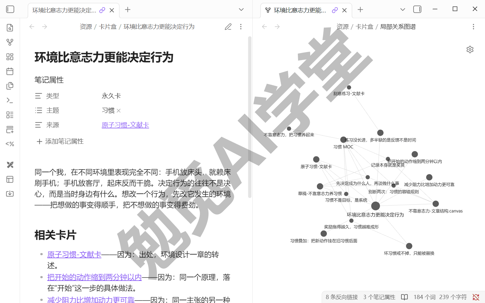

**主题 MOC：收拢同主题的卡**。同一主题的卡攒到二三十张，给它建一页 MOC。《双链与图谱》建过第一页，MOC 就是一篇由链接组成、分了组、每条带一句注释的目录笔记。卡片盒里的 MOC 建议按“论证角色”分组，而不只是按话题：“核心主张”“证据与例子”“反对意见”“还没想通的”。这样分的好处在写作时会体现出来：这页 MOC 几乎就是文章的雏形，分组顺序理一理，就是行文顺序。

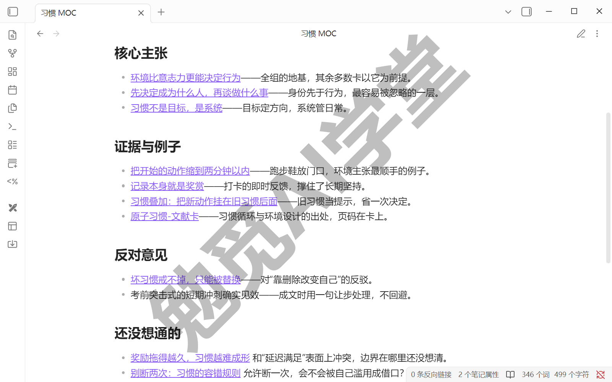

**图谱上的聚团，就是可以写的选题**。《双链与图谱》给图谱安排过三个任务（过滤、着色、找孤岛），当时说图谱的真实用法要到实战里才用得上，就是现在。打开全局图谱，用那一篇练过的 `path:` 过滤把范围圈到卡片盒文件夹，再按主题分组着色，然后看形状：图上某处“结成一团”，十来个点彼此密连，对外只有稀疏几条线，**一个聚团就是一个已经成熟的选题**：这些卡之间互相支撑或互相反驳，主张、证据、反例都到位了，只差把它们串成文。这也是卡片盒选题和普通选题的差别：普通选题是先想“我要写什么”、再去找材料；卡片盒选题是看盒子里哪一片材料已经齐了，直接写。

**现场示范**。演示库的图谱着色之后，“习惯”一片明显聚成了一团：《原子习惯》的文献卡居中，周围七八张永久卡互相连着，环境、两分钟、身份认同、记录即奖赏各占一点。就它了，定为选题，下一节把它写出来。

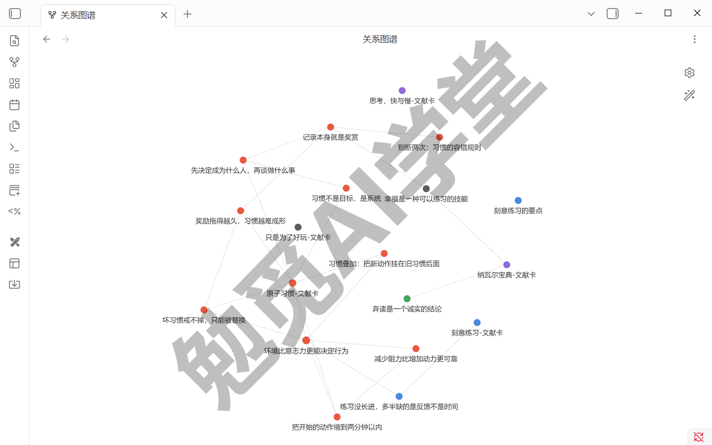

**聚团还不够成熟怎么办**。多数时候你看到的还不是成熟的聚团，只是三四张卡的小组合：主张有了，证据和反面还缺。别硬写，先记一笔：在对应的主题 MOC 里开一个“候选题”分组，把这几张卡挂进去，写一句还缺什么（“缺反例”“缺我自己的实践”）。之后的攒卡就有了方向性：读到相关材料、冒出相关闪念，你会自然多留意。等某次回看时发现候选题下的卡已经够支撑一篇文章了，再定题动笔。

**连网的维护节奏**。这张网不用天天打理，挂在每周回顾里三个动作就够：给本周新入盒的卡看一眼未链接提及（上一节讲过的转正动作）；新卡随手挂进对应的主题 MOC，没有合适的 MOC 就先不挂，等同主题攒够再建；到图谱里扫一眼孤点：《双链与图谱》教过用“孤立文件”开关找出没有任何连线的孤立笔记，卡片盒里的孤卡多半是当初没执行“必连旧卡”纪律就入了盒的卡，按 18.4 的办法补上“因为”，补不出的考虑降级或删除。三个动作合计十来分钟，这张网就一直用得上。

### 18.6 从卡片攒出一篇文章

选题定了，这一节把这团卡片变成文章。四步：排结构、串初稿、并稿、改写打磨。

**第 1 步：Canvas 排结构**。《Canvas 画布》定下的做法（先整理材料、再动笔）在这里正式派上用场：结构没想清楚时先别动笔，把材料摊开、把关系连上，结构就渐渐清楚了。新建一块画布，把聚团里的卡全部从文件列表拖上去；那一篇讲过，画布上的笔记卡就是笔记本身，双击直接读、直接改（画布内编辑与源笔记的同步细节，以实际表现为准）。然后照“文章结构梳理”案例的做法整理：把卡拖成先后顺序，连线写上“支撑”“承接”“反驳”，最后框出“开头”“主体”“结尾”三个分组。整理的过程就是构思：哪张卡当主线、哪张只配做注脚、哪两张其实在说同一件事，拖几下就看清了。

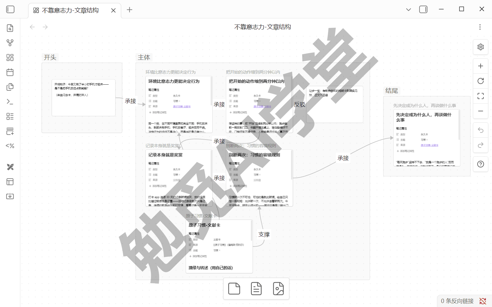

**第 2 步：嵌入串初稿**。回到笔记区，新建一篇草稿（比如“草稿-不靠意志力养习惯”），照画布定下的顺序，把每张卡用 `![[卡片名]]` 逐张嵌进来。《双链与图谱》讲过嵌入的性质，这里正用得上：嵌入是引用不是复制，源卡一字不动，草稿里就能把全文连起来通读。通读两遍，检查顺序顺不顺、哪两段之间缺过渡。这一步还没开始“写”，只是验骨架，骨架不顺就回画布再调。

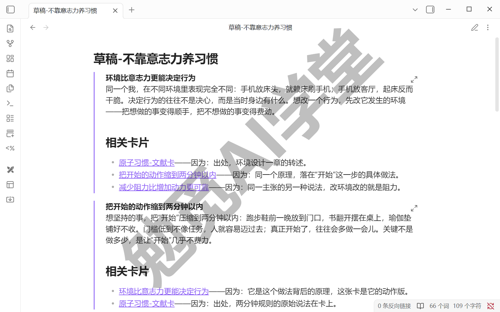

**第 3 步：并稿——用笔记合成器**。骨架验过，就要把卡片正文真正搬进草稿来改写了。手工做法是逐张打开、复制、粘贴，十几张卡下来又慢又容易漏。Obsidian 有一个官方核心插件专门处理这类机械操作，也就是笔记的合并、拆分与提取，英文名 Note composer。名称先交代清楚：本课程叫它“笔记合成器”；界面上它叫“笔记重组”，设置左栏和核心插件列表都是这个名字，描述写着“合并两篇笔记，或将笔记部分内容移动到另一笔记中”。

**在哪开**：打开设置，进入核心插件页，找到“笔记重组”，确认它的开关处于开启；它默认就是开着的，一般不用你动手。

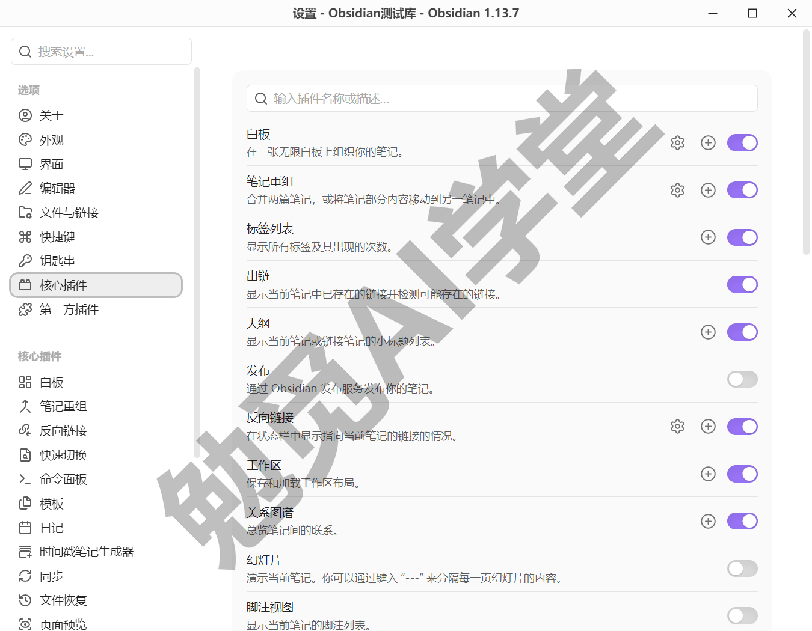

**合并笔记怎么用**。合并的动作是“把一篇笔记的内容并入另一篇”。两个入口：

- 在文件列表里右键要并入的那张卡，点“将该笔记合并到…”，再选目标草稿；
- 或者打开那张卡，在命令面板执行“将当前笔记合并到其他笔记中”。

选目标时的确认按键决定并到哪个位置，选择器下方的提示原文依次是：回车“并入所选笔记末尾”、Shift+回车“并入所选笔记开头”、Ctrl+回车“新建笔记后合并”、esc 退出。默认每次合并会弹确认提示。

**合并后源笔记的去留，动手前必须看清**：合并会把源笔记内容并入目标之后**删除源笔记**，确认弹窗里写得明明白白：“合并后 ×× 将会被删除”；官方帮助还说明全库指向源笔记的链接会自动改指合并后的笔记（实际表现以当前版本为准）。对闪念卡、一次性的临时笔记，这正是想要的效果：并完即清，收件箱少一条。但对永久卡，这等于把它从卡片盒里拿走、固定进某一篇文章：盒里那张卡没了，指向它的链接全被改道，下一篇文章想再用这个想法，就没得用了。万一真误合并了，也有后路：官方的文件恢复插件可以找回（《同步与备份全解》讲快照恢复时提过这类补救办法，具体入口以实机为准）。

**它和嵌入的分工**：嵌入只是引用，源卡不动；合并是把内容搬过去，正文进了草稿、源卡默认被删除。所以验骨架时用嵌入，到了要出正文的时候才用合并或复制。

**所以永久卡宜用提取式或复制式并入**，按稳妥程度给你排三档：

- 最稳妥：普通复制粘贴。打开卡，复制正文段落贴进草稿，源卡一字不动，卡片盒毫发无损。课程推荐永久卡默认走这档。
- 折中：用合成器的“提取”把选中内容移过去。在卡里选中要用的段落，右键点“将所选内容移动到其他笔记中”（命令面板里也有同名命令），选目标草稿。注意它是“移动”：默认原处会被替换成一条指向目标的链接（设置项叫“替代原文的方式”，默认“链接存放移动内容的笔记”，可改成“插入存放移动内容的笔记”或“无”）。卡还在、链接还在，但那段原文离开了卡片，用前想清楚。
- 省事但危险：整卡合并。只给用完即弃的闪念卡和临时草稿用，永久卡不要碰这一档。

**提取更合适的用途：拆分装了两个想法的卡**。提取最合适的用途，是维护“一卡一想法”这条纪律：一张永久卡越写越长、其实装了两个想法时，选中第二个想法的段落，执行“将所选内容移动到其他笔记中”，按 Ctrl+回车把选中内容新建成一张卡（按键提示形态与合并选择器同款，以实机界面为准）。新卡分出去，原卡默认留下一条指向它的链接，两张卡自动连着，顺手在链接后补上一句“因为”，正好符合写卡纪律。另外，合成器设置里还可以挂一个模板文件，用 `{{content}}`、`{{fromTitle}}` 这类变量定制并入的格式（变量与设置项以官方帮助为准），课上用默认行为就够。

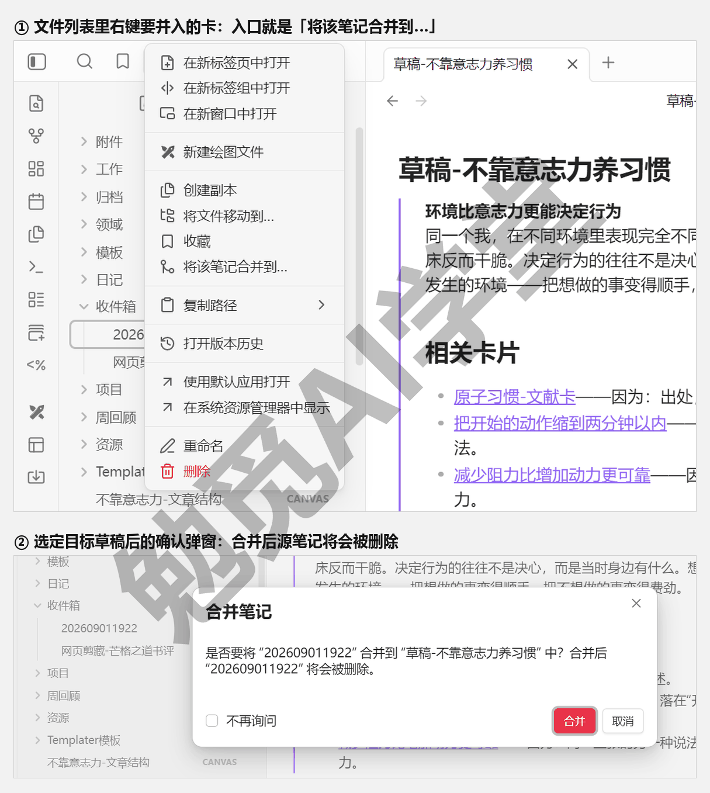

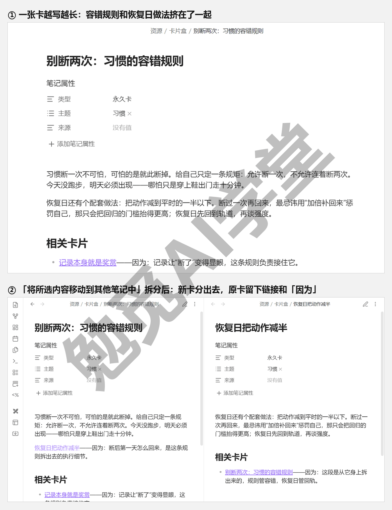

回到这篇文章：开头那条闪念卡用合并并入（用完即清）；文献卡的引文、永久卡的正文用复制粘贴并入，卡片盒原封不动。并完之后，把第 2 步的嵌入行逐段删掉换成实文，草稿从“一串引用”变成“一摞可改的原文”。

**第 4 步：改写与打磨**。并进来的是卡片的话，还不是文章的话。改写抓四件事：补过渡（卡与卡之间的逻辑桥，原来在你脑子里，现在要写出来）；统一人称与详略（卡片写给自己，文章写给读者，该解释的术语要解释）；删重复（几张卡常引用同一个例子，留一处最有力的）；每段收拢到一个重心。卡片一张一个想法、写得密，文章要让读者顺着读下来，这一步做的就是这个转换。改写时放开手改：卡片盒的原件都还在盒里，草稿里怎么改，原卡都不受影响，前提正是第 3 步没把永久卡合并掉。

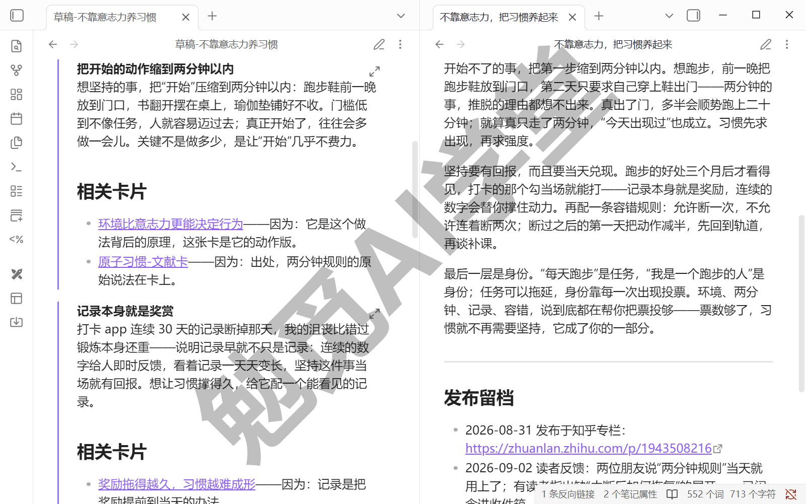

### 18.7 翻车实录：卡片盒的三种失败现场救

卡片盒方法名气大，中途放弃的人也多，而且失败的方式高度集中。演示库里各留了一个“现场”，逐个看、逐个救。三个现场都是真实记录，救的每一步都对应前面几节讲过的规则。

**失败一：闪念堆成山，没人加工**。现场：收件箱里 60 多条闪念，最早的停了三个星期，点开一条写着“周三之前一定要看那个！”，今天已经不知道“那个”是什么了。归因：收集有快感、加工没排期，而且入口开得太多，剪藏一堆、语音一堆、截图一堆，哪个都没人管。处置分三步：第一，砍渠道，闪念只认收件箱一个入口，其余来源的东西定期倒进收件箱再说；第二，把“加工闪念”明确挂进每周回顾的“收件箱清空”一段（回顾模板里本来就有这一步，等于给加工上了日程保险）；第三，真堆到看不动了，就宣布一次“闪念破产”：超过两周没被加工的一律删除，从今天重新起步。删的时候会舍不得，但两周没人碰的闪念，大概率永远不会有人碰了，留着只会让收件箱越来越不敢打开。

**失败二：永久卡写成摘抄**。现场：一张标着永久卡的《刻意练习的要点》，点开是五条原文摘录，一个自己的字都没有。三个月后回看，这张卡对你已经没有用处：当时为什么摘？想用它反驳谁、支撑什么？全丢了。摘抄只能说明你见过这段话，永久卡要记下的是你自己想过什么。处置：现场重写一张，前后对比如下：

重写前（摘抄）：“刻意练习需要明确的目标、即时的反馈和走出舒适区。”

重写后（自己的话，标题即想法）：《练习没长进，多半缺的是反馈不是时间》——“我练了三年吉他没什么进步。对照刻意练习的框架查，缺的不是时长是反馈：从没有人指出我哪里错。给练习装一面镜子（比如录音回听），比每天再加一小时管用。相关卡片：[[刻意练习-文献卡]]——因为：出处；[[环境比意志力更能决定行为]]——因为：都是把改变外包给机制而不是决心。”

判断标准只有一条：看卡里有没有“我”，也就是我的例子、我的反对、我的适用条件。没有，就还是摘抄。摘抄也有用处：它属于文献卡，放在“来源”的位置正合适，只是别把它当成想法用。

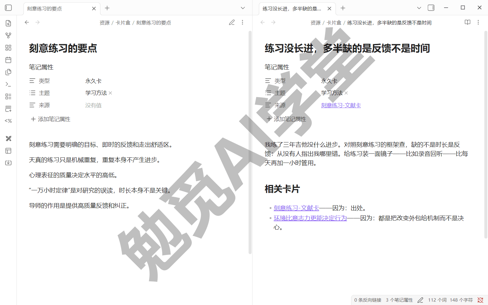

**失败三：为连而连的假链接**。现场：一张卡的“相关卡片”下挂着九条链接，没有一条写得出为什么；图谱上这一片连线很多，顺着链接走过去却全是无关内容。归因：把连接数当成了成就，图好看不等于想法之间真有关系。假链接比没链接更糟，它会污染局部关系图和聚团判断，18.5 那套靠图谱找选题的办法就会指错方向。处置：拿 18.4 的纪律回收：逐条补“因为”，补得出的留，补不出的删。这张卡从九条删剩三条，但三条都说得出所以然，图谱上这一片终于名实相符。补一句：这张卡是课程自己攒卡第二周的真实产物，新手期很常见，发现了改掉就行，不必推倒重来。

### 18.8 导出发表

**交付标准就是“真的发出去”**。文章在库里改十遍也不算数；发出去，有真读者、有真反馈，这条写作流水线才算转起来。发布的压力还会让卡片质量变好：知道卡片终将见人，写卡时自然更舍得加工。

**发之前先做一遍格式体检**。成文是在库里写成的，难免带着 Obsidian 特有的写法，发出去之前逐项检查一遍：

- **`[[ ]]` 链接**——《库、文件与搜索》讲过 Wikilink 不属于通用 Markdown，贴到外面就是一串带方括号的普通文字。成文里指向库内卡片的链接，发布版要么改写成正常行文（多数情况），要么删掉方括号只留文字；
- **`![[ ]]` 嵌入**——《双链与图谱》讲过嵌入是 Obsidian 特有的渲染，别的平台不会展开它。18.6 的改写步骤做彻底了就不会残留，发前再全文搜索一遍 `![[` 确认清零；
- **属性区**——笔记开头的属性块是给库看的元数据，不是给读者看的正文，粘贴时从正文第一段开始选；
- **块标识符与标签**——《双链与图谱》讲过块引用会在段末留下 `^` 开头的块标识，它和正文里的 `#标签` 字样对读者都是无意义的乱码，发布版里顺手清掉；注意只清发布副本，库里的原文别动，那些锚点还有链接依赖着。

体检完再走发布，两条轻量的路任选。《导入、导出与发布》定过发布的三条路（官方 Publish 托管、Quartz 免费建站、直接分享文件），建站实操留给毕业篇，这里用最轻的两条：

- **贴到你常用的平台**：公众号、知乎、博客都行。成文是纯文本 md，正文直接复制粘贴即可；标题、加粗这些通用格式多数平台编辑器认得，个别平台的兼容细节按《导入、导出与发布》讲过的做法处理，此处不重复。另外记得图片不会跟着剪贴板走：成文里若引用了库内图片，发布时在平台编辑器里重新上传一遍。
- **导出 PDF 发给具体的人**：用《导入、导出与发布》讲过的导出 PDF 能力（入口与选项按那一篇的讲法操作），把成文发给两三位你信得过的读者，当面要反馈。适合还不想公开、但想先收真实意见的第一篇。

**发完留档，反馈回流**。把发布链接（或成品截图）存回库里，贴在成文笔记和主题 MOC 上。这不只是纪念：这批成文就是《毕业：数字花园上线》要发布的第一批内容，毕业篇建站时直接取用，现在留档，到时省事。读者的反馈也别浪费：有价值的评论、被指出的漏洞，按老规矩一键闪念进收件箱，下一轮十分钟加工时升成卡。到这里流水线就闭合了：卡片攒成文章，文章收到的反馈又变成新的卡片。

这篇文章的实操内容不需要花钱：三类卡、图谱、画布、笔记合成器全部是核心能力，方法本身也不要钱。

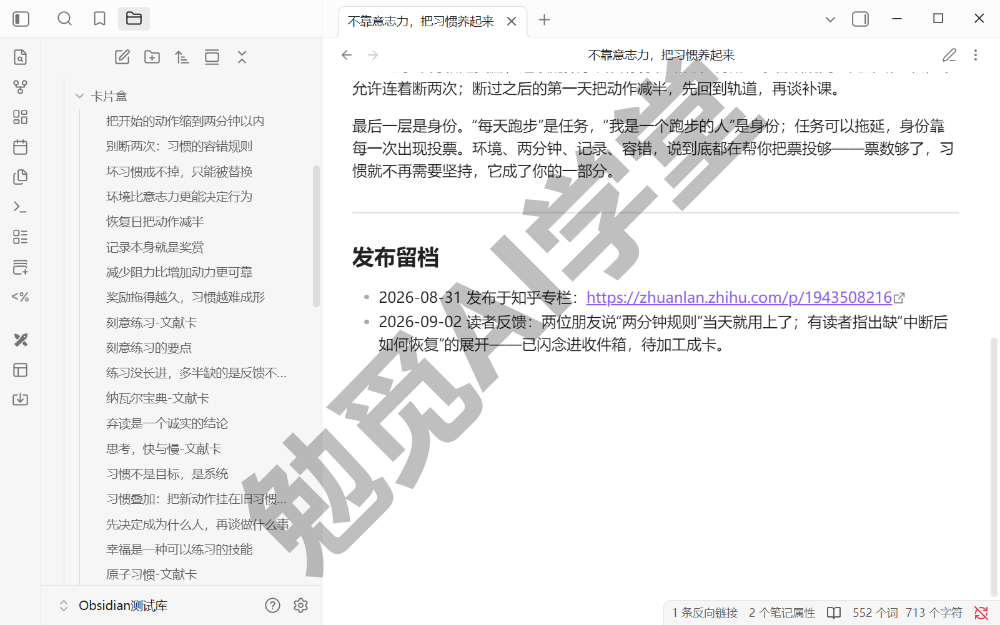

### 18.9 验收清单

拿你自己的库逐项对照，判定标准都给出，能过就打勾：

- **三类卡分工说得清，模板齐且各有实卡**——判定：不看笔记，能各用一句话说清闪念卡、文献卡、永久卡分别装什么；三张模板在模板文件夹就位；卡片盒里每类至少有一张你自己的真卡，不是照抄的示例。
- **每天十分钟的攒卡流程坚持至少一周**——判定：连续七天，收件箱每天被处理过（升级或清理），一周后卡片盒的永久卡比开始时多；某天漏了次日补上算数，连断两天以上不算。
- **每张新永久卡都连着旧卡并写了为什么**——判定：随机抽三张本周新卡，每张的“相关卡片”下至少一条链接，且每条链接后面跟着一句能读通的“因为”；写不出“因为”的连接不计数。
- **用 Canvas 从卡片排出过一篇文章的结构**——判定：库里存在一块画布，至少八张卡、有带字的连线、有分组，且分组顺序能对应到成文的段落顺序。
- **一篇由至少八张卡攒成的文章已导出并发表**——判定：你能指着成文说出它用到的至少八张卡；发布链接或成品文件真实存在，留档已经贴回库里。

### 18.10 本篇小结与自检

这一篇落地了卡片盒写作系统，并用它真正写出了一篇文章。最需要记住的是：**卡片盒的价值不在收藏而在连接——永久卡必须用自己的话、必须连上旧卡，写作只是把连好的想法串出来。**

可以对照下面的清单检查学习结果：

- [ ] 能各用一句话说清闪念卡、文献卡、永久卡的分工
- [ ] 每天十分钟的攒卡流程坚持了至少一周
- [ ] 每张新永久卡都连着至少一张旧卡，并写了为什么连
- [ ] 用 Canvas 从卡片排出过一篇文章的结构
- [ ] 一篇由卡片攒成的文章已经导出并发表

完成这些内容后，你的库开始产出内容，而不只是存放内容。下一篇《工作项目管理库》把系统能力搬进工作现场：会议、任务、周报一库管齐。

### 18.11 新手常见问题

**Q1：永久卡和摘抄到底差在哪？**

差在卡里有没有“我”。摘抄是别人的话，证明你见过；永久卡是你自己的话，装着你的判断，也就是你的例子、你的反对、你的适用条件，而且写到十年后没有上下文也能读懂。一个简单的检验法：把卡念给朋友听，能不看原书把意思讲明白、还答得上“所以呢”，就是永久卡。另外摘抄并不是没用：把它放进文献卡的“来源”位置正合适，只要不把它当成你自己的想法就行。

**Q2：每天要写多少张卡才算够？**

没有指标；宁可少写，但每张都得是自己想过的。十分钟里升一两张永久卡是常态，一张不升也正常；卢曼式的高产靠的是几十年日拱一卒，不是每天追求数量。要盯的是两个“别断”：闪念别断，想法都进收件箱；加工别断，每天十分钟别连着两天不做。开始纠结数量时警惕一下：数量焦虑正是失败一的前兆，说明收集的快感又开始替代加工了。

**Q3：卡片盒和 PARA 目录冲突吗？**

不冲突，各管各的。简化 PARA 管的是文件的家，也就是《个人知识库从零搭建》定的四大类骨架；卡片盒整个是这个家里的一间屋，屋里不再隔断，靠链接组织。这正是《库、文件与搜索》三种组织方式分工的组合应用：文件夹管到“卡片盒”这一层为止，盒内交给双链。项目文档、会议纪要这类工作文件照旧走 PARA，别搬进卡片盒；卡片盒只收想法。

**Q4：写不出永久卡，是不是我不适合这套方法？**

大概率只是起点定得太高，先试三个降门槛的办法：

- **头两周允许“半成品永久卡”**——一句自己的话加一条链接就能入盒，好卡是后来改出来的，永久卡本来就允许修订。
- **先靠文献卡练手**——读到有共鸣的地方，用自己的话转述一段，这就是最容易的永久卡素材。
- **盒子太空连不上卡属于正常**——先连到主题 MOC 上也算连接，等卡多了再回头补。

多数人卡住的是“写给十年后的自己”带来的完美主义，不是能力。真试满一个月还是不出卡，放下它也没关系：前两个项目的库照常运转，卡片盒是可选的进阶内容，不做也不影响前面两个项目。
