## 工作项目管理库

第四个实战项目把库搬进工作现场。这一篇交付一套可复用的项目管理库：会议纪要记完自动产生任务，任务在看板上流转，周报由查询自动汇总，项目全局一张作战图。四件套连成一套，最后打包成模板，验收标准是拿一个新项目套上就能跑。

这篇文章的实操内容不需要花钱：用到的能力全部来自官方内置功能与前面已装的免费插件。

### 19.1 项目定位：工作流水有账可查

先看工作里三种常见的情况，看你遇到过几种。

会议开完，纪要认真记了，然后再也没人打开过，它就一直留在某个文档角落，下次开会才发现上次定的事没人跟进。任务散在各处：有的在聊天工具里、有的在便签上、有的只在脑子里，谁手里压着几件事，问一圈才知道。最狼狈的是周五下午写周报：翻聊天记录、翻邮件、翻记忆，把一周的事现凑出来，凑完自己都不确定漏没漏。

这三件事的原因是同一个：工作流水没有账本。纪要、任务、进展各记各的，互相不通，到了要盘点的时刻只能靠人工汇总。而你手里这座库，恰好已经具备了记账需要的全部能力：《标签与属性》给了字段，《Bases 数据库》给了可视化的表，《Dataview 专讲》给了自动汇总，《Canvas 画布》给了全局视图，《社区插件系统》给了扩展能力。这一篇把它们组合成一套系统。

组合出来的成品是下面四件，先看全貌再动手：

- **会议纪要模板**——纪要按固定的三块结构记，里面的待办天生带字段，记完即入账，不需要任何“会后整理”动作；
- **任务看板**——从流水里挑出的重点任务一卡一事，在待办、进行、完成三列间流转，每张卡都能跳回产生它的那场会议；
- **自动周报**——周五打开周报页，本周开过的会、完成与未完成的任务已经由查询汇总好，你只负责补两行判断性的总结；
- **项目作战图**——项目全局一张画布，里程碑、责任块、风险区一眼扫完，开周会投屏它讲进度，不用翻着纪要念。

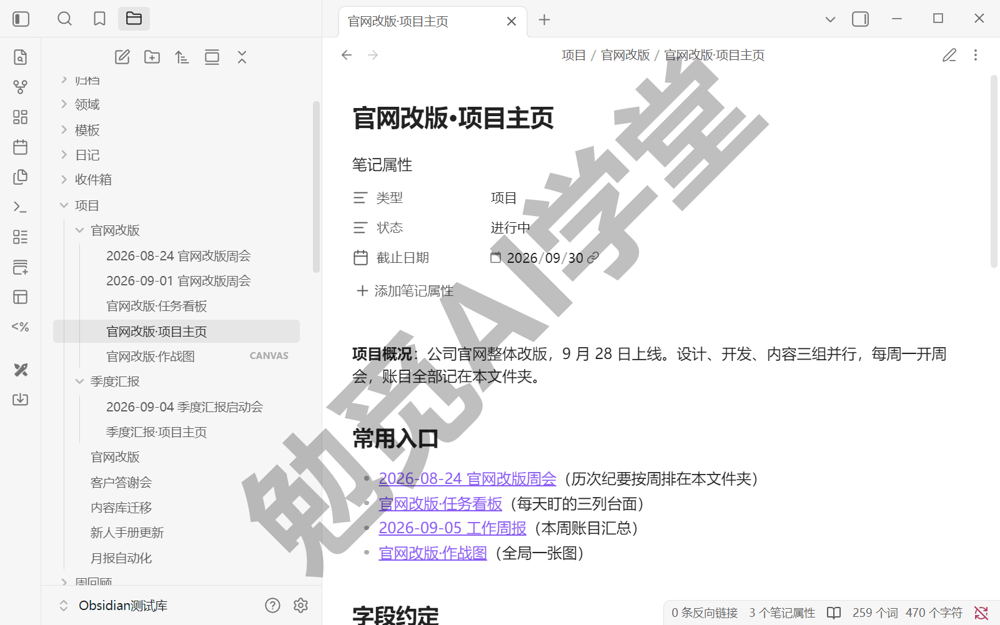

先划清一个边界：这套库不是团队协作平台的替代品。专门的项目管理软件强在多人协作，派单、审批、甲方乙方共看一块板，那是它们的主场；这套库管的是**你自己手里的账**：你开过的会、你名下的任务、你要汇报的进展，和你的笔记、日记同在一座库里，互相能链能搜。团队用什么平台照用不误，这套库是你自己的工具，两边不冲突，19.11 的第一问还会展开这一点。

素材交代：全篇拿“官网改版”当演示项目，再配一个“季度汇报”演示多项目并行。你跟着做时，换成手头任何真实项目即可，有会要开、有任务要跟进、有周报要交的事，都套得上。项目大小不限，三五个人协作的小项目最出效果；大到有专职项目经理的场合，这套库就退回“个人账本”的角色，照样值得记。

这一篇的学法沿用实战篇的惯例：功能都在基础篇讲过，这里只在用到的地方标明出处，不再重复展开。你会看到的新内容不是新功能，而是让这些功能衔接起来的三样东西：字段约定、模板纪律和一套翻车后能救回来的排查法。

### 19.2 项目库结构与字段约定

系统能不能自动汇总，取决于材料的格式统一不统一。这一节做两件事：把目录搭起来，把字段约定定下来。

**一项目一文件夹。**《个人知识库从零搭建》搭的简化 PARA 骨架里，四大类的第一类就是“项目”，专门放有明确起止的事。工作项目全部归在这个大类下，每个项目独占一个文件夹：

```
项目/
  官网改版/
    官网改版·项目主页.md
    2026-08-24 官网改版周会.md
    官网改版·作战图.canvas
  季度汇报/
    季度汇报·项目主页.md
    ...
```

这个结构解决多项目并行的防串问题：纪要、任务卡、作战图全部放在自己项目的文件夹里，两个项目的材料物理隔开，搜索时用 path: 圈范围（《库、文件与搜索》讲过的操作符），互不打扰。防串还有一条规矩：任何一条待办都要能查出“属于哪个项目”，这靠下面的字段约定来保证。

**项目主页：项目的小 MOC。** 每个项目文件夹里第一篇笔记是项目主页，结构照《双链与图谱》的 MOC 导航法来：一段项目概况、一组常用链接（历次纪要、作战图）、外加本节马上要写的字段约定块。《Canvas 画布》讲作战图时预告过“把作战图嵌进项目主页”，19.6 会做到这一点。项目主页就是这个项目的入口，打开它，项目的资料都在这里。

**字段约定，白纸黑字。** 这套库能自动记账，全靠所有材料用同一套写法。四个字段、各自的类型和写的位置，一次定好：

| 字段 | 类型与取值 | 写在哪 |
| --- | --- | --- |
| 项目 | 文本，与项目文件夹同名 | 纪要与任务卡的属性区 |
| 状态 | 文本，只允许待办、进行、完成 | 任务卡属性区（项目主页可另用进行中、已完成） |
| 负责人 | 文本，写人名 | 任务行内字段与任务卡属性区 |
| 截止 | 日期，必须写成 2026-09-01 这种格式 | 任务行内字段；项目主页用“截止日期”属性 |

三条补充说明：

- 属性类型选对是硬前提：“截止”必须是日期型才能参与比较，“状态”的取值只许三选一，多一种写法后面就多一个坑（《标签与属性》讲过类型怎么定，这里直接执行）；
- 任务行内字段用双冒号写法（《Dataview 专讲》教过：`[负责人:: 张三]`），因为它能精确到任务那一行；
- 这张约定表原样写进项目主页，白纸黑字写下来，谁忘了回主页看一眼；19.7 的翻车实录会让你看到不写下来的后果。

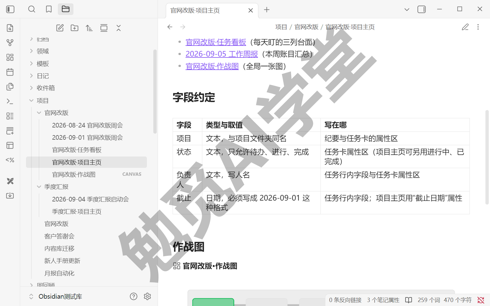

字段名与《Bases 数据库》《Dataview 专讲》两篇用过的保持一致：状态、截止（日期）沿用原名，读者前面练习攒下的素材在这里继续有效。

### 19.3 会议纪要模板：记完即产生任务

纪要是这套系统的入口：所有任务都从会议里产生，所以纪要的格式决定了后面的自动化能做到什么程度。

**模板三块。** 纪要只需要三块：议题、结论、待办，每块各有存在的理由。议题记这场会讨论什么，让没到场的人五分钟能补上上下文；结论记议定了什么，这是拍板的凭据，日后“上次不是说好了吗”的争议就靠它平息；待办记谁在什么时间前干什么，是整套系统唯一的任务入账口。多数纪要的毛病不是记少了而是记乱了：发言实录一大篇，结论和待办埋在里面捞不出来。三块结构让你当场就把内容分拣清楚。模板全文如下，可照抄（模板正文用到的任务清单写法，姊妹篇《Markdown 通用语法手册》的《扩展语法》篇讲过，这里不再展开）：

```
---
项目: 官网改版
tags:
  - 会议纪要
---

## 议题

-

## 结论

-

## 待办

- [ ] 任务写这里 [负责人:: 人名] [截止:: 2026-01-15]
```

三处设计意图要交代。属性区的“项目”让这篇纪要和它的每一条待办都归到了这个项目下。《Dataview 专讲》讲过官方的说明：页面属性在任务层面同样可用，所以待办不用逐条写项目，继承页面的就行。标签“会议纪要”是后面周报查询圈范围用的标识。待办一行的两个行内字段，负责人与截止，让每条任务都有人负责、有期限。

**文件名带日期。** 纪要文件名统一为“日期 + 项目 + 会议名”，比如“2026-08-24 官网改版周会”。这不只是整洁：文件名含这种格式的日期时，查询里可以直接拿它当日期字段用，19.5 的“本周会议”一览就靠它。

**开一场演示会议。** 拿官网改版项目真的记一篇：议题“首页改版方案评审”，结论两条，待办三条，比如“- [ ] 首页新方案出第二稿 [负责人:: 张三] [截止:: 2026-08-28]”这样的写法，每条都带上两个字段。存好之后什么都不用做：这三条任务已经入账，19.4 的看板、19.5 的周报里都会出现它们。用模板建纪要的入口沿用《日记、模板与每日工作流》配好的模板插件，命令面板执行“模板：插入模板”一条命令套版。

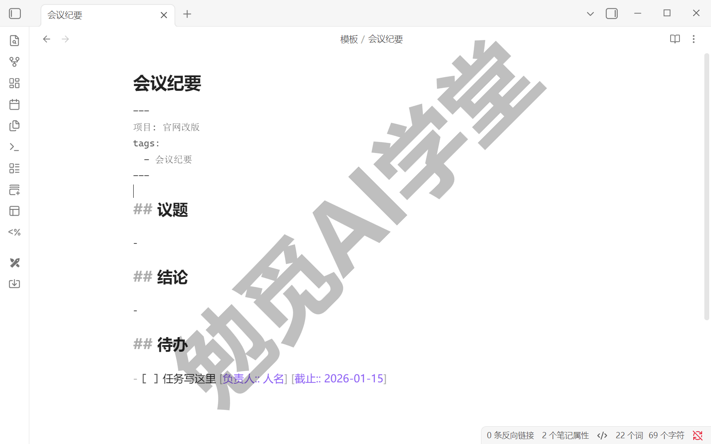

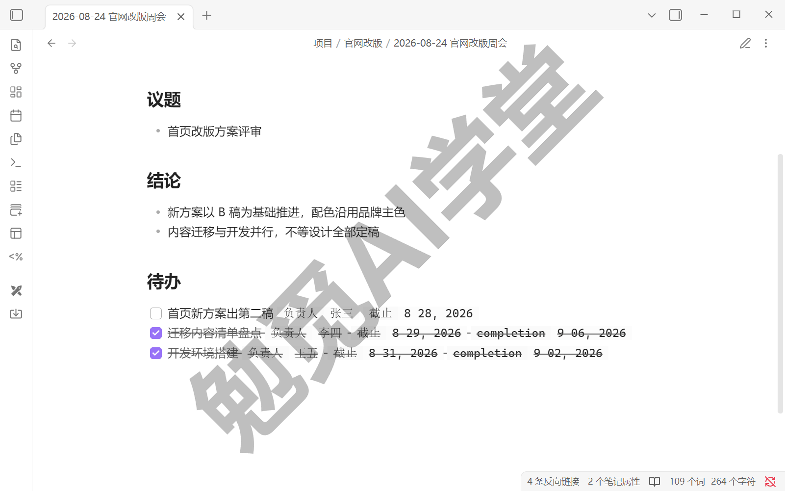

一条纪律随模板一起定下：**待办只记在纪要里，不散记。** 灵感闪念仍走《日记、模板与每日工作流》的收件箱，但凡是工作任务，一律进纪要的待办区（临时冒出的任务，就近记进最近一场会的纪要，或开一篇“碎项待办”的例会纪要收纳）。账本只有一处，查出来的账才可信、不重不漏。这条纪律还有个副产品：每条任务一直带着它的会议上下文，三个月后想不起“当时为什么定这件事”，顺着任务跳回纪要，议题和结论就在那里。

### 19.4 任务看板：双路预案

任务入了账，还需要一个每天盯的地方。周报查询管的是全部流水，看板管的是当下推进：把值得每天过问的重点任务放上去，一卡一事，在“待办、进行、完成”三列之间流转。先记住这个分层：看板不是流水账的镜像，只放从流水里挑出来的重点任务，数量以一屏看完为度。

看板的实现走双路预案，这是按官方现状定下的方案，两条路都会讲清，你按手里版本的实际情况选一条用。

**首选路：Bases 看板视图。**《Bases 数据库》讲过一个 Base 可以装多个视图，官方正在为它开发看板类型的视图，把一批笔记按某个属性分成并排的多列展示。用法按最可能形态描述：给每条重点任务建一张“任务卡”笔记（模板见下），Base 圈定项目文件夹里的任务卡，看板视图按“状态”属性分列，待办、进行、完成三列并排；卡片挪列，等于改了那篇笔记的状态属性（截至本课演示所用的 1.13.7，公开版 Bases 的布局只有表格、卡片、列表三种，看板视图尚未上线，点“添加视图”看一眼布局清单就知道，见下图；它上线后的建列与拖动交互，需实机验证）。任务卡模板一并给出，可照抄：

```
---
项目: 官网改版
状态: 待办
负责人: 张三
截止: 2026-08-28
---
来源:: [[2026-08-24 官网改版周会]]

任务要点随手记。
```

“来源”一行是行内字段写法，值是指回来源纪要的双链，这就是看板项跳回来源纪要的通道。

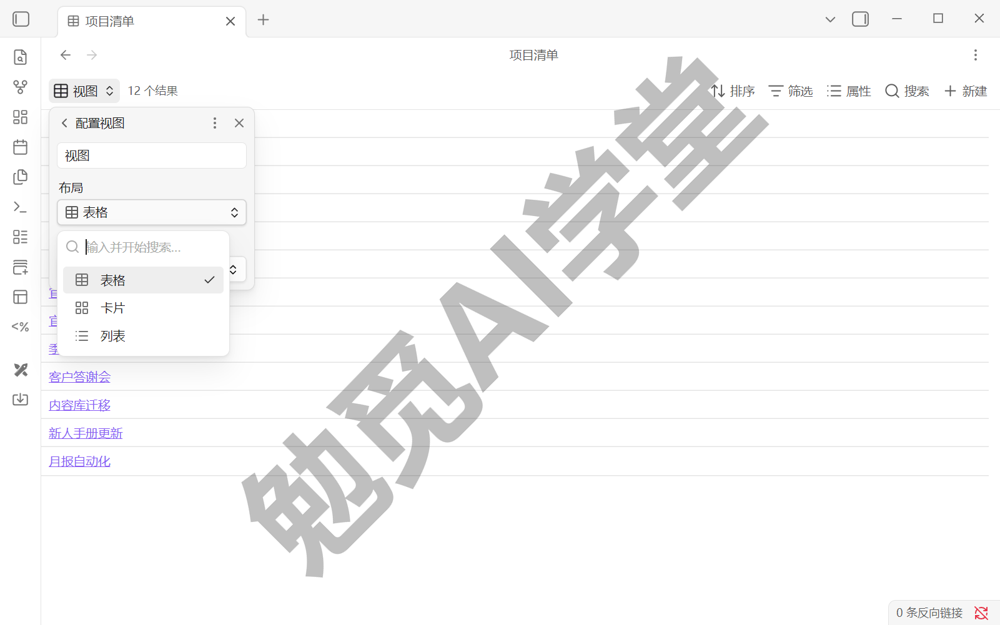

**备用路：Kanban 插件。** 社区的 Kanban 插件是老牌看板方案（《社区插件系统》必装候选之一，是否入选以那一篇实测结论为准），官方说明它生成的看板本身也是一份 Markdown 文件。用法：新建一块看板，建待办、进行、完成三列，把重点任务各建一张卡，卡文字里写上任务名并链回来源纪要（如“首页新方案出第二稿 [[2026-08-24 官网改版周会]]”），推进时拖卡换列（命令面板里对应命令是“Kanban：创建新看板”与“Kanban：添加列”；拖卡交互以实机为准）。

用这条路之前，有一层情况必须向你说清楚：这个插件目前已移交社区归档组织维护，官方目录页挂着征集新维护者的告示，当前版本约两年未更新，官方插件评分卡的评审一栏标注为存在风险。插件仍在官方目录里、仍可安装使用，但它处于“无人积极维护”的状态（以上为撰写本篇时官方目录页的情况，以你安装当日的目录页为准）。本课讲“十年后还打得开”，对工具的长期风险就得按同样的标准交底：数据层面不用怕，看板文件是 Markdown，插件哪天真失效了，你的任务卡还是可读的文本；但依赖层面要有数，把它当“随时可换”的工具用，别把重要流程焊死在它身上。

**取舍规则。** 官方看板视图一旦进入公开版本，就主走 Bases 路，Kanban 只作备选；在那之前，按 Kanban 备用路搭，并记住上面交代的维护状态。无论走哪条路，验收标准相同：**三列流转跑通，看板项能跳回来源纪要。** 你自己搭的时候同理：先看手里版本有没有官方看板视图，有就用官方的，没有再考虑插件。

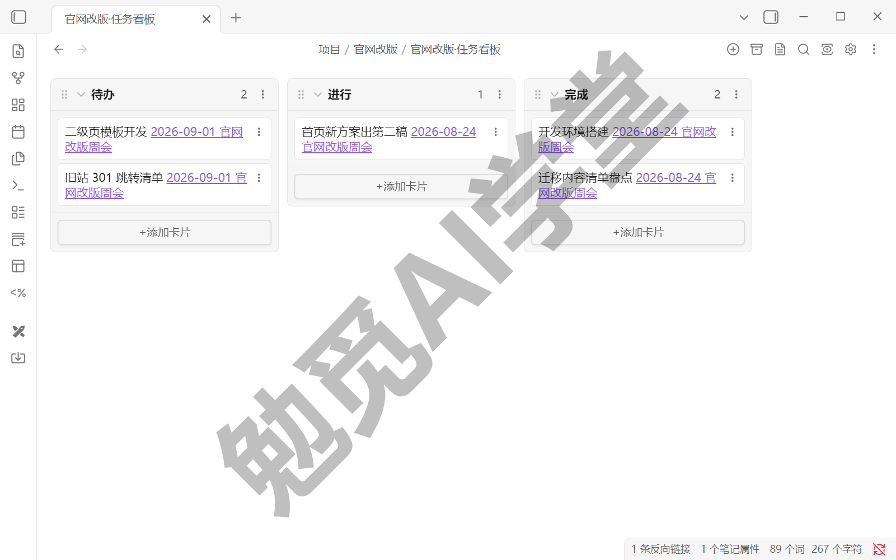

### 19.5 周报自动化：Dataview 汇总本周

回到周五下午写周报这件事。目标：打开一页周报，本周开过的会、完成与未完成的任务已经列在页面上，你只负责补两行总结。

先给周报页做成模板，核心是三段查询。第一段，手头全部未完成的任务，按项目分组：

```
TASK
FROM #会议纪要 AND -"模板"
WHERE !completed
GROUP BY 项目
```

这就是《Dataview 专讲》学过的 TASK 查询在工作场景里的用法：所有纪要里没勾掉的待办一网收齐，按项目归组，每组标题可点回纪要。多出的 `-"模板"` 把模板文件夹排除在外，因为会议纪要模板自己也带着“会议纪要”标签，不排掉它，每张周报都会混进模板里的占位任务。第二段，只看本周新增的待办，给上面的查询加一个日期条件：

```
TASK
FROM #会议纪要 AND -"模板"
WHERE !completed AND file.day >= date(sow)
GROUP BY 项目
```

`date(sow)` 是官方的日期字面量（《Dataview 专讲》用过的 `date(today)` 是同一类写法），表示本周的开始；`file.day` 来自 19.3 定下的文件名纪律：纪要名带日期，这里就能按日期筛。第三段，本周开过的会一览：

```
TABLE 项目
FROM #会议纪要 AND -"模板"
WHERE file.day >= date(sow)
SORT file.day DESC
```

三段查询写进一篇“周报模板”，周五用模板新建本周周报，打开即得。查询下方留两块手写区：本周一句话小结、下周三件事。账由查询自动算，判断由你来写。想要单项目版本也容易：把查询里的 `FROM #会议纪要 AND -"模板"` 换成 `FROM #会议纪要 AND "项目/官网改版"`，就是只算这一个项目的账；圈进项目路径后，模板文件夹自然不在范围里（组合来源的写法《Dataview 专讲》讲过）。

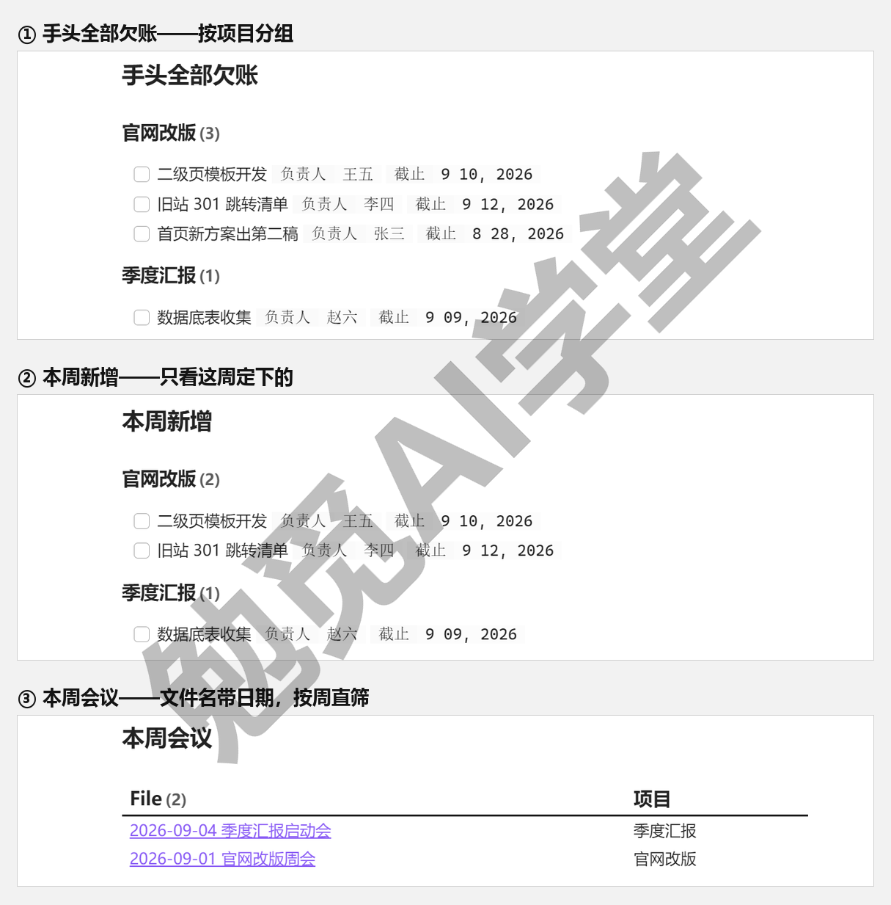

**“本周完成”怎么统计。** 任务勾掉就从上面的查询里消失了，那“本周干完了什么”从哪来？Dataview 的设置页（目前是英文界面）里有一项“Automatic task completion tracking”：开启后，凡是在查询结果里勾掉的任务，会自动在任务行尾写一个 completion 完成日期字段。开启它，再加第四段查询：

```
TASK
FROM #会议纪要 AND -"模板"
WHERE completed AND completion >= date(sow)
GROUP BY 项目
```

边界要交代清楚：这个完成日期只在“从查询里勾掉”时写入，直接在纪要原文里勾掉的任务没有这个字段、不会进这份完成单。所以配套习惯是：勾任务尽量在周报页或看板上勾，你每天看的本来就是它们。做不到也不要紧，周报的核心是把没做完的任务列清楚，完成单只是锦上添花。

最后补充一个可选项：想让周报到点自动生成、甚至自动写进日记，后面《Obsidian×Codex：让 AI 管理你的笔记库》有现成做法（可选，需订阅）；本节的查询周报零成本，周五用模板新建一页即得，已经完整可用。

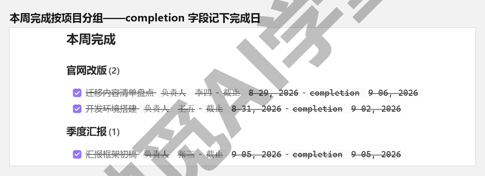

### 19.6 Canvas 项目作战图

看板回答的是“今天推进什么”，还缺一张回答“全局走到哪”的图。《Canvas 画布》画过一张分享会作战图，当时预告它会在这一篇和纪要、任务组合成完整系统，现在就把它做出来。那一篇的三步做法原样搬来：任务建卡、依赖连线写动词、阶段分组加颜色状态。

拿官网改版项目画一张。新建画布“官网改版·作战图”，放进项目文件夹，三层内容：

**里程碑主线。** 把项目的大节点建成卡片连成一条线：需求评审、设计定稿、开发完成、内容迁移、上线验收。连线写动词（“先于”“依赖”），这条链就是《Canvas 画布》讲过的关键路径：一步卡一步，哪一步没完成，后面全堵着。节点数量控制在五到八个：作战图是用来快速看全局的，节点太密，它就变成了另一张任务清单，也就没有意义了。

**责任块。** 按负责人或小组框分组：设计组一块、开发组一块、内容组一块，每块里放该组手头的关键任务卡。谁的块里堆的卡最多，资源紧张一眼可见。

**风险区。** 单独框一个区，专放可能出问题的事：供应商交付延期、老板还没拍板的方案、要等外部门配合的事项。用《Canvas 画布》教过的颜色标注：红色标已经卡住的、黄色标有隐患的，每周扫一眼这个区，比记在脑子里可靠。

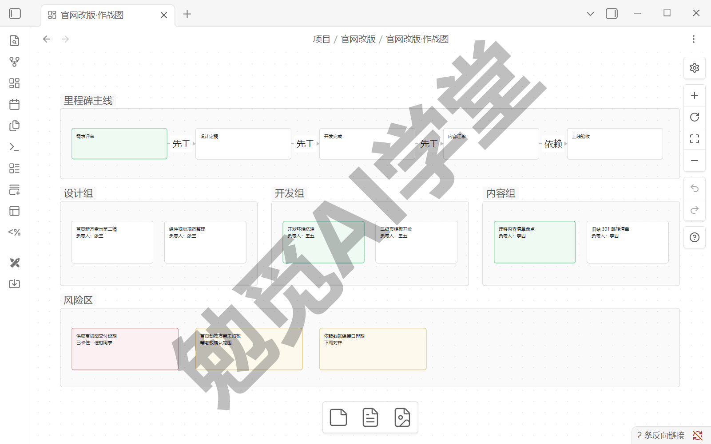

画好之后做一个动作，把它嵌进项目主页（《双链与图谱》的嵌入语法，画布同样适用）：

```
![[官网改版·作战图.canvas]]
```

从此打开项目主页，文字资料和全局图同屏（嵌入后的显示形态以实际界面为准）。

**它和看板的分工要划清，两个都要但各干各的**：看板管日常推进，看的是一条条任务，每天看、天天动；作战图管全局与汇报，看的是阶段和风险，每周更新一次就够。层级不同，也就不用两边重复维护：一条具体任务只上看板，不要在作战图上再建一张卡；作战图上放的是“设计定稿”这种阶段级的节点，它对应的是看板上的一批卡，不是某一张。

作战图还要定一条更新纪律。周报的查询是自动的，数据一变它就变；作战图是手工维护的，没人动它就一直停在旧状态；一张三周没更新的作战图比没有更糟，它会用过期的全局图误导你。解法是给它固定的更新时刻：每周五写周报时顺手更新作战图，三个动作：把走完的里程碑标绿、清点风险区（解除的移走、新冒的补上）、扫一眼哪个责任块堆积。两分钟的事，换来一张一直跟得上进度的全局图。

最实用的用法是开周会时投屏作战图讲进度：里程碑走到哪、哪个责任块吃紧、风险区有没有新增，一张图讲完，比翻着纪要念一遍高效得多。图要发到群里存档，用《Canvas 画布》讲过的导出图片即可。

### 19.7 翻车实录：字段散架的周报

这一节照实记录一次真实的翻车：现象、排查、修复都保留下来，排查的步骤以后你自己也用得上。

**事故现场。** 周五打开周报，三处不对劲：未完成任务的分组里冒出一个没有名字的组，里面孤零零挂着两条任务；“本周新增”少了两条，周三那场会明明定了事；其中一条任务的“截止”显示成一段灰字，不像别的任务那样是规整的日期。第一反应往往是“查询坏了”，但查询一个字没改，坏的是数据。

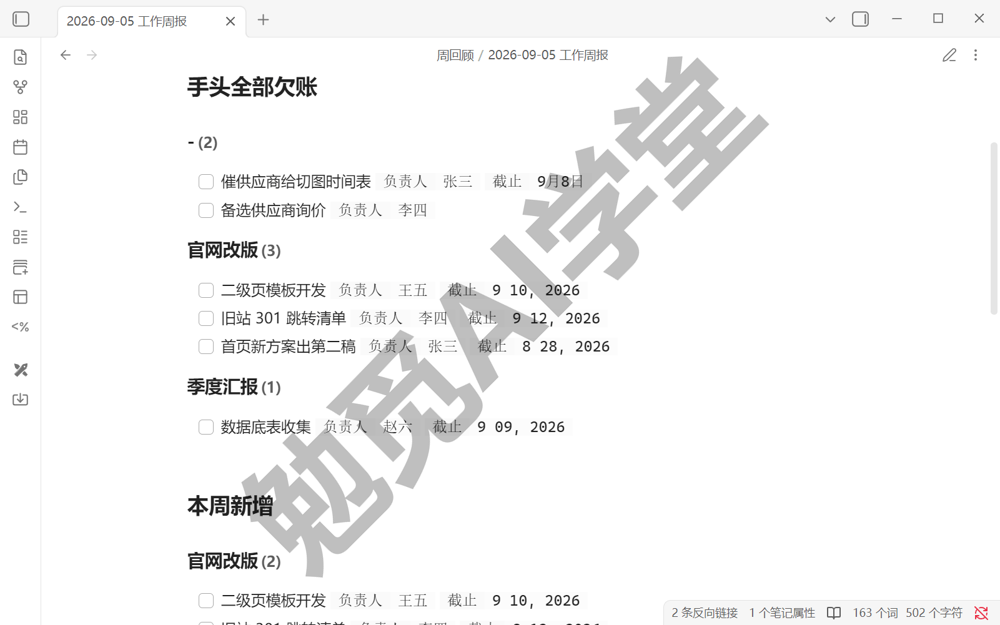

**先宽后窄，定位漏行。** 排查沿用《Dataview 专讲》答疑教过的减法：把查询条件逐段去掉，看结果在哪一步变化。去掉 `GROUP BY 项目`，两条“无名组”任务的来源就看清了：原来是周三临时开会，纪要没用模板、手敲的，属性区漏了“项目”字段：任务还在，只是没了项目归属，分组时被归进了无名组。顺藤摸瓜再看这篇纪要，另外两处也出在这篇纪要上：文件名手敲成了“临时评审会”、没带日期，`file.day` 识别不出日期，“本周新增”“本周会议”两段查询都不会列出它；一条任务的截止写成了“9月8日”，不是日期格式，被当成普通文本，所有按日期筛选和排序的地方都处理不了它。

**逐个修复。** 修复本身不难：打开这篇纪要，属性面板补上“项目：官网改版”；文件名改成“2026-09-03 临时评审会”；把“9月8日”改成 2026-09-08。改完回到周报页，无名组消失、两条任务归队、按周的筛选恢复，前后不过五分钟。要是散架的不止三五处，逐篇手补就太慢了：用全局搜索按旧写法批量定位（《库、文件与搜索》教过的办法，搜“9月”就能把手敲的中文日期一网打尽），一处处过目改正。

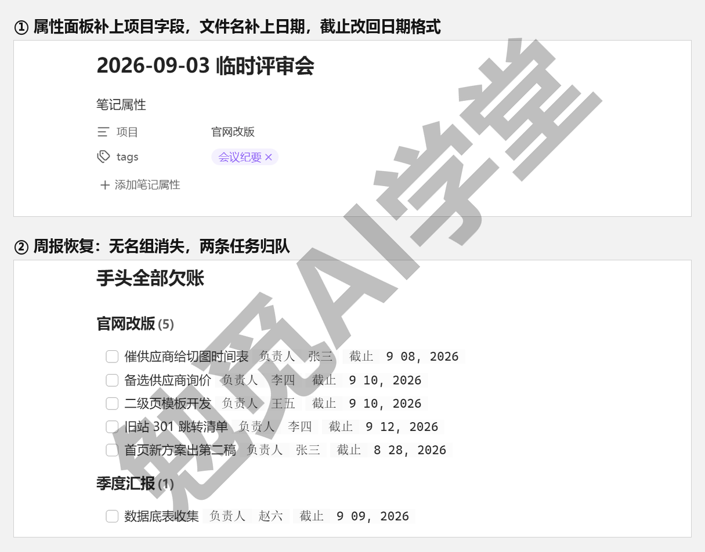

**归因不在手误，在约定没执行。** 三处翻车共同的原因：那场临时会议绕过了模板。19.2 把约定写进项目主页、19.3 定下“待办只记在纪要里、纪要一律用模板建”，防的就是这个：用模板建纪要，字段就不会漏；照取值表填，写法就不会各写各的。所以修复之后要补两个动作：把“字段抽查”挂进每周回顾（《日记、模板与每日工作流》那条流程里加一项：抽查本周纪要的字段齐不齐），以及给自己定一条规矩：再急的会，纪要也从模板建，三十秒都不用。

还有一个常见的疑问：能不能把查询写得宽松点，让它自动兼容漏了字段、手敲了日期的纪要？技术上能兼容一部分（多写几个 OR 条件），但不建议。账本宁可严：写法飘了当场暴露成无名组、漏账，你立刻知道哪里出了问题；查询悄悄替你补上，等于把错账算成对账，字段会越写越随意，直到某天彻底散架才被发现。错账当场暴露出来，你才能及时改，这本账才一直可信。

自动化系统出问题，几乎都是同一种情况：查询没坏，是送进去的数据不合格。查询先宽后窄、属性面板逐个补、纪要一律走模板，这套办法适用于这座库里一切“查询没出我想要的结果”的时刻。

### 19.8 模板化打包复用

系统跑通了，最后一步是让它可复制：下一个项目来了，不该从头再搭一遍。

**打包清单。** 新项目模板包一共五件，全部是这一篇已经做好的东西，收拢起来就行：

- **目录骨架**——一个空的项目文件夹样板，里面放好项目主页模板，主页上的字段约定块与作战图嵌入位都预留好，新项目来了改个名字就能直接用；
- **会议纪要模板**——19.3 那份三块结构原样收入，属性区的项目名改成方括号占位，套用时全文替换成新项目名即可，其余一字不用动；
- **任务卡模板**——19.4 那份四个属性加来源行，状态默认值预填“待办”，建卡后只需要改任务名、负责人和截止三处；
- **周报模板**——19.5 那份三到四段查询加两块手写区，查询范围保持全项目通用的写法，要单项目版本时再按需收窄即可；
- **作战图底版**——一块预先画好“里程碑、责任块、风险区”三个空分组的画布，新项目的卡片进来直接对号归位，省去每次重画框架。

具体做法很简单：在模板文件夹里建一个“项目模板包”子文件夹收齐五件（模板插件的模板文件夹在《日记、模板与每日工作流》配过），项目主页模板里写清各件的用法一句话。查询模板里的项目名、文件夹路径用方括号占位（如“[项目名]”），套用时全文替换。再交代它和《个人知识库从零搭建》那套模板的关系：同放在一个模板文件夹里，那套管个人知识库的日常运转，这套管工作项目的起步，两套同源不冲突。

**十分钟起步验收。** 模板包好不好，用一个新项目现场验一次：假设新接手“季度汇报”项目：建项目文件夹、从模板生成项目主页和首篇纪要、纪要里记两条带字段的待办、任务卡上看板、周报页跑出这两条任务、作战图底版摆上第一批卡。全程掐表，十分钟内跑通，模板包合格；哪一步卡住了，回去修模板，让下一个项目起步更顺。十分钟这个数不是随口定的：五件全是“从模板生成”，需要打字的只有项目名和两条演示待办；超时就说明模板里还藏着要手改的地方，那正是要修的点。

模板包也不是做一次就完。头两三个项目起步时，你多半会发现某个字段其实用不上、某段查询的范围要再调。这很正常，是打磨的一部分：每次卡住的地方就是下一版要修的地方，用一次修一次，两三个项目之后它就稳定成一套用起来顺手的工具。到那时接新项目的开场动作只剩一个：套上模板包，直接开工。

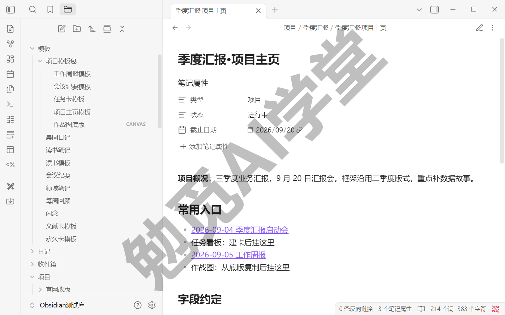

到这里四件套配齐：纪要是入口，看板管每天的推进，周报是账本，作战图是全局图。把它们衔接起来的是 19.2 那张字段约定表，这也是整篇最重要的一条：**这套系统能自动到什么程度，取决于每条待办录入时守不守这张约定表。**

### 19.9 验收清单

拿你自己的真实项目逐项判定，五项全过，这个项目才算交付。

**验收一：结构与约定白纸黑字。** 判定标准：项目文件夹与项目主页已建立，字段约定表原样写在主页上，随手能指给别人看。

**验收二：纪要模板用熟。** 判定标准：用模板记过至少三场会议，每条待办都带负责人与截止字段，且靠页面属性就能确定每条待办属于哪个项目。

**验收三：看板三列流转跑通。** 判定标准：按你手里版本选定的路线（官方看板视图或 Kanban 插件）搭起三列看板，至少一张卡完整走过“待办 → 进行 → 完成”，且任意一张卡能跳回来源纪要。

**验收四：周报一键汇总。** 判定标准：周报模板新建后不改一个字，未完成任务、本周新增、本周会议三段查询自动出结果，与实际情况核对无漏项。

**验收五：模板包开箱即用。** 判定标准：拿一个全新项目套模板包，十分钟内完成“建文件夹 → 首篇纪要 → 任务上看板 → 周报可见”全流程。

### 19.10 本篇小结与自检

这一篇把库搬进了工作现场：会议纪要、任务看板、自动周报和项目作战图连成一套，并打包成可复用的模板。最需要记住的是：**自动汇总的周报是“记录纪律”换来的回报——纪要里每条待办都按约定打好字段，查询才有账可算。**

可以对照下面的清单检查学习结果：

- [ ] 项目库结构与字段约定已写进项目主页
- [ ] 会议纪要模板用熟，待办自动带上项目与状态字段
- [ ] 任务看板三列流转跑通，看板项能跳回来源纪要
- [ ] 周报查询一键汇总出本周完成与未完成
- [ ] 用一个新项目验证过模板包“开箱即用”

完成这些内容后，可复用的项目管理库已经在手。下一篇《毕业：数字花园上线》把精选笔记发布成个人知识站，也是整套课程的最后一篇。

### 19.11 新手常见问题

**Q1：团队其他人不用 Obsidian，这套系统还有意义吗？**

有，而且这正是它的常见形态：这是你的个人工作账本，不要求任何人配合。纪要照样记、任务照样理、周报照样出，产出物随时能变成别人可用的形式：周报复制成纯文本发群里，作战图导出图片投屏（《Canvas 画布》讲过导出）。团队协作平台该用照用，这套库只负责把你自己手里的账记清楚，两者不冲突。

**Q2：任务多了看板会不会卡？怎么办？**

先说数量：看板按 19.4 的定位只放重点任务，一屏看完为度，正常用法不会卡（以实际表现为准）。真觉得卡，先查用法：是不是把全部流水都堆上了看板？流水账交给周报查询，看板只留每天要盯的十来张卡；完成列定期清空归档，看板自然清爽。

**Q3：Kanban 插件两年没更新，还能放心用吗？**

按 19.4 交代的办法分两层看。数据层面放心：看板文件是 Markdown，哪天插件真失效，你的卡片还是可读的文本，随时能搬去别的方案。依赖层面留心：它已移交社区归档组织、征集维护者中，官方评审标注存在风险。能用，但别把关键流程焊死在它身上；官方看板视图一旦进入公开版本，优先迁过去（迁移成本不高，卡片内容本来就是文本）。

**Q4：周报能不能直接把查询结果发出去？**

查询结果在你库里是实时变化的，数据一变它就变，发出去得先变成静态文本。最直接的做法：在阅读视图下全选复制，粘到聊天工具或邮件里就是普通文字清单（复制后的格式以实际表现为准）；要更正式的版式，用《导入、导出与发布》讲过的导出 PDF。注意查询是实时的，周报定稿要留档，可以把当周结果复制成静态文字存回周报页，账就冻结在那一刻了。

**Q5：一个人同时带多个项目，怎么防串？**

三道防线。物理隔离：一项目一文件夹，材料各归各处；字段归属：每篇纪要的“项目”属性让每条任务一记下来就有归属，周报按项目分组，各算各的；视图隔离：看板和作战图按项目各建各的，别做“全项目大看板”，看着全能，实际每个项目都看不清。跨项目要总览时，用周报的分组查询，那才是设计给总览用的。
