## 毕业：数字花园上线

最后一篇做两件事。前半篇是毕业项目：把库里积累下来的精选内容发布成一个公开的个人知识站，也就是数字花园，全程走免费路线。后半篇为整套课程做总结：逐项回收全课自检清单、对备份纪律做最后一次检查、教你毕业后自己跟上产品迭代，最后诚实地说清这套工具适合谁。

学完这一篇，课程开头定的目标就达到了：学完这一套，不用再看第二套 Obsidian 教程。

### 20.1 毕业项目定位

先解释这个听起来有点浪漫的词。**数字花园** 指一个公开的个人知识站：把你笔记库里的精选内容发布成网页，别人可以浏览，也可以顺着链接一篇篇看下去。叫它花园而不叫专栏，是因为内容会持续生长、随时修剪，不追求一次成型。你在网上见过的那些“个人 wiki”“知识站”，多数就是这个形态。

为什么选它当毕业项目？有两个理由：

- **它检验的是整座库建得好不好**。发布本身没有新功能要学，它把前面学的东西全部用上一遍：《库、文件与搜索》的组织方式决定站点结构，《双链与图谱》的链接决定页面之间怎么跳，《标签与属性》的元数据决定内容怎么筛，《卡片盒写作系统》与《读书笔记系统》的产出就是第一批内容。库养得好不好，一发布就看出来了。
- **它把“数据完全自有”做到了最后一步**。《认识与装好》讲过，笔记是你硬盘上的纯文本文件、控制权完全在你手里；现在再进一步：同一批文件不改格式就能变成你的公开站点。导入、导出、发布三件事，到这里都做到了。

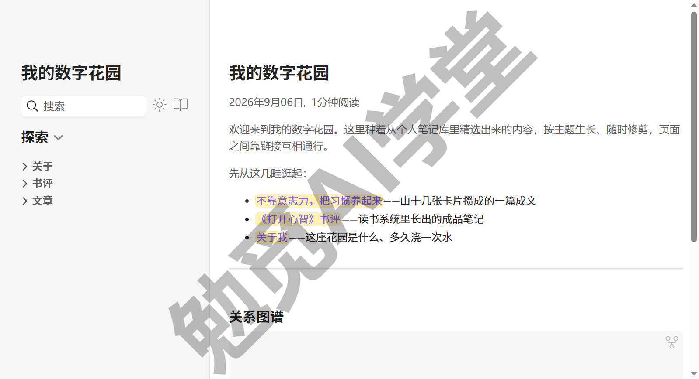

它和博客也不是一回事，分清了才知道为什么这么建：博客按时间线发布成稿文章，读者从新往旧翻；数字花园按主题织成网络，页面之间靠链接互跳，半成品也可以先长在上面、以后慢慢修剪。你库里的 wikilink、反向链接和图谱，正是这张网络的原材料。所以本课选 Quartz 这类专为笔记设计的生成器，而不是普通博客程序：它能把库里的链接体验原样带到网页上。

本篇的结构先交代清楚：20.2 到 20.5 是毕业项目本身，按选材、建站、预览、上线四步走完，最后拿到一个正式链接；20.6 到 20.9 是四个总结节，分别讲自检清单回收、备份纪律终检、跟上更新的方法和诚实定位；最后是毕业验收清单。

这篇文章的实操内容不需要花钱：建站用 **Quartz**（一个开源免费的静态站点生成器，官网 [quartz.jzhao.xyz](https://quartz.jzhao.xyz/)），托管用 GitHub Pages 的免费服务；官方的 Publish 是付费对照项，20.5 末尾讲清它适合谁，只讲机制不报价格。《导入、导出与发布》把发布三条路的取舍讲过一遍，选了 Quartz 路线的读者，本篇就是那条路的完整实操。

还要先说明一点：这是全课技术含量最高的一篇，会用到三样此前很少碰的东西：

- **命令行**：一个用文字命令操控电脑的窗口，20.3 会带你第一次打开它。
- **Node.js**：一个运行 JavaScript 程序的环境，Quartz 靠它构建站点，20.3 里会分三步装好。
- **GitHub**：代码托管平台，你在《导入、导出与发布》里已经注册过账号，到 20.5 上线时正式用上。

不用紧张，每条命令都会解释它在做什么，照着抄就能走通；真翻了车，20.5 有一段专门讲排障，课程自己遇到过的失败也记在那里。

### 20.2 选材与隐私前置

建站之前先选内容，顺序不能反。原因很实际：隐私内容一旦错发出去，就很难收回。公开到网上的内容即使事后删除，搜索引擎的缓存、别人的转存都可能已经留底。所以本课把隐私检查放在一切命令之前，作为发布的第一道工序。

**圈定发布范围**。做法是给要发布的内容划一个明确的范围：在库里建一个专门的发布文件夹（比如“数字花园”），要发布的笔记复制进去。注意是复制不是移动，库仍然是唯一的原稿，发布文件夹只是它的公开精选集。复制还多一层保险：发布版上的任何修改试验都不影响库里的原文。文件夹内部保持浅结构，按“文章、书评、关于”分两三个子文件夹即可，站点的目录导航会跟着它走（以实际构建为准）。用《标签与属性》教过的标签来圈定也可以，课程按文件夹的做法演示，因为范围更直观。

第一批内容不用现找，前面两个项目已经备好。《卡片盒写作系统》里由十几张卡攒成、已经发表过的那篇成文，是现成的主打内容；《读书笔记系统》里从摘录加工出来的成品读书笔记，正好展示另一种体裁；再手写一篇简短的“关于我”，说明这座花园是什么、大概的更新节奏，访客有个落脚点。另外准备一篇名为 **index** 的首页笔记：站点首页认的就是发布文件夹根下的 index，不放它，上线后首页会直接报 404（网页不存在，页面上写着“私有笔记或笔记不存在”）；里面写几句欢迎语，再用双链把三篇内容各挂一行，访客一进来就能顺着链接逛。三篇正文加一篇 index 首页，起步足够了。第一批宁可少一点，先把上线流程完整跑通，之后按 20.5 的日常更新流程逐批增补，比一次搬几十篇再逐篇检查稳妥得多。

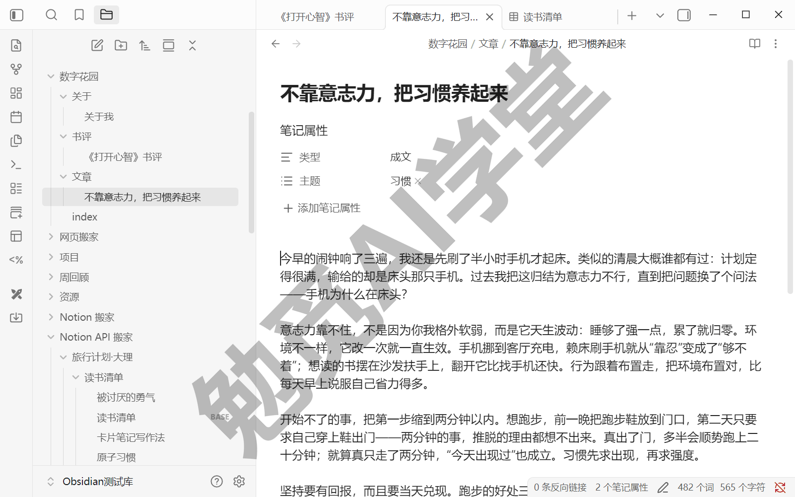

**发布前三查**。对发布文件夹里的每一篇，过三道检查：

- 第 1 查·正文里的敏感信息：人名、公司、薪资、还没公开的事项，都属于这一类。用全局搜索把高危关键词在发布文件夹里扫一遍（《库、文件与搜索》练过的 `path:` 圈范围加关键词，正好用上），比逐篇用眼睛读可靠，扫完没有命中才算过。
- 第 2 查·附件：截图里露出的姓名和头像、聊天记录的边角、导出文件里夹带的个人信息，都要看。把每张图放大看一遍，该打码的打码，该换图的换图，处理完的图片记得同步替换进发布文件夹。
- 第 3 查·链接：发布的笔记里链向了没发布的私密笔记怎么办？有两种处理办法：把被链的笔记一并纳入发布（前提是它本身可以公开），或者改写句子去掉这条链接。链接指向发布范围之外时站点上会怎么显示，以实际构建结果为准，检查时一并留意。

查完之后，给通过三查的笔记加一个发布标记（比如一条 `published` 属性，或在“关于我”里维护一份已发布清单），《标签与属性》的元数据用法在这里又派上用场。下次增补内容时，只查新增的那几篇，不用全部重来。

三查的总原则：**拿不准就不发**。数字花园可以慢慢长，少发一篇没有损失，错发一篇很难收回。

### 20.3 Quartz 建站：环境与初始化

内容就位，开始搭建站点。这一节把环境装好、把站点骨架初始化出来。

**Quartz 是什么**。它是一个专为发布 md 笔记设计的开源静态站点生成器：把一批 Markdown 文件变成一整个网站，而且官方功能列表明确支持 Obsidian 兼容、wikilink、反向链接、图谱页、全文搜索，库里那套体验大体能带到网页上。“静态站点”意思是生成的就是一批现成的网页文件，不需要后台服务器，所以托管可以完全免费。当前大版本是 Quartz 5，配置用 YAML、带插件系统；网上大量教程基于旧版 v4，命令与配置对不上是正常的，本课一律以官方 v5 文档和本篇给出的步骤为准。

**前置核对**。《导入、导出与发布》的发布前准备里，你已经注册了 GitHub 账号、装好了 Git，当时说好只求装好可用，现在派上用场。还差一样东西：**Node.js**，它是一个运行 JavaScript 程序的环境，Quartz 靠它构建站点。前面没有装过，这里分三步装好。官方对版本有要求：Node 需要 v22 以上、npm 需要 10.9.2 以上（以官网当前要求为准）。

**第 1 步：下载安装包。** 浏览器打开 Node.js 官网（nodejs.org），首页的下载按钮默认给的就是当前长期支持版（页面上标着 LTS），点它下载对应你系统的安装包，Windows 是 .msi 文件，macOS 是 .pkg 文件（页面布局以官网当日为准）。

**第 2 步：运行安装。** 双击安装包，安装向导一路保持默认选项点“下一步”直到完成，不需要改动安装位置，也不需要勾选任何附加项（向导的具体页面以安装包当前版本为准），完成后关闭向导即可。

**第 3 步：验证。** 先把安装前已经打开的命令行窗口关掉，重新开一个，因为旧窗口识别不到刚装好的命令，这是这一步最常见的坑。Windows 上用系统自带的终端即可（打开方式以你的系统为准），然后执行：

```
node -v
npm -v
```

两条命令各显示一个版本号，就说明环境装好了。

**初始化站点**。官方给了两条起步路线，课程走“先建自己的仓库”这条（官方安装指引的模板路线），后面上线时少一步关联操作：

- 第 1 步：用官方提供的 GitHub 模板，在网页上一键生成一个属于你自己的 Quartz 仓库：登录 GitHub 后打开官方 Quartz 仓库页，点“Use this template → Create a new repository”（未登录时看不到这个按钮，只显示 Public template 标记，先登录再找）。仓库就是 GitHub 上的一个项目文件夹，起个简短的英文名（比如 digital-garden）。
- 第 2 步：把自己的仓库克隆到本地（克隆就是把整个仓库完整复制一份下来）。命令行里执行（方括号里的内容换成你自己的）：

```
git clone https://github.com/[你的用户名]/[仓库名].git
cd [仓库名]
```

- 第 3 步：安装依赖（Quartz 运行所需的一批程序包），然后运行初始化向导：

```
npm i
npx quartz create
```

向导共四问（以 v5.0.0 为例），每一问怎么答见下表：

| 向导提问 | 可选项 | 课程的选择 |
| --- | --- | --- |
| 选模板 | Default／Obsidian／TTRPG／Blog | **Obsidian**（为 Obsidian 库预置兼容配置） |
| 内容初始化方式 | Empty Quartz（空库起步）／Copy an existing folder（把现有文件夹复制进来）／Symlink an existing folder（符号链接同步） | **Copy**，路径填成 20.2 圈好的发布文件夹 |
| base URL | 填站点地址 | 按“[你的用户名].github.io/[仓库名]”的形态填，不带 https:// |
| 链接解析策略 | —— | 选了 Obsidian 模板会自动跳过这一问 |

也可以在第二问选 Empty 先跳过内容，稍后手动把笔记复制进站点的 `content/` 文件夹，官方说明内容一律写在这个文件夹里。

- 第 4 步：按所选模板安装插件（Quartz 5 新增的一步，命令来自官方首页）：

```
npx quartz plugin install --from-config
```

做完会看到：本地多了一个仓库文件夹，里面有 `content/`（放你的笔记）和一批站点文件。直接克隆官方仓库、上线前再关联自己仓库的另一条路线官方同样支持，课程不展开，需要的话以官方安装指引为准。

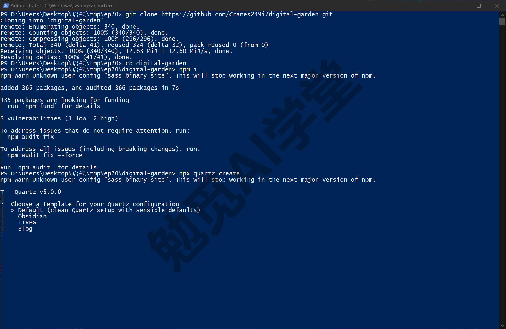

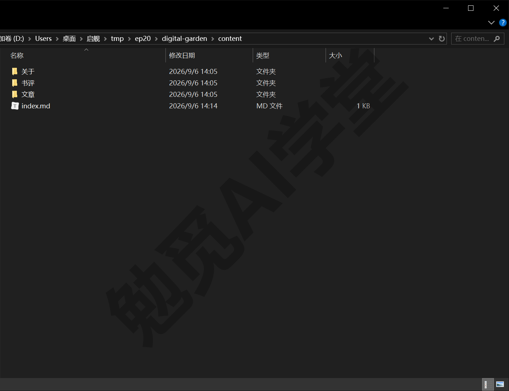

### 20.4 配置与本地预览

骨架有了，先在自己电脑上把站点跑起来看效果，满意再上线。

**基础配置**。站点的全局设置写在 `quartz.config.yaml` 里。YAML 这套“键: 值”的写法你不陌生，《标签与属性》看源码模式时见过，是同一类语法。用任何文本编辑器（包括 Obsidian 本身）打开它，先认四个基础项（配置项的官方名称如下，具体以官方文档为准）：

- `pageTitle`：站点标题，显示在每个页面和订阅源里；把默认值改成你的花园名，保存后预览页顶部立刻换名。
- `locale`：界面语言与日期格式；填 `zh-CN` 就会生效：“探索”侧栏、搜索框、“关系图谱”标题和“2026年9月06日, 1分钟阅读”这类日期行全部变成中文。
- `baseUrl`：站点的最终地址，要和 20.5 部署后的真实地址一致，官方明确提示订阅源等功能依赖它。按“[你的用户名].github.io/[仓库名]”的形态填好（向导里填过的这里就已经是对的），填错的典型症状是页面样式丢失或链接跳错。
- `theme`：外观主题，分字体和明暗配色两块；先用默认值，等站点跑稳了再回来慢慢调，改坏了恢复默认值即可。

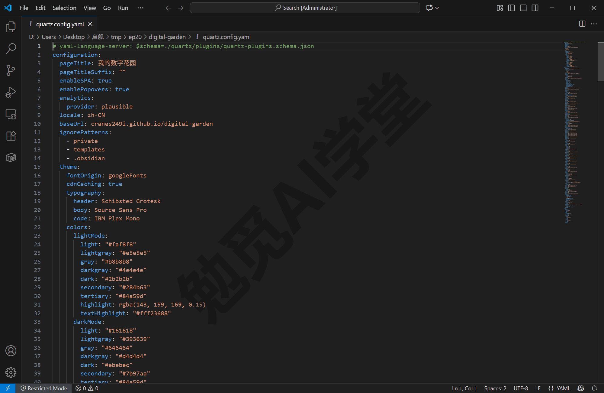

**本地预览**。命令行里执行：

```
npx quartz build --serve
```

`build` 把 md 构建成网页，`--serve` 在本机起一个预览服务。做完会看到命令行提示 `Started a Quartz server listening at http://localhost:8080`，浏览器打开这个地址，你的数字花园第一次呈现出来。此刻它只在你电脑上，外人还看不到。一个常见的坑先交代：第一次构建如果报和主题 default 相关的 `Cannot find module` 错误，不用慌，主题包是第一次运行时自动补装的，报错后重跑一遍这条命令就好。

预览是可以边看边改的：新增或改动一篇笔记，保存后刷新浏览器就能看到效果，不用重跑命令；官方说明修改配置文件也会自动生效（以实际表现为准）。这一节接下来的检查与修改，都在这个“改一下、看一眼”的循环里完成。

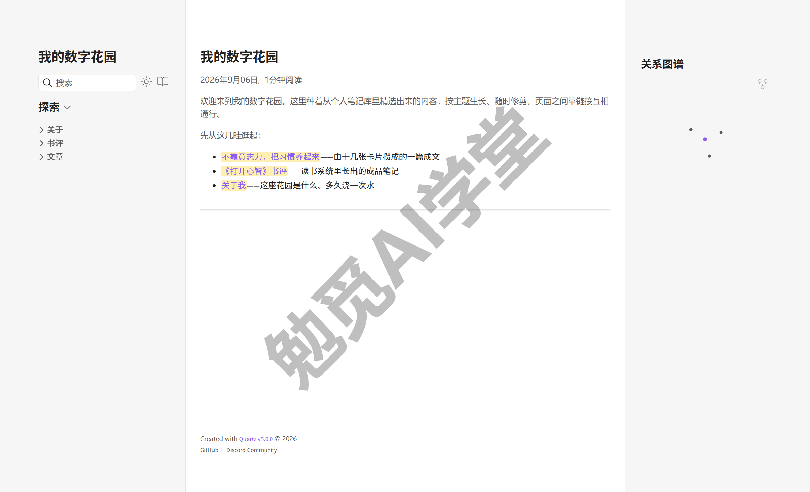

**逐页检查**。对照库里的原文，把每篇发布内容点开看一遍：

- wikilink 是否转成了站内链接，点击能不能跳到对应页面；
- 图片是否正常显示，有没有显示不出来的；
- 图谱页效果如何，反向链接与全文搜索是否可用（这些都是官方功能列表明确支持的能力，具体呈现以实际运行为准）。

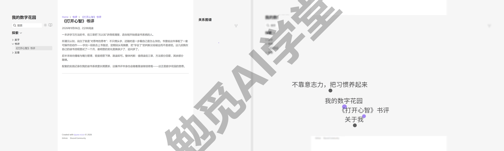

**渲染差异排查**。Obsidian 里显示正常、到了网页上却不对，常见的有几类：嵌入内容显示不全、标注块样式不同、指向发布范围外笔记的链接失效。处理思路都一样：以网页效果为准改写原文，或者调整发布范围把缺的补进来（具体表现以实际构建为准）。本地预览阶段多改几轮没有任何成本，所以先预览、满意了再上线。

### 20.5 上线、排障与日常更新

本地满意了，把花园发布到网上。托管用 **GitHub Pages**：GitHub 提供的免费静态网页托管服务，配合 GitHub 自己的 **Actions**（一套按预设步骤自动执行任务的机制，下文叫它流水线）实现“你推送笔记、它自动重建站点”。整个流程官方文档都给出了，照抄就能用。

**部署三步**（按官方托管指引）：

- 第 1 步：在本地仓库里新建文件 `quartz/.github/workflows/deploy.yml`，内容照抄官方给出的部署配置（以下为 2026-08 时官方文档给出的全文，以官方文档最新版为准）：

```
name: Deploy Quartz site to GitHub Pages

on:
  push:
    branches:
      - v5

permissions:
  contents: read
  pages: write
  id-token: write

concurrency:
  group: "pages"
  cancel-in-progress: false

jobs:
  build:
    runs-on: ubuntu-latest
    steps:
      - uses: actions/checkout@v6
        with:
          fetch-depth: 0
      - uses: actions/setup-node@v6
        with:
          node-version: 24
      - name: Cache dependencies
        uses: actions/cache@v5
        with:
          path: ~/.npm
          key: ${{ runner.os }}-node-${{ hashFiles('**/package-lock.json') }}
          restore-keys: |
            ${{ runner.os }}-node-
      - name: Cache Quartz plugins
        uses: actions/cache@v5
        with:
          path: .quartz/plugins
          key: ${{ runner.os }}-plugins-${{ hashFiles('quartz.lock.json') }}
          restore-keys: |
            ${{ runner.os }}-plugins-
      - name: Install Dependencies
        run: npm ci
      - name: Install Quartz plugins
        run: npx quartz plugin install
      - name: Build Quartz
        run: npx quartz build
      - name: Upload artifact
        uses: actions/upload-pages-artifact@v3
        with:
          path: public

  deploy:
    needs: build
    environment:
      name: github-pages
      url: ${{ steps.deployment.outputs.page_url }}
    runs-on: ubuntu-latest
    steps:
      - name: Deploy to GitHub Pages
        id: deployment
        uses: actions/deploy-pages@v4
```

这段配置里，触发构建的分支（分支是仓库里的一条版本线）名字和官方模板一致，当前是 v5，克隆下来默认就在这个分支上。配置里每一步的大意是：取回代码、安装 Node、安装依赖和插件、构建站点、把生成的网页发布到 Pages。看不懂细节完全不影响使用。

- 第 2 步：到 GitHub 网页上你的仓库，进入 Settings → Pages，把 Source 选为 **GitHub Actions**（界面以实际显示为准）。
- 第 3 步：回到命令行，提交并推送：

```
npx quartz sync
```

`sync` 一条命令包办三件事：保存改动、推上 GitHub、顺带拉回其他设备的更新。推送后 GitHub 会自动开始构建。

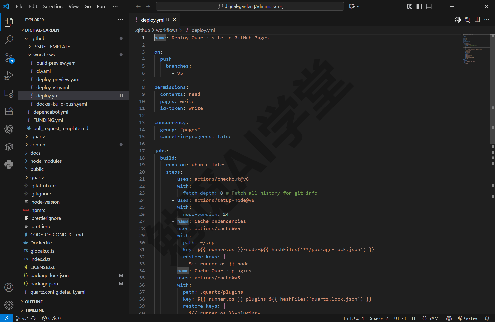

**确认上线**。到仓库的 Actions 页签，等流水线跑完出现绿色对勾，再访问 `https://[你的用户名].github.io/[仓库名]`，这就是你的正式链接，发给任何人都能打开。Actions 页里还会看到模板自带的另外几条流水线（Build and Test、Deploy v5 Preview 等）显示为 skipped，那是 Quartz 官方仓库自己用的，跳过是正常的，不用管；只认名为“Deploy Quartz site to GitHub Pages”的那一条。

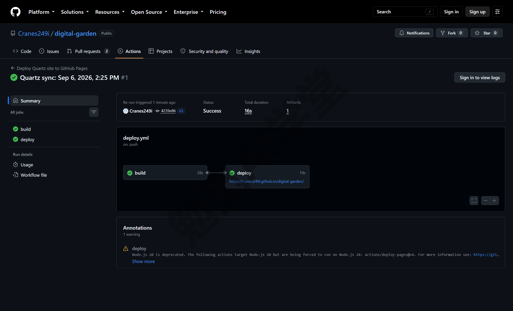

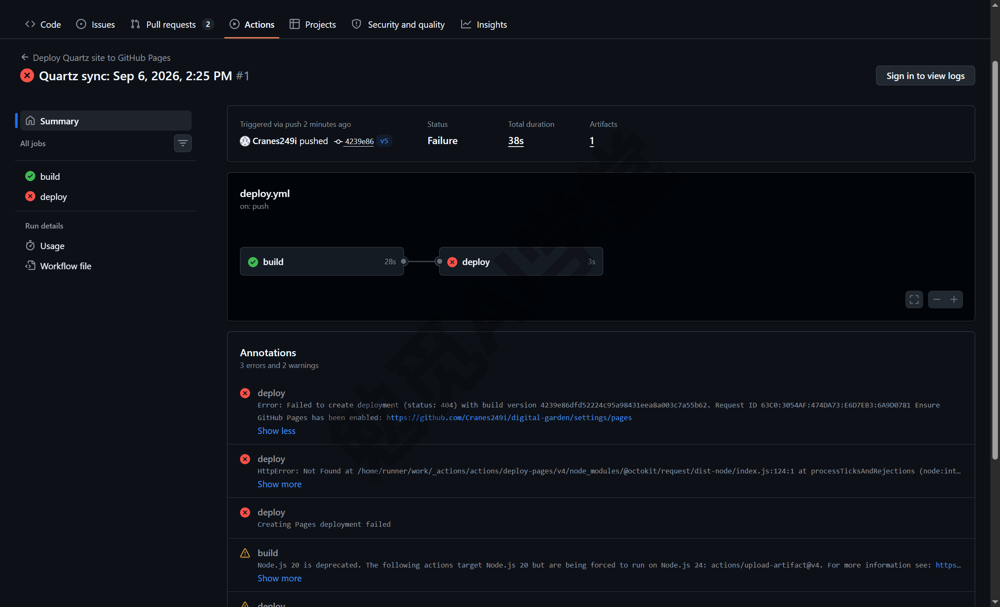

**翻车排障**。第一次部署翻车很常见，最常见的是下面两类情况：

- **构建失败**：去 Actions 页签点开红叉的那次运行，展开失败步骤读日志，报错信息就写在那里。课程自己的第一次部署就翻在这里：build 一步是绿的、deploy 一步很快就变红，日志里写着“Error: Failed to create deployment (status: 404)... Ensure GitHub Pages has been enabled”，原因是漏了第 2 步，Pages 的 Source 还没设成 GitHub Actions。设好后回到那次失败的运行，点“Re-run failed jobs”重跑失败作业即可，十几秒就会转绿，不用重新推送。另一类是提示不允许部署到 github-pages 的环境保护规则错误，处理办法是到仓库 Settings 的 Environments 页删掉旧环境，下次推送时会自动重建（以实际界面为准）。
- **改了没生效或页面 404**：最可能的原因是忘了执行 `npx quartz sync`，改动根本没推上去，官方常见问答第一条就是它；另外还有一个已知差异要知道：Quartz 生成的页面地址是“文件名.html”这种形式，结尾带斜杠的旧链接在 GitHub Pages 上会打不开。

排障的思路和《同步与备份全解》处理同步冲突时一样：先读报错、再定位原因、再补救重跑，不用慌。

**日常更新流程**。花园从此这样生长：在库里改笔记，把改动更新到发布文件夹（按 20.3 的接入方式），执行 `npx quartz sync`，流水线自动重建，几分钟后网站就更新了。整个流程里你只做两个动作：改内容、跑一条命令。

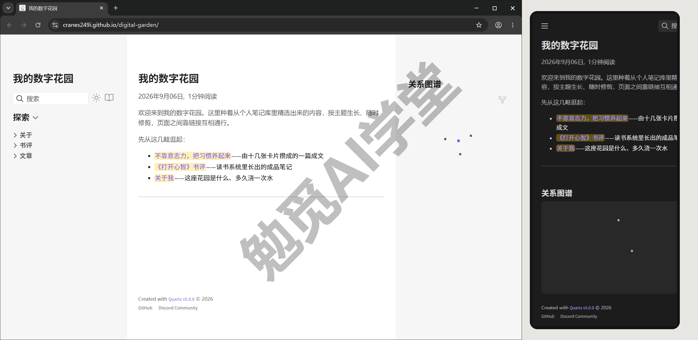

**Publish 对照**。官方的 Publish 是这条路的付费替代：它直接接在库上，在应用里勾选要发布的笔记就行，不用命令行，也不用托管配置，代价是订阅费（价格以官网当日显示为准）。《导入、导出与发布》做三选一决策时讲过它适合谁：预算充足、完全不想碰命令行的读者；已经跟着本节走通 Quartz 的读者，不需要再订阅它。

### 20.6 全课自检清单逐项回收

每一篇的结尾都有一份“本篇小结与自检”清单，二十篇合起来一百条上下，覆盖了本课讲到的全部功能点。当时是一篇一篇分开勾的，现在把它们合成一张清单，从头到尾再过一遍，当作你自己的毕业验收。

**怎么回收**：

- 第 1 步：新建一篇“全课自检清单”笔记，把二十篇“本篇小结与自检”里的 `- [ ]` 条目按篇序依次复制进来，每组前面写上文章名。它本身就是一篇带任务清单的笔记，正好用你已经熟练的方式管理它，勾选进度一目了然。
- 第 2 步：逐条自问两个问题：这一条在哪篇学的？现在会不会用？两问都答得上就打勾；只答得上一问的先空着，它就是你的补课清单。
- 第 3 步：打不了勾的条目，回那一篇对应的节补课，只补那一节，做完那节的练习任务再回来补勾，不用重看整篇。Markdown 语法类的条目，去姊妹篇《Markdown 通用语法手册》对应篇回收。
- 第 4 步：全部打勾后，这份清单存档进库，它就是你的毕业凭据；日后官方出了新功能，学会一项就往清单上添一条，让它跟着版本一起更新。

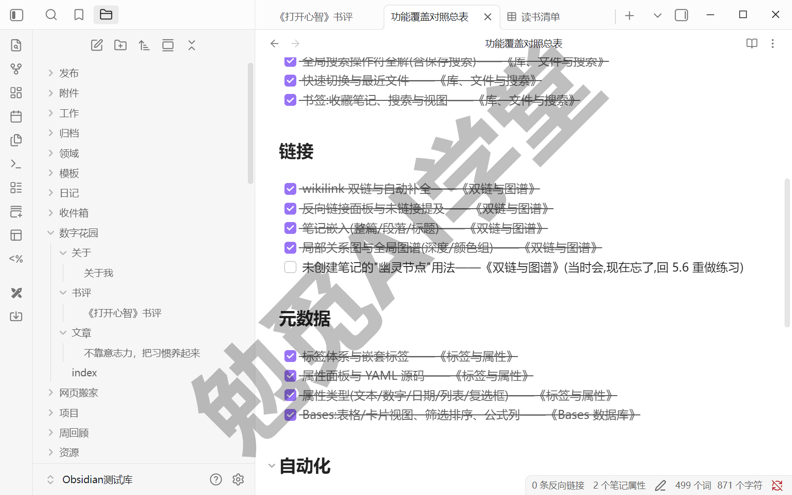

复制条目时可以不按篇序，改按能力块分组，过起来节奏更稳：组织与检索一组（库、文件夹、搜索、书签），链接一组（双链、反链、嵌入、图谱），元数据一组（标签、属性、YAML），自动化一组（模板、日记、Bases、Dataview），进出与发布一组（导入、导出、同步、剪藏、发布）。每组过完歇口气，别一口气从头过到尾。

回收时通常会有两种发现，都正常。一种是“会用，但说不清在哪篇学的”，这说明这项能力已经变成了习惯，看一眼这条条目来自哪篇，补个出处即可，不算失分；另一种是“当时会，现在忘了”，多半是那一篇之后再没用过，回去把那一节的练习任务重做一遍，动手找回来比重读快得多。两种发现的比例，也顺便告诉你自己的库哪些能力天天在用、哪些还闲着。

还有一个心态上的问题要说清：这份清单求的是覆盖全面，你的日常用法只是其中一部分。全部打勾证明的是“需要的时候会用”，不等于“每天都要全用上”。Canvas、Bases 这类能力，有人天天用、有人一季度用一次，都正常。勾完之后按需取用即可，不必为了对得起课程，把每个功能都硬塞进自己的工作流；用不上的能力留在清单里，等需求来了随时能启用。

回收完成后，建议再写一篇“毕业盘点”笔记：记下打勾的日期、补过课的项、以及闲置能力里打算启用的一两项，再把它链向各篇练习的产物。这是全课最后一次双链练习，以后想回头查看时从它进去就行。

### 20.7 备份同步纪律终检

笔记数据在你自己手里，同步和备份也就要自己负责，《认识与装好》讲工具取舍时就提过这一点，毕业前再做最后一次检查。《同步与备份全解》定下了两道防线：同步保证多端一致，备份保证删错了、改坏了能回去，两个都要。这两道防线有个共同点：平时都很少被想起。同步顺畅时你感觉不到它，备份更是平时根本用不到，直到出事那天才知道有没有。所以这次终检要查的不是“配置还开着吗”，而是“出事时真能靠住吗”。

**终检三项**：

- 第 1 项·多副本检查：本机库、同步端（网盘或 Git 远端）、定期的整库备份，三处副本各在哪、最近一次备份是什么时候，都要能逐一说出来才算过。说不出来的，现在就补一次整库备份：库就是一个文件夹，复制一份到移动硬盘或另一块盘就完成了。
- 第 2 项·快照恢复演练：文件恢复核心插件开着吗？现场演练一次，随便打开一篇笔记，故意删掉一段并保存，再把它找回来：设置的“文件恢复”页里点“快照”一栏的“查看”，弹出的“文件恢复”窗口左侧搜出这篇笔记，版本列表按时间排开（每个版本都标着大小），选删段之前的那份，右侧全文预览里能看到被删的段落（“显示差异”开关可以对照改动），点“恢复此版本”就回来了。顺手看一下同页的两项设置：“快照生成间隔”默认 5 分钟、“快照保存时长”默认 7 天。恢复功能只有实际演练成功过，才算真的可用。
- 第 3 项·冲突处置复述：两端同时改同一篇会产生冲突副本，处理分三步：对比两版、手工合并成一版、删掉冲突副本。能不看笔记就说出来，这一项就算过；当时没亲手处理过冲突的，照《同步与备份全解》的演练法现在补一次。

第 1 项里的同步端还要多一个抽查动作，不能只看同步图标变绿：《同步与备份全解》讲过网盘占位文件的坑，图标正常不等于内容真的到了。抽一篇最近改过的笔记，到另一端（或网盘的网页版）打开确认内容一致，这一项才算真过。另外提醒一句：整库备份天然包含 .obsidian 配置文件夹，插件与设置随之保全，这也是课程一直说“复制整个库文件夹”而不是“只备份 md 文件”的原因。

备份的频率也说一下：整库备份建议每月做一次；另外，批量改动、大迁移、让 AI 处理整个库这类重大操作之前，也各做一次。可以把每月一次的备份放进月末那次每周回顾里一起做，就不容易忘。

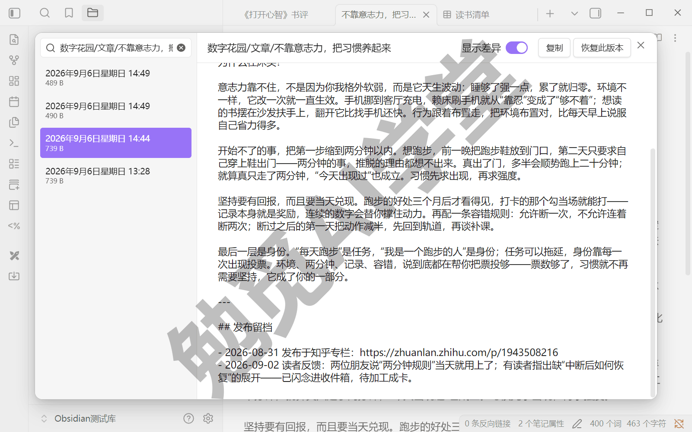

**数字花园带来的一个新情况**：上线之后，GitHub 上的发布仓库客观上成了你的一份异地副本。这是好事，但它**不是备份的替代**。有两个原因：

- 它只有精选内容，发布范围外的笔记（往往是更重要的那部分）完全不在里面；
- 它存的是生成好的网页，不是库本身，库的完整内容、配置和历史版本都不在里面。

所以做法不变：备份一律以整库为准，发布仓库只算额外多出的一份副本。副本多不等于安全，能恢复回来才算数，所以终检看的是演练结果，不是配置清单。重大操作前先备份的习惯，毕业后请继续保持，每次只要半分钟。

### 20.8 毕业后跟上迭代

课程到这里就结束了，Obsidian 还会继续更新下去。所以毕业前再教你一个方法：不依赖任何教程，自己跟上它以后的更新。

**更新日志的快速读法**。官方更新日志（obsidian.md/changelog）是唯一权威信息源，桌面版与移动版的每个版本各一条记录。读法分四步：

- 第 1 步：打开更新日志页，找到最新版本条目，先看一眼版本号与日期，对照自己电脑上装的版本（设置的“关于”分组第一行就是当前版本号，旁边还有“阅读更新日志”直达入口；日志页面形态以实际网站为准）；
- 第 2 步：先扫新增功能的部分，这决定“有没有新东西值得学”，通常每个大版本才有大动作；
- 第 3 步：再看行为变更与改进，这决定“我原来的用法会不会变”，入口挪位、默认值改变都记在这里；
- 第 4 步：修复项快速略过；如果你正被某个问题困扰，就反过来在里面搜你的症状。

版本节奏也交代一句：带新功能的大版本隔几个月一个，小版本主要修问题，所以几分钟读完一版、一个月扫一次，完全跟得上。应用内的自动更新、以及面向尝鲜用户的内部测试版，在设置的“关于”分组里各有开关（界面上分别叫“自动更新”和“接收内部版本”，后者官方注明可能不太稳定），普通读者用默认节奏即可。

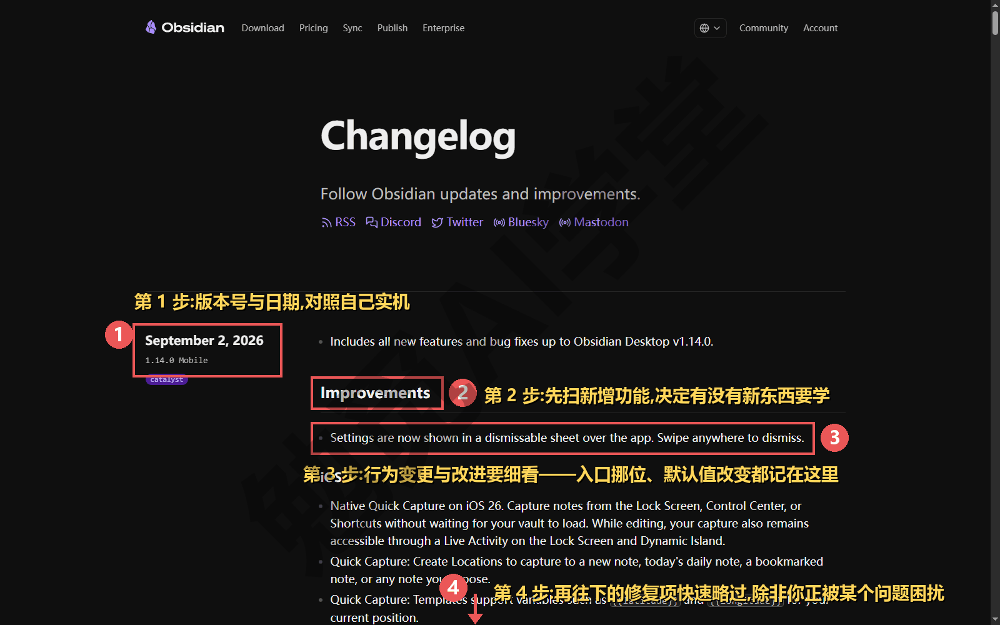

**信息源怎么挑**。以官方帮助文档和官方更新日志为准，官方论坛与社区频道可作补充；第三方教程和视频可以看，但有两点要心里有数：它们可能滞后于当前版本，中文转述也可能与官方原文有出入，拿不准就回官方原文核对。甚至官方帮助文档本身偶尔也滞后于最新版本，此时以更新日志和你手里的软件为准。记住本课反复强调的那条纪律：界面与行为一律以你实际看到的为准。老教程讲的入口找不到，多半不是你错了，是版本变了。

**新功能自己拆的方法**。遇到一个课程没讲过的新功能，按五要素过一遍：它是什么（一句话说清）、为什么需要（解决什么问题）、怎么用（亲手跑通一个最简单的例子）、边界与取舍（什么时候不用它、和相近功能什么关系）、常见坑（翻一眼官方论坛和更新日志的已知问题）。这套顺序你应该不陌生：**它就是本课讲每个功能点的方法**，二十篇里每个功能都是这样讲的，你照同样的顺序去拆新功能就行。

具体拆法给一个流程参照：在更新日志里看到一个新名词，先去官方帮助搜它的专页读“是什么”；然后在自己库里建一篇试验笔记，把最简单的例子跑通；跑通后问自己“我现有流程里哪一步能换成它”，答不上来就先放着，不是每个新功能都需要进你的工作流。从更新日志里挑一个本课没讲过的新名词照这套流程拆一遍，可以当作这个方法的第一次练习。

### 20.9 诚实定位与分工

课程开头说过要诚实定位：开始时讲清它是什么、不是什么，结尾讲清短板与分工。现在说后一半。

**Obsidian 适合谁**。三类人用它最合适：在乎数据自有、想把笔记攒成十年资产的人；愿意自己搭系统、享受把工具调成自己形状的人；以个人知识工作（读书、写作、研究、项目笔记）为主的人。

反过来也照实说：如果你的需求只是轻量记事、记完很少回看，那么链接、属性、插件这一整套对你就成了负担，系统自带的备忘录或一个轻量应用反而更合适。需求也会变：哪天你开始在意积累与回看了，这座库随时可以重新捡起来。

**短板照实说**。有三条真实存在的限制，这里不回避：

- **多人协作弱**：实时共同编辑一份文档不是它的主场，团队文档协作别勉强用它，那是在线文档工具的长项；
- **上手需要时间**：链接、属性、插件都要学，见效在坚持使用几周之后，本课能帮你缩短这段时间，但省不掉；
- **移动端相对简化**：《移动端与网页剪藏》讲过，手机端定位是捕捉与查阅，部分插件不可用，大的整理工作还是回电脑完成。

**分工建议**。《认识与装好》第一篇给过怎么选工具的结论，毕业时确认它依然成立：团队在线协作交给 Notion 或语雀，手机碎片速记交给 flomo，个人知识的长期积累放 Obsidian。工具之间是分工关系，组合使用很正常。放到一天的实际场景里，这套分工是这样的：上班时团队文档在语雀里协作，散会后把属于自己的理解与决策记进 Obsidian；通勤路上闪念进 flomo 或手机端快速捕捉，晚上归档进库；周末把一周的积累修剪一遍，值得公开的移进数字花园。三件工具各干各的活，互不耽误。

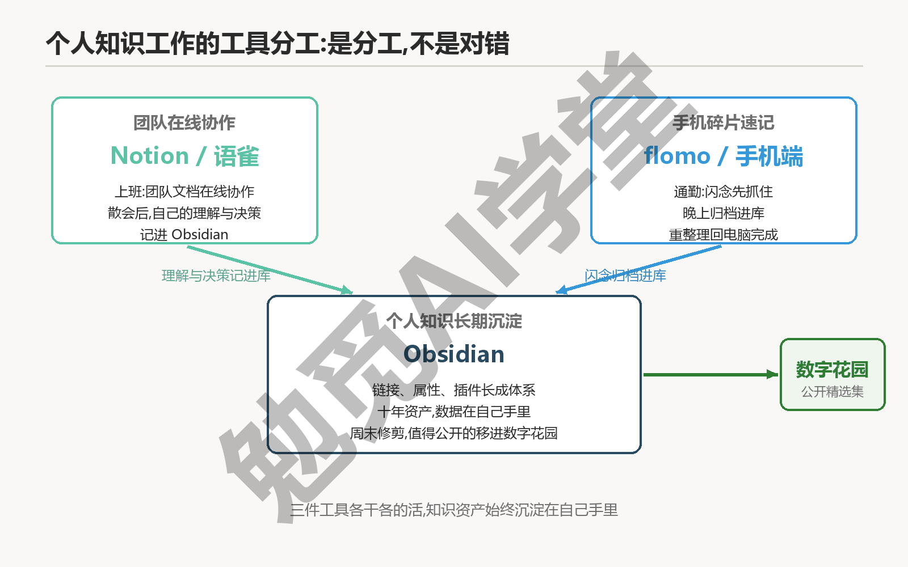

**往后怎么学**。这套课讲的是最常用的主线功能。学有余力想再往下学，可以看 Templater（更强的模板）、QuickAdd（快速录入）、Excalidraw（手绘白板）这几个插件，以及间隔重复闪卡、PDF 标注这类用法，它们都是在你现在这座库上加功能，本课不再展开。往下学的办法也简单：哪个方向的需求先出现，就先往全课自检清单上添一条，再按 20.8 的五要素方法自己学会它。

最后看一眼你手里现在有什么：一座每天运转的库、四个专题系统和一个已经上线的数字花园；往后添笔记、补链接、修剪内容，按前面各篇定下的做法自己做就行。

### 20.10 毕业验收清单

一共四项验收，每项都有明确的判定标准，全部通过就算毕业。

**数字花园已上线**——判定标准：拿到 `https://[你的用户名].github.io/[仓库名]` 形态的正式链接，用另一台设备（比如手机流量）打开可访问，站内至少包含一篇成文、一篇读书笔记和“关于我”。

**全课自检清单全部回收**——判定标准：二十篇自检条目合成的清单逐项打勾、没有空项；之前打不了勾的条目，已经回对应篇补过课并补上勾。

**备份纪律终检通过**——判定标准：三处副本的位置能马上说出来，快照恢复实际演练成功一次，冲突处理的三步能完整复述。

**迭代方法已上手**——判定标准：能当场打开官方更新日志，指出最近一条新增功能，并说出用五要素拆解它的顺序。

### 20.11 本篇小结与自检

这一篇上线了你的数字花园，也为整套课程做了总结。最需要记住的是：**自检清单全部打勾只是起点——数据在自己手里、纪律在自己身上、方法在自己脑子里，你才真正“不用再看第二套教程”。**

可以对照下面的清单检查学习结果：

- [ ] 数字花园已上线，拿到可以分享给任何人的正式链接
- [ ] 全课自检清单逐项回收，全部打勾
- [ ] 备份同步纪律终检通过，快照恢复实际演练过一次
- [ ] 能说出 Obsidian 适合谁、短板在哪、和其他工具怎么分工

完成这些内容后，这套课程就全部学完了。往后 Obsidian 每一次更新，你都可以用本篇给出的方法自己拆解、自己验证——这就是“学完这一套，不用再看第二套 Obsidian 教程”的真正含义。

### 20.12 新手常见问题

**Q1：数字花园会暴露隐私吗？怎么控制发布范围？**

发布范围完全由你控制：只有进了发布文件夹（站点 `content/` 目录）的内容才会出现在站点上。风险主要来自疏忽，不是工具本身，所以 20.2 的三查放在一切操作之前；再强调一次原则：拿不准就不发。已发内容删除后仍可能存在缓存与转存，前置检查比事后补救可靠得多。

**Q2：构建失败最常见的原因是什么？**

按出现频率从高到低：忘了 `npx quartz sync`（改动没推上去，严格说这是“没构建”，不是“构建失败”）；Pages 没启用或 Source 没设成 GitHub Actions（deploy 一步报 404，见 20.5 的翻车排障）；配置文件改坏（YAML 缩进或冒号写错、`baseUrl` 填错）；环境保护规则报错（官方给的处理办法是删掉旧环境再重跑）。定位方法只有一个：去 Actions 页签读失败步骤的日志，原因都写在报错原文里。

**Q3：不想公开内容，毕业项目能用别的方式替代吗？**

可以，有两条替代路线。一条是走完 20.2 到 20.4、只做到本地预览，建站的全部技术环节照样练到，只是不发布，验收项里的“正式链接”换成“本地预览截图”；另一条是只发一个最小站，内容仅“关于我”加两三篇完全不敏感的笔记。另外，免费账号的 GitHub Pages 通常要求仓库公开（以 GitHub 当前政策为准），介意仓库内容公开的读者，官方托管指引里还有其他免费托管平台可选，思路相同。

**Q4：学完这套课，下一步学什么？**

先不急着学新的：把 20.6 回收时打不了勾的项补完，把日常纪律（每周回顾、每月扫一次更新日志、重大操作前备份）跑稳，比多学十个插件更值得。之后按需从 20.9 提到的那些进阶方向里挑，挑的标准仍是那句老话：等真实需求出现再说。
