# 认识 WorkBuddy

这份教程写给想让 AI 替自己完成实际工作、但没有技术背景的普通用户。这一篇不需要你操作电脑，只回答三个问题：WorkBuddy 是什么、能帮你做什么、想用的话怎么装好启动。建立起整体印象后，从下一篇《快速上手》开始动手。

### 1.1 WorkBuddy 是什么

打开 WorkBuddy，欢迎页上印着一句话：“你的职场超能力”。

准确地说，WorkBuddy 是腾讯出品的一款**桌面 AI 助手程序**，官方定位是“个人 AI 智能体工作台”。这类能够调用工具、替人执行任务的 AI，通常称为“智能体”（Agent）。现阶段不必专门记住这个术语，先理解一点就够了：它不只是陪你聊天，还能替你把事情做完。

你可能用过网页版的 AI 聊天工具——打开浏览器、在网页里一问一答的那种。WorkBuddy 和它们有三个实实在在的区别：

- **它安装在你的电脑上，能直接读取你电脑里的文件。** 把一个装满文档的文件夹交给它，它会自己逐份打开处理，不需要你把内容一段一段复制粘贴到网页里。
- **它交付的是真实文件。** 任务完成后，落到你电脑里的是 Excel 表格、Word 文档这样的成品，而不是只回你一段文字、让你自己再整理一遍。
- **它可以通过安装“技能”学会你所在行业、你自己手头的专属工作。** 那些有固定格式和固定规矩的事——比如一张列名固定的行业汇总表——教会它一次，以后一句话就能反复完成。

先看一眼主界面。现在不需要记住每个按钮，后面各篇会逐个用到：

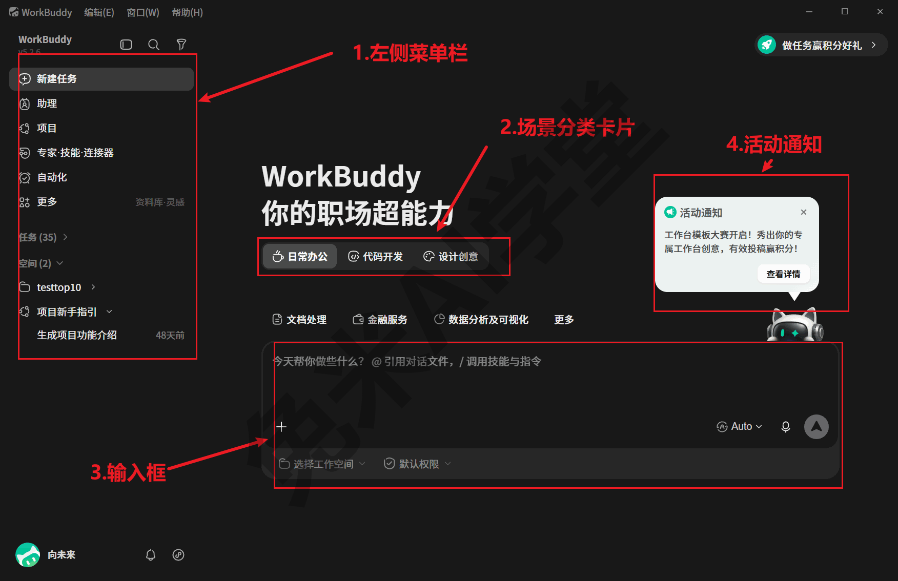

对照截图，界面大致分成五个区域：

- **左侧边栏**：功能导航集中在这里，从上到下是新建任务、助理、项目、专家·技能·连接器、自动化、更多等入口，下方还列着历史任务和空间；
- **中央欢迎区**：印着欢迎语的主区域，启动后默认停在这里，之后你与它的每一次对话也都在中央这片区域进行；
- **场景分类卡片**：把常见用途分成日常办公、代码开发、设计创意三个一级页签，每个页签下另有一行随之变化的子分类（截图里同屏可见的文档处理、金融服务、数据分析及可视化，就是“日常办公”下的子分类），点开就是对应场景的现成入口；
- **底部输入框**：给它布置任务的地方，打字、添加文件、选模型都在这一条上完成，《快速上手》整篇都围绕它展开；
- **右上角活动通知**：平台活动与消息提醒的气泡入口，跟功能学习关系不大，知道它是通知类信息、不影响使用即可。

最后交代两条背景信息：

- 它由腾讯（Tencent Technology (Shenzhen) Company Limited）出品，属于腾讯 CodeBuddy 产品生态，来源可查，不是来路不明的小软件；程序里自带了执行任务所需的一套运行组件，装好即可处理文件，不依赖你电脑上已有的其他软件。
- 本教程的截图和描述基于 5.2.6 版本。程序带自动升级（本教程的演示环境就曾在使用期间自动从 5.2.5 升到 5.2.6），小版本之间的界面差异不影响理解。

### 1.2 它能帮你做什么

这一节把它的能力面完整过一遍，用五件事概括。每件事都会点明入口在哪、后面哪一篇细讲；现在只需要建立“它能做哪些类型的事”的全景，不需要动手。

#### 第一件事：和多个 AI 模型对话

最基础的用法和你熟悉的聊天工具一样：在输入框里打字提问，让它解释概念、起草材料、修改文案。真正替你思考和执行的“AI 大脑”叫**模型**，这是后面会反复出现的词。

WorkBuddy 内置了不止一个模型。以 2026-08-13 实拍的 5.2.6 版界面为例，输入框右下角的模型选择里，除 Auto（自动分配）外，还有 Hy3（腾讯混元）、GLM、MiniMax、Kimi、Deepseek 系列等十来个内置模型；具体几个、各自什么倍率，《模型与费用》有逐项清单，模型清单和计费活动会随版本调整，以实际界面为准。除内置模型外，它也支持自行接入其他模型——本教程的演示环境就接入了 qwen 系列等 5 个自定义模型，接入方法在《模型与费用》里讲。

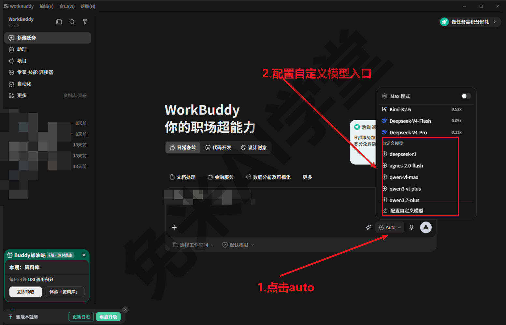

不同模型的能力、擅长方向和价格各不相同，暂时不用纠结怎么挑：保持默认的 Auto 就能正常使用，想细挑、想了解费用时再看《模型与费用》。

#### 第二件事：替你处理文件

网页版 AI 最麻烦的一步是“把材料给它”：文档要复制粘贴，图片要另外上传。WorkBuddy 装在你的电脑上，文件可以直接交：点输入框左下角的“+”，在弹出菜单里选“添加文件”，或者把文件、文件夹直接拖进对话框（具体操作《快速上手》会逐步演示）。

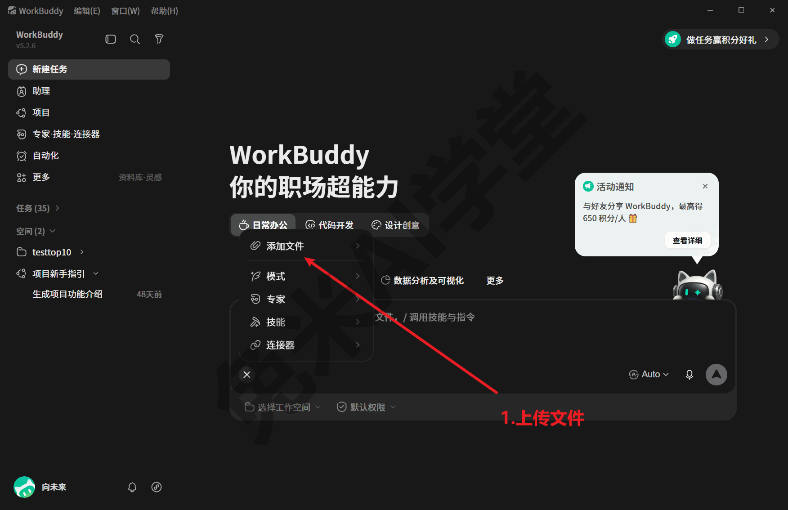

交给它之后能做什么？读一份几十页的 PDF 并讲清重点、认出扫描件图片上的文字、把一批格式不一的材料整理成一张表格，都是它的常规能力。完成后你得到的不是屏幕上的一段回答，而是落在任务工作目录里的真实文件，可以直接打开、转发、存档（这些产物在哪里找，《快速上手》会讲）。

#### 第三件事：装技能，学会你的专属工作

**技能**（Skill）是教会它完成某类工作的“说明书 + 工具包”：说明书告诉它这类工作的规矩和格式，工具包给它配上现成的处理脚本。这个词后面各篇会经常出现，现在记住“装上技能 = 学会一类新工作”即可。

为什么需要技能？通用 AI 什么都懂一点，但不懂你的行业格式：你要的表有固定列名，你的报告有固定结构，靠每次对话临时交代，既繁琐又不稳定。技能把这些规矩固化下来，教一次，以后一句话反复使用。

出厂时它自带一批内置技能（数量与清单随版本调整，以实际界面为准），例如幻灯片与海报的设计稿、本地 Office 文档的实时编辑、金融数据查询、3D 模型与视频特效生成，甚至还有一个帮你创建新技能的“技能创建器”（逐个清点的完整清单与用法见《技能：安装、管理与调用》）。技能市场（入口：左侧边栏“专家·技能·连接器”→“技能”）里还有大量现成技能可以直接安装，PDF 图片文字提取、Excel 文件处理、Word 文档生成等都是市场里的现成条目。

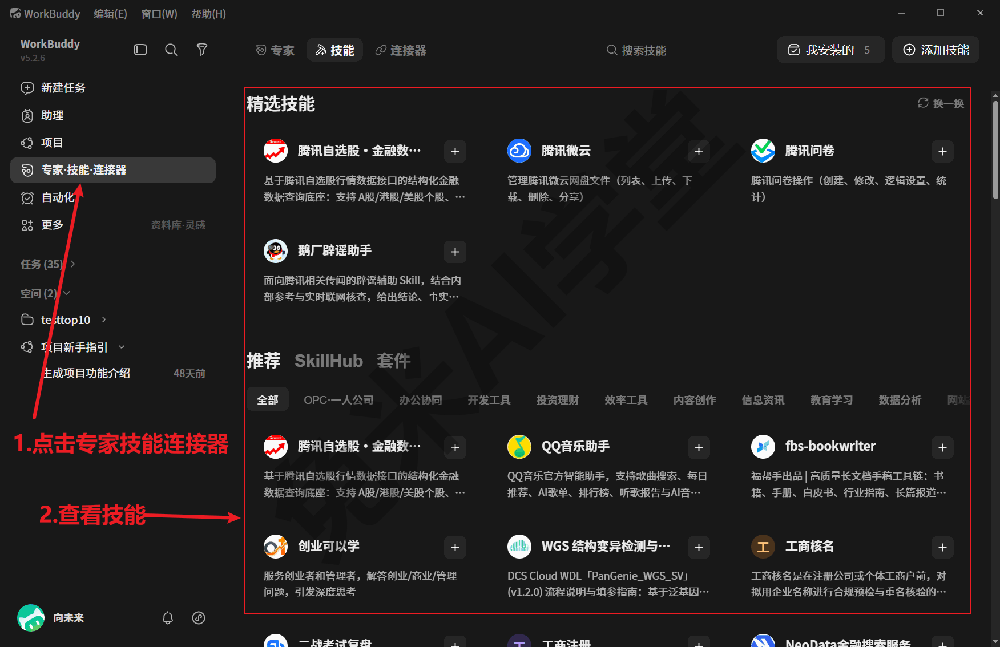

现成技能之外，你还可以自制技能（见《自制技能：把流程沉淀成一句话》）。本教程的演示环境里就装着一个自研的说明书整理技能，专门把一个装满设备说明书 PDF 的文件夹变成一张规范的家庭设备档案表——《实战二：说明书批量投喂出设备档案表》里的实战案例用的就是这套技能。

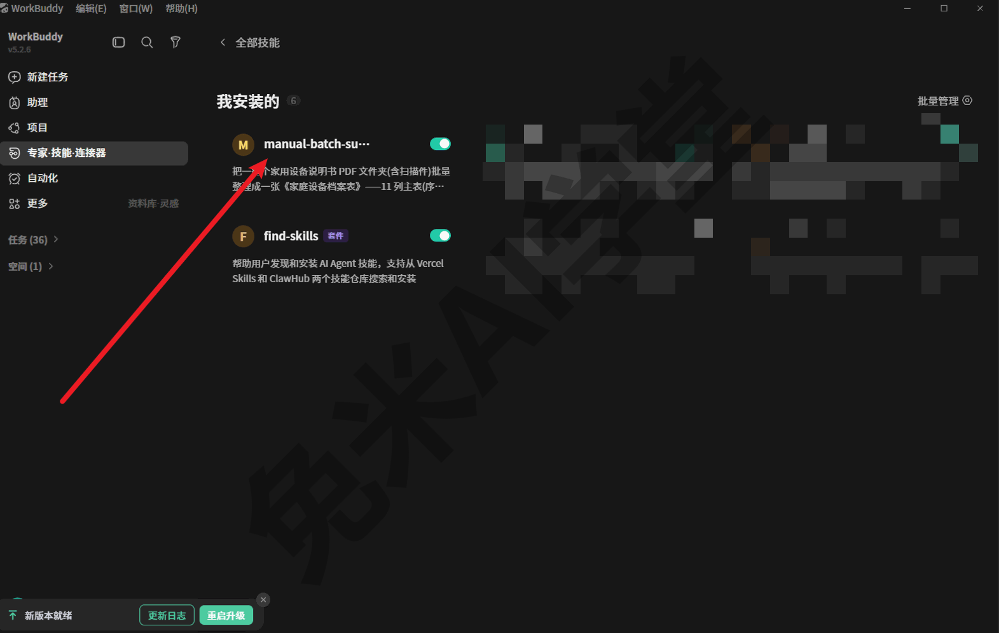

#### 第四件事：接连接器，打通常用办公系统

你的材料不会都在本地文件夹里：有的在在线文档里，有的在邮箱里，有的在协作平台上。**连接器** 是 WorkBuddy 与这些外部系统之间的“桥”，接上之后，它就能替你读写对应系统里的内容。

连接器市场（入口：左侧边栏“专家·技能·连接器”→“连接器”）里已经备好了一批常用系统的现成连接器：腾讯文档、腾讯会议、企业微信、QQ 邮箱、飞书、钉钉、金山文档、腾讯问卷、TAPD、微云等。首次连接一般需要授权登录对应的账号，具体以实际界面提示为准；怎么接、接上之后能做什么，《连接器：把办公系统接进来》里讲。

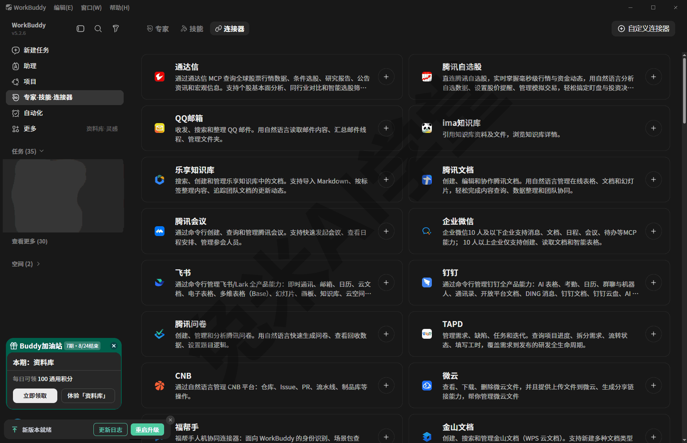

#### 第五件事：做过的事全程留痕

把工作交给 AI，最让人不放心的是“黑箱”：它到底改了什么、产物放在哪、上个月那份表还能不能找回来。WorkBuddy 在这方面的机制相当完整。

每个任务会自动开一个独立的**工作目录**，这次任务的产物都落在里面；每一次对话的完整记录、任务中的待办清单、文件的历史版本备份、交付产物的索引，都保存在本机的数据目录里；后台还有按日期归档的操作审计日志，逐条带防篡改校验。一次任务“说了什么、做了什么、改了什么、交付了什么”，事后都能查回来。

日常使用时你能感知到的是两个入口：一个是左侧边栏的任务历史，随时点开一条旧任务接着聊；另一个是“更多”→“我的文件”，按任务分组列出历史产物，想找回以前的成果从这里进（怎么保存与找回，《快速上手》与《数据、工作目录与记忆》会专门讲）。

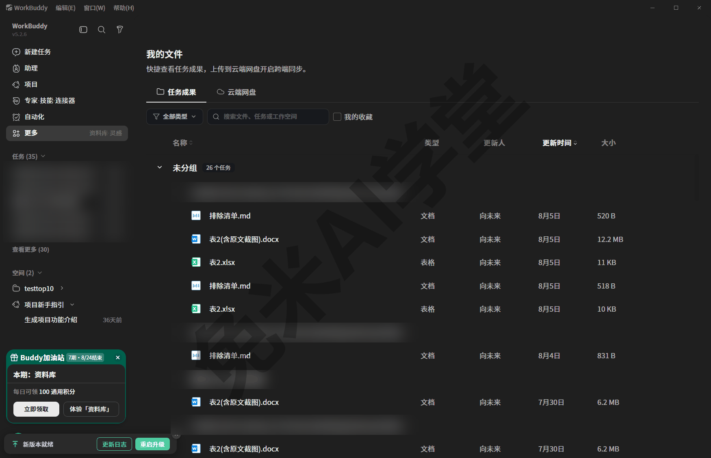

五件事之外，界面里还有本地助理、多人协作项目、自动化定时任务等入口：自动化在《自动化：把重复的活交给定时任务》里专篇介绍，本地助理、专家、项目、灵感这些入口则由《助理、专家、项目与灵感》逐一导览，现在见到它们知道是什么即可。

这些能力也经过真实使用的检验——2026 年 8 月，本教程的演示环境用它真实完成过一次批量建档，把 30 份家用设备说明书 PDF 整理成一张《家庭设备档案表》，完整过程与方法在《实战二：说明书批量投喂出设备档案表》里复盘。

### 1.3 安装与启动

#### 1.3.1 获取与安装

WorkBuddy 有自己的官方网站：**官网 www.workbuddy.cn**；腾讯 CodeBuddy 官网下也设有 WorkBuddy 产品页 www.codebuddy.cn/work/，两处一致（地址为 2026-08-13 联网核实）。安装包从官网的下载入口获取即可；官方帮助文档挂在 CodeBuddy 文档中心的 workbuddy 板块，遇到本教程没覆盖的问题可以去那里查。建议不要从来路不明的第三方站点下载安装包；如果你用的是单位统一管理的电脑，软件的获取与安装遵循所在组织的规定即可。

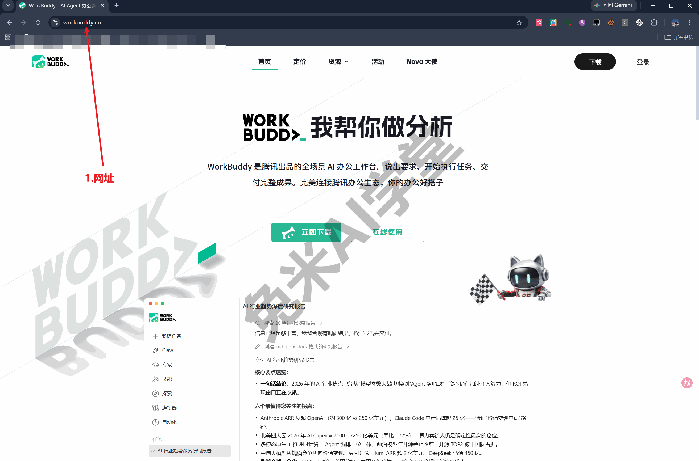

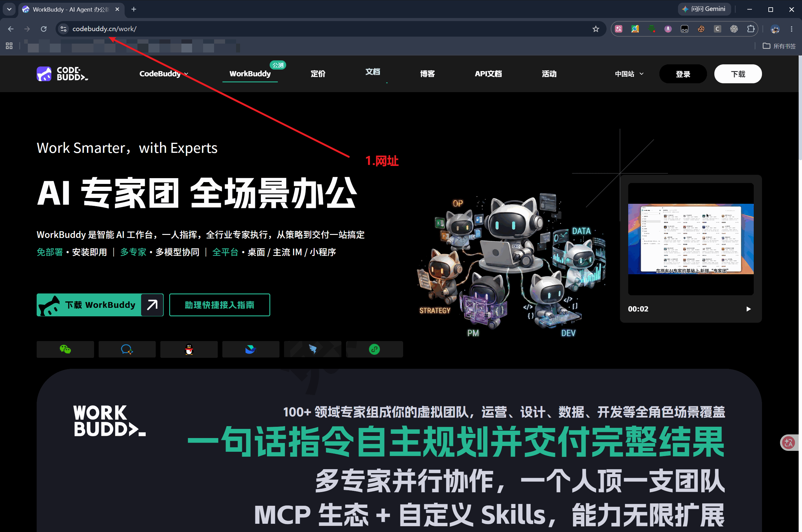

两条可以帮你核对的事实：

- 本教程的演示环境把它安装在 `D:\softwares\workbuddy`，是一个普通的 Windows 桌面程序，自带修复工具与卸载器，卸载入口在系统的“应用”设置里可以找到；
- 本教程的演示环境为 Windows；官网下载页当时同时提供 macOS、iOS、Android 及鸿蒙等版本（2026-08-13 页面所见，以官网当前页面为准）。

另外，它的程序本体不小（演示环境里主程序文件约 200 MB，再加运行组件），下载与安装时给它留出一点时间和磁盘空间，不要因为进度慢就中途取消。

安装完成后的初始设置，包括是否需要登录账号、用什么方式登录，不同版本与分发渠道可能不同。本教程不臆测流程，按首次启动时的实际界面提示完成即可。

#### 1.3.2 启动与首次使用

日常启动只有一步：点击屏幕左下角的“开始”菜单，在程序列表里找到 **WorkBuddy**，单击打开。安装后默认不在桌面创建快捷方式，桌面上找不到图标属于正常现象；需要的话，可以按 Windows 的常规方式自行把它发送到桌面。

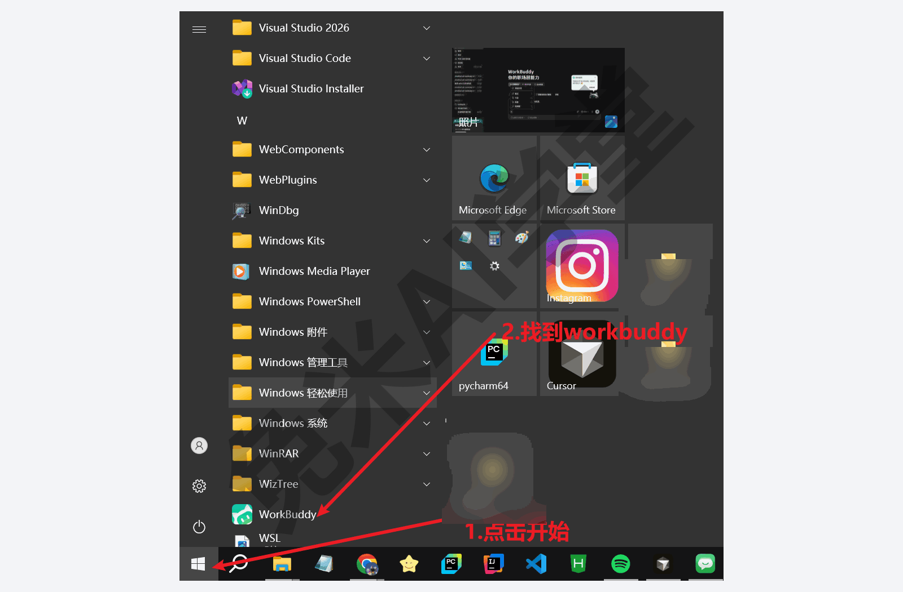

首次启动会比日常启动慢：程序要完成初始化并加载运行组件，可能需要等上几分钟才完全就绪——本教程的演示环境首次启动约 6 分钟后才就绪——期间界面反应慢不代表程序卡死，稍等即可。

第一次对话时，它可能发起“初次见面”式的引导，请你给助手起个名字、告诉它怎么称呼你。愿意的话按提示聊几句，不愿意也可以直接布置任务；本教程的演示环境就跳过了引导，把它纯当工具使用，不影响任何功能。

还有一个几乎人人会遇到的现象：点窗口右上角的“×”并不会退出程序，它只是收进系统托盘继续驻留（首次这样关闭时，界面一般会有相应提示，以实际界面为准）。想彻底退出，点左上角的 **WorkBuddy** 应用菜单，选择 **退出 WorkBuddy**。这个菜单同时也是查版本、检查更新的入口：

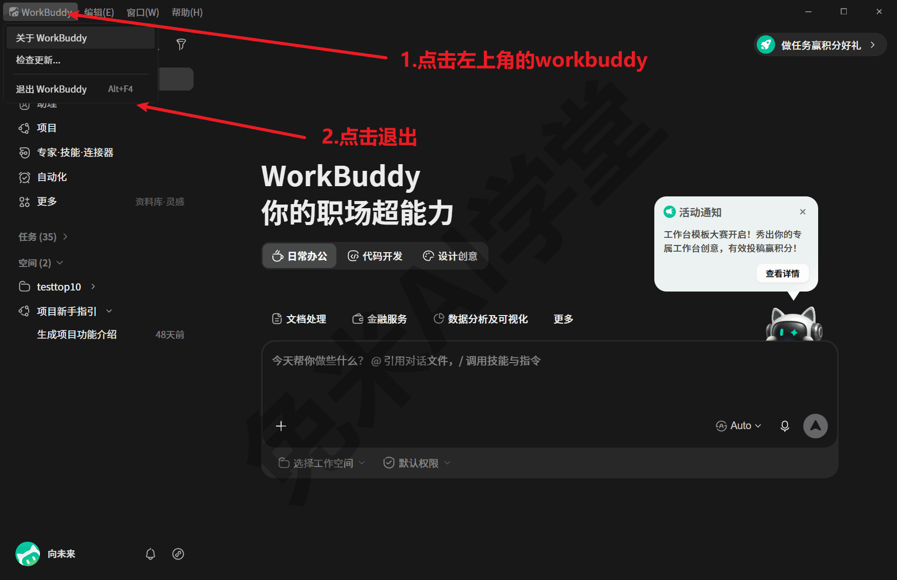

#### 1.3.3 查看版本

程序会自动升级，界面随版本略有差异，所以“我现在用的是哪个版本”值得知道。查看方法：点左上角的 **WorkBuddy** 应用菜单，选择 **关于 WorkBuddy**，弹出的对话框里第一行就是版本号。同一个菜单里还有“检查更新”，想主动确认有没有新版本时用它；平时不点也没关系，程序会自动完成升级。本教程的全部截图与描述基于 5.2.6；如果你看到的版本更新、个别界面和截图对不上，以实际界面为准，不影响照着本教程学习。

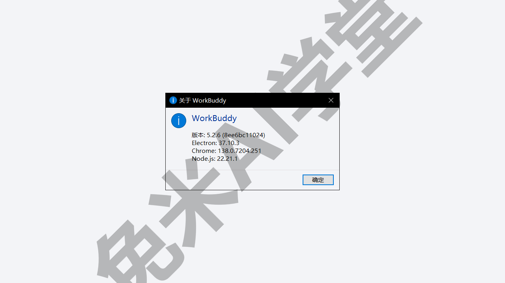

### 1.4 先记住五个词

后面各篇高频出现的词就这五个。现在不必背，先有个印象，遇到再回来查：

| 词 | 一句话解释 | 哪一篇细讲 |
|---|---|---|
| 任务 | 一次对话就是一个任务，历史任务都在左侧边栏，随时点开接着聊 | 《快速上手》 |
| 模型 | 替你思考和执行的“AI 大脑”，默认 Auto 自动分配，也可以手动挑选 | 《模型与费用》 |
| 技能（Skill） | 教会它完成某类专业工作的“说明书 + 工具包”，可安装、可自制 | 《技能：安装、管理与调用》《自制技能：把流程沉淀成一句话》 |
| 连接器 | 打通腾讯文档、腾讯会议等外部办公系统的“桥” | 《连接器：把办公系统接进来》 |
| 工作目录 | 每个任务自动创建的独立文件夹，这次任务的产物都落在里面 | 《快速上手》《数据、工作目录与记忆》 |

这五个词不是孤立的，串起来就是 WorkBuddy 完成一次工作的全过程：

1. 你发起一个**任务**：在输入框里把要求讲清楚，需要处理的文件一并交给它；从发起到收尾，一次对话就是一个任务；
2. 任务由**模型** 执行：保持默认的 Auto 让它自动分配即可，也可以手动挑选；模型决定这次任务的能力上限与费用高低；
3. 专业工作挂**技能**、外部材料走**连接器**：技能让它懂你的行业规矩，连接器让它能访问在线文档、邮箱这些外部系统里的内容；
4. 成果落进**工作目录**：每个任务都有专属文件夹存放产物，之后想找回，从“更多”菜单的“我的文件”里按任务翻找即可。

读到这里，五个词能各自对上一句话解释，这一节的目的就达到了。

### 1.5 练习任务

这一篇的练习都是“看和点”的操作，不发送任何消息、不修改任何设置。前提是你的电脑上已经装好了 WorkBuddy；还没装的话可以先往后读，装好后再回来完成。

**任务一：启动 WorkBuddy，确认你的版本号**

操作步骤：从“开始”菜单的程序列表里找到 **WorkBuddy** 并打开，等主界面完全出现；然后点左上角的 **WorkBuddy** 应用菜单，选择 **关于 WorkBuddy**，记下弹出对话框里的版本号。

完成标准：能说出自己电脑上 WorkBuddy 的版本号（本教程基于 5.2.6，你看到的可能更新，属正常现象）。

**任务二：对照截图，认出主界面的五个区域**

操作步骤：回到 1.1 的主界面截图，在你自己的界面上依次找到左侧边栏、中央欢迎区、场景分类卡片、底部输入框、右上角活动通知这五个区域，并想一想每个区域各是做什么用的。

完成标准：不看截图，也能说出五个区域各自的位置和用途；说不全就回 1.1 再对照一遍。

**任务三：彻底退出，再重新启动**

操作步骤：点主窗口右上角的“×”，观察程序并没有真正退出（通常会收进系统托盘，首次这样关闭时界面一般有提示，以实际界面为准）；再点左上角的 **WorkBuddy** 应用菜单，选择 **退出 WorkBuddy** 彻底退出；最后从“开始”菜单重新启动它一次。

完成标准：能说清“点×关窗口”和“退出 WorkBuddy”的区别，并知道彻底退出的入口在哪里。

### 1.6 本篇小结与自检

这一篇没有让你动手做任务，目的只有一个：让 WorkBuddy 在你这里从一个陌生名词，变成一件“知道是什么、知道能做什么、也知道怎么打开”的工具。

可以对照下面的清单检查学习结果：

- [ ] 能用一两句话说清 WorkBuddy 是什么，以及它和网页版 AI 聊天工具的三个区别
- [ ] 能说出它能力面的五件事：多模型对话、替你处理文件、装技能、接连接器、全程留痕
- [ ] 知道它真实完成过 30 份设备说明书的批量建档，完整复盘在《实战二：说明书批量投喂出设备档案表》
- [ ] 已经装好并成功启动 WorkBuddy，在“关于 WorkBuddy”里看到了自己的版本号
- [ ] 知道点“×”不等于退出，能通过应用菜单彻底退出程序
- [ ] 五个高频词——任务、模型、技能、连接器、工作目录——每个都能对上一句话解释

本教程从这一篇往后按“先动手、再专题、后实战”的顺序展开：《快速上手》带你从启动一路走到发出第一条消息、保存成果；随后《数据、工作目录与记忆》《模型与费用》《技能：安装、管理与调用》《连接器：把办公系统接进来》等专题篇把每样能力逐一讲透；最后由《实战一：办公文档小项目》《实战二：说明书批量投喂出设备档案表》走完真实工作流，再由《任务边界与数据安全》给全书收尾。完成这些内容后，就可以进入下一篇《快速上手》，正式开始动手。

### 1.7 新手常见问题

**Q1：点了“×”，程序是不是还在后台运行？**

是的，点“×”只是把它收进系统托盘继续驻留、并没有退出。彻底退出：点左上角 WorkBuddy 应用菜单，选“退出 WorkBuddy”（本篇 1.3.2 讲过）；托盘驻留机制的更多细节在《快速上手》。

**Q2：用它要花钱吗？**

分两种情况。内置模型按“积分倍率”计费：平台内的积分按各模型标注的倍率消耗，不同时段还可能有折扣或限时免费活动，具体以界面标注为准；本教程实测的设备说明书批量判读场景（2026 年 8 月），30 份说明书合计消耗 47.28 积分，其中两批还赶上了限时免费活动、未产生扣减。外接的自定义模型则按对应服务商的用量计费，服务商一般给新用户一定的免费额度（以官方页面为准）。刚上手阶段按默认配置正常使用即可，计费机制与如何控制费用，《模型与费用》有专门讲解。

**Q3：它和网页版 AI 聊天工具到底有什么区别？**

一句话：网页版 AI 主要给你答案，WorkBuddy 还能替你执行。它装在你的电脑上，能直接读你的文件、交付真实的文件成品，还能通过技能学会你的专属工作。具体差别在 1.1 有展开，《快速上手》的第一个任务会让你直观感受到这一点。

**Q4：完全不会编程，能用得起来吗？**

可以。它的日常使用方式就是打字对话，所有功能都有图形界面；技能把专业流程打包好了，用的时候一句话调用即可，不需要看懂里面的脚本。本教程也全程面向零基础读者，遇到术语都会先解释。
