# 快速上手

《认识 WorkBuddy》回答了“它是什么、能做什么”；这一篇不再介绍概念，只带你动手：从启动程序，到发出第一条消息、给对话添加材料、把 AI 的成果保存到自己电脑里，六步走完，顺利的话大约 10 分钟。全程照着截图操作即可，不需要任何技术基础；本篇截图基于 2026-08-13 实拍的 WorkBuddy 5.2.6 版本，界面如有细小差异，以实际界面为准。

---

### 2.1 启动 WorkBuddy，认识主界面

#### 2.1.1 启动程序

WorkBuddy 安装后默认不在桌面放快捷方式（获取与安装见《认识 WorkBuddy》），桌面上找不到它的图标属于正常现象，入口在开始菜单里。

**第 1 步：从开始菜单打开。** 点击屏幕左下角的“开始”按钮，在程序列表里找到 **WorkBuddy**，单击打开。

**第 2 步：等主窗口出现。** 首次启动要加载内置组件，可能需要几分钟才完全就绪，这不是卡死；以后再启动就快多了。启动后看到的就是主界面：

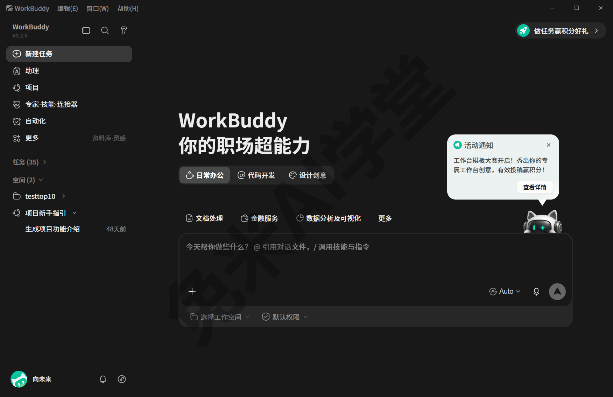

顺带一提：WorkBuddy 运行时，任务管理器里会同时出现多个 WorkBuddy.exe 进程。这是它的多进程架构所致，属正常现象，不必逐个结束，也不代表你开了很多份程序。

#### 2.1.2 界面分区速览

对照上图认识四个区域。本篇所有操作都发生在这四处，现在建立整体印象即可，用到时再回来对照：

- **左侧边栏上段（功能导航）**：从上到下依次是“新建任务”“助理”“项目”“专家·技能·连接器”“自动化”“更多”六个入口。日常用得最多的是最上面的“新建任务”，2.2 节就用它开出你的第一个对话；其余入口本篇不展开——《助理、专家、项目与灵感》会带你把它们逛一遍，技能、连接器、自动化还各有专篇细讲。
- **左侧边栏中段“任务”列表**：你的历史对话都按时间排在这里，点任意一条可以随时回看、接着聊。演示环境的这份列表积累了几十条历史任务，全部可回溯；用得越久，这里越像一份自动记下的工作台账。
- **中央区域**：欢迎语下方是场景分类，一级页签有日常办公、代码开发、设计创意三个，页签下还有一行随之变化的子分类（截图里同屏可见的文档处理、金融服务、数据分析及可视化，就是“日常办公”下的子分类），每类里是现成的任务起点。2.2 节末尾会带你看一眼，不点也完全不影响后面的操作。
- **底部输入框**：跟 AI 说话的地方，本篇绝大多数操作都发生在这里，2.2 节专门拆解它的构成。

界面右侧偶尔会出现活动通知气泡（积分活动之类），与日常使用无关，不理会即可。

#### 2.1.3 点“×”关窗口，程序并没有退出

**先说现象。** 用完 WorkBuddy，点窗口右上角的“×”把它关掉——过一会儿你可能发现，任务栏右下角的托盘区（时间旁边那一小排图标）里还有它的图标。这不是故障：WorkBuddy 的默认行为是**关闭窗口后缩进托盘继续驻留**，窗口没了，程序还在后台运行。

**为什么这样设计。** 驻留托盘让它保持随时可用：已经发出去、还没跑完的任务一般会继续执行，不会因为你关了窗口而中断（以实际表现为准）；下次要用时窗口也能很快回来，不必重新等一遍启动加载。对多数人来说，平时让它待在托盘里，是更省心的用法。

**想重新打开窗口。** 在任务栏右下角的托盘区找到 WorkBuddy 图标，双击图标（或在图标上单击右键后选择打开类菜单项），主窗口即可重新出现（需实机验证）；从开始菜单再点一次 WorkBuddy，通常也会回到已在运行的这份程序（以实际表现为准）。

**想让它彻底退出。** 点主窗口左上角的“WorkBuddy”菜单，会展开三项——“关于 WorkBuddy”“检查更新…”“退出 WorkBuddy”，点“**退出 WorkBuddy**”即可。菜单上标注的 Alt+F4 是这一项的快捷键，效果相同。退出后托盘图标消失，程序完全结束。

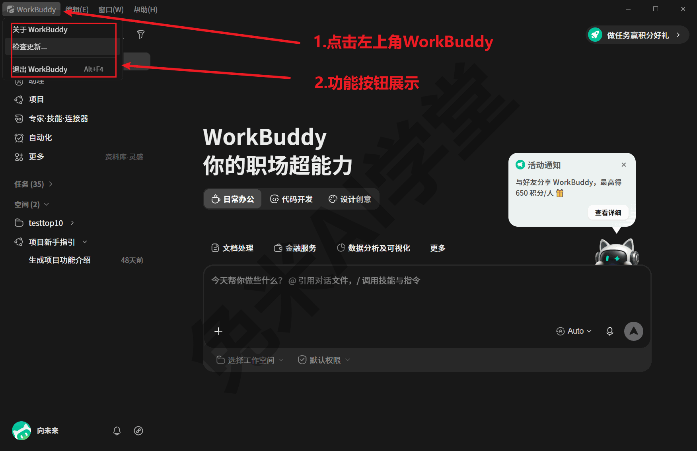

**常见误会与兜底。** 最典型的误会是“我明明关了它，怎么还在运行”。现在你知道，那只是缩进了托盘，想真退出就走上面的菜单。反过来也不要弄混：如果你希望它继续在后台把任务跑完，就只点“×”关窗口，别点“退出 WorkBuddy”。至于要不要一直让它驻留：不碍事就留着；长期不用或想节省电脑资源，就彻底退出，下次从开始菜单再启动即可。

---

### 2.2 新建一个对话

先统一一个叫法：WorkBuddy 里的一次对话叫一个“**任务**”。左侧边栏那份历史列表就叫“任务”，《认识 WorkBuddy》的词表里也出现过它。叫“任务”而不叫“聊天”，是因为它不只陪你说话：每个任务都可能实际执行操作、产出文件，程序还会自动为每个任务准备一个独立的工作文件夹来存放产物。这个机制现在不用管，《数据、工作目录与记忆》会细讲；先记住“一次对话 = 一个任务”即可。

为什么值得为一件事专门开一个新任务？实战里的经验是：几件不相干的事挤在同一条对话里连着聊，前后内容容易互相干扰；一件事一个任务，既互不影响，回头在左侧“任务”列表里也一眼能找到。《实战二：说明书批量投喂出设备档案表》里那条批量工作流，就固定“每批开一个新对话”。旧任务不会因为你开了新任务而消失，点开就能接着聊。

**开出你的第一个对话。** 点左侧边栏最上方的“**新建任务**”，中央区域会切换成一个干净的对话页，底部就是等你打字的输入框。发出第一条消息后，这个新任务也会进入左侧“任务”列表，之后随时可以回来续聊（以实际界面为准）。

动手之前，花几分钟把输入框的构成逐项认一遍，本篇后面的所有操作都围着它转：

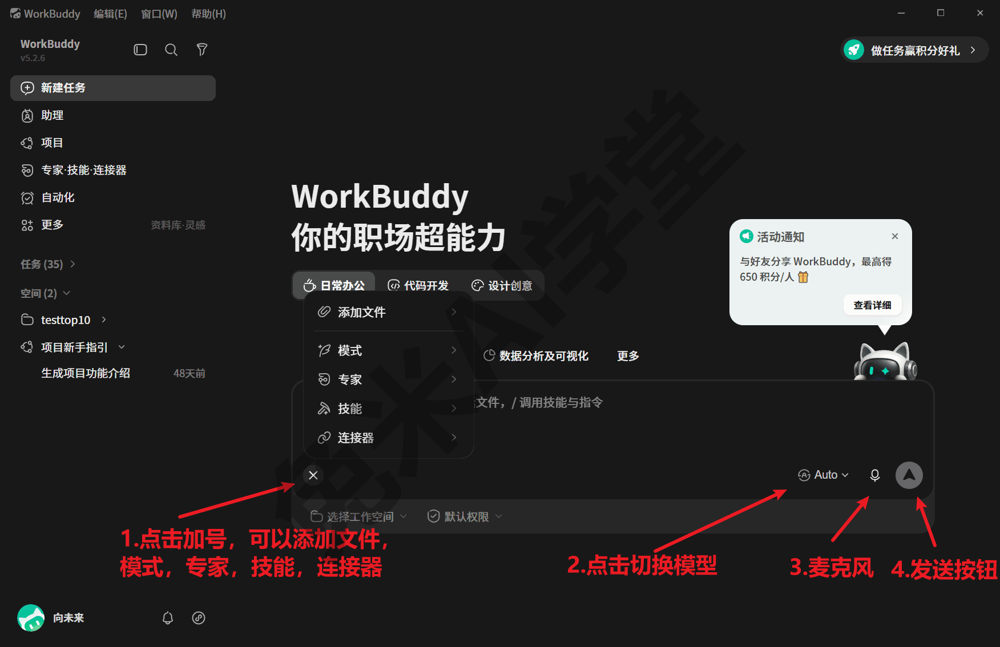

- **中间空白区**：打字的地方，长内容整段粘贴进来也可以；2.4 发第一条消息、2.5 交材料，都从这里开始。
- **输入框里的技能徽标（你的界面上多半没有）**：调用了安装好的“技能”时，输入框里会挂一个小徽标，表示这条消息将交给技能按固定流程处理——技能是教会它处理某类专业任务的“说明书 + 工具包”，《认识 WorkBuddy》提过一句。本篇的操作用不到它，你的界面上没有它完全正常；怎么安装、怎么调用是《技能：安装、管理与调用》的内容，《实战二：说明书批量投喂出设备档案表》里有真实用例。
- **左下“+”号**：给对话添加文件、图片的入口，点开会弹出一个五项的菜单，2.5 节专门讲它。
- **右下模型选择**：默认显示 Auto，点开是一份可上下滚动的模型清单，由哪个模型替你执行任务就在这里定，2.3 节讲怎么挑。
- **右下麦克风**：语音输入的入口，图标样式与可用状态以实际界面为准。本篇全程用打字演示，不展开它。
- **右下圆形发送按钮**：消息打好点它发出；键入内容后按钮会点亮，表示可以发送了。任务运行期间这个按钮会变成停止键，点一下可以中止（以实际界面为准）。
- **下沿“选择工作空间”**：与它执行这个任务时使用的文件夹有关，《数据、工作目录与记忆》讲空间与工作目录时会展开。本篇保持默认。
- **下沿“默认权限”**：管的是它替你执行操作时的权限范围——默认状态下，所有操作都在安全沙箱的约束内进行，超出范围会先请求你的许可。机制与选项详见《任务边界与数据安全》，本篇保持默认即可。

**顺带看一眼首页的场景分类。** 回到 2.1.2 认过的中央区域：欢迎语下方是三个一级页签——日常办公、代码开发、设计创意，页签下面还有一行随选中页签变化的子分类（“日常办公”下是文档处理、金融服务、数据分析及可视化、个人工作台等 8 项），每个子分类里是现成的任务起点。试着点一下“设计创意”：主标题会换成“你的设计超能力”，子分类行也换成网站设计、PPT 设计、视觉海报等一排入口；子分类行可以横向滚动，点行尾的“更多”还能展开这一类的全部子分类。

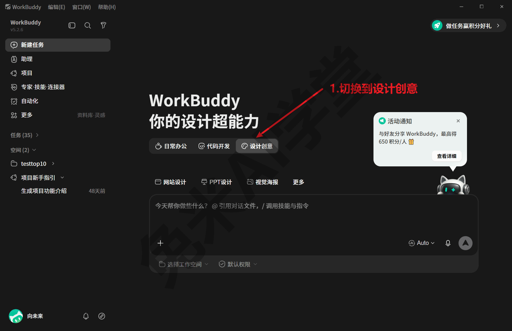

现在不必逐个研究：这些入口是把“别人常拿它做什么”摆给你看，供日后找灵感用；本篇接下来自己从零发一条消息，比套模板更能弄懂它。逛不逛都不影响后面的操作。

输入框和首页都认完了，先别急着发消息，下一节先把“由哪个模型来答”交代清楚，再正式开口。

---

### 2.3 选择模型

**模型是什么、为什么要认识它。** 模型就是替你执行任务的那个“AI 大脑”。WorkBuddy 内置了十来个模型，不同模型的能力侧重和费用不同：有的擅长复杂推理，有的能看图，有的便宜、适合跑量。新手可以完全不研究：**保持默认的 Auto（自动分配），系统会替你安排**，本篇全部操作用 Auto 就能完成。想自己挑，或想看懂清单上那串小数字，往下读。

**怎么打开模型清单。**

1. 点输入框右下角的“**Auto ⌄**”，弹出一份可上下滚动的模型清单，当前生效的模型带勾选标记（默认勾在 Auto 上）。

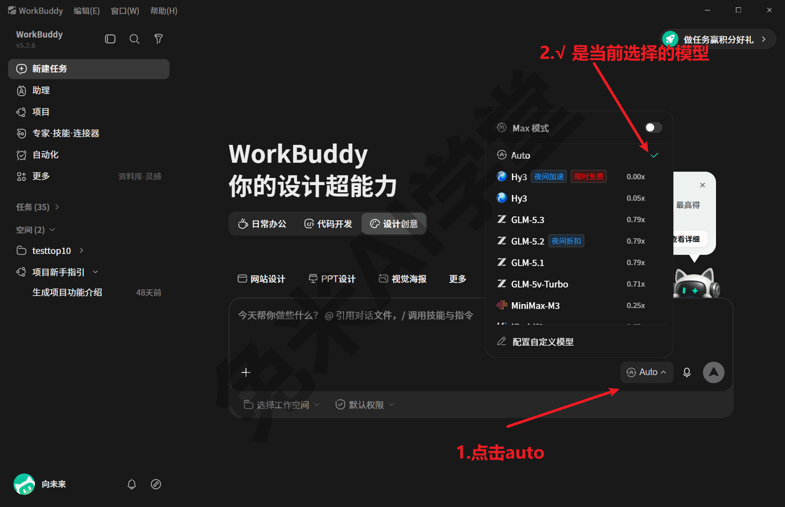

2. 清单底部固定着“配置自定义模型”入口（下图）；继续向下滚动，能看到“自定义模型”分组。

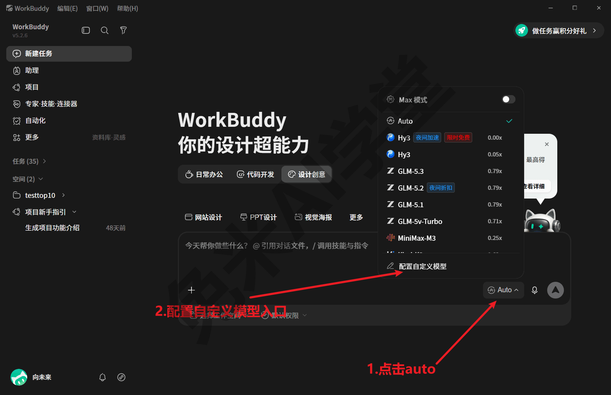

3. 点中意的模型名，选中即生效，之后这条对话就由它来回答；随时可以再点开换别的。

**看懂这份清单：内置的，和自己接的。** 清单分上下两段：

- **内置模型**（上半段）：产品自带、开箱即用。以 2026-08-13 实拍为例，有 Hy3（腾讯混元）、GLM 系列、MiniMax、Kimi 系列、Deepseek 系列等十来个；名单会随版本更新，以实际界面为准。日常任务选内置的就够用。
- **自定义模型**（下半段）：使用者自行接入的外部模型，演示环境接入了 qwen 系列等 5 个。接入需要做一点配置，方法与适用场景《模型与费用》详讲；现阶段知道“下面这几个是自己接的、上面是自带的”即可。

**模型名右侧的数字，是积分计费倍率。** 内置模型按“积分倍率”计费：0.79x、1.62x 这类数字表示扣积分的倍数，**数字越大越费积分**。倍率还会随平台活动浮动——实拍当天（2026-08-13），GLM-5.2 挂着“夜间折扣 0.79x”，Hy3 挂着“夜间加速·限时免费 0.00x”，具体数值以你看到的实际界面为准。各模型怎么选、积分怎么省，《模型与费用》有专节，现在记住“数字越大越贵”就行。积分不够用时是升级会员套餐还是等活动赠送，《模型与费用》里有专节讲清，这里先不展开。

**清单顶部的 Max 模式开关：新手保持关闭。** 它的作用是让模型一次处理更长的内容，代价是积分消耗明显增加（官方提示原话即“该模式会消耗更多 Credit”）。本篇所有操作都用不到它；什么时候值得打开、打开后有什么变化，《模型与费用》详讲。

**预警一个坑：名字一字之差的两个 qwen。** 演示环境的自定义模型里，同时挂着 `qwen3-vl-plus` 和 `qwen3.7-plus`——名字只差一处，却是两个能力不同的模型，处理专业任务时选错会直接影响结果质量。现在只需要养成一个习惯：**选模型时把名字逐字看清**。这两个模型差在哪、实战里怎么选，《模型与费用》专门讲。

这一节记两句就够：不想研究，Auto 一路用到底；日后想省积分、想处理专业任务，再回来学挑模型；入口永远是输入框右下角那个“Auto ⌄”。

---

### 2.4 发出第一条消息

万事俱备，正式开口。第一条消息不必隆重，让它改写一段话最合适：既像日常用法，又几秒钟就能看到结果。

**第 1 步：把消息打进输入框。** 点一下输入框，像平时发消息那样打一句话，也可以直接复制下面这条演示消息：

```
帮我把下面这段话改成正式的通知口吻：下周三下午办公室要断电检修，大家提前存文件。
```

打完先别发，看一眼输入框：文字落在中间空白区，右下角的发送按钮已经可以点了（以实际界面为准）。顺带说明：输入框不怕长内容，几千字的材料整段粘贴进去也可以。《实战二：说明书批量投喂出设备档案表》里的批量工作流，就是把大段指令整段贴进输入框发送的。

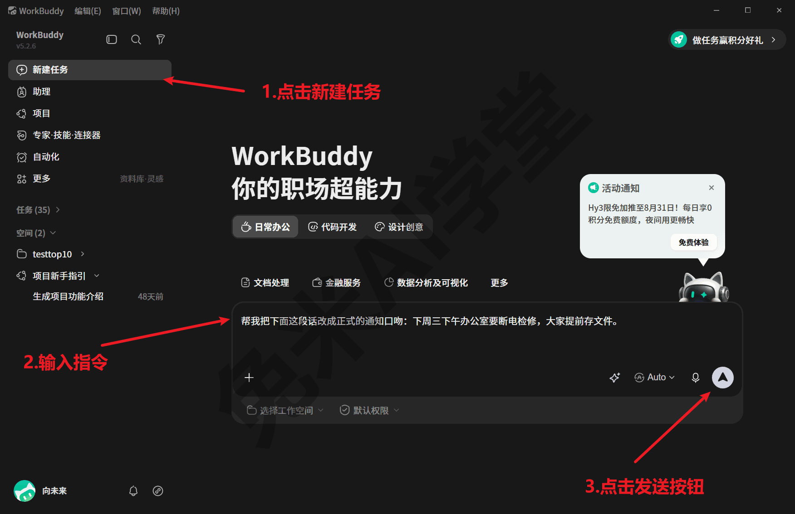

**第 2 步：点发送。** 点右下角的圆形**发送按钮**。你的消息以气泡形式上屏，AI 随即开始生成回复：文字是一段段“流”出来的，不是一次性全部出现，这是正常的生成过程。生成结束后，回复上方会显示“已完成 xx 秒”。如果等了一阵还在生成，先别关窗口，复杂任务本来就要多跑一会儿（多久算正常、怎么判断没卡住，见文末“新手常见问题”）。

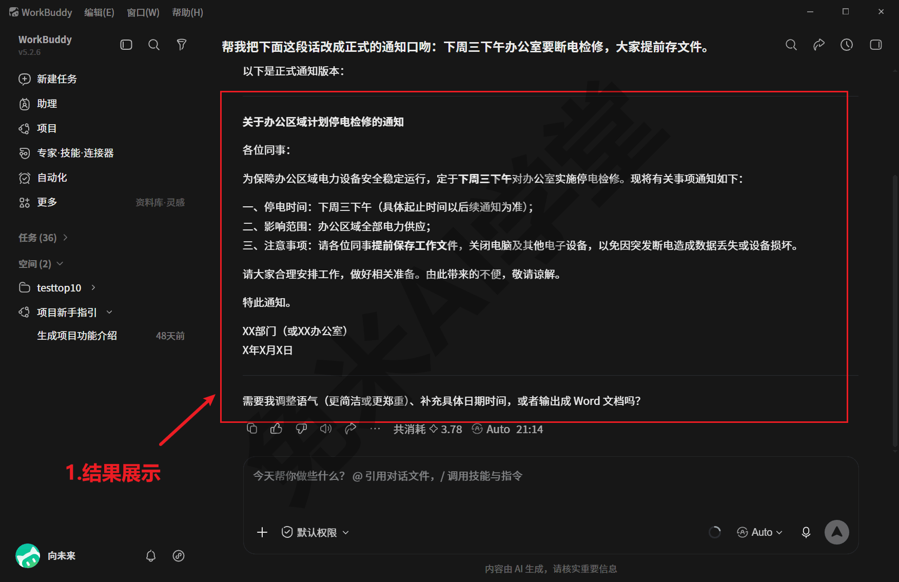

**第 3 步：认识完成后的回复卡片。** 下图是一个真实任务的完成态。它比刚才的演示消息复杂（让它处理一个装满设备说明书的文件夹并产出表格，还调用了技能），但卡片结构与你的第一条消息完全相同，照着认一遍，后面保存成果全靠它：

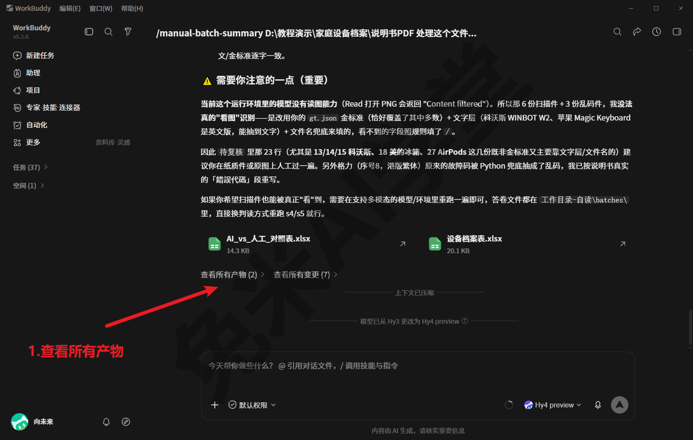

- 任务生成了文件时，回复卡片下方会列出**产物文件**，旁边有“**查看所有产物**”入口，点开能看到这个任务产出的全部文件；怎么把它们保存到自己手里，2.6 节讲。
- 回复底部一排小图标里，最常用的是**复制**：一点，整段回复就进了剪贴板。像“改写通知”这类纯文字任务不产文件，成果就靠复制拿走。

现在不需要看懂图里这个任务做了什么，只需要认准卡片上的三样东西：产物文件、“查看所有产物”、复制图标——本篇结束时，你自己的对话也会是这个样子：有问有答、有成果可拿。

**第 4 步：接着聊。** 想追问、想改要求，直接在底部输入框继续打字发送——AI 记得这条任务里聊过的内容。比如接一句“语气再客气一点”，它会在刚才那版通知的基础上继续改，不需要你把原文再贴一遍。这也是 2.2 节说“一件事一个任务”的底气所在：同一个任务里聊过什么它都记得，任务与任务之间互不干扰。要注意，追问适合同一件事的延续；要换一件新事，就开一个新任务。

最后一个提问的小心得：**把要求一次说具体**。对比一下就明白：只说“帮我写个通知”，它多半要反过来问你通知内容是什么；而上面那条演示消息把“改成什么口吻”和“原文是什么”一次说全，一轮就能出可用的结果。要求越明确，返工越少；结果不满意也不要紧，在追问里补充要求就是了。

---

### 2.5 给对话添加文件或图片

很多任务需要把材料交给 AI：让它读一份文档、认一张图、汇总几张表。WorkBuddy 里“交材料”跟发消息一样简单，两种方法任选；本节配图分别以文档和文件夹为例，图片等其他类型的文件操作完全相同。材料交完怎么检查、扫描件怎么处理，2.5.3 的三个实战要点值得照做。

#### 2.5.1 方法一：点“+”号菜单

**第 1 步：打开“+”菜单。** 点输入框左下角的“**+**”，会弹出一个五项的菜单，第一项“**添加文件**”就是本节要用的；下面的“模式”“专家”“技能”“连接器”属于进阶入口，本篇不用管——技能、连接器各有专篇（《技能：安装、管理与调用》《连接器：把办公系统接进来》），专家在《助理、专家、项目与灵感》里介绍。

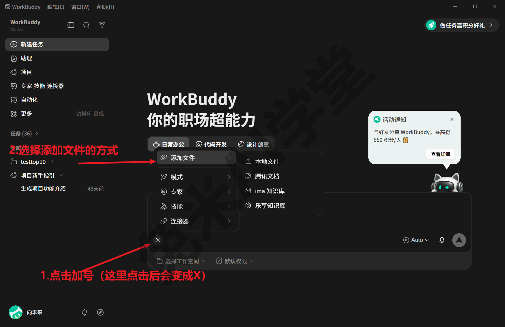

**第 2 步：选中文件。** 点“**添加文件**”，在展开的子菜单里选“**本地文件**”，再在弹出的文件选择框里找到要交给 AI 的文件（文档、图片、表格都可以），选中后确认。

**第 3 步：确认材料挂上了。** 回到对话页，**输入框上方会出现附件条目或缩略图**，看到它就说明材料已经挂上。接下来正常打字说明你的要求，一起发送，AI 会连同附件一并处理。

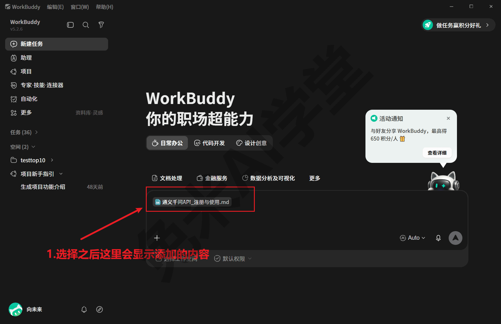

这个方法适合文件位置较深、或者你习惯在选择框里精确找文件的场景。

#### 2.5.2 方法二：直接拖进来

拖拽只有一个动作：打开资源管理器（存着目标文件的文件夹窗口），让它和 WorkBuddy 窗口同时露出来；按住鼠标左键拖起文件，移到 WorkBuddy 的对话区域上方，界面会出现高亮或释放提示（以实际界面为准），松手即可。与方法一相同，输入框上方出现附件缩略图就算成功；一次拖一个文件、或一次拖一批都可以。

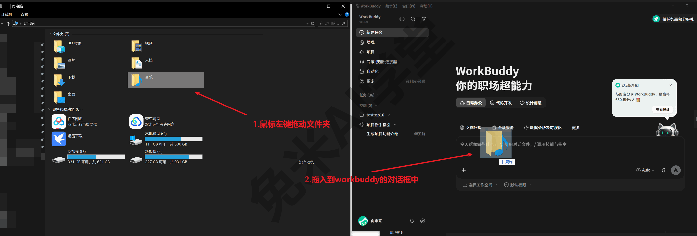

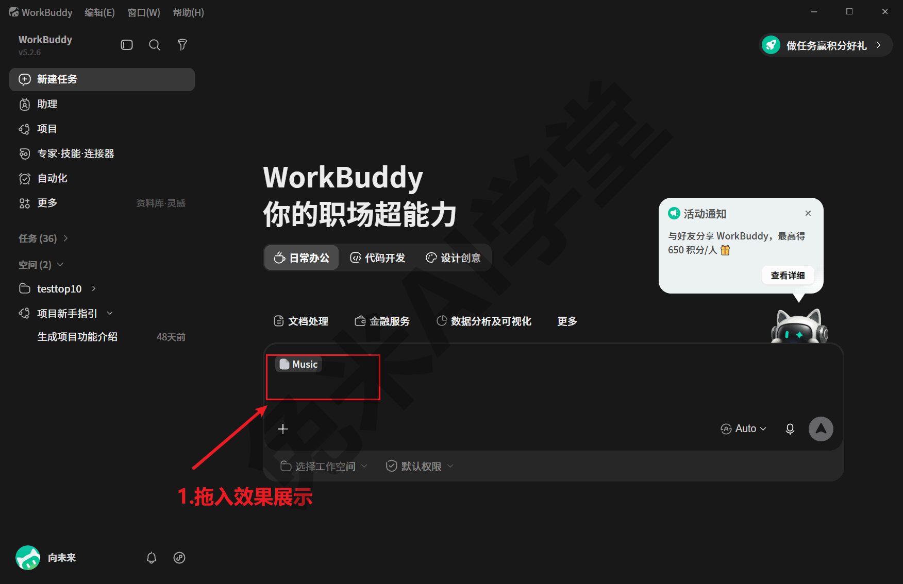

两种方法效果一样，选顺手的用：桌面上现成的文件，拖拽最快；藏得深的文件，走“+”菜单更稳。

#### 2.5.3 拖图的三个实战要点

以下经验来自一个真实跑通的说明书批量处理工作流（完整案例见《实战二：说明书批量投喂出设备档案表》），凡是要把图片交给 AI 的场合都适用：

- **多张图可以一次全拖进去，先后顺序无所谓。** 前提是提示词里写清对应关系（“附件图 1 对应第几份材料”这类标注），AI 按标注对号入座，不靠拖入顺序判断。稳妥起见可以按清单顺序拖，但不必因为“顺序拖乱了”推倒重来。
- **发送前，数一遍输入框上方的缩略图。** 附件数量与要交的材料数量对上了再点发送——这个动作在那条工作流里是写进操作清单的固定步骤。缺了哪张就补拖哪张；发出去才发现少图，就得追问补发，多费一轮功夫。
- **扫描件 PDF 不要直接拖原文件，先把要看的页转成 PNG 图片再拖。** 整页是图片、选不中文字的 PDF（老设备说明书、盖章件的扫描版很常见），AI 读不到它的文字内容；实战做法是转成图片，让模型直接“看图识别”。更隐蔽的坑是：有的 PDF 看着是电子版，文字层（PDF 里可以选中复制的那层文字）其实已经损坏，同样要走“转图片”这条路——这类坑的完整处理办法见《实战二：说明书批量投喂出设备档案表》。

这三条都来自实战里真实踩过的坑。现在不必背下来，等你第一次要批量传图时，回来把这一小节再读一遍就够了。

---

### 2.6 保存 AI 的输出

AI 答得再好，成果落到自己手里才算数。按输出形态分三种情形，各有各的存法；最后一种“事后找回”是兜底手段——当时忘了保存也不怕。

#### 2.6.1 保存一段文字回复

适用情形：回复就是一段文字（改写的通知、拟的邮件、答的问题），没有产物文件。

**第 1 步：复制。** 点该条回复底部的**复制** 图标，整段回复随即进入剪贴板，不用自己拖选文字。

**第 2 步：粘贴进记事本。** 打开记事本（点开始菜单、输入“记事本”即可搜到），把内容粘贴进去，文字会原样落进窗口。

**第 3 步：另存为。** 点“文件 → 另存为”，选好保存位置、起一个日后看得懂的文件名，保存。你选的文件夹里出现这个 txt 文件，这段成果就归档完成了。

> 这是实战里验证过的做法：此前批量整理说明书时，就是把 AI 的整段回答复制出来、另存成 txt“答题卡”归档的（那条工作流见《实战二：说明书批量投喂出设备档案表》）。

当然，如果这段文字是要马上贴进邮件、聊天窗口或 Word 里用的，复制之后直接去目标位置粘贴即可，不必绕道记事本——“复制 → 记事本 → 另存”这条路的价值在于**留档**：文件在自己手里，日后不依赖聊天记录也能找到。

#### 2.6.2 保存任务生成的文件

适用情形：回复卡片下方列出了**产物文件**（2.4 节第 3 步认过它）。

操作分两步：先点卡片下方的**产物文件名**（比如一个 .xlsx 表格文件），一般会直接打开这个文件；产物不止一个时，点“**查看所有产物**”看完整清单，从清单里挑着打开（具体打开方式以实际界面为准）；文件打开后，用对应程序的“另存为”把它保存到自己的文件夹里。存过之后，这份成果就完全归你管，改名、转发、继续编辑都随意。

多说一句：产物文件本身存在这个任务的工作文件夹里（它在哪、怎么直接翻它，《数据、工作目录与记忆》讲），所以当场没另存也不会立刻丢；但**把要紧的成果及时另存到自己熟悉的文件夹**，永远是最稳的习惯。

#### 2.6.3 事后找回历史产物

哪天想找回之前某次任务生成的文件，不用翻聊天记录，有专门的入口：

1. 点左侧边栏的“**更多**”，在弹出的菜单里点“**我的文件**”，进入文件汇总页。
2. 页面上有“**任务成果**”与“**云端网盘**”两个标签。“任务成果”里，历史任务的产物**按任务分组** 列出，每个文件带类型、更新人、更新时间、大小，按时间和任务名就能找到。
3. 找到目标文件，直接打开或另存到自己的文件夹（以实际界面为准）。

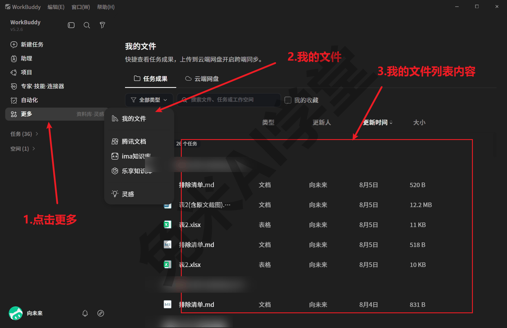

4. 需要在别的设备上也拿到文件，可以看看旁边的“云端网盘”标签：把文件传上云端，再从其他设备取用（具体功能以实际界面为准，《数据、工作目录与记忆》会展开）。

一句话总结：**文字靠复制、文件靠另存、忘了存去“我的文件”**——记住这三条，成果就丢不了。

---

### 2.7 练习任务

学完六步，动手过一遍才算真会。下面三个练习任务由浅入深，各自对应本篇的一段内容；**提示词里方括号的内容，换成你自己的**。

**任务一：发出你自己的第一条消息**

模仿 2.4 节的演示，把一段随手写的话改成正式通知。发送：

```
帮我把下面这段话改成正式的通知口吻：[你随手写的一段话，比如一件要提醒大家的事]
```

完成标准：收到一版口吻正式的通知；能用回复底部的复制图标把它粘贴到记事本里；再追问一句“换个更简短的版本”，AI 能在原稿基础上继续改，而不用你重发原文。

**任务二：拖一张图问它**

从电脑里挑一张图片（手机拍的照片、屏幕截图都行），按 2.5.2 的方法拖进对话，然后发送：

```
这张图里有什么？用三五句话描述；如果图里有文字，把文字原样抄出来。
```

完成标准：发送前，输入框上方出现了这张图的缩略图（用上 2.5.3“数一遍”的习惯）；收到的描述与图片内容相符。

**任务三：生成一个文件，再从“我的文件”里找回它**

先让 AI 产出一个文件。发送：

```
把下面三件事整理成一份待办清单，生成 txt 文件交给我：[第一件事]、[第二件事]、[第三件事]
```

等回复卡片下方出现产物文件后，这次故意不当场保存，改走 2.6.3 的路径：点“更多 → 我的文件”，在“任务成果”标签页里找到这个 txt，另存到自己的文件夹。

完成标准：在“我的文件”里找到了这个刚生成的文件并成功另存；如果回复只给了文字、没给文件，就追问一句“请生成 txt 文件交付”再试一次。

---

### 2.8 本篇小结与自检

这一篇从启动程序走到保存成果，你已经完整跑通一次“开任务—发消息—交材料—收成果”的流程。对照清单自查：

- [ ] 能从开始菜单启动 WorkBuddy；知道点“×”只是缩进托盘，彻底退出要走左上角“WorkBuddy”菜单
- [ ] 会点“新建任务”开新对话；认得输入框的“+”号、模型选择、发送按钮，知道下沿两个选项保持默认
- [ ] 会打开模型清单挑模型；记得新手用 Auto、Max 模式保持关闭、选模型时把名字逐字看清
- [ ] 已发出第一条消息并收到回复；认得回复卡片上的产物文件、“查看所有产物”入口和复制图标
- [ ] 会用“+”菜单和拖拽两种方式给对话交材料；发送前会数一遍附件缩略图
- [ ] 会把文字回复另存成 txt、把产物文件另存进自己的文件夹；也会去“更多 → 我的文件”找回历史产物
- [ ] 三个练习任务至少完成两个

完成这些内容后，你已经能独立让 WorkBuddy 完成一件小事并把成果拿到手。下一篇《数据、工作目录与记忆》先解决“文件放在哪、明天还能不能接着干”；再往后，《模型与费用》讲模型怎么挑、积分怎么省，《技能：安装、管理与调用》《连接器：把办公系统接进来》教它学会更多本事；想直接看一条真实业务从头到尾怎么跑通，也可以先读《实战二：说明书批量投喂出设备档案表》。

---

### 2.9 新手常见问题

**Q1：我点了“×”，为什么它好像还在运行？**

点“×”只是关掉窗口，程序默认缩进任务栏右下角的托盘继续驻留（见 2.1.3）。没跑完的任务一般会继续执行，这正是驻留设计的好处。想彻底退出，走左上角“WorkBuddy”菜单里的“退出 WorkBuddy”；也可以在任务栏右下角托盘区找到它的图标退出（入口以实际界面为准）。

**Q2：拖了好几个文件，输入框上方的缩略图好像没显示全？**

先等一两秒——文件多时缩略图可能逐个加载。然后按 2.5.3 的习惯逐个数：缩略图数量与拖入的文件数对不上，就把缺的那份重新拖一次，或改用“+ → 添加文件”补上，数齐再发送。另外，发送之后消息气泡里的附件可能被折叠、只露出前面几项，那只是显示上的收起，不代表文件丢了（以实际界面为准）。

**Q3：回复半天出不完，是不是卡住了？**

多半没有。回复是一段段流式生成的，任务越复杂、材料越多，跑得越久。判断方法：文字还在继续出现、或界面的生成状态还在变化，就说明它仍在正常生成；结束时会出现“已完成 xx 秒”。等得实在久，可以在它完成后追问补充要求，或新建任务、把要求说得更具体再发一次。

**Q4：输入框下面的“选择工作空间”“默认权限”要不要设置？**

新手一律保持默认，不影响本篇全部操作。“选择工作空间”与它执行任务所用的文件夹有关，《数据、工作目录与记忆》讲空间与工作目录时会展开；“默认权限”管的是它替你执行操作时的权限范围——默认状态下所有操作都在安全沙箱的约束内进行，超出范围会先请求你的许可，机制与选项详见《任务边界与数据安全》。

**Q5：之前聊过的对话去哪里找？**

左侧边栏中段的“任务”列表就是全部历史对话，按时间排列，点任意一条可以回看、接着追问。要找的若不是对话而是当时生成的文件，直接走 2.6.3 的“更多 → 我的文件”更快。
