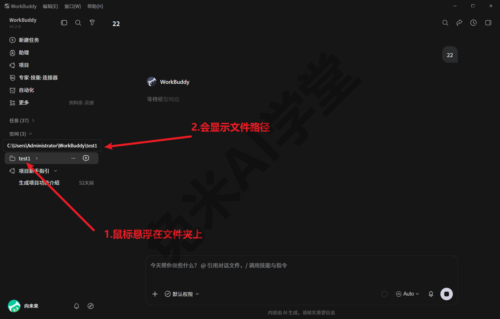
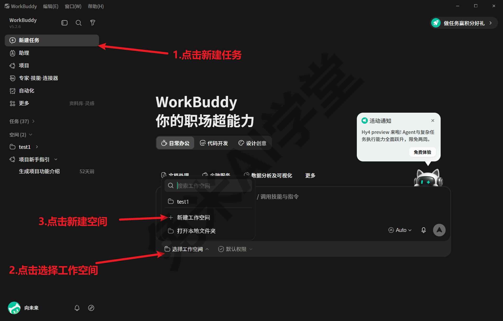
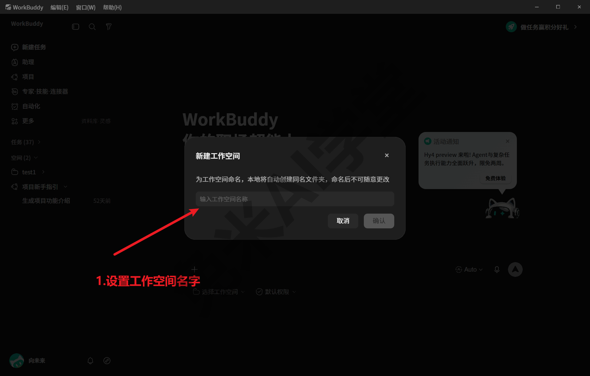
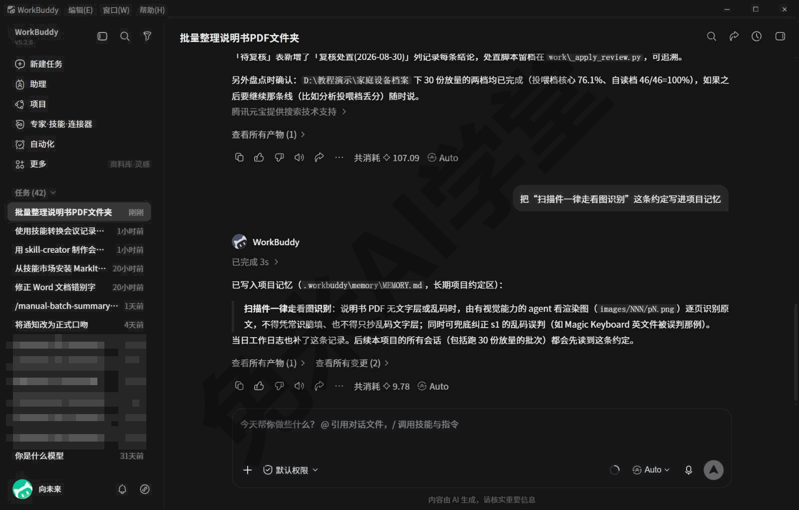
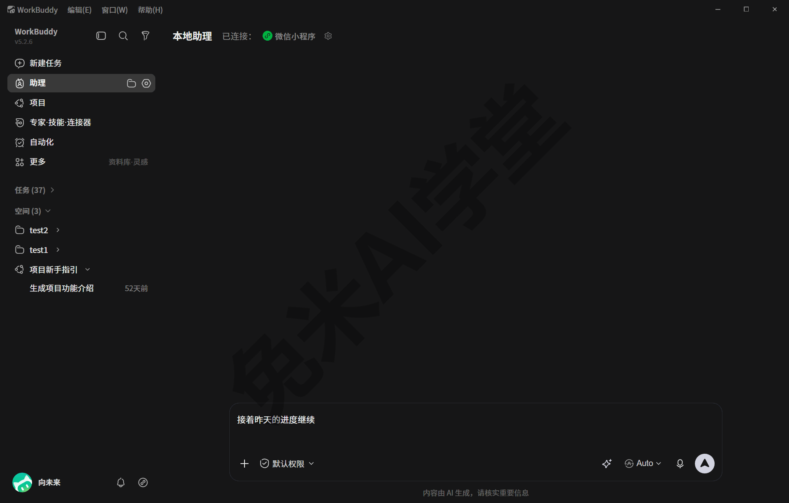
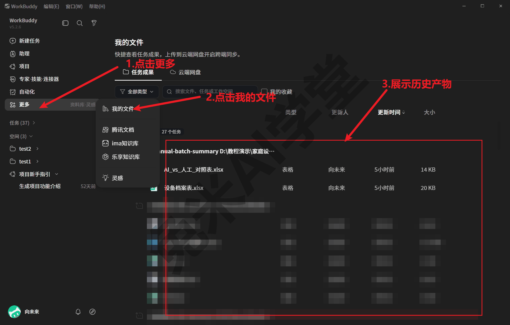
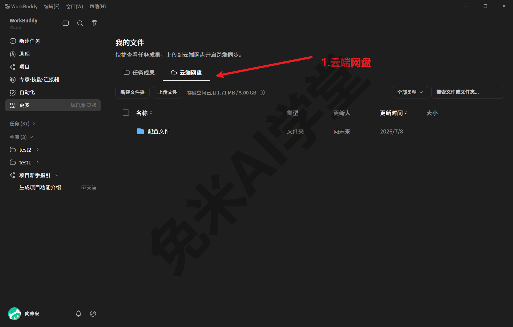

# 数据、工作目录与记忆

学会《快速上手》之后，你已经能让 WorkBuddy 完成任务并保存成果。这一篇往下挖一层，回答四个越用越绕不开的问题：它的文件和数据到底放在哪里；今天做到一半的项目，明天打开还能不能接着做；生成过的产物事后去哪里找；它替你做过的事，出了问题能不能查。读完这一篇，你会对“数据在我自己手里”这件事心里有数。本篇涉及的界面均以 2026-08-13 实拍的 WorkBuddy 5.2.6 为准，你看到的画面可能略有差异，以实际界面为准。

---

### 3.1 数据分两层存放

先回答最基础的问题：WorkBuddy 的东西都存在哪里？答案只有一句话，但值得记牢：**数据分两层存放，一层跟着电脑走，一层跟着项目文件夹走。** 很多关于“换电脑怎么办”“项目挪走了记忆还在吗”的疑问，都能从这句话推出答案。

| 层 | 位置 | 保存什么 | 跟着谁走 |
|---|---|---|---|
| **全局层**（程序的“家”） | `C:\Users\<你的用户名>\.workbuddy` | 助手身份、模型接入配置、你安装的技能、每次会话的对话记录与运行留痕，还有自带的运行环境 | 跟着这台电脑走，一台机器一份 |
| **项目层**（项目的“记事本”） | `<你的项目文件夹>\.workbuddy\memory\` | 这个项目的长期记忆与按日工作日志 | 跟着项目文件夹走，文件夹拷到哪里，记忆就带到哪里 |

本书演示环境为 Windows，正文路径均按 Windows 写法。macOS 版的目录约定相同：全局层对应 `~/.workbuddy/`（`~` 代表你的用户主目录，具体形态需实机验证），项目层同样是项目文件夹里的 `.workbuddy/memory/`；后文关键动手处会顺带给出 macOS 写法，其余路径按这条对应关系换算即可，一切以实际环境为准。

**全局层里有什么。** 用资源管理器打开 `C:\Users\<你的用户名>\.workbuddy`（macOS：访达“前往文件夹”输入 `~/.workbuddy`），会看到一批文件和子文件夹。不必逐个研究，先认识几个后文会反复出现的成员（节选，非完整清单）：

```
C:\Users\<你的用户名>\.workbuddy\
├── SOUL.md、IDENTITY.md、USER.md、BOOTSTRAP.md   助手的身份文件（见 3.4）
├── models.json                                   模型接入配置（含密钥，敏感文件）
├── skills\                                       你安装的技能，一个技能一个文件夹
├── projects\                                     每个工作目录的对话转录档案
├── file-history\                                 文件改动的历史备份
├── audit-log\                                    按日的审计日志
├── binaries\                                     自带的 Node、Python 运行环境
└── connectors\                                   连接器授权凭据（敏感文件）
```

这一层可以理解为程序的“家当”：你花时间配好的模型、装好的技能、聊过的所有会话记录都在这里。它不跟任何项目绑定，换一台电脑就得重新置办（技能文件夹可以拷走，密钥要重配，见《技能：安装、管理与调用》与《模型与费用》）。

**项目层里有什么。** 项目层要小得多：WorkBuddy 在它工作过的项目文件夹里生成一个 `.workbuddy\memory\` 目录，里面只有两类纯文本文件，即项目长期记忆 `MEMORY.md` 和按日工作日志 `<日期>.md`，3.3 会专门展开。它记录的不是“程序的家当”，而是“这个项目的知识”：用什么方法做、做到哪一步了、踩过什么坑。

**为什么要分两层。** 因为这两类东西的生命周期不同。模型配置、技能这类“基础设施”，无论你做哪个项目都要用，所以放在全局层，一台电脑配一次；而“这个项目怎么做”的知识只对这个项目有意义，所以直接放进项目文件夹，项目搬到哪里知识跟到哪里。分层带来一个很实用的推论：

- 换电脑时，要紧的是**全局层**——技能、模型配置、历史会话都在里面；
- 挪动或分享项目时，要紧的是**项目层**——文件夹整个拷走，项目记忆一并带走，不需要动全局层任何东西。

最后提前打一个招呼：全局层里的 `models.json`（含模型密钥）和 `connectors\`（连接器授权凭据）属于敏感文件，不要截图、拷贝或外发，3.6 会给出完整的注意事项。

### 3.2 工作目录与空间

认识了两层数据，下一个问题是：WorkBuddy 执行任务时，产物到底落在哪个文件夹？这就要引出**工作目录** 的概念：每次对话都有一个工作目录，产物、中间文件都落在里面。它按两种情况确定：

- **你在指令里写明了文件夹**，它就在你指定的文件夹里工作。比如行文中这样交代：“在 D:\我的项目\设备说明书 文件夹里帮我整理这批 PDF，产物也存在这个文件夹里”。《实战二：说明书批量投喂出设备档案表》里的案例全程都这样做；
- **你什么都没说、直接开始对话**，它会自动新建一个以日期时间命名的临时目录，位置形如 `C:\Users\<你的用户名>\WorkBuddy\2026-08-05-08-52-09\`。本教程的演示环境在 2026 年 7 月到 8 月间，就这样积累了几十个临时工作目录。

两种方式没有对错，但适用场景不同。随手问一句、做一件一次性的小事，让它自动开临时目录最省事；正经项目则强烈建议先建一个自己的文件夹并在指令里写明，理由有三：

- 产物、中间文件、项目记忆归拢在一处，不会散落在几十个时间戳目录里；
- 项目记忆（3.3）写在工作目录下，指定了固定文件夹，记忆才能始终跟着项目走；
- 事后找东西、拷给别人、备份归档，都只需要处理这一个文件夹。

**“空间”把文件夹变成固定入口。** 每次都在指令里敲一遍路径毕竟麻烦，侧栏的“空间”功能解决这件事：把一个本地文件夹绑定成空间之后，它成为侧栏里的固定入口，点开，对话就直接在这个文件夹里展开工作。演示环境绑定了 3 个空间，侧栏“空间”区块展开后逐条列出；把鼠标悬停在空间条目上，会浮出它绑定的本地目录完整路径，一眼可以核对这个空间对应磁盘上的哪个文件夹：



空间还有一个实用的组织方式：在这个空间里发生过的历史任务会挂在空间条目下面，找“上次在这个项目里聊的那个任务”时，顺着空间点进去比翻整个任务历史列表快得多。

把文件夹绑定成空间的具体入口：在新建任务页点开输入框下沿的“选择工作空间”，浮层会列出已有空间供选择，底部给出两条路——“打开本地文件夹”把磁盘上已有的文件夹绑定成空间；“+新建工作空间”则先起名，程序随即在本地自动创建一个同名文件夹（命名弹窗明确提示创建后不易改名，起名前想好）：





绑定已有文件夹不搬动你的文件，解绑也只是移除入口，文件夹和里面的记忆都留在原地（以实际表现为准）。

**常见坑：产物“失踪”。** 十有八九是忘了指定工作目录，产物落进了自动创建的临时目录。去 `C:\Users\<你的用户名>\WorkBuddy\` 下按时间找那次会话的时间戳目录即可；更省心的找回入口还有三个，见 3.5。

### 3.3 项目记忆：MEMORY.md 与按日日志

这一节回答本篇开头的第二个问题：今天做到一半的项目，明天打开还能不能接着做？答案藏在项目文件夹的 `.workbuddy\memory\` 目录里。以演示环境一个真实工作目录为例（2026-08-29，《实战二：说明书批量投喂出设备档案表》那条工作流当天的一批批量投喂任务），它的 memory 目录里是一份纯文本日志：

```
<工作目录>\.workbuddy\memory\
└── 2026-08-29.md     按日工作日志：有实质工作的日期各一份
```

两类记忆文件里，这个目录只沉淀出了按日日志；另一类——项目长期记忆 `MEMORY.md`——要等助手判断“有值得长期记住的约定”才会出现，这份样本里就没有（为什么，下文机制段马上讲到）。两类文件分工明确：

| 维度 | `MEMORY.md`（长期记忆） | `<日期>.md`（按日日志） |
|---|---|---|
| 一份管多久 | 全项目一份，持续维护 | 一天一份，当天写完基本不再改 |
| 记什么 | 稳定的约定：项目用什么技能、什么运行环境、有哪些已知的坑 | 当天的流水：做了什么、产物在哪里、还剩什么没做 |
| 类比 | 项目首页的须知 | 交接班记录 |

**长期记忆记什么。**`MEMORY.md` 记两类内容：一类是“下次进这个项目必须知道的约定”——项目用什么技能、脚本在什么运行环境里跑、工作流分几步；另一类是“已知的坑”——比如某份材料是扫描件、必须走看图识别这类教训。全是结论，不记流水账。演示环境里就有一份真实样本：8 月 29 日深夜用一句话调用技能整理过 3 份说明书的那个工作目录，第二天回访时补了一句“把‘扫描件一律走看图识别’这条约定写进项目记忆”，`MEMORY.md` 随即出现，里面这条约定写得清清楚楚——说明书没有文字层或文字层乱码时，一律看渲染图逐页识别原文，不得凭常识臆填、也不得照抄乱码文字层。

**按日日志记什么，拿真实样本看。** 上面那份 `2026-08-29.md` 一共十来行：一行小标题点明这批做的是“家用设备说明书批量抽取”，往下逐条列出这一批处理的五份说明书——苹果手表、苹果耳机、苹果键盘和两台西门子洗碗机，每条带品牌、型号和归类；结尾专门留了一段“注意”，写明两台洗碗机的原文只有目录和章节标题，故障代码、保修电话、操作步骤这些正文内容都没包含，已按“找不到信息填 /”的纪律处理——下一个接手的人一眼就知道这两行为什么是空的。同一天另一个工作目录的日志则只有一行，概括完成了哪五份说明书的信息抽取、包含扫描件识别。两份日志一详一略，都是助手完成工作后自己写下的交接班记录。

**日志是怎么产生的？照实说：它是助手自己写的，不是系统定时生成的。** 机制上，WorkBuddy 给助手定了一条工作规则：完成一段实质性的工作后，先看看今天的日志文件在不在，不在就新建一份，在就往文件末尾追加一段简短记录；遇到值得长期记住的约定，写进 `MEMORY.md`；打招呼、简单查询、几句话的问答则跳过，不记。由此推出几个实际后果，直接决定你的预期：

- **不是“每个工作日自动一份”**。有实质工作的日期才可能有日志；同一个工作目录一天至多一份，当天多个任务在文内追加；
- **写不写，最终由助手在当次任务里自行判断，没有系统兜底**。演示环境 2026-08-29 重跑《实战二：说明书批量投喂出设备档案表》工作流那天，六个任务工作目录里只有两个留下了按日日志，另外四个同样跑完了整批的实质工作，却什么也没写。所以别把它当成万无一失的保险箱；
- **同一个项目连续做几天，各天各一份**。日志文件名就是日期，跨天再做就另起一份、旧的不动——那份 `MEMORY.md` 样本所在的工作目录隔日回访后，memory 目录里就并排放着 `2026-08-29.md` 和 `2026-08-30.md` 两份，头一天的一字未动；
- **`MEMORY.md` 比日志更稀少**。重跑那天的六个工作目录，一个也没有沉淀出长期记忆——它只在助手判断“有值得长期记住的约定”时才出现。

由此得出一条实用建议：**重要的约定和进展，主动让它记下来。** 收尾时补一句“把今天做的事记进项目工作日志”，或者“把‘扫描件一律走看图识别’这条约定写进项目记忆”，比指望它每次自觉要稳妥得多。

这句叮嘱落地的样子，下面是一张实拍——发出约定后，它回复已写入 `MEMORY.md` 并附上约定原文：



**第二天怎么接着做。** 在同一个项目文件夹（或对应空间）里新开对话，发送一句：

```
接着昨天的进度继续
```



它会先读 `MEMORY.md`，马上明白这个项目的约定，再翻按日日志接上断点。演示环境的一次隔日回访实录：头一天的日志记着 3 份说明书整理完、还挂着 3 行待复核，第二天说一句“接着昨天的进度继续”，它接手把 3 个待复核项全部处置完毕，当天的日志随后记下了处置结果和新沉淀的约定（具体交互形态以实际表现为准）。

**记忆随文件夹走。** 项目记忆就存放在项目文件夹自己的 `.workbuddy` 里，不在程序那边另存一份，所以文件夹挪到哪里、拷给谁，约定和已知的坑就跟到哪里，对方不需要从头摸索。

**记忆就是纯文本，可以直接改。** 用记事本打开 `.workbuddy\memory\` 里的文件就能编辑，改错了什么、想补充什么，直接写进去即可；也可以在对话里发送类似下面的指令，让它替你改（方括号里的内容换成你自己的）：

```
把项目记忆里的[要修改的条目]更新为[新的内容]
```

![让它替你改记忆——占位指令“把项目记忆里的[要修改的条目]更新为[新的内容]”已键入（红箭头；方括号换成你自己的）](img/03/ep3-3.png)

最后两个注意事项：按日日志的文件名就是日期，不要随手改名，改了名它就对不上“哪天干了什么”；`memory` 目录整个删掉不影响程序运行，但这个项目的记忆就真没了，删除前想清楚。

### 3.4 助手的身份文件

用 WorkBuddy 久了你可能会好奇：它回答问题时那股稳定的“性格”是哪来的？答案就在全局数据目录最外层的 4 个 Markdown 文件里。这一节简单看一眼背后的机制，不影响日常使用，但看懂之后你会知道助手的“人设”存在哪里、能不能改。

```
C:\Users\<你的用户名>\.workbuddy\
├── SOUL.md          “灵魂”：价值观、边界、行事风格的长期人设
├── IDENTITY.md      身份档案：名字、物种、气质、签名表情
├── USER.md          用户画像：怎么称呼你、你在哪座城市、关注什么
└── BOOTSTRAP.md     “出生引导书”：首次见面的开场指引
```

**这 4 个文件是什么。**`SOUL.md` 是分量最重的一份，写的是助手的价值观与行事风格，相当于它的长期人设；`IDENTITY.md` 是它自己的身份档案，字段包括名字、物种、气质、签名表情；`USER.md` 是它对你的了解，随着相处逐步补全；`BOOTSTRAP.md` 最有意思，是一份“出生引导书”，指导助手在第一次对话时与你共同确立名字、性格和用户信息，文件里明确写着完成引导后应当自行删除。演示环境的这份 `BOOTSTRAP.md` 至今还在，说明这台机器从没正经走完“初次见面”的流程，助手的身份档案也就一直是未填写的空白模板。

**它们什么时候生效。** 这 4 个文件在程序首次启动时自动写入全局目录，此后每次会话开始，都会作为身份背景一并交给模型。这不是推测：翻开任何一份会话转录，第一行就能看到这几份身份文件被带入的记录，`SOUL.md` 的内容赫然在列。也就是说，每轮对话它都自动带上这份人设，这就是它“性格”稳定的落地机制。

**两种用法。** 知道了机制，定制就有两条路：

- **对话里共同确立**：像 `BOOTSTRAP.md` 设计的那样，第一次使用时花几分钟和它互相认识，给它起名字、说明你希望它怎么称呼你、偏好什么风格，它会把结论写进这几份档案（演示环境未走过此流程，具体交互以实际表现为准）；
- **直接编辑文件**：4 个文件都是纯文本，用记事本打开 `C:\Users\<你的用户名>\.workbuddy\`（macOS 为 `~/.workbuddy/`）下的对应文件，照着文件里的字段提示填写或修改即可，改动通常在下次新会话生效（以实际表现为准）。

**边界与提醒。** 它们属于全局层，跟着电脑走：换一台电脑，助手的人设与它对你的了解都会回到初始状态；想保留人设，把这 4 个文件拷到新电脑的相同位置即可。它们与 3.3 的项目记忆是两套东西，一个管“助手是谁”，一个管“项目做到哪”，互不影响。动手编辑前建议先复制一份备份，写坏了随时可以退回去；这 4 个文件本身不含密钥，看和改都安全，但同目录下的 `models.json` 是敏感文件，编辑身份文件时别顺手动它。

### 3.5 找回产物的三个入口

“昨天让它生成的那份文件呢？”这是新手最常见的求助。这一节把找回产物的三个入口一次讲全，从今往后你丢不了东西。

**入口一：任务侧栏，点开接着聊。** 最直接的路径。左侧栏的任务历史按时间保留着你与它的每一次会话（演示环境积累了几十条，最早的已是一个多月前），往下滚动可以一路翻到最早的任务，列表底部有“收起”按钮；把鼠标悬停在某条任务上，还会露出针对这条任务的操作图标（具体操作项以实际界面为准）。点开当时那条任务，产物入口就在它当时回复的卡片里（《快速上手》介绍过回复卡片与产物入口的样子）。这个入口的好处是带着上下文：不但能拿到文件，还能顺着当时的对话继续追问、让它返工重做。适合“我记得是哪次聊的”这种情况；如果那次会话是在某个空间里发生的，顺着侧栏的空间条目往下找会更快（3.2 讲过空间下挂历史任务）。

**入口二：“我的文件”，按任务分组。** 不记得是哪次会话，只想按时间翻产物，走这个入口：侧栏“更多”菜单里点开“我的文件”，切到“任务成果”标签，历史任务的产物按任务分组列出，每个文件带类型、更新人、更新时间和大小，按图索骥即可。它背后的机制是一份“产物台账”：每次会话向你正式呈交文件时，全局层会按会话登记一份产物索引（文件名、类型、大小、来自哪个工具），“我的文件”展示的就是这份台账。由此也能推出它的边界：这里登记的是**呈交给你的交付物**，运行过程中的中间文件不一定在列，找中间文件要回工作目录翻（见本节兜底）。



这个入口的好处是全局视角：不管产物落在哪个工作目录，这里都有登记，等于给所有会话的交付物开了一张总台账。

**入口三：云端网盘，跨端同步。**“我的文件”页的第二个标签是“云端网盘”，作用是把文件同步到云端、在多台设备间流转，需登录相应账号后使用。登录后的内页是一个网盘式文件列表：有新建文件夹与上传文件的入口，能看到云端空间用量，列表里的文件同样带更新人与更新时间，跨设备取文件就靠它：



**兜底：直接翻本地文件夹。** 三个入口之外永远还有最朴素的一条路：产物就是磁盘上的普通文件。指定过工作目录的，去你自己的项目文件夹里找；没指定的，去 `C:\Users\<你的用户名>\WorkBuddy\` 下按时间戳找那次会话的临时目录（3.2 讲过它的命名规律）。

三个入口怎么选，一句话记忆：

- **任务侧栏**——记得是哪次会话，想带着上下文继续聊；
- **我的文件**——只想找文件本身，按任务分组一目了然；
- **云端网盘**——要跨设备取文件；
- 都想不起来，就按 3.2 的规律直接翻本地工作目录。

### 3.6 全程留痕与敏感文件

这一节回答本篇开头的最后一个问题：它替你做过的事，出了问题能不能查？答案是能，而且查得相当细。WorkBuddy 在全局层替你保存着完整的运行留痕，一次会话“说了什么、做了什么、改了什么、交付了什么”事后都可以回溯。平时你完全感觉不到这些记录的存在，价值在出问题的那天才显现。下面按“最常用到”的顺序认识三样，再交代同样重要的敏感文件纪律。

**第一样：对话转录，逐字可回放。** 全局目录的 `projects\` 文件夹按工作目录建档：每个工作过的文件夹对应一份档案，里面存着该目录下发生过的每次会话的完整转录，从你发的每句话、它调用的每个工具到最终回复，逐条存档。演示环境里连会话派生的并行子任务都留有各自的转录档案。想复盘“它当时到底怎么理解我这句话的”，翻转录最直接。

**第二样：文件历史，改错能找回旧版。** 它替你编辑文件时，全局目录的 `file-history\` 会按会话保存被改文件的历史版本：每次修改前的旧版内容会以“内容指纹@版本号”的名字整份备份下来。实测样例：某天的项目日志被追加内容之前的旧版，就完整保存在对应会话的备份目录里，与追加前的原文逐字一致。某个文件被它改坏了、想看看改动之前长什么样，这里能找回来。

**第三样：审计日志，防篡改的操作台账。** 全局目录的 `audit-log\` 按日记录安全相关事件，主体是“放行执行过的每一条命令”。它的结构值得多看一眼（下面是脱敏示意，字段名为中文转述，实际为英文）：

```
{"事件":"沙箱放行执行命令","命令":"（命令原文，密钥值自动打码）",
 "序号":573,"上一条指纹":"658caea8…","本条指纹":"3c9006e3…"}
{"事件":"沙箱放行执行命令","命令":"（命令原文）",
 "序号":574,"上一条指纹":"3c9006e3…","本条指纹":"3f89782a…"}
```

这个结构的关键在于：每条记录都带全局递增的序号和一对“指纹”（哈希值），本条的“上一条指纹”必须等于上一条的“本条指纹”，一天一个文件、跨天也首尾相接，另有一份清单登记每个日文件的条数和整文件校验值。这种链式结构意味着**事后改动任何一条记录都会立刻暴露**，这份台账因此可信。还有一个细节值得说：记录命令原文时，遇到密钥这类敏感值，它会先替换成打码占位再写入，密钥原文不进日志。

**顺带认识两位配角。** 除了这三样，数据目录里还有按日的运行日志（`logs\`）和性能追踪记录（`traces\`）。后者的记录粒度相当细：连“给会话自动起个标题”这样的后台小任务，都记着调用了哪个模型、花了多少 token。《模型与费用》讲积分消耗时，你会想起这笔账本的存在。

**这些留痕对你意味着什么。** 平时完全不用管它们。出问题时，只要说得出三样信息——在哪个文件夹做的任务、大概几点、报错或异常的原样描述，就能沿着转录、文件历史和审计日志把当时的现场还原出来。《任务边界与数据安全》会把“留痕即治理”这套用法讲透。

**敏感文件纪律，务必记住。** 同一个全局目录里，也存放着最不该外流的东西。纪律只有几条，每条都重要：

- `models.json` 保存着模型接入配置，**内含 API 密钥**；`connectors\` 保存着连接器的授权凭据和本机加密密钥。两处都不要截图、不要拷贝外发、不要贴进聊天群；
- 凭据目录里的文件**不要在资源管理器里手工删除**（目录里的官方说明文件明确标注不可单删），想解除某个连接器的授权，回到客户端里走解绑操作（见《连接器：把办公系统接进来》）；
- 需要给别人看屏幕、录屏或发教程截图时，先确认画面里没有这些文件的内容。本教程全书零密钥、零接入地址，你的笔记也建议照此办理。

---

### 3.7 练习任务

下面三个任务帮你把本篇内容亲手过一遍，建议按顺序做。方括号里的内容换成你自己的。

**任务一：找到两层数据目录**

打开资源管理器，在地址栏输入 `C:\Users\<你的用户名>\.workbuddy` 并回车（macOS 用访达“前往文件夹”输入 `~/.workbuddy`），对照 3.1 的节选清单认一认里面的成员；再打开 `C:\Users\<你的用户名>\WorkBuddy\`，找到至少一个以日期时间命名的临时工作目录，进去看看里面留了什么。只浏览，不要删除或改名，也不要打开 `models.json`。

完成标准：能指出全局数据目录和临时工作目录分别在哪里，并能用一句话说出两层数据各自跟着谁走。

**任务二：给自己的项目建一份记忆**

先在磁盘上新建一个练习用文件夹，然后向 WorkBuddy 发送下面的指令，让它在这个文件夹里做一件小事并留下记忆：

```
在 [你的练习文件夹路径] 里帮我新建一份 readme.md，简单介绍这个文件夹的用途；
做完后把今天做的事记进项目工作日志
```

完成标准：任务完成后，练习文件夹里出现 `readme.md`；打开 `[你的练习文件夹]\.workbuddy\memory\`，能看到一份以今天日期命名的日志文件，且内容确实概括了刚才做的事。若没有生成日志，对照 3.3 的机制说明想一想原因，并试着再补一句“把刚才做的事记进项目工作日志”。

**任务三：用三个入口各找回一次产物**

不新建任务，只做找回：先在左侧任务侧栏里点开刚才任务二那条会话，从回复卡片找到 `readme.md` 的产物入口；再走“更多”菜单打开“我的文件”，在“任务成果”标签里按任务分组找到同一份文件；最后打开资源管理器，直接定位到练习文件夹里的 `readme.md` 本体。

完成标准：三条路都走通，能说出各自适合什么场景（带上下文继续聊／全局台账翻文件／直接拿文件本体）。

### 3.8 本篇小结与自检

这一篇讲了数据的两层存放、工作目录与空间、项目记忆的真实机制、助手的身份文件、找回产物的入口和全程留痕。可以对照下面的清单检查学习结果：

- [ ] 知道数据分两层：全局层在 `C:\Users\<你的用户名>\.workbuddy`（macOS 为 `~/.workbuddy/`），跟着电脑走；项目层在项目文件夹的 `.workbuddy\memory\` 里，跟着文件夹走
- [ ] 知道每次对话都有一个工作目录：指令里写明就用你指定的文件夹，不写明就自动新建时间戳临时目录；正式项目先建自己的文件夹，还可以用“空间”把它绑定成固定入口
- [ ] 说得出项目记忆两件套的分工：`MEMORY.md` 记稳定约定，按日日志记当天流水；第二天发送“接着昨天的进度继续”就能续上
- [ ] 记得日志是助手完成实质工作后自己写的，不是每天自动生成；重要约定要主动让它记
- [ ] 知道助手的人设存在全局层的 4 个身份文件里，每次会话自动带入生效，纯文本可以编辑定制
- [ ] 找产物时想得起三个入口加一条兜底：任务侧栏、我的文件、云端网盘，以及直接翻本地工作目录
- [ ] 记得全程留痕三件套（对话转录、文件历史、审计日志）都在全局目录里，出问题可回溯；`models.json` 与连接器凭据是敏感文件，不截图、不外发、不手删

完成这些内容后，就可以进入《模型与费用》：十几个模型怎么分两类、费用各自怎么算、什么任务选哪个、自己接一个要几步。

### 3.9 新手常见问题

**Q1：它生成的文件都保存在哪里？**

保存在那次会话的工作目录里。你在指令里写明了文件夹，就在你指定的文件夹；没写明，就在自动新建的临时目录里（`C:\Users\<你的用户名>\WorkBuddy\` 下按日期时间命名，演示环境两个月就积了几十个）。找不到时按 3.5 的口径走：记得是哪次会话就去任务侧栏点开那条任务，不记得就去“更多 → 我的文件”的“任务成果”里按任务分组翻，实在不行直接去临时目录按时间找。更省心的做法是正式项目先建文件夹、指令里写明路径，产物永远归拢在一处。

**Q2：换了一天再打开，它怎么还记得这个项目做到哪了？想改记忆怎么办？**

靠项目文件夹里 `.workbuddy\memory\` 的两类纯文本文件：`MEMORY.md` 记这个项目的长期结论（技能选型、标准流程、已知的坑），按日日志记每天做了什么、产物在哪、还剩什么。第二天在同一个文件夹打开它，说一句“接着昨天的进度继续”就能接上。想改记忆有两条路：用记事本直接编辑这些文件，或在对话里说“把项目记忆里的 XX 更新为 YY”。要提醒的是，日志由助手完成实质工作后自行记录，不保证每次都写；要紧的进展，收尾时主动让它记一句最稳妥。

**Q3：项目文件夹拷给别人（或拷到新电脑），记忆会跟着走吗？**

会。项目记忆就存放在项目文件夹的 `.workbuddy\memory\` 里，文件夹整个拷走，约定和已知的坑一并带走。但请分清两层：跟着文件夹走的只有项目层；全局层的东西（已装技能、模型配置、助手人设、历史会话）留在原来那台电脑的 `C:\Users\<你的用户名>\.workbuddy` 里，换电脑时技能文件夹可以拷走，模型密钥要重新配置（见《模型与费用》），想保留助手人设就把 3.4 的 4 个身份文件也拷过去。

**Q4：这些记录越攒越多，占地方吗？能清理吗？**

正常使用不用管：转录、日志、记忆都是文本类文件，通常远小于你的文档产物本身，具体占用以实际为准。真要腾空间，优先清理的是你自己工作目录里的大产物和不再需要的临时目录，而不是全局数据目录；尤其注意两条红线：连接器凭据目录不能手工删除（要在客户端里解绑），项目文件夹里的 `.workbuddy\memory\` 删掉就等于抹掉这个项目的记忆。拿不准某个文件能不能删时，最简单的办法是先问 WorkBuddy 自己，它看得到自己的数据目录结构。
