# 技能：安装、管理与调用

《模型与费用》解决的是 WorkBuddy 有多聪明、花多少钱；这一篇解决的是它会不会你的专业工作方法。技能（Skill）是给它安装的“专业说明书加工具包”：本篇讲清楚技能是什么、出厂自带哪些、怎么从市场安装与管理、怎么在对话里调用，以及换电脑时怎么把技能带走。本篇截图均为 2026-08-13 在 WorkBuddy 5.2.6 上实拍，你看到的界面可能略有差异，以实际界面为准。

### 5.1 技能是什么

先从一个常见的麻烦说起。你大概经历过这样的场景：同一类工作每次都要向 AI 重新交代一遍要求——字段顺序是什么、哪些情况要跳过、结果按什么格式给。交代得细，一次对话里它做得不错；下次新开对话，又要从头再说一遍。要求一多，哪次漏说一条，结果就走样。

**技能就是把这套要求一次性写成文件。**《认识 WorkBuddy》里提过一句：技能是教 WorkBuddy 完成某类专门工作的“说明书加工具包”。这一节把这个包裹拆开看。

**一个技能就是一个文件夹。** 打开演示环境里一个真实技能的文件夹，里面通常有这么几样东西：

- `SKILL.md`：说明书本体。写明这个技能叫什么、什么时候该用、按什么流程执行，是整个技能的核心；
- `scripts\`：工具脚本。说明书里让 WorkBuddy 执行的程序都放在这里，例如预处理文件、合并导出结果的脚本；
- 资源文件：词典、字段定义这类配套材料。演示环境的设备档案技能里就带着一份设备类别允许集词表、一份品牌别名词表和一份字段口径文件，供脚本查表用。

`SKILL.md` 的头部是几行固定字段。下面是演示环境真实技能的头部节选（有删节，标点按本书口径调整）：

```
---
name: manual-batch-summary
description: 把一整个家用设备说明书 PDF 文件夹（含扫描件）批量整理成
  一张《家庭设备档案表》——11 列主表＋自动派生“故障代码速查”子表＋“待复核”。
  用户只要说“用这个 skill 整理这个说明书 PDF 文件夹 <路径>”就应触发本技能……
agent_created: true
---
```

这三个字段各有用处，看懂了就看懂了技能的工作原理：

- `name` 是技能的名字，通常与文件夹同名，也可以是中文显示名；
- `description` 是触发说明——什么样的请求该由这个技能来接。你在对话里说的话与它匹配上，WorkBuddy 一般就会翻开这本说明书照着执行；
- `agent_created: true` 说明这个技能本身就是让 AI 生成的——用出厂自带的技能创建器就能做，《自制技能：把流程沉淀成一句话》专门讲。

**技能装在两个地方。** 出厂自带的技能随程序一起装在安装目录深处，随版本一起更新，不需要你安装，也不占用你的目录；你自己安装的技能默认放在 `C:\Users\<你的用户名>\.workbuddy\skills\` 下（macOS 为 `~/.workbuddy/skills/`；随安装方式与环境可能不同，以实际环境为准），一个技能一个文件夹，来源信息由目录里的标记文件记录。演示环境的这个目录下装着本教程实战用的设备档案技能（manual-batch-summary），它出自一位要给全家设备建档案的用户之手：把几十份说明书整理成一张档案表是这位用户反复要做的事，后面几节会拿这个技能当真实例子。

**技能和模型是两回事，别混淆。** 模型决定它有多聪明（《模型与费用》讲过怎么选），技能决定它按什么方法工作。技能包里不含模型，也不含模型的接入凭据：用哪个模型读，要么技能说明书里写明推荐，要么你在界面上自己选。和连接器的分工也一句话说清：技能决定它会做什么，连接器决定它能访问哪些外部系统（见《连接器：把办公系统接进来》）。

最后提一个使用习惯上的坑：技能不是装得越多越好。触发说明相近的技能装多了，它挑说明书时可能挑错。流程固定的正式工作，建议每次点名调用（怎么点名见 5.4），不给它自由发挥的空间。

### 5.2 出厂自带的技能

装好 WorkBuddy 的第一天，你就已经有一批技能可用了。它们不出现在你的自装目录里，也不需要任何操作，直接说需求就可能被唤起。

先交代数量口径：以 2026-08-13 对 5.2.6 版安装目录逐个清点为准，出厂技能包共 **17 个**，其中 6 个属于同一个“Ardot 设计家族”（4 个各管一类设计产出，另有 1 个共享核心和 1 个任务分发器在幕后工作，一般不用你直接点名）。版本更新时这份清单可能增减，以你安装的实际版本为准。逐个一句话如下：

| 分组 | 技能 | 一句话说明 |
|---|---|---|
| 设计家族 | ardot-slides | 幻灯片、演示文稿的设计稿（画布设计，自述不直接产出 .pptx 文件） |
| 设计家族 | ardot-ui-design | 网页、App 界面与设计规范类设计稿 |
| 设计家族 | ardot-poster | 海报、横幅、品牌视觉类设计稿 |
| 设计家族 | ardot-design-to-code | 把设计稿转成前端代码，或从网站提取设计规范 |
| 设计家族 | ardot-design-core | 家族共用的基础工作流与规则，自动配对注入，不单独使用 |
| 设计家族 | ardot-design-router | 设计任务分发器：判断你要哪类设计，转给对应技能 |
| 文档办公 | tencent-docs-routing | 本地 Office 类文件的调度技能：决定交给哪个文档技能处理 |
| 文档办公 | tencent-local-office-edit | 实时读写本机 Word、Excel、PPT 类文件，编辑所见即所得 |
| 金融投研 | wb-finance-skill | 金融类问题的总入口：先定口径，再分派给下面的数据技能 |
| 金融投研 | neodata-financial-search | 用自然语言查股票、基金、宏观、外汇、大宗商品等数据 |
| 金融投研 | westock-data | 股票、ETF、期货等市场结构化数据的查询入口 |
| 金融投研 | westock-tool | 全市场选股选基：按条件、策略、标签、事件筛选 |
| 多模态 | buddy-multimodal-generation | 显示名“3D模型与视频特效”：文字或图片生成 3D 模型、给图片套动效模板 |
| 生态工具 | marketplace-skill-installer | 在对话里一句话从推荐市场搜索并安装技能（见 5.3） |
| 生态工具 | skill-creator | 技能创建器：指导做一个自己的技能（见《自制技能：把流程沉淀成一句话》） |
| 生态工具 | expert-manager | 专家包的创建、转换、检查与更新，配合专家功能使用 |
| 生态工具 | cloudstudio-deploy | 把本地做好的静态网站部署到云端沙箱，生成可分享的链接 |

这张表当总览地图用即可，不必记住。有三个阅读要点值得说明：

- **每个技能的边界写在它自己的说明书里。** 比如幻灯片设计技能自述只做设计稿、不产出 .pptx 文件；3D 模型技能自述不做普通的图片和视频生成。它做不做某件事，以它说明书的自述为准，不必靠猜；
- **有的技能是“幕后角色”。** 设计家族的共享核心与分发器由程序自动配对注入，金融组的总入口技能负责给数据技能定口径——这类技能你感知不到，也不需要管；
- **技能名不一定是英文文件夹名。** 说明书里的 `name` 字段可以是中文显示名，界面上看到中文名很正常。

出厂技能不需要安装或开启，像平时说话一样提出需求即可。例如手头有一份要改的 Word 文档，可以直接发送（方括号里的内容换成你自己的）：

```
打开这份 Word 文档，把里面的错别字改正后保存：[你的文档路径]
```

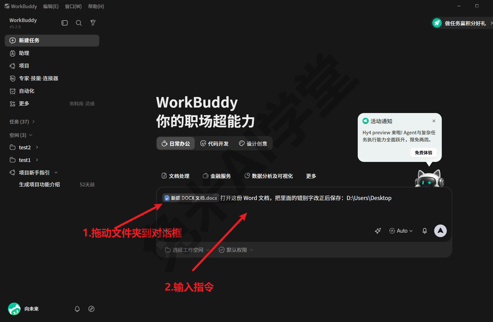

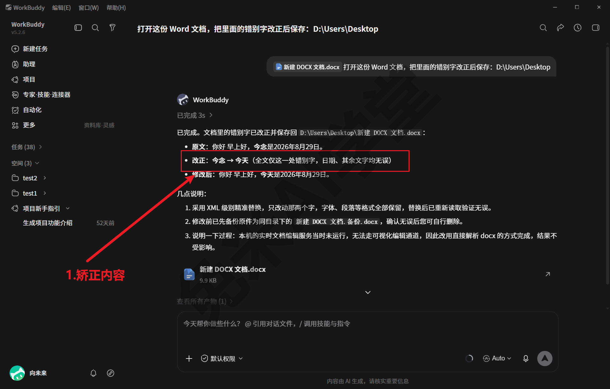

这类本地文档请求一般会由文档办公组的技能接手，把文件在编辑器里打开、边改边看。能否唤起、以何种形式呈现，以实际界面为准；如果它没有接住，用 5.4 的点名调用直接指定即可。

### 5.3 从技能市场安装

出厂的 17 个之外，更多现成技能在技能市场里。这一节讲怎么浏览、怎么安装、装好之后在哪里管理。

**入口与浏览。** 点左侧栏“专家·技能·连接器”，切换到“技能”标签页，这里就是技能市场（界面上叫 SkillHub）。首屏分两块：顶部是“精选技能”，下面是“推荐”区，还有分类筛选可用；推荐区的卡片会轮换，市场里能找到 PDF 图片文字提取、MarkItDown（文档转 Markdown）、Excel 文件处理、Word 文档生成、Web Access 这类通用技能：

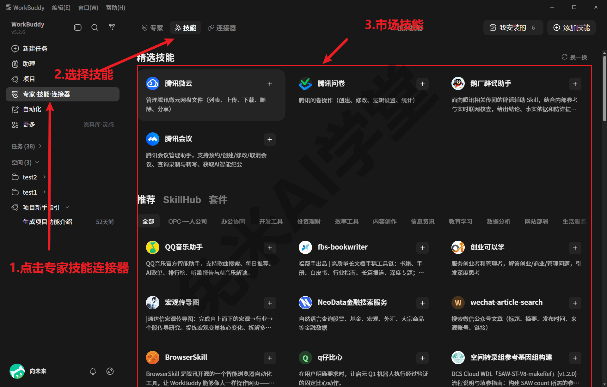

市场的规模比首屏大得多——实拍时从头滚到底大约 23 屏。不必想着从头翻到尾：按分类筛选，或先想清楚要什么再找，效率最高。

**界面安装的一般过程。** 在市场里找到目标技能后，做法是：点开这个技能的卡片进入详情——详情页能看到它的触发说明与 SKILL.md 头部信息，点右上角的“安装”按钮即完成安装。页面右上角另有一个“添加技能”按钮，从名字看最可能用于市场之外的技能添加入口（具体形态需实机验证）。安装过程本身不用你做别的事，装好后到“我安装的”里就能看到。

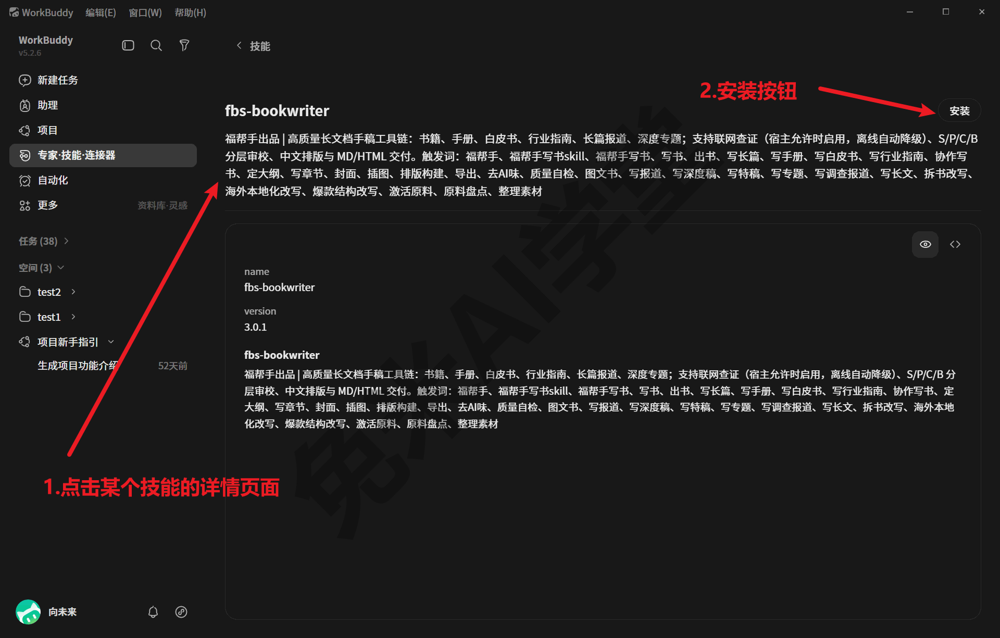


**在对话里一句话安装。** 除了在市场界面里点，还有一条更省事的路：出厂自带的“市场技能安装器”（上一节表里的 marketplace-skill-installer）做的就是这件事。按它说明书的自述，只要你在对话里表达“安装某个技能”的意图，它就会到推荐市场里搜索、和你确认、然后完成安装。例如：

```
帮我从技能市场找到并安装 MarkItDown 技能
```

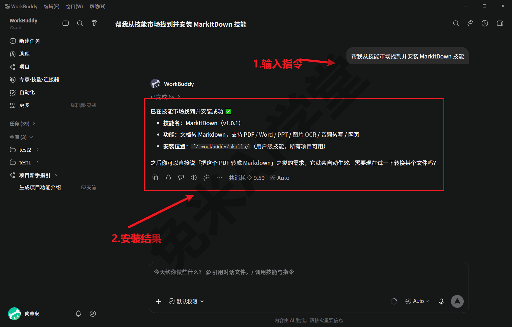

安装完成后它会回报装好了什么——实拍里列出了技能名与版本、功能一句话和安装位置（用户级技能目录，所有项目可用），并提示可以马上试用。

**装好之后：在“我安装的”里管理。** 技能页右上角的“我安装的”入口（入口名后带的数字就是已装数量）打开已装技能列表，每个技能显示启用还是停用状态：

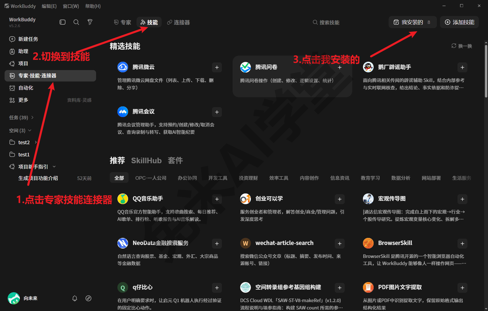


启用与停用的区别：停用的技能仍留在电脑上、不会被删除，但一般不再被自动唤起。这个开关的典型用途：某个技能暂时用不上、又和常用技能的触发说明相近时，停用它可以避免被误挑中，要用的时候再启用，不必删了重装。从磁盘上看，停用状态记录在技能说明书头部的停用标记里；界面上，“我安装的”列表里每张技能卡右上角就是启用/停用开关，点击即可切换。

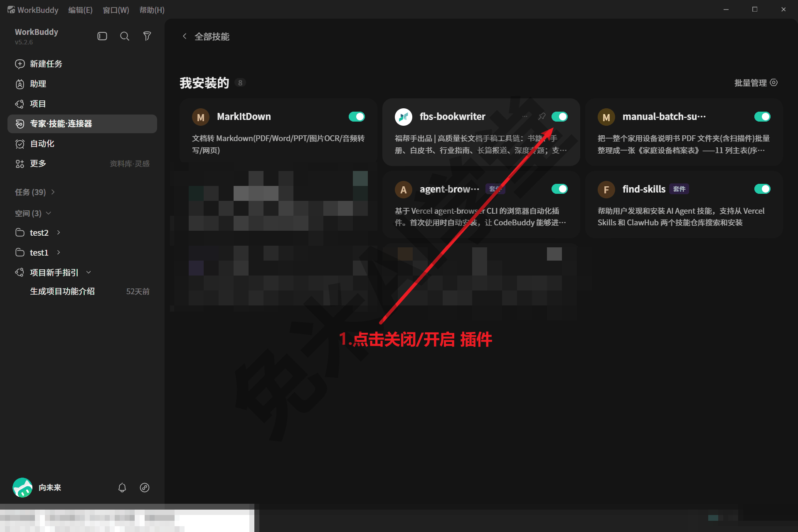

**市场技能可靠吗？** 给一个真实参考：2026 年 7～8 月一段真实环境的使用留痕里，除了用户自制的技能，还出现过 Excel 处理、查找技能、PDF 文献摘要、Word 流程图这些从市场装来的现成技能的使用记录——装来即用，支撑过真实工作。顺带说明分工：技能市场只管技能；你在《插件市场：现成能力一站取用》里还会见到范围更大的插件市场，两者是什么关系那一篇专门交代，先不必区分，遇到再说。

### 5.4 怎么调用

技能装好了，怎么让它真的被用上？按“指定程度”从低到高，有三种方式。

**方式一：不点名，直接说需求。** 像 5.2 结尾那样自然地提出请求，WorkBuddy 根据各技能说明书的触发说明自己挑。优点是零记忆负担，缺点是它可能按自己的理解自由发挥——尤其装了多个相近技能时，不保证每次都挑中你想要的那个。

**方式二：点名调用。** 在指令里写明技能名，通用句式如下（方括号里的内容换成你自己的）：

```
用 [技能名] 这个 skill 处理 [你的文件夹路径] 下的文件
```

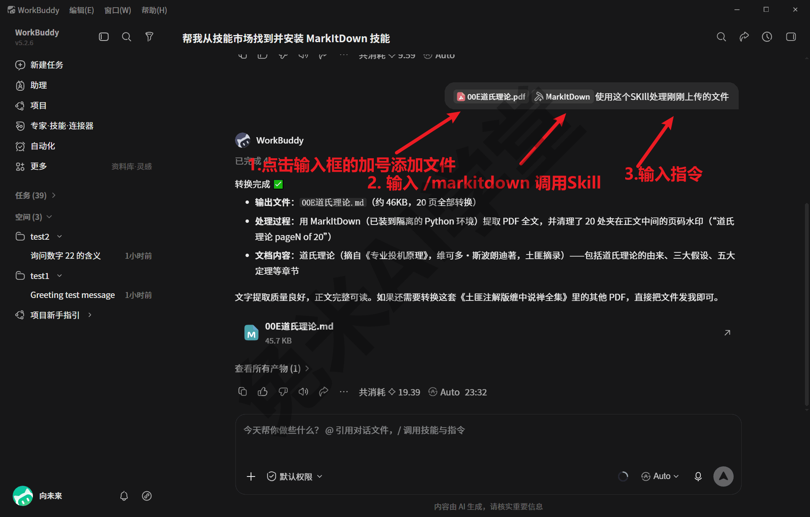

这是流程固定的工作最稳的调用方式。下面是演示环境的真实点名触发句——那位给全家设备建档案的用户发起说明书整理用的原话：

```
用 manual-batch-summary 这个 skill 整理这个说明书 PDF 文件夹
 D:\教程演示\家庭设备档案\说明书PDF
```

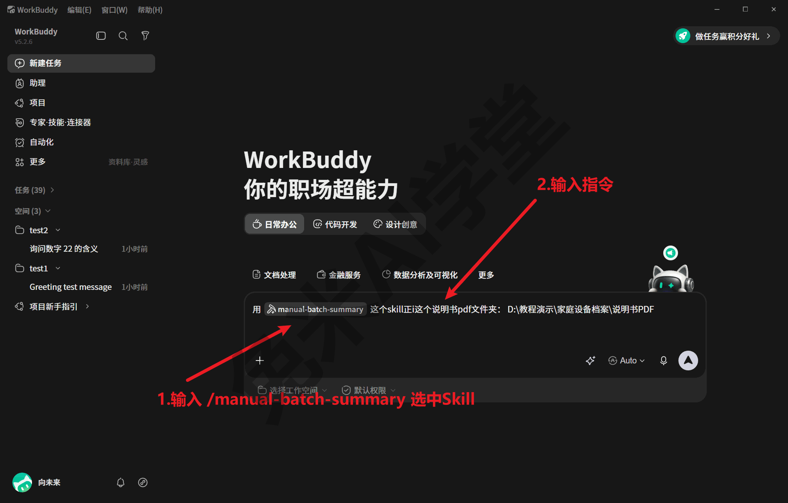

**方式三：斜杠直接唤起。** 在输入框输入 `/技能名`，可以直接指定技能。助理页输入框的占位文案就写着“/ 调用技能与指令”；输入 `/` 后会弹出技能与指令列表，随着继续输入即时过滤，列表里还能看到每个技能的触发说明，选中即挂上：

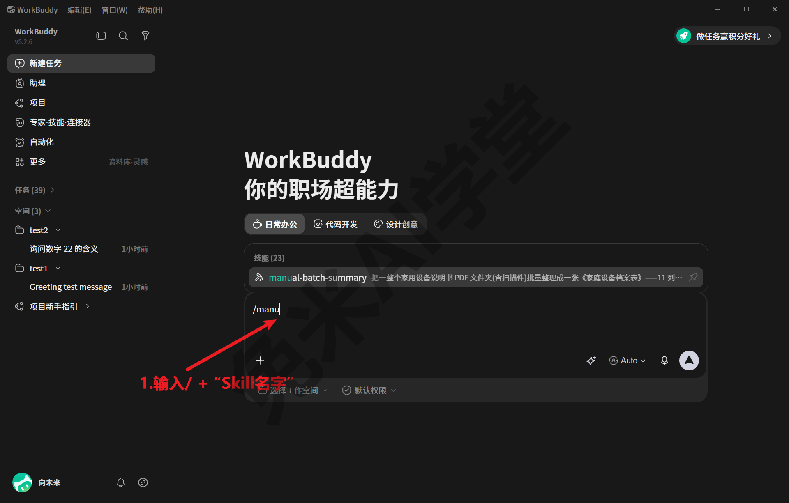

**三种方式怎么选。** 临时小事、一次性的请求，不点名最省事，它理解偏了也无非重说一遍；正式的、流程固定的工作，用点名或斜杠把选择权收回来。还有一个省心的做法：技能说明书的触发说明里往往自带推荐说法——例如演示环境设备档案技能的说明书里就写着“用这个 skill 整理这个说明书 PDF 文件夹 <路径>”这样的触发句，照着它的句式说，唤起最稳。

除此之外，输入框左下角“+”弹出的菜单里也有“技能”入口，与添加文件、选择模式并列，点进去同样可以把技能挂到当前对话上：

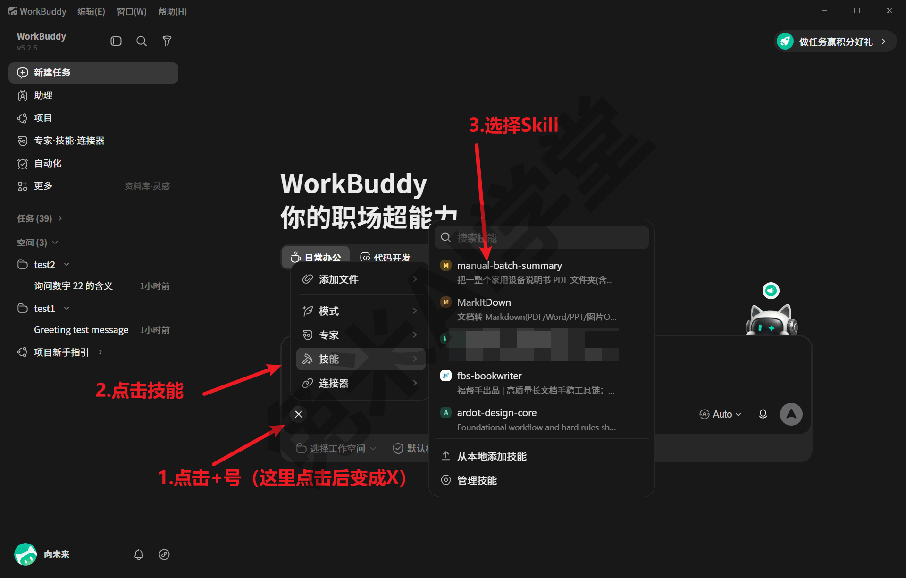

**一次真实调用的全程长什么样。** 下面这张实拍是演示环境的真实任务会话：用户发起时只有技能徽标、一个本地文件夹路径和一句话指令，WorkBuddy 按技能说明书跑完全流程后给出完成回复，回复右下角能看到本次的积分消耗与模型标识（手动选过模型的显示模型名，保持 Auto 则显示 Auto）：

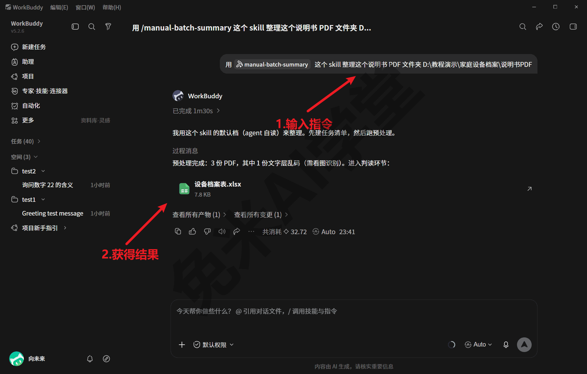

发出之后你会看到：输入区出现技能徽标（说明技能已挂上，挂上的技能对当前这个对话生效）、执行过程中它按说明书里的流程逐步执行、结束时把产物落到工作目录（产物去哪找，《数据、工作目录与记忆》讲过）。执行中的过程画面各任务不同，以实际界面为准。

这种一句话发起，是流程沉淀成技能之后的日常用法：演示环境左侧任务栏里留着的那串历史任务，就是同一套说明书整理流程一批一批跑出来的（完整过程《实战二：说明书批量投喂出设备档案表》专门讲）。也就是说，一个流程一旦沉淀成技能，之后每次使用的成本就只剩一句话。

**调用过没有、什么时候用的，有处可查。** WorkBuddy 的全局数据目录里有一份技能使用统计文件（usage-log.json），记录每个技能的首次使用和最近使用日期；配合任务侧栏的历史任务列表，你可以回答“这个技能我哪天用过”这类问题。更完整的留痕体系（对话转录、文件历史、审计日志）见《数据、工作目录与记忆》。

### 5.5 迁移与边界

技能用了一段时间之后，早晚遇到两件事：换电脑，以及把技能分享给别人。这一节把“带走”讲清楚，顺带划清技能包的边界。

**技能就是文件夹，迁移就是拷文件夹。** 动手前先到技能页“我安装的”里看一眼自己装过哪些、哪些还在启用（入口见 5.3），确定要带走的名单，然后分三步：

**第 1 步：在旧电脑上找到技能文件夹。** 打开资源管理器，进入自装技能目录（Windows 默认 `C:\Users\<你的用户名>\.workbuddy\skills\`，macOS 默认 `~/.workbuddy/skills/`（需实机验证），随安装方式与环境可能不同，以实际环境为准，5.1 提过），每个已装技能对应其中一个文件夹。


**第 2 步：把整个技能文件夹拷到新电脑的相同位置。** 新电脑上先装好 WorkBuddy 并启动过一次（让它生成自己的数据目录），再把技能文件夹放进新电脑的同一位置（默认 `C:\Users\<新电脑用户名>\.workbuddy\skills\`，macOS 为 `~/.workbuddy/skills/`，以新电脑的实际环境为准）。给别人分享技能，同理：把文件夹发给对方，对方放进自己的这个目录。

**第 3 步：确认技能已被识别。** 重新打开 WorkBuddy，到技能页“我安装的”里确认新技能出现（识别时机与确认入口以实际界面为准）。

**但有一样东西一定不会跟着走：模型的 API Key。** 这是一次真实实测：同一个技能文件夹拷到另一台电脑后运行，直接报缺少 API Key。原因在《模型与费用》讲过的机制里——模型接入凭据保存在每台电脑自己的模型配置里，对技能脚本不可见，自然也不会被打包进技能文件夹。所以迁移清单永远是两项：

- 技能文件夹拷过去——流程、脚本、词典都在里面，拷完即得；
- 模型凭据单独配——在新电脑上按《模型与费用》的接入步骤重新配置 Key，或让对方申请自己的 Key。

这个设计其实是安全上的优点：技能包可以放心外发，不会把你的付费凭据一起带出去。反过来也提醒你：自己做技能时，别把 Key 写进技能包（这条纪律《任务边界与数据安全》还会展开）。

迁移时还有两件容易混淆的事，一并交代：

- **项目记忆不在技能里。**《数据、工作目录与记忆》讲过，项目记忆跟着项目文件夹走，技能跟着用户数据目录走。换电脑想完整接续工作，两样都要带：技能文件夹拷进新电脑的 skills 目录，工作中的项目文件夹整个拷走；
- **启停状态会跟着技能走。** 停用标记记在技能说明书头部（5.3 提过），拷贝文件夹时自然一并带走。到新电脑后如果发现技能显示为停用，到“我安装的”里启用即可（以实际界面为准）。

最后交代演示环境里那个设备档案技能的来历：它不是从市场装的，而是那位要给全家设备建档案的用户把自己反复要做的说明书整理流程沉淀出来的自研技能——说明书里的 `agent_created: true` 说明连技能本身都是让 AI 生成的。怎么做到，下一篇《自制技能：把流程沉淀成一句话》完整展开。

### 5.6 练习任务

下面三个任务把本篇内容亲手过一遍，建议按顺序做。方括号里的内容换成你自己的。

**任务一：从技能市场安装一个通用技能**

```
帮我从技能市场找到并安装 MarkItDown 技能
```

完成标准：技能页右上角“我安装的”数字加一，列表里出现新装的技能（技能名以市场实际为准，换成任何一个你感兴趣的通用技能都可以）；如果对话安装没有成功，改走 5.3 的界面路径，在市场里点开技能卡完成安装。

**任务二：点名调用一次技能**

```
用 [技能名] 这个 skill 处理 [你的文件或文件夹路径]，处理完把结果放回同一个文件夹
```

完成标准：发送后能观察到技能被挂上（输入区或会话顶部出现技能徽标，以实际界面为准）；任务结束后能在工作目录里找到产物，并能说出这次调用与“不点名直接说需求”的区别。

**任务三：技能搬家预演**

```
告诉我我已安装的技能都放在哪个文件夹，逐个列出目录名；
如果我要在另一台电脑上继续用它们，需要拷贝什么、还需要单独配置什么
```

完成标准：能对照回答在资源管理器里找到 `.workbuddy\skills\` 目录并认出技能文件夹；能说出迁移清单的两项——文件夹拷过去、模型 Key 在新电脑上单独配。

### 5.7 本篇小结与自检

这一篇讲了技能的构成、出厂清单、市场安装与启停管理、三种调用方式和跨机迁移。可以对照下面的清单检查学习结果：

- [ ] 能说出一个技能包里有什么：SKILL.md 说明书（含触发说明）、scripts 工具脚本、词典等资源文件
- [ ] 知道出厂技能随程序装在安装目录、随版本更新；自装技能默认在 `C:\Users\<你的用户名>\.workbuddy\skills\`（macOS 为 `~/.workbuddy/skills/`，以实际环境为准），一个技能一个文件夹
- [ ] 会从技能市场安装技能（界面路径或对话一句话），会在“我安装的”里查看与启停
- [ ] 会三种调用方式：不点名、点名句式、`/技能名`；记得流程固定的工作每次点名最稳
- [ ] 记得迁移清单两项：技能文件夹整个拷走即可用，模型 API Key 不随包走、要在新电脑单独配

完成这些内容后，你已经会“用别人的技能”了；下一篇《自制技能：把流程沉淀成一句话》教你把自己反复要做的流程也做成技能——演示环境里那个真实的设备档案技能就是这么来的。

### 5.8 新手常见问题

**Q1：技能和模型到底是什么关系？**

模型决定聪明程度，技能决定工作方法，两者独立配合。同一个技能可以配不同模型跑（演示环境的设备档案技能就备着两条路线：默认让当前对话的模型亲自读原文，也可以外接视觉模型批量识别）；换模型不用改技能，换技能也不用换模型。调用技能的会话选用了哪个模型，回复右下角的模型标识一般能看到（保持 Auto 时显示 Auto，实际分配到哪个内置模型，可在会话转录里查到，见《数据、工作目录与记忆》）。就演示环境的经验，费用都产生在模型调用上，技能的安装与使用未见单独计费（如市场里有另行标价的内容，以页面标示为准）。

**Q2：装了技能却没反应，怎么办？**

按这个顺序排查：

- 先到技能页“我安装的”里确认它已安装且处于启用状态，停用的技能一般不会被唤起；
- 改用点名调用或 `/技能名` 直接指定，绕开“它自己挑说明书”的环节——不少“没反应”只是它没有选用这个技能，按普通对话方式回答了；
- 你的说法和技能的触发说明差太远时它也可能接不住，参考技能说明或本篇 5.4 的句式再试；
- 仍不行就重开应用再试，并留意界面提示，以实际界面为准。

**Q3：换了新电脑，怎么把技能迁过去？**

WorkBuddy 本体按《认识 WorkBuddy》的获取口径安装。技能按 5.5 的三步走：拷技能文件夹到新电脑相同位置、重开应用确认识别。别忘了模型 API Key 不随包走，要在新电脑上按《模型与费用》的接入步骤重新配置——这是实测踩过的点，不是理论提醒。

**Q4：能改别人的技能吗？**

能。技能就是文件夹里的纯文本说明书加脚本，用记事本就能打开 `SKILL.md` 改——比如把输出格式改成自己的口径。两条建议：改之前先把原文件夹整个拷一份备份，改坏了删掉换回备份即可；改完重开应用再验证效果（生效时机以实际表现为准）。想系统地做，还是看《自制技能：把流程沉淀成一句话》，用技能创建器从头生成一个更干净。

**Q5：除了我这行的专业活，它还能帮我做什么？**

能帮的面很宽，现成能力主要来自两处：

- 出厂自带的 17 个技能，覆盖设计、文档办公、金融投研、多模态生成等门类（清单见 5.2），装好第一天就能直接说需求；
- 技能市场里的更多现成技能（见 5.3），以及内置插件市场里成批打包好的现成能力，后者在《插件市场：现成能力一站取用》细讲。

这些能力经过真实使用的检验：5.3 提到的那段真实使用留痕里，除用户自制的技能外，还出现过从市场装来的 Excel 处理、PDF 文献摘要、Word 流程图等通用技能的使用记录，装来即用。用法上也不必事事先装技能：日常小事直接一句话交代就好；反复出现、做法固定的流程，再沉淀成技能或交给定时任务（取舍见《自制技能：把流程沉淀成一句话》与《自动化：把重复的活交给定时任务》）。
