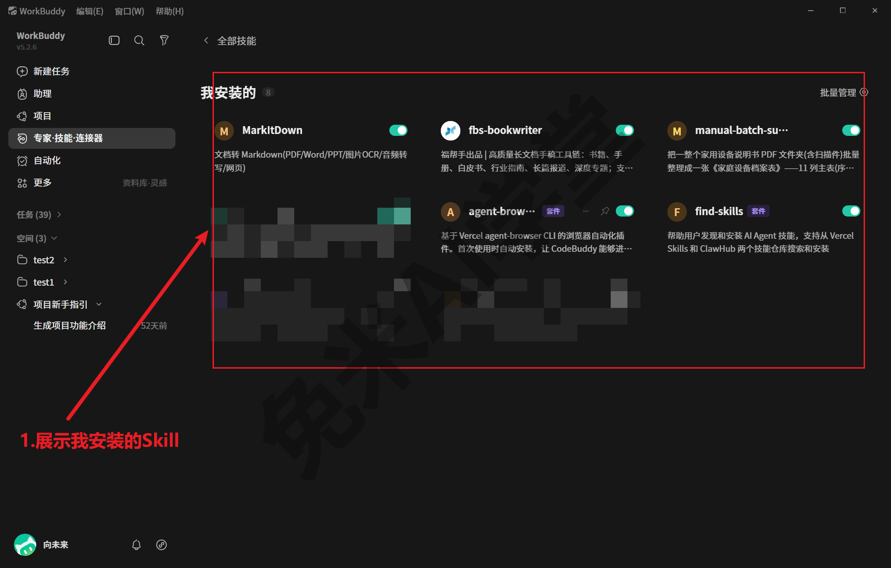
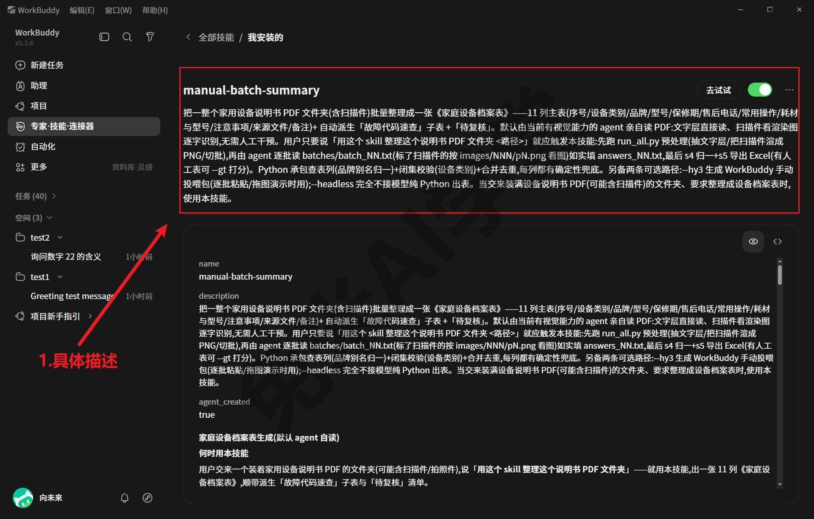
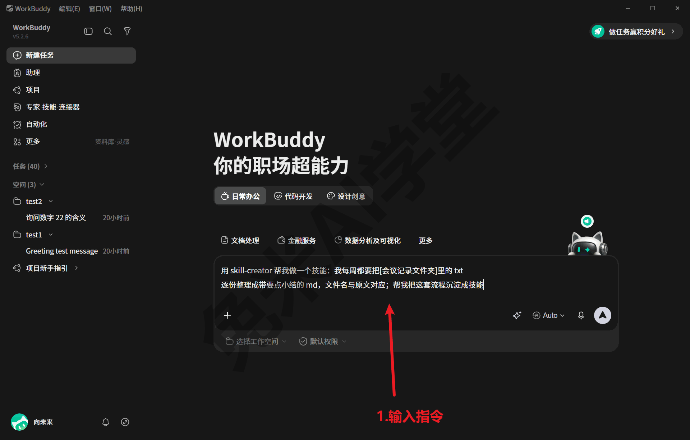
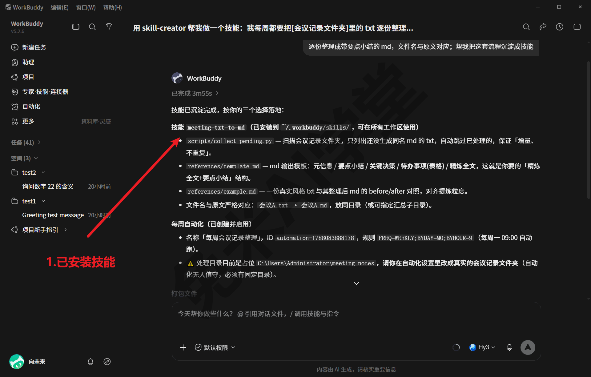
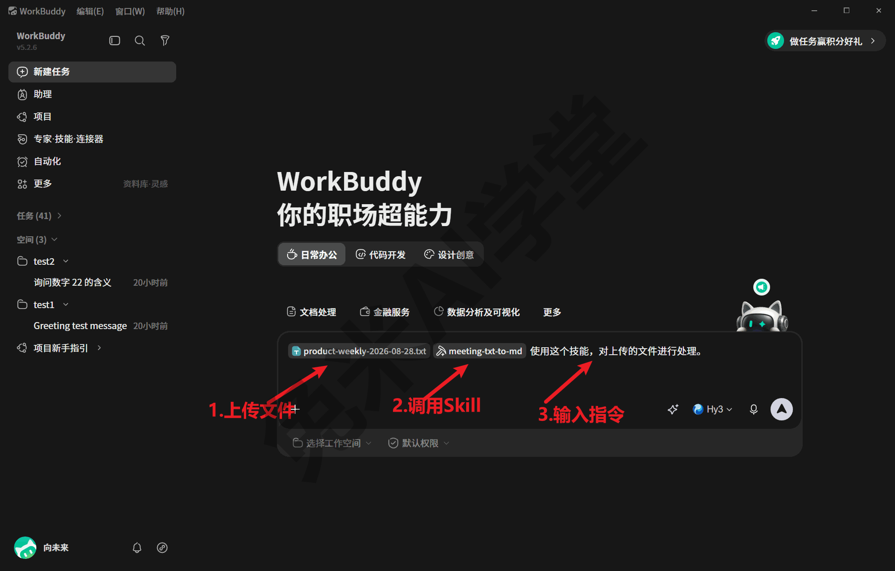
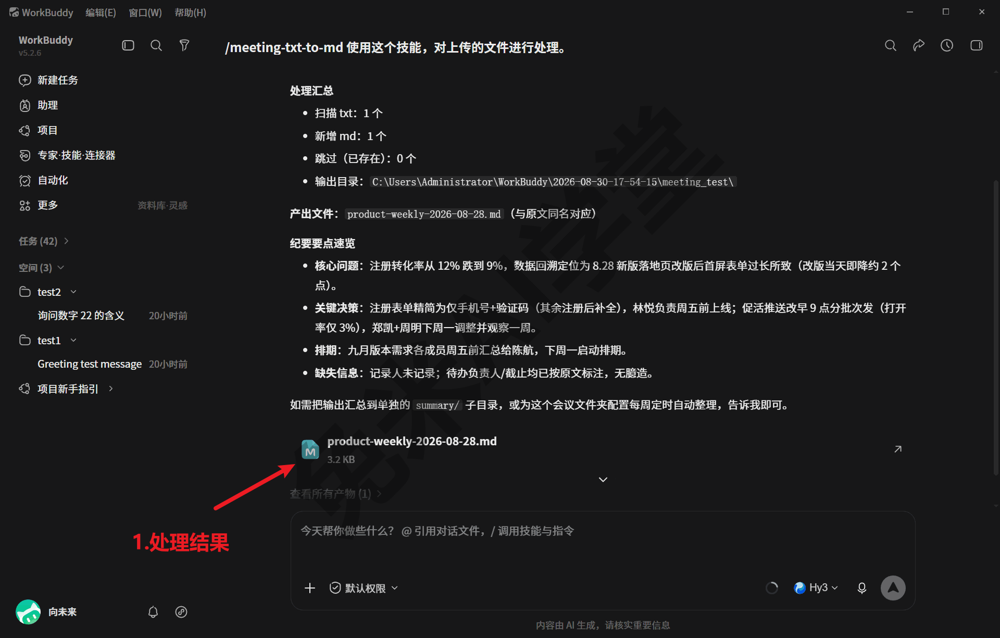

# 自制技能：把流程沉淀成一句话

《技能：安装、管理与调用》里，你已经会从市场安装技能、管理启停，并在对话里调用它们。这一篇再往前一步：不满足于用别人做好的技能，把你自己反复在做的那套流程，也沉淀成一个随叫随到的技能。本篇的活例子是本教程演示环境里真实存在的一个自研技能；涉及的界面以演示环境的 WorkBuddy 5.2.6 为准（2026-08-29 实况），你看到的画面可能略有差异，以实际界面为准。

---

### 6.1 为什么值得自制：把反复的流程变成一句话

先看一个会反复发生的场景。假设你每隔一段时间就要把新到手设备的说明书补进一张固定口径的《家庭设备档案表》：表有哪几列、每列从原文哪里取、“无”和“/”怎么区分、扫描件要看图别拿乱码猜、最后导出成什么格式——这套要求一次讲全得上千字。用普通对话做这件事，每次开新任务都得把这段话原样再讲一遍；讲漏一条，它就按自己的理解发挥，返工的功夫比省下的还多。

**自制技能解决的就是“重复交代”这件事。**《技能：安装、管理与调用》把技能比作给 WorkBuddy 的“说明书＋工具包”，自制技能就是把你自己的流程写成那份说明书：口径、步骤、禁忌一次写清、落成文件，往后每次开工只需一句话点名，它自己去翻说明书照章办事。你交代过的每一条要求都不再依赖“这次记得说”，而是变成它每次都会读的成文规矩。

这不是纸面构想。本教程的演示环境里就有一个这样的技能，名叫 manual-batch-summary，出自一位要给全家设备建档案的用户之手，做的正是他反复要做的事：把一整个文件夹的设备说明书 PDF（含扫描件）批量整理成一张 11 列的《家庭设备档案表》，顺带派生“故障代码速查”和“待复核”两张附表。技能页的“我安装的”里能看到它的卡片（下图右上角；这台演示机上共装着 8 个技能，MarkItDown、fbs-bookwriter 和两个自带套件也在列）；卡片上那句一句话简介，正来自下一节要拆开看的那份技能说明书：



沉淀之后用起来什么样？一次真实调用的开头长这样：用户消息只有一个技能徽标、一个本地文件夹路径，外加一句“用这个 skill 整理这个说明书 PDF 文件夹”，剩下的事（按什么口径抽取、扫描件怎么处理、表怎么导出）全由技能说明书接管，回复卡片给出本次用时（下图这单为“已完成 1m30s”），产物落进工作目录：


这也不是偶尔为之的摆拍：演示环境的任务侧栏里，这条说明书工作流已经留下成串的任务记录（几条到几十条，随使用积累）。沉淀一次，往后每次都省下整段交代——调用越频繁，这笔账越划算。

**哪些活值得沉淀？** 三个特征都占的，最值得动手：

- **反复出现**：每周每月都来一遍的活，沉淀的收益按次数累积；一年只做一次的事，写说明书的功夫可能比活本身还多，先不必沉淀；
- **口径固定**：字段怎么填、什么算合格、什么坚决不能做，已经稳定下来不再天天变；口径还在摇摆的流程，先用普通对话磨熟（做法见 6.4）；
- **有对错标准**：产出能对照检查，比如有样表、有既往的合格产物、有验收要点——技能里就能写进交付前自查清单，让它交活之前先自检一遍。

反过来，临时起意的一次性小事，张口交代就好，不必兴师动众。这个取舍和《自动化：把重复的活交给定时任务》讲“什么活适合自动化”是同一个思路：临时的小事张口交代就好；反复出现、口径固定的工作才值得沉淀成技能。

### 6.2 解剖一个真技能：说明书与工具箱各管什么

写自己的技能之前，先把一个写好的拆开看看。就拿演示环境里那个设备档案技能 manual-batch-summary 当标本（《实战二：说明书批量投喂出设备档案表》整篇实战用的正是它），技能文件夹里一共就这么几类东西（节选）：

```
manual-batch-summary\
├── SKILL.md                  技能说明书（必备）：什么时候用我、流程怎么走
├── schema.json               字段口径文件：11 列怎么填、作答模板（答题卡）、附表怎么派生
├── categories.txt            设备类别允许集：闭集词表，改词只动这个文件
├── brand_alias.json          品牌别名词表（Midea→美的），换一批设备直接带走复用
├── 通义千问API_注册与使用.md    密钥申请指引：只教怎么申请，密钥本身不进包（见 6.4）
├── scripts\                  十个 Python 脚本：预处理、切批、归一合并、导出，外加一键串联
└── tests\                    回归测试：改过脚本先跑它，防止把验证过的口径改坏
```

**先看说明书 SKILL.md，它分两截。** 开头是几行元数据：name 是技能的短名；description 是一大段“什么时候该用我”的触发说明。这个标本的触发说明里写着，用户只要说“用这个 skill 整理这个说明书 PDF 文件夹”，就应触发本技能——连用户可能说的原话都替 WorkBuddy 想好了。据技能创建器的文档，name 与 description 决定 WorkBuddy 会不会在对的时机想起这个技能，是整包里分量最重的几行字。元数据往下才是正文，这个标本的正文依次讲了：什么时候用我、交付物长什么样（哪三张表、各是什么）、几条判读路径怎么选、判读口径与护栏（哪些情况照抄、哪些坚决不许编）、依赖怎么装、工作流分几步各跑哪条命令、改完代码怎么验证没改坏、换一个品类怎么复用词表，最后是交付前逐条自查的清单。一份合格的说明书读完，一个从没接触过这件事的 WorkBuddy 就能照章把事情做对。在技能页点开这张卡片，看到的就是这份说明书的门面——名字、整段触发说明与 agent_created 标记一屏可见：



**再看工具箱 scripts，分工原则一句话：模型干模型擅长的，脚本干脚本擅长的。** 这个标本的设计原文是：判读方（模型）干“逐字精确抄录、读扫描图”，Python 脚本干“查内部字典、闭集校验、合并去重”。为什么这么分？举两个例子。表里的“品牌”一列，说明书封面印的常是 Midea、HAIER、TP-LINK 这类外文主标，而档案表要的是统一的中文名——判读方只管照抄原文，脚本再查包里那份品牌别名词表把它归一成“美的”“海尔”“普联”，归一动作还自动追记进备注列，谁改的看得见；而“设备类别”这类字段只准从固定的允许集里选词，判读方偶尔写个“厨房小家电”式的同义词，脚本就把越界的词拦下来标疑，防止悄悄混进正表。再看脚本怎么分步：抽文字层和渲染扫描图、生成确定性底稿、切批、收回答案归一、合并导出各管一步，判定规则单独抽成一个纯函数文件供各步共用，另有一键脚本把整条链串起来，再加几个按需选用的（生成手动投喂包、调外部模型判读、把人工表转成打分基准）。每个脚本只做一步确定性的工作，模型的发挥空间被收在该发挥的环节里，两边互为兜底。

**脚本开箱就能跑，因为运行环境是自带的。** WorkBuddy 的安装目录里捆着 Node 与 Python 的压缩包，解压到数据目录后就是它自带的托管运行环境：2026-08-13 实测看到的是 Node 22.22.2 与 Python 3.13.12，还带几个按用途隔离的专用环境。所以技能里的 Python 脚本不要求你自己装过 Python；技能依赖的第三方库（比如读 PDF、写表格的库）也不必手工装——标本的说明书里写明，一键脚本会自动检测并安装依赖。《数据、工作目录与记忆》里那个真实项目的记忆文件，引用的正是这套自带环境。

**它怎么做到不占地方？** 据技能创建器的文档，技能按三级加载：名字与触发说明常驻上下文（约百字），说明书正文只在技能被触发时读入，scripts 这类资源按需取用，脚本甚至可以只执行、不读入。所以装十个技能不等于每次对话都背着十份说明书——平时随身带着的，只有十段触发说明。

### 6.3 用技能创建器起步：从描述流程到生成骨架

从零手写这么一包东西当然可行，但没必要：WorkBuddy 出厂自带一个专门帮你做技能的技能——**技能创建器 skill-creator**，出厂内置技能之一（清单见《技能：安装、管理与调用》）。本机的技能使用统计里就真实留有它的使用记录；而本篇标本技能的说明书开头也带着一行 agent_created: true 标记——据其文档，这个标记表示技能由智能体创建生成，也便于之后用工具修改或删除。

**怎么发起。** 输入框的占位文案写着“/ 调用技能与指令”（2026-08-13 实拍），发起方式有两种：在输入框键入 / 后从技能列表里选中 skill-creator（列表选中的具体交互需实机验证），或者直接在消息里点名——点名这条路 2026-08-30 已实测走通。点名的写法可以参考下面这条演示指令（方括号里的内容换成你自己的）：

```
用 skill-creator 帮我做一个技能：我每周都要把[会议记录文件夹]里的 txt
逐份整理成带要点小结的 md，文件名与原文对应；帮我把这套流程沉淀成技能
```



**它接下来会怎么带你走。** 2026-08-30 用上面那条指令实测走通了一轮：从发起到装好用时 3 分 55 秒，中途它先追问了几处取舍、按回答落地，最后连“每周”的节奏都替用户建好了配套定时任务，并提醒把占位目录改成真实文件夹。它的文档把这套流程自述为六步，逐步对照如下（各步的具体表现以实际交互为准）：

1. **先聊清楚用途**：它会追问几个具体例子：这个技能要支持哪些功能、用户会说什么话才该触发它。别嫌啰嗦，例子给得越具体，触发说明就写得越准，技能日后被想起的概率就越高；
2. **规划可复用的内容**：从例子里析出值得沉淀的东西：每次都要重写的代码，沉淀成 scripts 脚本；每次都要翻的资料（表结构、字段口径这类），沉淀成参考文档；产出要套用的模板素材，归进素材目录。三类资源都是可选项，用不上就不建；
3. **生成骨架**：跑它自带的初始化脚本，生成一个完整的技能文件夹模板——说明书模板带着待填的占位，三类资源目录各放了示例文件，不需要的删掉即可；
4. **补写说明书**：回答三个问题：这个技能是干什么的、什么时候该用、拿到手具体怎么用。写法上它要求祈使句式、直接下指令，因为这份说明书的读者是另一个 WorkBuddy，不是人；
5. **校验打包**：打包脚本会先自动校验元数据齐不齐、命名规不规范、目录结构对不对，全过才产出一个可分发的 zip 包；校验不过会报错并拒绝打包，改完重跑；
6. **用了再改**：拿真实任务跑一遍，卡在哪改哪。这一步最要紧，展开见 6.4。

实测那单的完成回复长这样——新技能 meeting-txt-to-md 与生成的文件清单一屏可见：



**生成的技能落在哪。** 据其文档，技能可以放在用户级技能目录（跨项目随你走）或项目级目录（跟着项目文件夹走），拿不准时默认用户级。要注意其文档的目录写法与本机看到的不同：用户自装技能默认都在 `C:\Users\<你的用户名>\.workbuddy\skills\`（macOS 为 `~/.workbuddy/skills/`）下、一个技能一个文件夹（随安装方式与环境不同位置可能有别，以实际环境为准），新技能就生成在这里——创建完成的回复里明确写着“已安装到 ~/.workbuddy/skills/，可在所有工作区使用”。生成之后，技能页“我安装的”里应当出现新卡片，对话里也就能像调用市场技能一样一句话点名它了（以实际界面为准）。

首次调用也实测跑通了。发起画面：把一份会议记录 txt 拖进输入框、挂上新技能，说一句处理要求（已输入未发送）：



发送后的完成态：扫描 1 份 txt、产出同名 md，回复给出处理汇总与纪要要点速览，产物卡就在下方（示例会议记录为演示用自造数据）：



### 6.4 打磨与边界：先跑通、不装密钥、留退路

**第一条：先当普通对话跑通，再沉淀。** 技能固化的是流程，而流程得先被验证过。比较稳的节奏是：同一件事你已经在普通对话里顺利做成过两三次、口径和步骤基本不再变，再交给创建器沉淀；第一次上手就凭空造技能，很容易把没验证过的做法固化成一份“错误的说明书”，以后每次调用都把同一个错误原样重复一遍。演示环境这条说明书工作流也是先拿小批验证、再跑完全部：技能成形后，先拿三份品牌官网直下的真实说明书把全链路亲手跑通、对着手工核定的标准答案逐格对分，确认口径和步骤都没问题，才放心用它去处理全部三十份说明书。

**第二条：用了再改，错处就是改进清单。** 技能不是写完就完，每次真实使用暴露的问题都该回写进包里。演示环境这个标本就有一次真实的返修，就出在 2026-08-29 跑那三十份的当天：第一批答卷（模型交回的答案文本）整批没能解析出来，查下来是作答的冒号全角半角对不上；当天修复、验证通过，之后同样的答卷一份也不会再丢。这桩故障连同同一天另一桩导出环节的小事故，完整经过与修复细节在《实战二：说明书批量投喂出设备档案表》12.5 有专段复盘。修好的规矩就此留在包里。踩过的坑同样要写成护栏：这个标本的说明书把容易出错的口径逐条写成铁律，比如“原文明确写无耗材才填‘无’、没找到信息一律填‘/’，两个值语义不同”“部件差异化保修（如压缩机保修 10 年）不进保修期列，进备注”。判读方可能犯的错，就此变成它每次都要读的护栏。改大版本的方式也值得学：这条工作流当初从另一个行业里一套结构相同的流程平移过来时，原包一个字节没动、另起一个新文件夹改造，旧包仍在原来的场景里照常使用。大改不动旧包，出问题随时切回。

**第三条：凭据不进技能包。** 技能包是要拷来拷去、甚至打包分发的，密钥一旦写进包里就等于跟着扩散。正确做法是：密钥放在环境变量里或调用时临时传入，技能包里最多放一份“怎么注册申请密钥”的指引文档。演示环境的标本正是这么做的：包里带着一份外部模型 API 的注册申请指引，密钥本身走环境变量或命令行参数，不落包内。把技能拷给别人时，密钥也不会随包走，对方要配置自己的密钥；迁移细节见《技能：安装、管理与调用》，哪些文件属于敏感件见《任务边界与数据安全》。

**第四条：改前留退路。** 三层保险由轻到重：

- **备份**：技能就是普通文件夹。动手改说明书或脚本之前，把整个技能文件夹复制一份放在旁边，改坏了原样拷回去就是；
- **停用**：不想删的技能拨到停用位即可。停用的技能，其说明书开头会多出一行 disable: true 标记，与卡片开关状态一一对应（从对应关系看，停用状态就落在这行标记上，以实际表现为准）：

```
---
name: ……
description: ……（什么时候该用我）
agent_created: true
disable: true
---
```

- **防覆盖**：从市场装来的技能被你编辑过之后，据技能创建器的文档，会在技能目录的市场元数据文件里写入“用户已修改”标记，防止市场自动更新悄悄覆盖你的改动（技能卡片上的“编辑”入口与该标记的实际表现需实机验证）。

---

### 6.5 练习任务

下面三个任务连成一条线：先解剖别人的，再生成自己的，最后跑一遍、改一处。方括号里的内容换成你自己的。

**任务一：解剖一个已装技能**

打开资源管理器，进入 `C:\Users\<你的用户名>\.workbuddy\skills\`（macOS 为 `~/.workbuddy/skills/`），挑一个技能文件夹（在《技能：安装、管理与调用》里装过技能的话就挑它；目录还是空的就先做任务二，回头再来解剖你自己的作品），用记事本打开里面的 SKILL.md：先找到开头的 name 与 description 两行元数据，再往下找到写工作流或操作步骤的小节。只看不改，也不要动文件夹里的其他文件。

完成标准：能用一句话说出这个技能的触发条件（用户说什么它就该出场），并指出流程里哪一步交给了脚本、哪一步靠模型自己发挥。

**任务二：生成你的第一个技能骨架**

想一件你反复在做、口径基本固定的小事（整理某类笔记、汇总某类表格都行），向 WorkBuddy 发送：

```
用 skill-creator 帮我做一个技能：我经常要[描述你反复做的那件事，
说清输入是什么、产出要什么样]，请帮我把这套流程沉淀成技能；
你可以先追问我细节再动手
```

完成标准：创建流程走完后，用户技能目录（`C:\Users\<你的用户名>\.workbuddy\skills\`，macOS 为 `~/.workbuddy/skills/`，以实际生成位置为准）里出现新的技能文件夹，SKILL.md 的 name 与 description 已按你的描述填好；技能页“我安装的”里能看到新卡片（以实际界面为准）。

**任务三：调用一次，回改一处**

先把任务二生成的技能文件夹整个复制一份作备份，然后开一个新对话，用一句话点名触发它，让它真实跑一遍你的流程；对着产物挑一处不满意的地方（口径不对、格式不好都算），接着发送：

```
刚才[说出不满意之处]，请把这条要求写进这个技能的 SKILL.md，以后按新要求执行
```

完成标准：调用成功且产物落进工作目录；打开 SKILL.md 能指出新增或修改的那条要求；备份文件夹原样还在。

### 6.6 本篇小结与自检

这一篇讲了为什么值得把反复的流程沉淀成技能、一个真技能内部的分工、用技能创建器起步的路径，以及打磨与安全边界。可以对照下面的清单检查学习结果：

- [ ] 说得出什么活值得沉淀成技能：反复出现、口径固定、有对错标准；临时小事直接一句话交代，不必沉淀
- [ ] 看懂技能包的分工：SKILL.md 管“什么时候用我、流程怎么走”，scripts 脚本管确定性环节，口径词表单独成文件，运行环境由 WorkBuddy 自带
- [ ] 知道说明书开头的 description 触发说明决定它会不会在对的时机被想起，写触发说明要带上用户会说的原话
- [ ] 记得技能创建器的六步路径：聊清用途、规划可复用内容、生成骨架、补写说明书、校验打包、用了再改（本机表现以实际界面为准）
- [ ] 守住三条边界：先当普通对话跑通再沉淀；凭据不进技能包；改前备份、可停用、多版本并存留退路

完成这些内容后，就可以进入《连接器：把办公系统接进来》：让 WorkBuddy 不止会做事，还能伸手够到你在用的邮箱、文档这些办公系统。

### 6.7 新手常见问题

**Q1：不会编程，能做技能吗？**

能起步。技能的核心是 SKILL.md 这份纯文本说明书，把“什么时候用我、按什么口径做事”写清楚本身不需要编程，技能创建器还会替你生成模板；据其文档，scripts 等三类资源全是可选项，只有说明书是必备的。至于脚本：当你发现流程里有个环节每次都在重写同样的代码，就值得沉淀成脚本，而这段脚本同样可以让 WorkBuddy 替你写。从“纯说明书技能”起步，用着用着再补上脚本，是最自然的路径。

**Q2：写技能和每次直接聊天，差别在哪？**

直接聊天，每次都要把口径、步骤、禁忌从头交代，讲漏一条它就按自己的理解发挥，十次里难免有几次跑偏。技能把这些一次性写成文：触发说明常驻，正文触发才加载，确定性环节还有脚本兜底、词表校验拦错。还有一层差别在错误的归宿：聊天里踩的坑散在会话里，下次多半重踩；技能里踩的坑会变成说明书里的护栏、脚本里的修正——6.4 讲的那次整批答卷解析为零的事故，当天修完规则、验证通过之后，同样的错误就不会再丢答卷。一句话：聊天靠现场发挥，技能靠成文的制度。

**Q3：做好的技能能给别人用吗？**

能，两条路。最直接的是把技能文件夹整个拷给对方，放进对方机器的用户技能目录（迁移口径见《技能：安装、管理与调用》）；讲究一点的用打包脚本产出 zip 分发，打包前会自动校验（据其文档）。两个提醒：密钥不会随包走，对方要配置自己的密钥才能跑需要密钥的环节；对方机器上的 WorkBuddy 同样自带 Python 运行环境，脚本类技能一般不需要对方额外装环境。

**Q4：技能做好了，说了半天它却不调用，怎么办？**

先检查说明书开头的 description 触发说明，它是 WorkBuddy 决定“要不要想起这个技能”的主要依据。把用户会说的原话写进去最有效：演示环境的标本就在触发说明里写明，用户只要说“用这个 skill 整理这个说明书 PDF 文件夹”就应触发本技能。描述改准之后仍不放心的，用点名调用兜底：消息里直接写技能名，或输入 / 从列表里选中它（调用方式详见《技能：安装、管理与调用》）。
