# 连接器：把办公系统接进来

《自制技能：把流程沉淀成一句话》讲完了怎么让它“会做事”，这一篇解决另一件事：让它“够得着”你天天在用的办公系统。接通连接器之后，邮箱、在线文档、在线会议这些放在网上的内容，它才能替你读写。需要先说明本篇的口径：接通与调用（7.3、7.4）已按真实授权 QQ 邮箱的实拍写出；解绑（7.5）未实际操作，相关段落按最可能形态写出并逐处标注，你第一次操作时，一切以实际界面与页面提示为准。

### 7.1 连接器是什么

学完前面几篇，你可能会很自然地在对话里发出这样一句：

```
看看我邮箱里最近有没有新邮件，有的话把标题列给我
```

结果它做不到。它不是不会，而是没有权限：邮箱、在线文档这些内容存在你的网络账号里，不在你的电脑文件夹里，你没给它授权，它就进不去。没接通连接器时发出上面这句，它取不到邮件——本机实测的回复说得很直白：邮箱类连接器（QQ 邮箱、网易邮箱）都处于未连接状态，自带的邮箱功能也尚未开通，并引导先接通其中一种再来。记住这个画面，学完这一篇再发一次，结果就完全不同了：

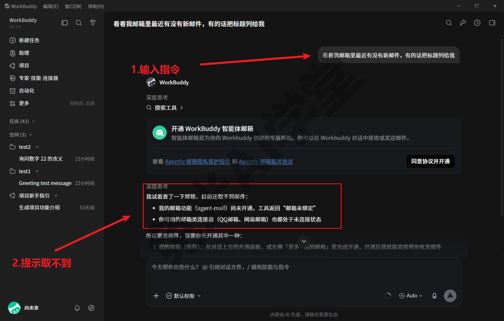

**连接器就是这条通路。** 你可以把连接器理解成 WorkBuddy 与某个外部系统之间的一座桥：一头是它，另一头是你在用的某个办公系统（邮箱、在线文档、在线会议、项目管理平台等）。桥没搭起来时，两边互不相通；搭起来（也就是完成授权、接通）之后，它才能凭你的授权，替你读写桥那头的内容。

**它和技能是两回事，一句话分清。** 技能解决“会不会做”：一份说明书加工具包，教它完成某类专门工作（《技能：安装、管理与调用》专门讲过）；连接器解决“能不能访问”：接通之后，它才有权限进入某个外部系统。两者常常配合：比如让它把一批设备说明书的整理结果汇成表格，靠的是技能；再让它把这张表格写进你的在线文档，就还需要接通对应的连接器。后面《插件市场：现成能力一站取用》里还有第三个概念“插件”，三者的分工那一篇有专门对照，这里先记住“技能管方法、连接器管通路”即可。

**顺带认识一个词：MCP。** 逛连接器相关的界面时，你会遇到“MCP”这个缩写——它是 Model Context Protocol（模型上下文协议）的简称，是 AI 应用与外部系统对话的一种通用接口约定，WorkBuddy 的连接器体系就建立在这套标准上。不必专门记住它，你只在两个地方会见到：一是连接器市场右上角“自定义连接器”打开后的对话框就叫“MCP 服务管理”（7.2 会看到实拍图），二是网上介绍这类能力时常拿它做关键词。看到 MCP，理解成“连接器背后的通用标准”就够了。

**什么时候用得上，什么时候用不上。** 判断标准只有一条：你要它处理的内容存放在哪里。内容在本机文件夹里，整理文件、处理表格、批量改文档，这些用不到连接器，前几篇的方法已经够用；内容在你的网络账号里，读邮件、写在线文档、查在线表格、发起在线会议，这些必须先接通对应的连接器。没接通时它无法访问这些系统，这不是故障，而是边界：你没授权的地方，它进不去。反过来这也是一层保护——每一条通路都是你亲手授权开出来的，不存在它悄悄替你连上什么系统的情况（授权流程 7.3 细讲）。

### 7.2 市场里有什么

**入口。** 打开左侧栏“专家·技能·连接器”，切到顶部的“连接器”标签页，这里就是连接器市场。页面是双列卡片，每款连接器带一句简介，说明它接的是什么系统、接通后能做哪些事；卡片右侧各有一个“＋”按钮，右上角另有“自定义连接器”入口：

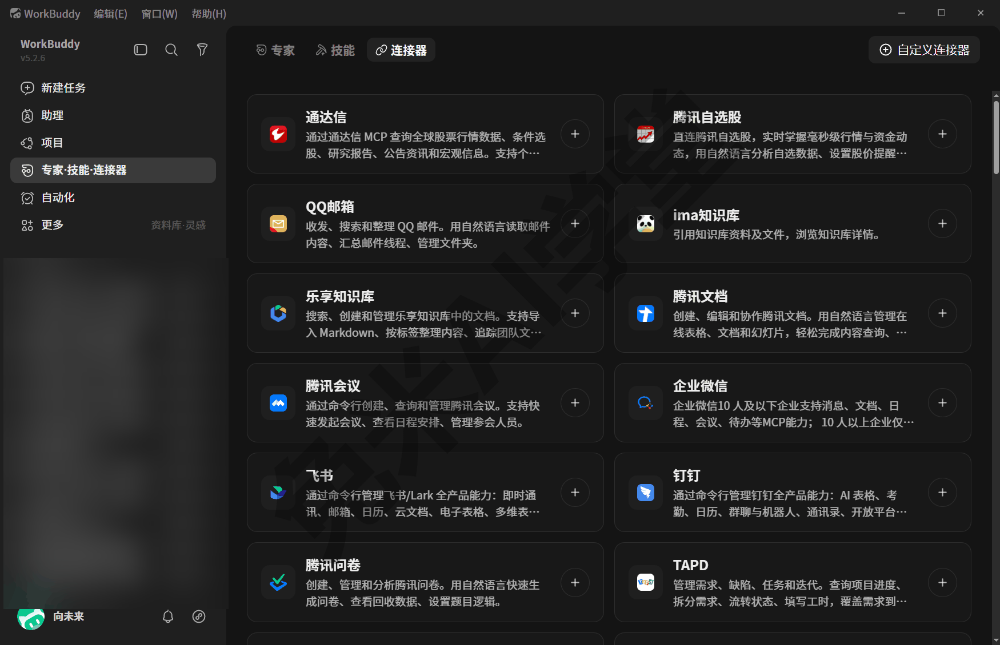

**常用办公系统基本都有。** 首屏这 12 款已经覆盖了多数人最常用的几类：邮箱（QQ 邮箱）、在线文档（腾讯文档）、在线会议（腾讯会议）、即时通讯与协作平台（企业微信、飞书、钉钉）、知识库（ima知识库、乐享知识库）、问卷（腾讯问卷）、项目管理（TAPD），还有面向投资场景的行情工具（通达信、腾讯自选股）。往下滚动还有不少，大致分四类：

- **办公协同**：金山文档、微云、EzyJoin智慧会议、Moka HR 智能体、销售易CRM、小鹅通；
- **数据与投研**：Wind 金融数据、恒生聚源 MCP、Gangtise投研、九数云BI、PandaData 金融数据；
- **法律与企业信息**：华宇元典法律数据、企查查·法律数据、启信慧眼、智慧芽专利&文献融合检索；
- **工具型**：腾讯地图、可灵 AI、八爪鱼、腾讯云 CloudBase，一直到列表尾部的微盟 WOS CLI、腾讯公益机构服务平台：

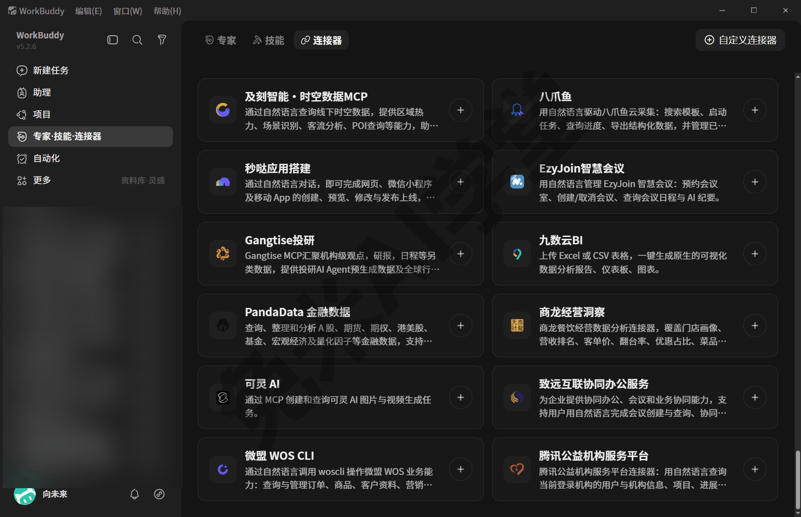

**规模有多大。** 2026-08-13 实拍时，市场从头滚到底约 40 款；这个数字会随版本更新变化，以你打开时的实际界面为准。挑的时候不必贪多：你真实在用的系统才值得接（怎么接、接了之后怎么管，见 7.3 与 7.5）。

**卡片上的“＋”。** 它和卡片本体都是这款连接器的接通入口：实测点开卡片会弹出简介弹窗，能力说明下方是“连接”按钮（7.3 有实拍图）。第一次操作时点开看看即可，进入授权环节前一般都可以退出来、不产生改变（以实际界面为准）。

**右上角的“自定义连接器”。** 点开它，弹出的是一个名为“MCP 服务管理”的对话框，副题写着“安装 MCP 服务，为 AI 扩展更多工具能力”，里面有搜索框、“配置 MCP”按钮和“MCP Hub”按钮；演示环境未添加过任何自定义服务，所以主体区域显示“暂无 MCP 服务器”：

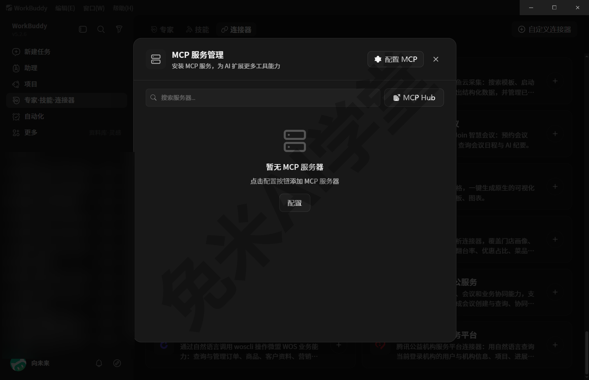

这个入口是给进阶用户准备的：市场里没有的系统，懂技术的人可以按 MCP 标准自行接入。点“MCP Hub”还会在窗口右侧滑出一个内嵌网页，陈列可接入的 MCP 服务（页面内容以实际显示为准）：

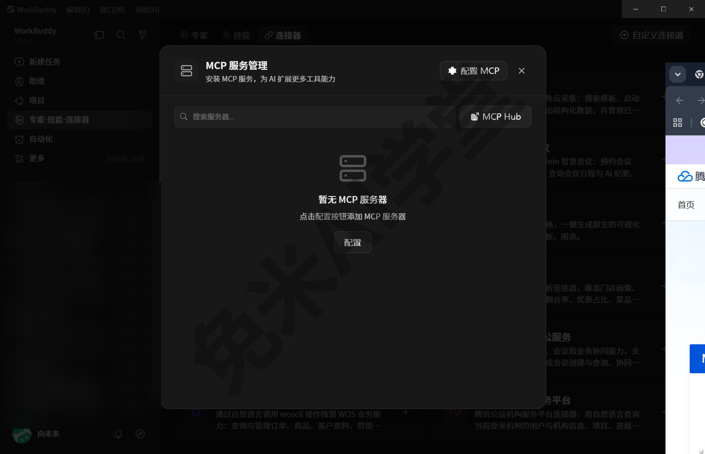

这个内嵌页展开看就是腾讯云开发者社区的“MCP 广场”，汇集官方与第三方 MCP 服务（实拍时仅“腾讯产品 MCP”一类就有 57 个）：

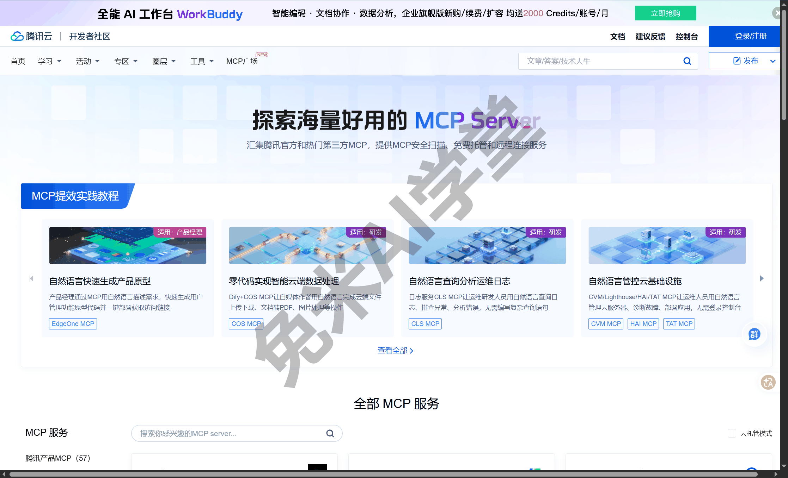

对普通读者来说，这个对话框知道在哪、叫什么就够了，市场里的现成连接器已经覆盖日常所需；它是干什么用的这个问题，文末“新手常见问题”里还有一条专门回答。

### 7.3 真实接通一个：以 QQ 邮箱为例

先交代本节口径：下面的流程是用真实账号接通 QQ 邮箱的实拍记录，关键步骤各配实拍图；你操作时界面与描述不一致的话，以你看到的页面提示为准，思路是一样的。

**为什么拿 QQ 邮箱举例。** 它是市场首屏就有的常用系统，简介写着“收发、搜索和整理 QQ 邮件。用自然语言读取邮件内容、汇总邮件线程、管理文件夹”；而且邮箱类的第一个需求往往是“读”（列个标题、找封邮件），不改动任何数据，最适合当第一次接通的练手对象。你惯用的如果是别的系统，把下面步骤里的名字换掉即可。

**动手前的两样准备。**

- 想清楚要接的是哪个账号——授权授的是具体账号，工作内容在哪个账号里就授权哪个；
- 把手机放在手边——QQ 邮箱的授权实测就是用手机上的“QQ 邮箱”App 扫码确认的（别的系统是否扫码，以实际页面为准）。

整个接通过程通常只需要做一次，之后同一台电脑上持续有效（是否会过期、要不要重新确认，以实际表现为准），不用每次调用前重复授权。

**第 1 步：找到它。** 打开“专家·技能·连接器”，切到“连接器”标签页，在列表里找到 **QQ邮箱** 卡片（首屏就有，见 7.2 的首屏图）。

**第 2 步：点开卡片，发起接通。** 实测点开 QQ邮箱 卡片，会弹出它的简介弹窗——图标、能力简介，下方一个“连接”按钮，点“连接”就是发起接通。这一步还没有动到你的账号，看清楚说明再继续：

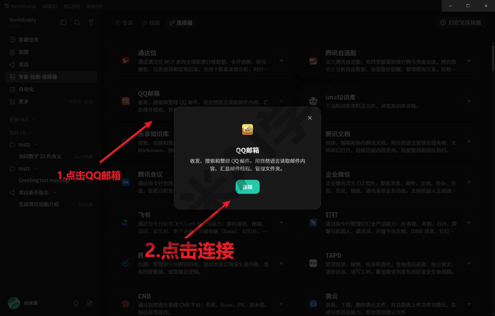

**第 3 步：在授权页上完成登录授权。** 实测这一步会跳转到 QQ 邮箱网页端的授权页，标题写着“WorkBuddy 申请访问邮箱”，用手机上的“QQ 邮箱”App 扫码确认：

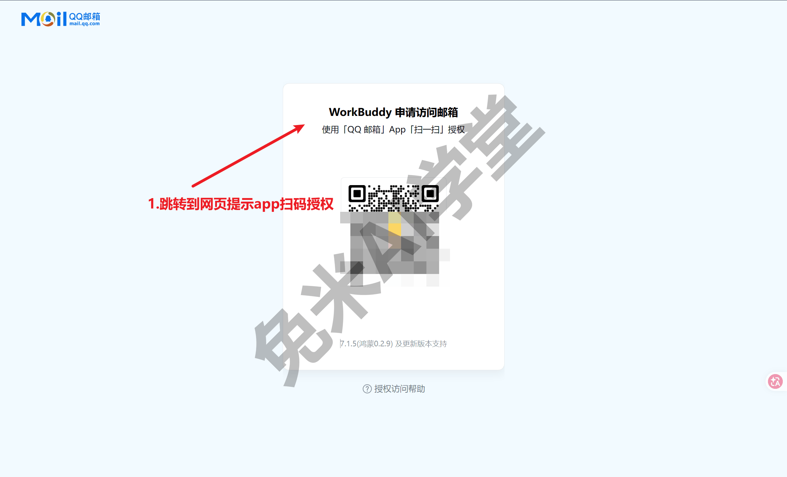

扫码确认后，页面显示“授权成功”，提示关闭页面返回 WorkBuddy；浏览器可能同时弹出“要打开 WorkBuddy 吗”的确认框，点“打开WorkBuddy”即可跳回客户端：

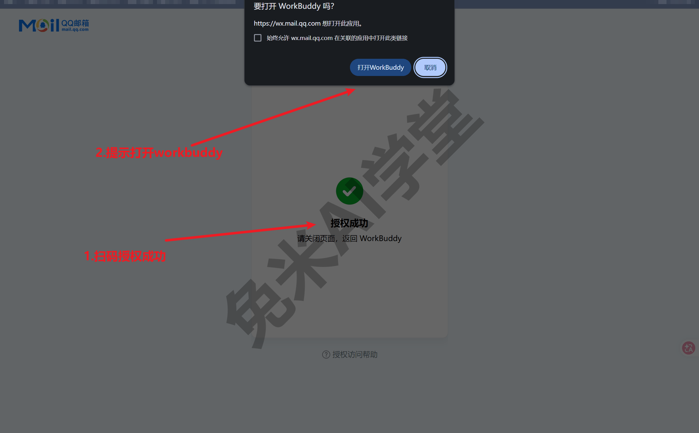

这一步的要点是：账号信息是在对应系统自己的页面上操作的，确认页面确实是你要接的那个系统的授权页再扫码；对不打算给的权限，授权页上通常也能看到范围说明，看一眼再确认。

**第 4 步：回到 WorkBuddy，确认接通状态。** 授权完成后回到客户端，实测在连接器市场里，QQ邮箱 卡片的名字旁多了一个绿色圆点，右侧的“＋”也变成了展开箭头——这就是接通成功的标识。看到它，这座桥就算搭好了，之后一般不需要每次重复授权：

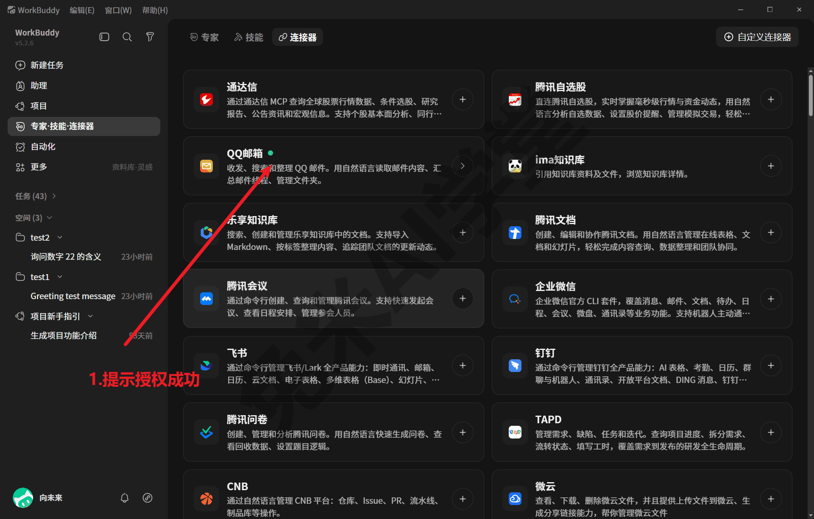

**没走通怎么办。** 授权中途关掉页面或超时，回到市场重新点一次即可，前一次一般不会留下半截状态（以实际表现为准）；扫码没反应，看一眼手机端有没有待确认的提示；授权页迟迟打不开，先确认网络正常再重试；反复失败时，把“接的是哪个连接器、卡在哪一步、页面提示原文”三样信息发进对话里问它，多数问题能当场定位。整个流程里唯一真正产生改变的是第 3 步的授权确认，其余每一步一般都可以随时退出、不改动任何东西——第一次操作尽可以放慢速度，每一步看清楚了再走下一步。

### 7.4 接通后能干什么

**在对话里直接调用。** 接通之后并不会多出一个要管理的东西，只是让你说话更省事：之后在对话里直接提需求，它会自行判断并调用对应的连接器完成读写，不需要你每次手动设置什么（以实际表现为准）。比如接通 QQ 邮箱后，可以这样说：

```
列一下我 QQ 邮箱里最近 3 封未读邮件的标题
```

再比如接通腾讯文档后：

```
把刚才这份要点整理成一页纪要，写进我的腾讯文档
```

发出去之后，它会在回复里带出真实的执行结果——邮件标题列表、写好的在线文档链接（能做到哪些、返回什么形态，以各连接器的实际能力为准）。和普通对话唯一的区别是内容来源：答案不再只来自它自己，而是来自你授权它访问的那个系统。

下面是接通 QQ 邮箱后这句指令的真实回复：3 封未读邮件的标题、发件人与时间逐条列出（收件邮箱等隐私信息已打码），其中第 1 封正是刚才第 3 步授权动作触发的系统通知，两件事正好互相印证：

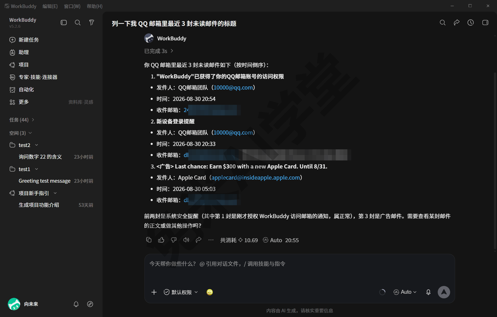

**能干什么，看它的简介。** 每款连接器能做的事，市场卡片的一句简介就是最好的说明书：QQ 邮箱写着收发、搜索、整理邮件与管理文件夹；腾讯文档写着创建、编辑和协作，用自然语言管理在线表格、文档和幻灯片；腾讯会议写着快速发起会议、查看日程安排、管理参会人员。你让它做的事落在简介范围内，一般都能直接说；超出范围的需求它做不了，这不是理解问题，而是那条通路本身没有这项能力。

**输入框里还有一个入口。**《快速上手》里认识过输入框左下角的“＋”菜单，里面除了“添加文件”，还有一项就叫“连接器”。按最可能形态，它用来在发消息前把某个连接器明确挂进当前对话（该项的具体交互需实机验证——成文时未点击过）。日常从直接说需求开始就够了，说不动时再试这个入口：

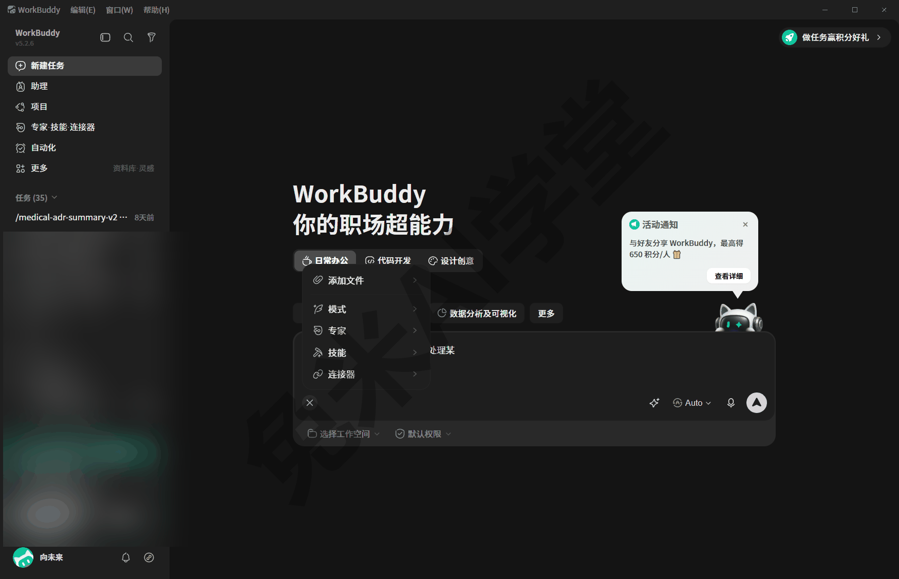

**接了多个系统，要不要指定用哪个。** 接通的连接器多了之后，直接说事，它会按需求选择对应的通路（以实际表现为准）；但在需求可能产生歧义时，比如你同时接了两个文档类系统，把系统名说进指令里（“写进我的腾讯文档”）总是更稳的做法，这与《技能：安装、管理与调用》里点名调用更稳的道理相同。

**没接通时是什么表现。** 没接通对应连接器就让它读在线内容，它无法访问——7.1 开头那张实拍就是这个表现：明说取不到，并引导你先接通。所以遇到“明明说得很清楚它却干不了”的情况，先想一下：这件事的内容是不是在某个还没接通的系统里。

**一个使用节奏的建议。** 从“读”类需求用起（列标题、查内容、搜记录），熟悉它的执行方式之后，再交给它“写”类任务（写文档、发内容）；重要的写入操作，第一次先拿不要紧的内容试一遍，点开它给回的链接核对结果符合预期，再正式投入使用。这与《任务边界与数据安全》里“什么能放手、什么要把关”的分寸是同一件事。

### 7.5 凭据安全与解绑

**授权之后，你的电脑里多了什么。** 每完成一次连接器授权，本机就会多一份凭据——相当于这个系统发给 WorkBuddy 的一张登录令牌，之后每次调用都凭它通行，一般不必再重复授权。凭据加密保存在本机全局数据目录的连接器区域（数据目录在哪，《数据、工作目录与记忆》讲过），同一目录里还有配套的本地加密密钥与状态文件；目录里的说明文件明确写着这些文件不可手工单独删除，重置必须回客户端操作。一句话概括：凭据由程序统一管理，你不需要、也不应该直接碰这些文件。

**三条凭据纪律。**

- **不外发、不截图。** 凭据与模型密钥同属敏感文件，落到别人手里，对方就能顶着你的身份进你授权过的系统。含凭据目录的画面不截图、不录屏外发；需要给别人展示屏幕时，避开数据目录里的配置内容。
- **不手工删文件。** 觉得某个连接器不想用了，不要去资源管理器里删它的凭据文件——上面说过，说明文件明示不可单删，手工删除可能让连接器状态出错。断开的正确方式见下面“解绑”。
- **换电脑不拷贝凭据。** 凭据加密绑定在本机，不会跟着项目文件夹或技能包走——把工作文件夹整个拷给别人、把技能包分享出去，都不会把你的授权一起带出去；这层隔离本身就是对你的保护。想在另一台电脑上用同样的连接器，在那台电脑上重新授权一遍即可。

**不用了怎么解绑。** 解绑在客户端里完成，按最可能形态分三步走：第 1 步，回到连接器市场（或已接通列表），找到目标连接器；第 2 步，在它的卡片或详情里找到断开、解绑一类的操作项（具体入口名称与位置需实机验证）；第 3 步，确认断开，之后本机的对应凭据由程序处理，它就再也进不了那个系统。做完可以顺手验证一下：在对话里再发一次原来能成的“读”类指令，比如

```
列一下我 QQ 邮箱里最近 3 封未读邮件的标题
```

这次得到的应当是无法访问的提示，说明解绑确实生效（提示形态以实际表现为准）。想再用时，重新走一遍 7.3 的授权即可。长期不用的连接器，顺手解绑掉是好习惯：通路只留真正在用的，哪些系统授权过一眼就能数清；每台电脑上的授权各自独立，这台解绑不影响别的电脑。

**留痕也替你看着这件事。** 连接器与 MCP 工具的授权另有独立的授权记录，加上《数据、工作目录与记忆》讲过的审计日志，接通过什么、什么时候用过，事后都有账可查。凭据、密钥这类敏感文件的完整清单，后面《任务边界与数据安全》13.4 有专门一节（那一篇还会给 API 密钥定下“不发聊天群、不截图外传、不写进共享文档”的三不原则），用到深处建议专门翻去读一遍。

### 7.6 练习任务

前两个任务只需要浏览界面、不改动任何状态；第三个任务涉及你本人账号的授权，自愿选做。方括号里的内容换成你自己的。

**任务一：逛一遍连接器市场**

打开左侧栏“专家·技能·连接器”，切到“连接器”标签页，从头滚到尾浏览一遍，挑出 3 款与你的日常工作最相关的连接器，逐条读完它们的简介。只浏览，不点击“＋”，不发起授权。

完成标准：能说出你挑的 3 款分别接的是什么系统、简介里写了哪些能力，并能说出这个市场大概有多少款连接器。

**任务二：找到“自定义连接器”入口**

在连接器市场页面右上角找到“自定义连接器”按钮，点开看一眼弹出的对话框，读一遍标题与副题，认一认里面的两个按钮，然后关闭对话框。只查看，不点“配置 MCP”，不做任何配置。

完成标准：能说出这个对话框叫什么名字（MCP 服务管理）、里面有哪两个按钮，并能用一句话说出这个入口是给什么人用的。

**任务三（选做，需要你的账号）：接通一个连接器并调用一次**

按 7.3 的步骤接通一个你在用的系统（建议从 QQ 邮箱这类“读”需求开始），完成后在对话里发送：

```
列一下我 [你接通的系统，如 QQ 邮箱] 里最近 3 封未读邮件的标题
```

完成标准：回复里出现你邮箱里真实的邮件标题；如果你没有做授权，能说出不接通时它的提示是什么样的。

### 7.7 本篇小结与自检

这一篇讲了连接器是什么、市场里有什么、怎么接通与调用，以及凭据安全与解绑。可以对照下面的清单检查学习结果：

- [ ] 分得清技能与连接器：技能管“会不会做”，连接器管“能不能访问”；内容在本机用不到连接器，内容在网络账号里要先接通
- [ ] 知道连接器市场在“专家·技能·连接器”的“连接器”标签页，约 40 款（2026-08-13 记录，以实际界面为准），常用办公系统基本都有
- [ ] 知道 MCP 是连接器背后的通用标准，“自定义连接器”打开的是“MCP 服务管理”对话框，属进阶入口
- [ ] 记得接通的四步：找到卡片→点开发起→在对应系统的授权页确认→回客户端看接通状态（以实际界面为准）
- [ ] 会在对话里直接调用已接通的系统，并知道没接通时它无法访问是边界不是故障
- [ ] 记住凭据三条纪律：不外发不截图、不手工删文件、换电脑重新授权；解绑回客户端操作

完成这些内容后，就可以进入《插件市场：现成能力一站取用》——认识第三个扩展来源，把打包好的现成能力直接拿来用。

### 7.8 新手常见问题

**Q1：授权安全吗？**

授权动作发生在对应系统自己的授权页上，你确认的是“允许 WorkBuddy 访问哪些内容”；授权产生的凭据加密存在你本机的数据目录里，由程序统一管理，教程与截图也全程不展示这类文件的内容。两个习惯能让它更稳妥：授权时看一眼页面上的权限范围说明再确认；含凭据目录的画面不截图外发。剩下的交给 7.5 的三条纪律即可。

**Q2：会不会乱动我的系统？**

它能动的范围由两层东西框住：一是你授权时确认的权限范围，二是这款连接器本身的能力（卡片简介写明的那些）。范围之外的事它做不了；范围之内的写入类操作，建议按 7.4 的节奏——先用“读”类需求熟悉它，重要的写入先拿不要紧的内容试一遍。对边界还想扣得更细，《任务边界与数据安全》整篇都在讲这件事。

**Q3：不用了怎么断开？**

回客户端里对那个连接器做解绑（入口按最可能形态在卡片或详情里，以实际界面为准），不要去数据目录里手工删凭据文件——目录里的说明文件明确写了不可单删。解绑之后它就无法再访问那个系统；以后想再用，重新授权一遍就好。

**Q4：“自定义连接器”是给谁用的？**

给进阶用户和懂技术的读者：市场里没有收录的系统，可以按 MCP 标准自行接入，入口就是那个“MCP 服务管理”对话框（配置 MCP、MCP Hub 都在里面）。普通读者用市场里的现成连接器就完全够了，这个入口知道在哪即可，不需要研究，也不用担心误碰——不做配置就不会有任何改变。
