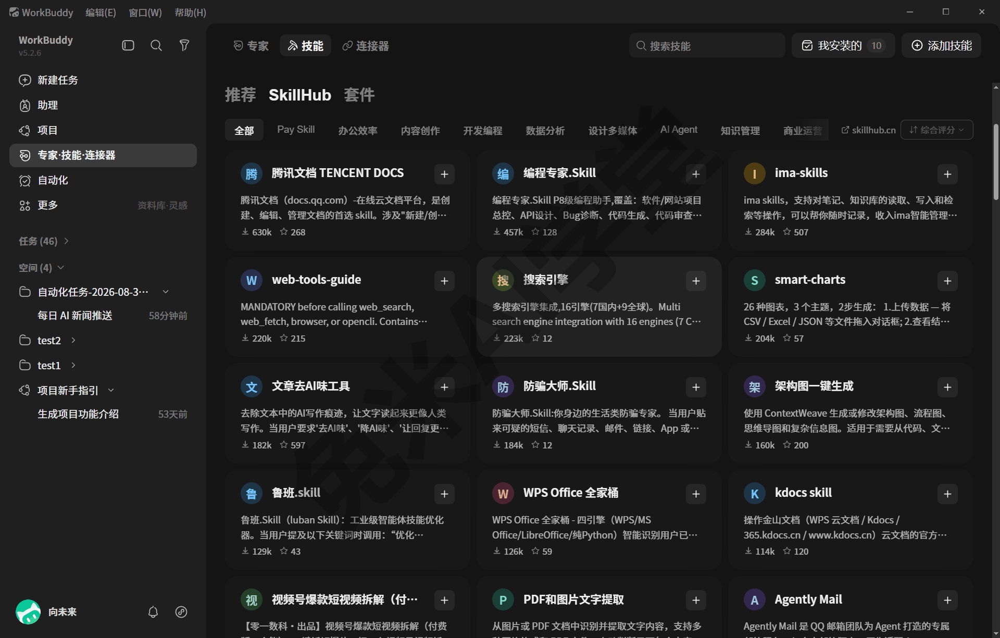
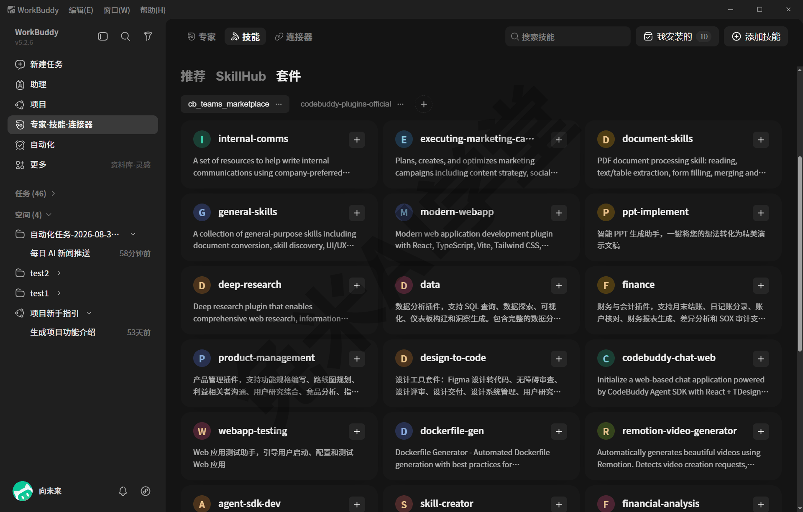
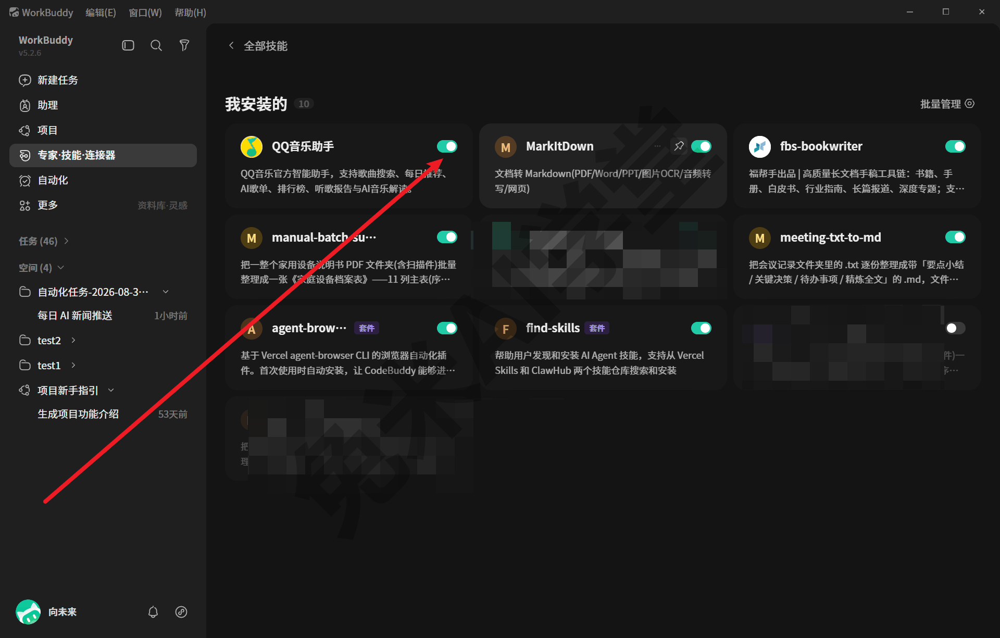
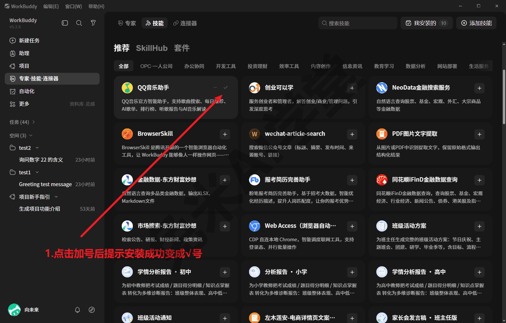
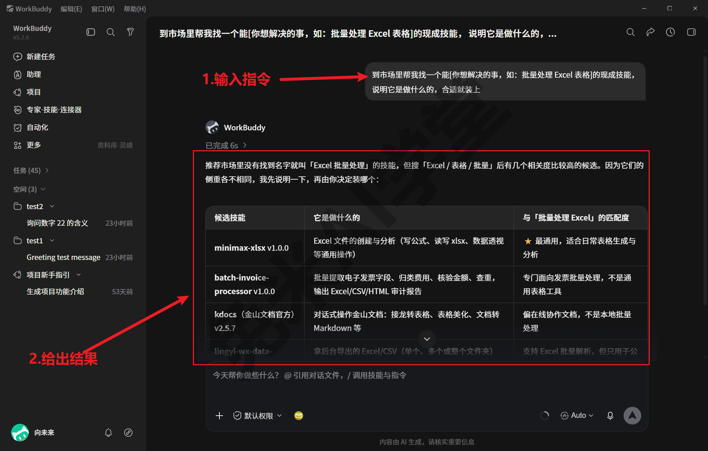
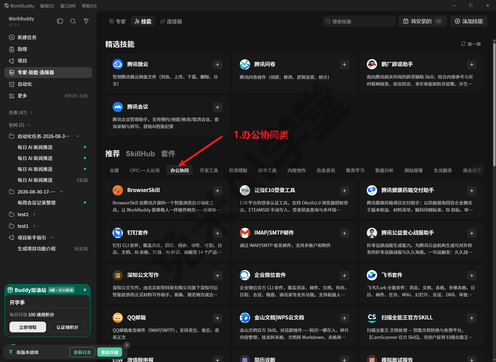
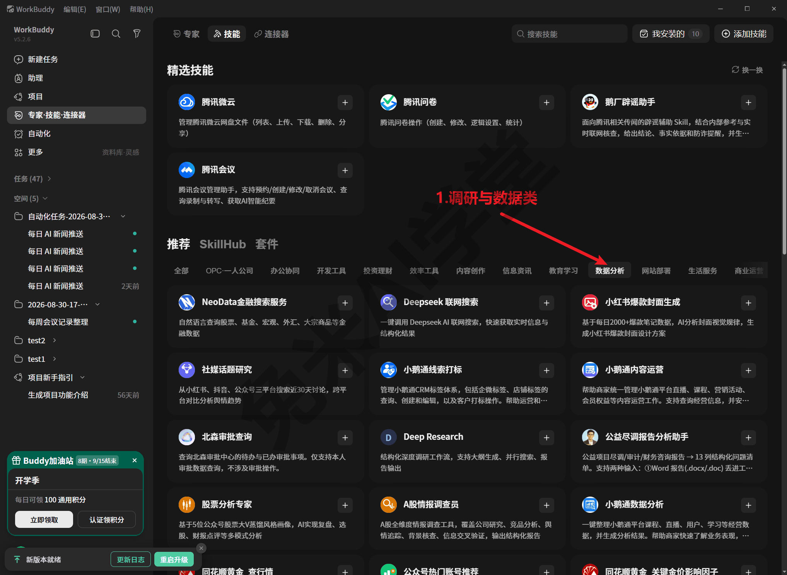
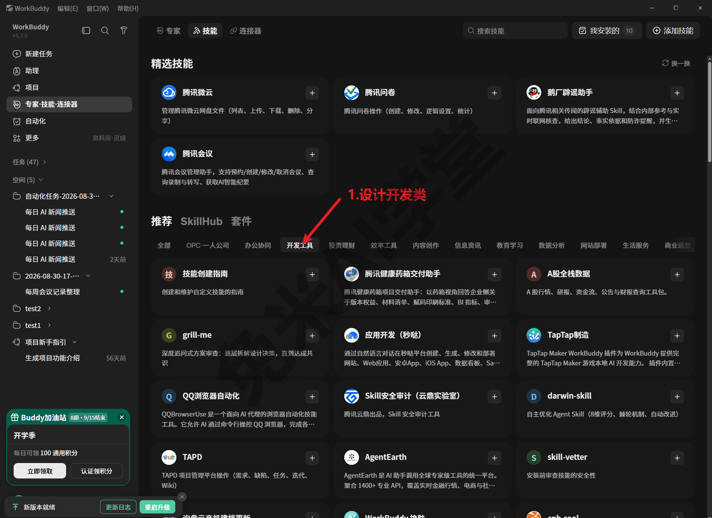
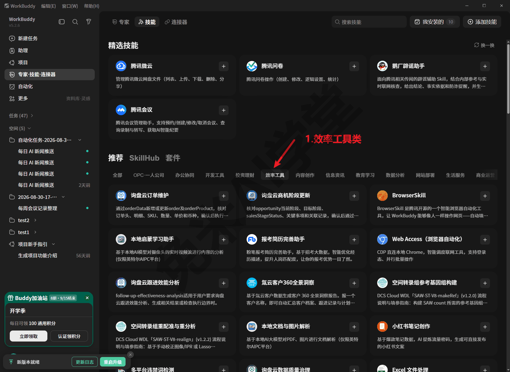

# 插件市场：现成能力一站取用

前面几篇里你已经会安装技能、接连接器了。这一篇介绍第三个扩展来源：插件市场——由官方维护、自动更新的现成能力货架，文档处理、深度调研、表格代理这类打包好的能力可以直接取用，不必自己从头搭。

---

### 8.1 两个内置市场

**插件是什么。** 在 WorkBuddy 里，插件可以理解为“打包好的现成能力”：多数以技能或技能组合的形式发布，装进来就能在对话里直接用，不需要你自己写流程、配脚本。它和你在《技能：安装、管理与调用》里手工安装的单个技能很接近，区别在于来源——插件来自官方维护的市场货架，成体系、自动更新。

**为什么需要它。**《自制技能：把流程沉淀成一句话》教你把自己的流程沉淀成技能，但很多通用需求根本不必自己造：处理 Excel、转换文档格式、做深度调研，这些别人早就打包好了。市场的价值就是“一站取用”：先逛货架，货架上有的直接拿，没有的再考虑自制。

**本机内置了两个市场源。** 成文时核对，WorkBuddy 出厂即内置两个自动更新的插件市场：

- **精选市场**（团队协作与文档处理方向，约 29 项）：面向办公场景做过筛选，代表项包括文档技能包（打包了 Excel、Word、PPT、PDF 处理等一组能力）、通用技能包（文档格式转换、技能查找、界面与前端设计等）、深度调研、表格代理、数据与金融分析、演示文稿制作、现代网页应用、设计稿转代码，以及 A 股分析、交易智能体这类投研方向的条目；
- **官方大市场**（约 200 项）：范围广得多，既有腾讯系产品的对接插件（腾讯文档、腾讯位置服务、乐享知识库、微信小游戏助手、云开发等），也有大量面向开发者的通用插件（代码检查、安全、持续集成、前后端开发等）。

两个数字都取自 2026-08-13 的市场清单；清单由程序自动更新，你看到的条目数会随时间变化，以实际界面为准。顺带一提，这两个市场与腾讯 CodeBuddy 产品生态同源，市场里不少条目也因此带着开发者工具的背景。

**它和技能市场、连接器市场是什么关系。**《技能：安装、管理与调用》讲过技能市场（SkillHub），《连接器：把办公系统接进来》讲过连接器市场，加上本篇的插件市场，看起来是三个“市场”，容易混淆。可以这样区分三者的分工：

- **技能市场** 提供单个技能，解决“它会不会做某类事”；
- **连接器市场** 提供外部系统的通路，解决“它能不能访问某个系统”；
- **插件市场** 提供打包好的能力集合（多数最终也以技能形式落地），解决“常见需求有没有现成整包”。

要留意的是，插件市场在界面上**不是一个独立页面**：成文时核对过侧栏“更多”菜单，里面没有任何“插件”类入口；市场内容并入了技能页——推荐区带有“SkillHub”与“套件”两个二级页签，“套件”就是市场里成组能力的展示位（见 8.2）：



也就是说，逛插件市场不需要找一个新地方，就在你熟悉的“专家·技能·连接器”页里，下一节展开。

### 8.2 逛市场与装插件

本节的入口与安装交互均按实拍写出；界面细节随版本可能微调，若与你看到的略有不同，以界面为准即可，思路是一样的。

**路径一：在“专家·技能·连接器”页里逛。** 打开左侧栏“专家·技能·连接器”，切到“技能”标签页，这里就是上一节看过的 SkillHub：顶部是“精选技能”推荐位，下方“推荐”区带“SkillHub”与“套件”两个二级页签，配有分类筛选行。市场里的单项能力混在 SkillHub 技能卡片流里，成组打包的能力（如文档技能包）在“套件”页签下展示——切到“套件”，顶部并列的正是 8.1 讲的两个市场源，下方就是成组能力的卡片列表：



这个货架和技能市场同在 SkillHub 页，体量不小、一时逛不完。逛的时候不必从头看到尾，先用顶部的分类筛选行圈定门类，再在门类里细看；也可以直接在页面里搜关键词（搜索入口以实际界面为准）。每张卡片通常带一句能力简介，点开还能看到更完整的说明，看简介就能过滤掉大半不相关的条目。

**看中了怎么装。** 卡片右上角有一个加号，点一下即完成安装，按钮随即变成对勾表示装好了；装好的能力会出现在技能页右上角“我安装的”列表里，可以启用或停用（点开卡片还能先看更完整的说明，详情页里的安装形态以实际界面为准）：





**路径二：在对话里直接说需求。** 不想逛货架，也可以让它替你逛：在对话里直接说出想要的能力，让它到市场里找并安装。产品出厂自带的技能里就有一个“市场技能安装器”（出厂清单见《技能：安装、管理与调用》5.2），专门负责按需求到市场里找能力、装能力；演示环境的使用记录里也真实出现过“技能查找”这类市场工具的调用痕迹。发送的指令类似下面这样（方括号里的内容换成你自己的）：

```
到市场里帮我找一个能[你想解决的事，如：批量处理 Excel 表格]的现成技能，
说明它是做什么的，合适就装上
```



它会答复找到了什么、是否安装（具体应答形态以实际表现为准）。这条路径对新手更友好：不需要知道货架在哪里，说清楚要解决什么事就行。

**装完怎么用。** 市场装来的能力用法与普通技能一致：对话里点名，或用 `/技能名` 直接调用，流程固定的工作建议每次点名（详见《技能：安装、管理与调用》）。装好后第一次用，建议先拿一件不要紧的小事试一遍，确认它的做事方式符合预期，再用在正式任务上。另外，市场能力的每次调用也会留下使用痕迹：全局数据目录的使用统计里记录着每个技能的首次与最近使用日期（留痕体系见《数据、工作目录与记忆》），忘了某个插件自己到底用没用过，翻这份记录或直接问它都能得到答案。

**不想要了怎么办。** 到“我安装的”里停用或移除（移除入口以实际界面为准）。停用是可逆的，拿不准就先停用观察几天，确认不需要再移除。

### 8.3 有什么值得装

市场条目会变，本节不列固定清单，只按门类给一份速览（门类取自技能页分类筛选行，代表项取自 2026-09-02 的界面实拍），再给出挑选的判断方法。

**办公协同类，办公场景第一优先。** 分类筛选行切到“办公协同”，聚着最常用的办公能力：金山文档、公文写作、扫描件处理这类文档条目，以及钉钉、企业微信、飞书、QQ 邮箱这样的办公系统套件。成组打包的文档技能包、通用技能包则在“套件”页签（8.2 看过），一次打包了 Excel、Word、PPT、PDF 的处理能力。这类能力使用频率最高、上手也最容易，值得最先了解。演示环境里真实用过其中几样：Excel 表格处理、PDF 文献摘要、Word 流程图，都是从市场装来就直接能用的；哪一样什么时候用过，技能使用统计里都有记录可查——这份统计在哪、怎么看，《技能：安装、管理与调用》讲过。



**调研与数据类，适合要写报告的人。** 分类筛选行里对应“数据分析”门类：深度调研（Deep Research，多来源检索并整理成结构化材料）、联网搜索、社媒话题研究、金融搜索与股票分析这类条目，面向“收集材料、整理数据、出分析结论”的场景。这类能力通常要配合较强的模型使用，任务本身也更消耗额度，先拿小任务试水（模型选择与费用口径见《模型与费用》）。



**设计与开发类，按需取用。** 分类筛选行里对应“开发工具”门类：用自然语言生成应用的秒哒、项目管理的 TAPD、浏览器自动化、技能创建与安全审计这类条目，主要面向开发者；8.1 提过的演示文稿制作、现代网页应用、设计稿转代码等产出型能力则在精选市场里。不写代码的读者可以略过这部分，知道有即可。



**效率工具类，杂而实用。** 分类筛选行的“效率工具”门类收着各路通用小工具：Excel 文件处理、本地文档与图片解析、浏览器自动化，也有客户跟进、违禁词检测这类专门条目。前面几个门类没找到的，这里常能补上；拿不准某个条目做什么，读一遍卡片简介就能判断。



**腾讯系对接类，配合连接器看。** 官方大市场里有腾讯文档、腾讯位置服务、乐享知识库、云开发等对接插件，技能页顶部的精选技能区也能看到腾讯微云、腾讯问卷、腾讯会议这几张卡。要提醒的是，涉及读写你在线账号里内容的能力，通常还需要先完成对应系统的授权接通，这部分机制在《连接器：把办公系统接进来》里讲，装了插件不等于自动有了访问权。

**挑选的三步判断。** 面对几百个条目，按这个顺序想：

1. **先想清楚要解决什么事，再去找对应门类**，而不是看什么新鲜装什么。说不清楚要解决什么，多半装完也不会用；
2. **优先逛精选市场**：约 29 项都经过面向办公场景的筛选，命中日常需求的概率比在约 200 项的大市场里翻找高；大市场适合精选市场里找不到、目标又很明确的场景；
3. **装前读一遍条目说明**：确认它做的事、要求的环境（是否需要额外授权、依赖哪类模型）与你的预期一致，再动手装。

**少而精的原则。** 能力不是越多越好：装得多，它在选择用哪个能力时的干扰也多，你自己也容易忘记装过什么。建议保持“我安装的”列表在十个以内、都是常用项，长期不用的及时停用（这也是 8.6 问 2 的答案）。最后提醒一句，市场清单由程序自动更新，隔一段时间再逛会看到新条目；本节的门类速览可能过时，但上面这套“先想清楚要解决什么、优先精选市场、装前读说明”的挑选方法仍然适用。

---

### 8.4 练习任务

下面三个任务帮你把本篇内容亲手过一遍，建议按顺序做。方括号里的内容换成你自己的。界面细节随版本可能微调，任务一、任务三如与你的实际界面不符，以界面为准，思路不变。

**任务一：逛一遍市场，认识门类**

打开左侧栏“专家·技能·连接器”，切到“技能”标签页，从上往下浏览推荐区：看看“SkillHub”与“套件”两个二级页签下各有什么，用分类筛选行切换两三个分类，感受各门类下都有哪些条目。只浏览，不安装。

完成标准：能说出至少三个门类（如办公协同、数据分析、开发工具），并各举出一个你在页面上真实看到的条目。

**任务二：让它替你逛市场**

在对话里发送下面的指令，体验“说需求、让它去找”的路径：

```
到市场里帮我找一个能[你想解决的事]的现成技能，
先说明它是做什么的、适不适合我，暂时不要安装
```

完成标准：收到它的答复，能复述它推荐了什么、为什么推荐；本任务特意加了“暂时不要安装”，让你先练“只问不装”。

**任务三：盘点“我安装的”**

打开技能页右上角的“我安装的”，逐项看一遍当前列表：每一项是什么、最近是否用过、处于启用还是停用状态。如果有你确认不再需要的项，把它停用（停用可逆，暂不移除）。

完成标准：能说出自己列表里每一项的用途与启停状态；列表为空也算完成，说出“以后装了到哪里管理”即可。

### 8.5 本篇小结与自检

这一篇讲了插件市场是什么、两个内置市场源的分工、逛市场与装插件的两条路径，以及按门类挑选的判断方法。可以对照下面的清单检查学习结果：

- [ ] 说得出插件与技能、连接器的分工：插件是打包好的现成能力集合，技能解决“会不会做”，连接器解决“能不能访问”
- [ ] 知道本机内置两个自动更新的市场源：精选市场约 29 项、官方大市场约 200 项（2026-08-13 记录，以实际界面为准）
- [ ] 知道逛市场的两条路径：技能页浏览安装（单项能力在 SkillHub 卡片流，成组能力在“套件”页签），或在对话里直接说需求让它去找
- [ ] 记得装完的能力在“我安装的”里管理，用法与普通技能一致，第一次先拿小事试
- [ ] 记得挑选三条判断：先想清楚要解决什么、优先精选市场、装前读说明；保持列表少而精

完成这些内容后，就可以进入《助理、专家、项目与灵感》：把主界面剩下的几个入口一次看全，知道每个入口什么时候用得上。

### 8.6 新手常见问题

**Q1：插件、技能、连接器到底怎么区分？**

按“它给你补什么”记最清楚。技能补的是**做事方法**：一份说明书加工具包，教它完成某类专门工作；连接器补的是**访问通路**：接通之后它才能读写你在外部系统（如在线文档、邮箱）里的内容；插件补的是**现成能力的来源**：官方市场里打包好的能力集合，装下来多数也以技能的形式出现在“我安装的”里。三者不冲突，常常配合使用：装一个对接在线文档的插件（来源），可能还需要接通对应连接器（通路），最终在对话里像技能一样调用（方法）。

**Q2：装多了会乱吗？**

会有影响，但可控。装得越多，它理解你意图时的候选越多，你自己也越容易忘记装过什么、哪个版本。三个习惯能避免乱：常用的保留、长期不用的在“我安装的”里停用（可逆，随时能再启用）；流程固定的工作在对话里点名要用哪个技能，不让它自由发挥；定期像本篇任务三那样盘点一遍列表。保持列表少而精，十个以内是个合适的参考线。

**Q3：我在界面里找不到叫“插件市场”的入口，正常吗？**

正常，成文时核对的结果就是如此：侧栏“更多”菜单里没有“插件”类入口，市场内容并入技能页呈现——单项能力混在 SkillHub 卡片流，成组能力在“套件”二级页签。所以找不到独立入口不影响使用：直接去“专家·技能·连接器”的技能页逛，或者在对话里说出需求让它去市场里找。若你的版本界面有独立的插件入口，以实际界面为准。

**Q4：装了一个插件，用的时候没反应怎么办？**

按三步排查。先到“我安装的”确认它处于启用状态，停用状态的能力不会被调用；再在对话里点名调用一次（说出确切名称，如“用 [插件里的技能名] 处理……”），不点名时它可能选了别的方式做事；还不行就点开该条目的说明读一遍，确认是否有前置要求——有的能力需要先接通对应连接器或配置模型，缺了前置条件自然没反应。逐条核对后仍失败，把“装了什么、发了什么指令、它回了什么”三样信息带上，在对话里直接问它原因，多数问题能当场定位。
