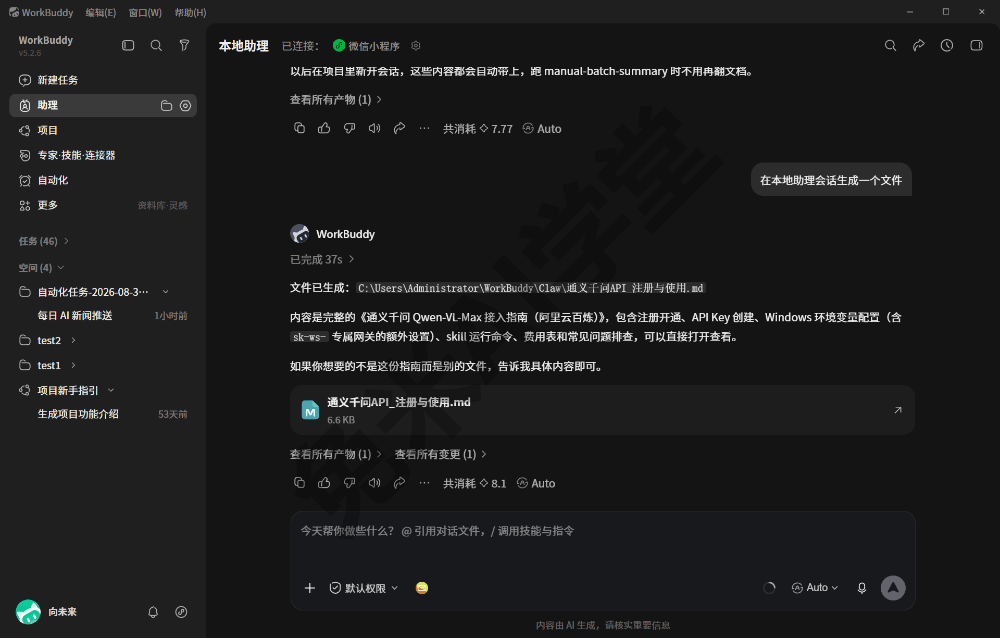
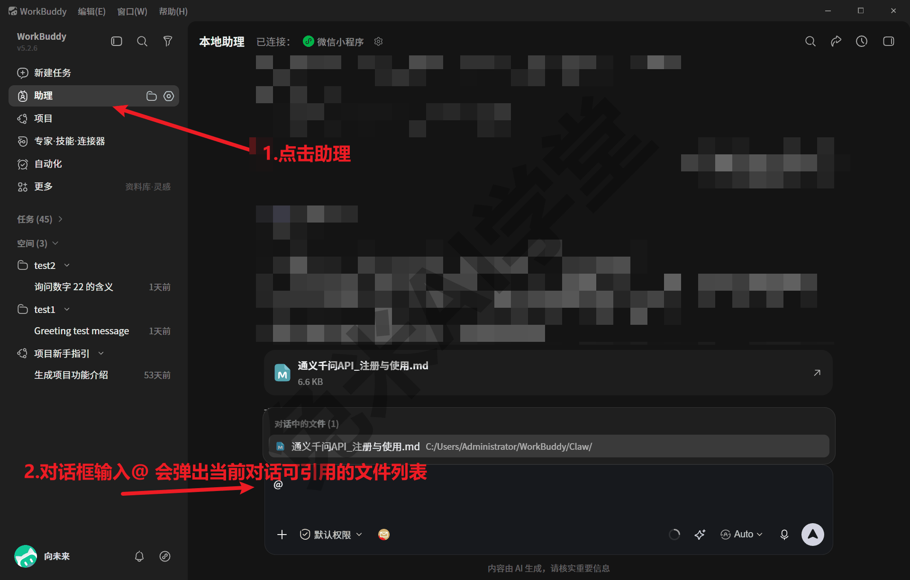
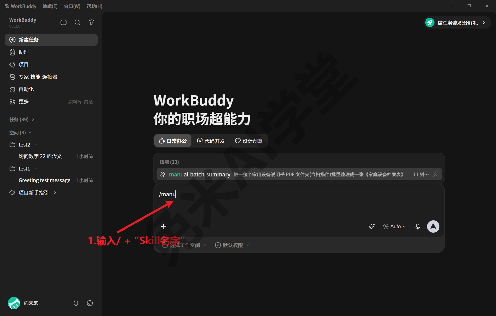
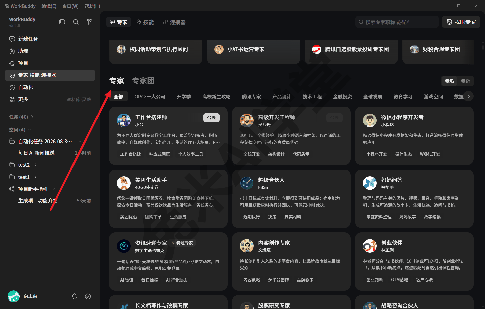
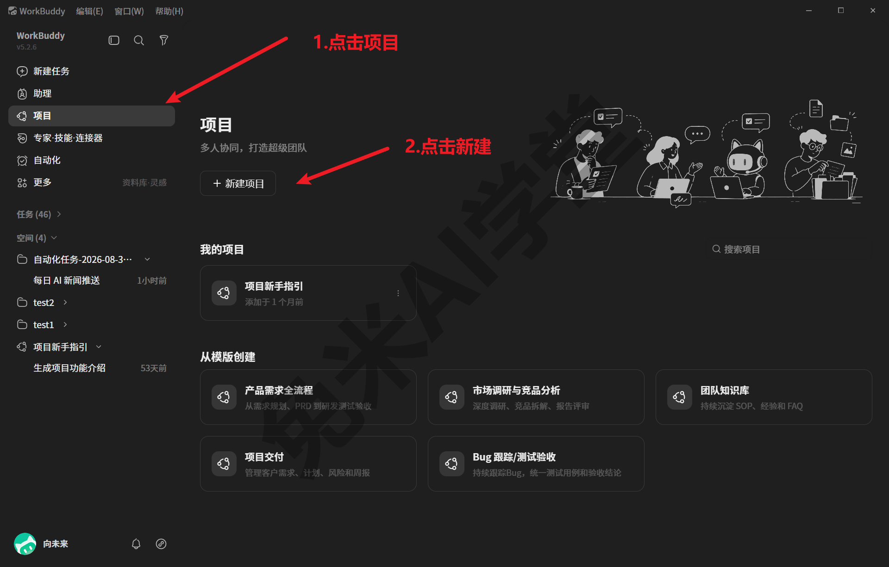
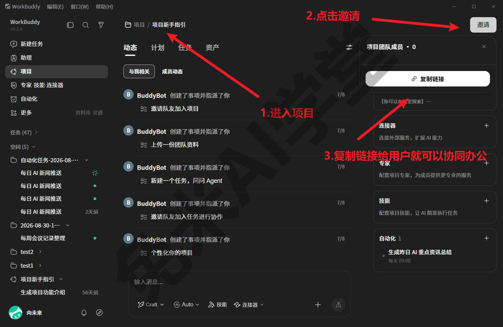
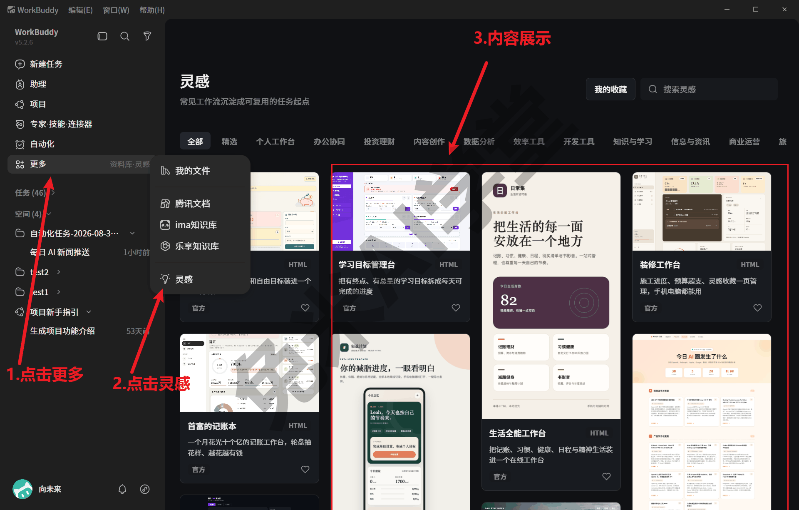
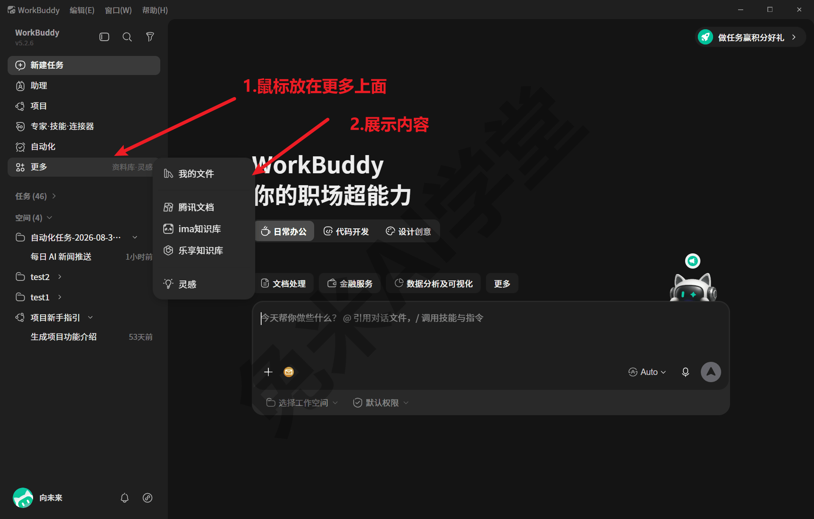
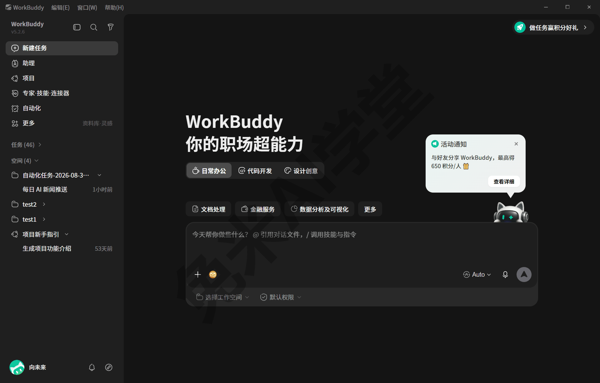

# 助理、专家、项目与灵感

到这一篇为止，对话、文件、技能这些主力功能你都已经认识了。主界面左侧其实还有几个一直没进去过的入口：助理、项目，“专家·技能·连接器”页里的专家标签，以及“更多”菜单和它旁边的灵感页。这一篇把这几个入口逐个看一遍，讲清每个是什么、和你已学过的功能是什么关系、什么时候用得上。本篇截图均在 WorkBuddy 5.2.6 上实拍，你看到的界面可能略有差异，以实际界面为准。

### 9.1 助理

左侧边栏第二个入口叫“助理”。第一次点开的人多半会疑惑：这不就是又一个对话框吗，和“新建任务”有什么区别？这一节把这对容易混淆的入口讲清楚。

先看页面本身。助理页就是一条对话：上方是对话区（第一次打开是空的，用过之后这里留着你和它的往来记录），下方一个输入框，头部显示着“已连接：微信小程序”；输入框空着时的占位文案写着：“今天帮你做些什么？@ 引用对话文件，/ 调用技能与指令”，输入框下沿同样有“默认权限”入口（权限机制在《任务边界与数据安全》专讲）：



**助理和“新建任务”的区别，可以用三条对照记住：**

- **会话形态不同。**“新建任务”一次开一个任务，做完留档，任务列表里一条条排着，随时点开旧任务接着聊（《快速上手》讲过）；助理则是一条常驻对话——不分任务、一直都在，像一个随叫随到的常驻窗口；
- **记忆的归属不同。** 任务里的项目记忆跟着项目文件夹走（《数据、工作目录与记忆》讲过）；助理自己另有一份长期记忆文件，还配着一套身份档案（名字、性格这些人格化设定，机制同样见《数据、工作目录与记忆》的身份文件一节）；
- **触达方式不同。** 任务只能在电脑上发起；助理可以接入消息渠道——演示环境的助理页头部就显示着“已连接：微信小程序”。从本机配置看，演示环境启用过微信公众号类的消息渠道，且默认只允许腾讯系通道接入。接入方法本教程未实操，机制知道即可，具体以实际界面为准。

日常怎么分工？一般的用法是：正式的、要产出文件、要留档回溯的工作，走“新建任务”；随手问答、临时小事、想在手机侧顺手问一句的场景，交给助理。两个入口不冲突，用久了自然会形成自己的习惯。演示环境的使用痕迹也印证这个分工：任务侧栏留着几十条历史任务，正式的批量处理工作全部走的是任务，而不是堆在助理那条对话里。

还要说明一点：助理并不是“只能闲聊的简化版”。它同样能调用技能（占位文案里的 / 就是证据），也同样受权限机制约束——输入框下沿那个“默认权限”入口与新建任务页是一致的。主要的差别在留档形态：任务一件一档、列表里好翻好找，助理是一条长流水，回头找某次产物远不如任务列表方便。这也是“正式工作走任务”这条建议的实际依据。

**再看占位文案提示的两个快捷入口。** 输入框自述了 @ 与 / 两个符号的用途：@ 引用对话文件，/ 调用技能与指令。两个符号的用法如下：

- 键入 **@**，会弹出“对话中的文件”列表，列出当前对话里可引用的文件，选中后这份文件会当作背景材料交给助理；
- 键入 **/**，会弹出技能与指令的浮层列表，继续输入即可过滤，每个条目都带着自己的触发说明，选中即挂进当前对话（技能调用的完整讲解见《技能：安装、管理与调用》）。



键入 / 后的弹层实拍如下（摄于新建任务页输入框，助理页为同一套输入组件，以实际界面为准）：



这两个符号不必现在记住，练习任务里会让你各试一次。读完这一节，你只要能回答“助理和新建任务有什么不同、我该在什么时候用哪个”，就够了。

### 9.2 专家

有些工作，你需要的不只是一个技能，而是一个“懂行的角色”：懂这个领域的说法、按这个行当的规矩做事。专家入口对应的就是这类需求。

入口在“专家·技能·连接器”页的“专家”标签（技能与连接器两个标签你已经分别在《技能：安装、管理与调用》《连接器：把办公系统接进来》见过）。页面上半是精选推荐位——实拍当天推荐着小红书运营专家、股票投研专家团、财税合规专家团这类条目，推荐内容会随运营变化；下半是“专家/专家团”列表，带一行分类筛选（全部、产品设计、技术工程、金融投资、教育学习等，实拍还见到开学季这类应季分类），右上角有搜索框和“我的专家”入口：



**专家是什么？** 可以把它理解成打包好的“角色包”：一个专家自带定位、工作方法和配套能力，请进来就按它的方法帮你做事。出厂技能清单里就有一个专门负责专家包创建、修改与检查的技能（expert-manager，见《技能：安装、管理与调用》的出厂清单），可见专家在产品里同样是一种可创建、可管理的“包”。专家团则一般是围绕一类场景把多个专家编成一组，具体构成以页面介绍为准。

**和技能怎么区分？** 用一组对照：

- **技能**：你主导流程，它提供某类工作的方法与工具，装在本地、按需唤起；
- **专家**：把整个角色请进来，定位、口吻、流程都是打包好的，适合“我不熟这个领域、想要一个现成行家”的场景。

**怎么用起来？** 按最可能形态：在列表或精选推荐位里点开一个专家查看详情，按页面提示添加或直接使用，添加过的一般会出现在右上角“我的专家”里，之后从那里再次发起最顺（详情页形态、添加按钮名称与发起对话的方式需实机验证）。第一次逛不知道从哪下手的话，给一条浏览路线：先看顶部的精选推荐位，从你最贴近的条目点进去感受专家长什么样；有明确目标再用分类筛选按职能收窄，或直接用右上角搜索。

要交代清楚的是：本教程成文时只浏览了页面、没有实际添加或使用过任何专家，所以这一节不给“效果如何”的结论，只负责让你知道这个入口是什么、去哪里找、怎么开始试。你自己的第一次尝试，建议拿一件不重要的小事试水，观察它的回答方式与你的预期差多远，再决定是否用在正式工作上。

两条使用提醒：

- 专家输出的仍是 AI 的工作成果，该人工把关的照旧人工把关，《任务边界与数据安全》的边界结论对专家同样适用；
- 是否收费、如何计费，页面浏览未见统一标注，以专家详情页与官方说明为准（积分与模型费用的通用机制见《模型与费用》，FAQ 里再补一句）。

### 9.3 项目

一个人用顺了之后，常见的下一个问题是：能不能和别人一起用？左侧边栏的“项目”就是为这类需求准备的入口。

点开项目页，上半是“我的项目”，下半是“从模版创建”，实拍当天提供五个现成模板：



五个模板从名字就能看出各自面向的场景，逐个一句话（模板的具体内容以页面说明为准）：

- **产品需求全流程**——面向做产品的团队，从需求收集、整理到评审落地一条线的协作场景，适合需求来源杂、要多人反复对齐、口头需求满天飞的情况；
- **市场调研与竞品分析**——调研类工作的资料归集与分析协作，多人分头收集材料、汇到一处出结论的场景用它起步最顺，材料和结论都归在一处不散失；
- **团队知识库**——把一组人的共用资料、口径与结论沉淀在一处，新成员进来先读它，老成员随手往里存；
- **项目交付**——面向对外交付的场景，进度、产物与验收材料归拢管理，交付口径不再散落在各人手里；
- **Bug 跟踪测试验收**——研发向场景，报障、跟进、复测到验收走一条流水，谁提的、修没修一目了然。

**项目和你已经认识的两个概念划清界线：**

- **和任务的区别**：任务是一个人一次事，做完归档；项目是一组人围绕一件事的持续协作，任务可以发生在项目里；
- **和空间的区别**：空间是把本地文件夹绑定成固定入口、让它每次都在这个文件夹里工作（《数据、工作目录与记忆》讲过，演示环境实拍侧栏挂着 2 个空间）；项目则是面向协作的组织形式，重心在“人和分工”，以实际功能为准。

**多人协作怎么跑起来？** 第一步是把人请进来：进入项目后，右上角有“邀请”按钮，点开会弹出“项目团队成员”面板，用“复制链接”把邀请链接发给对方，对方加入后就能在同一个项目里协同办公：



完整的协作流需要第二个人参与，本教程的演示环境是单人环境、未走通全程，后续环节按最可能形态写全供你按图索骥：成员进入后在项目里共享资料、分派与认领任务（成员角色与共享范围需实机验证）。第一次试用建议拿一件不要紧的小事练手，跑通“建项目—拉人—各干各的—看彼此产出”这一圈，再往正式工作上搬。

什么时候值得开一个项目？给三个信号，占其一就可以考虑：

- 同一批材料在几个人之间反复传来传去，谁手里是最新版已经说不清——这正是“团队知识库”模板面向的典型状况；
- 几个人各自在做同一件事的不同部分，彼此的进度与产出互相看不见，对齐全靠开会问一圈；
- 需要对外统一交付口径，散落在各人任务里的产物要归拢成一份，且以后还会有下一次同类交付。

反过来说，单人使用阶段可以完全不碰这个入口——项目不影响任何已学功能，你的任务、技能、工作目录都照常运转。等上面的信号真出现了，再回来启用也完全来得及。

### 9.4 灵感

还有一类时刻：你知道 WorkBuddy 能干很多事，但一时不知道让它干什么、从哪开头。侧栏的“灵感”页就是给这种时刻准备的。



**灵感页是一个“任务起点模板”市场。** 每个条目是一个现成的任务起点：把别人验证过好用的任务想法做成模板，你挑一个感兴趣的，就能以它为起点开始自己的任务。实拍当天页面上陈列的是 HTML 小工具类模板（做个小页面、小工具这类轻量任务，产出通常是网页文件，做完直接用浏览器打开就能看效果，以模板实际说明为准），上架内容会随运营调整，以实际页面为准。使用方式按最可能形态：点开一个模板查看说明，按页面提示以它为起点发起任务（点开后的形态与发起方式需实机验证）。以模板起步的任务和普通任务没有两样：照常走任务流程、照常把产物落进工作目录，找产物的方法仍是《数据、工作目录与记忆》那一套。

你可能想起首页也有一排“现成入口”——日常办公、代码开发这些场景分类卡片（《快速上手》见过）。两者别混淆：场景分类是功能分区的导航，帮你找到“这类事去哪做”；灵感是具体到一件事的任务模板，点开就是一个能直接开工的起点，帮你解决“这件事怎么开头”。

挑模板时看三样：看说明（它到底做出什么）、看产出类型（是网页、文档还是别的，合不合你的用途）、看要求（是否需要联网或额外能力，页面有提示就照提示准备）。三样都对得上再动手，避免开工到一半发现方向不对。翻了一圈没有合适的也不必硬套，直接回“新建任务”用自己的话开工就是。模板帮你省事，但不是必须用的。

到这里，“现成的东西”你已经见过三种了，用一组对照分清它们：

- **灵感**：现成的任务起点，帮你解决“做什么、怎么开头”，用一次是一次；
- **技能**：现成的工作方法，装进本地，流程固定、可反复唤起（《技能：安装、管理与调用》）；
- **专家**：现成的角色，定位、方法整体打包，请进来按它的方法做事（见 9.2）。

顺着这组对照给一条实用建议：偶发的、探索性的事，来灵感页翻翻模板找起点；反复要做的固定流程，最终还是沉淀成自己的技能最划算——怎么沉淀，《自制技能：把流程沉淀成一句话》专门讲。

两条小提醒：

- 模板是起点不是成品，产物照旧要自己验收，边界结论（《任务边界与数据安全》）在这里同样适用；
- 模板质量与适用度参差，挑的时候看清说明，不合适就换一个，不损失什么。

### 9.5 “更多”菜单与活动积分

侧栏最后一个入口是“更多”。点开是一个五项的弹出菜单：我的文件、腾讯文档、ima知识库、乐享知识库、灵感——这个菜单里没有任何“插件”类入口（插件市场在哪，《插件市场：现成能力一站取用》交代）：



为什么这些入口被收进“更多”？从构成看，这里放的是不需要常驻侧栏的低频入口：高频操作在侧栏都有常驻位置，用得少的就收进这个菜单。五项里唯一高频的“我的文件”，《数据、工作目录与记忆》已经把它和另外两个找回产物的入口一起讲过了。五项逐个交代：

- **我的文件**——历史任务产物的找回入口，按任务分组列出历史产物，《数据、工作目录与记忆》已经细讲过，这里不重复；
- **腾讯文档／ima知识库／乐享知识库**——三个腾讯系文档与知识库服务的直达入口，从名字看是跳转到对应服务的入口（点开后的形态需实机验证）。你所在的团队如果在用这些服务，这里是顺手的入口；不用的话忽略即可。另提醒一句分工：菜单入口只是你自己“过去看”的地方；要让 WorkBuddy 替你读写这些系统里的内容，走的仍是连接器那条路（《连接器：把办公系统接进来》）；
- **灵感**——与侧栏灵感页同名，一般即同一页面的另一个入口（以实际界面为准），内容见 9.4。

**再看活动积分入口。** 主界面右上角有一个“做任务赢积分好礼”的活动气泡，点开显示活动内容——实拍当天（2026-08-30）显示好友分享最高得 650 积分/人；左下角还会不定期出现“Buddy加油站”这类周期性活动弹窗（此前一期为每日可领 100 通用积分，实拍时该期已结束、未显示），活动有没有、是哪一期，以实际界面为准：



积分是什么、有什么用？一句话回顾《模型与费用》：内置模型按积分倍率计费——模型清单里每个名字旁挂着的 0.05x、1.62x 这类倍率数字，消耗的就是这种积分；积分通过充值或平台活动获得，而这类活动入口就是“平台活动”的具体所在。也就是说，活动积分直接抵内置模型的使用消耗，对主要用内置模型的读者是实打实的额度来源；走自定义模型按量计费路线的读者则用不上它，两套账互不相干。活动期数、数值与规则都会变，以实际界面为准。

本教程对这类活动入口的口径是**只告诉你在哪，不替你做决定**：领取类按钮点不点由你自己定（本教程成文时没有点过，气泡里“查看详细”一类的二级页面同样未展开），要点也建议先点开活动详情看清规则。日常使用中它们不影响任何功能，忽略也完全没问题，本教程后面的内容不依赖这些活动入口。

到此，主界面的入口就全部认完了。下一篇《自动化：把重复的活交给定时任务》回到做事本身。

### 9.6 练习任务

下面三个任务把本篇的入口亲手认一遍，建议按顺序做。方括号里的内容换成你自己的。

**任务一：把五个入口各打开一遍**

操作步骤：依次点开左侧边栏的“助理”“项目”，再进“专家·技能·连接器”切到“专家”标签，然后点“更多”看一遍弹出菜单的五项，最后打开“灵感”页。每个页面停留半分钟，对照本篇各节认一认页面结构。

完成标准：不看书，能对每个入口用一句话说出“它是干什么的”；能说出“更多”菜单里五项各自通向哪里。

**任务二：和助理说第一句话**

在助理页输入框发送：

```
介绍一下你自己：你和“新建任务”里的对话有什么不同？
```

完成标准：收到助理的回复（内容以实际回复为准）；能结合 9.1 的三条对照，用自己的话说出助理与新建任务至少两点区别。

**任务三：试出 @ 和 / 的弹出列表**

操作步骤：在助理页输入框先键入 `@`，观察弹出的引用列表，看完清空；再键入 `/`，观察弹出的技能与指令列表，看完清空，不发送任何内容（弹出形态以实际界面为准）。

完成标准：能说出 @ 和 / 各自的用途（引用对话文件／调用技能与指令），并知道这两个符号在输入框占位文案里有提示。

### 9.7 本篇小结与自检

这一篇把主界面剩余的入口认完了：常驻的助理、按角色打包的专家、面向协作的项目、任务起点模板市场灵感，以及“更多”菜单与活动积分入口。可以对照下面的清单检查学习结果：

- [ ] 能说出助理与“新建任务”的三点区别：会话形态、记忆归属、触达方式
- [ ] 知道 @ 引用对话文件、/ 调用技能与指令这两个输入框快捷入口
- [ ] 分得清三种“现成的东西”：灵感是任务起点，技能是工作方法，专家是打包的角色
- [ ] 知道项目面向多人协作、有五个现成模板，单人阶段可以先不碰
- [ ] 知道“更多”菜单五项各通向哪里，活动积分入口在哪、积分与内置模型计费的关系

完成这些内容后，主界面对你已经没有陌生区域了；下一篇《自动化：把重复的活交给定时任务》，教你把固定节奏的例行工作彻底交出去。

### 9.8 新手常见问题

**Q1：助理和“新建任务”，平时该用哪个？**

正式的、要产出文件、要留档回溯的工作，用“新建任务”——一次一个任务，产物落工作目录，历史可查。随手问答、临时小事交给助理——它常驻一条对话，还能接消息渠道。拿不准就先都用“新建任务”，不会有任何损失。

**Q2：这些入口都要用起来吗？**

不用。本教程的主线能力是“新建任务＋文件＋技能”，这条线跑顺了，日常工作就已经完整覆盖。专家、项目、灵感属于“知道在哪、用到再来”的入口：需要现成角色时看专家，需要多人协作时开项目，缺任务灵感时翻灵感页。没有需求时不碰它们，不影响任何功能。

**Q3：专家和专家团要花钱吗？**

本教程未实测专家调用，页面浏览也未见统一标价，是否收费、如何计费以专家详情页与官方说明为准。可以确定的通用机制是：专家做事最终也要调用模型，模型侧的费用照旧按《模型与费用》讲的机制计（内置模型走积分倍率、自定义模型按服务商用量计费）。

**Q4：灵感页的模板和技能是一回事吗？**

不是。灵感模板是“任务起点”：给你一个现成的想法和开头，用一次是一次，不装进你的电脑；技能是“工作方法”：装在本地技能目录里，流程固定、可反复一句话唤起，还能整个文件夹拷走迁移（《技能：安装、管理与调用》）。翻模板找到了反复要做的事，就把它沉淀成技能——这正是《自制技能：把流程沉淀成一句话》要教的。
