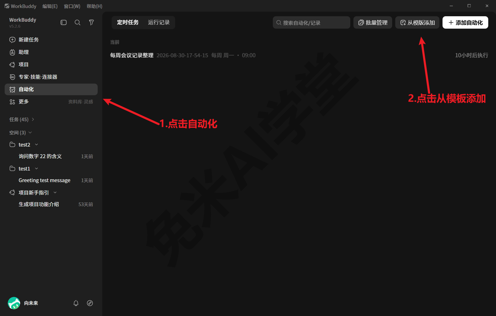
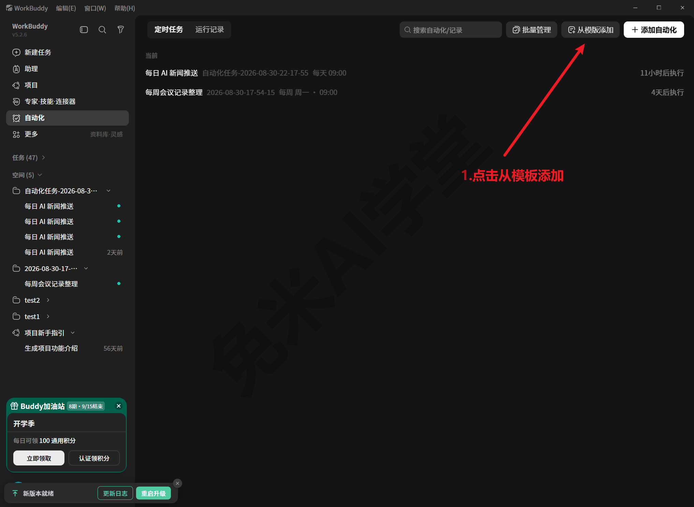
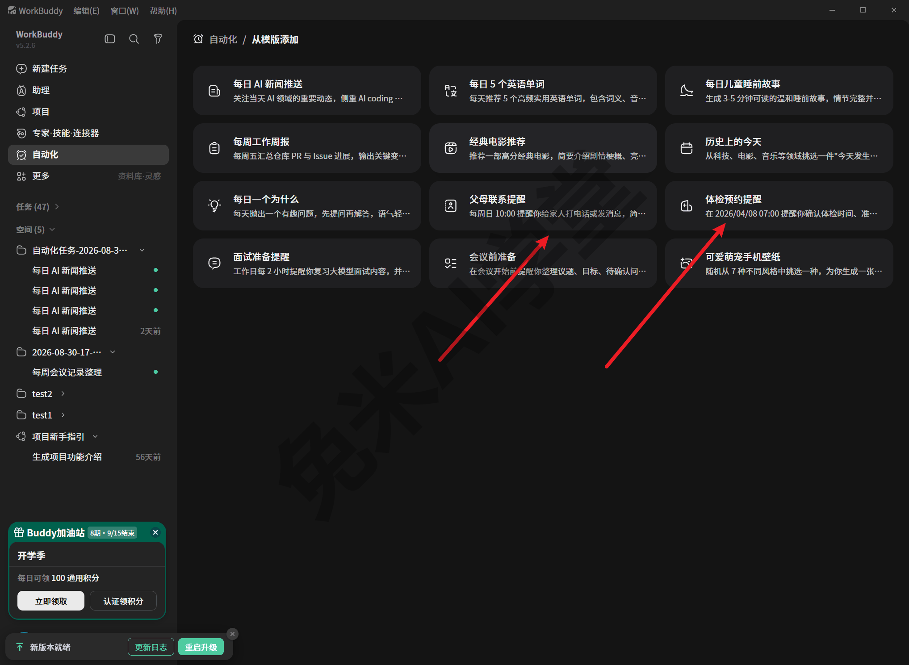
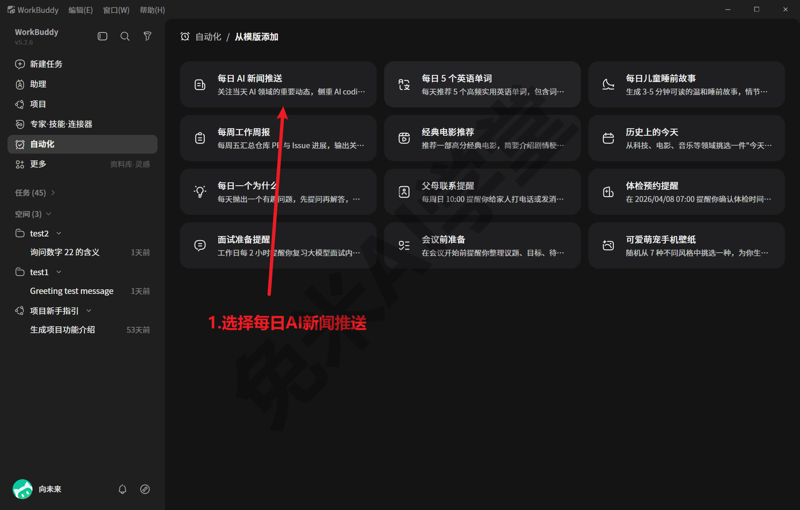
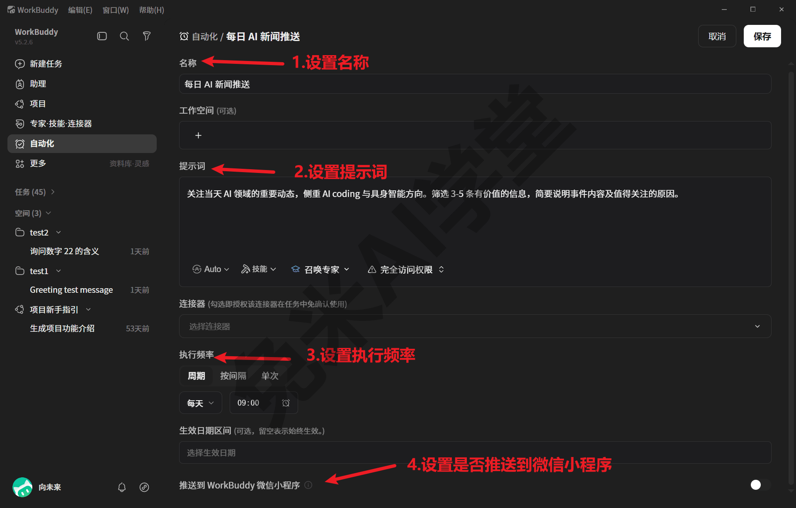
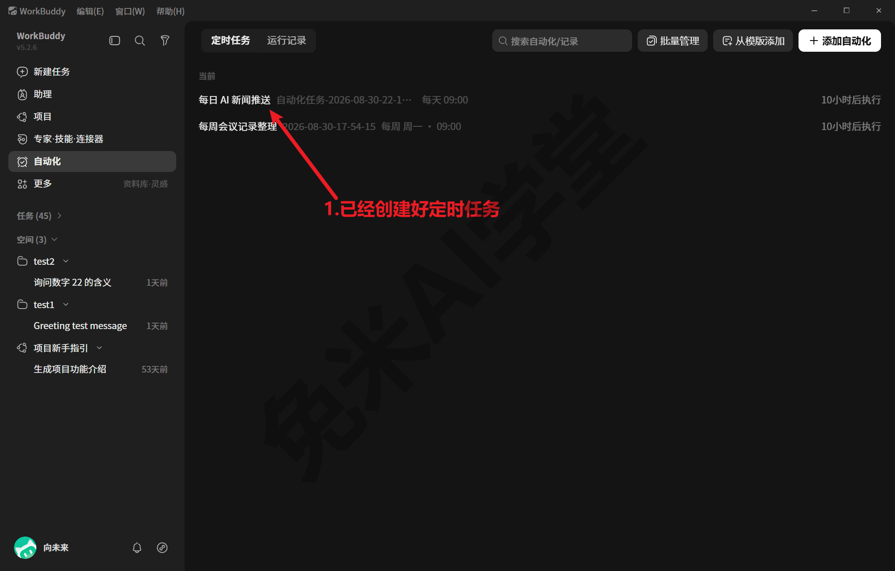
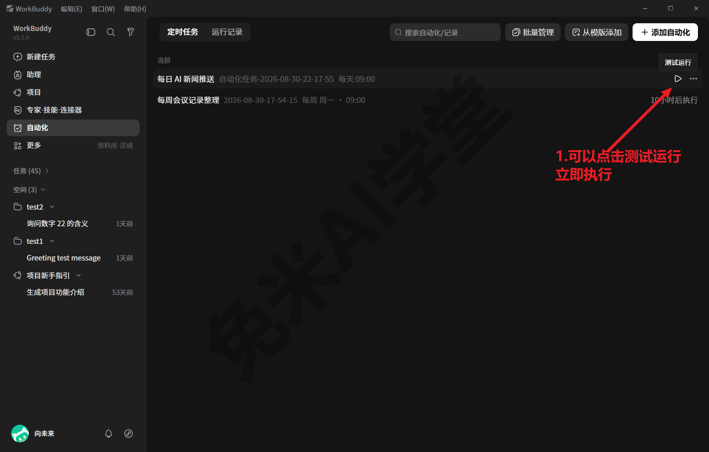
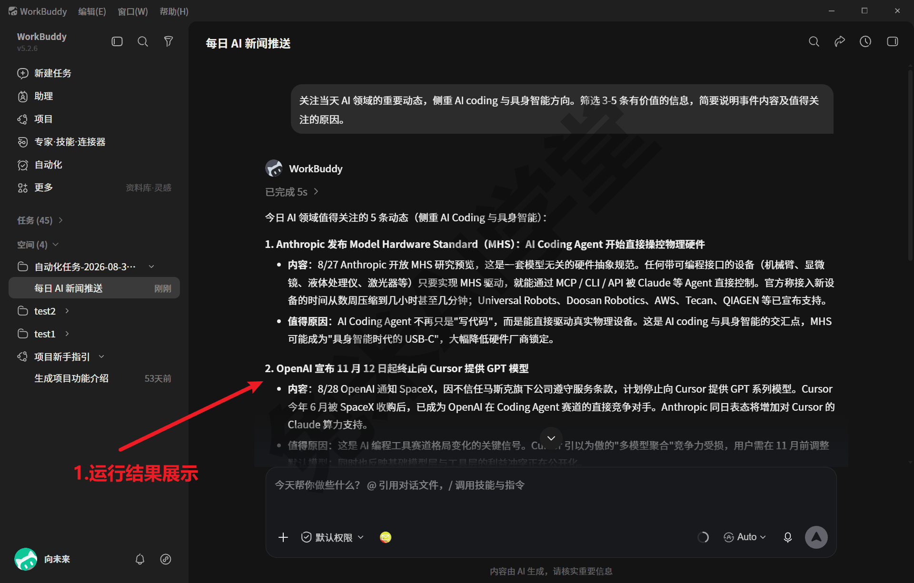
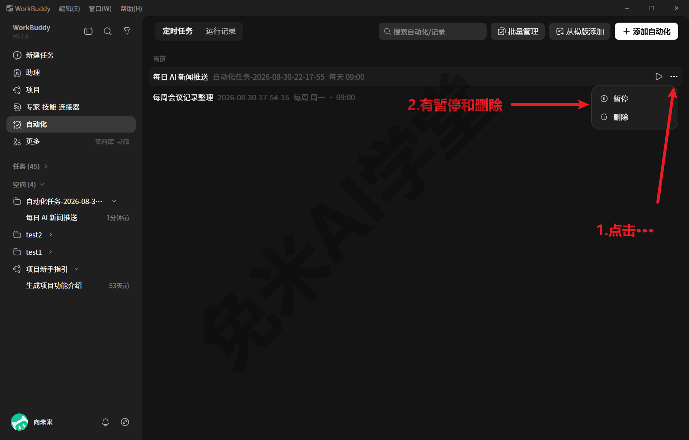

# 自动化：把重复的活交给定时任务

前面各篇教的都是“吩咐一次、干一次”；这一篇解决的是“到点自动干”。WorkBuddy 的自动化就是定时任务：把一件固定节奏的例行活配置好，它按时执行、留好记录，你只管收结果。本篇截图均在 WorkBuddy 5.2.6 上实拍，从模板建任务、测试运行到暂停与删除均为实操记录；个别未实操的角落仍按最可能形态写出并逐处标注，动手时以实际界面为准。

---

### 10.1 自动化页导览：定时任务与运行记录

**入口在侧栏。** 左侧边栏的“**自动化**”（《快速上手》2.1.2 认过的六个入口之一），点进去就是自动化页：



对照截图认三块：

- **顶部两个页签**：“**定时任务**”管“以后要自动跑的活”，你建过的定时任务都列在这里；“**运行记录**”管“已经跑过的每一次”，到点执行的结果去那里查。本节先认位置，10.3 细讲。
- **中央任务列表**：建过的任务一行一条，标着名称、节奏与下次执行时间；还没建过任务时，这里是一句“开启你的第一个自动化任务吧”的空态提示。
- **右上角一排入口**：搜索、批量管理，以及两个建任务入口——“**从模版添加**”进官方模板列表（10.2 就从这里建第一个任务），“**＋ 添加自动化**”则是不借助模板、从零自建。



**逛一逛模板列表，能大致看出这套功能怎么用。** 点开“从模版添加”，实拍可见 12 款模板，按用途明显分成两类。一类是**定点产出**——到点替你生成一份内容：“每日 AI 新闻推送”（关注当天 AI 领域的重要动态）、“每日 5 个英语单词”、“每日儿童睡前故事”、“每周工作周报”（简介写明“每周五汇总仓库 PR 与 Issue 进展”）、“经典电影推荐”“历史上的今天”“每日一个为什么”“可爱萌宠手机壁纸”。另一类是**定点提醒**——到点提醒你去做一件事：“父母联系提醒”（每周日 10:00）、“体检预约提醒”（在指定日期时刻一次性提醒）、“面试准备提醒”（工作日每 2 小时）、“会议前准备”（会议开始前提醒整理议题）。

从这些简介还能直接读出**节奏的几种形态**：每天一次、每周固定某天（每周五、每周日 10:00）、工作日高频（每 2 小时）、指定日期时刻的一次性任务。也就是说，定时任务不只做“天天跑”的活，一次性的定点提醒同样能托付。另外要有个预期：模板卡上那句说明只是摘要（卡片上显示不全的部分会截断），点开之后看到的完整配置才是全部；当屏之外可能还有更多模板，以实际界面为准。



**别和灵感页弄混。** 主界面还有一个“灵感”页，也是一排现成模板（可复用的任务起点，《助理、专家、项目与灵感》介绍）。两者的区别在“何时跑”：灵感页的模板是“现在就跑一次”的起点，点了当场执行；自动化模板是“以后定期跑”的起点，建好之后按节奏自动执行。想清楚这件活是只做这一次、还是以后要反复做，就知道该去哪个页面。

最后用一句话总结本节：这页解决的是“**时间**”维度的自动化——做法你来定（或用模板预填的），什么时候做交给它。它与“技能”（把做法沉淀下来）是两个维度的事，10.4 专门对照。

---

### 10.2 从模板建一个定时任务

本节从模板建任务、当场试跑的全流程均为实拍记录（建的就是“每日 AI 新闻推送”）；界面细节随版本可能微调，以你看到的为准，思路是一样的。

**第 1 步：进模板列表，挑一款模板。** 在自动化页右上点“**从模版添加**”，进入模板列表；以“**每日 AI 新闻推送**”为例：它是第一款，简介是“关注当天 AI 领域的重要动态”。点它，就进入这款模板的创建表单：



**第 2 步：过一遍可设置项。** 创建表单从上到下是这么几项（实拍见下图）：**名称**；**工作空间**（可选）；**提示词**——一段描述“到点做什么”的指令，模板已经预填好，可以照自己的口味改，比如把新闻推送的关注领域换成你的行业、把输出格式改成“列 5 条、每条一句话”，提示词框下沿还能选模型、挂技能或召唤专家；**连接器**（可选，勾选即授权该连接器在任务中免确认使用）；**执行频率**——“周期／按间隔／单次”三档，周期可选每天或每周几并指定时刻，“单次”就是指定日期时刻只跑一次，10.1 从模板简介里读出的那几种节奏形态在这里一一对应；**生效日期区间**（可选，留空表示始终生效）；最下方还有一个“**推送到 WorkBuddy 微信小程序**”开关（作用以界面说明为准）。写提示词的要领与《快速上手》2.4 教的完全一样：**把要求一次说具体**：定时任务比普通对话更需要这一条，因为它到点自己跑，你不在场、没法当场追问补充。



**第 3 步：保存前检查三件事，保存后回列表核对。** 点保存之前逐一确认：名称在列表里一眼能认（列表靠它区分）；节奏是你要的（别拿默认值凑合）；内容说清了“做什么、产出什么样”。确认后点右上“保存”，回到“定时任务”列表，新任务就排在列表里，名称旁标着节奏与下次执行时间。到这一步，这件事就“托付”出去了：到点它自己跑，不需要你在场发消息。



**建完不想干等到点，先试跑一次。** 把鼠标放到列表条目上，右侧会出现“**测试运行**”入口，点它立即执行一次，当场就能看到这件活跑出来什么样，验证通过再放心交给节奏：



**不从模板、完全自建。** 自动化页右上的“**＋ 添加自动化**”就是自建入口，点开后的表单与模板路径的差异未实操（需实机验证），按通行形态是同一张表单、只是内容要自己从头填。给新手的建议是先从模板起步：参数都替你想好了，改改就能用；用顺了再自建。

**建之前顺手想两件事。**

- 节奏别设太密——模板里“面试准备提醒”默认“工作日每 2 小时”，那是备考场景的强度，多数例行活每天一次足够；
- 每次运行都是一次真实的模型调用、会消耗额度（费用口径见《模型与费用》，10.4 再展开）。

想清楚“多久一次、值不值”，再点保存。

---

### 10.3 看运行记录、停用与删除

**运行记录在哪。** 自动化页顶部的第二个页签“**运行记录**”，就在“定时任务”旁边。任务每跑一次，这里应当留下一条记录，大概率能看到运行时间、状态（成功或失败）与结果入口（页签内条目的具体形态需实机验证）。查一次记录，就知道昨晚那次到底跑没跑、跑成没跑成。

**记录和产物是两回事。** 记录是“执行台账”——每次跑没跑成的流水；产物是“执行结果”——那份新闻摘要、那份周报本身。从留痕机制看，定时任务的运行与普通任务一样会进全程留痕体系（对话转录、审计日志那三本账，见《任务边界与数据安全》13.5；以实际界面为准），所以即便界面上一时找不到，痕迹也不会凭空消失。

**产出去哪找。** 先分清两类任务的“结果”长相：定点提醒类的结果就是那条到点冒出来的提醒本身，看过即完成；定点产出类（比如新闻推送、周报）每次运行则会有具体产物。实测“测试运行”跑完，产出就是一条任务会话：侧栏“自动化任务”分组里点开，能看到按提示词生成的完整内容：



找不到时有两条可靠的兜底：走“更多 → 我的文件”按任务分组找（《快速上手》2.6.3 的老办法），或直接问它“最近一次定时任务的产物在哪里”。数据存到哪里的机制详见《数据、工作目录与记忆》。

**不想让它跑了：暂停，还是删除。** 两个动作语义不同，选之前想清楚：

- **暂停**：保留任务配置、到点不再执行，想用的时候再启用，适合“周期性有用、暂时不需要”的任务，比如只在忙季有用的汇总活，淡季暂停、忙季一键回来；
- **删除**：连配置一起清掉，适合试验性的、确认不再需要的任务，比如照 10.2 练手建的那个。

这两个操作就在“定时任务”列表的条目上：点条目右侧的“**…**”菜单，里面就是“暂停”与“删除”。原则很简单：留着的任务就是会持续消耗额度的任务。建议每隔一段时间清点一遍这份列表，一个月没看过产出的任务，要么暂停，要么删除；留一排没人看的定时任务，费额度也费注意力。



**跑失败了怎么办。** 三步走：先到“运行记录”看失败那一次的状态与信息（形态以实际界面为准）；再把情况直接问它：“昨晚的定时任务为什么失败了”，它看得到自己的运行记录；仍解决不了，就修改任务内容或删了重建。失败的常见来源无非三类：任务内容写得含糊、任务要用的材料或路径不可用、模型或额度出了状况——对应的解法分别是把内容改具体、检查材料还在不在原处、去《模型与费用》过一遍报错排查。这套思路与全书一致：先问它自己，再看留痕，见《任务边界与数据安全》。

---

### 10.4 什么活适合自动化

学完建法，回到更重要的问题：什么活值得建成定时任务。全书讲过的三种“托付方式”正好排成一个递进：

| 托付方式 | 适合的活 | 特征 |
|---|---|---|
| 一句话交代 | 临时活、一次性的活 | 想到就说，不值得建任何东西 |
| 沉淀成技能 | 反复出现、做法固定的活 | 变的是材料，不变的是做法——教会一次，一句话反复调用（《技能：安装、管理与调用》《自制技能：把流程沉淀成一句话》） |
| 建成定时任务 | 做法固定、时间也固定的例行活 | 连“想起来说一句”都省了——不变的不只是做法，还有时间点 |

判据可以浓缩成两问：**做法固定吗？时间点也固定吗？** 只有前者，沉淀成技能；两者都有，交给定时任务。两条路还能衔接：把已经打磨顺的做法放进定时任务的内容里，是自然的进阶（具体支持程度以实际界面为准）。

**拿三件事过一遍这两问，感觉就有了。** 第一件，每周五要交的例行周报：做法固定（汇总本周进展）、时间也固定（每周五）——建定时任务，模板区那款“每周工作周报”就是为它准备的。第二件，每次收到一批新材料就要整理成固定格式的表：做法固定、时间不固定（材料什么时候来不一定）——沉淀成技能，来了材料一句话调用。第三件，偶尔想把一段话翻译润色：做法、时间都不固定——一句话交代就好，建什么都是多余。你手头的活，都能照这两问归类。

拿不准某件活该走哪条路时，也可以把两问直接交给它替你过一遍（方括号里的内容换成你自己的）：

```
帮我判断这件活适合哪种托付方式：[把这件活描述清楚：做什么、多久一次、时间固定吗]。
按“一句话交代／沉淀成技能／建成定时任务”三选一给建议，并说明理由
```

**从模板的两类看起步顺序。** 10.1 归纳过：模板分定点提醒与定点产出两类。新手建议**先从提醒类试起**：提醒类任务内容轻、成本低，跑一周就能建立“它到点真的会动”的信任；再上产出类，让它到点真替你做事。

**成本这本账要算。** 每次运行都是真实的模型调用：《任务边界与数据安全》13.5 有个实测样例：连给会话自动起个标题这种后台微任务，都是一次上千 token 的调用；定时任务每天准点跑，累积消耗只会更实在。三条习惯能把账管住：建任务时选合适的节奏（能每天一次就别每两小时一次）；定期清点“定时任务”列表，失效的活暂停或删除（10.3）；额度与倍率的完整口径去《模型与费用》对一遍。

**一个值得记住的反例。** 《实战二：说明书批量投喂出设备档案表》那条工作流，做法早已沉淀成技能，成批处理时却始终保留人工节奏，因为逐批投喂要人盯着核对，不适合挂成“到点自动跑”。这说明两问之外还有一道人工把关的判断：做法固定、时间也固定，但**过程需要人盯** 的活，仍然不要全托给定时任务（边界口径见《任务边界与数据安全》）。

最后一句建议：定时任务留一两个真正贴合你节奏的就够，长期不看产出的及时暂停或删除（10.3 讲过怎么清）。

---

### 10.5 练习任务

三个任务由浅入深，前两个是界面操作，最后一个用对话收尾。**提示词里方括号的内容，换成你自己的。**

**任务一：逛一遍模板区，挑出你的那一款**

操作步骤：点侧栏“自动化”进入自动化页，点右上“从模版添加”打开模板列表，从头到尾看一遍，对照 10.1 的两类（定点产出／定点提醒）给每款归类，挑出与你日常最贴的一款。

完成标准：能说出你挑中的模板名字、它属于哪一类、默认节奏是什么（卡片简介里一般写着）。

**任务二：建一个定时任务，看它跑一次**

操作步骤：按 10.2 的三步，从你挑中的模板（或“每日 AI 新闻推送”）建一个任务，节奏改成对你合适的；等它到点运行一次（或用条目上的“测试运行”当场触发），再按 10.3 到“运行记录”里找到那条记录，看一眼产出。

完成标准：“定时任务”列表里出现你的任务；“运行记录”里找得到至少一次运行；产出类任务能找到那份产物（找不到就用 10.3 的两条兜底）。

**任务三：让它替你盘点，然后收尾**

```
帮我盘点一下我现在建了哪些自动化任务：各自的执行节奏是什么？
最近一次运行的结果如何？有没有你建议我暂停或删除的？
```

完成标准：它的回答与你在“定时任务”“运行记录”两个页签里亲眼看到的对得上；按 10.3 把确实不需要的任务暂停或删除，让列表只留下真会看的那几个。

---

### 10.6 本篇小结与自检

这一篇把“到点自动干”的完整闭环走了一遍：认页面、建任务、看记录、管清单，以及最重要的——判断什么活值得托付。对照清单自查：

- [ ] 能说出自动化页三块结构：“定时任务”“运行记录”两个页签、中央任务列表、右上角一排入口（含“从模版添加”“＋ 添加自动化”）
- [ ] 知道模板分定点产出与定点提醒两类，节奏有每天、每周、高频与一次性几种形态
- [ ] 会从“从模版添加”建一个定时任务，知道保存后回“定时任务”列表核对、用“测试运行”当场试跑
- [ ] 会到“运行记录”查每次运行，产物找不到时知道两条兜底路径
- [ ] 分得清暂停与删除的语义，记得定期清点任务清单
- [ ] 能用“做法固定吗、时间点也固定吗”两问判断一件活该一句话交代、沉淀成技能，还是建定时任务
- [ ] 三个练习任务至少完成两个

完成这些内容后，你手里就多了一个“到点自动干”的帮手。下一篇《实战一：办公文档小项目》回到亲手做事的主线，从吩咐到产物完整做成一件日常事。

---

### 10.7 新手常见问题

**Q1：电脑不开机，它还会跑吗？**

稳妥的预期是：WorkBuddy 是装在你电脑上的桌面程序，定时任务要执行，一般需要电脑开机、程序在运行——点“×”缩进托盘也算在运行（需实机验证，未实测关机跨点场景）。官方产品页另介绍过“云端任务托管”一类能力，是否适用于你的版本与账户，以官方页面与实际界面为准。给一条实用建议：重要的定点提醒先别撤掉手机闹钟，等它稳定跑上几天，再放心把这件事交给它。

**Q2：跑失败了怎么办？**

按 10.3 的三步排查：先到“运行记录”看失败那次的状态与信息，再直接问它“为什么失败”，仍不行就修改任务内容或删了重建。多数失败出在任务内容写得不够明确——把“做什么、产出什么格式”说具体，成功率立刻上来。

**Q3：定时任务会一直扣积分（或额度）吗？**

每次运行都是真实的模型调用，按所选模型的口径消耗（详见《模型与费用》）；不运行就不产生新消耗。所以账好算：节奏越密、内容越重，花得越多。管法也简单——建任务时选够用的最低频率，定期清点列表，不用的暂停或删除（10.3），暂停后它就不再执行。
