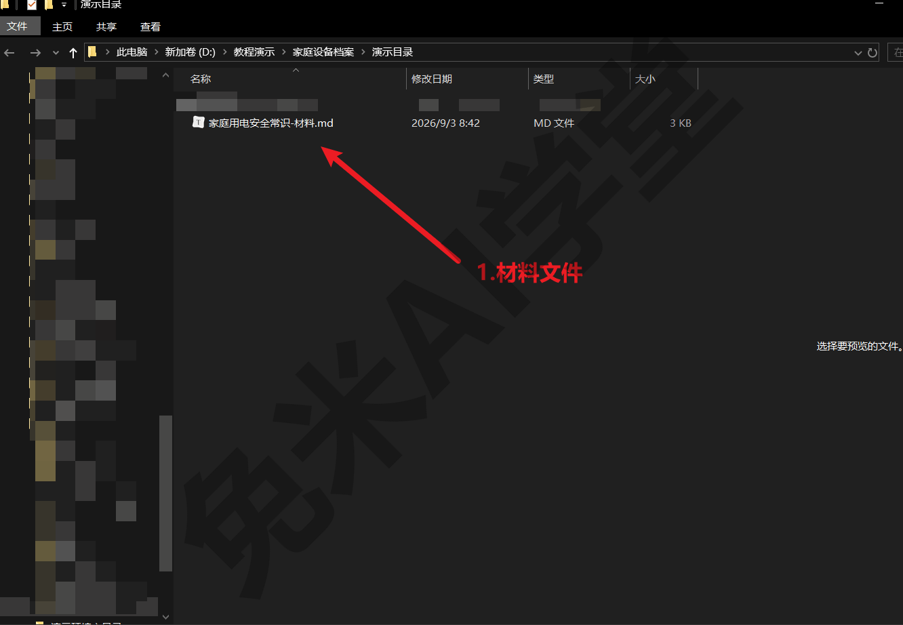
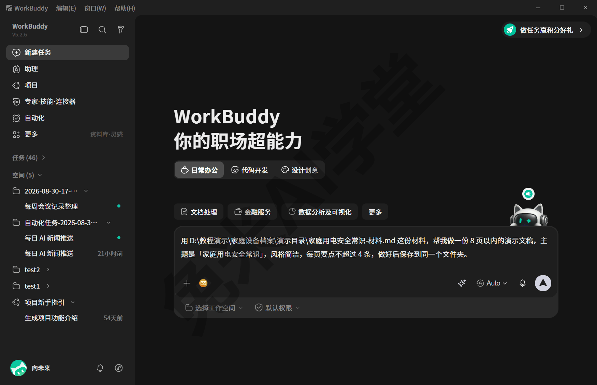
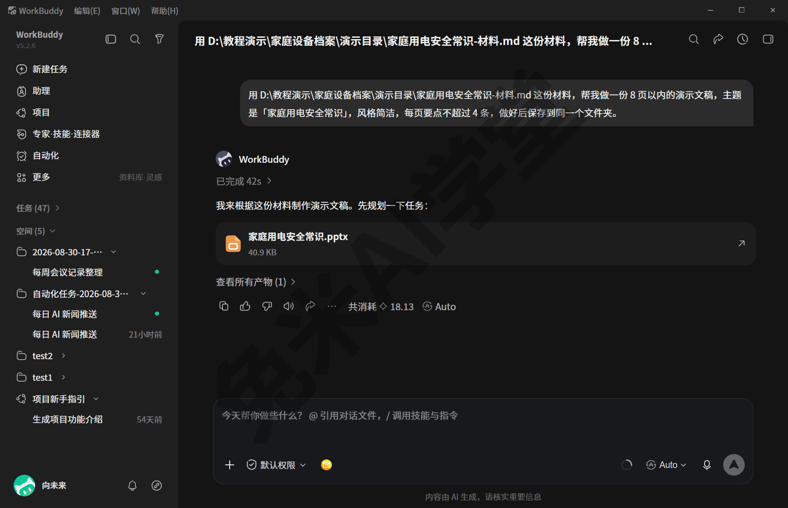
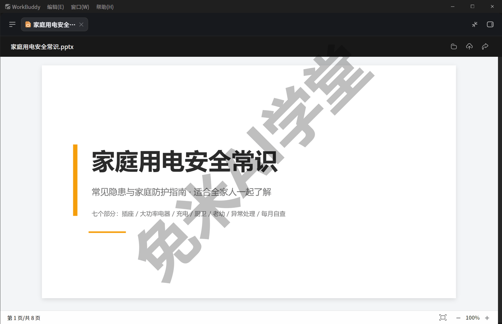
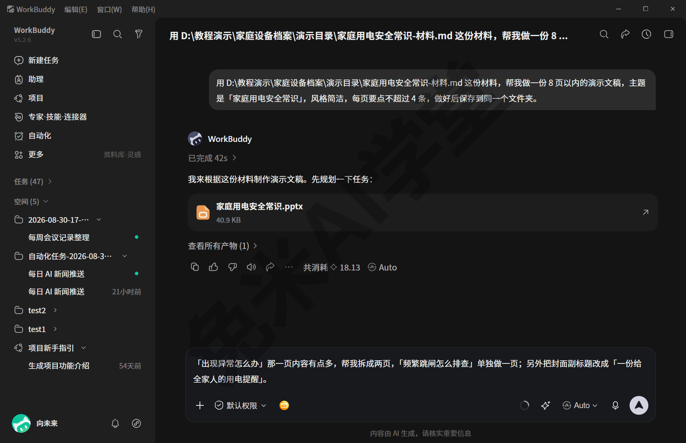
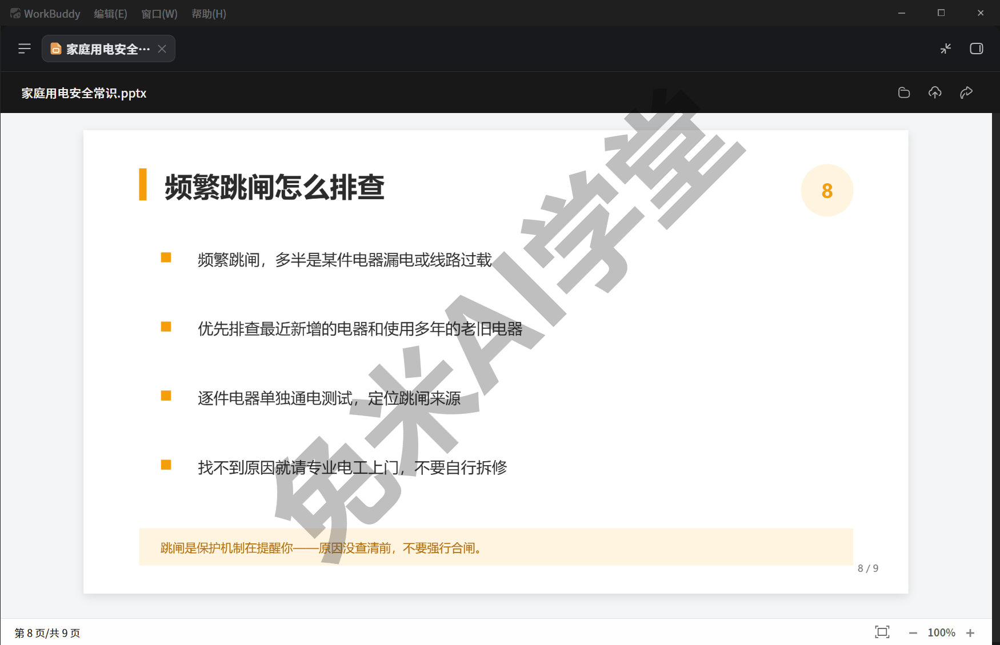

# 实战一：办公文档小项目

《自动化：把重复的活交给定时任务》末尾说过，这一篇回到亲手做事的主线：从吩咐到产物，完整做成一件日常事。案例选的是最常见的一类办公活——把一份现成的文字材料变成一份能给人看的演示文稿，中途还按真实习惯提了一轮修改意见。整件事于 2026-08-31 在演示环境一次真实做成，用的都是前十篇讲过的操作，文中画面与数字均以当次运行为准。

---

### 11.1 项目目标与选型

先说这一篇要做成什么。手头有一份写好的文字材料，想把它变成一份结构清楚、能直接放给别人看的演示文稿——也就是大家常说的 PPT。这类“材料在手、就差一步成品”的事务，日常隔三差五就会遇到：会议记录要变成汇报页，读书笔记要变成分享稿，一段说明文字要变成培训材料。过去的做法是自己开软件、建页面、排版式，一页一页往里搬字；这一篇把整件事交给 WorkBuddy，你只负责两句话——一句把活交代清楚，一句提修改意见。

**为什么选演示文稿。** 适合当第一个小项目的办公文档活大致有三类：

- **生成演示文稿**——把一份文字材料变成若干页幻灯片。产出最直观，做没做好一眼能看出来，对材料的要求也最低，一份现成的文字稿就够；
- **处理一批表格**——把几份表合并、汇总、算数，产出是一张结果表。适合手头表多的人，验收要逐格核数字，比看幻灯片费眼；
- **产出图文文档**——把一段材料整理成带小标题、留好配图位置的正式文稿。离“排版好的文档”最近，但产出好坏要通读全文才判得出来。

三类的做法完全是同一套：把材料给它、说清要什么、拿到产物再改一轮。本篇选第一类做完整演示，一是产出最直观，二是它和后面《实战二：说明书批量投喂出设备档案表》的批量表格场景正好错开，两篇合起来覆盖面更全。你自己练手时按一条原则挑就行：**哪件最像你平时真会干的活、手头正好有现成材料，就选哪件**——实战案例的价值就在“真的会这么干”。

**这次的材料。** 案例用的是一份一千字上下的生活常识笔记《家庭用电安全常识》，md 格式的纯文本文件，分插座插线板、大功率电器、充电习惯、厨卫用电、老人儿童、异常处置、每月自查七个部分，正是那种“内容都在、就差做成页”的典型材料。顺带说一句经验：材料本身越干净，第一版产物越省心——这份笔记分段清楚、小标题现成，后面你会看到，它切出来的页面结构几乎照单全收。

**动手前的三步准备。**

1. 建一个独立文件夹，把这次的材料放进去，产物也让它存到同一处，找起来省事。这次用的是 `D:\教程演示\家庭设备档案\演示目录\`，动手前把这份材料放到位；
2. 确认材料干净可读：这次是 md 格式的纯文本；常见的文字材料一般都能读，具体支持范围以实际界面为准；
3. 检查材料内容：别带真实姓名、账号、密钥这类信息——全书零密钥的习惯（《任务边界与数据安全》细讲），从自己的第一个项目就养成。



最后把期望放正：一句话生出来的第一版，定位是“合格的草稿”而不是“交付终稿”。返工本来就是流程的一部分，11.3 专门讲怎么提意见才改得准。准备就这些，版式、配色、页数怎么排都不用提前想——这些都写进一句话指令里，让它来。

### 11.2 从吩咐到产物

**入口就是首页。** 打开 WorkBuddy，落在“新建任务”首页——《快速上手》用过的那个主输入框，今天的活也从这里交出去。

**先把活想清楚，再开口。** 一句合格的吩咐要交代四件事，缺一件它就得猜一件：

- **材料在哪**：给出文件的完整路径，不要只说“那份材料”——路径在文件资源管理器的地址栏里能直接复制；
- **要什么**：产物类型说死，这次是“做一份演示文稿”；
- **什么样**：把你在意的约束列出来——页数上限、风格、每页要点条数，说了它就照办，不说它就自己定；
- **放哪**：保存位置交代一句，产物就不会需要你去找。

这四件事拼起来，就是这次真实发出的指令（为排版断成三行，复制时整段粘贴即可）：

```
用 D:\教程演示\家庭设备档案\演示目录\家庭用电安全常识-材料.md 这份材料，
帮我做一份 8 页以内的演示文稿，主题是“家庭用电安全常识”，风格简洁，
每页要点不超过 4 条，做好后保存到同一个文件夹。
```

粘进输入框、还没按发送的画面是这样——模型选择保持默认 Auto 就好，用哪个内置模型交给平台分配：



**发送之后它做什么。** 按下发送，页面切进任务会话，它先把活规划一遍再动手。画面上通常会先出现一条“预计消耗”的区间提示——大一点的活，它会提前告诉你这单大概要花多少积分（积分是用量的计费单位，怎么计、怎么充，《模型与费用》讲过），改主意想叫停的话，运行期间输入框右侧的发送键会变成停止键，点一下就能中止（以实际界面为准）；接着能看到它“已读取”你给的那份材料，然后开始生成。全程不需要守着——这一单几十秒的工夫，你切出去回个消息再回来，它多半已经做完了。

**完成态长这样。** 这一单从发送到完成，画面标称用时 42 秒。完成后的会话里挂出产物卡片，卡片上是文件名“家庭用电安全常识.pptx”和文件大小；卡片下方还有“查看所有产物”入口，本次产物一共 1 件；回复末尾能看到本次的积分消耗数和 Auto 标识——这次实际被分配到的是内置的 glm-5.3 模型：



**当场打开看一眼。** 点产物卡片，右侧滑出预览面板；点面板右上的放大按钮，切到整窗预览，页码和缩放都在底部。预览是 WorkBuddy 内置的，这台演示机没装任何办公软件，照样能翻页细看：



对照指令逐条验收：一共 8 页，没超约定；封面之外每页要点不超过 4 条；内容全部来自那份材料，没有材料之外的自由发挥；文件本体就在指令里交代的那个文件夹里。到这一步，从吩咐到产物的主流程已经走完，全程你只发了一句话。

### 11.3 迭代与返工

**第一版当草稿看。** 一句话生出来的产物，八成能用、两成不合意是常态——这不算失败，和把活交给别人、第一版总要提点意见是一回事。这次实际通读 8 页之后有两处想动：“出现异常怎么办”那页把断电、灭火、跳闸三件事放在了同一页，内容有点多；封面副标题也想换个更家常的说法。

**提意见的三个要领。**

- **指着页说**：引用页标题原文，别说“中间那页”——标题是最不会有歧义的指法；
- **说清动作**：拆成两页、精简到几条、改成什么文案，给出能照着执行的动词，别只说“这页不好看”；
- **一轮别塞太多**：两三条意见提完一轮，看改完的效果再来下一轮，比一口气十条更可控。

还有一条位置上的纪律：**回到原来那个任务会话里接着说**，不要新开任务——新开的对话接不上这份产物的上下文，你就得从头再交代一遍。

顺带把账也交代清楚：返工同样是一次真实的模型调用，照常计积分——这也是“一轮别塞太多”之外还要**把意见说具体** 的现实理由，一条含糊的“改好看点”换来一版不合意的重做，花的是双份的等待和积分。意见越具体，一轮命中的把握越大。

这次真实发出的返工指令（同样为排版断行）：

```
“出现异常怎么办”那一页内容有点多，帮我拆成两页，
“频繁跳闸怎么排查”单独做一页；另外把封面副标题改成
“一份给全家人的用电提醒”。
```



**它改完会交一份改动说明。** 发送后它重新处理这份文稿，完成后逐条报告改了哪里。这次报的是：“出现异常怎么办”精简成 3 条；新增“频繁跳闸怎么排查”一页；封面副标题已换；全部页码更新为 X / 9。别只看说明，**按说明对照产物验收**——万一说明里说改了、翻开产物却没变，把对不上的那条原样复述给它，让它重新保存再出一版即可。这次逐条对得上：页数 8 变 9，封面副标题换成了新文案，封面导览行也跟着从七个部分变成八个：


新拆出来的那页也名副其实，四条排查要点，一页只讲跳闸这一件事：



**留意它多改的地方。** 对照时会发现新页页脚多了一句没人要求的提醒：“跳闸是保护机制在提醒你——原因没查清前，不要强行合闸。”内容没毛病，算加分项；但这也提示了一件事：它的改动未必严格限于你点名的范围。每轮返工都把改动说明读一遍、把没点名的页扫一眼，遇到不想要的多余改动，再提一条意见让它去掉即可。

**版本这件事要有数。** 这次的返工是在原文件上就地更新的——文件名没变，旧的 8 页版不会自动留底。改动前的版本还想留着的话，返工前自己把文件复制一份、改个名，比事后想找回省心得多。

### 11.4 保存、找回与复用

**产物在哪，你说了算。** 这次指令里写了“保存到同一个文件夹”，产物就和材料存在同一处；下次想让它存到别处，在指令里换个路径就行。要是忘了交代保存位置也不会丢：《数据、工作目录与记忆》讲过，没指定去处的产物会留在 WorkBuddy 为该次会话自动开的工作目录里，去那里找准没错。

产物本身是常规的演示文稿文件，复制、发给别人、日后拿办公软件继续手工编辑都随你——它不被锁在 WorkBuddy 里面，这一点和你自己做出来的文件没有任何区别。觉得文件名不合适，像普通文件一样自己改名也行；只是改名之后再回会话里让它继续改这份文件时，记得把新名字告诉它，免得它去找旧名字扑空。

**对话怎么找回来。** 过几天想接着改这份文稿，照下面的顺序找：

1. 先翻侧栏的“任务”列表——所有会话按时间从新到旧排着，条目标题就是你那句指令的开头，最近做的活一眼能认出来；
2. 会话攒多了翻不动，就点侧栏顶部的放大镜，打开“搜索任务”：不输关键词时它默认列出最近任务，扫一眼常常就找到了；输个关键词（比如“演示文稿”或材料名）还能进一步筛，每条右侧标着所属的空间或日期，重名也分得清；
3. 点开找回的会话，当时的指令、回复、产物卡片都在原地——续提修改意见、把产物再打开预览、把当时的指令原文翻出来，都在这一个入口里完成。

这份列表是长期保留的：演示环境里五十多天前的任务照样留在列表里，关掉程序重开也还在，不用担心“聊完就没了”。

**复用：下次同类活就是一句话的事。** 回看 11.2 那句指令，真正“专属这一单”的只有两处——材料路径和主题。下次再有材料要做演示文稿，把这两处换掉，整句照发就行，这就是“一句话复用”：一次把话说明白，以后同类活都用这句开场。句子里的其他约束也都是可调的旋钮——8 页改成 12 页、简洁改成正式，都只是换一个词的事。顺手的指令值得存进自己的笔记，攒上几句，常见事务就都有了现成的开场白。

**和技能、定时任务的分工。**《自动化：把重复的活交给定时任务》末尾给过两问判断——做法固定吗？时间点也固定吗？本篇这类偶发的活，材料每次不同、时间也不固定，一句话交代完即走最合适；同一套做法反复用、步骤越来越讲究，就把流程沉淀成技能（《自制技能：把流程沉淀成一句话》）；连时间点都固定的，交给定时任务到点自动跑。三个档位从轻到重，第一档你已经在这一篇里亲手用熟了。到这里，这件事的全过程——做出来、改到位、存得住、找得回、下次一句话再来——就都在你自己手里了。

### 11.5 练习任务

三个任务把本篇流程在你自己的材料上过一遍，建议按顺序做。方括号里的内容换成你自己的。

**任务一：把一份材料做成演示文稿**

```
用 [你的材料文件完整路径] 这份材料，
帮我做一份 [页数上限] 页以内的演示文稿，主题是“[材料主题]”，
风格简洁，每页要点不超过 4 条，做好后保存到 [你的产物文件夹路径]。
```

完成标准：指定文件夹里出现演示文稿文件；页数不超过你的约定；点开产物卡片能在预览里翻页通读。材料就用手头现成的——会议记录、读书笔记、一段说明文字都行，注意别带真实姓名与账号信息。

**任务二：对产物提一轮修改意见**

```
“[某一页的标题原文]”那一页 [你的意见，例如：内容太多，精简成不超过 4 条要点]；
另外把封面副标题改成“[你想要的说法]”。
```

完成标准：在同一个任务会话里发送；它交回的改动说明与产物实况对得上；被点名的页改了，没点名的页没有被改坏——发现多余的改动，能再提一条意见把它修正回来。

**任务三：找回会话并核对产物去向**

先把 WorkBuddy 关掉重开，用侧栏“任务”列表或顶部“搜索任务”把任务一的会话找回来，然后在会话里发送：

```
告诉我这次的演示文稿最终保存在哪个文件夹，现在一共几页。
```

完成标准：能靠列表或搜索找回会话；它答出的保存位置、页数，与你磁盘上的实际文件对得上。

### 11.6 本篇小结与自检

这一篇从吩咐到产物做完了一件真实的日常事务：一句话把材料变成演示文稿，一轮返工把产物改到合意，最后把保存、找回与复用的路都认全了。对照清单自查：

- [ ] 会按“材料在哪、要什么、什么样、放哪”四件事组织一句完整的吩咐
- [ ] 知道发送后先看“预计消耗”提示，完成后先点产物卡片当场预览验收
- [ ] 会在同一个任务会话里提修改意见：指着页说、说清动作、一轮别塞太多
- [ ] 记得对照改动说明验收产物，顺手扫一眼没点名的页有没有被改动
- [ ] 知道返工是原地更新文件、旧版不自动留底，重要版本先复制留档
- [ ] 能用侧栏“任务”列表或“搜索任务”找回会话，说得出产物没交代去处时会在哪里
- [ ] 三个练习任务至少完成两个

完成这些内容后，你已经亲手做成了第一件“从吩咐到产物”的完整事务。下一篇《实战二：说明书批量投喂出设备档案表》把同样的做法放大——三十份家用设备说明书一次变成一张设备档案表，批量的活怎么交、怎么收，那一篇见。

### 11.7 新手常见问题

**Q1：产物格式不对怎么办？**

两种情况分开处理。要的是演示文稿、它却给了别的格式：多半是指令里没把产物类型说死——回到 11.2 的四件事，把“做一份演示文稿”写明白，必要时连文件格式一起点名，再让它重出一版。格式对了但本机打不开：不用急着装软件，产物卡片自带预览，翻页检查完全够用——这台演示机没装任何办公软件，本篇所有预览画面就是这么来的；真要继续编辑再考虑装一个办公软件，以你机器上的实际情况为准。

**Q2：能让它直接改我的原文件吗？**

本篇这一单是“读材料、另出新文件”：材料从头到尾没被动过一个字，产物是新生成的文件。想让它直接在你的原文件上改，要在指令里明确说出来，而且动手前先自己留一份副本——11.3 讲过它的改动是原地更新、不自动留底，这个习惯对你自己的原文件更要紧。哪些文件适合放手让它改、哪些该自己把最后一道关，《任务边界与数据安全》有整篇讨论。

**Q3：做出来不满意，怎么收场？**

分三层，从轻到重：

- 多数不满意用 11.3 的返工解决——指着页、说清动作，两三轮内一般能改到合意；
- 方向整个不对（版式、详略、口径都不合意）就别继续缠着改，新开一个任务，把第一句指令里的约束写得更细再来一遍，比逐页纠正快；
- 只差一点细节（个别字句、微调格式），产物文件就在你的文件夹里，自己上手改往往最快——它把活干到九成，剩下一成自己动手补上，常常比再催几轮更省时间。
