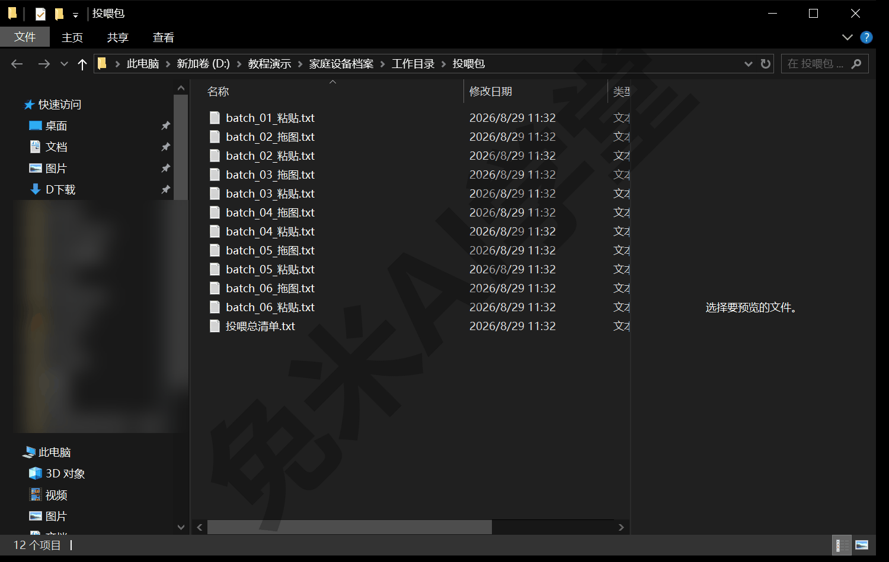
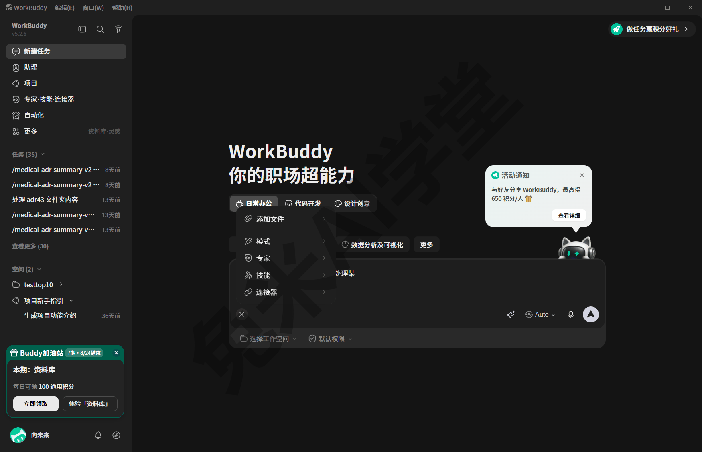
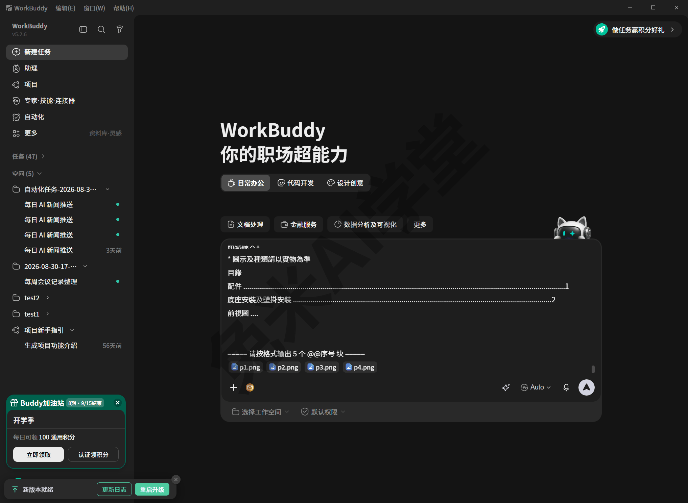
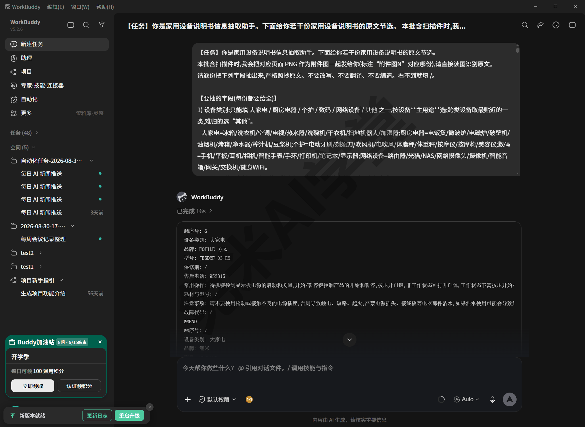
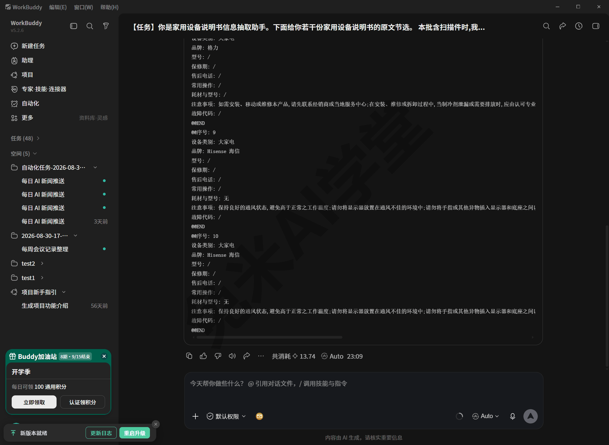
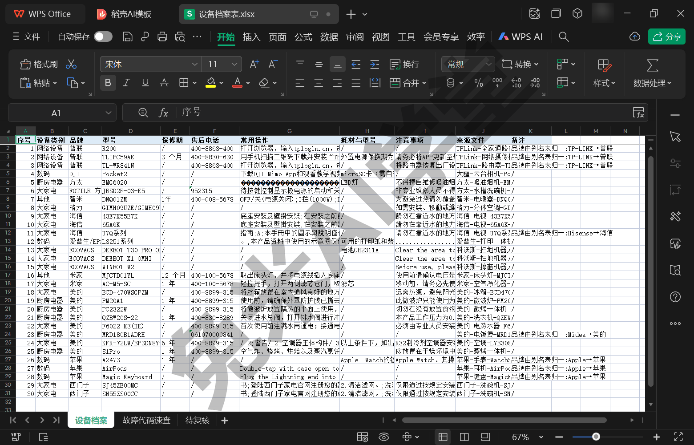
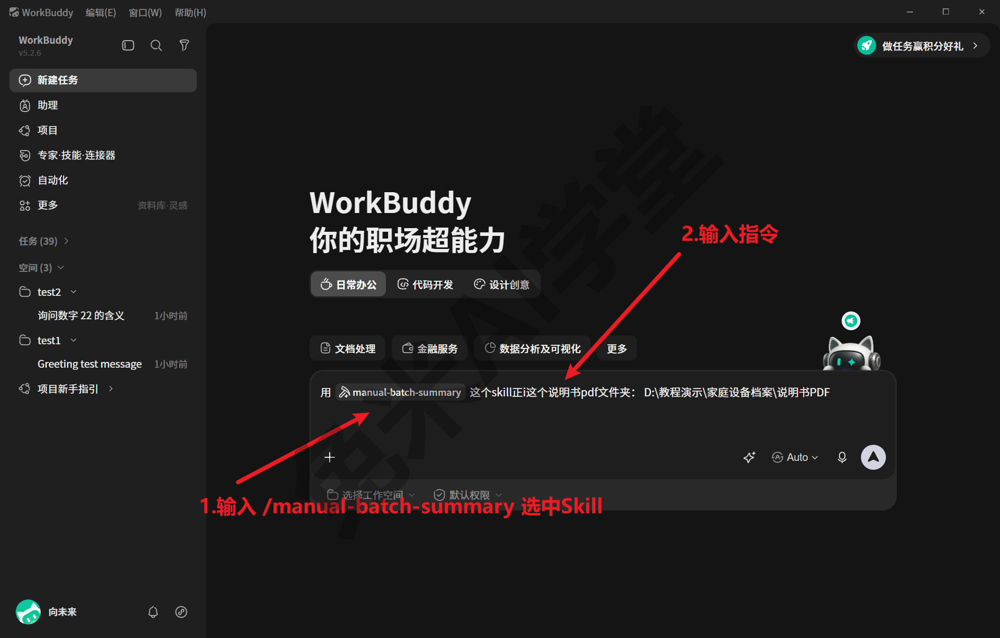

# 实战二：说明书批量投喂出设备档案表

《实战一：办公文档小项目》带你从吩咐到产物，完整做成了一件日常事务。这一篇把规模放大：把 30 份家用设备说明书 PDF 批量投喂给大模型，出一张《家庭设备档案表》。本篇不讲新概念，只把这条由一位要给全家设备建档案的用户真实跑通的工作流从头到尾走一遍——所有步骤和数字都能在 2026-08-29 的真实运行产物里逐一对上号。

---

### 12.1 案例背景与两步法

先说这件事因何而起。家里的设备一多，说明书就容易乱成一团：二三十台设备的说明书随手一扔，真出事的时候三问三不知——保修到没到期、售后电话是多少、耗材该买什么型号。这位用户的办法是把全家说明书一次整理干净：从品牌官网把说明书 PDF 逐一下载齐（共 **30 份**、13 个品牌，其中相当一部分是扫描件或没有可用文字层的文件，实跑判定 9 份要靠“看图”读，细节见 12.5），批量投喂给大模型，出一张《家庭设备档案表》——主表 11 列（序号、设备类别、品牌、型号、保修期、售后电话、常用操作、耗材与型号、注意事项、来源文件、备注），外加自动派生的“故障代码速查”子表和“待复核”清单。这次没有现成的人工答案可对，打分用的“金标准”是自己动手建的——所谓金标准，就是人工核定、当作正确答案来用的那份参照答案，机器答得对不对，全拿它逐格来比：从 30 份里挑 10 份（含 3 份扫描件），对着原文逐字整理成标准答案，后面 12.4 的打分环节要用它。整批 30 份于 2026-08-29 跑完，全程产物都留在演示环境里，本篇引用的每个数字都能落到具体文件上。

先解释三个后文反复出现的词，不必专门记住，见到能认出即可。“扫描件”指纸质说明书扫描出来的图片型 PDF，页面本质上是图片，没有可以选中复制的文字；与之相对，“文字层”指 PDF 里可以直接选中复制的那层文本。“投喂”则是这套工作流的叫法：把整理好的批量材料整段粘进对话框，交给模型处理。

完成这件事用的是**用户自研的技能 manual-batch-summary**（本教程演示环境里的真实例子；技能是什么、怎么装怎么调，见《技能：安装、管理与调用》；想把自己的流程也沉淀成技能，见《自制技能：把流程沉淀成一句话》）。它的分工设计值得先记住一句话：**大模型只负责“逐字抄录 + 看扫描图”，Python 脚本负责“查字典 + 闭集校验 + 合并去重”**，两边互为兜底——模型缺席也能出完整表，模型在场则长文本列质量显著抬升。这里的“查字典”指品牌别名归一：说明书封面常印外文主标（Midea、HAIER、TP-LINK 这类），而档案表要的是统一中文名，模型照抄原文即可，词表负责把 Midea 归一成“美的”，归一动作还会自动记进备注，谁改的看得见。所谓“闭集校验”，是指设备类别这类字段只准从固定的“允许集”里选词，选不进去的词会被脚本拦下来标疑，防止模型自造词悄悄混进正表。

整个流程就是“两步法”：机器备料收卷、人来逐批投喂，落到操作上一共三个环节：

1. 用一条命令生成“投喂包”：批次清单、每批要粘贴的全文、空答题卡一次备齐，流程停在判读环节等人接手——“判读”就是让模型读说明书、按字段答题的那一环；
2. 在 WorkBuddy 里逐批投喂：每批开一个新对话，粘贴、按需拖图、发送，把模型吐出的答案块存回该批的答题卡，在清单上打勾销账；
3. 用两条命令收卷合并、导出 Excel：机器没把握的行自动进“待复核”，最后人工把这部分核完再交付。

这次的真实节奏还有一条值得照抄：**先小批试点，再全量上量**——先投一小部分试跑，检查没问题，再把剩下的全部投完。30 份切成 6 批后，先只投前 2 批当试点，确认答卷能解析、类别没越界、看图批真的在看图，才放量跑完剩下 4 批（12.6 细讲）。命令既可以自己在终端跑，也可以在对话里让 WorkBuddy 替你跑。下面按这次的真实操作一步步走。

### 12.2 生成投喂包：一条命令

**先做一点准备。** 把说明书 PDF 全部放进一个独立文件夹。文件名不需要手工编号：有编号的直接用编号，没编号的按文件名顺序自动补号，不用挨个改名。运行环境也不用操心：技能脚本会自动检测并安装所需的 Python 依赖；如果是让 WorkBuddy 替你跑，这些环境细节它会自己处理。

然后跑一条命令。命令里的 `run_all.py` 是 manual-batch-summary 技能自带的脚本——12.1 说过，这个技能是案例用户自研的，教程并不随书发放脚本文件；手头没有它不影响跟读，自己练手时按 12.7 的替代做法走。尖括号里的内容换成你自己的路径：

```
py "<技能目录>/scripts/run_all.py" "<主PDF文件夹>" "<工作目录>" --hy3 --size 5
```

`--size 5` 表示每批 5 份；`--hy3` 表示生成**手动投喂包**——这个技能默认走“让 AI 自己读文件夹”的省事路线，本篇教学主线选手动投喂，为的是让你看清流水线的每一环，两条路线的关系 12.6 交代。命令内部走三道工序：先把每份的文字层抽出来（超长手册只取前面部分，当前版本上限为前 40 页），并把扫描件、乱码件逐页渲染成 PNG 图（当前版本每份只渲前 4 页——这两个上限对大部头手册意味着什么，12.5 有一个真实的坑）；再用纯程序抽取出一份“确定性底稿”，即使模型一份都没答，最后也能靠这份底稿出一张完整的表；最后按每批 5 份切批，生成投喂包。跑完后，你的工作目录里会出现这些产物：

| 产物 | 位置 | 作用 |
|---|---|---|
| 投喂总清单.txt | `<工作目录>\投喂包\` | 勾选式批次清单 + 每批固定 5 步操作说明 |
| batch_NN_粘贴.txt | `<工作目录>\投喂包\` | 每批要粘进对话框的全文（任务指令 + 9 个答题字段的说明书 + 答题格式 + 每份原文节选） |
| batch_NN_拖图.txt | `<工作目录>\投喂包\` | 该批要拖进对话框的 PNG 清单（纯文本批没有此文件） |
| batch_NN.txt、answers_NN.txt | `<工作目录>\batches\` | 批次原文，以及**空答题卡**——答案最终要存回这里 |
| text\NNN.txt、images\NNN\pN.png | `<工作目录>\` | 每份完整文字层 / 扫描件逐页渲染图 |

答题卡上每份要答 9 个字段：前 8 个就是主表第 2～9 列（设备类别、品牌、型号、保修期、售后电话、常用操作、耗材与型号、注意事项），第 9 个是“故障代码”专用字段——主表里没有这一列，它的答案单独收集，专门用来生成“故障代码速查”子表。“答题卡”这个叫法很形象：`answers_NN.txt` 生成时是一份空模板，等你把模型的答案粘回去，就像收答卷；后面收卷合并认的就是它。文件名里的 NN 是批号、NNN 是份号，翻产物时照这个对号。投喂总清单同时就是执行手册：每批固定 5 步的操作说明原文印在里面，12.3 讲的正是这份口径。



真实规模参考：这次 30 份切成 6 批，编排很省心——批 01 是纯文本批（只粘贴不拖图），批 02～06 都要拖图，六批合计 32 张 PNG；读不出的文件这次一份都没有（有的话，生成投喂包时会在总清单尾部列明，处理见 12.5）。上量到更大规模时，同样的思想是先清纯文本批、再集中对付带图批和疑难件：先把最顺的部分快速清完，再集中精力处理难的，进度稳、心里也有底。

### 12.3 逐批投喂：每批固定五步

投喂总清单里印着每批的操作口径，原样照做即可：

1. 在 WorkBuddy 开一个**新对话**。判读模型这次实跑保持默认 Auto——6 批被平台先后分配到 glm-5.3、kimi-k2.7、hy4-preview 三种内置模型，速度和答法略有差异，但都按格式答完了题；在意口径稳定就挑定一个模型用到底，怎么挑见《模型与费用》。每批用一个新对话最稳，能避免多批内容串在一起把模型带偏。
2. 用记事本打开 `batch_NN_粘贴.txt`，**全选复制**，整段粘进对话框。粘完输入框里会是很长的一大段文字，开头是任务指令和字段说明书，这是正常的，不用删减也不用改。
3. 若该批标了“要拖图”，照 `batch_NN_拖图.txt` 里列出的 PNG **一起拖进对话框**，输入框附近会出现对应的附件标记（以实际界面为准）；实测把 PNG 在资源管理器里复制后、在输入框按 Ctrl+V 粘贴，与拖拽等效，附件顺序与选中顺序一致。纯文本批没有这一步，直接进入下一步。
4. 发送。模型会逐份吐出若干 `@@序号…@@END` 答案块，中途不用打断它，耐心等全部输出完，再**全选复制** 这些答案块备用。
5. 打开 `<工作目录>\batches\answers_NN.txt`（空答题卡），**覆盖粘贴进去并保存**。这一批就算完成，回到投喂总清单上给它打个勾，再开下一批。

关于第 3 步的拖图，有两个实测要点：

- 哪张图对应哪一份，提示词里已经写明（“附件图1/2…对应份 NN”），实测拖入顺序无所谓、以标注为准；稳妥起见仍按清单顺序拖。真实例子：这次批 03 一批就拖了 12 张 PNG，该批 5 份里多份要看图；
- 有的 PDF 看着是电子版，文字层其实不可用，同样要走看图——这次就有 3 份外语电子版被自动归进看图通道，怎么回事见 12.5。





发送后的会话画面是这样：用户气泡里是整段粘进去的批量提示词，下面紧接着模型的结构化回答。



**答案长什么样、存在哪。** 答案就是一段段 `@@序号…@@END` 文本块，逐份一块。真实样例（2026-08-29 批 01 答卷的第一块，“常用操作”有删节）：

```
@@序号: 1
设备类别: 网络设备
品牌: TP-LINK
型号: R200
保修期: /
售后电话: 400-8863-400
常用操作: 打开浏览器，输入tplogin.cn，进入路由器的登录页面；……
耗材与型号: /
注意事项: /
故障代码: /
@@END
```

这一块也顺带演示了纪律：保修期这份说明书里没印，模型就照实填“/”，不编。



三条纪律写在每批粘贴文件的说明书里，模型要遵守，人工补录时同样要遵守：

- **严格照抄原文**，不改写、不编造——这张表的价值就在“原文怎么写就怎么录”，改一个字都可能把后面的人工核对带偏；
- **看不到的信息一律填 `/`**，不猜——空着比猜错好，缺的信息后面自有“待复核”兜底，猜错了反而查不出来；
- **设备类别只准用允许集内的词**——归不进允许集的词，会被后续脚本标成“类别越界/归一存疑”进待复核，不会悄悄混进正表。

保存位置固定：`<工作目录>\batches\answers_NN.txt`，一批一份，覆盖粘贴。

### 12.4 合并导出与打分

全部批次答完后，回到工作目录跑两条命令收尾：

```
py "<技能目录>/scripts/s4_merge_answers.py" "<工作目录>"
py "<技能目录>/scripts/s5_export.py" "<工作目录>" [--gt "<工作目录>/gt.json"]
```

第一条负责“收卷”：解析各批答题卡里的 `@@序号` 块，品牌过别名表归一（Midea→美的，动作记进备注）、设备类别按允许集校验，缺份的用底稿兜底，合并成一份机器答案总档 `model_answers.json`。第二条负责“出表”：按字段优先级把模型答案和 12.2 那份纯程序底稿合并，导出 `设备档案表.xlsx`，里面有三个工作表：

| 工作表 | 内容 |
|---|---|
| 设备档案 | 主表 11 列，行数 = 说明书份数（这次 30 行） |
| 故障代码速查 | 从答题卡“故障代码”字段自动派生（`代码|含义|处置` 竖线三段式）；这次 1 台设备 3 条，另有 2 份该字段解析失败进了待复核 |
| 待复核 | 序号、状态、复核原因、品牌型号——机器没把握的行都在这里 |



“待复核”的复核原因一列会写明这一行为什么被圈进来，照着核就行，不用自己从头猜。这两条命令也可以反复跑：补投过某一批之后，把它们再跑一遍，表会按最新的答题卡重出。

如果手头有金标准（那份人工核定的标准答案，整理成 `gt.json` 交给脚本），加 `--gt` 参数还会多产出一份《AI_vs_人工_对照表.xlsx》：逐格对错标色，并给出一张打分卡。这次的金标准是自建的：挑 10 份（编号覆盖 4 类设备、8 个品牌，含 3 份扫描件），人工对着源 PDF 和渲染图逐字整理，填写纪律与答题卡三条完全一致。12.6 引用的准确率数字，就是这套对照打出来的。首次在新一类材料上跑，建议都这样先拿若干份对照打分，确认精度符合预期再放量。

到这里，你手里的产物一共三层，回头想查任何一份都有处可去：逐批的原始答案在 `batches\answers_NN.txt`（答题卡，`@@序号` 块逐份可查）；合并后的机器答案总档是 `model_answers.json`；最终交付是 `设备档案表.xlsx`。当时如果没指定工作目录，这些文件在 WorkBuddy 为该次会话自动开的工作目录里——去哪里找、怎么把工作目录固定住，见《数据、工作目录与记忆》。

**最后一步永远是人工**：把“待复核”逐行核一遍再交付。这次 30 份圈出了 24 行（缺保修期 21、售后电话缺失 15、需看图识字（OCR）9、扫描件优先人工核 9、常用操作偏短 6、故障代码格式解析失败 2——一行可以同时有多个原因），乍看不少，但每行原因都替你写明了，多数是“说明书里本来就没印这项”的缺项确认；为什么缺项集中在保修期和电话上，12.6 的失分归因会讲清，大头是取材上限而不是模型乱答。机器已经把“没把握的行”替你圈出来了，人只需要把圈里的内容看完。

### 12.5 特殊件处理与真实坑

批量跑真实材料，总会遇到几个处理不顺的文件。下面这些坑全部来自这次 30 份的真实运行，处理办法照做就能过去。

**第一类：完全读不出的文件（这次没遇到，口径备着）。** 某些私有格式的文件既没有文字层、也渲染不成图，任何模型都读不出。哪些文件读不出不用自己猜：生成投喂包时读不出来的文件会在总清单尾部列明，这次 30 份全部可读（清单里写着“读不了的件：0 份”）。真遇到时处理分三步：

1. 用对应的官方阅读器打开该文件，另存或打印成普通 PDF；
2. 把转出来的文件放回原文件夹，文件名保持编号能和原来那份对上，避免后面合并时张冠李戴；
3. 只重跑受影响的那一批，不用全部重来。

没转格式之前，先在该批答题卡里给这几份留空作记号——留空不会让表缺行，收卷时会由确定性底稿兜底并进“待复核”提醒你补投。

**第二类：看着是电子版，文字层其实不可用。** 一个简单的自查办法：把 PDF 里的文字选中复制、贴到记事本里，看到的若是成串问号或不认识的符号，这层文字就不可用了。这次实跑的真实形态更隐蔽一些：3 份外语电子版说明书（多语对照或纯英文）因为页面上中文字符太少，被预处理脚本当成扫描件归进了看图通道——严格说它们的文字层没坏，但对“抄中文档案表”这个任务来说确实读不出东西，走看图反而是对的；英文页面即便看了图，正文类字段也多按纪律填了“/”，靠底稿兜底后进待复核。多语、外语说明书在家用设备材料里本来就常见，遇到也不用慌：看图通道能兜住，填不出来的自有待复核提醒你人工补。

**第三类：文件名和内容对不上。** 真实例子：素材里一份文件名标着“美的-洗衣机”的说明书，打开一看实为前置过滤器（净水设备）的说明书——型号、热线、保修期都属于净水器。文件名是人起的，靠不住；档案表和金标准都按实物内容记，不跟文件名走。批量任务开跑前抽几份点开扫一眼，能避免整批跑完才发现张冠李戴。

**第四类：大部头只喂进了开头。** 12.2 说过当前版本的两个取材上限：扫描件每份只渲前 4 页、文字层每份只抽前 40 页。这次这两个上限真的碍了事：一本 232 页的多语扫描手册只被“看”了封面和目录；一本 177 页的打印机手册，耗材编号印在第 162 页、指示灯说明在第 115 页，全都超出了取材范围——模型拿不到就按纪律填“/”，相关行全部落进待复核。这不是模型错，是取材上限；对策有二：大部头先想清楚你要的信息印在哪些页，必要时把关键章节单独拆成小文件再喂；或者接受“进待复核后人工补录”这条兜底路径。

**工具本身也会有坑：两桩真实故障与修复。** 这次试点批就撞上一桩：批 01 的模型通篇用全角冒号作答，而合并脚本当时只认半角冒号，整批 5 份解析为 0——发现后先做冒号归一绕过，技能本体随后已修复（解析规则改为全角、半角冒号都认，修复后已重新验证通过），现在的版本直接粘全角冒号答卷也能解析。另一桩在导出环节：一份说明书的文字层带出了 Excel 不接受的控制字符，导出脚本一度崩溃，同样已修复（写入前统一过滤非法字符）。两桩坑的教训一致：**批量流程的头几批要盯紧解析结果**（试点批的价值就在这里），工具报错不可怕，可怕的是“解析为 0”却没人发现。

这些坑背后是同一条纪律：**扫描件必须真的看图再填，不能拿乱码或猜测顶替**——这是这套工作流相对纯程序抽取的价值所在。坑处理起来都不难，关键是记得它们存在：每批开跑前扫一眼总清单尾部的处理说明，跑完后翻一眼“待复核”，就不会在这上面出问题。

### 12.6 试点放量与实测成绩

**先小批试点，再全量上量。** 这次 30 份的真实节奏：先只投批 01、批 02 两批（一纯文本、一带图）当试点，对照三项检查——答卷能不能正常解析、设备类别有没有越界、看图批是不是真的在看图——都过关了，才放量跑完批 03～06。试点的价值 12.5 已经用事实演示过：全角冒号那桩解析故障就是在试点批里当场抓住的，要是不设试点、六批一口气投完才发现，返工量就是六倍。放量后的全程也不长：6 批合计约 12 分钟，单批 65～298 秒不等（随分配到的模型浮动，仅供参考）。

**成绩单（对自建 10 份金标准逐格对分，2026-08-29）。**

| 字段 | 准确率（对/可比） |
|---|---|
| 设备类别（闭集） | **100%**（10/10） |
| 售后电话 | **100%**（6/6） |
| 品牌（过别名表） | 80%（8/10） |
| 型号（逐字符） | 70%（7/10） |
| 保修期 | 60%（3/5） |
| 耗材与型号 | 20%（1/5） |
| **硬字段 6 列合计** | **76.1%**（35/46） |
| 故障代码（条目级，单独计分） | 0%（0/17） |

各字段可比样本数不一样，是因为金标准里该字段本身为“/”的行不计分。这些数字都是用 12.4 的对照打分打出来的，不是估的。

**失分都丢在哪，比总分更有用。** 逐格对照下来：耗材与故障代码两列几乎全丢，主因是 12.5 第四类坑——故障代码表、保修卡、耗材章节多印在手册中后部，超出取材上限，模型“看不到填 /”的纪律执行是对的，分丢在“喂不进”而不是“判不准”；型号 3 处失分里，1 处是模型没照抄参数表印的占位型号 FXX22-K3(HE)，把它“补全”成了 F6022-K3(HE)（逐字符照抄纪律对占位符场景失效的实例，金标准按印刷原文记），1 处多抄了“系列”二字，1 处是多型号说明书取哪个型号与人工口径不一致；品牌 2 处失分是双语主标（“FOTILE 方太”这类）没被只收录单一写法的别名表归一到位——扩充词表就能消除，不用动代码。这组归因的启示：表出来先看“错在哪一类”，再决定是改词表、改取材，还是真的换模型；设备类别与售后电话两列 100%，说明闭集校验和格式校验兜得住它们该兜的部分。

**那为什么本篇要教手动投喂？** 这个技能其实有更省事的路线——一句话让 AI 自己读整个文件夹，预处理、判读、合并、导出全程自动串完，你只在最后核“待复核”：



仍然要教手动投喂，理由有二：

- 一是它让你看清流水线的每一环：粘进去的是什么、模型答出来什么、答卷长什么样，出了问题知道去哪一环找原因；真遇到“口径要求必须在对话里亲手跑”的场合，本篇的五步就是现成的操作手册；
- 二是它的骨架（预处理 → 判读 → 收答题卡 → 归一合并 → 导出）与自动路线完全一致——亲手投喂过一轮，你就真正看懂了这套流程在做什么，换成全自动跑也知道每个环节在发生什么。

这次实跑在演示环境里留有三组完整存证，来路都能查：6 条投喂会话（侧栏可回看，每批的提示词与结构化回答都在）；工作目录里的投喂包与 6 份已回填答题卡；导出的设备档案表、AI 对照表与 10 份金标准标注（时点均为 2026-08-29）。等你跑完自己的第一批，手里也会留下同样一套存证——这正是《数据、工作目录与记忆》讲过的“全程留痕”在实战里的样子。

### 12.7 练习任务

下面三个任务帮你把本篇内容亲手过一遍，建议按顺序做。方括号里的内容换成你自己的。前两个任务假定你手头有 manual-batch-summary 这类批量投喂技能；没有的话，按各任务完成标准里给出的替代做法练习，效果相同。

**任务一：生成一份自己的投喂包**

```
帮我运行 manual-batch-summary 技能的 run_all.py：
主 PDF 文件夹是 [你的PDF文件夹路径]，工作目录是 [你的工作目录路径]，
加 --hy3 参数生成手动投喂包，每批 5 份。跑完把生成的产物清单发给我。
```

完成标准：工作目录里出现 `投喂包\` 和 `batches\` 两个文件夹；`投喂总清单.txt` 里能看到你的批次和五步操作说明；`batch_01_粘贴.txt` 开头是任务指令和字段说明书。替代做法（没有该技能时）：把 3～5 份自己的 PDF 直接交给 WorkBuddy，发送“逐份抽取品牌、型号、保修期，汇总成一张表格给我”，体验同一类“批量文档变成结构化表”的任务。

**任务二：把“待复核”核一遍**

```
打开我工作目录里的设备档案表.xlsx，把“待复核”工作表逐行念给我，
并解释每一行进待复核的原因。
```

完成标准：能说出每行进“待复核”的原因属于哪一类（缺保修期、售后电话缺失、需 OCR、扫描件优先人工核等），并至少人工定夺其中一行该怎么改。替代做法（没跑过完整流程时）：拿任务一替代做法里 WorkBuddy 给你的那张表，自己挑 3 行对照 PDF 原文核对——体会“最后一步永远是人工”。

**任务三：找到一份答题卡原件**

```
告诉我当前这个任务的工作目录在哪里，并列出 batches 文件夹下有哪些文件。
```

完成标准：能找到 `answers_NN.txt` 并说出它的用途（判读答案的“答题卡”，投喂完成后一批一份存回这里）；若你已经投喂过，打开任意一份能看到 `@@序号…@@END` 块。替代做法（没跑过流程时）：按 12.4 结尾的口径，去 WorkBuddy 的自动工作目录里找到最近一次会话留下的产物，看看里面有哪些文件——找不到产物时，先去那里找准没错。

### 12.8 本篇小结与自检

这一篇把一条真实跑通的批量投喂工作流完整走了一遍：从一条命令生成投喂包，到逐批投喂收答案，再到合并导出、对表打分与人工复核。可以对照下面的清单检查学习结果：

- [ ] 能说出“两步法”的三个环节各自在做什么（生成投喂包 → 逐批投喂收答案 → 合并导出）
- [ ] 亲手（或按替代做法）生成过一份投喂包，认得 `投喂包\` 与 `batches\` 里的产物
- [ ] 记得每批固定五步的口径，知道哪批要拖图、哪张图对应哪一份以提示词里的标注为准
- [ ] 遇到外语件、坏文字层、大部头和读不出的文件，知道按 12.5 的口径走看图、拆章节、转存补投，只重跑受影响的批
- [ ] 知道“待复核”表的用途和先小批试点再放量的节奏，说得出为什么最后一步永远是人工

完成这些内容后，你已经具备把一件重复性工作交给 WorkBuddy 批量完成的全部操作能力。批量任务一旦上了规模，“什么能放心交给它、什么必须人工把关”就成了绕不开的问题——下一篇《任务边界与数据安全》给你一份实测得来的定稿结论，也为全书收尾。

### 12.9 新手常见问题

**Q1：扫描件识别效果差，或者答卷里出现错字，怎么办？**

两种情况要分开处理：

- 其一，扫描件看图识别本就有先天限制，流程已备好兜底：拿不准的行会进“待复核”表，逐行人工核对即可——这也是“扫描件优先人工核”口径的落点；
- 其二，若答卷错字成片，多半是文件自带一层劣质识别文字的老扫描件（把图片上的字识别成文本的技术叫 OCR，质量差的 OCR 层错字连篇），被当成了电子版走文字层。处理办法是让这类文件改走“看图识别”重跑：技能有“全部 PDF 一律渲图判读”的开关（`--force-images`），或在投喂时对这几份补渲染、补拖图。这次实跑没有踩到老扫描件，但 3 份外语件走看图通道的处理思路与此相同（见 12.5）。

**Q2：跑到一半中断了，或者想分几天慢慢跑，怎么接续？**

这套流程本身就支持中断：批次相互独立，答题卡一批一份，投喂总清单就是进度表。接续时对照清单，从没打勾的批接着跑即可，已经答完存好的批不受影响。个别批粘错了内容或漏拖了图，开个新对话把那一批重新投喂一遍，把新答案覆盖粘贴回同一份答题卡就行。

**Q3：机器出的结果要不要人工抽查？**

要，而且流程里已经把“该抽查什么”替你圈好了：“待复核”表逐行核对是每次交付前的固定动作；首次在新一批设备、新一类材料上跑，先像 12.4 那样自建若干份金标准对照打分（这次的 10 份就是这么来的），确认精度再放量。至于“哪些任务能放心自动化、哪些必须人工把关”这个更大的问题，《任务边界与数据安全》给你一份实测得来的定稿结论。

**Q4：我不整理设备说明书，换别的行业、别的材料能用这套吗？**

这个技能本身是为设备说明书定制的：11 列表头、字段说明书、允许集和别名词表都是按这个场景做的，直接拿去跑别的材料，通常出不了你要的表。但它的骨架——预处理 → 判读 → 收答题卡 → 归一合并 → 导出——不挑材料类型，事实上这套骨架当初就是从另一个行业的批量整理流程平移过来的。想搬到自己的领域，思路是把字段说明书和校验词表换成你的口径，沉淀成自己的技能，做法见《自制技能：把流程沉淀成一句话》。
