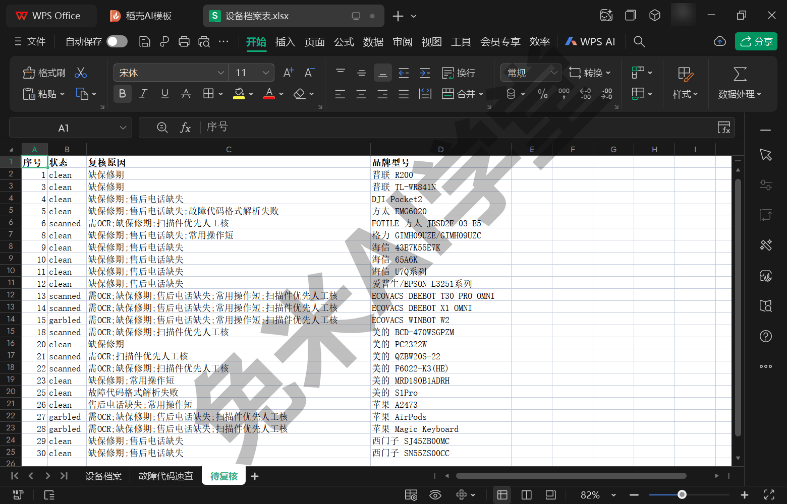
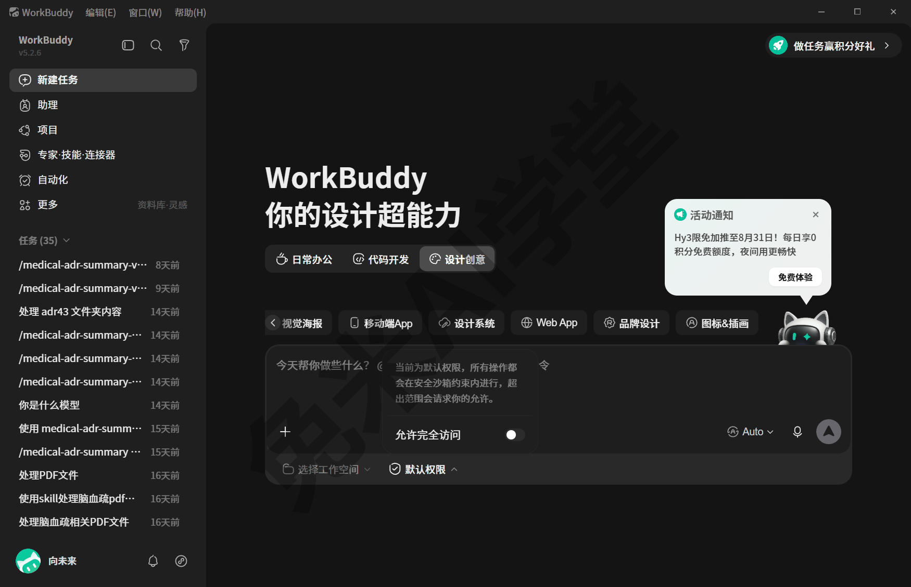
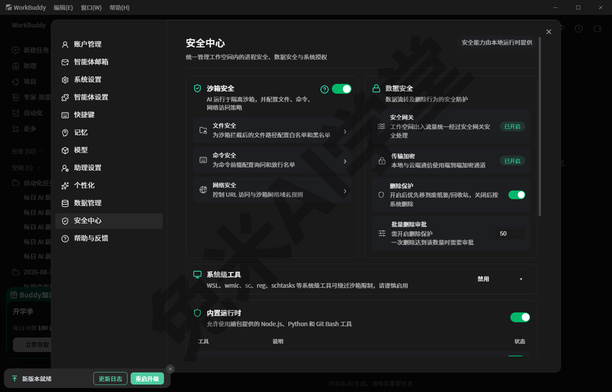
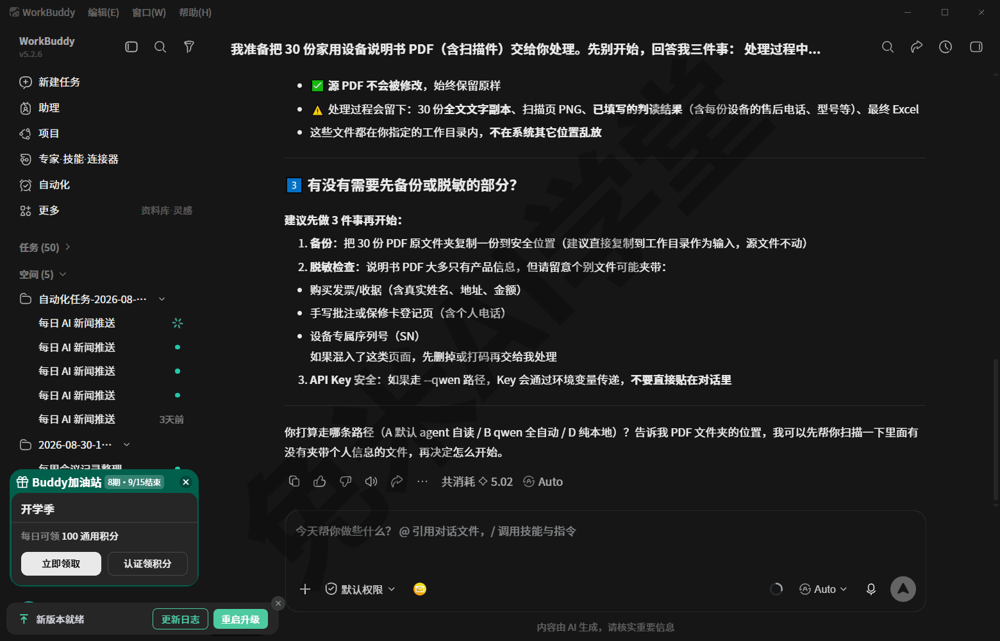
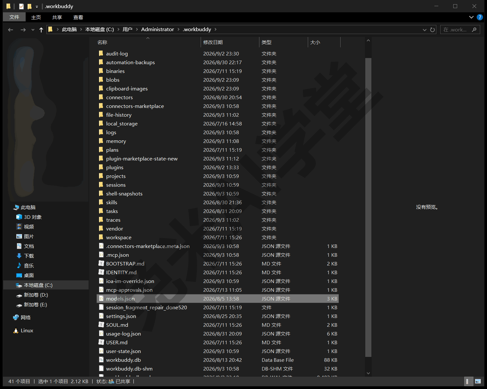
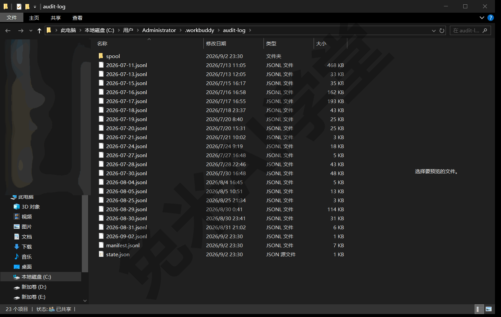
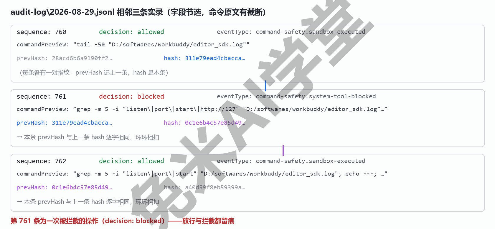
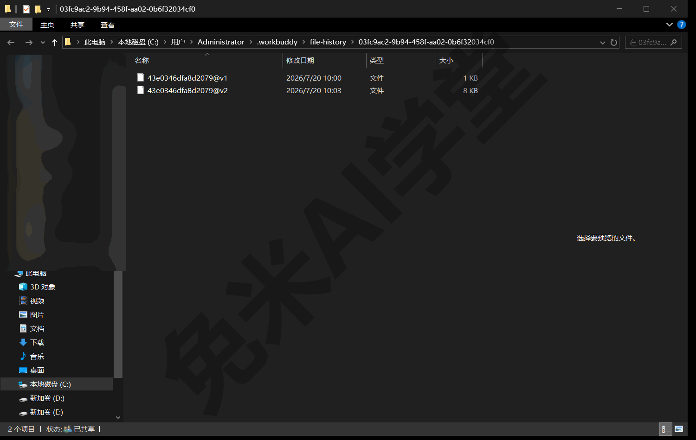
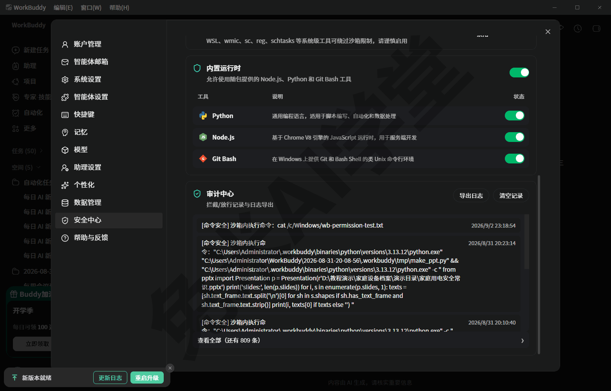
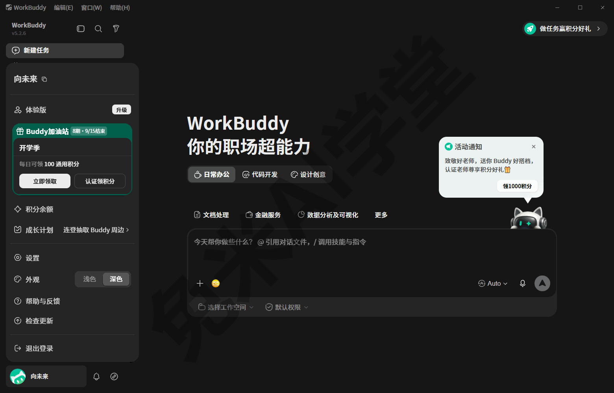

# 任务边界与数据安全

到这一篇，功能与实战都已经走完。最后一篇不教新操作，只回答两件事：哪些活能放心交给 WorkBuddy 自动跑、哪些必须留人工把关；以及把文件和电脑交给它之后，安全感从哪里来——权限沙箱约束它能动你电脑的哪些地方，密钥与凭据的纪律防止敏感信息外流，全程留痕让出了问题时有据可查。读完这一篇，整套教程就完整了。

---

### 13.1 什么能放心自动化，什么必须人工把关

**一张对照表先给结论。** 下面的边界结论，是从《实战二：说明书批量投喂出设备档案表》那条真实工作流（一位要给全家设备建档案的用户 2026 年 8 月的真实运行）里沉淀定稿的，照此安排工作最稳：

| 任务类型 | 能不能全自动 | 实测依据（2026 年 8 月实跑） |
|---|---|---|
| **摘要／汇总类**：品牌、型号、保修期、售后电话这类“明确写在文中的字段”的抄录与汇总 | **可自动化**，抽样核准后放量 | 对自建 10 份金标准逐格对分，核心硬字段合计 76.1%，其中设备类别与售后电话两列 100%；电子文字版 24/30 格、扫描件 11/16 格 |
| **判断类**：要先判定“有没有”、再逐项罗列的任务（例如“这台设备的保修是否还在期”“这份说明书有没有故障代码表”） | **不能全自动出终表**，必须“机器初筛＋人工定稿” | 故障代码这列要先判有无、再逐条罗列，条目级对分 0/17；机器还把参数表里的占位型号“补全”成了具体型号，会漏也会编，只能当初筛 |
| **扫描件**：纸质材料扫描成的图片型 PDF，页面本质是图片、选不中文字 | 无论上面哪类任务，**扫描件一律优先人工核** | 扫描件硬字段 11/16 格，低于电子文字版；上百页的多语扫描手册只能读进封面几页，正文字段几乎整行留空进待复核 |

**表外还有一类要单说：对外写入。** 上表三行都是“读材料、出结果”的活，后果全落在你自己的电脑里；一旦经由连接器往外部系统写东西——发消息、写在线文档——后果就出了这台电脑，错了不容易撤回。这类活的分寸，《连接器：把办公系统接进来》实测过的节奏依然适用：先用“读”类需求熟悉它，重要写入第一次拿不要紧的内容试一遍，点开它回的链接核对无误，再正式投入使用。

**打分对表是放量前的固定动作。** 具体做法分两步：先自建金标准，挑 10 份说明书（含 3 份扫描件），自己动手把每份的各列逐格整理成“标准答案”；再让程序把机器产出与金标准逐格对分，对上算对、对不上标错、机器留空算弃答，按列汇总成上表的准确率。这次对分还顺带抓出一处人工侧的笔误：机器答的“滤芯”被判了错，人工复核才发现，是金标准把“两侧滤芯请同时更换”这句附注误写进了字段值，最后改的是人工标注，不是机器答案。机器初筛反过来帮人工纠了错——人和机器各守一段，比谁单干都稳。

**人工定稿盯三处。** 放量之后，人工要核的不是全部，流程已经把“该盯什么”替你圈好了：

- **待复核表**：导出的档案表里单列一张“待复核”工作表，复核原因一列替你写明缺什么（这次 30 份实跑圈出 24 行：缺保修期、售后电话缺失、需 OCR 这类），逐行核完才算交付；
- **格式与归因存疑的行**：电话格式存疑、类别归一存疑、故障代码格式解析失败这类被程序拦下的行——保留与否，由人来定，机器不替你拍板；
- **扫描件**：一律优先人工核对。



批量任务开跑前，也可以把这道关口预先交给它自查（方括号里的内容换成你自己的）：

```
接下来这批 [材料类型] 里混有扫描件。开始前先告诉我：
哪些字段你能直接抄录、哪些需要我人工把关？扫描件你打算怎么处理？
```

**扫描件为什么是短板。** 模型读扫描件只能“看图识别”，识别质量天然低于直接读文字层；更隐蔽的是有些 PDF 看着是电子版、文字层其实已经损坏，同样只能按扫描件对待。处理办法（先把要看的页转成图片再交给它）在《实战二：说明书批量投喂出设备档案表》里演示过；这里要记住的是口径：凡扫描件，机器给的结果按“初稿”看待，最终数字要人工过目。

这张表、这三处，加上对外写入先试跑的节奏，是全书反复验证出来的分寸。你的行业未必是设备说明书，但“抄录类放手、判断类把关、图片件多盯一眼”这个框架，换个领域同样适用。

---

### 13.2 权限与沙箱：它动你电脑的边界

把文件和电脑交给一个 AI，最常见的顾虑是“它会不会乱动我的东西”。WorkBuddy 对此的机制设计是一套“沙箱＋许可”：默认关在受约束的环境里做事，越界要先经你批准。这一节把这套机制看个明白。

**先看“默认权限”到底说了什么。** 《快速上手》2.2 提过输入框下沿有个“默认权限”选项，当时只让你保持默认，现在点开看一眼：

1. 打开任意一个对话，找到输入框下沿的“**默认权限**”，单击它；
2. 会弹出一个说明弹层，原话是：“**当前为默认权限，所有操作都会在安全沙箱约束内进行，超出范围会请求你的许可。**”
3. 弹层里还有一个“**允许完全访问**”开关，默认处于关闭状态。看完关掉弹层即可，开关不要动。



这两行文案就是 WorkBuddy 权限模型的骨架：**沙箱约束是常态，越界许可是例外**。

**沙箱是什么。** 沙箱指一个受约束的执行环境：它替你跑的命令、写的文件，默认被限制在允许的范围内活动。这个“允许的范围”不是模糊地带——从机制上看，它围绕当前任务的工作目录展开，此外数据目录的全局设置里还存着一份“沙箱额外可写路径”白名单，逐条点名允许写入的位置（演示环境预置了 ~/.tmeet、~/.lark-cli 等少量办公工具的配置目录）。白名单之外的动作，按弹层文案的承诺，就要先请求你的许可。

**这套约束在界面上有一面集中的仪表盘。** 点左下角账号名展开菜单，进“设置”，左栏选“安全中心”，边界全景一屏可见：“沙箱安全”管三份名单——文件安全（沙箱拦截后的文件路径白名单与黑名单）、命令安全（命令前缀的查询与放行名单）、网络安全（URL 访问与沙箱网络域名规则）；“数据安全”一栏，安全网关与传输加密在演示环境里都显示“已开启”，还有删除保护与批量删除审批；再往下，WSL、wmic 这类能绕过沙箱限制的系统级工具，默认整栏“禁用”。不必记住每一项——第一次点开看一眼，确认“约束真实存在、每条都有开关可查”，就够了。



**越界请求许可长什么样。** 演示环境没有实际触发过越权操作，请求许可的具体画面（弹窗样式、批准与拒绝按钮的名称）未经实拍（需实机验证）。但这套“批准／拒绝”机制真实存在：本机审计日志里既有大量放行记录，也有 1 条被拒绝的操作留痕（详见 13.5）。

**“允许完全访问”开关，新手不要打开。** 按名称与文案理解，打开它意味着放宽沙箱约束、不再逐项请求许可（需实机验证——演示环境仅查看、未拨动过该开关）。给新手的建议只有一条：保持默认关闭。日后真遇到反复弹许可、影响做事的场景，再考虑临时打开，用完记得关回来（以实际界面为准）。

**放行与拦截都有账可查。** 每放行执行一条命令，审计日志就记一条“沙箱放行执行”事件，连命令原文和它的哈希一起入账；连接器与 MCP 工具的授权另有一份独立的授权记录文件（演示环境尚未授权过任何 MCP 工具，这份记录当前为空）。这些账本长什么样、为什么值得信，13.5 展开。

这一节的分寸感可以浓缩成一句话：**默认设置就是最稳的设置**。不改开关、不图省事放开权限，沙箱与许可这套机制就始终有效。

---

### 13.3 批量任务与数据安全六问

本篇的“新手常见问题”由这一节承担。六个问题按“数据去哪了、它会不会越界、钱和账怎么算”的顺序排，可以按需查阅。

**Q1：我交给它的材料，内容会传到哪里？**

凡是要模型“读”的任务（判读、改写、汇总），材料内容会通过网络发给你所选模型的服务商处理：选内置模型走平台侧服务，选自定义模型就是发给你自己接的那家——本教程演示环境接的自定义模型走的是国内服务商（阿里云百炼）。对话记录、产物文件、审计日志则都存在本机。哪层数据放在哪，《数据、工作目录与记忆》有全图。

**Q2：涉密或者还没公开的材料，能投喂吗？**

投喂前先过一道保密关：受所在组织数据规定约束的材料，按规定来；纯个人材料，自行评估。拿不准的时候，先用不涉密的样本把流程跑通，再决定要不要投喂正式材料。流程验证和数据安全从来不冲突。

**Q3：它会不会乱动、误删我电脑里的文件？**

默认权限下，它在沙箱约束内做事，可写范围有明确清单，越界要先请求你的许可（见 13.2）；它编辑过的文件，每次改动前的旧版本都留有快照，真改坏了有回退点（见 13.5）。谨慎起见，要紧的原始材料交给它处理前，自己先留一份备份，这条对任何工具都适用。

**Q4：我没让它干什么，积分怎么也在动？**

后台微任务也是真实的模型调用。实测样例：连“给会话自动起个标题”都是一次独立调用，一次就用了一千七百多 token（见 13.5）。这不是故障，是这类产品的常态；积分与费用的完整口径见《模型与费用》。

**Q5：它执行过什么命令，事后能查吗？**

能。凡是“动了手”的事件都记在按日归档的审计日志里：被放行执行的命令（含原文）、网络访问、被拒绝的操作，还带防篡改的哈希链；纯聊天不入审计账。三本账各管什么、怎么看，见 13.5。

**Q6：全自动跑出来的表，能直接交付吗？**

摘要／汇总类，抽样核准后可以；判断类不能——必须人工定稿后才算数，盯住 13.1 说的三处（待复核表、格式与归因存疑的行、扫描件）。“最后一步永远是人工”，这是全书反复验证过的结论。

**拿不准就先问它。** 六问之外遇到具体场景，最省事的做法是把顾虑原样说给它听——它了解自己的机制，也看得到本机的设置与留痕。例如投喂前的最后确认（方括号里的内容换成你自己的）：

```
我准备把 [材料描述] 交给你处理。先别开始，回答我三件事：
处理过程中哪些内容会发给模型服务商？会在我电脑上留下哪些记录？
有没有需要我先做备份或脱敏的部分？
```

演示环境把这条确认原样发了一遍，下图是回答的后半段：处理过程会留下的文件一样样列了出来（全文文字副本、扫描页图片、填好的判读结果、最终表格），动手前的建议也给了三条——先备份原文件夹；检查扫描件里有没有夹带发票收据、手写批注、设备序列号这类含隐私的页面，混入了就先删掉或打码；密钥只走配置、不要贴进对话。回答末尾还能看到这次调用真实消耗的积分数（5.02）——花几个积分换一次白纸黑字的确认，划算。



它的回答可以和本节六问对照着看：口径一致就放心开工；说法对不上时，以本篇与《数据、工作目录与记忆》的机制描述为准，把出入记下来，正好带去 13.6 的求助路径里核对。

---

### 13.4 密钥与凭据安全

**先分清两样东西。** 密钥（API Key）是你在模型服务商那里开出的“调用凭证”，配进 WorkBuddy 之后，它才能替你调用自定义模型（怎么配见《模型与费用》）；凭据是你授权连接器时产生的登录令牌（怎么授权与解绑见《连接器：把办公系统接进来》）。两样东西的共同点：**谁拿到，谁就能冒充你**。

**三不原则。**《模型与费用》把 API Key 比作钱包密码：它一旦外泄，别人就能用你的账户调用模型、产生费用。所以：**不发聊天群、不截图外传、不写进共享文档或代码仓库**。别人要用，让他自己申请一个：免费额度通常一人一份，共用反而不划算。

**本机哪些文件是敏感件。** 下面几处“碰得、看不得、发不得”，日常记住“不截图、不拷贝外发”即可：

| 敏感件 | 里面有什么 | 提醒 |
|---|---|---|
| 模型配置文件（数据目录里的 models.json） | 自定义模型的接入地址与密钥 | 本教程全程未展示其内容；你自己也不要打开截图 |
| 连接器凭据目录（数据目录里的 connectors） | 授权产生的加密令牌与本地加密密钥 | 目录里的说明文件明确写着不可手工单删；不用了走客户端解绑，别直接删文件 |
| 追踪记录（数据目录里的 traces） | 每次模型调用完整的提示词与响应原文 | 你对它说过的话都在里面，外发前想清楚 |
| 对话转录与审计日志 | 完整对话事件流、被执行命令的原文 | 排查问题很有用，但同样含隐私，别整包外发 |



**凭据不随文件夹走，是麻烦，也是保护。** 一次真实实测发现：把技能文件夹整个拷到另一台电脑，里面并不带 Key——每台机器都要单独配置密钥（迁移细节《技能：安装、管理与调用》讲）。多一道配置手续，换来的是技能包可以放心分享，凭据不会跟着扩散。连接器凭据同理——加密存在本机、不进任何可分享的包里；想让另一台电脑有同样的能力，去那台电脑上重新授权，而不是拷贝凭据文件。

**一处让人安心的细节。** 审计日志入账前，会把命令里的敏感值先打码：演示环境的审计记录里能看到形如“<服务商前缀>_API_KEY=[REDACTED]”的命令预览——密钥所在的位置被 WorkBuddy 换成了固定的“[REDACTED]”字样，原文不会写进审计日志。不过打码是兜底，不是豁免：该守的三不原则照守。

**Key 一旦泄露（或忘了存）怎么办。** 服务商侧的 Key 明文通常只在创建时显示一次；丢了或疑似泄露，第一步都是去服务商控制台重置或新建一把，再把 WorkBuddy 里的配置换成新 Key（步骤见《模型与费用》）。动作越快，风险越小。

---

### 13.5 全程留痕即治理：出了问题怎么查

“治理”听着抽象，落到普通人手里就一句话：**它替你做过的事都有记录，出了问题查得清。** WorkBuddy 在本机维护着三本账：

| 记录 | 记什么 | 特点 |
|---|---|---|
| 对话转录 | 每场会话的完整事件流：注入的上下文、你说的每句话、每次工具调用 | 按工作目录归档，一场一份 |
| 文件历史 | 它每次编辑文件之前的旧版本完整快照 | 改错了有回退点 |
| 审计日志 | “动了手”的事件：放行执行的命令原文与哈希、网络访问、拒绝记录 | 按日成段，哈希链防篡改 |

三本账都存在本机数据目录里，位置与结构在《数据、工作目录与记忆》里有全图；这一节讲它们凭什么可信、关键时刻怎么用。

**一场会话留下什么（真实样例）。** 以演示环境 2026-08-29 批量投喂中的一场真实会话（一批 5 份说明书）为例，它在数据目录里留下四处痕迹：一份完整对话转录、一份交付产物索引、两份追踪记录（主任务与自动起标题各一份）、一个沙箱工作区（里面还有它自建的当日工作记录，写明“完成 5 份家用设备说明书信息抽取，包含扫描件 OCR 识别”）；再加上按日归档的审计日志与运行日志。这场会话“说了什么、做了什么、改了什么、交付了什么”，事后都能对上号。



**审计日志为什么改不了。** 先解释一个词：哈希，就是由内容算出来的一串“指纹”，内容动一个字，指纹就完全变样。审计日志的每条事件都带一对指纹——本条记着上一条的指纹，一环扣一环连成链，跨日的段与段之间也严丝合缝；每封存一段，还会把该段的条目数和整个文件的指纹再登记一份。想改掉其中一条，链就断了；想换掉一整段文件，又对不上登记过的文件指纹——双保险。演示环境 2026-07-11 至 08-05 的审计里，抽样解析的 637 条事件中，623 条是“沙箱放行执行”、11 条是网络访问；全部日志里另有 1 条被拦下的操作（2026-08-29，见下图）——放行与拦截都留痕。要注意口径：审计记的是“动了手”的事件，纯问答的会话不进审计账。



**文件历史怎么救急。** 实测样例：一场会话在一份记录文件末尾追加内容之前，旧版的 23 行被逐字保存成了快照，那就是这次改动的回退点。日常含义很朴素：它改过的文件，改前的样子都留了底；真出了“改坏了”的事，先停手、别让它继续覆盖，旧版内容找得回来（快照怎么定位，《数据、工作目录与记忆》讲）。



**连起标题都是一次模型调用。** 追踪记录里有个耐人寻味的样例：会话完成后界面上自动出现的那行标题，是一个独立的后台小任务调用模型生成的。样例里这一次用了一千七百多 token、跑了约 21 秒。由此有两个提醒：一是后台微任务也真实消耗额度，看见账单上的零头不必奇怪（口径见《模型与费用》）；二是追踪记录里嵌着提示词与响应的原文，属于 13.4 点名的敏感面，别外发。

**在界面上怎么看审计。** 入口就在 13.2 看过的那面仪表盘里：点左下角账号名 → “设置” → 左栏“安全中心”，面板下半部有一栏“审计中心——拦截／放行记录与日志导出”，沙箱内执行过的命令逐条列着原文与时间，点“查看全部”能翻完整清单（演示环境此刻还有 809 条），“导出日志”可以留档；旁边的“清空记录”别手快——账本的价值就在连续不断。



界面之外，三本账的文件本体都在本机数据目录里，按《数据、工作目录与记忆》的地图能找到。想体验一次“查账”，不用等出问题（方括号里的内容换成你自己的）：

```
把你 [今天] 在 [某个文件夹] 里做的那次任务的记录找出来：
执行过哪些命令、改过哪些文件？对话转录和审计日志分别存在哪个位置？
```

它给出的位置，可以拿《数据、工作目录与记忆》的地图对照核实。至于“出了问题先找谁问”，下一节给顺序。

---

### 13.6 还有问题，找谁

按这个顺序求助最快：一层解决不了再上一层，多数问题走不到第三层。

**第一层：先问 WorkBuddy 自己。** 它看得到自己的运行记录与本机留痕，“刚才为什么失败”“这个提示是什么意思”这类问题多数当场能答。问的时候把现象说完整，而不是只丢一句“出错了”（方括号里的内容换成你自己的）：

```
刚才在 [文件夹路径] 里跑的那个任务失败了，报错原样是：[报错原文]。
帮我查一下失败原因，并告诉我该改什么再试
```

它答不上来或答非所问时，先别急着换人，把 13.5 三本账里最相关的一本调出来对照：命令有没有真的执行，看审计日志；文件被改成了什么样，看文件历史；它当时怎么理解你的话，看对话转录。多数“说不清”的问题，其实是提问时少给了现场信息。

**第二层：看产物自带的核对材料。** 批量流程的产物本来就带着写给人看的核对材料：待复核表写明每行缺什么、该复核什么，投喂总清单记录每份材料的处理状态，对分对照表把机器答案与标准答案摆在一起。问题出在“某一行数字对不对”这个层面时，翻这些表比追问更快——它们就是流程预先替你准备的答案。翻的顺序也简单：先看待复核表有没有把这行圈出来，再到总清单核这份材料的处理状态，最后拿对照表看机器到底答了什么。这些材料长什么样、在哪个环节产出，《实战二：说明书批量投喂出设备档案表》里都见过实物。

**第三层：找身边更熟悉它的人或相关社区。** 求助前把三样信息备齐：在哪个文件夹里做的任务、大概几点、报错或异常的原样描述（能截图更好）。这三样正好对应留痕体系的检索线索——运行日志按天存档、对话转录按工作目录归档，熟手凭它们能很快把现场调出来；只带一句“它不干活了”去求助，谁也帮不上。客户端里还有一个固定的官方入口：点左下角账号名展开菜单，“帮助与反馈”就在“设置”下面两行（设置弹层左栏也有同名一项），产品问题与建议从这里递最直接。社区渠道的形态随版本与运营变化，以实际页面为准；求助时贴报错原文即可，密钥、凭据与含隐私的转录不要整包外发（13.4 的三不原则在求助场景同样生效）。



**什么时候该停手、先保现场。** 有一类情况不要边试边问：文件像是被改坏了、数据看起来丢了。这时第一动作是停手——别让它继续覆盖，也别自己反复重跑；先按 13.5 确认文件历史里的旧版快照还在，再考虑恢复与追查（快照怎么定位，《数据、工作目录与记忆》讲过）。现场保住了，后面每一层求助都有得查；现场被反复操作冲掉，再熟的人也难帮。

**全书到这里就走完了。** 从《认识 WorkBuddy》到两篇实战，你已经把认识、上手、数据与记忆、模型与费用、技能、连接器、自动化和真实项目都过了一遍，本篇又划清了边界、守住了安全底线。接下来最有用的一步，不是把教程再读一遍，而是挑一件自己手头的小事，真正交给它跑一遍——哪怕只是三五份文件。把第一个真实任务跑通，比继续通读教程更能帮你上手。用得顺手之后，记得常回来翻 13.1 那张表：什么能放手、什么要把关，这是长期用好它的分寸所在。

---

### 13.7 练习任务

三个任务把本篇的“边界感”变成手感，由浅入深。**提示词里方括号的内容，换成你自己的。**

**任务一：亲眼看一遍权限边界**

先做一个不发消息的动作：按 13.2 的步骤点开输入框下沿的“默认权限”，读一遍弹层文案，确认“允许完全访问”开关处于关闭状态，然后关掉弹层（不要拨动开关）。再发送：

```
说明一下你现在对我这台电脑的操作权限：哪些范围内你可以直接读写？
什么情况下需要先征得我的同意？
```

完成标准：能用自己的话讲出“沙箱约束＋越界请求许可”这套机制；它的回答与弹层文案的口径能对上（表述有出入属正常，以弹层文案为准）。

**任务二：用对照表给自己的活分类**

```
下面三件事，逐件告诉我你会怎么处理：能不能全自动完成？
哪些环节建议我人工把关？理由是什么？
第一件：[一件抄录汇总类的活]；第二件：[一件需要判断取舍的活]；
第三件：[一件涉及扫描件或图片材料的活]
```

完成标准：拿 13.1 的对照表核它的答案——抄录汇总类归“可自动化、抽样核准”，判断类归“机器初筛＋人工定稿”，扫描件被点名“优先人工核”；它的说法与对照表有出入时，以对照表为准。

**任务三：查一次自己的“账”**

先随便让它完成一件会动文件的小事（例如生成一个 txt 清单），然后追问：

```
把你在这个任务里执行过的操作和改动过的文件列出来，
并告诉我这些记录保存在哪里、我以后想核查时该去哪里找。
```

完成标准：它列出的操作与你看到的实际产物对得上；回答里能对应上 13.5 三本账（对话转录、文件历史、审计日志）中的至少两样；知道位置类细节可以去《数据、工作目录与记忆》查证。

---

### 13.8 本篇小结与自检

这一篇给全书收了尾：任务边界的结论集中在 13.1 那张对照表里；安全上靠三样东西兜底——沙箱与许可、密钥凭据纪律、全程留痕。对照清单自查：

- [ ] 能说出对照表三行结论：摘要／汇总类可自动化、判断类必须“机器初筛＋人工定稿”、扫描件一律优先人工核
- [ ] 记得人工定稿盯三处：待复核表、格式与归因存疑的行、扫描件
- [ ] 亲眼看过“默认权限”弹层，能讲出“沙箱约束＋越界请求许可”的机制，知道“允许完全访问”开关保持关闭
- [ ] 在“设置 → 安全中心”里看过边界全景，知道“审计中心”在哪、日志能导出，也知道“清空记录”不要点
- [ ] 说得出密钥“三不”原则，知道本机哪几类文件是敏感件、Key 泄露后第一步做什么
- [ ] 知道三本账各管什么（对话转录、文件历史、审计日志），说得出审计日志防篡改靠什么
- [ ] 遇到问题记得求助顺序：先问它自己，再看核对材料，最后带三样信息找人
- [ ] 三个练习任务至少完成两个

到这里，《WorkBuddy 入门教程》十三篇全部走完。愿你把它用成趁手的工具。
